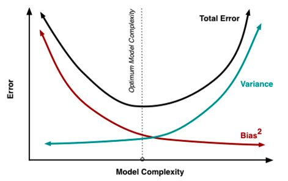

# Managing algorithmic complexity

```{r}
#| include: false
# centre all figures produced in this chapter
knitr::opts_chunk$set(fig.align = "center")
```

## Estimating error on the validation data

You probably remember from statistics that a more complex model always fits the training data better. The decisive question, however, is whether it also works better on new (independent) data. Technically, we call this the **out-of-sample error**, as opposed to the **in-sample error**, which is the error on the training data.

Error can be measured in different ways, but usually we calculate some kind of **accuracy** (especially for classification tasks) or how much variance is explained by our model (regression tasks). We also distinguish between the error used to *train* the model and the error used to *validate* it. The error the ML algorithm uses internally to train the model is what we call the **loss**: the smaller the loss, the better the model fits.

Losses can be used to validate a model, but they are often hard to interpret (they frequently live in the range $[0, \infty[$) and are not comparable across datasets because they are data-specific. Therefore, in practice, we use interpretable **validation metrics** that *can* be compared across datasets (e.g. model A achieves 80% accuracy on dataset A and 70% on dataset B). Here is an overview of some common validation metrics and their interpretation:

Validation metrics for classification tasks:

| Validation Metric | Range | Classification Types | Explanation |
|----|----|----|----|
| **A**rea **U**nder the **C**urve (AUC) | $[0, 1]$ | Binary Classification Tasks (e.g. Titanic Dataset, survived or died) | The ability of our models to distinguish between 0 and 1. Requires probability predictions. An AUC of 0.5 means that the algorithm is making random predictions. Lower than 0.5 –\> worse than random |
| Accuracy | $[0, 1]$ | All types of classifications (including multiclass tasks) | The accuracy of our models, how many of the predicted classes are correct. The baseline accuracy depends on the distributions of the classes (if one class occurs 99% in the data, a random model that will only predict this class, will achieve already a very high accuracy |

Validation metrics for regression tasks:

| Validation Metric | Range | Explanation |
|----|----|----|
| $R^2$ | $[0, 1]$ | How much variance is explained by our model. We usually use the sum of squares $R^2$ |
| Correlation factors (Pearson or Spearman) | $[-1, 1]$ | Measures correlation between predictions and observations. Spearman (rank correlation factor) can be useful for skewed distributed responses (or non-normal distributed responses, such as count data). |
| **R**oot **m**ean **s**quared **e**rror (RMSE) | $[0, \infty[$ | RMSE is not a really interpretable but it is still used as a common validation metrics (is also used as a loss to train models). The RMSE reports how much variance is unexplained (so smaller RMSE is better). However, RMSE is not really comparable between different data sets. |

### Splitting off validation data

To check the out-of-sample error, we usually split out some part of the data for later model validation. Let's look at this at the example of a supervised regression, trying to predict house prices in Boston.

```{r}
library(mlbench)

data(BostonHousing)
data = BostonHousing
set.seed(123)
```

Creating a split by deciding randomly for each data point if it is used for training or validation

```{r}
n = nrow(BostonHousing)
train = sample.int(n, size = round(0.7*n))
```

Fitting two lms, one with a few predictors, one with a lot of predictors (all interaction up to 3-way)

```{r}
m1 = lm(medv~., data = data[train,])
m2 = lm(medv~.^3, data = data[train,])
```

Testing predictive ability on training data (in-sample error)

```{r}
cor(predict(m1), data[train,]$medv)
cor(predict(m2), data[train,]$medv)
```

The more complex model `m2` is clearly better on the training data. As a next step, we test the predictive ability on the hold-out data (the **validation** set, i.e. the out-of-sample error):

```{r}
cor(predict(m1, newdata = data[-train,] ), 
    data[-train,]$medv)
cor(predict(m2, newdata = data[-train,] ), 
    data[-train,]$medv)

```

Now, m2 is much worse!

### Overfitting vs. underfitting

When the predictive performance drops sharply going from the training to the validation data, this signals **overfitting** — the model is too complex and has fit noise in the training data.

What about `m1` — is it just complex enough, or too simple? **Underfitting** cannot be diagnosed as directly; you have to test whether making the model more complex improves results on the validation data. Let's try a random forest:

```{r, message=FALSE}
library(randomForest)
m3 = randomForest(medv~., data = data[train,])
cor(predict(m3), data[train,]$medv)
cor(predict(m3, newdata = data[-train,] ), 
    data[-train,]$medv)
```

No drop on validation data (i.e. no overfitting), but error on training and validation is much better than for m1 - so this seems to be a better model, and m1 was probably underfitting, i.e. it was not complex enough to get good performance!

### Validation vs. cross-validation {#sec-cv}

A problem with a single validation split is that we test only on one fraction of the data (say 20% in an 80/20 split), so the estimate is noisy.

If it is computationally feasible, a better way to estimate the error is **cross-validation**: we repeat the train/validation split again and again until every observation has been used for validation exactly once, and then average the validation error.

Here is an example of a **k-fold cross-validation**, which is akin to repeating an 80/20 split five times.

::: column-margin
In **k-fold cross-validation** the data is split into $k$ equal parts ("folds"). Each fold serves once as the validation set while the model trains on the other $k-1$ folds; the $k$ error estimates are then averaged. Larger $k$ uses more data for training but costs more computation.
:::

```{r}
k = 5 # folds
split = sample.int(k, n, replace = T)
pred = rep(NA, n)

for(i in 1:k){
  m1 = randomForest(medv~., data = data[split != i,])
  pred[split == i] = predict(m1, newdata = data[split == i,])
}

cor(pred, data$medv)
```

## Optimizing the bias-variance trade-off

### The bias-variance trade-off

What we have just seen is an example of the **bias-variance trade-off**. The idea is to look at the error of the model on new test data, which comes from two contributions:

- **Bias** = systematic error that arises because the model is not flexible enough — related to underfitting.

- **Variance** = statistical error that arises because the estimates of the model parameters become more uncertain as we add complexity.

Optimizing the bias-variance trade-off means adjusting the complexity of the model which can be achieved by:

- Feature selection (more features increases the flexibility of the model)

- Regularization

::: {.webex-check .quiz}


```{r}
#| results: asis
#| echo: false
opts <- c(
   answer = "The goal of considering the bias-variance trade-off is to realize that increasing complexity typically leads to more flexibility (allowing you to reduce bias) but at the cost of uncertainty (variance) in the estimated parameters.",
   "The goal of considering the bias-variance trade-off is to get the bias of the model as small as possible."
)

cat("Which of the following statements about the bias-variance trade-off is correct? (see figure above)", longmcq(opts))
```
:::

### Feature selection

Adding features increases the flexibility of the model and the goodness of fit:

```{r}
library(mlbench)
library(dplyr)
data(BostonHousing)
data = BostonHousing

summary(lm(medv~rm, data = data))

summary(lm(medv~rm+dis, data = data))$r.squared

summary(lm(medv~., data = data))$r.squared

# Main effects + all potential interactions:
summary(lm(medv~.^2, data = data))$r.squared
```

The model with all features and their potential interactions has the highest $R^2$, but it also has the highest uncertainty because there are on average only 5 observations for each parameter (92 parameters and 506 observations). So how do we decide which level of complexity is appropriate for our task? For the data we use to train the model, $R^2$ will always get better with higher model complexity, so it is a poor decision criterion. We will show this in the @sec-cv section. In short, the idea is that we need to split the data so that we have an evaluation (test) dataset that wasn't used to train the model, which we can then use in turn to see if our model generalizes well to new data.

### Regularization

Regularization means adding information or structure to a system in order to solve an ill-posed optimization problem or to prevent overfitting. There are many ways of regularizing a machine learning model. The most important distinction is between *shrinkage estimators* and estimators based on *model averaging*.

**Shrinkage estimators** are based on the idea of adding a penalty to the loss function that penalizes deviations of the model parameters from a particular value (typically 0). In this way, estimates are *"shrunk"* to the specified default value. In practice, the most important penalties are the least absolute shrinkage and selection operator; also *Lasso* or *LASSO*, where the penalty is proportional to the sum of absolute deviations ($L1$ penalty), and the *Tikhonov regularization* aka *Ridge regression*, where the penalty is proportional to the sum of squared distances from the reference ($L2$ penalty). Thus, the loss function that we optimize is given by

$$loss = fit - \lambda \cdot d$$

where fit refers to the standard loss function, $\lambda$ is the strength of the regularization, and $d$ is the chosen metric, e.g. $L1$ or$L2$:

$$loss_{L1} = fit - \lambda \cdot \Vert weights \Vert_1$$

$$loss_{L2} = fit - \lambda \cdot \Vert weights \Vert_2$$

$\lambda$ and possibly d are typically optimized under cross-validation. $L1$ and $L2$ can be also combined what is then called *elastic net* (see @zou2005).

**Model averaging** refers to an entire set of techniques, including *boosting*, *bagging*, and other averaging methods. The general principle is that predictions are made by combining (averaging) several models. This rests on the insight that it is often more efficient to have many simpler models and average them than to build one "super model". The reasons are subtle, and explained in more detail in @dormann2018.

A particularly important application of averaging is **boosting**, where many weak learners are combined into a model average, resulting in a strong learner. A related method is **bootstrap aggregating**, also called **bagging**: the idea is to *bootstrap* the data (sample it with replacement) and average the predictions over the bootstrapped models.

To see how these techniques work in practice, let's first focus on LASSO and Ridge regularization for weights in neural networks. We can imagine that the LASSO and Ridge act similar to a rubber band on the weights that pulls them to zero if the data does not strongly push them away from zero. This leads to important weights, which are supported by the data, being estimated as different from zero, whereas unimportant model structures are reduced (shrunken) to zero.

LASSO $\left(penalty \propto \sum_{}^{} \mathrm{abs}(weights) \right)$ and Ridge $\left(penalty \propto \sum_{}^{} weights^{2} \right)$ have slightly different properties. They are best understood if we express those as the effective prior preference they create on the parameters:

```{r chunk_chapter4_10, echo = F, fig.cap="Effective parameter priors implied by the two penalties: LASSO (left) places a sharp peak at zero, Ridge (right) is smoother around zero."}
oldpar = par(mfrow = c(1, 2))
curve(dexp(abs(x)), -5, 5, main = "LASSO prior", xlab = "weight", ylab = "density")
curve(dnorm(abs(x)), -5, 5, main = "Ridge prior", xlab = "weight", ylab = "density")
par(oldpar)
```

As you can see, the LASSO creates a very strong preference towards exactly zero, but falls off less strongly towards the tails. This means that parameters tend to be estimated either to exactly zero, or, if not, they are more free than the Ridge. For this reason, LASSO is often more interpreted as a model selection method.

The Ridge, on the other hand, has a certain area around zero where it is relatively indifferent about deviations from zero, thus rarely leading to exactly zero values. However, it will create a stronger shrinkage for values that deviate significantly from zero.

#### Ridge - Example

We can use the `glmnet` package for Ridge, LASSO, and elastic-net regressions.

We want to predict the house prices of Boston (see help of the dataset):

```{r}
library(mlbench)
library(dplyr)
library(glmnet)
data(BostonHousing)
data = BostonHousing
Y = data$medv
X = data |> select(-medv, -chas) |> scale()
```

```{r, fig.cap="Distribution of the pairwise correlations among the (scaled) predictors."}
hist(cor(X), main = "", xlab = "Pairwise correlation", col = "grey80")
```

```{r}
m1 = glmnet(y = Y, x = X, alpha = 0)
```

The `glmnet` function automatically tests different values for lambda:

```{r}
cbind(coef(m1, s = 0.001), coef(m1, s = 100.5))
```

#### LASSO - Example

By changing $alpha$ to 1.0 we use a LASSO instead of a Ridge regression:

```{r}
m2 = glmnet(y = Y, x = X, alpha = 1.0)
cbind(coef(m2, s = 0.001), coef(m2, s = 0.5))
```

#### Elastic-net - Example

By setting $\alpha$ to a value between 0 and 1.0, we use a combination of LASSO and Ridge:

```{r}
m3 = glmnet(y = Y, x = X, alpha = 0.5)
cbind(coef(m3, s = 0.001), coef(m3, s = 0.5))
```

## Hyperparameter tuning {#sec-tuning}

### What is a hyperparameter?

Parameters such as $\lambda$ and $\alpha$ — which control the complexity of the model, or other aspects such as the learning or optimization — are called **hyperparameters**. Unlike ordinary parameters, they are not learned from the data during training but set beforehand.

**Hyperparameter tuning** is the process of finding the optimal set of hyperparameters for a given task. They are usually data-specific, so they have to be tuned for each dataset.

Let's have a look at this using our glmnet example — we can plot the effect of $\lambda$ on the coefficient estimates:

```{r, fig.cap="Ridge coefficient paths: each line is one coefficient as the penalty (top axis: number of non-zero coefficients) increases."}
plot(m1)
```

So which lambda should we choose now? If we calculate the model fit for different lambdas (e.g. using the RMSE):

```{r, fig.cap="Training RMSE as a function of the penalty $\\lambda$. The smallest $\\lambda$ (least regularization) gives the lowest training error."}
lambdas = seq(0.001, 1.5, length.out = 100)
RMSEs =
  sapply(lambdas, function(l) {
    prediction = predict(m1, newx = X, s = l)
    RMSE = Metrics::rmse(Y, prediction)
    return(RMSE)
    })
plot(lambdas, RMSEs, xlab = "Lambda", ylab = "RMSE", type = "l")
```

We see that the lowest lambda achieved the highest RMSE - which is not surprising because the unconstrained model, the most complex model, has the highest fit, so no bias but probably high variance (with respect to the bias-variance tradeoff).

### Tuning with a train / test split

We want a model that generalizes well to new data, which we need to "simulate" here by splitting of a holdout before the training and using the holdout then for testing our model. This split is often called the train / test split.

```{r}
set.seed(1)
library(mlbench)
library(dplyr)
library(glmnet)
data(BostonHousing)
data = BostonHousing
Y = data$medv
X = data |> select(-medv, -chas) |> scale()

# Split data
indices = sample.int(nrow(X), 0.2*nrow(X))
train_X = X[indices,]
test_X = X[-indices,]
train_Y = Y[indices]
test_Y = Y[-indices]

# Train model on train data
m1 = glmnet(y = train_Y, x = train_X, alpha = 0.5)

# Test model on test data
pred = predict(m1, newx = test_X, s = 0.01)

# Calculate performance on test data
Metrics::rmse(test_Y, pred)
```

Let's do it again for different values of lambdas:

```{r, fig.cap="Test RMSE versus $\\lambda$; the red line marks the $\\lambda$ with the lowest test error. Unlike the training error, this optimum is no longer at the smallest $\\lambda$."}
lambdas = seq(0.0000001, 0.5, length.out = 100)
RMSEs =
  sapply(lambdas, function(l) {
    prediction = predict(m1, newx = test_X, s = l)
    return(Metrics::rmse(test_Y, prediction))
    })
plot(lambdas, RMSEs, xlab = "Lambda", ylab = "RMSE", type = "l", las = 2)
abline(v = lambdas[which.min(RMSEs)], col = "red", lwd = 1.5)
```

Alternatively, you can run a cross-validation automatically to determine the hyperparameters for glmnet, using the `cv.glmnet` function. By default it does a 5-fold CV and tests different values of $\lambda$ in each split:

```{r, fig.cap="Cross-validated RMSE versus $\\log(\\lambda)$ from `cv.glmnet`. Dotted lines mark the minimum-error $\\lambda$ and the largest $\\lambda$ within one standard error of it."}
m1 = glmnet::cv.glmnet(x = X, y = Y, alpha = 0.5, nfolds = 5)
m1
plot(m1)
m1$lambda.min
```

So low values of $\lambda$ seem to achieve the lowest error, thus the highest predictive performance.

### Nested (cross)-validation

In the previous example, we have used the train/test split to find the best model. However, we have not done a validation split yet to see how the finally selected model would do on new data. This is absolutely necessary, because else you will overfit with your model selection to the test data.

If we have several nested splits, we talk about a nested validation / cross-validation. For each level, you can in principle switch between validation and cross-validation. Here, and example of tuning with a inner cross-validation and an outer validation.

```{r}
# outer split
validation = sample.int(n, round(0.2*n))
dat_X = X[-validation,]
dat_Y = Y[-validation]

# inner split
nI = nrow(dat_X)
hyperparameter = data.frame(alpha = c(0, 0.5, 1))
m = nrow(hyperparameter)
k = 5 # folds
split = sample.int(k, nI, replace = T)


# making predictions for all hyperparameters / splits
pred = matrix(NA, nI, m)
for(l in 1:m){
  for(i in 1:k){
    m1 = glmnet(y = dat_Y[split != i], x = dat_X[split != i,],
                alpha = hyperparameter$alpha[l])
    pred[split == i,l] = predict(m1, newx = dat_X[split == i,], s = 0.01)
  }
}

# getting best hyperparameter option on test
innerLoss = function(x) cor(x, dat_Y)
res = apply(pred, 2, innerLoss)
choice = which.max(res)

# fitting model again with best hyperparameters
# and all test / validation data
mFinal = glmnet(y = dat_Y, x = dat_X, alpha = hyperparameter$alpha[choice])

# testing final prediction on validation data
finalPred = predict(mFinal, newx = X[validation,], s = 0.01)

cor(finalPred,
    Y[validation])
```

## Exercise - Hyperparameter sensitivity and the bias-variance tradeoff

The goal of this exercise is to *see* the bias-variance tradeoff: we change one hyperparameter that controls model complexity and watch how the **training** and **validation** errors respond.

:::: exercise
#### How nodesize controls complexity

[**Level:** Beginner · **Time:** \~20 min]{.exercise-meta}

**Goal:** sweep the random forest hyperparameter `nodesize` and plot the training and validation error together to reveal under- and overfitting.

`nodesize` is the minimum number of observations in a terminal node: **larger `nodesize` -\> smaller, simpler trees -\> lower complexity** (and vice versa).

**Working alone or in a group?**

- *On your own:* run the sweep below, then repeat it for a second lever (e.g. `mtry` or `ntree`) and check whether the same pattern appears.
- *In a group of 3-4:* each person sweeps a *different* complexity lever (`nodesize`, `mtry`, `maxnodes`), then compare your curves and discuss whether the train-vs-validation pattern is the same for all of them.

We use the Boston housing data and a single train/validation split:

```{r}
library(randomForest)
library(mlbench)
set.seed(123)

data(BostonHousing)
data = BostonHousing
n = nrow(data)
train = sample(n, round(0.7 * n))

rmse = function(obs, pred) sqrt(mean((obs - pred)^2))
```

**Tasks**

1.  For a grid of `nodesize` values, fit a random forest on the training data and record both the **training** RMSE and the **validation** RMSE.
2.  Plot both error curves against `nodesize` in one figure.
3.  Describe what happens to each curve, and read off the `nodesize` with the lowest validation error -- the bias-variance sweet spot.

Quick check -- a large gap between training and validation error is a sign of: `r webexercises::mcq(c(answer = "high variance (overfitting)", "high bias (underfitting)", "a perfectly tuned model"))`

::: {.callout-tip collapse="true" appearance="simple" icon="false"}
## Need a hint?

Loop over `nodesize = c(1, 3, 5, 10, 20, 40, 80, 150)`. For each value, fit `randomForest(medv ~ ., data = data[train, ], nodesize = ...)`, then compute `rmse()` once on `data[train, ]` (training error) and once on `data[-train, ]` (validation error). Remember: small `nodesize` = complex model.
:::

`r hide("Show solution")`

```{r}
nodesizes = c(1, 3, 5, 10, 20, 40, 80, 150)
res = data.frame(nodesize = nodesizes, training = NA, validation = NA)

for (i in seq_along(nodesizes)) {
  rf = randomForest(medv ~ ., data = data[train, ], nodesize = nodesizes[i])
  res$training[i]   = rmse(data$medv[train],  predict(rf, data[train, ]))
  res$validation[i] = rmse(data$medv[-train], predict(rf, data[-train, ]))
}

matplot(res$nodesize, res[, c("training", "validation")],
        type = "b", pch = 19, log = "x", col = c("black", "red"),
        xlab = "nodesize (larger = simpler model)", ylab = "RMSE")
legend("topleft", c("training", "validation"),
       col = c("black", "red"), pch = 19, bty = "n")
```

*Training vs. validation RMSE as the random forest is made simpler (larger nodesize). The training error grows with simplicity while the validation error is U-shaped; the gap between the curves reflects the variance.*

As the trees are forced to be simpler (larger `nodesize`), the **training** error rises steadily -- a more complex model always fits the training data better. The **validation** error is U-shaped: very complex models (tiny `nodesize`) overfit, while overly simple models underfit. The lowest point of the validation curve is the best bias-variance compromise, and the vertical gap between the two curves reflects the **variance** of the model.

`r unhide()`
::::

## References {.unnumbered}
