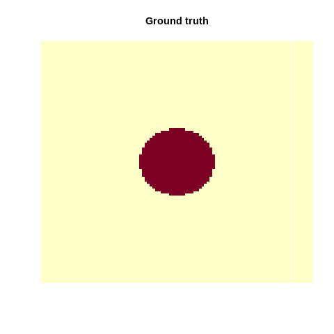

# Fundamental principles and techniques {#fund}

## Machine learning principles

### Optimization
from wikipedia: " an optimization problem is the problem of finding the best solution from all feasible solutions"

Why do we need this "optimization"?

We need to somehow tell the algorithm what it should learn. To do so we have the so called loss-function, which expresses what our goal is. But we also need to somewhow find the configurations for which the loss function is 
minimized. This is the job of the optimizer. Thus, an optimization consists of:

- A loss function (e.g. we tell in each training step the algorithm how many observations were miss-classified) guides the training of ML algorithms

- The optimizer, which tries to update the weights of the ML algorithms in a way that the loss function is minimized

Calculating analytically the global optima is a non-trivial problem and thus a bunch of diverse optimization algorithms evolved

Some optimization algorithms are inspired by biological systems e.g. Ants, Bee, or even slime algorithms. These optimizers are explained int the following video, have a look:

```{r, eval=knitr::is_html_output(excludes = "epub"), results = 'asis', echo = F}
cat(
'<iframe width="560" height="315" 
  src="https://www.youtube.com/embed/X-iSQQgOd1A"
  frameborder="0" allow="accelerometer; autoplay; encrypted-media;
  gyroscope; picture-in-picture" allowfullscreen>
  </iframe>'
)
```

#### Small optimization example
As an easy example for optimization we can think of a quadratic function:
```{r}
func = function(x) return(x^2)
```

This function is so easy, we can randomly prob it and identify the optimum by plotting

```{r}
a = rnorm(100)
plot(a, func(a))
```

The smallest value is at x = 0 (to be honest, we can calculate this for this simple case analytically)

We can also use an optimizer with the optim-function (the first argument is the starting value)

```{r}
opt = optim(1.0, func)
print(opt$par)
```

opt$par will return the best values found by the optimizer, which is really close to zeor :)


#### Advanced optimization example

Optimization is also done when fitting a linear regression model. Thereby, we optimize the weights (intercept and slope). But using lm (y~x) is too simple, we would like to do this by hand to also better understand what optimization is and how it works.

As an example we take the airquality data set. First, we have to be sure to have no NAs in there. Then we split into response (Ozone) and predictors (Month, Day, Solar.R, Wind, Temp).Additionally it is beneficial for the optimizer, when the different predictors have the same support, and thus we scale them. 


```{r}
data = airquality[complete.cases(airquality$Ozone) & complete.cases(airquality$Solar.R),]
X = scale(data[,-1])
Y = data$Ozone
```

The model we want to optimize: $ozone = Solar.R*X1 + Wind*X2 + Temp*X3 + Month*X4 + Day*X5 + X6$

As the we assume that the residuals are normally distributed, our loss function is the mean squared errors: mean(predicted ozone - true ozone)^2) 

Our task is now to find the parameters X1-X6 for which this loss function is the smallest. Therefore, we implement a function, that takes parameters and returns the loss.

```{r}
linear_regression = function(w) {
  pred = w[1]*X[,1] + # Solar.R
         w[2]*X[,2] + # Wind
         w[3]*X[,3] + # Temp
         w[4]*X[,4] + # Month
         w[5]*X[,5] +
         w[6]         # or X %*% w[1:5] + w[6]
  # loss  = MSE, we want to find the optimal weights 
  # to minimize the sum of squared residuals
  loss = mean((pred - Y)^2)
  return(loss)
}
```

For example we can sample some weights and see what the loss with this weights is.
```{r}
linear_regression(runif(6))
```

We can try to find the optimum bruteforce (which means we will use a random set of weights and see for which the loss function is smallest):

```{r}
random_search = matrix(runif(6*5000,-10,10), 5000, 6)
losses = apply(random_search, 1, linear_regression)
plot(losses, type = "l")
random_search[which.min(losses),]
```

Bruteforce isn't a good approach, it might work well with only a few parameters, but with increasing complexity and more parameters it will take a long time.

In R the optim function helps to get faster to the optimum.
```{r}
opt = optim(runif(6, -1, 1), linear_regression)
opt$par
```

By comparing the weights from the optimizer to the estimated weights of the lm() function, we see that our self-written code obtains the same weights as the lm.

```{r}
coef(lm(Y~X))
```

### Regularization

Regularization means adding information or structure to a system in order to solve an ill-posed optimization problem or to prevent overfitting. There are many ways of regularizing a ML model. The most important distinction is between shrinkage estimators and estimators based on model averaging. 

**Shrikage estimators** are based on the idea of adding a penalty to the loss function that penalizes deviations of the model parameters from a particular value (typically 0). In this way, estimates are *"shrunk"* to the specified default value. In practice, the most important penalties are the least absolute shrinkage and selection operator; also Lasso or LASSO, where the penality is proportional to the absolute deviation (L1 penalty), and the Tikhonov regularization aka ridge regression, where the penalty is proportional to the squared distance from the reference (L2 penalty). Thus, the loss function that we optimize is thus given by

$$
loss = fit - \lambda \cdot d
$$
where fit refers to the standard loss function, $\lambda$ is the strength of the regularization, and $d$ is the chosen metrics, e.g. L1 or L2:
$$
loss_{L1} = fit - \lambda \cdot \Vert weights \Vert_1
$$
$$
loss_{L2} = fit - \lambda \cdot \Vert weights \Vert_2
$$
$\lambda$ and possibly d are typically optimized under cross-validation. L1 and L2 can be also combined which is then called elastic net (see @zou2005)

**Model averaging** refers to an entire set of techniques, including boosting, bagging and other averaging techniques. The general principle is that predictions are made by combining (= averaging) several models. This is based on on the insight that it often more efficient to have many simpler models and average them, than to have one "super model". The reasons are complicated, and explained in more detail in @dormann2018.

A particular important application of averaging is boosting, where the principle is that many weak learners are combined to a model average, resulting in a strong learner. Another related method is bootstrap aggregating, also called bagging. Idea here is to boostrap the data, and average the boot-strapped predictions.

To see how these techniques work in practice, let's first focus on lasso and ridge regularization for weights in neural networks. We can imagine that the lasso and ridge act similar to a rubber band on the weights that pulls them to zero if the data does not strongly push them away from zero. This leads to important weights, which are supported by the data, being estimated as different from zero, whereas unimportant model structures are reduced (shrunk) to zero.

Lasso (penalty ~ abs(sum(Weights))) and ridge (penalty ~ (sum(Weights))^2) have slightly different properties, which are best understood if we express those as the effective prior preference that they create on the parameters:

```{r, echo = F}
par(mfrow = c(1,2))
curve(dexp(abs(x)), -5, 5, main = "Lasso prior")
curve(dnorm(abs(x)), -5, 5, main = "Ridge prior")
```

As you can see, the Lasso creates a very strong preference towards exactly zero, but falls off less strongly towards the tails. This means that parameters tend to be estimated either to exactly zero, or, if not, they are more free than the ridge. For this reason, Lasso is often interpreted more as a model selection method. 

The Ridge, on the other hand, has a certain area around zero where it is relatively indifferent about deviations from zero, thus rarely leading to exactly zero values. However, it will create a stronger shrinkage for values that deviate significantly from zero. 

We can implement the linear regression also in keras, when we do not specify any hidden layers

```{r, cache=TRUE}
library(keras)
data = airquality[complete.cases(airquality),]
X = scale(data[,-1])
Y = data$Ozone
# l1/l2 on linear model
model = keras_model_sequential()
model %>%
 layer_dense(units = 1L, activation = "linear", input_shape = list(dim(X)[2]))
summary(model)
model %>%
 compile(loss = loss_mean_squared_error, optimizer_adamax(lr = 0.5))
model_history =
 model %>%
 fit(x = X, y = Y, epochs = 50L, batch_size = 20L, shuffle = TRUE)
unconstrained = model$get_weights()
summary(lm(Y~X))
coef(lm(Y~X))
```

<details>
<summary>
**<span style="color: #CC2FAA">torch</span>**
</summary>
<p>
```{r}
library(torch)
model_torch = nn_sequential(
  nn_linear(in_features = dim(X)[2], out_features = 1L)
)
opt = optim_adam(params = model_torch$parameters, lr = 0.5)

X_torch = torch_tensor(X)
Y_torch = torch_tensor(matrix(Y, ncol = 1L), dtype = torch_float32())
for(i in 1:500) {
  indices = sample.int(nrow(X), 20L)
  opt$zero_grad()
  pred = model_torch(X_torch[indices, ])
  loss = nnf_mse_loss(pred, Y_torch[indices,,drop=FALSE])
  loss$sum()$backward()
  opt$step()
}
coef(lm(Y~X))
model_torch$parameters
```
</details>
<br/>


But keras also allows use to use lasso and ridge on the weights. 
Lets see what happens when we put a l1 (lasso) regularization on the weights:
```{r, cache=TRUE}
model = keras_model_sequential()
model %>%
  layer_dense(units = 1L, activation = "linear", input_shape = list(dim(X)[2]), 
              kernel_regularizer = regularizer_l1(10), bias_regularizer = regularizer_l1(10))
summary(model)
model %>%
  compile(loss = loss_mean_squared_error, optimizer_adamax(lr = 0.5), metrics = c(metric_mean_squared_error))
model_history =
  model %>%
  fit(x = X, y = Y, epochs = 30L, batch_size = 20L, shuffle = TRUE)
l1 = model$get_weights()
summary(lm(Y~X))
coef(lm(Y~X))
cbind(unlist(l1), unlist(unconstrained))
```

One can clearly see that parameters are pulled towards zero because of the regularization.

<details>
<summary>
**<span style="color: #CC2FAA">torch</span>**
</summary>
<p>
In torch, we have to specify the regularization on our own when calculating the loss.
```{r}
model_torch = nn_sequential(
  nn_linear(in_features = dim(X)[2], out_features = 1L)
)
opt = optim_adam(params = model_torch$parameters, lr = 0.5)

X_torch = torch_tensor(X)
Y_torch = torch_tensor(matrix(Y, ncol = 1L), dtype = torch_float32())
for(i in 1:500) {
  indices = sample.int(nrow(X), 20L)
  opt$zero_grad()
  pred = model_torch(X_torch[indices, ])
  loss = nnf_mse_loss(pred, Y_torch[indices,,drop=FALSE])
  
  ## Add l1:
  for(i in 1:length(model_torch$parameters)) loss = loss + model_torch$parameters[[i]]$abs()$sum()*10.0
  
  loss$sum()$backward()
  opt$step()
}
coef(lm(Y~X))
model_torch$parameters
```
</details>
<br/>


## Tree-based ML algorithms
Famous ML algorithms such as random Forest and gradient boosted trees are based on classification- and regression trees.

### Classification and Regression Trees
Tree-based models in general use a series of if-then rules to generate predictions from one or more decision trees.
In this lecture, we will explore regression and classifaction trees at the example of the airquality data set. There is one important hyper-parameter for regression trees: minsplit

- it controls the depth of tree (see the help of rpart for a description)
- it controls the complexity of the tree and thus also be seen as a regularization parameter

We first prepare and visualize the data and afterwards fit a decision tree. 

```{r}
library(rpart)
library(rpart.plot)
data=airquality[complete.cases(airquality),]
```

Fit and visualize a regression tree:

```{r}
rt = rpart(Ozone~., data = data,control = rpart.control(minsplit = 10))
rpart.plot(rt)
```

Visualize the predictions:

```{r}
pred = predict(rt, data)
plot(data$Temp, data$Ozone)
lines(data$Temp[order(data$Temp)], pred[order(data$Temp)], col = "red")
```

The angular form of the prediction line is typical for regression trees and is a weakness of it.


### Random Forest
To overcome this weakness, a random forest uses an ensemble of regression/classification trees. Thus, the random forest is in principle nothing else than a normal regression/classification tree, but it uses the idea of the "wisdom of the crowd": By asking many people (regression/classification trees) one can make a more informed decision (prediction/classification). When you buy a new phone for example you would also no directly go into the shop, but search in the internet and ask your friends and family.  

There are two randomization steps with the RF that are responsible for the success of RF:

- bootstrap sample for each tree (we will sample observations with replacement from the dataset, for the phone this is like that not everyone has experience about each phone)
- at each split, we will sample a subset of predictors which are then considered as potential splitting criterion (for the phone this is like that not everyone has the same decision criteria). 

Applying the random forest follows the same principle as for the methods before: we visualize the data (we have already done this so often for the airquality data set, thus we skip it here), fit the algorithm and then plot the outcomes.

Fit a RF and visualize the predictions:

```{r}
library(randomForest)
rf = randomForest(Ozone~., data = data)
pred = predict(rf, data)
plot(Ozone~Temp, data = data)
lines(data$Temp[order(data$Temp)], pred[order(data$Temp)], col = "red")
```

One advantage of RF is that we will get a variable importance. At each split in each tree, the improvement in the split-criterion is the importance measure attributed to the splitting variable, and is accumulated over all the trees in the forest separately for each variable. Thus the variable importance shows us how important a variable is averaged over all trees.

```{r}
rf$importance
```

There are several important hyperparameters in a random forest, that we can tune to get better results:

- Similar to the minsplit parameter in regression and classification trees, the hyper parameter nodesize controls for complexity -> Minimum size of terminal nodes in the tree. Setting this number larger causes smaller trees to be grown (and thus take less time). Note that the default values are different for classification (1) and regression (5).
- mtry - 	Number of features randomly sampled as candidates at each split.


### Boosted regression trees
RF fits hundreds of trees independent of each other. Here, the idea of a boosted regression tree comes in. Maybe we could learn from the errors the previous weak learners make and thus enhance the performance of the algorithm. 

Thus, a boosted regression tree (BRT) starts with a simple regression tree (weak learner) and then fits sequentially additional trees to improve the results.
There are two different strategies to do so:

- AdaBoost, wrong classified observations (by the previous tree) will get a higher weight and therefore the next trees will focus on difficult/missclassified observations.
- Gradient boosting (state of the art), each sequential model will be fit on the residual errors of the previous model.

We can fit a BRT using xgboost, but before we have to transform the data into a xgb.Dmatrix.
```{r BRT1,cache=TRUE}
library(xgboost)
data_xg = xgb.DMatrix(data = as.matrix(scale(data[,-1])), label = data$Ozone)
brt = xgboost(data_xg, nrounds = 16L, nthreads = 4L)
```

The nrounds controls how many sequantial trees we fit, in our example this was 16. When we predict to new data, we can limit the number of trees used to prevent overfitting (remeber: each new tree tries to improve the predictions of the previous trees). 

Let us visualize the predictions for different number of trees:
```{r BRT2,cache=TRUE}
par(mfrow = c(2,2))
for(i in 1:4){
  pred = predict(brt, newdata = data_xg, ntreelimit = i)
  plot(data$Temp, data$Ozone, main = i)
  lines(data$Temp[order(data$Temp)], pred[order(data$Temp)], col = "red")
}
```
There are also other ways to control for complexity of the BRT algorithm:

- max_depth, depth of each tree
- shrinkage (each tree will get a weight and the weight will decrease with the number of trees)

When having specified the final model, we can as for random forests get a variable importance:

```{r BRT3,cache=TRUE}
xgboost::xgb.importance(model = brt)
sqrt(mean((data$Ozone - pred)^2)) # RMSE
data_xg = xgb.DMatrix(data = as.matrix(scale(data[,-1])), label = data$Ozone)
```

One important strength of xgboost is that we can directly do a cross-validation (which is indepdent on the BRT itself!) and specify its properties with nfold (the original dataset is randomly partitioned intonfoldequal size subsamples and each time one of these data sets is used for predictions to judge the performance):

```{r BRT4,cache=TRUE}
brt = xgboost(data_xg, nrounds = 5L)
brt_cv = xgboost::xgb.cv(data = data_xg, nfold = 3L, nrounds = 3L, nthreads = 4L)
print(brt_cv)
```

If we do three-folded CV, we actually fit three different BRT models (xgboost models)

This now tells us how well the model performed.


## Distance-based algorithms
In this chapter, we introduce support-vector machines (SVMs) and other distance-based methods.

### k-nearest-neighbor
K Nearest Neighbour (kNN) is a simple algorithm that stores all the available cases and classifies the new data based on a similarity measure. It is mostly used to classifies a data point based on how its k nearest neighbours are classified.

Let us first see an example:
```{r}
X = scale(iris[,1:4])
Y = iris[,5]
plot(X[-100,1], X[-100,3], col = Y)
points(X[100,1], X[100,3], col = "blue", pch = 18, cex = 1.3)
```

Which class would you decide for the blue point? What are the classes of the nearest points? Well this procedure is used by the kNN and thus there is actually no "real" learning in a kNN.

For applying a kNN, we first have to scale teh data set, because we deal with distances and a priori want the same influence of all predictors (image one variable has values from -10.000 to 10.000 and one from -1 to 1, then the influence of the first variable on the distance to the other points is stronger than the second variable). As in the iris-data set there are no real test, we also have to split the data into train and test. Then we will follow the usual pipeline. 

```{r}
data = iris
data[,1:4] = apply(data[,1:4],2, scale)
indices = sample.int(nrow(data), 0.7*nrow(data))
train = data[indices,]
test = data[-indices,]
```

Fit model and create predictions:

```{r}
library(kknn)
knn = kknn(Species~., train = train, test = test)
summary(knn)
table(test$Species, fitted(knn))
```

 

### Support Vector Machines (SVM)
Support vectors machines have a different approach. They try to divide the predictor space into spaces sectors for each class. To do so a SVM fits the parameters of a hyperplane (a n-1 dimensional subspace in a n-dimensional space) in the predictor space by optimizing the distance between the hyperlane and the nearest point from each class. 

Fitting a SVM:

```{r}
library(e1071)
data = iris
data[,1:4] = apply(data[,1:4],2, scale)
indices = sample.int(nrow(data), 0.7*nrow(data))
train = data[indices,]
test = data[-indices,]

sm = svm(Species~., data = train, kernel = "linear")
pred = predict(sm, newdata = test)
```

```{r}
oldpar = par()
par(mfrow = c(1,2))
plot(test$Sepal.Length, test$Petal.Length, col =  pred, main = "predicted")
plot(test$Sepal.Length, test$Petal.Length, col =  test$Species, main = "observed")
par(oldpar)

mean(pred==test$Species) # accuracy
```


SVM can only work on linear separable problems (A problem is called linearly separable if there exists at least one line in the plane with all of the points of one class on one side of the hyperplane and all the points of the others classes on the other side).

If this is not possible, we however, can use the so called kernel trick, which maps the predictor space into a (higher dimensional) space in which the problem is linear separable. After having identified the boundaries in the higher-dimensional space, we can project them back into the original dimensions. 

```{r, eval=FALSE}
set.seed(42)
x1 = seq(-3, 3, length.out = 100)
x2 = seq(-3, 3, length.out = 100)
X = expand.grid(x1, x2)
y = apply(X, 1, function(x) exp(-x[1]^2 - x[2]^2))
y = ifelse(1/(1+exp(-y)) < 0.62, 0, 1)
image(matrix(y, 100, 100))
animation::saveGIF({
  for (i in c("truth","linear", "radial", "sigmoid")) {
    if(i == "truth"){
      image(matrix(y, 100,100),main = "Ground truth",axes = FALSE, las = 2)
    }else{
      sv = e1071::svm(x = X, y = factor(y), kernel = i)
      image(matrix(as.numeric(as.character(predict(sv, X))), 100,100),main = paste0("Kernel: ", i),axes = FALSE, las = 2)
      axis(1, at = seq(0,1, length.out = 10), labels = round(seq(-3,3, length.out = 10), 1))
      axis(2, at = seq(0,1, length.out = 10), labels = round(seq(-3,3, length.out = 10), 1), las = 2)
    }
  }
},movie.name = "svm.gif", autobrowse = FALSE)
```


```{r,echo=FALSE}

```

As you have seen this does not work with each kernel. Thus, the problem is to find the actual correct kernel, which is again an optimization procedure and can thus be approximated.

## Artificial neural networks
Now, we will come to artificial neural networks (ANNs), for which the topic of regularization is also important. We can specify the regularization in each layer via the kernel_regularization argument. 

```{r}
library(keras)
data = airquality
summary(data)
data = data[complete.cases(data),] # remove NAs
summary(data)
X = scale(data[,2:6])
Y = data[,1]
model = keras_model_sequential()
penalty = 0.1
model %>%
 layer_dense(units = 100L, activation = "relu", input_shape = list(5L), kernel_regularizer = regularizer_l1(penalty)) %>%
 layer_dense(units = 100L, activation = "relu", kernel_regularizer = regularizer_l1(penalty) ) %>%
 layer_dense(units = 100L, activation = "relu", kernel_regularizer = regularizer_l1(penalty)) %>%
 layer_dense(units = 1L, activation = "linear", kernel_regularizer = regularizer_l1(penalty)) # one output dimension with a linear activation function
summary(model)
model %>%
 compile(loss = loss_mean_squared_error, keras::optimizer_adamax(0.1))
model_history =
 model %>%
 fit(x = X, y = matrix(Y, ncol = 1L), epochs = 100L, batch_size = 20L, shuffle = TRUE, validation_split = 0.2)
plot(model_history)
weights = lapply(model$weights, function(w) w$numpy() )
fields::image.plot(weights[[1]])
```

<details>
<summary>
**<span style="color: #CC2FAA">torch</span>**
</summary>
<p>
Again, we have to do the regularization on our own:
```{r}
model_torch = nn_sequential(
  nn_linear(in_features = dim(X)[2], out_features = 100L),
  nn_relu(),
  nn_linear(100L, 100L),
  nn_relu(),
  nn_linear(100L, 100L),
  nn_relu(),
  nn_linear(100L, 1L),
)
opt = optim_adam(params = model_torch$parameters, lr = 0.1)

X_torch = torch_tensor(X)
Y_torch = torch_tensor(matrix(Y, ncol = 1L), dtype = torch_float32())
for(i in 1:500) {
  indices = sample.int(nrow(X), 20L)
  opt$zero_grad()
  pred = model_torch(X_torch[indices, ])
  loss = nnf_mse_loss(pred, Y_torch[indices,,drop=FALSE])
  
  ## Add l1 (only on the 'kernel weights'):
  for(i in seq(1, 8, by = 2)) loss = loss + model_torch$parameters[[i]]$abs()$sum()*0.1
  
  loss$sum()$backward()
  opt$step()
}
```

Let's visualize the first (input layer):
```{r}
fields::image.plot(as.matrix(model_torch$parameters$`0.weight`))
```

</details>
<br/>


Additionally to the usual l1 and l2 regularisation there is an additional regularisation: the so called dropout-layer (we will learn about this in more detail later).

Before we specialise on any tuning it is important to understand that ML always consists of a pipeline of actions. 

## The standard ML pipeline at the example of the titanic dataset
The typical ML workflow consist of:

- Data cleaning and exploration (EDA=explorative data analysis) with tidyverse
- Pre-processing and feature selection
- Splitting dataset into train and test set for evaluation
- Model fitting
- Model evaluation
- New predictions
Here is an (optional) video that explains the entire pipeline from a slightly different perspective


```{r, eval=knitr::is_html_output(excludes = "epub"), results = 'asis', echo = F}
cat(
'<iframe width="560" height="315" 
  src="https://www.youtube.com/embed/nKW8Ndu7Mjw"
  frameborder="0" allow="accelerometer; autoplay; encrypted-media;
  gyroscope; picture-in-picture" allowfullscreen>
  </iframe>'
)
```

In the following example, we use tidyverse, a collection of R packages for data science / data manipulation mainly developed by Hadley Wickham. A video that explains the basics can be found here 

```{r, eval=knitr::is_html_output(excludes = "epub"), results = 'asis', echo = F}
cat(
'<iframe width="560" height="315" 
  src="https://www.youtube.com/embed/nRtp7wSEtJA"
  frameborder="0" allow="accelerometer; autoplay; encrypted-media;
  gyroscope; picture-in-picture" allowfullscreen>
  </iframe>'
)
```

Another good reference is R for data science by Hadley [](https://r4ds.had.co.nz/)

For this lecture you need the titanic dataset provided by us. You can find it in GRIPS (datasets.RData in the dataset and submission section) or at [](http://rhsbio6.uni-regensburg.de:8500).

We have split the dataset already into training and testing datasets (the test split has one column less than the train split, as the result is not known a priori for the test)

### Data cleaning
Load necessary libraries:
```{r, message=FALSE}
library(keras)
library(tensorflow)
library(tidyverse)
```

Load dataset:
```{r}
load("datasets.RData")
# library(EcoData)
# data(titanic_ml)
# titanic = titanic_ml
data = titanic
```

Standard summaries:
```{r}
str(data)
summary(data)
head(data)
```

The name variable consists of 1309 unique factors (there are 1309 observations...):

```{r}
length(unique(data$name))
```

However, there is a title in each name. Let's extract the titles:

1. we will extract all names and split each name after each comma ","
2. we will split the second split of the name after a point "." and extract the titles
```{r}
first_split = sapply(data$name, function(x) stringr::str_split(x, pattern = ",")[[1]][2])
titles = sapply(first_split, function(x) strsplit(x, ".",fixed = TRUE)[[1]][1])
```

We get 18 unique titles:
```{r}
table(titles)
```


A few titles have a very low occurrence rate:
```{r}
titles = stringr::str_trim((titles))
titles %>%
 fct_count()
```

We will collapse titles with low occurrences into one title, which we can easily do with the forcats package.

```{r}
titles2 =
  forcats::fct_collapse(titles,
                        officer = c("Capt", "Col", "Major", "Dr", "Rev"),
                        royal = c("Jonkheer", "Don", "Sir", "the Countess", "Dona", "Lady"),
                        miss = c("Miss", "Mlle"),
                        mrs = c("Mrs", "Mme", "Ms")
                        )
```

We can count titles again to see the new number of titles

```{r}
titles2 %>%  
   fct_count()
```

Add new title variable to dataset:

```{r}
data =
  data %>%
    mutate(title = titles2)
```

As a second example, we will explore and clean the numeric "age" variable:

Explore the variable:
```{r}
summary(data)
sum(is.na(data$age))/nrow(data)
```

20% NAs!
Either we remove all observations with NAs, or we impute (fill) the missing values, e.g. with the median age. However, age itself might depend on other variables such as sex, class and title. We want to fill the NAs with the median age of these groups.
In tidyverse we can easily "group" the data, i.e. we will nest the observations (here: group_by after sex, pclass and title).
After grouping, all operations (such as our median(age....)) will be done within the specified groups.
 
```{r}
data =
  data %>%
    group_by(sex, pclass, title) %>%
    mutate(age2 = ifelse(is.na(age), median(age, na.rm = TRUE), age)) %>%
    mutate(fare2 = ifelse(is.na(fare), median(fare, na.rm = TRUE), fare)) %>%
    ungroup()
```
 

### Pre-processing and feature selection
We want to you keras in our example, but it cannot handle factors and requires scaled the data.

Normally, one would do this for all predictors, but as we here only showe the pipeline, we have sub-selected a bunch of predictors and do this only for them.

We first scale the numeric predictors abd change the factors with only two groups/levels into integer (this can be handled from keras)
```{r}
data_sub =
  data %>%
    select(survived, sex, age2, fare2, title, pclass) %>%
    mutate(age2 = scales::rescale(age2, c(0,1)), fare2 = scales::rescale(fare2, c(0,1))) %>%
    mutate(sex = as.integer(sex) - 1L, title = as.integer(title) - 1L, pclass = as.integer(pclass - 1L))
```

Factors with more than two levels, should be one hot encoded:
```{r}
one_title = k_one_hot(data_sub$title, length(unique(data$title)))$numpy()
colnames(one_title) = levels(data$title)

one_sex = k_one_hot(data_sub$sex, length(unique(data$sex)))$numpy()
colnames(one_sex) = levels(data$sex)

one_pclass = k_one_hot(data_sub$pclass,  length(unique(data$pclass)))$numpy()
colnames(one_pclass) = paste0(1:length(unique(data$pclass)), "pclass")
```
And we have to add the dummy encoded variables to the dataset:

```{r}
data_sub = cbind(data.frame(survived= data_sub$survived), one_title, one_sex, age = data_sub$age2, fare = data_sub$fare2, one_pclass)
head(data_sub)
```

### Split data for training and testing
The splitting consists of two splits:

- an outer split (the original split, remember we got a train and test split without the response "survived")
- an inner split (we will split further the train dataset into another train and test split with known response)
The inner split is important because to assess the model's performance and potential overfitting

Outer split:

```{r}
train = data_sub[!is.na(data_sub$survived),]
test = data_sub[is.na(data_sub$survived),]
```
Inner split:

```{r}
indices = sample.int(nrow(train), 0.7*nrow(train))
sub_train = train[indices,]
sub_test = train[-indices,]
```
What is the difference between the two splits? (Tip: have a look at the variable survived)

### Model fitting
In the next step we will fit a keras model on the train data of the inner split:
```{r}
model = keras_model_sequential()
model %>%
  layer_dense(units = 20L, input_shape = ncol(sub_train) - 1L, activation = "relu") %>%
  layer_dense(units = 20L, activation = "relu") %>%
  layer_dense(units = 20L, activation = "relu") %>%
  layer_dense(units = 2L, activation = "softmax")
summary(model)
model_history =
model %>%
  compile(loss = loss_categorical_crossentropy, optimizer = keras::optimizer_adamax(0.01))
model_history =
  model %>%
    fit(x = as.matrix(sub_train[,-1]), y = to_categorical(sub_train[,1],num_classes = 2L), epochs = 100L, batch_size = 32L, validation_split = 0.2, shuffle = TRUE)

plot(model_history)
```

<details>
<summary>
**<span style="color: #CC2FAA">torch</span>**
</summary>
<p>
```{r}
model_torch = nn_sequential(
  nn_linear(in_features = dim(sub_train[,-1])[2], out_features = 20L),
  nn_relu(),
  nn_linear(20L, 20L),
  nn_relu(),
  nn_linear(20L, 2L)
)
opt = optim_adam(params = model_torch$parameters, lr = 0.01)

X_torch = torch_tensor( as.matrix(sub_train[,-1])) 
Y_torch = torch_tensor(sub_train[,1]+1, dtype= torch_long())
for(i in 1:500) {
  indices = sample.int(nrow(sub_train), 20L)
  opt$zero_grad()
  pred = model_torch(X_torch[indices, ])
  loss = nnf_cross_entropy(pred, Y_torch[indices], reduction = "mean")
  print(loss)
  loss$backward()
  opt$step()
}
```
Note: the 'nnf_cross_entropy' expects predictions on the scale of the linear predictors (the loss function itself will apply the softmax!)
</details>
<br/>


### Model evaluation
We will predict survived for the test data of the inner split and calculate the accuracy:

```{r}
preds =
  model %>%
    predict(x = as.matrix(sub_test[,-1]))
predicted = ifelse(preds[,2] < 0.5, 0, 1)
observed = sub_test[,1]
(accuracy = mean(predicted == observed))
```


<details>
<summary>
**<span style="color: #CC2FAA">torch</span>**
</summary>
<p>
```{r}
model_torch$eval()
preds_torch = nnf_softmax( model_torch(torch_tensor(as.matrix(sub_test[,-1]))) , dim = 2L)
preds_torch = as.matrix(preds_torch)
preds_torch = apply(preds_torch, 1, which.max)
(accuracy = mean(preds_torch-1 == observed))
```
Now we have to use the softmax function.
</details>
<br/>


### Predictions and submission
When we are satisfied with the performance of our model in the inner split, we will create predictions for the test data of the outer split:

To do so, we select all observations that belong to the outer test split (use the filter function) and remove the survived (NAs) columns
```{r}
submit = 
  test %>% 
      select(-survived)
```

We cannot assess the performance on the test split because the true survived ratio is unknown, however, we can now submit our predictions to the submission server at 
http://rhsbio7.uni-regensburg.de:8500
To do so, we have to transform our survived probabilities into actual 0/1 predictions (probabilities are not allowed) and create a csv:

```{r}
pred = model %>% 
  predict(as.matrix(submit))

```

All values > 0.5 will be set to 1 and values < 0.5 to zero.
For the submission it is critical to change the predictions into a data.frame, select the second column (the probablity to survive), and save it with the write.csv function:
```{r,eval=FALSE}
write.csv(data.frame(y=pred[,2]), file = "Max_1.csv")
```

The file name is used as the ID on the submission server, so change it to whatever you want as long as you can identify yourself. 

## Bonus - ML pipelines with mlr3 {#mlr}

As we have seen today, many of the ML algorithms are distributed over several packages but the general ML pipeline is very similar for all models: feature engineering, feature selection?, hyper-parameter tuning and cross validation. 

The idea of the mlr3 framework is now to provide a general ML interface which you can use to build reproducible and automatic ML pipelines. The key features of mlr3 are:

* All common ML packages are integrated into mlr3, you can easily switch between different ML algorithms
* A common 'language'/workflow to specify ML pipelines
* Support for different CV strategies
* Hyper-parameter tuning for all supported ML algorithms
* Ensemble models

Useful links:

* [mlr3-book](https://mlr3book.mlr-org.com/) (still in work)
* [mlr3 website](https://mlr3.mlr-org.com/)
* [mlr3 cheatsheet](https://cheatsheets.mlr-org.com/mlr3.pdf)

### mlr3 - the basic workflow
The mlr3 actually consists of several packages for different tasks (e.g. mlr3tuning for hyper-parameter tuning, mlr3pipelines for data preparation pipes).
But let's start with the basic workflow.
```{r,message=FALSE}
library(EcoData)
library(tidyverse)
library(mlr3)
library(mlr3learners)
library(mlr3pipelines)
library(mlr3tuning)
library(mlr3measures)
data(nasa)
str(nasa)
```

Let's drop time, name, ID variable, and create a classification task:
```{r}
data = nasa %>% select(-Orbit.Determination.Date, -Close.Approach.Date, -Name, -Neo.Reference.ID)
data$Hazardous = as.factor(data$Hazardous)


# create a classification task
task = TaskClassif$new(id = "nasa", backend = data, target = "Hazardous", positive = "1")
```

Create a generic pipeline of data transformation (imputation -> scaling -> encoding of categorical variables):
```{r}
# let's create the preprossing graph
preprocessing = po("imputeoor") %>>% po("scale") %>>% po("encode") 

# run the task trhough it
transformed_task = preprocessing$train(task)[[1]]

transformed_task$missings()

```

We can even visualize the pre-processing graph:
```{r}
preprocessing$plot()
```

Now, to test our model (randomForest) by 10-CV, we will:

* specify the missing target rows as validation so that they will be ignores
* specify the CV, the learner (the ML model we want to use), and the measurement (AUC)
* run (benchmark) our model

```{r mlr1}
transformed_task$data()
transformed_task$set_row_roles((1:nrow(data))[is.na(data$Hazardous)], "validation")

cv10 = mlr3::rsmp("cv", folds = 10L)
rf = lrn("classif.ranger", predict_type = "prob")
measurement =  msr("classif.auc")

```


```{r,eval=FALSE}
result = mlr3::resample(transformed_task, rf, resampling = cv10, store_models = TRUE)

# calclate the average AUC of the holdouts
result$aggregate( measurement )
```

Very cool! Pre-processing + CV10 model evaluation in a few lines of code!

Let's create the final predictions:
```{r mlr2,eval=FALSE}
preds = 
  sapply(1:10, function(i) result$learners[[i]]$predict(transformed_task, 
                                                        row_ids = (1:nrow(data))[is.na(data$Hazardous)])$data$prob[,"1",drop=FALSE])
dim(preds)
predictions = apply(preds, 1, mean)
```
You could now submit the predictions [here](http://rhsbio7.uni-regensburg.de:8500)

But we are still not happy, let's do some hyper-parameter tuning!

### mlr3 - hyper-parameter tuning
ML algorithms have a varying number of hyper-parameters which can (!!!) have a high impact on the predictive performance. To list a few hyper parameters:

**Random Forest**

* mtry
* min node size

**kNN**

* kernel
* number of neighbors
* distance metric

**BRT**

* nrounds
* max depth
* alpha
* booster
* eta
* gamma
* lambda

With mlr3, we can easily extend the above example to do hyper-parameter tuning within nested cross-validation (the tuning has its own inner CV)

Print the hyper-parameter space of our RF learner:
```{r}
rf$param_set
```


Define the hyper-parameter space of RF:

```{r mlr3}
library(paradox)
rf_pars = 
    paradox::ParamSet$new(
      list(paradox::ParamInt$new("min.node.size", lower = 1, upper = 30L),
           paradox::ParamInt$new("mtry", lower = 1, upper = 30L),
           paradox::ParamLgl$new("regularization.usedepth", default = TRUE)))
print(rf_pars)
```

To setup the tuning pipeline we need:

* inner CV resample object
* tuning criterion (e.g. AUC)
* tuning method (e.g. random or block search)
* tuning terminator (when should we stop tune? E.g. after n iterations)


```{r mlr4}
inner3 = mlr3::rsmp("cv", folds = 3L)
measurement =  msr("classif.auc")
tuner =  mlr3tuning::tnr("random_search") 
terminator = mlr3tuning::trm("evals", n_evals = 5L)
rf = lrn("classif.ranger", predict_type = "prob")

learner_tuner = AutoTuner$new(learner = rf, 
                              measure = measurement, 
                              tuner = tuner, 
                              terminator = terminator,
                              search_space = rf_pars,
                              resampling = inner3)
print(learner_tuner)
```

Now we can wrap it normally into the 10-CV setup as previously:
```{r,eval=FALSE}
outer3 = mlr3::rsmp("cv", folds = 3L)
result = mlr3::resample(transformed_task, learner_tuner, resampling = outer3, store_models = TRUE)

# calclate the average AUC of the holdouts
result$aggregate( measurement )
```
Yeah, we were able to improve the performance!

Let's create the final predictions:
```{r,eval=FALSE}
preds = 
  sapply(1:3, function(i) result$learners[[i]]$predict(transformed_task, 
                                                        row_ids = (1:nrow(data))[is.na(data$Hazardous)])$data$prob[,"1",drop=FALSE])
dim(preds)
predictions = apply(preds, 1, mean)
```


### mlr3 - hyper-parameter tuning with oversampling
Let's go one step back, maybe you have noticed that our classes are unbalanced:
```{r}
table(data$Hazardous)
```
Many ML algorithms have problems with unbalanced data because if the imbalance is too strong it is cheaper for the algorithm to focus on only one class (e.g. by predicting only 0s oder 1s). You need to keep in mind that ML algorithms are greedy and their main focus is to minimize the loss function.

There are few techniques to correct for imbalance:

* oversampling (oversample the undersampled class)
* undersampling (undersample the oversampled class)
* SMOTE synthetic minority over-sampling technique (in short, we will use a kNN to create new samples around our undersampled class)

Here, we will use oversampling which we can do by extending our rf learner:
```{r}
rf_over = po("classbalancing", id = "over", adjust = "minor")  %>>%  rf

# However rf_over is now a "graph", but we can easily transform it back into a learner:
rf_over_learner = GraphLearner$new(rf_over)
print(rf_over_learner)
```
The learner has now a new feature space:

```{r}
rf_over_learner$param_set
```
We can also tune the oversampling rate!
```{r}
rf_pars_over = 
    paradox::ParamSet$new(
      list(paradox::ParamInt$new("over.ratio", lower = 1, upper = 7L),
           paradox::ParamInt$new("classif.ranger.min.node.size", lower = 1, upper = 30L),
           paradox::ParamInt$new("classif.ranger.mtry", lower = 1, upper = 30L),
           paradox::ParamLgl$new("classif.ranger.regularization.usedepth", default = TRUE)))

inner3 = mlr3::rsmp("cv", folds = 3L)
measurement =  msr("classif.auc")
tuner =  mlr3tuning::tnr("random_search") 
terminator = mlr3tuning::trm("evals", n_evals = 5L)

learner_tuner_over = AutoTuner$new(learner = rf_over_learner, 
                                   measure = measurement, 
                                   tuner = tuner, 
                                   terminator = terminator,
                                   search_space = rf_pars_over,
                                   resampling = inner3)
print(learner_tuner)
```

```{r,eval=FALSE}
outer3 = mlr3::rsmp("cv", folds = 3L)
result = mlr3::resample(transformed_task, learner_tuner_over, resampling = outer3, store_models = TRUE)

# calclate the average AUC of the holdouts
result$aggregate( measurement )
```


5 iterations in the hyper-space is not very much...

Let's create the final predictions:
```{r,eval=FALSE}
preds = 
  sapply(1:3, function(i) result$learners[[i]]$predict(transformed_task, 
                                                        row_ids = (1:nrow(data))[is.na(data$Hazardous)])$data$prob[,"1",drop=FALSE])
dim(preds)
predictions = apply(preds, 1, mean)
```

