--- 
title: "Machine Learning and AI in TensorFlow and R"
author: "Maximilian Pichler and Florian Hartig"
date: "2021-05-06"
site: bookdown::bookdown_site
output: 
  bookdown::gitbook:
    highlight: kate
documentclass: book
bibliography: ["packages.bib", "literature.bib"]
biblio-style: "apalike"
link-citations: yes
github-repo: rstudio/bookdown-demo
description: "Machine Learning and AI in TensorFlow and R"
---

# Prerequisites


**R system**

Make sure you have a recent version of R (>=3.6, ideally >=4.0) and RStudio on your computers. 

**Keras and tensorflow**

If you want to run the code on your own laptops, you also will need to install TensorFlow / Keras for R. For this, the following should work for most people:

Run in R: 

```r
install.packages("keras", dependencies = T)
keras::install_keras()
```

This should work on most computers, in particular of all software is recent. Sometimes, however, things don't work well, in particular the python distribution often makes problems. If the install does not work for you, we can look at it on Monday together. Also, we will provide some virtual machines in case your computers / laptops are too old or you don't manage to install tensorflow.

**Torch for R**

We may also use Torch for R. This is an R frontend for the popular PyTorch framework. To install torch, type in R:


```r
install.packages("torch")
library(torch)
```

**EcoData**

Finally, we may sometimes use datasets from the EcoData package. To install the package, run:

```r
devtools::install_github(repo = "florianhartig/EcoData", subdir = "EcoData", 
dependencies = TRUE, build_vignettes = TRUE)
```

<!--chapter:end:index.Rmd-->

---
output: html_document
editor_options: 
  chunk_output_type: console
---


# Introduction to Machine Learning {#introduction}

There are three basic ML tasks

* Unsupervised learning
* Supervised learning
* Reinforcement learning

**Unsupervised learning** is a technique, where one does not need to supervise the model. Instead, you allow the model to work on its own to discover information.

In **supervised learning**, you train an algorithm using labeled data, which means that you already know the correct answer for a part of the data (the so called tracings data). 

**Reinforcement learning** is a technique that emulates a game-like situation. The algorithm comes up with a solution by try and error and gets for the actions ether rewards or penalties. As in games, the goal is to maximize the rewards. We will talk on the last day more about this technique.

For the moment, we will focus on the first two tasks, supervised and unsupervised learning. To do so, we will first start with a small example, but before you start with the code, here a video to remind you of what we talked about in the class:

<iframe width="560" height="315" 
  src="https://www.youtube.com/embed/1AVrWvRvfxs"
  frameborder="0" allow="accelerometer; autoplay; encrypted-media;
  gyroscope; picture-in-picture" allowfullscreen>
  </iframe>


## Unsupervised learning

In unsupervised learning, we  want to identify patterns in data without having any examples (supervision) about what the correct patterns / classes are. As an example, consider our iris dataset. Here, we have 150 observations of 4 floral traits


```r
colors = hcl.colors(3)
traits = as.matrix(iris[,1:4]) 
species = iris$Species
image(y = 1:4, x = 1:length(species) , z = traits, 
      ylab = "Floral trait", xlab = "Individual")
```

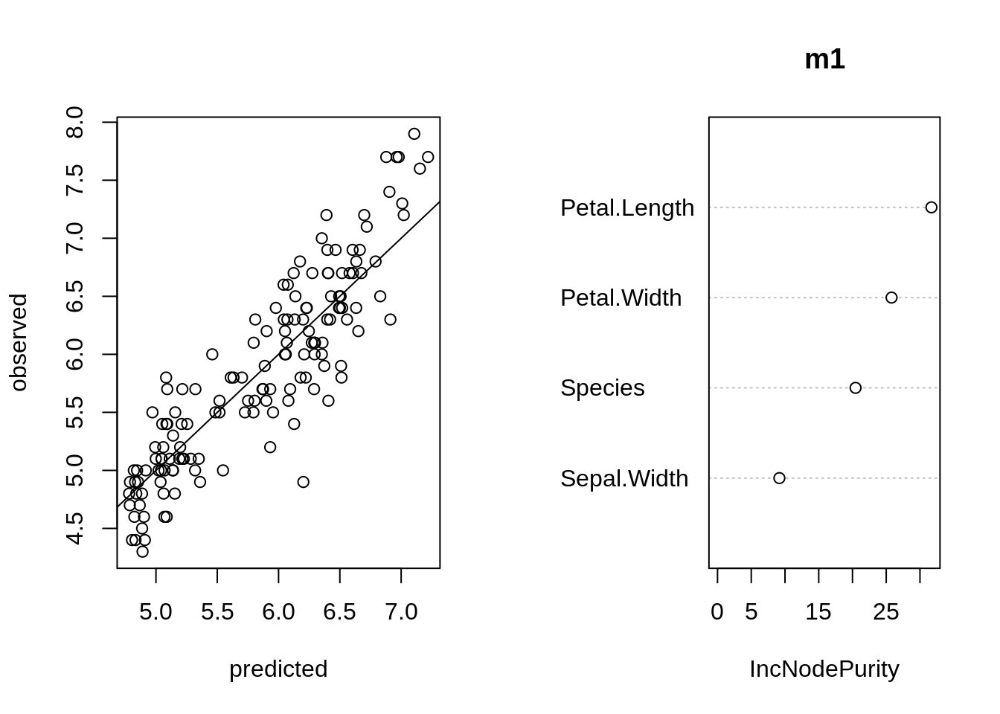

The observations are from 3 species, and indeed those species tend to have different traits, meaning that the observations form 3 clusters. 


```r
pairs(traits, pch = as.integer(species), col = colors[as.integer(species)])
```

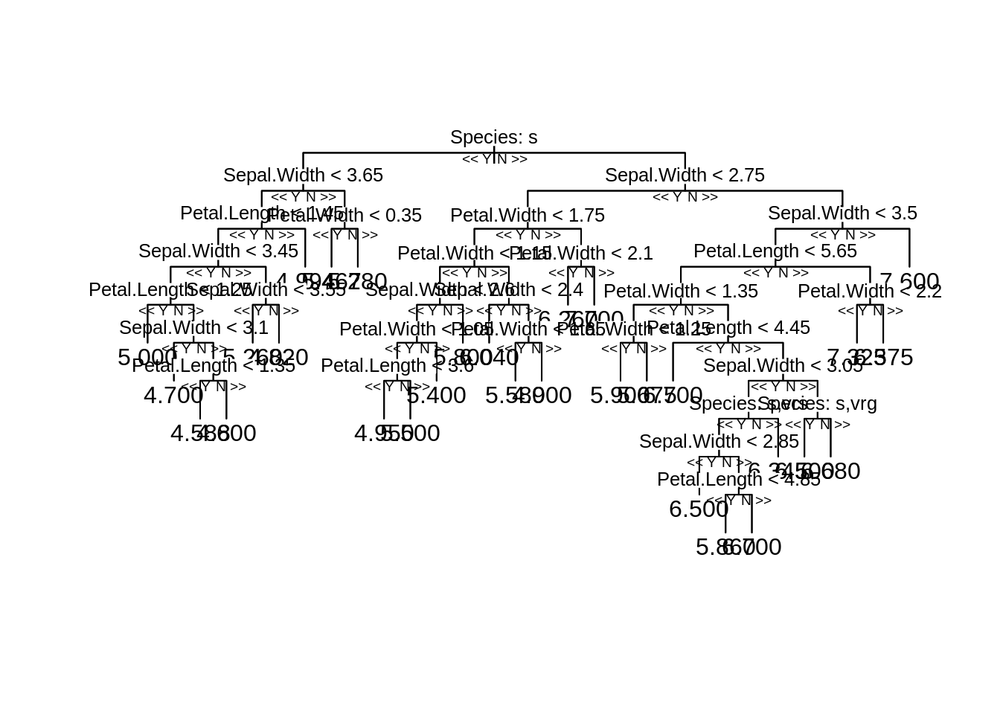

However, imagine we didn't know what species are, which is basically the situation in which people in the antique have been. The people just noted that some plants have different flowers than others, and decided to give them different names. This kind of process is what unsupervised learning does.

### Hierarchical clustering

Build up a hierarchy (tree) between data points

* Agglomerative: start with each data point in their own cluster, merge them up hierarchically
* Divisive: start with all data in one cluster, and split hierarchically

Merges / splits are done according to linkage criterion, which measures distance between (potential) clusters. Cut the tree at a certain height to get clusters. 

Here an example


```r
set.seed(123)

d = dist(traits)
hc <- hclust(d, method = "complete")

plot(hc)
rect.hclust(hc, k = 3)
```

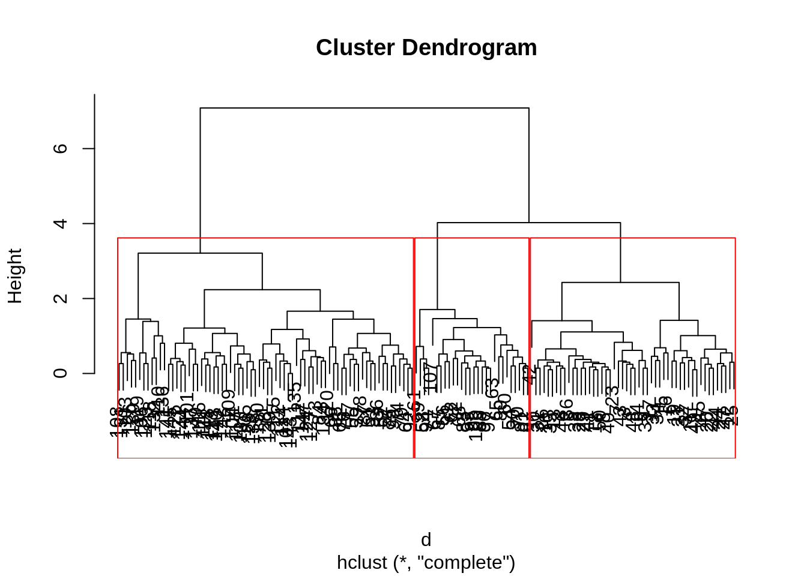

Same plot, but with colors for true species identity


```r
library(ape)
plot(as.phylo(hc), 
     tip.color = colors[as.integer(species)], 
     direction = "downwards")
```


```r
hcRes3 <- cutree(hc, k = 3)
```

Calculate confusion matrix - note we switching labels here so that it fits to the species


```r
tmp <- hcRes3
tmp[hcRes3 == 2] = 3
tmp[hcRes3 == 3] = 2
hcRes3 <- tmp
table(hcRes3, species)
```

```
##       species
## hcRes3 setosa versicolor virginica
##      1     50          0         0
##      2      0         27         1
##      3      0         23        49
```

Note that results might change if you choose a different agglomeration method, distance metric, or whether you scale your variables. Compare, e.g. to this example


```r
hc <- hclust(d, method = "ward.D2")

plot(as.phylo(hc), 
     tip.color = colors[as.integer(species)], 
     direction = "downwards")
```

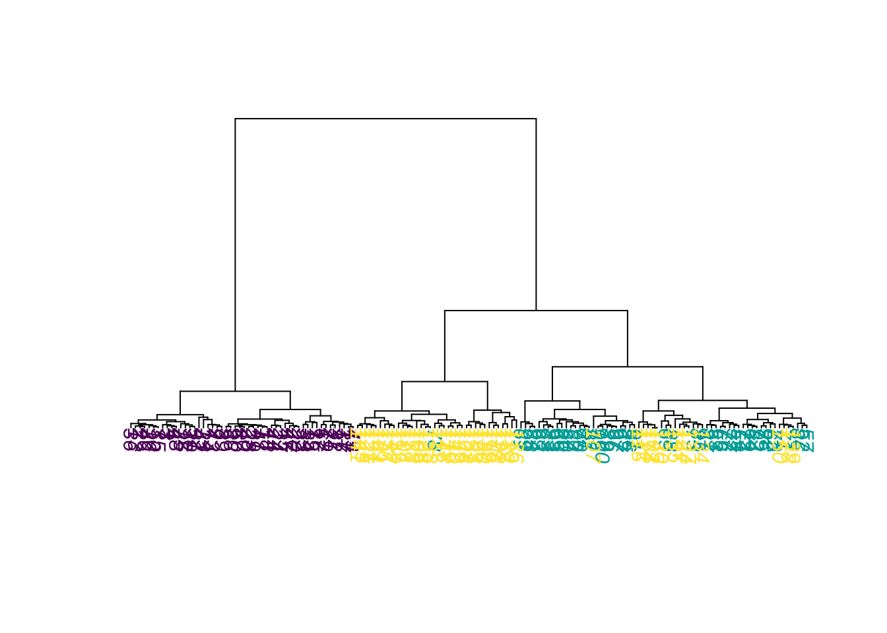

```r
hcRes3 <- cutree(hc, k = 3)
table(hcRes3, species)
```

```
##       species
## hcRes3 setosa versicolor virginica
##      1     50          0         0
##      2      0         49        15
##      3      0          1        35
```

Which method is best? 


```r
library(dendextend)
```

```
## 
## ---------------------
## Welcome to dendextend version 1.14.0
## Type citation('dendextend') for how to cite the package.
## 
## Type browseVignettes(package = 'dendextend') for the package vignette.
## The github page is: https://github.com/talgalili/dendextend/
## 
## Suggestions and bug-reports can be submitted at: https://github.com/talgalili/dendextend/issues
## Or contact: <tal.galili@gmail.com>
## 
## 	To suppress this message use:  suppressPackageStartupMessages(library(dendextend))
## ---------------------
```

```
## 
## Attaching package: 'dendextend'
```

```
## The following objects are masked from 'package:ape':
## 
##     ladderize, rotate
```

```
## The following object is masked from 'package:stats':
## 
##     cutree
```

```r
methods <- c("ward.D", "single", "complete", "average", "mcquitty", "median", "centroid", "ward.D2")
out <- dendlist()
for(i in seq_along(methods)) {
  res <- hclust(d, method = methods[i])   
  out <- dendlist(out, as.dendrogram(res))
}
names(out) <- methods
out
```

```
## $ward.D
## 'dendrogram' with 2 branches and 150 members total, at height 199.6205 
## 
## $single
## 'dendrogram' with 2 branches and 150 members total, at height 1.640122 
## 
## $complete
## 'dendrogram' with 2 branches and 150 members total, at height 7.085196 
## 
## $average
## 'dendrogram' with 2 branches and 150 members total, at height 4.062683 
## 
## $mcquitty
## 'dendrogram' with 2 branches and 150 members total, at height 4.497283 
## 
## $median
## 'dendrogram' with 2 branches and 150 members total, at height 2.82744 
## 
## $centroid
## 'dendrogram' with 2 branches and 150 members total, at height 2.994307 
## 
## $ward.D2
## 'dendrogram' with 2 branches and 150 members total, at height 32.44761 
## 
## attr(,"class")
## [1] "dendlist"
```

```r
get_ordered_3_clusters <- function(dend) {
  cutree(dend, k = 3)[order.dendrogram(dend)]
}
dend_3_clusters <- lapply(out, get_ordered_3_clusters)
compare_clusters_to_iris <- function(clus) {FM_index(clus, rep(1:3, each = 50), assume_sorted_vectors = TRUE)}
clusters_performance <- sapply(dend_3_clusters, compare_clusters_to_iris)
dotchart(sort(clusters_performance), xlim = c(0.3,1),
         xlab = "Fowlkes-Mallows index",
         main = "Performance of linkage methods \n in detecting the 3 species",
         pch = 19)
```

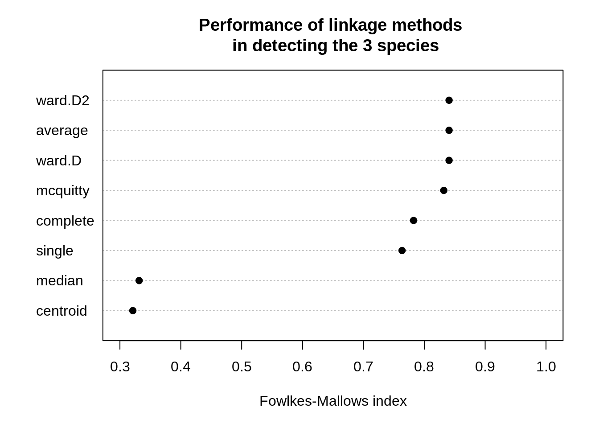


We might conclude here that ward.D2 works best. However, as we will learn later, optimizing the method without a hold-out for testing means that we may be overfitting. We should check this using cross-validation. 

### k-means clustering

Another example for an unsupervised learning algorithm is k-means clustering, one of the simplest and most popular unsupervised machine learning algorithms.

A cluster refers to a collection of data points aggregated together because of certain similarities. In our example from above this similarities could be similar flowers aggregated together to a plant. 

To start with the algorithm, you first have to specify the number of clusters (for our example the number of species). Each cluster has a centroid, which is the imaginary or real location representing the center of the cluster (for our example this would be how an average plant of a specific species would look like). The algorithm starts by randomly putting centroids somewhere and then adds each new data point to the cluster which minimizes the overall in-cluster sum of squares. After the algorithm has assigned a new data point to a cluster the centroid gets updated. By iterating this procedure for all data points and then starting again, the algorithm can find the optimum centroids and the data-points belonging to this cluster.

The k in K-means refers to the number of clusters and the ‘means’ refers to averaging of the data-points to find the centroids.

A typical pipeline for using kmeans clustering looks the same as for the other algortihms. After having visualized the data, we fit the model, visualize the results and have a look at the performance by use of the confusion matrix.


```r
set.seed(123)

kc <- kmeans(traits, 3)
kc
```

```
## K-means clustering with 3 clusters of sizes 50, 62, 38
## 
## Cluster means:
##   Sepal.Length Sepal.Width Petal.Length Petal.Width
## 1     5.006000    3.428000     1.462000    0.246000
## 2     5.901613    2.748387     4.393548    1.433871
## 3     6.850000    3.073684     5.742105    2.071053
## 
## Clustering vector:
##   [1] 1 1 1 1 1 1 1 1 1 1 1 1 1 1 1 1 1 1 1 1 1 1 1 1 1 1 1 1 1 1 1 1 1 1 1 1 1 1 1 1 1 1 1 1 1 1 1 1 1 1 2 2 3 2 2 2 2 2 2
##  [60] 2 2 2 2 2 2 2 2 2 2 2 2 2 2 2 2 2 2 3 2 2 2 2 2 2 2 2 2 2 2 2 2 2 2 2 2 2 2 2 2 2 3 2 3 3 3 3 2 3 3 3 3 3 3 2 2 3 3 3
## [119] 3 2 3 2 3 2 3 3 2 2 3 3 3 3 3 2 3 3 3 3 2 3 3 3 2 3 3 3 2 3 3 2
## 
## Within cluster sum of squares by cluster:
## [1] 15.15100 39.82097 23.87947
##  (between_SS / total_SS =  88.4 %)
## 
## Available components:
## 
## [1] "cluster"      "centers"      "totss"        "withinss"     "tot.withinss" "betweenss"    "size"         "iter"        
## [9] "ifault"
```

Visualizing the results. Color codes true species identity, symbol shows cluster result


```r
plot(iris[c("Sepal.Length", "Sepal.Width")], col =  colors[as.integer(species)], pch = kc$cluster)
points(kc$centers[, c("Sepal.Length", "Sepal.Width")], col = colors, pch = 1:3, cex = 3)
```

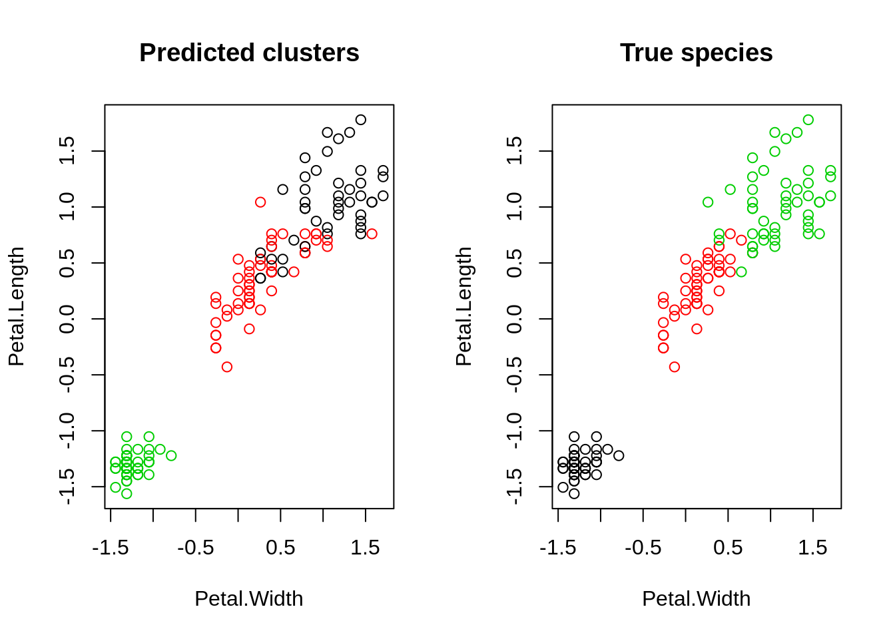

We see that there are are some discrepancies. Confusion matrix:

```r
table(iris$Species, kc$cluster)
```

```
##             
##               1  2  3
##   setosa     50  0  0
##   versicolor  0 48  2
##   virginica   0 14 36
```

If you want to animate the clustering process, you could run 


```r
library(animation)
saveGIF(kmeans.ani(x = traits[,1:2], col = colors), interval = 1, ani.width = 800, ani.height = 800)
```

Ellbow technique to determine the number of clusters


```r
getSumSq <- function(k){kmeans(traits, k, nstart=25)$tot.withinss}
iris.kmeans1to10 <- sapply(1:10, getSumSq)
plot(1:10, iris.kmeans1to10, type="b", pch = 19, frame = FALSE, 
     xlab="Number of clusters K",
     ylab="Total within-clusters sum of squares")
```

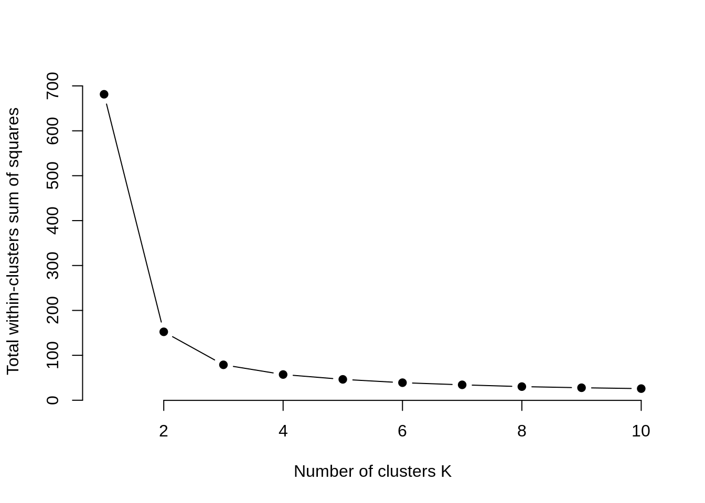


### Density-based clustering


```r
set.seed(123)

library(dbscan)
kNNdistplot(traits, k =  4)
abline(h = 0.4, lty = 2)
```

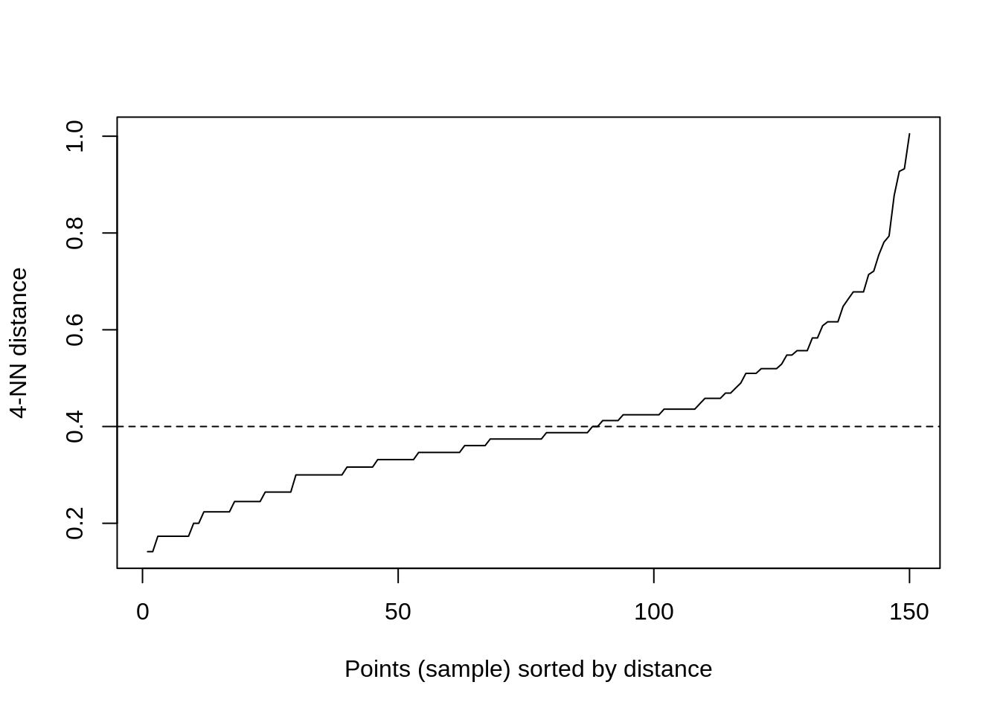

```r
# fpc package
dc <- dbscan(traits, eps = 0.4, minPts = 6)
dc
```

```
## DBSCAN clustering for 150 objects.
## Parameters: eps = 0.4, minPts = 6
## The clustering contains 4 cluster(s) and 32 noise points.
## 
##  0  1  2  3  4 
## 32 46 36 14 22 
## 
## Available fields: cluster, eps, minPts
```

```r
library(factoextra)
```

```
## Loading required package: ggplot2
```

```
## Welcome! Want to learn more? See two factoextra-related books at https://goo.gl/ve3WBa
```

```r
fviz_cluster(dc, traits, geom = "point", ggtheme = theme_light())
```


### Model-based clustering

The last class of methods for unsupervised clustering are so-called model-based clustering methods. 


```r
library(mclust)
```

```
##     __  ___________    __  _____________
##    /  |/  / ____/ /   / / / / ___/_  __/
##   / /|_/ / /   / /   / / / /\__ \ / /   
##  / /  / / /___/ /___/ /_/ /___/ // /    
## /_/  /_/\____/_____/\____//____//_/    version 5.4.7
## Type 'citation("mclust")' for citing this R package in publications.
```

```r
mb = Mclust(traits)
```

```
## fitting ...
## 
  |                                                                                                                       
  |                                                                                                                 |   0%
  |                                                                                                                       
  |=                                                                                                                |   1%
  |                                                                                                                       
  |==                                                                                                               |   2%
  |                                                                                                                       
  |===                                                                                                              |   2%
  |                                                                                                                       
  |====                                                                                                             |   3%
  |                                                                                                                       
  |====                                                                                                             |   4%
  |                                                                                                                       
  |=====                                                                                                            |   5%
  |                                                                                                                       
  |======                                                                                                           |   6%
  |                                                                                                                       
  |=======                                                                                                          |   6%
  |                                                                                                                       
  |========                                                                                                         |   7%
  |                                                                                                                       
  |=========                                                                                                        |   8%
  |                                                                                                                       
  |==========                                                                                                       |   9%
  |                                                                                                                       
  |===========                                                                                                      |   9%
  |                                                                                                                       
  |============                                                                                                     |  10%
  |                                                                                                                       
  |============                                                                                                     |  11%
  |                                                                                                                       
  |=============                                                                                                    |  12%
  |                                                                                                                       
  |==============                                                                                                   |  13%
  |                                                                                                                       
  |===============                                                                                                  |  13%
  |                                                                                                                       
  |================                                                                                                 |  14%
  |                                                                                                                       
  |=================                                                                                                |  15%
  |                                                                                                                       
  |==================                                                                                               |  16%
  |                                                                                                                       
  |===================                                                                                              |  17%
  |                                                                                                                       
  |====================                                                                                             |  17%
  |                                                                                                                       
  |====================                                                                                             |  18%
  |                                                                                                                       
  |=====================                                                                                            |  19%
  |                                                                                                                       
  |======================                                                                                           |  20%
  |                                                                                                                       
  |=======================                                                                                          |  20%
  |                                                                                                                       
  |========================                                                                                         |  21%
  |                                                                                                                       
  |=========================                                                                                        |  22%
  |                                                                                                                       
  |==========================                                                                                       |  23%
  |                                                                                                                       
  |===========================                                                                                      |  24%
  |                                                                                                                       
  |============================                                                                                     |  24%
  |                                                                                                                       
  |============================                                                                                     |  25%
  |                                                                                                                       
  |=============================                                                                                    |  26%
  |                                                                                                                       
  |==============================                                                                                   |  27%
  |                                                                                                                       
  |===============================                                                                                  |  28%
  |                                                                                                                       
  |================================                                                                                 |  28%
  |                                                                                                                       
  |=================================                                                                                |  29%
  |                                                                                                                       
  |==================================                                                                               |  30%
  |                                                                                                                       
  |===================================                                                                              |  31%
  |                                                                                                                       
  |====================================                                                                             |  31%
  |                                                                                                                       
  |====================================                                                                             |  32%
  |                                                                                                                       
  |=====================================                                                                            |  33%
  |                                                                                                                       
  |======================================                                                                           |  34%
  |                                                                                                                       
  |=======================================                                                                          |  35%
  |                                                                                                                       
  |========================================                                                                         |  35%
  |                                                                                                                       
  |=========================================                                                                        |  36%
  |                                                                                                                       
  |==========================================                                                                       |  37%
  |                                                                                                                       
  |===========================================                                                                      |  38%
  |                                                                                                                       
  |============================================                                                                     |  39%
  |                                                                                                                       
  |=============================================                                                                    |  40%
  |                                                                                                                       
  |==============================================                                                                   |  41%
  |                                                                                                                       
  |===============================================                                                                  |  42%
  |                                                                                                                       
  |================================================                                                                 |  43%
  |                                                                                                                       
  |=================================================                                                                |  43%
  |                                                                                                                       
  |==================================================                                                               |  44%
  |                                                                                                                       
  |===================================================                                                              |  45%
  |                                                                                                                       
  |====================================================                                                             |  46%
  |                                                                                                                       
  |=====================================================                                                            |  47%
  |                                                                                                                       
  |======================================================                                                           |  48%
  |                                                                                                                       
  |=======================================================                                                          |  49%
  |                                                                                                                       
  |========================================================                                                         |  50%
  |                                                                                                                       
  |=========================================================                                                        |  50%
  |                                                                                                                       
  |==========================================================                                                       |  51%
  |                                                                                                                       
  |===========================================================                                                      |  52%
  |                                                                                                                       
  |============================================================                                                     |  53%
  |                                                                                                                       
  |=============================================================                                                    |  54%
  |                                                                                                                       
  |==============================================================                                                   |  55%
  |                                                                                                                       
  |===============================================================                                                  |  56%
  |                                                                                                                       
  |================================================================                                                 |  57%
  |                                                                                                                       
  |=================================================================                                                |  57%
  |                                                                                                                       
  |==================================================================                                               |  58%
  |                                                                                                                       
  |===================================================================                                              |  59%
  |                                                                                                                       
  |====================================================================                                             |  60%
  |                                                                                                                       
  |=====================================================================                                            |  61%
  |                                                                                                                       
  |======================================================================                                           |  62%
  |                                                                                                                       
  |=======================================================================                                          |  63%
  |                                                                                                                       
  |========================================================================                                         |  64%
  |                                                                                                                       
  |=========================================================================                                        |  65%
  |                                                                                                                       
  |==========================================================================                                       |  65%
  |                                                                                                                       
  |===========================================================================                                      |  66%
  |                                                                                                                       
  |============================================================================                                     |  67%
  |                                                                                                                       
  |=============================================================================                                    |  68%
  |                                                                                                                       
  |=============================================================================                                    |  69%
  |                                                                                                                       
  |==============================================================================                                   |  69%
  |                                                                                                                       
  |===============================================================================                                  |  70%
  |                                                                                                                       
  |================================================================================                                 |  71%
  |                                                                                                                       
  |=================================================================================                                |  72%
  |                                                                                                                       
  |==================================================================================                               |  72%
  |                                                                                                                       
  |===================================================================================                              |  73%
  |                                                                                                                       
  |====================================================================================                             |  74%
  |                                                                                                                       
  |=====================================================================================                            |  75%
  |                                                                                                                       
  |=====================================================================================                            |  76%
  |                                                                                                                       
  |======================================================================================                           |  76%
  |                                                                                                                       
  |=======================================================================================                          |  77%
  |                                                                                                                       
  |========================================================================================                         |  78%
  |                                                                                                                       
  |=========================================================================================                        |  79%
  |                                                                                                                       
  |==========================================================================================                       |  80%
  |                                                                                                                       
  |===========================================================================================                      |  80%
  |                                                                                                                       
  |============================================================================================                     |  81%
  |                                                                                                                       
  |=============================================================================================                    |  82%
  |                                                                                                                       
  |=============================================================================================                    |  83%
  |                                                                                                                       
  |==============================================================================================                   |  83%
  |                                                                                                                       
  |===============================================================================================                  |  84%
  |                                                                                                                       
  |================================================================================================                 |  85%
  |                                                                                                                       
  |=================================================================================================                |  86%
  |                                                                                                                       
  |==================================================================================================               |  87%
  |                                                                                                                       
  |===================================================================================================              |  87%
  |                                                                                                                       
  |====================================================================================================             |  88%
  |                                                                                                                       
  |=====================================================================================================            |  89%
  |                                                                                                                       
  |=====================================================================================================            |  90%
  |                                                                                                                       
  |======================================================================================================           |  91%
  |                                                                                                                       
  |=======================================================================================================          |  91%
  |                                                                                                                       
  |========================================================================================================         |  92%
  |                                                                                                                       
  |=========================================================================================================        |  93%
  |                                                                                                                       
  |==========================================================================================================       |  94%
  |                                                                                                                       
  |===========================================================================================================      |  94%
  |                                                                                                                       
  |============================================================================================================     |  95%
  |                                                                                                                       
  |=============================================================================================================    |  96%
  |                                                                                                                       
  |=============================================================================================================    |  97%
  |                                                                                                                       
  |==============================================================================================================   |  98%
  |                                                                                                                       
  |===============================================================================================================  |  98%
  |                                                                                                                       
  |================================================================================================================ |  99%
  |                                                                                                                       
  |=================================================================================================================| 100%
```

Mclust automatically compares a number of candidate models (#clusters, shape) according to BIC. We can look at the selected model via


```r
mb$G # two clusters
```

```
## [1] 2
```

```r
mb$modelName # > ellipsoidal, equal shape
```

```
## [1] "VEV"
```

We see that the algorithm prefers to have 2 clusters. For better comparability to the other 2 methods, we will overrule this by setting:


```r
mb3 = Mclust(traits, 3)
```

```
## fitting ...
## 
  |                                                                                                                       
  |                                                                                                                 |   0%
  |                                                                                                                       
  |========                                                                                                         |   7%
  |                                                                                                                       
  |===============                                                                                                  |  13%
  |                                                                                                                       
  |=======================                                                                                          |  20%
  |                                                                                                                       
  |==============================                                                                                   |  27%
  |                                                                                                                       
  |======================================                                                                           |  33%
  |                                                                                                                       
  |=============================================                                                                    |  40%
  |                                                                                                                       
  |=====================================================                                                            |  47%
  |                                                                                                                       
  |============================================================                                                     |  53%
  |                                                                                                                       
  |====================================================================                                             |  60%
  |                                                                                                                       
  |===========================================================================                                      |  67%
  |                                                                                                                       
  |===================================================================================                              |  73%
  |                                                                                                                       
  |==========================================================================================                       |  80%
  |                                                                                                                       
  |==================================================================================================               |  87%
  |                                                                                                                       
  |=========================================================================================================        |  93%
  |                                                                                                                       
  |=================================================================================================================| 100%
```

Result in terms of the predicted densities for the 3 clusters


```r
plot(mb3, "density")
```

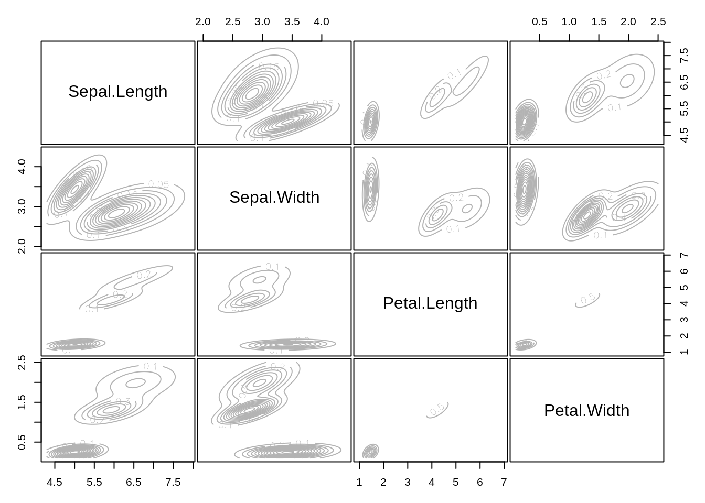

Predicted clusters


```r
plot(mb3, what=c("classification"), add = T)
```


Confusion matrix


```r
table(iris$Species, mb3$classification)
```

```
##             
##               1  2  3
##   setosa     50  0  0
##   versicolor  0 45  5
##   virginica   0  0 50
```

### Ordination 

Note the relationship between clustering and ordination. Here a PCA ordination on on the 


```r
pcTraits <- prcomp(traits, center = TRUE,scale. = TRUE)
biplot(pcTraits, xlim = c(-0.25,0.25), ylim = c(-0.25,0.25))
```

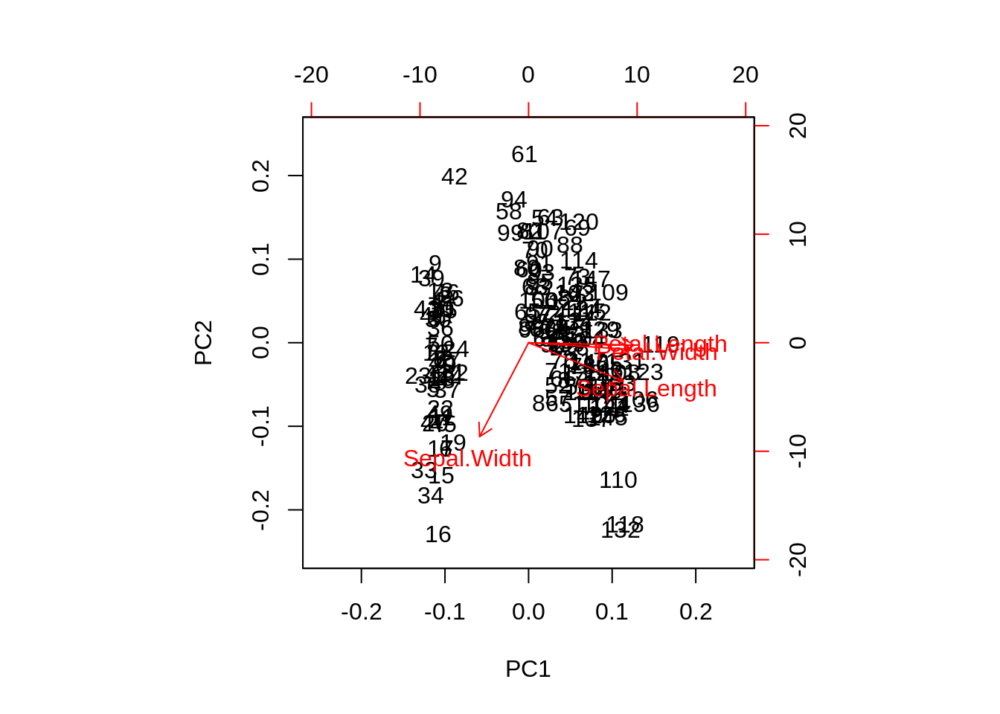

You can cluster the results of this ordination, ordinate before clustering, or superimpose one on the other. 


## Supervised learning: regression and classification
The two most prominent branches of supervised learning are regression and classification. Fundamentally, classification is about predicting a label and regression is about predicting a quantity. The following video explains that in more depth:

<iframe width="560" height="315" 
  src="https://www.youtube.com/embed/i04Pfrb71vk"
  frameborder="0" allow="accelerometer; autoplay; encrypted-media;
  gyroscope; picture-in-picture" allowfullscreen>
  </iframe>


### Supervised regression using Random Forest

The random forest (RF) algorithm is possibly the most widely used ML algorithm and can be used for regression and classification. We will talk more about the algorithm on Day 2. 

For the moment, we want to go through typical workflow for a supervised regression: First, we visualize the data. Next, we fit the model and lastly we visualize the results. We will again use the iris dataset that we used before. The goal is now to predict Sepal.Length based on the infomration about the other variables (including species). 

Fitting the model

```r
library(randomForest)
```

```
## randomForest 4.6-14
```

```
## Type rfNews() to see new features/changes/bug fixes.
```

```
## 
## Attaching package: 'randomForest'
```

```
## The following object is masked from 'package:ggplot2':
## 
##     margin
```

```r
m1 <- randomForest(Sepal.Length ~ ., data = iris)
# str(m1)
# m1$type
# predict(m1)
print(m1)
```

```
## 
## Call:
##  randomForest(formula = Sepal.Length ~ ., data = iris) 
##                Type of random forest: regression
##                      Number of trees: 500
## No. of variables tried at each split: 1
## 
##           Mean of squared residuals: 0.1364625
##                     % Var explained: 79.97
```

Visualization of the results

```r
par(mfrow = c(1,2))
plot(predict(m1), iris$Sepal.Length, xlab = "predicted", ylab = "observed")
abline(0,1)
varImpPlot(m1)
```

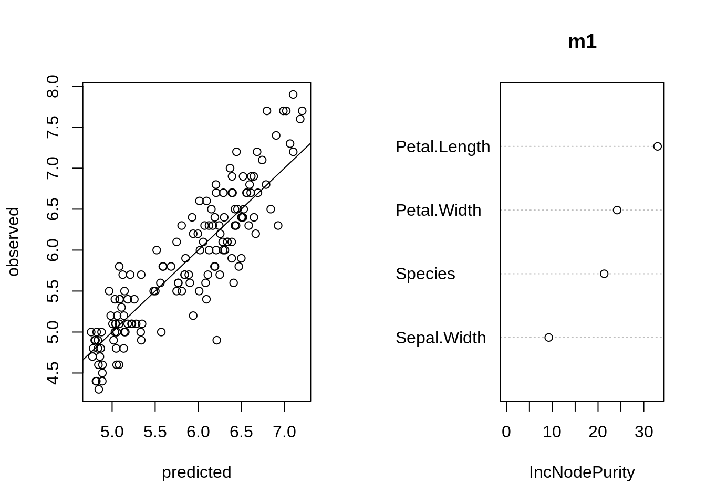
To understand, the structure of a RF in more detail, we can use a package from GitHub


```r
# devtools::install_github('araastat/reprtree')
reprtree:::plot.getTree(m1, iris)
```

```
## Loading required package: plotrix
```


### Supervised classification using Random Forest

With the RF, we can also do classification. The steps are the same as for regression tasks, but we can additionally, see how well it performed by looking at the so called confusion matrix. Each row of this matrix contains the instances in a predicted class and each column represent the instances in an actual class. Thus the diagonals are the correctly predicted classes and the off-diagnoal elements are the falsly classified elements.

Fitting the model:

```r
set.seed(123)
m1 <- randomForest(Species ~ ., data = iris)
# str(m1)
# m1$type
# predict(m1)
print(m1)
```

```
## 
## Call:
##  randomForest(formula = Species ~ ., data = iris) 
##                Type of random forest: classification
##                      Number of trees: 500
## No. of variables tried at each split: 2
## 
##         OOB estimate of  error rate: 4.67%
## Confusion matrix:
##            setosa versicolor virginica class.error
## setosa         50          0         0        0.00
## versicolor      0         47         3        0.06
## virginica       0          4        46        0.08
```
Visualizing the fitted model:


```r
par(mfrow = c(1,2))
reprtree:::plot.getTree(m1, iris)
```

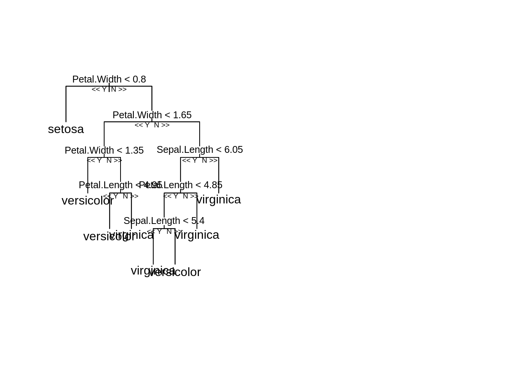

Visualizing results ecologically:

```r
oldpar <- par(mfrow = c(1,2))
plot(iris$Petal.Width, iris$Petal.Length, col = iris$Species, main = "observed")
plot(iris$Petal.Width, iris$Petal.Length, col = predict(m1), main = "predicted")
```

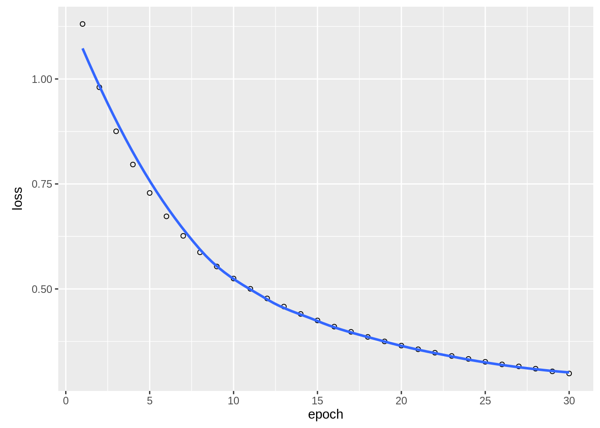


Confusion matrix:

```r
table(predict(m1),iris$Species)
```

```
##             
##              setosa versicolor virginica
##   setosa         50          0         0
##   versicolor      0         47         4
##   virginica       0          3        46
```


## Introduction to Tensorflow

All operations in TF are written in C++ and are highly optimized. But dont worry, we don’t have to use C++ to use TF because there are several bindings for other languages. TensorFlow officialy supports a Python API, but meanwhile there are several community carried APIs for other languages:

* R
* Go
* Rust
* Swift
* JavaScript

In this course we will use TF with the https://tensorflow.rstudio.com/ binding, that was developed and published 2017 by the RStudio
Team. They developed first a R package (reticulate) to call python in R. Actually, we are using in R the python TF module (more about this later).
TF offers different levels of API. We could implement a neural network completly by ourselves, or we could use Keras which is provided by TF as a submodule. Keras is a powerful module for building and training neural networks. It allows us to build and train neural networks in a few lines of codes. Since the end of 2018, Keras and TF are completly interoperable, allowing us to utilize the best of both. In this course, we will show how we can use Keras
for neural networks but also how we can use the TF’s automatic differenation for using complex objective functions.

One of the most commonly used frameworks for machine learning is TensorFlow. TensorFlow is a open source linear algebra library with a focus on neural networks, published by Google in 2015. TF supports several interesting features, im particular automatic differentiation, several gradient optimizers and CPU and GPU parallelization. 

These advantages are nicely explained in the following video: 

<iframe width="560" height="315" 
  src="https://www.youtube.com/embed/MotG3XI2qSs"
  frameborder="0" allow="accelerometer; autoplay; encrypted-media;
  gyroscope; picture-in-picture" allowfullscreen>
  </iframe>

To sum the most important points of the video up: 

* TF is a math library which is highly optimized for neural networks
* If a GPU is available, computations can be easily run on the GPU but even on a CPU is TF still very fast
* The "backend" (i.e. all the functions and all computations) are written in C++ and CUDA (CUDA is a programming language for the GPU)
* The interface (the part of TF that we use) is written in python and is also available in R, which means, we can write the code in R/Python but it will be executed by the (compiled) C++ backend. 

All operations in TF are written in C++ and are highly optimized. But dont worry, we don’t have to use C++ to use TF, because there are several bindings for other languages. Officially, TensorFlow only supports a Python API, but meanwhile there are several community carried APIs for other languages, including R, Go, Rust, Swift or JavaScript. In this book, we will use TF with the https://tensorflow.rstudio.com/ binding that was developed and published 2017 by the RStudio Team. They developed first a R package (reticulate) to call python in R. Actually, we are using in R the python TF module (more about this later).

Useful links:

* [TensorFlow documentation](https://www.tensorflow.org/api_docs/python/tf) (which is for the python API, but just replace the '.' with '$')
* [Rstudio tensorflow website](https://tensorflow.rstudio.com/)


### Tensorflow data containers
TF has two data containers (structures):

* constant (tf$constant) :creates a constant (immutable) value in the computation graph
* variable (tf$Variable): creates a mutable value in the computation graph (used as parameter/weight in models)

To get started with tensorflow, we have to load the library and check if the installation worked. 


```r
library(tensorflow)
# Don't worry about weird messages. TF supports additional optimizations
exists("tf")
```

```
## [1] TRUE
```

Don't worry about weird messages (they will only appear once at the start of the session).

We now can define the variables and do some math with them:


```r
a = tf$constant(5)
b = tf$constant(10)
print(a)
```

```
## tf.Tensor(5.0, shape=(), dtype=float32)
```

```r
print(b)
```

```
## tf.Tensor(10.0, shape=(), dtype=float32)
```

```r
c = tf$add(a, b)
print(c)
```

```
## tf.Tensor(15.0, shape=(), dtype=float32)
```

```r
tf$print(c)
```

Normal R methods such as print() are provided by the R package "tensorflow". 

The tensorflow library (created by the RStudio team) built R methods for all common operations:


```r
`+.tensorflow.tensor` = function(a, b) return(tf$add(a,b))
tf$print(a+b)
```

Their operators also transfrom automatically R numbers into constant tensors when attempting to add a tensor to a R number:


```r
d = c + 5  # 5 is automatically converted to a tensor
print(d)
```

```
## tf.Tensor(20.0, shape=(), dtype=float32)
```

TF container are objects, which means that they are not just simple variables of type numeric (class(5)), but they instead have so called methods. Methods are changing the state of a class (which for most of our purposes here is the values of the object)
For instance, there is a method to transform the tensor object back to a R object:


```r
class(d)
```

```
## [1] "tensorflow.tensor"                                "tensorflow.python.framework.ops.EagerTensor"     
## [3] "tensorflow.python.framework.ops._EagerTensorBase" "tensorflow.python.framework.ops.Tensor"          
## [5] "tensorflow.python.types.internal.NativeObject"    "tensorflow.python.types.core.Tensor"             
## [7] "python.builtin.object"
```

```r
class(d$numpy())
```

```
## [1] "numeric"
```

### Tensorflow data types - good practise with R-TF
R uses dynamic typing, which means you can assign to a variable a number, character, function or whatever, and the the type is automatically infered.
In other languages you have to state explicitly the type, e.g. in C: int a = 5; float a = 5.0; char a = "a";
While TF tries to infer dynamically the type, often you must state it explicitly.
Common important types: 
- float32 (floating point number with 32bits, "single precision")
- float64 (floating point number with 64bits, "double precision")
- int8 (integer with 8bits)
The reason why TF is so explicit about the types is that many GPUs (e.g. the NVIDIA geforces) can handle only up to 32bit numbers! (you do not need high precision in graphical modeling)

But let us see in practice, what we have to do with these types and how to specifcy them:

```r
r_matrix = matrix(runif(10*10), 10,10)
m = tf$constant(r_matrix, dtype = "float32") 
b = tf$constant(2.0, dtype = "float64")
c = m / b # doesn't work! we try to divide float32/float64
```

So what went wrong here: we tried to divide a float32 to a float64 number, but, we can only divide numbers of the same type! 

```r
r_matrix = matrix(runif(10*10), 10,10)
m = tf$constant(r_matrix, dtype = "float64")
b = tf$constant(2.0, dtype = "float64")
c = m / b # now it works
```

We can also specify the type of the object by providing an object e.g. tf$float64.


```r
r_matrix = matrix(runif(10*10), 10,10)
m = tf$constant(r_matrix, dtype = tf$float64)
```


Tensorflow arguments often require exact/explicit data types:
TF often expects for arguments integers. In R however an integer is normally saved as float. 
Thus, we have to use a "L" after an integer to tell the R interpreter that it should be treated as an integer:


```r
is.integer(5)
is.integer(5L)
matrix(t(r_matrix), 5, 20, byrow = TRUE)
tf$reshape(r_matrix, shape = c(5, 20))$numpy()
tf$reshape(r_matrix, shape = c(5L, 20L))$numpy()
```

Skipping the "L" is one of the most common errors when using R-TF!

## Introduction to PyTorch
PyTorch is another famous library for deep learning. As for tensorflow, torch itself is written in c++ but the API in python. Last year, the RStudio team released R-torch, and while r-tensorflow calls the python API in the background, the r-torch API is built directly on the c++ torch library! 

Useful links:

* [PyTorch documentation](https://pytorch.org/docs/stable/index.html) (which is for the python API, bust just replace the '.' with '$')
* [R-torch website](https://torch.mlverse.org/)


### PyTorch data containers
TF has two data containers (structures):

* constant (tf_tensor(...)) :creates a constant (immutable) value in the computation graph
* variable (tf_$Variable_tensor(..., requires_grad=TRUE)): creates a mutable value in the computation graph (used as parameter/weight in models)

To get started with torch, we have to load the library and check if the installation worked. 


```r
library(torch)
```

```
## Warning: Torch failed to start, restart your R session to try again. /home/maxpichler/R/x86_64-pc-linux-gnu-library/3.6/
## torch/deps/liblantern.so - libcudart.so.10.1: cannot open shared object file: No such file or directory
```

Don't worry about weird messages (they will only appear once at the start of the session).

We now can define the variables and do some math with them:


```r
a = torch_tensor(5.)
b = torch_tensor(10.)
print(a)
```

```
## torch_tensor
##  5
## [ CPUFloatType{1} ]
```

```r
print(b)
```

```
## torch_tensor
##  10
## [ CPUFloatType{1} ]
```

```r
c = a$add( b )
print(c)
```

```
## torch_tensor
##  15
## [ CPUFloatType{1} ]
```

The r-torch package provides all common methods (an advantage over tensorflow)


```r
a = torch_tensor(5.)
b = torch_tensor(10.)
print(a+b)
```

```
## torch_tensor
##  15
## [ CPUFloatType{1} ]
```

```r
print(a/b)
```

```
## torch_tensor
##  0.5000
## [ CPUFloatType{1} ]
```

```r
print(a*b)
```

```
## torch_tensor
##  50
## [ CPUFloatType{1} ]
```


Their operators also transfrom automatically R numbers into tensors when attempting to add a tensor to a R number:


```r
d = a + 5  # 5 is automatically converted to a tensor
print(d)
```

```
## torch_tensor
##  10
## [ CPUFloatType{1} ]
```

As for tensorflow, we have to explicitly transform the tensors back to R:


```r
class(d)
```

```
## [1] "torch_tensor" "R7"
```

```r
class(as.numeric(d))
```

```
## [1] "numeric"
```

### Torch data types - good practise with R-TF
Similar to tensorflow:


```r
r_matrix = matrix(runif(10*10), 10,10)
m = torch_tensor(r_matrix, dtype = torch_float32()) 
b = torch_tensor(2.0, dtype = torch_float64())
c = m / b 
```
But here's a difference! With tensorfow we would get an error, but with r-torch, m is automatically casted to a double (float64). However, this is still bad practise!

During the course we will try to provide for all keras/tensorflow examples the corresponding pytorch code snippets.


## First steps with the keras framework

We have seen that we can use TF directly from R, and we could use this knowledge to implement a neural network in TF directly from R. However, this can be quite cumbersome. For simple problems, it is usually faster to use a higher-level API that helps us with implementing the machine learning models in TF. The most common of those is Keras.

Keras is a powerful framework for building and training neural networks with a few lines of codes. Since the end of 2018, Keras and TF are completely interoperable, allowing us to utilize the best of both. 

The objective of this lesson is to familiarize yourself with keras. If you have TF installed, Keras can be found within TF: tf.keras. However, the RStudio team has built an R package on top of tf.keras, and it is more convenient to use this. To load the keras package, type


```r
library(keras)
```

### Example workflow in keras

To show how keras works, we will now build a small classifier in keras to predict the three species of the iris dataset. Load the necessary packages and datasets:

```r
library(keras)
library(tensorflow)
data(iris)
head(iris)
```

```
##   Sepal.Length Sepal.Width Petal.Length Petal.Width Species
## 1          5.1         3.5          1.4         0.2  setosa
## 2          4.9         3.0          1.4         0.2  setosa
## 3          4.7         3.2          1.3         0.2  setosa
## 4          4.6         3.1          1.5         0.2  setosa
## 5          5.0         3.6          1.4         0.2  setosa
## 6          5.4         3.9          1.7         0.4  setosa
```

It is beneficial for neural networks to scale the predictors (scaling = centering and standardization, see ?scale)
We also split our data into the predictors (X) and the response (Y = the three species).

```r
X = scale(iris[,1:4])
Y = iris[,5]
```

Additionally, keras/tf cannot handle factors and we have to create contrasts (one-hot encoding):
To do so, we have to specify the number of categories. This can be tricky for a beginner, because in other programming languages like python and C++ on which TF is built, arrays start at zero. Thus, when we would specify 3 as number of classes for our three species, we would have the classes 0,1,2,3. Therefore, we have to substract it. 

```r
Y = to_categorical(as.integer(Y)-1L, 3)
head(Y) # 3 colums, one for each level in the response
```

```
##      [,1] [,2] [,3]
## [1,]    1    0    0
## [2,]    1    0    0
## [3,]    1    0    0
## [4,]    1    0    0
## [5,]    1    0    0
## [6,]    1    0    0
```
After having prepared the data, we will now see a typical workflow to specify a model in keras. 

**1. Initiliaze a sequential model in keras:**

```r
model = keras_model_sequential()
```
A sequential keras model is a higher order type of model within keras and consists of one input and one output model. 


**2. Add hidden layers to the model (we will learn more about hidden layers during the next days).**
When specifiying the hidden layers, we also have to specify a so called activation function and their shape. 
You can think of the activation function as decisive for what is forwarded to the next neuron (but we will learn more about it later). The shape of the input is the number of predictors (here 4) and the shape of the output is the number of classes (here 3).

```r
model %>%
  layer_dense(units = 20L, activation = "relu", input_shape = list(4L)) %>%
  layer_dense(units = 20L) %>%
  layer_dense(units = 20L) %>%
  layer_dense(units = 3L, activation = "softmax") 
```
- softmax scales a potential multidimensional vector to the interval (0,1]

<details>
<summary>
**<span style="color: #CC2FAA">torch</span>**
</summary>
<p>
The torch syntax is very similar, we will give a list of layers to 'nn_sequential' function. Here, we have to specify the softmax activation function as an extra layer:

```r
model_torch = 
  nn_sequential(
    nn_linear(4L, 20L),
    nn_linear(20L, 20L),
    nn_linear(20L, 20L),
    nn_linear(20L, 3L),
    nn_softmax(2)
  )
```
</details>
<br/>


**3. Compile the model with a loss function (here: cross entropy) and an optimizer (here: Adamax).** 

We will leaern about other options later, so for now, do not worry about the "lr" argument, crossentropy or the optimizer.

```r
model %>%
  compile(loss = loss_categorical_crossentropy, keras::optimizer_adamax(lr = 0.001))
summary(model)
```

```
## Model: "sequential"
## ___________________________________________________________________________________________________________________________
## Layer (type)                                           Output Shape                                     Param #            
## ===========================================================================================================================
## dense (Dense)                                          (None, 20)                                       100                
## ___________________________________________________________________________________________________________________________
## dense_1 (Dense)                                        (None, 20)                                       420                
## ___________________________________________________________________________________________________________________________
## dense_2 (Dense)                                        (None, 20)                                       420                
## ___________________________________________________________________________________________________________________________
## dense_3 (Dense)                                        (None, 3)                                        63                 
## ===========================================================================================================================
## Total params: 1,003
## Trainable params: 1,003
## Non-trainable params: 0
## ___________________________________________________________________________________________________________________________
```

<details>
<summary>
**<span style="color: #CC2FAA">torch</span>**
</summary>
<p>
Specify optimizer and the parameters which will be trained (in our case the parameters of the network)

```r
optimizer_torch = optim_adam(params = model_torch$parameters, lr = 0.01)
```
</details>
<br/>


**4. Fit model in 30 iterations(epochs)**


```r
model_history =
  model %>%
    fit(x = X, y = apply(Y,2,as.integer), epochs = 30L, batch_size = 20L, shuffle = TRUE)
```

<details>
<summary>
**<span style="color: #CC2FAA">torch</span>**
</summary>
<p>
In torch, we jump directly to the training loop, however, here we have to write our own training loop:

1. get a batch of data
2. predict on batch
3. calculate loss between predictions and true labels
4. backpropagate error
5. update weights
6. go to step 1 and repeat

```r
# Calculate number of training steps
epochs = 30
batch_size = 20
steps = round(nrow(X)/batch_size*30)

X_torch = torch_tensor(X)
Y_torch = torch_tensor(apply(Y, 1, which.max)) 

# set model into training status
model_torch$train()

log_losses = NULL

# training loop
for(i in 1:steps) {
  # get batch
  indices = sample.int( nrow(X), batch_size)
  
  # reset backpropagation
  optimizer_torch$zero_grad()
  
  # predict and calculate loss
  pred = model_torch(X_torch[indices, ])
  loss = nnf_cross_entropy(pred, Y_torch[indices])
  
  # backprop and weight update
  loss$backward()
  optimizer_torch$step()
  
  log_losses[i] = as.numeric(loss)
}
```
</details>
<br/>

**5. Plot training history:**

```r
plot(model_history)
```

```
## `geom_smooth()` using formula 'y ~ x'
```

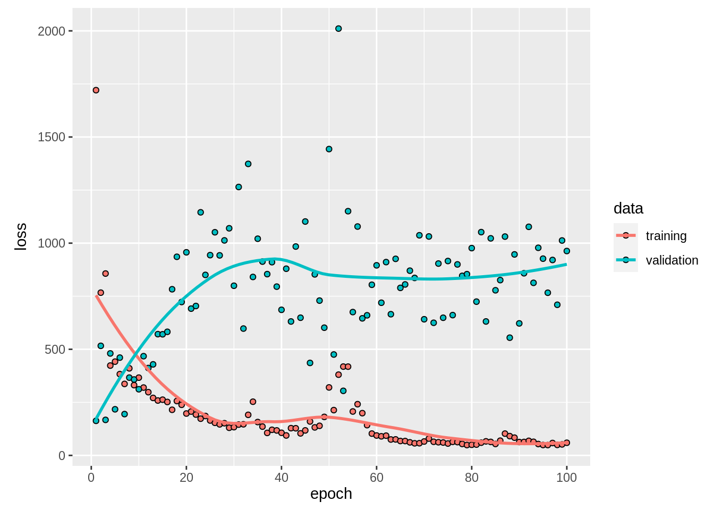

<details>
<summary>
**<span style="color: #CC2FAA">torch</span>**
</summary>
<p>

```r
plot(log_losses, xlab = "steps", ylab = "loss", las = 1)
```

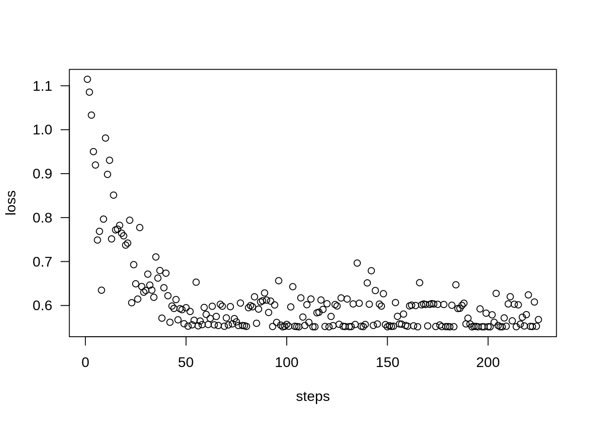
</details>
<br/>

**6. Create predictions:**

```r
predictions = predict(model, X) # probabilities for each class
```

We will get probabilites:

```r
head(predictions) # quasi-probabilities for each species
```

```
##           [,1]        [,2]        [,3]
## [1,] 0.9817764 0.012261051 0.005962546
## [2,] 0.9656658 0.029913722 0.004420638
## [3,] 0.9845085 0.012120169 0.003371367
## [4,] 0.9811534 0.015199146 0.003647536
## [5,] 0.9861354 0.008666792 0.005197912
## [6,] 0.9751995 0.012824436 0.011976076
```

For each plant, we want to know for which species we got the highest probability:

```r
preds = apply(predictions, 1, which.max) 
print(preds)
```

```
##   [1] 1 1 1 1 1 1 1 1 1 1 1 1 1 1 1 1 1 1 1 1 1 1 1 1 1 1 1 1 1 1 1 1 1 1 1 1 1 1 1 1 1 1 1 1 1 1 1 1 1 1 3 3 3 2 2 2 3 2 2
##  [60] 2 2 2 2 2 2 3 2 2 2 2 3 2 2 2 2 2 2 3 2 2 2 2 2 3 2 3 3 2 2 2 2 3 2 2 2 2 2 2 2 2 3 3 3 3 3 3 2 3 3 3 3 3 3 2 3 3 3 3
## [119] 3 2 3 3 3 3 3 3 3 3 3 3 3 3 3 3 2 3 3 3 3 3 3 3 3 3 3 3 3 3 3 3
```

<details>
<summary>
**<span style="color: #CC2FAA">torch</span>**
</summary>
<p>
The torch syntax is very similar, we will give a list of layers to 'nn_sequential' function. Here, we have to specify the softmax activation function as an extra layer:

```r
model_torch$eval()
preds_torch = model_torch(torch_tensor(X))
preds_torch = apply(preds_torch, 1, which.max) 
print(preds_torch)
```

```
##   [1] 1 1 1 1 1 1 1 1 1 1 1 1 1 1 1 1 1 1 1 1 1 1 1 1 1 1 1 1 1 1 1 1 1 1 1 1 1 1 1 1 1 1 1 1 1 1 1 1 1 1 2 2 2 2 2 2 2 2 2
##  [60] 2 2 2 2 2 2 2 3 2 2 2 3 2 2 2 2 2 2 3 2 2 2 2 2 3 3 2 2 2 2 2 2 2 2 2 2 2 2 2 2 2 3 3 3 3 3 3 3 3 3 3 3 3 3 3 3 3 3 3
## [119] 3 3 3 3 3 3 3 3 3 3 3 3 3 3 3 3 3 3 3 3 3 3 3 3 3 3 3 3 3 3 3 3
```

```r
mean(preds_torch == as.integer(iris$Species))
```

```
## [1] 0.9666667
```
</details>
<br/>

**7. Calculate Accuracy (how often we have been correct):**


```r
mean(preds == as.integer(iris$Species))
```

```
## [1] 0.9
```

**8. Plot predictions, to see if we have done a good job:**

```r
oldpar = par()
par(mfrow = c(1,2))
plot(iris$Sepal.Length, iris$Petal.Length, col = iris$Species, main = "Observed")
plot(iris$Sepal.Length, iris$Petal.Length, col = preds, main = "Predicted")
```


So you see, building a neural network is with keras very easy and you can already do it on your own.

<!--chapter:end:01-intro.Rmd-->

# Fundamental principles and techniques {#fund}

## Machine learning principles

### Optimization
from wikipedia: " an optimization problem is the problem of finding the best solution from all feasible solutions"

Why do we need this "optimization"?

We need to somehow tell the algorithm what it should learn. To do so we have the so called loss-function, which expresses what our goal is. But we also need to somewhow find the configurations for which the loss function is 
minimized. This is the job of the optimizer. Thus, an optimization consists of:

- A loss function (e.g. we tell in each training step the algorithm how many observations were miss-classified) guides the training of ML algorithms

- The optimizer, which tries to update the weights of the ML algorithms in a way that the loss function is minimized

Calculating analytically the global optima is a non-trivial problem and thus a bunch of diverse optimization algorithms evolved

Some optimization algorithms are inspired by biological systems e.g. Ants, Bee, or even slime algorithms. These optimizers are explained int the following video, have a look:

<iframe width="560" height="315" 
  src="https://www.youtube.com/embed/X-iSQQgOd1A"
  frameborder="0" allow="accelerometer; autoplay; encrypted-media;
  gyroscope; picture-in-picture" allowfullscreen>
  </iframe>

#### Small optimization example
As an easy example for optimization we can think of a quadratic function:

```r
func = function(x) return(x^2)
```

This function is so easy, we can randomly prob it and identify the optimum by plotting


```r
a = rnorm(100)
plot(a, func(a))
```

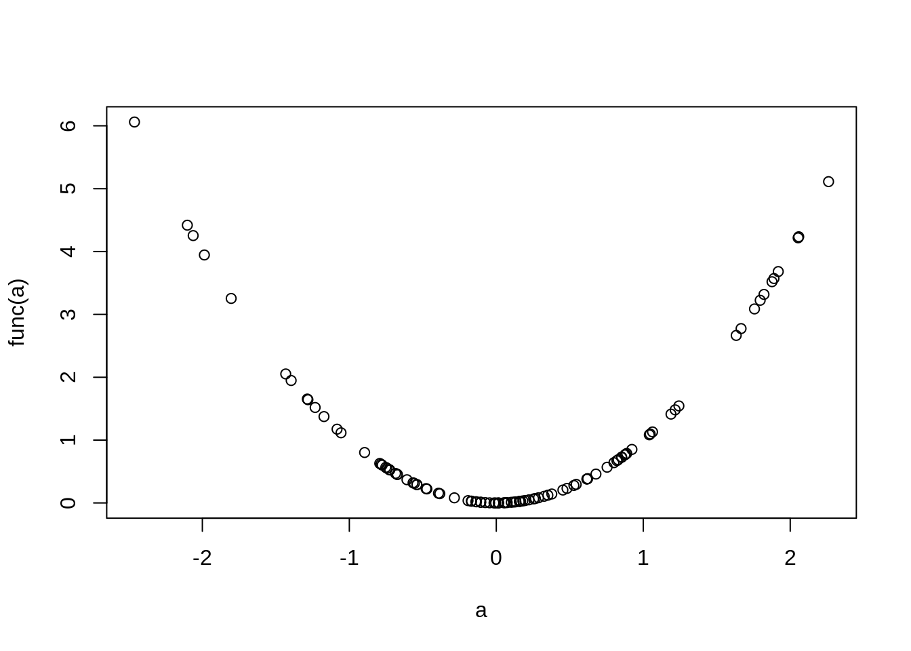

The smallest value is at x = 0 (to be honest, we can calculate this for this simple case analytically)

We can also use an optimizer with the optim-function (the first argument is the starting value)


```r
opt = optim(1.0, func)
```

```
## Warning in optim(1, func): one-dimensional optimization by Nelder-Mead is unreliable:
## use "Brent" or optimize() directly
```

```r
print(opt$par)
```

```
## [1] -8.881784e-16
```

opt$par will return the best values found by the optimizer, which is really close to zeor :)


#### Advanced optimization example

Optimization is also done when fitting a linear regression model. Thereby, we optimize the weights (intercept and slope). But using lm (y~x) is too simple, we would like to do this by hand to also better understand what optimization is and how it works.

As an example we take the airquality data set. First, we have to be sure to have no NAs in there. Then we split into response (Ozone) and predictors (Month, Day, Solar.R, Wind, Temp).Additionally it is beneficial for the optimizer, when the different predictors have the same support, and thus we scale them. 


```r
data = airquality[complete.cases(airquality$Ozone) & complete.cases(airquality$Solar.R),]
X = scale(data[,-1])
Y = data$Ozone
```

The model we want to optimize: $ozone = Solar.R*X1 + Wind*X2 + Temp*X3 + Month*X4 + Day*X5 + X6$

As the we assume that the residuals are normally distributed, our loss function is the mean squared errors: mean(predicted ozone - true ozone)^2) 

Our task is now to find the parameters X1-X6 for which this loss function is the smallest. Therefore, we implement a function, that takes parameters and returns the loss.


```r
linear_regression = function(w) {
  pred = w[1]*X[,1] + # Solar.R
         w[2]*X[,2] + # Wind
         w[3]*X[,3] + # Temp
         w[4]*X[,4] + # Month
         w[5]*X[,5] +
         w[6]         # or X %*% w[1:5] + w[6]
  # loss  = MSE, we want to find the optimal weights 
  # to minimize the sum of squared residuals
  loss = mean((pred - Y)^2)
  return(loss)
}
```

For example we can sample some weights and see what the loss with this weights is.

```r
linear_regression(runif(6))
```

```
## [1] 2807.74
```

We can try to find the optimum bruteforce (which means we will use a random set of weights and see for which the loss function is smallest):


```r
random_search = matrix(runif(6*5000,-10,10), 5000, 6)
losses = apply(random_search, 1, linear_regression)
plot(losses, type = "l")
```

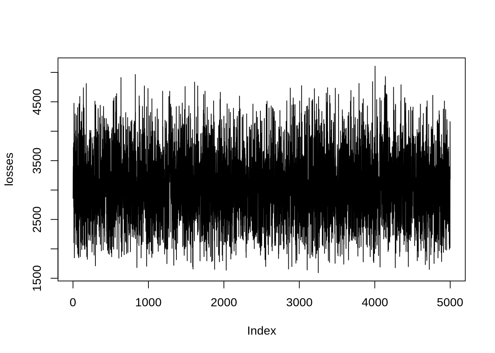

```r
random_search[which.min(losses),]
```

```
## [1]  4.847733 -9.630324  6.326885 -2.982961  1.211288  9.963248
```

Bruteforce isn't a good approach, it might work well with only a few parameters, but with increasing complexity and more parameters it will take a long time.

In R the optim function helps to get faster to the optimum.

```r
opt = optim(runif(6, -1, 1), linear_regression)
opt$par
```

```
## [1]   0.6473966 -20.0175388  21.7380624 -10.2651763  -8.4418507  25.5586780
```

By comparing the weights from the optimizer to the estimated weights of the lm() function, we see that our self-written code obtains the same weights as the lm.


```r
coef(lm(Y~X))
```

```
## (Intercept)    XSolar.R       XWind       XTemp      XMonth        XDay 
##   42.099099    4.582620  -11.806072   18.066786   -4.479175    2.384705
```

### Regularization

Regularization means adding information or structure to a system in order to solve an ill-posed optimization problem or to prevent overfitting. There are many ways of regularizing a ML model. The most important distinction is between shrinkage estimators and estimators based on model averaging. 

**Shrikage estimators** are based on the idea of adding a penalty to the loss function that penalizes deviations of the model parameters from a particular value (typically 0). In this way, estimates are *"shrunk"* to the specified default value. In practice, the most important penalties are the least absolute shrinkage and selection operator; also Lasso or LASSO, where the penality is proportional to the absolute deviation (L1 penalty), and the Tikhonov regularization aka ridge regression, where the penalty is proportional to the squared distance from the reference (L2 penalty). Thus, the loss function that we optimize is thus given by

$$
loss = fit - \lambda \cdot d
$$
where fit refers to the standard loss function, $\lambda$ is the strength of the regularization, and $d$ is the chosen metrics, e.g. L1 or L2:
$$
loss_{L1} = fit - \lambda \cdot \Vert weights \Vert_1
$$
$$
loss_{L2} = fit - \lambda \cdot \Vert weights \Vert_2
$$
$\lambda$ and possibly d are typically optimized under cross-validation. L1 and L2 can be also combined which is then called elastic net (see @zou2005)

**Model averaging** refers to an entire set of techniques, including boosting, bagging and other averaging techniques. The general principle is that predictions are made by combining (= averaging) several models. This is based on on the insight that it often more efficient to have many simpler models and average them, than to have one "super model". The reasons are complicated, and explained in more detail in @dormann2018.

A particular important application of averaging is boosting, where the principle is that many weak learners are combined to a model average, resulting in a strong learner. Another related method is bootstrap aggregating, also called bagging. Idea here is to boostrap the data, and average the boot-strapped predictions.

To see how these techniques work in practice, let's first focus on lasso and ridge regularization for weights in neural networks. We can imagine that the lasso and ridge act similar to a rubber band on the weights that pulls them to zero if the data does not strongly push them away from zero. This leads to important weights, which are supported by the data, being estimated as different from zero, whereas unimportant model structures are reduced (shrunk) to zero.

Lasso (penalty ~ abs(sum(Weights))) and ridge (penalty ~ (sum(Weights))^2) have slightly different properties, which are best understood if we express those as the effective prior preference that they create on the parameters:

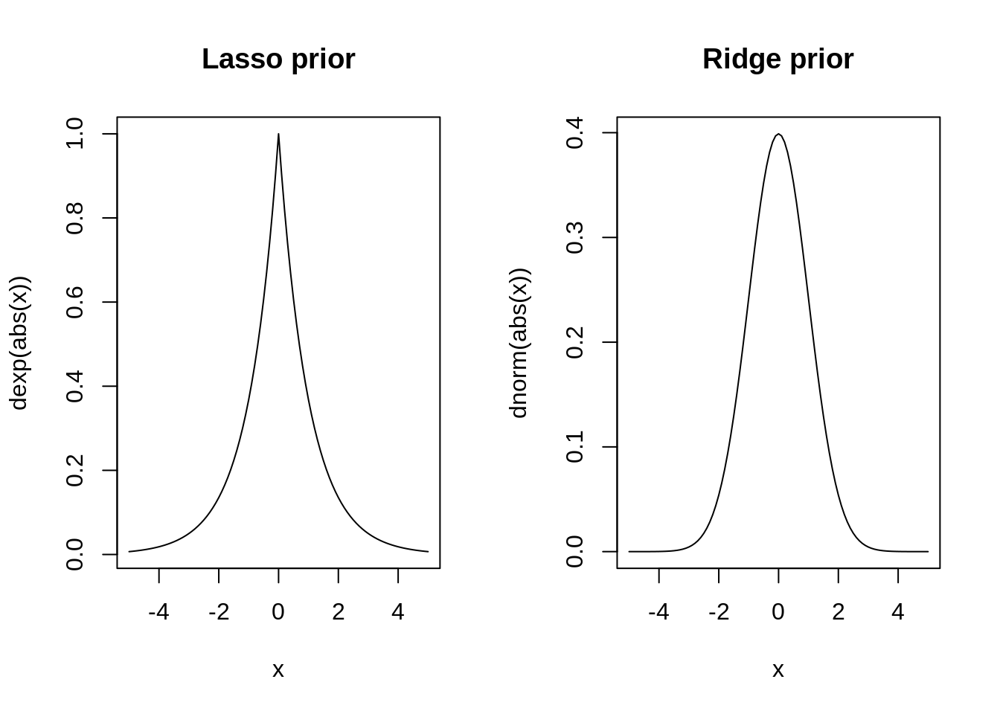

As you can see, the Lasso creates a very strong preference towards exactly zero, but falls off less strongly towards the tails. This means that parameters tend to be estimated either to exactly zero, or, if not, they are more free than the ridge. For this reason, Lasso is often interpreted more as a model selection method. 

The Ridge, on the other hand, has a certain area around zero where it is relatively indifferent about deviations from zero, thus rarely leading to exactly zero values. However, it will create a stronger shrinkage for values that deviate significantly from zero. 

We can implement the linear regression also in keras, when we do not specify any hidden layers


```r
library(keras)
data = airquality[complete.cases(airquality),]
X = scale(data[,-1])
Y = data$Ozone
# l1/l2 on linear model
model = keras_model_sequential()
model %>%
 layer_dense(units = 1L, activation = "linear", input_shape = list(dim(X)[2]))
summary(model)
```

```
## Model: "sequential_1"
## ___________________________________________________________________________________________________________________________
## Layer (type)                                           Output Shape                                     Param #            
## ===========================================================================================================================
## dense_4 (Dense)                                        (None, 1)                                        6                  
## ===========================================================================================================================
## Total params: 6
## Trainable params: 6
## Non-trainable params: 0
## ___________________________________________________________________________________________________________________________
```

```r
model %>%
 compile(loss = loss_mean_squared_error, optimizer_adamax(lr = 0.5))
model_history =
 model %>%
 fit(x = X, y = Y, epochs = 50L, batch_size = 20L, shuffle = TRUE)
unconstrained = model$get_weights()
summary(lm(Y~X))
```

```
## 
## Call:
## lm(formula = Y ~ X)
## 
## Residuals:
##     Min      1Q  Median      3Q     Max 
## -37.014 -12.284  -3.302   8.454  95.348 
## 
## Coefficients:
##             Estimate Std. Error t value Pr(>|t|)    
## (Intercept)   42.099      1.980  21.264  < 2e-16 ***
## XSolar.R       4.583      2.135   2.147   0.0341 *  
## XWind        -11.806      2.293  -5.149 1.23e-06 ***
## XTemp         18.067      2.610   6.922 3.66e-10 ***
## XMonth        -4.479      2.230  -2.009   0.0471 *  
## XDay           2.385      2.000   1.192   0.2358    
## ---
## Signif. codes:  0 '***' 0.001 '**' 0.01 '*' 0.05 '.' 0.1 ' ' 1
## 
## Residual standard error: 20.86 on 105 degrees of freedom
## Multiple R-squared:  0.6249,	Adjusted R-squared:  0.6071 
## F-statistic: 34.99 on 5 and 105 DF,  p-value: < 2.2e-16
```

```r
coef(lm(Y~X))
```

```
## (Intercept)    XSolar.R       XWind       XTemp      XMonth        XDay 
##   42.099099    4.582620  -11.806072   18.066786   -4.479175    2.384705
```

<details>
<summary>
**<span style="color: #CC2FAA">torch</span>**
</summary>
<p>

```r
library(torch)
model_torch = nn_sequential(
  nn_linear(in_features = dim(X)[2], out_features = 1L)
)
opt = optim_adam(params = model_torch$parameters, lr = 0.5)

X_torch = torch_tensor(X)
Y_torch = torch_tensor(matrix(Y, ncol = 1L), dtype = torch_float32())
for(i in 1:500) {
  indices = sample.int(nrow(X), 20L)
  opt$zero_grad()
  pred = model_torch(X_torch[indices, ])
  loss = nnf_mse_loss(pred, Y_torch[indices,,drop=FALSE])
  loss$sum()$backward()
  opt$step()
}
coef(lm(Y~X))
```

```
## (Intercept)    XSolar.R       XWind       XTemp      XMonth        XDay 
##   42.099099    4.582620  -11.806072   18.066786   -4.479175    2.384705
```

```r
model_torch$parameters
```

```
## $`0.weight`
## torch_tensor
##   4.6999 -11.6531  19.4547  -4.1804   0.9807
## [ CPUFloatType{1,5} ]
## 
## $`0.bias`
## torch_tensor
##  43.1719
## [ CPUFloatType{1} ]
```
</details>
<br/>


But keras also allows use to use lasso and ridge on the weights. 
Lets see what happens when we put a l1 (lasso) regularization on the weights:

```r
model = keras_model_sequential()
model %>%
  layer_dense(units = 1L, activation = "linear", input_shape = list(dim(X)[2]), 
              kernel_regularizer = regularizer_l1(10), bias_regularizer = regularizer_l1(10))
summary(model)
```

```
## Model: "sequential_2"
## ___________________________________________________________________________________________________________________________
## Layer (type)                                           Output Shape                                     Param #            
## ===========================================================================================================================
## dense_5 (Dense)                                        (None, 1)                                        6                  
## ===========================================================================================================================
## Total params: 6
## Trainable params: 6
## Non-trainable params: 0
## ___________________________________________________________________________________________________________________________
```

```r
model %>%
  compile(loss = loss_mean_squared_error, optimizer_adamax(lr = 0.5), metrics = c(metric_mean_squared_error))
model_history =
  model %>%
  fit(x = X, y = Y, epochs = 30L, batch_size = 20L, shuffle = TRUE)
l1 = model$get_weights()
summary(lm(Y~X))
```

```
## 
## Call:
## lm(formula = Y ~ X)
## 
## Residuals:
##     Min      1Q  Median      3Q     Max 
## -37.014 -12.284  -3.302   8.454  95.348 
## 
## Coefficients:
##             Estimate Std. Error t value Pr(>|t|)    
## (Intercept)   42.099      1.980  21.264  < 2e-16 ***
## XSolar.R       4.583      2.135   2.147   0.0341 *  
## XWind        -11.806      2.293  -5.149 1.23e-06 ***
## XTemp         18.067      2.610   6.922 3.66e-10 ***
## XMonth        -4.479      2.230  -2.009   0.0471 *  
## XDay           2.385      2.000   1.192   0.2358    
## ---
## Signif. codes:  0 '***' 0.001 '**' 0.01 '*' 0.05 '.' 0.1 ' ' 1
## 
## Residual standard error: 20.86 on 105 degrees of freedom
## Multiple R-squared:  0.6249,	Adjusted R-squared:  0.6071 
## F-statistic: 34.99 on 5 and 105 DF,  p-value: < 2.2e-16
```

```r
coef(lm(Y~X))
```

```
## (Intercept)    XSolar.R       XWind       XTemp      XMonth        XDay 
##   42.099099    4.582620  -11.806072   18.066786   -4.479175    2.384705
```

```r
cbind(unlist(l1), unlist(unconstrained))
```

```
##              [,1]       [,2]
## [1,]  1.931289077   4.800424
## [2,] -8.750296593 -11.806220
## [3,] 12.109655380  17.536272
## [4,] -0.004215715  -4.151731
## [5,] -0.023838159   2.253319
## [6,] 32.841133118  40.950207
```

One can clearly see that parameters are pulled towards zero because of the regularization.

<details>
<summary>
**<span style="color: #CC2FAA">torch</span>**
</summary>
<p>
In torch, we have to specify the regularization on our own when calculating the loss.

```r
model_torch = nn_sequential(
  nn_linear(in_features = dim(X)[2], out_features = 1L)
)
opt = optim_adam(params = model_torch$parameters, lr = 0.5)

X_torch = torch_tensor(X)
Y_torch = torch_tensor(matrix(Y, ncol = 1L), dtype = torch_float32())
for(i in 1:500) {
  indices = sample.int(nrow(X), 20L)
  opt$zero_grad()
  pred = model_torch(X_torch[indices, ])
  loss = nnf_mse_loss(pred, Y_torch[indices,,drop=FALSE])
  
  ## Add l1:
  for(i in 1:length(model_torch$parameters)) loss = loss + model_torch$parameters[[i]]$abs()$sum()*10.0
  
  loss$sum()$backward()
  opt$step()
}
coef(lm(Y~X))
```

```
## (Intercept)    XSolar.R       XWind       XTemp      XMonth        XDay 
##   42.099099    4.582620  -11.806072   18.066786   -4.479175    2.384705
```

```r
model_torch$parameters
```

```
## $`0.weight`
## torch_tensor
##   0.3801  -5.9210  13.1664  -0.1836   0.7057
## [ CPUFloatType{1,5} ]
## 
## $`0.bias`
## torch_tensor
##  36.6508
## [ CPUFloatType{1} ]
```
</details>
<br/>


## Tree-based ML algorithms
Famous ML algorithms such as random Forest and gradient boosted trees are based on classification- and regression trees.

### Classification and Regression Trees
Tree-based models in general use a series of if-then rules to generate predictions from one or more decision trees.
In this lecture, we will explore regression and classifaction trees at the example of the airquality data set. There is one important hyper-parameter for regression trees: minsplit

- it controls the depth of tree (see the help of rpart for a description)
- it controls the complexity of the tree and thus also be seen as a regularization parameter

We first prepare and visualize the data and afterwards fit a decision tree. 


```r
library(rpart)
```

```
## 
## Attaching package: 'rpart'
```

```
## The following object is masked from 'package:dendextend':
## 
##     prune
```

```r
library(rpart.plot)
data=airquality[complete.cases(airquality),]
```

Fit and visualize a regression tree:


```r
rt = rpart(Ozone~., data = data,control = rpart.control(minsplit = 10))
rpart.plot(rt)
```

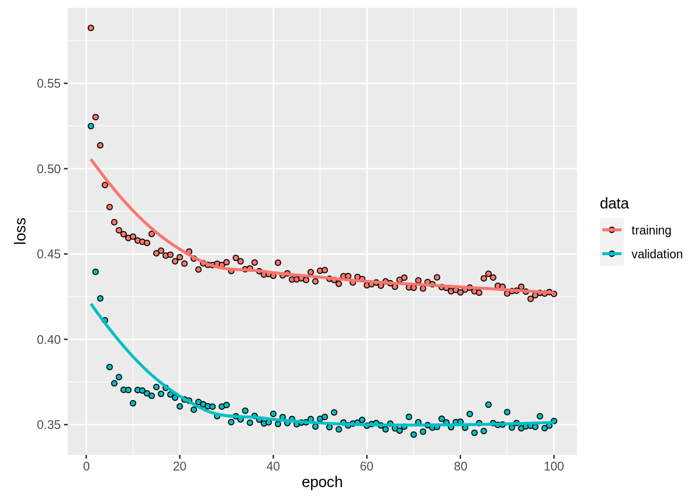

Visualize the predictions:


```r
pred = predict(rt, data)
plot(data$Temp, data$Ozone)
lines(data$Temp[order(data$Temp)], pred[order(data$Temp)], col = "red")
```

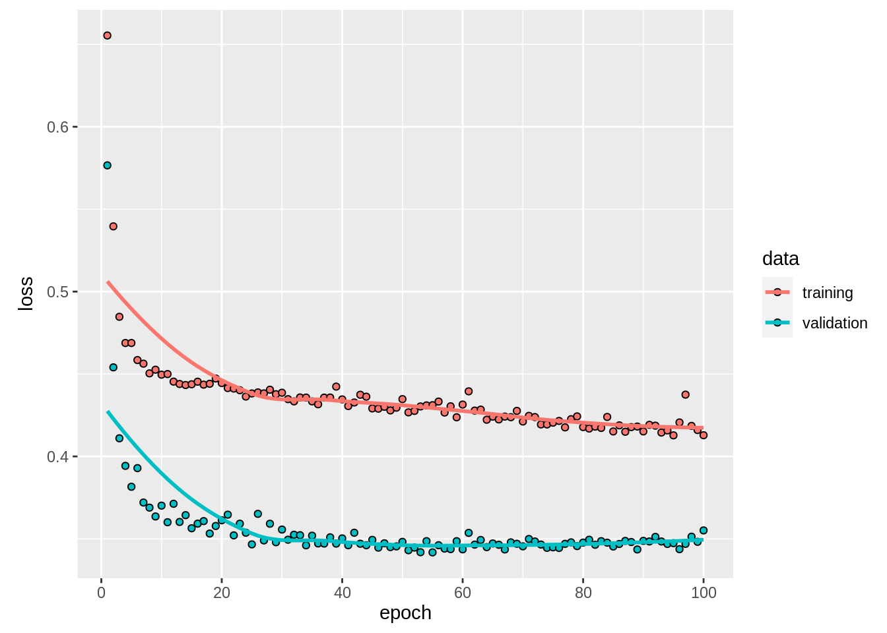

The angular form of the prediction line is typical for regression trees and is a weakness of it.


### Random Forest
To overcome this weakness, a random forest uses an ensemble of regression/classification trees. Thus, the random forest is in principle nothing else than a normal regression/classification tree, but it uses the idea of the "wisdom of the crowd": By asking many people (regression/classification trees) one can make a more informed decision (prediction/classification). When you buy a new phone for example you would also no directly go into the shop, but search in the internet and ask your friends and family.  

There are two randomization steps with the RF that are responsible for the success of RF:

- bootstrap sample for each tree (we will sample observations with replacement from the dataset, for the phone this is like that not everyone has experience about each phone)
- at each split, we will sample a subset of predictors which are then considered as potential splitting criterion (for the phone this is like that not everyone has the same decision criteria). 

Applying the random forest follows the same principle as for the methods before: we visualize the data (we have already done this so often for the airquality data set, thus we skip it here), fit the algorithm and then plot the outcomes.

Fit a RF and visualize the predictions:


```r
library(randomForest)
rf = randomForest(Ozone~., data = data)
pred = predict(rf, data)
plot(Ozone~Temp, data = data)
lines(data$Temp[order(data$Temp)], pred[order(data$Temp)], col = "red")
```


One advantage of RF is that we will get a variable importance. At each split in each tree, the improvement in the split-criterion is the importance measure attributed to the splitting variable, and is accumulated over all the trees in the forest separately for each variable. Thus the variable importance shows us how important a variable is averaged over all trees.


```r
rf$importance
```

```
##         IncNodePurity
## Solar.R      18320.95
## Wind         31075.95
## Temp         34020.46
## Month        10806.85
## Day          14989.52
```

There are several important hyperparameters in a random forest, that we can tune to get better results:

- Similar to the minsplit parameter in regression and classification trees, the hyper parameter nodesize controls for complexity -> Minimum size of terminal nodes in the tree. Setting this number larger causes smaller trees to be grown (and thus take less time). Note that the default values are different for classification (1) and regression (5).
- mtry - 	Number of features randomly sampled as candidates at each split.


### Boosted regression trees
RF fits hundreds of trees independent of each other. Here, the idea of a boosted regression tree comes in. Maybe we could learn from the errors the previous weak learners make and thus enhance the performance of the algorithm. 

Thus, a boosted regression tree (BRT) starts with a simple regression tree (weak learner) and then fits sequentially additional trees to improve the results.
There are two different strategies to do so:

- AdaBoost, wrong classified observations (by the previous tree) will get a higher weight and therefore the next trees will focus on difficult/missclassified observations.
- Gradient boosting (state of the art), each sequential model will be fit on the residual errors of the previous model.

We can fit a BRT using xgboost, but before we have to transform the data into a xgb.Dmatrix.

```r
library(xgboost)
data_xg = xgb.DMatrix(data = as.matrix(scale(data[,-1])), label = data$Ozone)
brt = xgboost(data_xg, nrounds = 16L, nthreads = 4L)
```

```
## [23:37:55] WARNING: amalgamation/../src/learner.cc:516: 
## Parameters: { nthreads } might not be used.
## 
##   This may not be accurate due to some parameters are only used in language bindings but
##   passed down to XGBoost core.  Or some parameters are not used but slip through this
##   verification. Please open an issue if you find above cases.
## 
## 
## [1]	train-rmse:39.724625 
## [2]	train-rmse:30.225760 
## [3]	train-rmse:23.134842 
## [4]	train-rmse:17.899178 
## [5]	train-rmse:14.097784 
## [6]	train-rmse:11.375458 
## [7]	train-rmse:9.391275 
## [8]	train-rmse:7.889689 
## [9]	train-rmse:6.646585 
## [10]	train-rmse:5.804859 
## [11]	train-rmse:5.128438 
## [12]	train-rmse:4.456416 
## [13]	train-rmse:4.069464 
## [14]	train-rmse:3.674615 
## [15]	train-rmse:3.424578 
## [16]	train-rmse:3.191301
```

The nrounds controls how many sequantial trees we fit, in our example this was 16. When we predict to new data, we can limit the number of trees used to prevent overfitting (remeber: each new tree tries to improve the predictions of the previous trees). 

Let us visualize the predictions for different number of trees:

```r
par(mfrow = c(2,2))
for(i in 1:4){
  pred = predict(brt, newdata = data_xg, ntreelimit = i)
  plot(data$Temp, data$Ozone, main = i)
  lines(data$Temp[order(data$Temp)], pred[order(data$Temp)], col = "red")
}
```

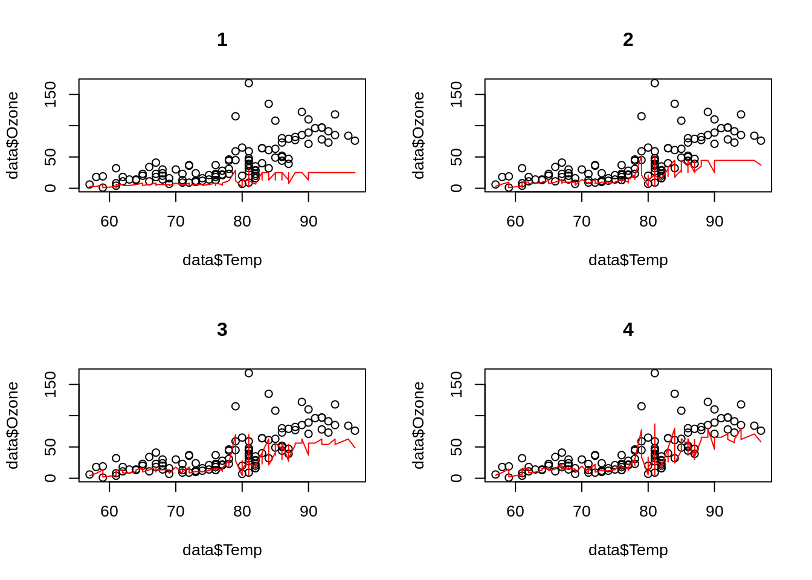
There are also other ways to control for complexity of the BRT algorithm:

- max_depth, depth of each tree
- shrinkage (each tree will get a weight and the weight will decrease with the number of trees)

When having specified the final model, we can as for random forests get a variable importance:


```r
xgboost::xgb.importance(model = brt)
```

```
##    Feature        Gain     Cover  Frequency
## 1:    Temp 0.570071875 0.2958229 0.24836601
## 2:    Wind 0.348230710 0.3419576 0.24183007
## 3: Solar.R 0.058795559 0.1571072 0.30718954
## 4:     Day 0.019530002 0.1779925 0.16993464
## 5:   Month 0.003371853 0.0271197 0.03267974
```

```r
sqrt(mean((data$Ozone - pred)^2)) # RMSE
```

```
## [1] 17.89918
```

```r
data_xg = xgb.DMatrix(data = as.matrix(scale(data[,-1])), label = data$Ozone)
```

One important strength of xgboost is that we can directly do a cross-validation (which is indepdent on the BRT itself!) and specify its properties with nfold (the original dataset is randomly partitioned intonfoldequal size subsamples and each time one of these data sets is used for predictions to judge the performance):


```r
brt = xgboost(data_xg, nrounds = 5L)
```

```
## [1]	train-rmse:39.724625 
## [2]	train-rmse:30.225761 
## [3]	train-rmse:23.134842 
## [4]	train-rmse:17.899178 
## [5]	train-rmse:14.097784
```

```r
brt_cv = xgboost::xgb.cv(data = data_xg, nfold = 3L, nrounds = 3L, nthreads = 4L)
```

```
## [1]	train-rmse:39.886848+1.148135	test-rmse:40.835787+4.206757 
## [2]	train-rmse:30.437888+0.922479	test-rmse:32.590283+4.841707 
## [3]	train-rmse:23.503598+0.751941	test-rmse:27.267021+5.103056
```

```r
print(brt_cv)
```

```
## ##### xgb.cv 3-folds
##  iter train_rmse_mean train_rmse_std test_rmse_mean test_rmse_std
##     1        39.88685      1.1481345       40.83579      4.206757
##     2        30.43789      0.9224789       32.59028      4.841707
##     3        23.50360      0.7519412       27.26702      5.103056
```

If we do three-folded CV, we actually fit three different BRT models (xgboost models)

This now tells us how well the model performed.


## Distance-based algorithms
In this chapter, we introduce support-vector machines (SVMs) and other distance-based methods.

### k-nearest-neighbor
K Nearest Neighbour (kNN) is a simple algorithm that stores all the available cases and classifies the new data based on a similarity measure. It is mostly used to classifies a data point based on how its k nearest neighbours are classified.

Let us first see an example:

```r
X = scale(iris[,1:4])
Y = iris[,5]
plot(X[-100,1], X[-100,3], col = Y)
points(X[100,1], X[100,3], col = "blue", pch = 18, cex = 1.3)
```

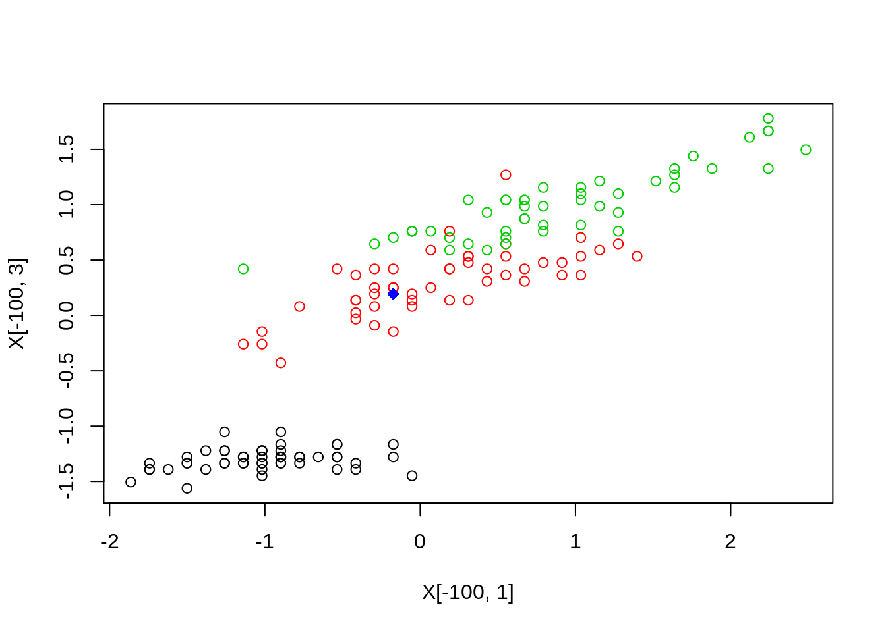

Which class would you decide for the blue point? What are the classes of the nearest points? Well this procedure is used by the kNN and thus there is actually no "real" learning in a kNN.

For applying a kNN, we first have to scale teh data set, because we deal with distances and a priori want the same influence of all predictors (image one variable has values from -10.000 to 10.000 and one from -1 to 1, then the influence of the first variable on the distance to the other points is stronger than the second variable). As in the iris-data set there are no real test, we also have to split the data into train and test. Then we will follow the usual pipeline. 


```r
data = iris
data[,1:4] = apply(data[,1:4],2, scale)
indices = sample.int(nrow(data), 0.7*nrow(data))
train = data[indices,]
test = data[-indices,]
```

Fit model and create predictions:


```r
library(kknn)
knn = kknn(Species~., train = train, test = test)
summary(knn)
```

```
## 
## Call:
## kknn(formula = Species ~ ., train = train, test = test)
## 
## Response: "nominal"
##           fit prob.setosa prob.versicolor prob.virginica
## 1      setosa           1       0.0000000     0.00000000
## 2      setosa           1       0.0000000     0.00000000
## 3      setosa           1       0.0000000     0.00000000
## 4      setosa           1       0.0000000     0.00000000
## 5      setosa           1       0.0000000     0.00000000
## 6      setosa           1       0.0000000     0.00000000
## 7      setosa           1       0.0000000     0.00000000
## 8      setosa           1       0.0000000     0.00000000
## 9      setosa           1       0.0000000     0.00000000
## 10     setosa           1       0.0000000     0.00000000
## 11     setosa           1       0.0000000     0.00000000
## 12     setosa           1       0.0000000     0.00000000
## 13     setosa           1       0.0000000     0.00000000
## 14     setosa           1       0.0000000     0.00000000
## 15     setosa           1       0.0000000     0.00000000
## 16     setosa           1       0.0000000     0.00000000
## 17     setosa           1       0.0000000     0.00000000
## 18 versicolor           0       0.9843084     0.01569160
## 19 versicolor           0       1.0000000     0.00000000
## 20 versicolor           0       0.7626128     0.23738721
## 21 versicolor           0       0.9843084     0.01569160
## 22 versicolor           0       0.9511855     0.04881448
## 23 versicolor           0       1.0000000     0.00000000
## 24 versicolor           0       1.0000000     0.00000000
## 25 versicolor           0       1.0000000     0.00000000
## 26 versicolor           0       0.8271189     0.17288113
## 27 versicolor           0       0.9843084     0.01569160
## 28  virginica           0       0.3205816     0.67941842
## 29  virginica           0       0.2266030     0.77339705
## 30  virginica           0       0.0000000     1.00000000
## 31  virginica           0       0.1008186     0.89918140
## 32  virginica           0       0.0000000     1.00000000
## 33  virginica           0       0.1257844     0.87421565
## 34  virginica           0       0.0000000     1.00000000
## 35  virginica           0       0.0000000     1.00000000
## 36  virginica           0       0.2373872     0.76261279
## 37  virginica           0       0.0000000     1.00000000
## 38  virginica           0       0.3569042     0.64309579
## 39  virginica           0       0.0000000     1.00000000
## 40 versicolor           0       0.6274042     0.37259581
## 41  virginica           0       0.0000000     1.00000000
## 42  virginica           0       0.2736997     0.72630027
## 43  virginica           0       0.3205816     0.67941842
## 44  virginica           0       0.3850877     0.61491234
## 45  virginica           0       0.0000000     1.00000000
```

```r
table(test$Species, fitted(knn))
```

```
##             
##              setosa versicolor virginica
##   setosa         17          0         0
##   versicolor      0         10         0
##   virginica       0          1        17
```

 

### Support Vector Machines (SVM)
Support vectors machines have a different approach. They try to divide the predictor space into spaces sectors for each class. To do so a SVM fits the parameters of a hyperplane (a n-1 dimensional subspace in a n-dimensional space) in the predictor space by optimizing the distance between the hyperlane and the nearest point from each class. 

Fitting a SVM:


```r
library(e1071)
data = iris
data[,1:4] = apply(data[,1:4],2, scale)
indices = sample.int(nrow(data), 0.7*nrow(data))
train = data[indices,]
test = data[-indices,]

sm = svm(Species~., data = train, kernel = "linear")
pred = predict(sm, newdata = test)
```


```r
oldpar = par()
par(mfrow = c(1,2))
plot(test$Sepal.Length, test$Petal.Length, col =  pred, main = "predicted")
plot(test$Sepal.Length, test$Petal.Length, col =  test$Species, main = "observed")
```

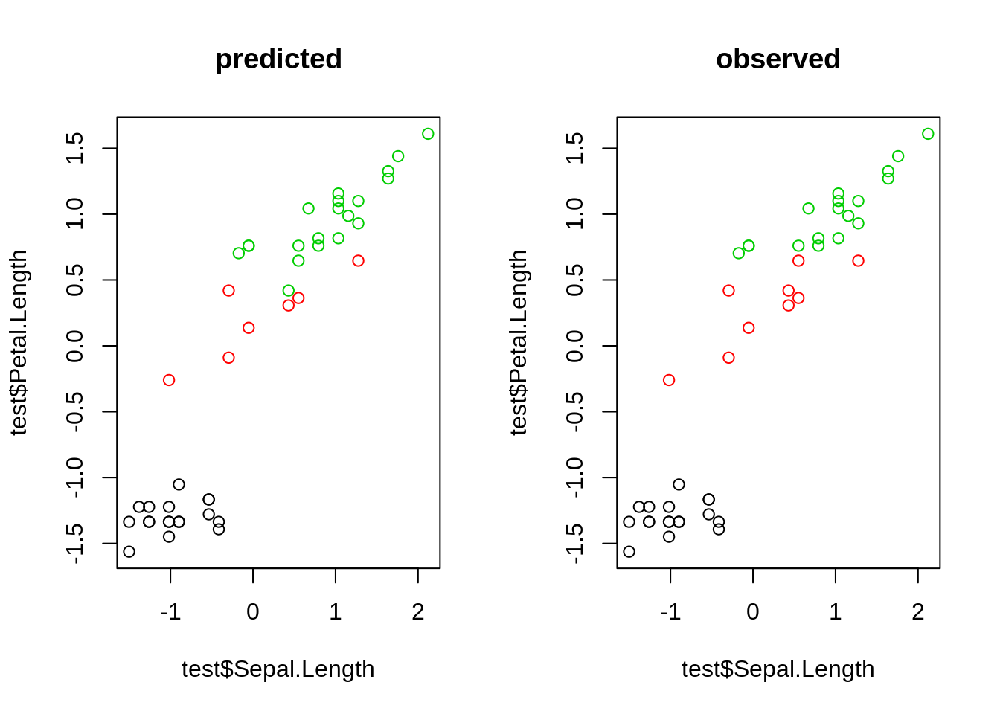

```r
par(oldpar)
```

```
## Warning in par(oldpar): graphical parameter "cin" cannot be set
```

```
## Warning in par(oldpar): graphical parameter "cra" cannot be set
```

```
## Warning in par(oldpar): graphical parameter "csi" cannot be set
```

```
## Warning in par(oldpar): graphical parameter "cxy" cannot be set
```

```
## Warning in par(oldpar): graphical parameter "din" cannot be set
```

```
## Warning in par(oldpar): graphical parameter "page" cannot be set
```

```r
mean(pred==test$Species) # accuracy
```

```
## [1] 0.9555556
```


SVM can only work on linear separable problems (A problem is called linearly separable if there exists at least one line in the plane with all of the points of one class on one side of the hyperplane and all the points of the others classes on the other side).

If this is not possible, we however, can use the so called kernel trick, which maps the predictor space into a (higher dimensional) space in which the problem is linear separable. After having identified the boundaries in the higher-dimensional space, we can project them back into the original dimensions. 


```r
set.seed(42)
x1 = seq(-3, 3, length.out = 100)
x2 = seq(-3, 3, length.out = 100)
X = expand.grid(x1, x2)
y = apply(X, 1, function(x) exp(-x[1]^2 - x[2]^2))
y = ifelse(1/(1+exp(-y)) < 0.62, 0, 1)
image(matrix(y, 100, 100))
animation::saveGIF({
  for (i in c("truth","linear", "radial", "sigmoid")) {
    if(i == "truth"){
      image(matrix(y, 100,100),main = "Ground truth",axes = FALSE, las = 2)
    }else{
      sv = e1071::svm(x = X, y = factor(y), kernel = i)
      image(matrix(as.numeric(as.character(predict(sv, X))), 100,100),main = paste0("Kernel: ", i),axes = FALSE, las = 2)
      axis(1, at = seq(0,1, length.out = 10), labels = round(seq(-3,3, length.out = 10), 1))
      axis(2, at = seq(0,1, length.out = 10), labels = round(seq(-3,3, length.out = 10), 1), las = 2)
    }
  }
},movie.name = "svm.gif", autobrowse = FALSE)
```


<!-- -->

As you have seen this does not work with each kernel. Thus, the problem is to find the actual correct kernel, which is again an optimization procedure and can thus be approximated.

## Artificial neural networks
Now, we will come to artificial neural networks (ANNs), for which the topic of regularization is also important. We can specify the regularization in each layer via the kernel_regularization argument. 


```r
library(keras)
data = airquality
summary(data)
```

```
##      Ozone           Solar.R           Wind             Temp           Month            Day      
##  Min.   :  1.00   Min.   :  7.0   Min.   : 1.700   Min.   :56.00   Min.   :5.000   Min.   : 1.0  
##  1st Qu.: 18.00   1st Qu.:115.8   1st Qu.: 7.400   1st Qu.:72.00   1st Qu.:6.000   1st Qu.: 8.0  
##  Median : 31.50   Median :205.0   Median : 9.700   Median :79.00   Median :7.000   Median :16.0  
##  Mean   : 42.13   Mean   :185.9   Mean   : 9.958   Mean   :77.88   Mean   :6.993   Mean   :15.8  
##  3rd Qu.: 63.25   3rd Qu.:258.8   3rd Qu.:11.500   3rd Qu.:85.00   3rd Qu.:8.000   3rd Qu.:23.0  
##  Max.   :168.00   Max.   :334.0   Max.   :20.700   Max.   :97.00   Max.   :9.000   Max.   :31.0  
##  NA's   :37       NA's   :7
```

```r
data = data[complete.cases(data),] # remove NAs
summary(data)
```

```
##      Ozone          Solar.R           Wind            Temp           Month            Day       
##  Min.   :  1.0   Min.   :  7.0   Min.   : 2.30   Min.   :57.00   Min.   :5.000   Min.   : 1.00  
##  1st Qu.: 18.0   1st Qu.:113.5   1st Qu.: 7.40   1st Qu.:71.00   1st Qu.:6.000   1st Qu.: 9.00  
##  Median : 31.0   Median :207.0   Median : 9.70   Median :79.00   Median :7.000   Median :16.00  
##  Mean   : 42.1   Mean   :184.8   Mean   : 9.94   Mean   :77.79   Mean   :7.216   Mean   :15.95  
##  3rd Qu.: 62.0   3rd Qu.:255.5   3rd Qu.:11.50   3rd Qu.:84.50   3rd Qu.:9.000   3rd Qu.:22.50  
##  Max.   :168.0   Max.   :334.0   Max.   :20.70   Max.   :97.00   Max.   :9.000   Max.   :31.00
```

```r
X = scale(data[,2:6])
Y = data[,1]
model = keras_model_sequential()
penalty = 0.1
model %>%
 layer_dense(units = 100L, activation = "relu", input_shape = list(5L), kernel_regularizer = regularizer_l1(penalty)) %>%
 layer_dense(units = 100L, activation = "relu", kernel_regularizer = regularizer_l1(penalty) ) %>%
 layer_dense(units = 100L, activation = "relu", kernel_regularizer = regularizer_l1(penalty)) %>%
 layer_dense(units = 1L, activation = "linear", kernel_regularizer = regularizer_l1(penalty)) # one output dimension with a linear activation function
summary(model)
```

```
## Model: "sequential_3"
## ___________________________________________________________________________________________________________________________
## Layer (type)                                           Output Shape                                     Param #            
## ===========================================================================================================================
## dense_6 (Dense)                                        (None, 100)                                      600                
## ___________________________________________________________________________________________________________________________
## dense_7 (Dense)                                        (None, 100)                                      10100              
## ___________________________________________________________________________________________________________________________
## dense_8 (Dense)                                        (None, 100)                                      10100              
## ___________________________________________________________________________________________________________________________
## dense_9 (Dense)                                        (None, 1)                                        101                
## ===========================================================================================================================
## Total params: 20,901
## Trainable params: 20,901
## Non-trainable params: 0
## ___________________________________________________________________________________________________________________________
```

```r
model %>%
 compile(loss = loss_mean_squared_error, keras::optimizer_adamax(0.1))
model_history =
 model %>%
 fit(x = X, y = matrix(Y, ncol = 1L), epochs = 100L, batch_size = 20L, shuffle = TRUE, validation_split = 0.2)
plot(model_history)
```

```
## `geom_smooth()` using formula 'y ~ x'
```

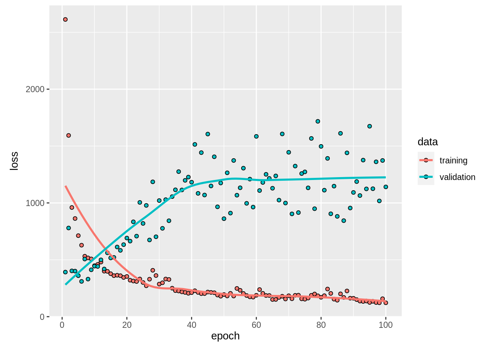

```r
weights = lapply(model$weights, function(w) w$numpy() )
fields::image.plot(weights[[1]])
```

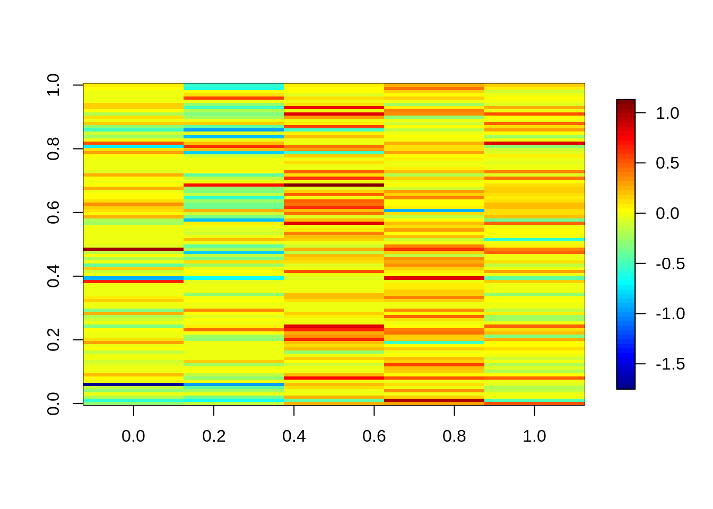

<details>
<summary>
**<span style="color: #CC2FAA">torch</span>**
</summary>
<p>
Again, we have to do the regularization on our own:

```r
model_torch = nn_sequential(
  nn_linear(in_features = dim(X)[2], out_features = 100L),
  nn_relu(),
  nn_linear(100L, 100L),
  nn_relu(),
  nn_linear(100L, 100L),
  nn_relu(),
  nn_linear(100L, 1L),
)
opt = optim_adam(params = model_torch$parameters, lr = 0.1)

X_torch = torch_tensor(X)
Y_torch = torch_tensor(matrix(Y, ncol = 1L), dtype = torch_float32())
for(i in 1:500) {
  indices = sample.int(nrow(X), 20L)
  opt$zero_grad()
  pred = model_torch(X_torch[indices, ])
  loss = nnf_mse_loss(pred, Y_torch[indices,,drop=FALSE])
  
  ## Add l1 (only on the 'kernel weights'):
  for(i in seq(1, 8, by = 2)) loss = loss + model_torch$parameters[[i]]$abs()$sum()*0.1
  
  loss$sum()$backward()
  opt$step()
}
```

Let's visualize the first (input layer):

```r
fields::image.plot(as.matrix(model_torch$parameters$`0.weight`))
```

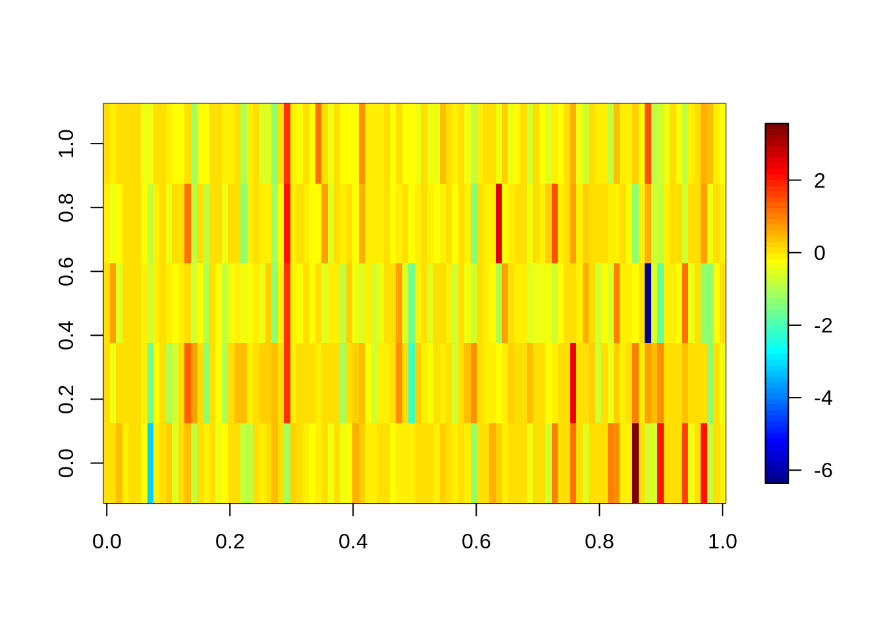

</details>
<br/>


Additionally to the usual l1 and l2 regularisation there is an additional regularisation: the so called dropout-layer (we will learn about this in more detail later).

Before we specialise on any tuning it is important to understand that ML always consists of a pipeline of actions. 

## The standard ML pipeline at the example of the titanic dataset
The typical ML workflow consist of:

- Data cleaning and exploration (EDA=explorative data analysis) with tidyverse
- Pre-processing and feature selection
- Splitting dataset into train and test set for evaluation
- Model fitting
- Model evaluation
- New predictions
Here is an (optional) video that explains the entire pipeline from a slightly different perspective


<iframe width="560" height="315" 
  src="https://www.youtube.com/embed/nKW8Ndu7Mjw"
  frameborder="0" allow="accelerometer; autoplay; encrypted-media;
  gyroscope; picture-in-picture" allowfullscreen>
  </iframe>

In the following example, we use tidyverse, a collection of R packages for data science / data manipulation mainly developed by Hadley Wickham. A video that explains the basics can be found here 

<iframe width="560" height="315" 
  src="https://www.youtube.com/embed/nRtp7wSEtJA"
  frameborder="0" allow="accelerometer; autoplay; encrypted-media;
  gyroscope; picture-in-picture" allowfullscreen>
  </iframe>

Another good reference is R for data science by Hadley [](https://r4ds.had.co.nz/)

For this lecture you need the titanic dataset provided by us. You can find it in GRIPS (datasets.RData in the dataset and submission section) or at [](http://rhsbio6.uni-regensburg.de:8500).

We have split the dataset already into training and testing datasets (the test split has one column less than the train split, as the result is not known a priori for the test)

### Data cleaning
Load necessary libraries:

```r
library(keras)
library(tensorflow)
library(tidyverse)
```

Load dataset:

```r
load("datasets.RData")
# library(EcoData)
# data(titanic_ml)
# titanic = titanic_ml
data = titanic
```

Standard summaries:

```r
str(data)
```

```
## 'data.frame':	1309 obs. of  14 variables:
##  $ pclass   : int  2 1 3 3 3 3 3 1 3 1 ...
##  $ survived : int  1 1 0 0 0 0 0 1 0 1 ...
##  $ name     : chr  "Sinkkonen, Miss. Anna" "Woolner, Mr. Hugh" "Sage, Mr. Douglas Bullen" "Palsson, Master. Paul Folke" ...
##  $ sex      : Factor w/ 2 levels "female","male": 1 2 2 2 2 2 2 1 1 1 ...
##  $ age      : num  30 NA NA 6 30.5 38.5 20 53 NA 42 ...
##  $ sibsp    : int  0 0 8 3 0 0 0 0 0 0 ...
##  $ parch    : int  0 0 2 1 0 0 0 0 0 0 ...
##  $ ticket   : Factor w/ 929 levels "110152","110413",..: 221 123 779 542 589 873 472 823 588 834 ...
##  $ fare     : num  13 35.5 69.55 21.07 8.05 ...
##  $ cabin    : Factor w/ 187 levels "","A10","A11",..: 1 94 1 1 1 1 1 1 1 1 ...
##  $ embarked : Factor w/ 4 levels "","C","Q","S": 4 4 4 4 4 4 4 2 4 2 ...
##  $ boat     : Factor w/ 28 levels "","1","10","11",..: 3 28 1 1 1 1 1 19 1 15 ...
##  $ body     : int  NA NA NA NA 50 32 NA NA NA NA ...
##  $ home.dest: Factor w/ 370 levels "","?Havana, Cuba",..: 121 213 1 1 1 1 322 350 1 1 ...
```

```r
summary(data)
```

```
##      pclass         survived          name               sex           age              sibsp            parch      
##  Min.   :1.000   Min.   :0.0000   Length:1309        female:466   Min.   : 0.1667   Min.   :0.0000   Min.   :0.000  
##  1st Qu.:2.000   1st Qu.:0.0000   Class :character   male  :843   1st Qu.:21.0000   1st Qu.:0.0000   1st Qu.:0.000  
##  Median :3.000   Median :0.0000   Mode  :character                Median :28.0000   Median :0.0000   Median :0.000  
##  Mean   :2.295   Mean   :0.3853                                   Mean   :29.8811   Mean   :0.4989   Mean   :0.385  
##  3rd Qu.:3.000   3rd Qu.:1.0000                                   3rd Qu.:39.0000   3rd Qu.:1.0000   3rd Qu.:0.000  
##  Max.   :3.000   Max.   :1.0000                                   Max.   :80.0000   Max.   :8.0000   Max.   :9.000  
##                  NA's   :655                                      NA's   :263                                       
##       ticket          fare                     cabin      embarked      boat          body      
##  CA. 2343:  11   Min.   :  0.000                  :1014    :  2           :823   Min.   :  1.0  
##  1601    :   8   1st Qu.:  7.896   C23 C25 C27    :   6   C:270    13     : 39   1st Qu.: 72.0  
##  CA 2144 :   8   Median : 14.454   B57 B59 B63 B66:   5   Q:123    C      : 38   Median :155.0  
##  3101295 :   7   Mean   : 33.295   G6             :   5   S:914    15     : 37   Mean   :160.8  
##  347077  :   7   3rd Qu.: 31.275   B96 B98        :   4            14     : 33   3rd Qu.:256.0  
##  347082  :   7   Max.   :512.329   C22 C26        :   4            4      : 31   Max.   :328.0  
##  (Other) :1261   NA's   :1         (Other)        : 271            (Other):308   NA's   :1188   
##                 home.dest  
##                      :564  
##  New York, NY        : 64  
##  London              : 14  
##  Montreal, PQ        : 10  
##  Cornwall / Akron, OH:  9  
##  Paris, France       :  9  
##  (Other)             :639
```

```r
head(data)
```

```
##      pclass survived                         name    sex  age sibsp parch             ticket   fare cabin embarked boat
## 561       2        1        Sinkkonen, Miss. Anna female 30.0     0     0             250648 13.000              S   10
## 321       1        1            Woolner, Mr. Hugh   male   NA     0     0              19947 35.500   C52        S    D
## 1177      3        0     Sage, Mr. Douglas Bullen   male   NA     8     2           CA. 2343 69.550              S     
## 1098      3        0  Palsson, Master. Paul Folke   male  6.0     3     1             349909 21.075              S     
## 1252      3        0   Tomlin, Mr. Ernest Portage   male 30.5     0     0             364499  8.050              S     
## 1170      3        0 Saether, Mr. Simon Sivertsen   male 38.5     0     0 SOTON/O.Q. 3101262  7.250              S     
##      body                home.dest
## 561    NA Finland / Washington, DC
## 321    NA          London, England
## 1177   NA                         
## 1098   NA                         
## 1252   50                         
## 1170   32
```

The name variable consists of 1309 unique factors (there are 1309 observations...):


```r
length(unique(data$name))
```

```
## [1] 1307
```

However, there is a title in each name. Let's extract the titles:

1. we will extract all names and split each name after each comma ","
2. we will split the second split of the name after a point "." and extract the titles

```r
first_split = sapply(data$name, function(x) stringr::str_split(x, pattern = ",")[[1]][2])
titles = sapply(first_split, function(x) strsplit(x, ".",fixed = TRUE)[[1]][1])
```

We get 18 unique titles:

```r
table(titles)
```

```
## titles
##          Capt           Col           Don          Dona            Dr      Jonkheer          Lady         Major 
##             1             4             1             1             8             1             1             2 
##        Master          Miss          Mlle           Mme            Mr           Mrs            Ms           Rev 
##            61           260             2             1           757           197             2             8 
##           Sir  the Countess 
##             1             1
```


A few titles have a very low occurrence rate:

```r
titles = stringr::str_trim((titles))
titles %>%
 fct_count()
```

```
## # A tibble: 18 x 2
##    f                n
##    <fct>        <int>
##  1 Capt             1
##  2 Col              4
##  3 Don              1
##  4 Dona             1
##  5 Dr               8
##  6 Jonkheer         1
##  7 Lady             1
##  8 Major            2
##  9 Master          61
## 10 Miss           260
## 11 Mlle             2
## 12 Mme              1
## 13 Mr             757
## 14 Mrs            197
## 15 Ms               2
## 16 Rev              8
## 17 Sir              1
## 18 the Countess     1
```

We will collapse titles with low occurrences into one title, which we can easily do with the forcats package.


```r
titles2 =
  forcats::fct_collapse(titles,
                        officer = c("Capt", "Col", "Major", "Dr", "Rev"),
                        royal = c("Jonkheer", "Don", "Sir", "the Countess", "Dona", "Lady"),
                        miss = c("Miss", "Mlle"),
                        mrs = c("Mrs", "Mme", "Ms")
                        )
```

We can count titles again to see the new number of titles


```r
titles2 %>%  
   fct_count()
```

```
## # A tibble: 6 x 2
##   f           n
##   <fct>   <int>
## 1 officer    23
## 2 royal       6
## 3 Master     61
## 4 miss      262
## 5 mrs       200
## 6 Mr        757
```

Add new title variable to dataset:


```r
data =
  data %>%
    mutate(title = titles2)
```

As a second example, we will explore and clean the numeric "age" variable:

Explore the variable:

```r
summary(data)
```

```
##      pclass         survived          name               sex           age              sibsp            parch      
##  Min.   :1.000   Min.   :0.0000   Length:1309        female:466   Min.   : 0.1667   Min.   :0.0000   Min.   :0.000  
##  1st Qu.:2.000   1st Qu.:0.0000   Class :character   male  :843   1st Qu.:21.0000   1st Qu.:0.0000   1st Qu.:0.000  
##  Median :3.000   Median :0.0000   Mode  :character                Median :28.0000   Median :0.0000   Median :0.000  
##  Mean   :2.295   Mean   :0.3853                                   Mean   :29.8811   Mean   :0.4989   Mean   :0.385  
##  3rd Qu.:3.000   3rd Qu.:1.0000                                   3rd Qu.:39.0000   3rd Qu.:1.0000   3rd Qu.:0.000  
##  Max.   :3.000   Max.   :1.0000                                   Max.   :80.0000   Max.   :8.0000   Max.   :9.000  
##                  NA's   :655                                      NA's   :263                                       
##       ticket          fare                     cabin      embarked      boat          body      
##  CA. 2343:  11   Min.   :  0.000                  :1014    :  2           :823   Min.   :  1.0  
##  1601    :   8   1st Qu.:  7.896   C23 C25 C27    :   6   C:270    13     : 39   1st Qu.: 72.0  
##  CA 2144 :   8   Median : 14.454   B57 B59 B63 B66:   5   Q:123    C      : 38   Median :155.0  
##  3101295 :   7   Mean   : 33.295   G6             :   5   S:914    15     : 37   Mean   :160.8  
##  347077  :   7   3rd Qu.: 31.275   B96 B98        :   4            14     : 33   3rd Qu.:256.0  
##  347082  :   7   Max.   :512.329   C22 C26        :   4            4      : 31   Max.   :328.0  
##  (Other) :1261   NA's   :1         (Other)        : 271            (Other):308   NA's   :1188   
##                 home.dest       title    
##                      :564   officer: 23  
##  New York, NY        : 64   royal  :  6  
##  London              : 14   Master : 61  
##  Montreal, PQ        : 10   miss   :262  
##  Cornwall / Akron, OH:  9   mrs    :200  
##  Paris, France       :  9   Mr     :757  
##  (Other)             :639
```

```r
sum(is.na(data$age))/nrow(data)
```

```
## [1] 0.2009167
```

20% NAs!
Either we remove all observations with NAs, or we impute (fill) the missing values, e.g. with the median age. However, age itself might depend on other variables such as sex, class and title. We want to fill the NAs with the median age of these groups.
In tidyverse we can easily "group" the data, i.e. we will nest the observations (here: group_by after sex, pclass and title).
After grouping, all operations (such as our median(age....)) will be done within the specified groups.
 

```r
data =
  data %>%
    group_by(sex, pclass, title) %>%
    mutate(age2 = ifelse(is.na(age), median(age, na.rm = TRUE), age)) %>%
    mutate(fare2 = ifelse(is.na(fare), median(fare, na.rm = TRUE), fare)) %>%
    ungroup()
```
 

### Pre-processing and feature selection
We want to you keras in our example, but it cannot handle factors and requires scaled the data.

Normally, one would do this for all predictors, but as we here only showe the pipeline, we have sub-selected a bunch of predictors and do this only for them.

We first scale the numeric predictors abd change the factors with only two groups/levels into integer (this can be handled from keras)

```r
data_sub =
  data %>%
    select(survived, sex, age2, fare2, title, pclass) %>%
    mutate(age2 = scales::rescale(age2, c(0,1)), fare2 = scales::rescale(fare2, c(0,1))) %>%
    mutate(sex = as.integer(sex) - 1L, title = as.integer(title) - 1L, pclass = as.integer(pclass - 1L))
```

Factors with more than two levels, should be one hot encoded:

```r
one_title = k_one_hot(data_sub$title, length(unique(data$title)))$numpy()
colnames(one_title) = levels(data$title)

one_sex = k_one_hot(data_sub$sex, length(unique(data$sex)))$numpy()
colnames(one_sex) = levels(data$sex)

one_pclass = k_one_hot(data_sub$pclass,  length(unique(data$pclass)))$numpy()
colnames(one_pclass) = paste0(1:length(unique(data$pclass)), "pclass")
```
And we have to add the dummy encoded variables to the dataset:


```r
data_sub = cbind(data.frame(survived= data_sub$survived), one_title, one_sex, age = data_sub$age2, fare = data_sub$fare2, one_pclass)
head(data_sub)
```

```
##   survived officer royal Master miss mrs Mr female male        age       fare 1pclass 2pclass 3pclass
## 1        1       0     0      0    1   0  0      1    0 0.37369494 0.02537431       0       1       0
## 2        1       0     0      0    0   0  1      0    1 0.51774510 0.06929139       1       0       0
## 3        0       0     0      0    0   0  1      0    1 0.32359053 0.13575256       0       0       1
## 4        0       0     0      1    0   0  0      0    1 0.07306851 0.04113566       0       0       1
## 5        0       0     0      0    0   0  1      0    1 0.37995799 0.01571255       0       0       1
## 6        0       0     0      0    0   0  1      0    1 0.48016680 0.01415106       0       0       1
```

### Split data for training and testing
The splitting consists of two splits:

- an outer split (the original split, remember we got a train and test split without the response "survived")
- an inner split (we will split further the train dataset into another train and test split with known response)
The inner split is important because to assess the model's performance and potential overfitting

Outer split:


```r
train = data_sub[!is.na(data_sub$survived),]
test = data_sub[is.na(data_sub$survived),]
```
Inner split:


```r
indices = sample.int(nrow(train), 0.7*nrow(train))
sub_train = train[indices,]
sub_test = train[-indices,]
```
What is the difference between the two splits? (Tip: have a look at the variable survived)

### Model fitting
In the next step we will fit a keras model on the train data of the inner split:

```r
model = keras_model_sequential()
model %>%
  layer_dense(units = 20L, input_shape = ncol(sub_train) - 1L, activation = "relu") %>%
  layer_dense(units = 20L, activation = "relu") %>%
  layer_dense(units = 20L, activation = "relu") %>%
  layer_dense(units = 2L, activation = "softmax")
summary(model)
```

```
## Model: "sequential_4"
## ___________________________________________________________________________________________________________________________
## Layer (type)                                           Output Shape                                     Param #            
## ===========================================================================================================================
## dense_10 (Dense)                                       (None, 20)                                       280                
## ___________________________________________________________________________________________________________________________
## dense_11 (Dense)                                       (None, 20)                                       420                
## ___________________________________________________________________________________________________________________________
## dense_12 (Dense)                                       (None, 20)                                       420                
## ___________________________________________________________________________________________________________________________
## dense_13 (Dense)                                       (None, 2)                                        42                 
## ===========================================================================================================================
## Total params: 1,162
## Trainable params: 1,162
## Non-trainable params: 0
## ___________________________________________________________________________________________________________________________
```

```r
model_history =
model %>%
  compile(loss = loss_categorical_crossentropy, optimizer = keras::optimizer_adamax(0.01))
model_history =
  model %>%
    fit(x = as.matrix(sub_train[,-1]), y = to_categorical(sub_train[,1],num_classes = 2L), epochs = 100L, batch_size = 32L, validation_split = 0.2, shuffle = TRUE)

plot(model_history)
```

```
## `geom_smooth()` using formula 'y ~ x'
```


<details>
<summary>
**<span style="color: #CC2FAA">torch</span>**
</summary>
<p>

```r
model_torch = nn_sequential(
  nn_linear(in_features = dim(sub_train[,-1])[2], out_features = 20L),
  nn_relu(),
  nn_linear(20L, 20L),
  nn_relu(),
  nn_linear(20L, 2L)
)
opt = optim_adam(params = model_torch$parameters, lr = 0.01)

X_torch = torch_tensor( as.matrix(sub_train[,-1])) 
Y_torch = torch_tensor(sub_train[,1]+1, dtype= torch_long())
for(i in 1:500) {
  indices = sample.int(nrow(sub_train), 20L)
  opt$zero_grad()
  pred = model_torch(X_torch[indices, ])
  loss = nnf_cross_entropy(pred, Y_torch[indices], reduction = "mean")
  print(loss)
  loss$backward()
  opt$step()
}
```

```
## torch_tensor
## 0.674505
## [ CPUFloatType{} ]
## torch_tensor
## 0.687759
## [ CPUFloatType{} ]
## torch_tensor
## 0.659471
## [ CPUFloatType{} ]
## torch_tensor
## 0.629493
## [ CPUFloatType{} ]
## torch_tensor
## 0.663918
## [ CPUFloatType{} ]
## torch_tensor
## 0.668542
## [ CPUFloatType{} ]
## torch_tensor
## 0.618048
## [ CPUFloatType{} ]
## torch_tensor
## 0.537068
## [ CPUFloatType{} ]
## torch_tensor
## 0.616329
## [ CPUFloatType{} ]
## torch_tensor
## 0.625666
## [ CPUFloatType{} ]
## torch_tensor
## 0.555079
## [ CPUFloatType{} ]
## torch_tensor
## 0.617161
## [ CPUFloatType{} ]
## torch_tensor
## 0.681252
## [ CPUFloatType{} ]
## torch_tensor
## 0.481454
## [ CPUFloatType{} ]
## torch_tensor
## 0.551633
## [ CPUFloatType{} ]
## torch_tensor
## 0.516082
## [ CPUFloatType{} ]
## torch_tensor
## 0.484434
## [ CPUFloatType{} ]
## torch_tensor
## 0.547698
## [ CPUFloatType{} ]
## torch_tensor
## 0.43127
## [ CPUFloatType{} ]
## torch_tensor
## 0.626385
## [ CPUFloatType{} ]
## torch_tensor
## 0.511114
## [ CPUFloatType{} ]
## torch_tensor
## 0.372383
## [ CPUFloatType{} ]
## torch_tensor
## 0.432114
## [ CPUFloatType{} ]
## torch_tensor
## 0.499551
## [ CPUFloatType{} ]
## torch_tensor
## 0.453553
## [ CPUFloatType{} ]
## torch_tensor
## 0.466136
## [ CPUFloatType{} ]
## torch_tensor
## 0.448839
## [ CPUFloatType{} ]
## torch_tensor
## 0.759023
## [ CPUFloatType{} ]
## torch_tensor
## 0.388911
## [ CPUFloatType{} ]
## torch_tensor
## 0.495784
## [ CPUFloatType{} ]
## torch_tensor
## 0.54462
## [ CPUFloatType{} ]
## torch_tensor
## 0.506348
## [ CPUFloatType{} ]
## torch_tensor
## 0.367066
## [ CPUFloatType{} ]
## torch_tensor
## 0.646748
## [ CPUFloatType{} ]
## torch_tensor
## 0.539941
## [ CPUFloatType{} ]
## torch_tensor
## 0.511312
## [ CPUFloatType{} ]
## torch_tensor
## 0.513487
## [ CPUFloatType{} ]
## torch_tensor
## 0.458311
## [ CPUFloatType{} ]
## torch_tensor
## 0.410686
## [ CPUFloatType{} ]
## torch_tensor
## 0.677111
## [ CPUFloatType{} ]
## torch_tensor
## 0.419904
## [ CPUFloatType{} ]
## torch_tensor
## 0.578236
## [ CPUFloatType{} ]
## torch_tensor
## 0.610959
## [ CPUFloatType{} ]
## torch_tensor
## 0.250276
## [ CPUFloatType{} ]
## torch_tensor
## 0.931519
## [ CPUFloatType{} ]
## torch_tensor
## 0.437932
## [ CPUFloatType{} ]
## torch_tensor
## 0.525844
## [ CPUFloatType{} ]
## torch_tensor
## 0.318728
## [ CPUFloatType{} ]
## torch_tensor
## 0.522585
## [ CPUFloatType{} ]
## torch_tensor
## 0.491841
## [ CPUFloatType{} ]
## torch_tensor
## 0.431945
## [ CPUFloatType{} ]
## torch_tensor
## 0.403163
## [ CPUFloatType{} ]
## torch_tensor
## 0.501861
## [ CPUFloatType{} ]
## torch_tensor
## 0.464848
## [ CPUFloatType{} ]
## torch_tensor
## 0.602553
## [ CPUFloatType{} ]
## torch_tensor
## 0.580899
## [ CPUFloatType{} ]
## torch_tensor
## 0.530852
## [ CPUFloatType{} ]
## torch_tensor
## 0.489577
## [ CPUFloatType{} ]
## torch_tensor
## 0.326926
## [ CPUFloatType{} ]
## torch_tensor
## 0.416253
## [ CPUFloatType{} ]
## torch_tensor
## 0.569155
## [ CPUFloatType{} ]
## torch_tensor
## 0.545184
## [ CPUFloatType{} ]
## torch_tensor
## 0.417683
## [ CPUFloatType{} ]
## torch_tensor
## 0.370531
## [ CPUFloatType{} ]
## torch_tensor
## 0.656358
## [ CPUFloatType{} ]
## torch_tensor
## 0.495314
## [ CPUFloatType{} ]
## torch_tensor
## 0.467925
## [ CPUFloatType{} ]
## torch_tensor
## 0.597065
## [ CPUFloatType{} ]
## torch_tensor
## 0.836428
## [ CPUFloatType{} ]
## torch_tensor
## 0.446705
## [ CPUFloatType{} ]
## torch_tensor
## 0.573751
## [ CPUFloatType{} ]
## torch_tensor
## 0.389211
## [ CPUFloatType{} ]
## torch_tensor
## 0.547818
## [ CPUFloatType{} ]
## torch_tensor
## 0.518562
## [ CPUFloatType{} ]
## torch_tensor
## 0.572411
## [ CPUFloatType{} ]
## torch_tensor
## 0.575764
## [ CPUFloatType{} ]
## torch_tensor
## 0.511749
## [ CPUFloatType{} ]
## torch_tensor
## 0.546953
## [ CPUFloatType{} ]
## torch_tensor
## 0.547896
## [ CPUFloatType{} ]
## torch_tensor
## 0.51876
## [ CPUFloatType{} ]
## torch_tensor
## 0.571322
## [ CPUFloatType{} ]
## torch_tensor
## 0.560785
## [ CPUFloatType{} ]
## torch_tensor
## 0.509102
## [ CPUFloatType{} ]
## torch_tensor
## 0.503276
## [ CPUFloatType{} ]
## torch_tensor
## 0.358027
## [ CPUFloatType{} ]
## torch_tensor
## 0.602658
## [ CPUFloatType{} ]
## torch_tensor
## 0.31295
## [ CPUFloatType{} ]
## torch_tensor
## 0.372316
## [ CPUFloatType{} ]
## torch_tensor
## 0.410143
## [ CPUFloatType{} ]
## torch_tensor
## 0.479437
## [ CPUFloatType{} ]
## torch_tensor
## 0.362764
## [ CPUFloatType{} ]
## torch_tensor
## 0.373629
## [ CPUFloatType{} ]
## torch_tensor
## 0.506555
## [ CPUFloatType{} ]
## torch_tensor
## 0.357655
## [ CPUFloatType{} ]
## torch_tensor
## 0.435401
## [ CPUFloatType{} ]
## torch_tensor
## 0.468753
## [ CPUFloatType{} ]
## torch_tensor
## 0.450491
## [ CPUFloatType{} ]
## torch_tensor
## 0.570343
## [ CPUFloatType{} ]
## torch_tensor
## 0.358519
## [ CPUFloatType{} ]
## torch_tensor
## 0.36841
## [ CPUFloatType{} ]
## torch_tensor
## 0.38052
## [ CPUFloatType{} ]
## torch_tensor
## 0.436957
## [ CPUFloatType{} ]
## torch_tensor
## 0.505041
## [ CPUFloatType{} ]
## torch_tensor
## 0.462252
## [ CPUFloatType{} ]
## torch_tensor
## 0.277778
## [ CPUFloatType{} ]
## torch_tensor
## 0.514669
## [ CPUFloatType{} ]
## torch_tensor
## 0.511981
## [ CPUFloatType{} ]
## torch_tensor
## 0.63429
## [ CPUFloatType{} ]
## torch_tensor
## 0.329449
## [ CPUFloatType{} ]
## torch_tensor
## 0.416236
## [ CPUFloatType{} ]
## torch_tensor
## 0.321375
## [ CPUFloatType{} ]
## torch_tensor
## 0.416791
## [ CPUFloatType{} ]
## torch_tensor
## 0.769134
## [ CPUFloatType{} ]
## torch_tensor
## 0.383466
## [ CPUFloatType{} ]
## torch_tensor
## 0.251347
## [ CPUFloatType{} ]
## torch_tensor
## 0.386374
## [ CPUFloatType{} ]
## torch_tensor
## 0.635554
## [ CPUFloatType{} ]
## torch_tensor
## 0.398997
## [ CPUFloatType{} ]
## torch_tensor
## 0.586117
## [ CPUFloatType{} ]
## torch_tensor
## 0.367813
## [ CPUFloatType{} ]
## torch_tensor
## 0.403955
## [ CPUFloatType{} ]
## torch_tensor
## 0.469602
## [ CPUFloatType{} ]
## torch_tensor
## 0.420949
## [ CPUFloatType{} ]
## torch_tensor
## 0.527529
## [ CPUFloatType{} ]
## torch_tensor
## 0.408701
## [ CPUFloatType{} ]
## torch_tensor
## 0.368456
## [ CPUFloatType{} ]
## torch_tensor
## 0.347138
## [ CPUFloatType{} ]
## torch_tensor
## 0.628231
## [ CPUFloatType{} ]
## torch_tensor
## 0.271172
## [ CPUFloatType{} ]
## torch_tensor
## 0.377168
## [ CPUFloatType{} ]
## torch_tensor
## 0.371066
## [ CPUFloatType{} ]
## torch_tensor
## 0.296142
## [ CPUFloatType{} ]
## torch_tensor
## 0.498283
## [ CPUFloatType{} ]
## torch_tensor
## 0.596838
## [ CPUFloatType{} ]
## torch_tensor
## 0.564676
## [ CPUFloatType{} ]
## torch_tensor
## 0.461467
## [ CPUFloatType{} ]
## torch_tensor
## 0.667467
## [ CPUFloatType{} ]
## torch_tensor
## 0.407933
## [ CPUFloatType{} ]
## torch_tensor
## 0.514451
## [ CPUFloatType{} ]
## torch_tensor
## 0.518118
## [ CPUFloatType{} ]
## torch_tensor
## 0.5676
## [ CPUFloatType{} ]
## torch_tensor
## 0.566754
## [ CPUFloatType{} ]
## torch_tensor
## 0.382403
## [ CPUFloatType{} ]
## torch_tensor
## 0.456706
## [ CPUFloatType{} ]
## torch_tensor
## 0.329443
## [ CPUFloatType{} ]
## torch_tensor
## 0.257806
## [ CPUFloatType{} ]
## torch_tensor
## 0.293806
## [ CPUFloatType{} ]
## torch_tensor
## 0.660493
## [ CPUFloatType{} ]
## torch_tensor
## 0.581207
## [ CPUFloatType{} ]
## torch_tensor
## 0.467293
## [ CPUFloatType{} ]
## torch_tensor
## 0.303946
## [ CPUFloatType{} ]
## torch_tensor
## 0.350987
## [ CPUFloatType{} ]
## torch_tensor
## 0.372797
## [ CPUFloatType{} ]
## torch_tensor
## 0.295605
## [ CPUFloatType{} ]
## torch_tensor
## 0.621997
## [ CPUFloatType{} ]
## torch_tensor
## 0.542493
## [ CPUFloatType{} ]
## torch_tensor
## 0.619512
## [ CPUFloatType{} ]
## torch_tensor
## 0.388555
## [ CPUFloatType{} ]
## torch_tensor
## 0.422618
## [ CPUFloatType{} ]
## torch_tensor
## 0.338808
## [ CPUFloatType{} ]
## torch_tensor
## 0.257067
## [ CPUFloatType{} ]
## torch_tensor
## 0.539933
## [ CPUFloatType{} ]
## torch_tensor
## 0.448841
## [ CPUFloatType{} ]
## torch_tensor
## 0.302748
## [ CPUFloatType{} ]
## torch_tensor
## 0.385826
## [ CPUFloatType{} ]
## torch_tensor
## 0.378119
## [ CPUFloatType{} ]
## torch_tensor
## 0.533214
## [ CPUFloatType{} ]
## torch_tensor
## 0.297191
## [ CPUFloatType{} ]
## torch_tensor
## 0.487741
## [ CPUFloatType{} ]
## torch_tensor
## 0.622083
## [ CPUFloatType{} ]
## torch_tensor
## 0.473199
## [ CPUFloatType{} ]
## torch_tensor
## 0.404346
## [ CPUFloatType{} ]
## torch_tensor
## 0.235299
## [ CPUFloatType{} ]
## torch_tensor
## 0.549628
## [ CPUFloatType{} ]
## torch_tensor
## 0.277513
## [ CPUFloatType{} ]
## torch_tensor
## 0.344548
## [ CPUFloatType{} ]
## torch_tensor
## 0.446229
## [ CPUFloatType{} ]
## torch_tensor
## 0.357351
## [ CPUFloatType{} ]
## torch_tensor
## 0.4031
## [ CPUFloatType{} ]
## torch_tensor
## 0.234357
## [ CPUFloatType{} ]
## torch_tensor
## 0.184081
## [ CPUFloatType{} ]
## torch_tensor
## 0.405989
## [ CPUFloatType{} ]
## torch_tensor
## 0.233916
## [ CPUFloatType{} ]
## torch_tensor
## 0.453483
## [ CPUFloatType{} ]
## torch_tensor
## 0.394642
## [ CPUFloatType{} ]
## torch_tensor
## 0.368567
## [ CPUFloatType{} ]
## torch_tensor
## 0.567078
## [ CPUFloatType{} ]
## torch_tensor
## 0.400745
## [ CPUFloatType{} ]
## torch_tensor
## 0.249258
## [ CPUFloatType{} ]
## torch_tensor
## 0.523745
## [ CPUFloatType{} ]
## torch_tensor
## 0.428694
## [ CPUFloatType{} ]
## torch_tensor
## 0.588379
## [ CPUFloatType{} ]
## torch_tensor
## 0.187199
## [ CPUFloatType{} ]
## torch_tensor
## 0.47809
## [ CPUFloatType{} ]
## torch_tensor
## 0.448054
## [ CPUFloatType{} ]
## torch_tensor
## 0.457262
## [ CPUFloatType{} ]
## torch_tensor
## 0.68591
## [ CPUFloatType{} ]
## torch_tensor
## 0.259515
## [ CPUFloatType{} ]
## torch_tensor
## 0.414076
## [ CPUFloatType{} ]
## torch_tensor
## 0.341963
## [ CPUFloatType{} ]
## torch_tensor
## 0.421827
## [ CPUFloatType{} ]
## torch_tensor
## 0.434542
## [ CPUFloatType{} ]
## torch_tensor
## 0.435403
## [ CPUFloatType{} ]
## torch_tensor
## 0.372657
## [ CPUFloatType{} ]
## torch_tensor
## 0.357822
## [ CPUFloatType{} ]
## torch_tensor
## 0.400233
## [ CPUFloatType{} ]
## torch_tensor
## 0.564408
## [ CPUFloatType{} ]
## torch_tensor
## 0.406186
## [ CPUFloatType{} ]
## torch_tensor
## 0.450136
## [ CPUFloatType{} ]
## torch_tensor
## 0.445251
## [ CPUFloatType{} ]
## torch_tensor
## 0.34423
## [ CPUFloatType{} ]
## torch_tensor
## 0.401276
## [ CPUFloatType{} ]
## torch_tensor
## 0.348633
## [ CPUFloatType{} ]
## torch_tensor
## 0.412551
## [ CPUFloatType{} ]
## torch_tensor
## 0.336446
## [ CPUFloatType{} ]
## torch_tensor
## 0.345295
## [ CPUFloatType{} ]
## torch_tensor
## 0.520683
## [ CPUFloatType{} ]
## torch_tensor
## 0.336146
## [ CPUFloatType{} ]
## torch_tensor
## 0.322018
## [ CPUFloatType{} ]
## torch_tensor
## 0.331209
## [ CPUFloatType{} ]
## torch_tensor
## 0.445452
## [ CPUFloatType{} ]
## torch_tensor
## 0.480105
## [ CPUFloatType{} ]
## torch_tensor
## 0.19954
## [ CPUFloatType{} ]
## torch_tensor
## 0.232235
## [ CPUFloatType{} ]
## torch_tensor
## 0.53529
## [ CPUFloatType{} ]
## torch_tensor
## 0.519431
## [ CPUFloatType{} ]
## torch_tensor
## 0.357285
## [ CPUFloatType{} ]
## torch_tensor
## 0.771656
## [ CPUFloatType{} ]
## torch_tensor
## 0.394094
## [ CPUFloatType{} ]
## torch_tensor
## 0.242035
## [ CPUFloatType{} ]
## torch_tensor
## 0.69783
## [ CPUFloatType{} ]
## torch_tensor
## 0.289633
## [ CPUFloatType{} ]
## torch_tensor
## 0.475387
## [ CPUFloatType{} ]
## torch_tensor
## 0.68816
## [ CPUFloatType{} ]
## torch_tensor
## 0.484704
## [ CPUFloatType{} ]
## torch_tensor
## 0.49786
## [ CPUFloatType{} ]
## torch_tensor
## 0.640882
## [ CPUFloatType{} ]
## torch_tensor
## 0.351956
## [ CPUFloatType{} ]
## torch_tensor
## 0.532307
## [ CPUFloatType{} ]
## torch_tensor
## 0.531353
## [ CPUFloatType{} ]
## torch_tensor
## 0.560007
## [ CPUFloatType{} ]
## torch_tensor
## 0.482566
## [ CPUFloatType{} ]
## torch_tensor
## 0.412804
## [ CPUFloatType{} ]
## torch_tensor
## 0.434385
## [ CPUFloatType{} ]
## torch_tensor
## 0.381985
## [ CPUFloatType{} ]
## torch_tensor
## 0.615963
## [ CPUFloatType{} ]
## torch_tensor
## 0.396546
## [ CPUFloatType{} ]
## torch_tensor
## 0.375409
## [ CPUFloatType{} ]
## torch_tensor
## 0.471728
## [ CPUFloatType{} ]
## torch_tensor
## 0.372322
## [ CPUFloatType{} ]
## torch_tensor
## 0.208726
## [ CPUFloatType{} ]
## torch_tensor
## 0.425016
## [ CPUFloatType{} ]
## torch_tensor
## 0.504991
## [ CPUFloatType{} ]
## torch_tensor
## 0.531008
## [ CPUFloatType{} ]
## torch_tensor
## 0.597863
## [ CPUFloatType{} ]
## torch_tensor
## 0.451041
## [ CPUFloatType{} ]
## torch_tensor
## 0.390388
## [ CPUFloatType{} ]
## torch_tensor
## 0.412676
## [ CPUFloatType{} ]
## torch_tensor
## 0.305003
## [ CPUFloatType{} ]
## torch_tensor
## 0.243376
## [ CPUFloatType{} ]
## torch_tensor
## 0.602575
## [ CPUFloatType{} ]
## torch_tensor
## 0.221464
## [ CPUFloatType{} ]
## torch_tensor
## 0.339891
## [ CPUFloatType{} ]
## torch_tensor
## 0.39274
## [ CPUFloatType{} ]
## torch_tensor
## 0.363203
## [ CPUFloatType{} ]
## torch_tensor
## 0.613401
## [ CPUFloatType{} ]
## torch_tensor
## 0.518743
## [ CPUFloatType{} ]
## torch_tensor
## 0.428977
## [ CPUFloatType{} ]
## torch_tensor
## 0.498624
## [ CPUFloatType{} ]
## torch_tensor
## 0.335959
## [ CPUFloatType{} ]
## torch_tensor
## 0.679345
## [ CPUFloatType{} ]
## torch_tensor
## 0.505854
## [ CPUFloatType{} ]
## torch_tensor
## 0.30708
## [ CPUFloatType{} ]
## torch_tensor
## 0.365738
## [ CPUFloatType{} ]
## torch_tensor
## 0.489005
## [ CPUFloatType{} ]
## torch_tensor
## 0.429391
## [ CPUFloatType{} ]
## torch_tensor
## 0.595303
## [ CPUFloatType{} ]
## torch_tensor
## 0.499801
## [ CPUFloatType{} ]
## torch_tensor
## 0.496359
## [ CPUFloatType{} ]
## torch_tensor
## 0.459177
## [ CPUFloatType{} ]
## torch_tensor
## 0.460044
## [ CPUFloatType{} ]
## torch_tensor
## 0.503074
## [ CPUFloatType{} ]
## torch_tensor
## 0.482042
## [ CPUFloatType{} ]
## torch_tensor
## 0.533078
## [ CPUFloatType{} ]
## torch_tensor
## 0.381436
## [ CPUFloatType{} ]
## torch_tensor
## 0.478166
## [ CPUFloatType{} ]
## torch_tensor
## 0.384332
## [ CPUFloatType{} ]
## torch_tensor
## 0.256755
## [ CPUFloatType{} ]
## torch_tensor
## 0.51086
## [ CPUFloatType{} ]
## torch_tensor
## 0.33079
## [ CPUFloatType{} ]
## torch_tensor
## 0.424699
## [ CPUFloatType{} ]
## torch_tensor
## 0.695894
## [ CPUFloatType{} ]
## torch_tensor
## 0.478257
## [ CPUFloatType{} ]
## torch_tensor
## 0.399054
## [ CPUFloatType{} ]
## torch_tensor
## 0.422863
## [ CPUFloatType{} ]
## torch_tensor
## 0.405214
## [ CPUFloatType{} ]
## torch_tensor
## 0.504448
## [ CPUFloatType{} ]
## torch_tensor
## 0.376438
## [ CPUFloatType{} ]
## torch_tensor
## 0.345226
## [ CPUFloatType{} ]
## torch_tensor
## 0.582989
## [ CPUFloatType{} ]
## torch_tensor
## 0.551982
## [ CPUFloatType{} ]
## torch_tensor
## 0.594883
## [ CPUFloatType{} ]
## torch_tensor
## 0.495424
## [ CPUFloatType{} ]
## torch_tensor
## 0.395951
## [ CPUFloatType{} ]
## torch_tensor
## 0.382973
## [ CPUFloatType{} ]
## torch_tensor
## 0.55449
## [ CPUFloatType{} ]
## torch_tensor
## 0.589461
## [ CPUFloatType{} ]
## torch_tensor
## 0.53215
## [ CPUFloatType{} ]
## torch_tensor
## 0.336653
## [ CPUFloatType{} ]
## torch_tensor
## 0.542423
## [ CPUFloatType{} ]
## torch_tensor
## 0.42679
## [ CPUFloatType{} ]
## torch_tensor
## 0.4224
## [ CPUFloatType{} ]
## torch_tensor
## 0.47332
## [ CPUFloatType{} ]
## torch_tensor
## 0.487384
## [ CPUFloatType{} ]
## torch_tensor
## 0.308228
## [ CPUFloatType{} ]
## torch_tensor
## 0.379888
## [ CPUFloatType{} ]
## torch_tensor
## 0.668328
## [ CPUFloatType{} ]
## torch_tensor
## 0.696254
## [ CPUFloatType{} ]
## torch_tensor
## 0.555597
## [ CPUFloatType{} ]
## torch_tensor
## 0.437693
## [ CPUFloatType{} ]
## torch_tensor
## 0.346176
## [ CPUFloatType{} ]
## torch_tensor
## 0.461245
## [ CPUFloatType{} ]
## torch_tensor
## 0.538978
## [ CPUFloatType{} ]
## torch_tensor
## 0.397133
## [ CPUFloatType{} ]
## torch_tensor
## 0.407224
## [ CPUFloatType{} ]
## torch_tensor
## 0.43588
## [ CPUFloatType{} ]
## torch_tensor
## 0.352819
## [ CPUFloatType{} ]
## torch_tensor
## 0.507514
## [ CPUFloatType{} ]
## torch_tensor
## 0.415583
## [ CPUFloatType{} ]
## torch_tensor
## 0.500623
## [ CPUFloatType{} ]
## torch_tensor
## 0.4714
## [ CPUFloatType{} ]
## torch_tensor
## 0.227648
## [ CPUFloatType{} ]
## torch_tensor
## 0.457516
## [ CPUFloatType{} ]
## torch_tensor
## 0.316914
## [ CPUFloatType{} ]
## torch_tensor
## 0.63722
## [ CPUFloatType{} ]
## torch_tensor
## 0.226939
## [ CPUFloatType{} ]
## torch_tensor
## 0.25717
## [ CPUFloatType{} ]
## torch_tensor
## 0.512327
## [ CPUFloatType{} ]
## torch_tensor
## 0.310883
## [ CPUFloatType{} ]
## torch_tensor
## 0.45836
## [ CPUFloatType{} ]
## torch_tensor
## 0.326464
## [ CPUFloatType{} ]
## torch_tensor
## 0.270925
## [ CPUFloatType{} ]
## torch_tensor
## 0.411667
## [ CPUFloatType{} ]
## torch_tensor
## 0.461355
## [ CPUFloatType{} ]
## torch_tensor
## 0.310854
## [ CPUFloatType{} ]
## torch_tensor
## 0.378207
## [ CPUFloatType{} ]
## torch_tensor
## 0.625009
## [ CPUFloatType{} ]
## torch_tensor
## 0.388278
## [ CPUFloatType{} ]
## torch_tensor
## 0.516239
## [ CPUFloatType{} ]
## torch_tensor
## 0.393094
## [ CPUFloatType{} ]
## torch_tensor
## 0.667067
## [ CPUFloatType{} ]
## torch_tensor
## 0.308425
## [ CPUFloatType{} ]
## torch_tensor
## 0.271553
## [ CPUFloatType{} ]
## torch_tensor
## 0.424099
## [ CPUFloatType{} ]
## torch_tensor
## 0.329076
## [ CPUFloatType{} ]
## torch_tensor
## 0.456936
## [ CPUFloatType{} ]
## torch_tensor
## 0.395035
## [ CPUFloatType{} ]
## torch_tensor
## 0.368807
## [ CPUFloatType{} ]
## torch_tensor
## 0.242131
## [ CPUFloatType{} ]
## torch_tensor
## 0.54161
## [ CPUFloatType{} ]
## torch_tensor
## 0.332309
## [ CPUFloatType{} ]
## torch_tensor
## 0.377618
## [ CPUFloatType{} ]
## torch_tensor
## 0.494565
## [ CPUFloatType{} ]
## torch_tensor
## 0.294066
## [ CPUFloatType{} ]
## torch_tensor
## 0.27493
## [ CPUFloatType{} ]
## torch_tensor
## 0.302859
## [ CPUFloatType{} ]
## torch_tensor
## 0.501485
## [ CPUFloatType{} ]
## torch_tensor
## 0.392607
## [ CPUFloatType{} ]
## torch_tensor
## 0.362632
## [ CPUFloatType{} ]
## torch_tensor
## 0.357129
## [ CPUFloatType{} ]
## torch_tensor
## 0.584508
## [ CPUFloatType{} ]
## torch_tensor
## 0.551174
## [ CPUFloatType{} ]
## torch_tensor
## 0.512529
## [ CPUFloatType{} ]
## torch_tensor
## 0.374158
## [ CPUFloatType{} ]
## torch_tensor
## 0.355655
## [ CPUFloatType{} ]
## torch_tensor
## 0.307425
## [ CPUFloatType{} ]
## torch_tensor
## 0.559684
## [ CPUFloatType{} ]
## torch_tensor
## 0.56158
## [ CPUFloatType{} ]
## torch_tensor
## 0.348544
## [ CPUFloatType{} ]
## torch_tensor
## 0.415959
## [ CPUFloatType{} ]
## torch_tensor
## 0.446288
## [ CPUFloatType{} ]
## torch_tensor
## 0.523871
## [ CPUFloatType{} ]
## torch_tensor
## 0.345746
## [ CPUFloatType{} ]
## torch_tensor
## 0.462541
## [ CPUFloatType{} ]
## torch_tensor
## 0.381615
## [ CPUFloatType{} ]
## torch_tensor
## 0.307486
## [ CPUFloatType{} ]
## torch_tensor
## 0.38747
## [ CPUFloatType{} ]
## torch_tensor
## 0.242408
## [ CPUFloatType{} ]
## torch_tensor
## 0.354356
## [ CPUFloatType{} ]
## torch_tensor
## 0.40179
## [ CPUFloatType{} ]
## torch_tensor
## 0.488963
## [ CPUFloatType{} ]
## torch_tensor
## 0.511835
## [ CPUFloatType{} ]
## torch_tensor
## 0.388213
## [ CPUFloatType{} ]
## torch_tensor
## 0.474527
## [ CPUFloatType{} ]
## torch_tensor
## 0.398443
## [ CPUFloatType{} ]
## torch_tensor
## 0.589918
## [ CPUFloatType{} ]
## torch_tensor
## 0.491081
## [ CPUFloatType{} ]
## torch_tensor
## 0.399122
## [ CPUFloatType{} ]
## torch_tensor
## 0.322369
## [ CPUFloatType{} ]
## torch_tensor
## 0.679908
## [ CPUFloatType{} ]
## torch_tensor
## 0.190278
## [ CPUFloatType{} ]
## torch_tensor
## 0.290614
## [ CPUFloatType{} ]
## torch_tensor
## 0.305845
## [ CPUFloatType{} ]
## torch_tensor
## 0.356521
## [ CPUFloatType{} ]
## torch_tensor
## 0.32244
## [ CPUFloatType{} ]
## torch_tensor
## 0.43916
## [ CPUFloatType{} ]
## torch_tensor
## 0.475629
## [ CPUFloatType{} ]
## torch_tensor
## 0.266565
## [ CPUFloatType{} ]
## torch_tensor
## 0.239379
## [ CPUFloatType{} ]
## torch_tensor
## 0.459647
## [ CPUFloatType{} ]
## torch_tensor
## 0.335789
## [ CPUFloatType{} ]
## torch_tensor
## 0.490906
## [ CPUFloatType{} ]
## torch_tensor
## 0.477898
## [ CPUFloatType{} ]
## torch_tensor
## 0.402575
## [ CPUFloatType{} ]
## torch_tensor
## 0.600777
## [ CPUFloatType{} ]
## torch_tensor
## 0.258597
## [ CPUFloatType{} ]
## torch_tensor
## 0.438686
## [ CPUFloatType{} ]
## torch_tensor
## 0.531851
## [ CPUFloatType{} ]
## torch_tensor
## 0.253977
## [ CPUFloatType{} ]
## torch_tensor
## 0.403474
## [ CPUFloatType{} ]
## torch_tensor
## 0.336894
## [ CPUFloatType{} ]
## torch_tensor
## 0.436859
## [ CPUFloatType{} ]
## torch_tensor
## 0.363432
## [ CPUFloatType{} ]
## torch_tensor
## 0.248285
## [ CPUFloatType{} ]
## torch_tensor
## 0.496528
## [ CPUFloatType{} ]
## torch_tensor
## 0.261794
## [ CPUFloatType{} ]
## torch_tensor
## 0.36703
## [ CPUFloatType{} ]
## torch_tensor
## 0.401191
## [ CPUFloatType{} ]
## torch_tensor
## 0.301032
## [ CPUFloatType{} ]
## torch_tensor
## 0.722476
## [ CPUFloatType{} ]
## torch_tensor
## 0.455946
## [ CPUFloatType{} ]
## torch_tensor
## 0.334515
## [ CPUFloatType{} ]
## torch_tensor
## 0.270791
## [ CPUFloatType{} ]
## torch_tensor
## 0.262766
## [ CPUFloatType{} ]
## torch_tensor
## 0.17537
## [ CPUFloatType{} ]
## torch_tensor
## 0.337111
## [ CPUFloatType{} ]
## torch_tensor
## 0.722401
## [ CPUFloatType{} ]
## torch_tensor
## 0.646571
## [ CPUFloatType{} ]
## torch_tensor
## 0.605239
## [ CPUFloatType{} ]
## torch_tensor
## 0.173813
## [ CPUFloatType{} ]
## torch_tensor
## 0.394196
## [ CPUFloatType{} ]
## torch_tensor
## 0.279225
## [ CPUFloatType{} ]
## torch_tensor
## 0.380039
## [ CPUFloatType{} ]
## torch_tensor
## 0.31053
## [ CPUFloatType{} ]
## torch_tensor
## 0.377129
## [ CPUFloatType{} ]
## torch_tensor
## 0.407474
## [ CPUFloatType{} ]
## torch_tensor
## 0.500155
## [ CPUFloatType{} ]
## torch_tensor
## 0.517789
## [ CPUFloatType{} ]
## torch_tensor
## 0.402987
## [ CPUFloatType{} ]
## torch_tensor
## 0.584422
## [ CPUFloatType{} ]
## torch_tensor
## 0.552237
## [ CPUFloatType{} ]
## torch_tensor
## 0.589956
## [ CPUFloatType{} ]
## torch_tensor
## 0.362919
## [ CPUFloatType{} ]
## torch_tensor
## 0.406081
## [ CPUFloatType{} ]
## torch_tensor
## 0.444699
## [ CPUFloatType{} ]
## torch_tensor
## 0.481884
## [ CPUFloatType{} ]
## torch_tensor
## 0.397068
## [ CPUFloatType{} ]
## torch_tensor
## 0.57274
## [ CPUFloatType{} ]
## torch_tensor
## 0.389938
## [ CPUFloatType{} ]
## torch_tensor
## 0.385996
## [ CPUFloatType{} ]
## torch_tensor
## 0.421732
## [ CPUFloatType{} ]
## torch_tensor
## 0.209541
## [ CPUFloatType{} ]
## torch_tensor
## 0.384812
## [ CPUFloatType{} ]
## torch_tensor
## 0.299939
## [ CPUFloatType{} ]
## torch_tensor
## 0.413445
## [ CPUFloatType{} ]
## torch_tensor
## 0.386156
## [ CPUFloatType{} ]
## torch_tensor
## 0.386136
## [ CPUFloatType{} ]
## torch_tensor
## 0.456723
## [ CPUFloatType{} ]
## torch_tensor
## 0.689384
## [ CPUFloatType{} ]
## torch_tensor
## 0.627301
## [ CPUFloatType{} ]
## torch_tensor
## 0.297648
## [ CPUFloatType{} ]
## torch_tensor
## 0.372408
## [ CPUFloatType{} ]
## torch_tensor
## 0.3924
## [ CPUFloatType{} ]
## torch_tensor
## 0.313157
## [ CPUFloatType{} ]
## torch_tensor
## 0.286451
## [ CPUFloatType{} ]
## torch_tensor
## 0.503854
## [ CPUFloatType{} ]
## torch_tensor
## 0.5197
## [ CPUFloatType{} ]
## torch_tensor
## 0.367511
## [ CPUFloatType{} ]
## torch_tensor
## 0.384413
## [ CPUFloatType{} ]
## torch_tensor
## 0.385102
## [ CPUFloatType{} ]
## torch_tensor
## 0.676447
## [ CPUFloatType{} ]
## torch_tensor
## 0.533545
## [ CPUFloatType{} ]
## torch_tensor
## 0.428157
## [ CPUFloatType{} ]
## torch_tensor
## 0.625363
## [ CPUFloatType{} ]
## torch_tensor
## 0.435077
## [ CPUFloatType{} ]
## torch_tensor
## 0.440182
## [ CPUFloatType{} ]
## torch_tensor
## 0.595799
## [ CPUFloatType{} ]
## torch_tensor
## 0.364245
## [ CPUFloatType{} ]
## torch_tensor
## 0.393755
## [ CPUFloatType{} ]
## torch_tensor
## 0.528594
## [ CPUFloatType{} ]
## torch_tensor
## 0.527712
## [ CPUFloatType{} ]
## torch_tensor
## 0.556635
## [ CPUFloatType{} ]
## torch_tensor
## 0.405661
## [ CPUFloatType{} ]
## torch_tensor
## 0.531449
## [ CPUFloatType{} ]
## torch_tensor
## 0.403637
## [ CPUFloatType{} ]
## torch_tensor
## 0.544648
## [ CPUFloatType{} ]
## torch_tensor
## 0.415399
## [ CPUFloatType{} ]
## torch_tensor
## 0.659341
## [ CPUFloatType{} ]
## torch_tensor
## 0.300895
## [ CPUFloatType{} ]
## torch_tensor
## 0.467048
## [ CPUFloatType{} ]
```
Note: the 'nnf_cross_entropy' expects predictions on the scale of the linear predictors (the loss function itself will apply the softmax!)
</details>
<br/>


### Model evaluation
We will predict survived for the test data of the inner split and calculate the accuracy:


```r
preds =
  model %>%
    predict(x = as.matrix(sub_test[,-1]))
predicted = ifelse(preds[,2] < 0.5, 0, 1)
observed = sub_test[,1]
(accuracy = mean(predicted == observed))
```

```
## [1] 0.7461929
```


<details>
<summary>
**<span style="color: #CC2FAA">torch</span>**
</summary>
<p>

```r
model_torch$eval()
preds_torch = nnf_softmax( model_torch(torch_tensor(as.matrix(sub_test[,-1]))) , dim = 2L)
preds_torch = as.matrix(preds_torch)
preds_torch = apply(preds_torch, 1, which.max)
(accuracy = mean(preds_torch-1 == observed))
```

```
## [1] 0.7563452
```
Now we have to use the softmax function.
</details>
<br/>


### Predictions and submission
When we are satisfied with the performance of our model in the inner split, we will create predictions for the test data of the outer split:

To do so, we select all observations that belong to the outer test split (use the filter function) and remove the survived (NAs) columns

```r
submit = 
  test %>% 
      select(-survived)
```

We cannot assess the performance on the test split because the true survived ratio is unknown, however, we can now submit our predictions to the submission server at 
http://rhsbio7.uni-regensburg.de:8500
To do so, we have to transform our survived probabilities into actual 0/1 predictions (probabilities are not allowed) and create a csv:


```r
pred = model %>% 
  predict(as.matrix(submit))
```

All values > 0.5 will be set to 1 and values < 0.5 to zero.
For the submission it is critical to change the predictions into a data.frame, select the second column (the probablity to survive), and save it with the write.csv function:

```r
write.csv(data.frame(y=pred[,2]), file = "Max_1.csv")
```

The file name is used as the ID on the submission server, so change it to whatever you want as long as you can identify yourself. 

## Bonus - ML pipelines with mlr3 {#mlr}

As we have seen today, many of the ML algorithms are distributed over several packages but the general ML pipeline is very similar for all models: feature engineering, feature selection?, hyper-parameter tuning and cross validation. 

The idea of the mlr3 framework is now to provide a general ML interface which you can use to build reproducible and automatic ML pipelines. The key features of mlr3 are:

* All common ML packages are integrated into mlr3, you can easily switch between different ML algorithms
* A common 'language'/workflow to specify ML pipelines
* Support for different CV strategies
* Hyper-parameter tuning for all supported ML algorithms
* Ensemble models

Useful links:

* [mlr3-book](https://mlr3book.mlr-org.com/) (still in work)
* [mlr3 website](https://mlr3.mlr-org.com/)
* [mlr3 cheatsheet](https://cheatsheets.mlr-org.com/mlr3.pdf)

### mlr3 - the basic workflow
The mlr3 actually consists of several packages for different tasks (e.g. mlr3tuning for hyper-parameter tuning, mlr3pipelines for data preparation pipes).
But let's start with the basic workflow.

```r
library(EcoData)
library(tidyverse)
library(mlr3)
library(mlr3learners)
library(mlr3pipelines)
library(mlr3tuning)
library(mlr3measures)
data(nasa)
str(nasa)
```

```
## 'data.frame':	4687 obs. of  40 variables:
##  $ Neo.Reference.ID            : int  3449084 3702322 3406893 NA 2363305 3017307 2438430 3653917 3519490 2066391 ...
##  $ Name                        : int  NA 3702322 3406893 3082923 2363305 3017307 2438430 3653917 3519490 NA ...
##  $ Absolute.Magnitude          : num  18.7 22.1 24.8 21.6 21.4 18.2 20 21 20.9 16.5 ...
##  $ Est.Dia.in.KM.min.          : num  0.4837 0.1011 0.0291 0.1272 0.1395 ...
##  $ Est.Dia.in.KM.max.          : num  1.0815 0.226 0.0652 0.2845 0.3119 ...
##  $ Est.Dia.in.M.min.           : num  483.7 NA 29.1 127.2 139.5 ...
##  $ Est.Dia.in.M.max.           : num  1081.5 226 65.2 284.5 311.9 ...
##  $ Est.Dia.in.Miles.min.       : num  0.3005 0.0628 NA 0.0791 0.0867 ...
##  $ Est.Dia.in.Miles.max.       : num  0.672 0.1404 0.0405 0.1768 0.1938 ...
##  $ Est.Dia.in.Feet.min.        : num  1586.9 331.5 95.6 417.4 457.7 ...
##  $ Est.Dia.in.Feet.max.        : num  3548 741 214 933 1023 ...
##  $ Close.Approach.Date         : Factor w/ 777 levels "1995-01-01","1995-01-08",..: 511 712 472 239 273 145 428 694 87 732 ...
##  $ Epoch.Date.Close.Approach   : num  NA 1.42e+12 1.21e+12 1.00e+12 1.03e+12 ...
##  $ Relative.Velocity.km.per.sec: num  11.22 13.57 5.75 13.84 4.61 ...
##  $ Relative.Velocity.km.per.hr : num  40404 48867 20718 49821 16583 ...
##  $ Miles.per.hour              : num  25105 30364 12873 30957 10304 ...
##  $ Miss.Dist..Astronomical.    : num  NA 0.0671 0.013 0.0583 0.0381 ...
##  $ Miss.Dist..lunar.           : num  112.7 26.1 NA 22.7 14.8 ...
##  $ Miss.Dist..kilometers.      : num  43348668 10030753 1949933 NA 5694558 ...
##  $ Miss.Dist..miles.           : num  26935614 6232821 1211632 5418692 3538434 ...
##  $ Orbiting.Body               : Factor w/ 1 level "Earth": 1 1 1 1 1 1 1 1 1 1 ...
##  $ Orbit.ID                    : int  NA 8 12 12 91 NA 24 NA NA 212 ...
##  $ Orbit.Determination.Date    : Factor w/ 2680 levels "2014-06-13 15:20:44",..: 69 NA 1377 1774 2275 2554 1919 731 1178 2520 ...
##  $ Orbit.Uncertainity          : int  0 8 6 0 0 0 1 1 1 0 ...
##  $ Minimum.Orbit.Intersection  : num  NA 0.05594 0.00553 NA 0.0281 ...
##  $ Jupiter.Tisserand.Invariant : num  5.58 3.61 4.44 5.5 NA ...
##  $ Epoch.Osculation            : num  2457800 2457010 NA 2458000 2458000 ...
##  $ Eccentricity                : num  0.276 0.57 0.344 0.255 0.22 ...
##  $ Semi.Major.Axis             : num  1.1 NA 1.52 1.11 1.24 ...
##  $ Inclination                 : num  20.06 4.39 5.44 23.9 3.5 ...
##  $ Asc.Node.Longitude          : num  29.85 1.42 170.68 356.18 183.34 ...
##  $ Orbital.Period              : num  419 1040 682 427 503 ...
##  $ Perihelion.Distance         : num  0.794 0.864 0.994 0.828 0.965 ...
##  $ Perihelion.Arg              : num  41.8 359.3 350 268.2 179.2 ...
##  $ Aphelion.Dist               : num  1.4 3.15 2.04 1.39 1.51 ...
##  $ Perihelion.Time             : num  2457736 2456941 2457937 NA 2458070 ...
##  $ Mean.Anomaly                : num  55.1 NA NA 297.4 310.5 ...
##  $ Mean.Motion                 : num  0.859 0.346 0.528 0.843 0.716 ...
##  $ Equinox                     : Factor w/ 1 level "J2000": 1 1 NA 1 1 1 1 1 1 1 ...
##  $ Hazardous                   : int  0 0 0 1 1 0 0 0 1 1 ...
```

Let's drop time, name, ID variable, and create a classification task:

```r
data = nasa %>% select(-Orbit.Determination.Date, -Close.Approach.Date, -Name, -Neo.Reference.ID)
data$Hazardous = as.factor(data$Hazardous)


# create a classification task
task = TaskClassif$new(id = "nasa", backend = data, target = "Hazardous", positive = "1")
```

Create a generic pipeline of data transformation (imputation -> scaling -> encoding of categorical variables):

```r
# let's create the preprossing graph
preprocessing = po("imputeoor") %>>% po("scale") %>>% po("encode") 

# run the task trhough it
transformed_task = preprocessing$train(task)[[1]]

transformed_task$missings()
```

```
##                    Hazardous           Absolute.Magnitude                Aphelion.Dist           Asc.Node.Longitude 
##                         4187                            0                            0                            0 
##                 Eccentricity    Epoch.Date.Close.Approach             Epoch.Osculation         Est.Dia.in.Feet.max. 
##                            0                            0                            0                            0 
##         Est.Dia.in.Feet.min.           Est.Dia.in.KM.max.           Est.Dia.in.KM.min.            Est.Dia.in.M.max. 
##                            0                            0                            0                            0 
##            Est.Dia.in.M.min.        Est.Dia.in.Miles.max.        Est.Dia.in.Miles.min.                  Inclination 
##                            0                            0                            0                            0 
##  Jupiter.Tisserand.Invariant                 Mean.Anomaly                  Mean.Motion               Miles.per.hour 
##                            0                            0                            0                            0 
##   Minimum.Orbit.Intersection     Miss.Dist..Astronomical.       Miss.Dist..kilometers.            Miss.Dist..lunar. 
##                            0                            0                            0                            0 
##            Miss.Dist..miles.                     Orbit.ID           Orbit.Uncertainity               Orbital.Period 
##                            0                            0                            0                            0 
##               Perihelion.Arg          Perihelion.Distance              Perihelion.Time  Relative.Velocity.km.per.hr 
##                            0                            0                            0                            0 
## Relative.Velocity.km.per.sec              Semi.Major.Axis                Equinox.J2000             Equinox..MISSING 
##                            0                            0                            0                            0 
##          Orbiting.Body.Earth       Orbiting.Body..MISSING 
##                            0                            0
```

We can even visualize the pre-processing graph:

```r
preprocessing$plot()
```


Now, to test our model (randomForest) by 10-CV, we will:

* specify the missing target rows as validation so that they will be ignores
* specify the CV, the learner (the ML model we want to use), and the measurement (AUC)
* run (benchmark) our model


```r
transformed_task$data()
```

```
##       Hazardous Absolute.Magnitude Aphelion.Dist Asc.Node.Longitude Eccentricity Epoch.Date.Close.Approach
##    1:         0        -0.81322649   -0.38042005       -1.140837452 -0.315605975                -4.7929881
##    2:         0         0.02110348    0.94306517       -1.380254611  0.744287645                 1.1058704
##    3:         0         0.68365964    0.10199889        0.044905370 -0.068280074                 0.1591740
##    4:         1        -0.10159210   -0.38415066        1.606769281 -0.392030729                -0.7630231
##    5:         1        -0.15067034   -0.29632490        0.151458877 -0.516897963                -0.6305034
##   ---                                                                                                     
## 4683:      <NA>        -0.32244415    0.69173184       -0.171022906  1.043608082                 1.3635097
## 4684:      <NA>         0.46280759   -0.24203066       -0.009803808 -0.006429588                 1.3635097
## 4685:      <NA>         1.51798962   -0.56422744        1.514551982 -1.045386877                 1.3635097
## 4686:      <NA>         0.16833819    0.14193044       -1.080452287  0.017146757                 1.3635097
## 4687:      <NA>        -0.05251387   -0.08643345       -0.013006704 -0.579210554                 1.3635097
##       Epoch.Osculation Est.Dia.in.Feet.max. Est.Dia.in.Feet.min. Est.Dia.in.KM.max. Est.Dia.in.KM.min. Est.Dia.in.M.max.
##    1:       0.14026773          0.271417899          0.313407647        0.300713440        0.256568684       0.271095311
##    2:      -0.26325244          0.032130074         -0.029173486       -0.020055639        0.057560696       0.031844946
##    3:      -7.76281014         -0.012841645         -0.093558135       -0.080340934        0.020159164      -0.013119734
##    4:       0.24229559          0.048493723         -0.005746146        0.001880088        0.071169817       0.048206033
##    5:       0.24229559          0.056169717          0.005243343        0.012169879        0.077553695       0.055880826
##   ---                                                                                                                   
## 4683:       0.24229559          0.089353662          0.052751793        0.056653478        0.105151714       0.089059576
## 4684:       0.05711503         -0.003481174         -0.080157032       -0.067793075        0.027943967      -0.003760728
## 4685:       0.24229559         -0.027260163         -0.114200690       -0.099669182        0.008167747      -0.027535994
## 4686:       0.24229559          0.016872584         -0.051017172       -0.040508543        0.044871533       0.016589844
## 4687:       0.24229559          0.041493133         -0.015768679       -0.007504312        0.065347651       0.041206539
##       Est.Dia.in.M.min. Est.Dia.in.Miles.max. Est.Dia.in.Miles.min. Inclination Jupiter.Tisserand.Invariant Mean.Anomaly
##    1:       0.291624502          2.620443e-01           0.258651038   0.5442288                   0.3840868  -1.02876096
##    2:     -12.143577263          4.153888e-02           0.030928225  -0.5925952                  -0.7801632  -4.55056211
##    3:      -0.060269734          9.711407e-05         -10.258220292  -0.5164818                  -0.2872777  -4.55056211
##    4:       0.015659335          5.661810e-02           0.046501003   0.8225188                   0.3403535   1.02239674
##    5:       0.025161701          6.369158e-02           0.053806009  -0.6568722                  -6.2415005   1.13265516
##   ---                                                                                                                   
## 4683:       0.066241198          9.427082e-02           0.085386142   0.8222493                  -0.6412806   0.01560046
## 4684:      -0.048682099          8.722856e-03          -0.002961897   1.9818623                   0.1346891   1.08051799
## 4685:      -0.078118891         -1.318965e-02          -0.025591624  -0.5220442                   0.4810091   0.89998250
## 4686:      -0.023485512          2.747899e-02           0.016408144  -0.5912988                  -0.3061894   0.22720275
## 4687:       0.006993074          5.016700e-02           0.039838758   0.6181969                  -0.2665930   0.22740438
##       Mean.Motion Miles.per.hour Minimum.Orbit.Intersection Miss.Dist..Astronomical. Miss.Dist..kilometers.
##    1:  0.31939530   -0.254130552                -5.45911858               -7.0769260             0.25122963
##    2: -0.71151122    0.009333354                 0.07077092               -0.6830928            -1.08492125
##    3: -0.34600512   -0.866997591                -0.11099960               -0.9035573            -1.40898698
##    4:  0.28551117    0.039031045                -5.45911858               -0.7188386            -4.48402327
##    5:  0.03164827   -0.995720084                -0.02962490               -0.8013948            -1.25881601
##   ---                                                                                                      
## 4683: -0.51852041    1.403775544                 0.30711241               -0.2728622            -0.48191427
## 4684:  0.17477591    0.970963141                -0.05962478               -0.7879458            -1.23904708
## 4685:  0.36895738   -1.150527134                -0.10766868               -0.9303542            -1.44837625
## 4686: -0.35895074   -0.705980518                 0.08529226               -0.7077555            -1.12117355
## 4687: -0.31462613   -0.239696213                 0.50904764                0.1075071             0.07719897
##       Miss.Dist..lunar. Miss.Dist..miles.   Orbit.ID Orbit.Uncertainity Orbital.Period Perihelion.Arg Perihelion.Distance
##    1:         0.2398625        0.23810770 -9.6514722         -1.0070872     -0.3013135   -1.170536399         -0.01831583
##    2:        -1.1742128       -1.18860632 -0.2412680          1.3770116      0.7811097    1.549452700          0.20604472
##    3:        -4.7878719       -1.53463694 -0.1803606          0.7809869      0.1566040    1.470307933          0.61816146
##    4:        -1.2298206       -1.24471124 -0.1803606         -1.0070872     -0.2866969    0.769006449          0.09005898
##    5:        -1.3582490       -1.37428752  1.0225620         -1.0070872     -0.1552813    0.006829799          0.52730977
##   ---                                                                                                                    
## 4683:        -0.5360384       -0.54472804 -0.1194531         -0.7090748      0.3873214   -0.580282684         -0.65810123
## 4684:        -1.3373272       -1.35317867 -0.3021755          1.3770116     -0.2345610    0.839430173         -0.18350549
## 4685:        -1.5588644       -1.57669598 -0.3326292          0.7809869     -0.3216884   -1.168210857          0.62646993
## 4686:        -1.2125793       -1.22731578 -0.1042262          0.7809869      0.1712806    0.824836889          0.52899080
## 4687:         0.0556823        0.05228143 -0.2717218          0.4829746      0.1224733    0.016358127          1.22720096
##       Perihelion.Time Relative.Velocity.km.per.hr Relative.Velocity.km.per.sec Semi.Major.Axis Equinox.J2000
##    1:      0.10526107                 -0.28167821                 -0.284140684      -0.2791037             1
##    2:     -0.28203779                 -0.00604459                 -0.008343348      -7.3370940             1
##    3:      0.20313227                 -0.92285430                 -0.925697621       0.2204883             0
##    4:     -7.86832915                  0.02502487                  0.022744569      -0.2617714             1
##    5:      0.26755741                 -1.05752264                 -1.060445948      -0.1106954             1
##   ---                                                                                                       
## 4683:      0.03734532                  1.45280854                  1.451376301       0.4468886             1
## 4684:      0.09156633                  1.00000402                  0.998302826      -0.2008499             1
## 4685:      0.27629790                 -1.21948041                 -1.222499918      -0.3034586             1
## 4686:      0.37994517                 -0.75439966                 -0.757142920       0.2353030             1
## 4687:      0.37399573                 -0.26657713                 -0.269030636       0.1857979             1
##       Equinox..MISSING Orbiting.Body.Earth Orbiting.Body..MISSING
##    1:                0                   1                      0
##    2:                0                   1                      0
##    3:                1                   1                      0
##    4:                0                   1                      0
##    5:                0                   1                      0
##   ---                                                            
## 4683:                0                   1                      0
## 4684:                0                   1                      0
## 4685:                0                   1                      0
## 4686:                0                   1                      0
## 4687:                0                   1                      0
```

```r
transformed_task$set_row_roles((1:nrow(data))[is.na(data$Hazardous)], "validation")

cv10 = mlr3::rsmp("cv", folds = 10L)
rf = lrn("classif.ranger", predict_type = "prob")
measurement =  msr("classif.auc")
```


```r
result = mlr3::resample(transformed_task, rf, resampling = cv10, store_models = TRUE)

# calclate the average AUC of the holdouts
result$aggregate( measurement )
```

Very cool! Pre-processing + CV10 model evaluation in a few lines of code!

Let's create the final predictions:

```r
preds = 
  sapply(1:10, function(i) result$learners[[i]]$predict(transformed_task, 
                                                        row_ids = (1:nrow(data))[is.na(data$Hazardous)])$data$prob[,"1",drop=FALSE])
dim(preds)
predictions = apply(preds, 1, mean)
```
You could now submit the predictions [here](http://rhsbio7.uni-regensburg.de:8500)

But we are still not happy, let's do some hyper-parameter tuning!

### mlr3 - hyper-parameter tuning
ML algorithms have a varying number of hyper-parameters which can (!!!) have a high impact on the predictive performance. To list a few hyper parameters:

**Random Forest**

* mtry
* min node size

**kNN**

* kernel
* number of neighbors
* distance metric

**BRT**

* nrounds
* max depth
* alpha
* booster
* eta
* gamma
* lambda

With mlr3, we can easily extend the above example to do hyper-parameter tuning within nested cross-validation (the tuning has its own inner CV)

Print the hyper-parameter space of our RF learner:

```r
rf$param_set
```

```
## <ParamSet>
##                               id    class lower upper nlevels        default    parents value
##  1:                        alpha ParamDbl  -Inf   Inf     Inf            0.5                 
##  2:       always.split.variables ParamUty    NA    NA     Inf <NoDefault[3]>                 
##  3:                class.weights ParamDbl  -Inf   Inf     Inf                                
##  4:                      holdout ParamLgl    NA    NA       2          FALSE                 
##  5:                   importance ParamFct    NA    NA       4 <NoDefault[3]>                 
##  6:                   keep.inbag ParamLgl    NA    NA       2          FALSE                 
##  7:                    max.depth ParamInt  -Inf   Inf     Inf                                
##  8:                min.node.size ParamInt     1   Inf     Inf              1                 
##  9:                     min.prop ParamDbl  -Inf   Inf     Inf            0.1                 
## 10:                      minprop ParamDbl  -Inf   Inf     Inf            0.1                 
## 11:                         mtry ParamInt     1   Inf     Inf <NoDefault[3]>                 
## 12:            num.random.splits ParamInt     1   Inf     Inf              1  splitrule      
## 13:                  num.threads ParamInt     1   Inf     Inf              1                1
## 14:                    num.trees ParamInt     1   Inf     Inf            500                 
## 15:                    oob.error ParamLgl    NA    NA       2           TRUE                 
## 16:        regularization.factor ParamUty    NA    NA     Inf              1                 
## 17:      regularization.usedepth ParamLgl    NA    NA       2          FALSE                 
## 18:                      replace ParamLgl    NA    NA       2           TRUE                 
## 19:    respect.unordered.factors ParamFct    NA    NA       3         ignore                 
## 20:              sample.fraction ParamDbl     0     1     Inf <NoDefault[3]>                 
## 21:                  save.memory ParamLgl    NA    NA       2          FALSE                 
## 22: scale.permutation.importance ParamLgl    NA    NA       2          FALSE importance      
## 23:                    se.method ParamFct    NA    NA       2        infjack                 
## 24:                         seed ParamInt  -Inf   Inf     Inf                                
## 25:         split.select.weights ParamDbl     0     1     Inf <NoDefault[3]>                 
## 26:                    splitrule ParamFct    NA    NA       2           gini                 
## 27:                      verbose ParamLgl    NA    NA       2           TRUE                 
## 28:                 write.forest ParamLgl    NA    NA       2           TRUE                 
##                               id    class lower upper nlevels        default    parents value
```


Define the hyper-parameter space of RF:


```r
library(paradox)
rf_pars = 
    paradox::ParamSet$new(
      list(paradox::ParamInt$new("min.node.size", lower = 1, upper = 30L),
           paradox::ParamInt$new("mtry", lower = 1, upper = 30L),
           paradox::ParamLgl$new("regularization.usedepth", default = TRUE)))
print(rf_pars)
```

```
## <ParamSet>
##                         id    class lower upper nlevels        default value
## 1:           min.node.size ParamInt     1    30      30 <NoDefault[3]>      
## 2:                    mtry ParamInt     1    30      30 <NoDefault[3]>      
## 3: regularization.usedepth ParamLgl    NA    NA       2           TRUE
```

To setup the tuning pipeline we need:

* inner CV resample object
* tuning criterion (e.g. AUC)
* tuning method (e.g. random or block search)
* tuning terminator (when should we stop tune? E.g. after n iterations)


```r
inner3 = mlr3::rsmp("cv", folds = 3L)
measurement =  msr("classif.auc")
tuner =  mlr3tuning::tnr("random_search") 
terminator = mlr3tuning::trm("evals", n_evals = 5L)
rf = lrn("classif.ranger", predict_type = "prob")

learner_tuner = AutoTuner$new(learner = rf, 
                              measure = measurement, 
                              tuner = tuner, 
                              terminator = terminator,
                              search_space = rf_pars,
                              resampling = inner3)
print(learner_tuner)
```

```
## <AutoTuner:classif.ranger.tuned>
## * Model: -
## * Parameters: list()
## * Packages: ranger
## * Predict Type: prob
## * Feature types: logical, integer, numeric, character, factor, ordered
## * Properties: importance, multiclass, oob_error, twoclass, weights
```

Now we can wrap it normally into the 10-CV setup as previously:

```r
outer3 = mlr3::rsmp("cv", folds = 3L)
result = mlr3::resample(transformed_task, learner_tuner, resampling = outer3, store_models = TRUE)

# calclate the average AUC of the holdouts
result$aggregate( measurement )
```
Yeah, we were able to improve the performance!

Let's create the final predictions:

```r
preds = 
  sapply(1:3, function(i) result$learners[[i]]$predict(transformed_task, 
                                                        row_ids = (1:nrow(data))[is.na(data$Hazardous)])$data$prob[,"1",drop=FALSE])
dim(preds)
predictions = apply(preds, 1, mean)
```


### mlr3 - hyper-parameter tuning with oversampling
Let's go one step back, maybe you have noticed that our classes are unbalanced:

```r
table(data$Hazardous)
```

```
## 
##   0   1 
## 412  88
```
Many ML algorithms have problems with unbalanced data because if the imbalance is too strong it is cheaper for the algorithm to focus on only one class (e.g. by predicting only 0s oder 1s). You need to keep in mind that ML algorithms are greedy and their main focus is to minimize the loss function.

There are few techniques to correct for imbalance:

* oversampling (oversample the undersampled class)
* undersampling (undersample the oversampled class)
* SMOTE synthetic minority over-sampling technique (in short, we will use a kNN to create new samples around our undersampled class)

Here, we will use oversampling which we can do by extending our rf learner:

```r
rf_over = po("classbalancing", id = "over", adjust = "minor")  %>>%  rf

# However rf_over is now a "graph", but we can easily transform it back into a learner:
rf_over_learner = GraphLearner$new(rf_over)
print(rf_over_learner)
```

```
## <GraphLearner:over.classif.ranger>
## * Model: -
## * Parameters: over.ratio=1, over.reference=all, over.adjust=minor, over.shuffle=TRUE,
##   classif.ranger.num.threads=1
## * Packages: -
## * Predict Type: prob
## * Feature types: logical, integer, numeric, character, factor, ordered, POSIXct
## * Properties: featureless, importance, missings, multiclass, oob_error, selected_features, twoclass, weights
```
The learner has now a new feature space:


```r
rf_over_learner$param_set
```

```
## <ParamSetCollection>
##                                              id    class lower upper nlevels        default                   parents
##  1:                        classif.ranger.alpha ParamDbl  -Inf   Inf     Inf            0.5                          
##  2:       classif.ranger.always.split.variables ParamUty    NA    NA     Inf <NoDefault[3]>                          
##  3:                classif.ranger.class.weights ParamDbl  -Inf   Inf     Inf                                         
##  4:                      classif.ranger.holdout ParamLgl    NA    NA       2          FALSE                          
##  5:                   classif.ranger.importance ParamFct    NA    NA       4 <NoDefault[3]>                          
##  6:                   classif.ranger.keep.inbag ParamLgl    NA    NA       2          FALSE                          
##  7:                    classif.ranger.max.depth ParamInt  -Inf   Inf     Inf                                         
##  8:                classif.ranger.min.node.size ParamInt     1   Inf     Inf              1                          
##  9:                     classif.ranger.min.prop ParamDbl  -Inf   Inf     Inf            0.1                          
## 10:                      classif.ranger.minprop ParamDbl  -Inf   Inf     Inf            0.1                          
## 11:                         classif.ranger.mtry ParamInt     1   Inf     Inf <NoDefault[3]>                          
## 12:            classif.ranger.num.random.splits ParamInt     1   Inf     Inf              1  classif.ranger.splitrule
## 13:                  classif.ranger.num.threads ParamInt     1   Inf     Inf              1                          
## 14:                    classif.ranger.num.trees ParamInt     1   Inf     Inf            500                          
## 15:                    classif.ranger.oob.error ParamLgl    NA    NA       2           TRUE                          
## 16:        classif.ranger.regularization.factor ParamUty    NA    NA     Inf              1                          
## 17:      classif.ranger.regularization.usedepth ParamLgl    NA    NA       2          FALSE                          
## 18:                      classif.ranger.replace ParamLgl    NA    NA       2           TRUE                          
## 19:    classif.ranger.respect.unordered.factors ParamFct    NA    NA       3         ignore                          
## 20:              classif.ranger.sample.fraction ParamDbl     0     1     Inf <NoDefault[3]>                          
## 21:                  classif.ranger.save.memory ParamLgl    NA    NA       2          FALSE                          
## 22: classif.ranger.scale.permutation.importance ParamLgl    NA    NA       2          FALSE classif.ranger.importance
## 23:                    classif.ranger.se.method ParamFct    NA    NA       2        infjack                          
## 24:                         classif.ranger.seed ParamInt  -Inf   Inf     Inf                                         
## 25:         classif.ranger.split.select.weights ParamDbl     0     1     Inf <NoDefault[3]>                          
## 26:                    classif.ranger.splitrule ParamFct    NA    NA       2           gini                          
## 27:                      classif.ranger.verbose ParamLgl    NA    NA       2           TRUE                          
## 28:                 classif.ranger.write.forest ParamLgl    NA    NA       2           TRUE                          
## 29:                                 over.adjust ParamFct    NA    NA       7 <NoDefault[3]>                          
## 30:                                  over.ratio ParamDbl     0   Inf     Inf <NoDefault[3]>                          
## 31:                              over.reference ParamFct    NA    NA       6 <NoDefault[3]>                          
## 32:                                over.shuffle ParamLgl    NA    NA       2 <NoDefault[3]>                          
##                                              id    class lower upper nlevels        default                   parents
##     value
##  1:      
##  2:      
##  3:      
##  4:      
##  5:      
##  6:      
##  7:      
##  8:      
##  9:      
## 10:      
## 11:      
## 12:      
## 13:     1
## 14:      
## 15:      
## 16:      
## 17:      
## 18:      
## 19:      
## 20:      
## 21:      
## 22:      
## 23:      
## 24:      
## 25:      
## 26:      
## 27:      
## 28:      
## 29: minor
## 30:     1
## 31:   all
## 32:  TRUE
##     value
```
We can also tune the oversampling rate!

```r
rf_pars_over = 
    paradox::ParamSet$new(
      list(paradox::ParamInt$new("over.ratio", lower = 1, upper = 7L),
           paradox::ParamInt$new("classif.ranger.min.node.size", lower = 1, upper = 30L),
           paradox::ParamInt$new("classif.ranger.mtry", lower = 1, upper = 30L),
           paradox::ParamLgl$new("classif.ranger.regularization.usedepth", default = TRUE)))

inner3 = mlr3::rsmp("cv", folds = 3L)
measurement =  msr("classif.auc")
tuner =  mlr3tuning::tnr("random_search") 
terminator = mlr3tuning::trm("evals", n_evals = 5L)

learner_tuner_over = AutoTuner$new(learner = rf_over_learner, 
                                   measure = measurement, 
                                   tuner = tuner, 
                                   terminator = terminator,
                                   search_space = rf_pars_over,
                                   resampling = inner3)
print(learner_tuner)
```

```
## <AutoTuner:classif.ranger.tuned>
## * Model: -
## * Parameters: list()
## * Packages: ranger
## * Predict Type: prob
## * Feature types: logical, integer, numeric, character, factor, ordered
## * Properties: importance, multiclass, oob_error, twoclass, weights
```


```r
outer3 = mlr3::rsmp("cv", folds = 3L)
result = mlr3::resample(transformed_task, learner_tuner_over, resampling = outer3, store_models = TRUE)

# calclate the average AUC of the holdouts
result$aggregate( measurement )
```


5 iterations in the hyper-space is not very much...

Let's create the final predictions:

```r
preds = 
  sapply(1:3, function(i) result$learners[[i]]$predict(transformed_task, 
                                                        row_ids = (1:nrow(data))[is.na(data$Hazardous)])$data$prob[,"1",drop=FALSE])
dim(preds)
predictions = apply(preds, 1, mean)
```


<!--chapter:end:02-fundamental.Rmd-->

# Deep learning {#Deep}

In this section, we will discuss both different (deep) network architectures and different means to regularize and improve those deep architectures. 

## Network architectures

### Deep neural networks (DNNs)

Deep neural networks are basically the same as simple ANN, only that they have more hidden layers.


### Convolutional neural networks (DNNs)

The main purpose of CNNs is image recognition. In a CNN, we have at least one convolution layer, additional to the normal, fully connected DNN layers. 

Neurons in a convolution layer are connected only to a small spatially contiguous area of the input layer (receptive field). We use this structure (feature map) to scan the entire picture. The weights are optimized, but the same for all nodes of the hidden layer (shared weights). Think of the feature map as a kernel or filter that is used to scan the image. 

We use this kernel to scan the input features / neurons (e.g. picture). The kernel weights are optimized, but we use the same weights across the entire input neurons (shared weights). The resulting hidden layer is called a feature map. You can think of the feature maps as a map that shows you where the “shapes” expressed by the kernel appear in the input. One kernel / feature map will not be enough, we typically have many shapes that we want to recognize. Thus, the input layer is typically connected to several feature maps, which can be aggregated and followed by a second layer of feature maps, and so on. 

### Recurrent neural networks (RNNs)

Recurrent Neural Networks are used to model sequential data, i.e. temporal sequence that exhibits temporal dynamic behavior. Here is a good introduction to the topic:

<iframe width="560" height="315" 
  src="https://www.youtube.com/embed/SEnXr6v2ifU"
  frameborder="0" allow="accelerometer; autoplay; encrypted-media;
  gyroscope; picture-in-picture" allowfullscreen>
  </iframe>


### Natural language processing (NLP)

NLP is actually more of a task than a network structure, but in the area of deep learning for NLP, particular network structures are used. This video should get you an idea about what NLP is about

<iframe width="560" height="315" 
  src="https://www.youtube.com/embed/UFtXy0KRxVI"
  frameborder="0" allow="accelerometer; autoplay; encrypted-media;
  gyroscope; picture-in-picture" allowfullscreen>
  </iframe>

See also the blog post linked with the youtube video with accompanying code to the video. Moreover, here is an article that shows now NLP works with keras, however, written in Python. As a challenge, you can take the code and implement it in R https://nlpforhackers.io/keras-intro/


## Case study: dropout and early stopping in a deep neural network 

Regularization in deep neural networks is very important because the problem of overfitting. Standard regularization from statistics like l1 and l2 regularization are often feasy and require a lot of tuning. There are more stable and robust methods:

* Early stopping: Early stopping allows us to stop the training when for instance the test loss does not increase anymore
* Dropout: The Dropout layer randomly sets input units to 0 with a frequency of rate at each step during training time, which helps prevent overfitting. Dropout is more robust than l1 and l2, and tuning of the dropout rate can be beneficial but a rate between 0.2-0.5 works often quite well

**Data preparation**

See \ref(mlr) for explanation about the pre-processing pipeline. 


```r
library(EcoData)
library(tidyverse)
library(mlr3)
library(mlr3pipelines)
data(nasa)
str(nasa)
```

```
## 'data.frame':	4687 obs. of  40 variables:
##  $ Neo.Reference.ID            : int  3449084 3702322 3406893 NA 2363305 3017307 2438430 3653917 3519490 2066391 ...
##  $ Name                        : int  NA 3702322 3406893 3082923 2363305 3017307 2438430 3653917 3519490 NA ...
##  $ Absolute.Magnitude          : num  18.7 22.1 24.8 21.6 21.4 18.2 20 21 20.9 16.5 ...
##  $ Est.Dia.in.KM.min.          : num  0.4837 0.1011 0.0291 0.1272 0.1395 ...
##  $ Est.Dia.in.KM.max.          : num  1.0815 0.226 0.0652 0.2845 0.3119 ...
##  $ Est.Dia.in.M.min.           : num  483.7 NA 29.1 127.2 139.5 ...
##  $ Est.Dia.in.M.max.           : num  1081.5 226 65.2 284.5 311.9 ...
##  $ Est.Dia.in.Miles.min.       : num  0.3005 0.0628 NA 0.0791 0.0867 ...
##  $ Est.Dia.in.Miles.max.       : num  0.672 0.1404 0.0405 0.1768 0.1938 ...
##  $ Est.Dia.in.Feet.min.        : num  1586.9 331.5 95.6 417.4 457.7 ...
##  $ Est.Dia.in.Feet.max.        : num  3548 741 214 933 1023 ...
##  $ Close.Approach.Date         : Factor w/ 777 levels "1995-01-01","1995-01-08",..: 511 712 472 239 273 145 428 694 87 732 ...
##  $ Epoch.Date.Close.Approach   : num  NA 1.42e+12 1.21e+12 1.00e+12 1.03e+12 ...
##  $ Relative.Velocity.km.per.sec: num  11.22 13.57 5.75 13.84 4.61 ...
##  $ Relative.Velocity.km.per.hr : num  40404 48867 20718 49821 16583 ...
##  $ Miles.per.hour              : num  25105 30364 12873 30957 10304 ...
##  $ Miss.Dist..Astronomical.    : num  NA 0.0671 0.013 0.0583 0.0381 ...
##  $ Miss.Dist..lunar.           : num  112.7 26.1 NA 22.7 14.8 ...
##  $ Miss.Dist..kilometers.      : num  43348668 10030753 1949933 NA 5694558 ...
##  $ Miss.Dist..miles.           : num  26935614 6232821 1211632 5418692 3538434 ...
##  $ Orbiting.Body               : Factor w/ 1 level "Earth": 1 1 1 1 1 1 1 1 1 1 ...
##  $ Orbit.ID                    : int  NA 8 12 12 91 NA 24 NA NA 212 ...
##  $ Orbit.Determination.Date    : Factor w/ 2680 levels "2014-06-13 15:20:44",..: 69 NA 1377 1774 2275 2554 1919 731 1178 2520 ...
##  $ Orbit.Uncertainity          : int  0 8 6 0 0 0 1 1 1 0 ...
##  $ Minimum.Orbit.Intersection  : num  NA 0.05594 0.00553 NA 0.0281 ...
##  $ Jupiter.Tisserand.Invariant : num  5.58 3.61 4.44 5.5 NA ...
##  $ Epoch.Osculation            : num  2457800 2457010 NA 2458000 2458000 ...
##  $ Eccentricity                : num  0.276 0.57 0.344 0.255 0.22 ...
##  $ Semi.Major.Axis             : num  1.1 NA 1.52 1.11 1.24 ...
##  $ Inclination                 : num  20.06 4.39 5.44 23.9 3.5 ...
##  $ Asc.Node.Longitude          : num  29.85 1.42 170.68 356.18 183.34 ...
##  $ Orbital.Period              : num  419 1040 682 427 503 ...
##  $ Perihelion.Distance         : num  0.794 0.864 0.994 0.828 0.965 ...
##  $ Perihelion.Arg              : num  41.8 359.3 350 268.2 179.2 ...
##  $ Aphelion.Dist               : num  1.4 3.15 2.04 1.39 1.51 ...
##  $ Perihelion.Time             : num  2457736 2456941 2457937 NA 2458070 ...
##  $ Mean.Anomaly                : num  55.1 NA NA 297.4 310.5 ...
##  $ Mean.Motion                 : num  0.859 0.346 0.528 0.843 0.716 ...
##  $ Equinox                     : Factor w/ 1 level "J2000": 1 1 NA 1 1 1 1 1 1 1 ...
##  $ Hazardous                   : int  0 0 0 1 1 0 0 0 1 1 ...
```

```r
data = nasa %>% select(-Orbit.Determination.Date, -Close.Approach.Date, -Name, -Neo.Reference.ID)
data$Hazardous = as.factor(data$Hazardous)
task = TaskClassif$new(id = "nasa", backend = data, target = "Hazardous", positive = "1")
preprocessing = po("imputeoor") %>>% po("scale") %>>% po("encode") 
data = preprocessing$train(task)[[1]]$data()

train = data[!is.na(data$Hazardous),]
submit = data[is.na(data$Hazardous),]

X = scale(train %>% select(-Hazardous))
Y = train %>% select(Hazardous)
Y = to_categorical(as.matrix(Y), 2)
```


**Early stopping**


```r
library(keras)

model = keras_model_sequential()
model %>%
  layer_dense(units = 50L, activation = "relu", input_shape = ncol(X)) %>%
  layer_dense(units = 50L, activation = "relu") %>%
  layer_dense(units = 50L, activation = "relu") %>%
  layer_dense(units = ncol(Y), activation = "softmax") 

model %>%
  compile(loss = loss_categorical_crossentropy, keras::optimizer_adamax(lr = 0.001))
summary(model)
```

```
## Model: "sequential_5"
## ___________________________________________________________________________________________________________________________
## Layer (type)                                           Output Shape                                     Param #            
## ===========================================================================================================================
## dense_14 (Dense)                                       (None, 50)                                       1900               
## ___________________________________________________________________________________________________________________________
## dense_15 (Dense)                                       (None, 50)                                       2550               
## ___________________________________________________________________________________________________________________________
## dense_16 (Dense)                                       (None, 50)                                       2550               
## ___________________________________________________________________________________________________________________________
## dense_17 (Dense)                                       (None, 2)                                        102                
## ===========================================================================================================================
## Total params: 7,102
## Trainable params: 7,102
## Non-trainable params: 0
## ___________________________________________________________________________________________________________________________
```

```r
model_history =
  model %>%
    fit(x = X, y = Y, 
        epochs = 50L, batch_size = 20L, 
        shuffle = TRUE, validation_split=0.4)
plot(model_history)
```

```
## `geom_smooth()` using formula 'y ~ x'
```

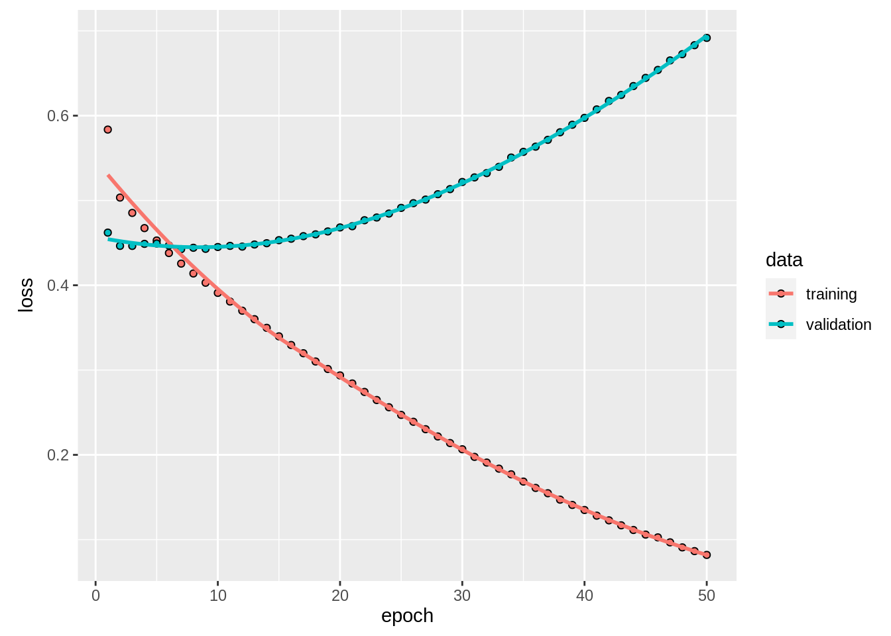

The validation loss first decreases but then starts to increase again, can you explain this behavior?
-> Overfitting!

Let's try a l1+l2 regularization:


```r
library(keras)

model = keras_model_sequential()
model %>%
  layer_dense(units = 50L, activation = "relu", input_shape = ncol(X), kernel_regularizer = regularizer_l1_l2( 0.001, 0.001)) %>%
  layer_dense(units = 50L, activation = "relu", kernel_regularizer = regularizer_l1_l2(0.001, 0.001)) %>%
  layer_dense(units = 50L, activation = "relu", kernel_regularizer = regularizer_l1_l2(0.001, 0.001)) %>%
  layer_dense(units = ncol(Y), activation = "softmax", kernel_regularizer = regularizer_l1_l2(0.001, 0.001)) 

model %>%
  compile(loss = loss_categorical_crossentropy, keras::optimizer_adamax(lr = 0.001))
summary(model)
```

```
## Model: "sequential_6"
## ___________________________________________________________________________________________________________________________
## Layer (type)                                           Output Shape                                     Param #            
## ===========================================================================================================================
## dense_18 (Dense)                                       (None, 50)                                       1900               
## ___________________________________________________________________________________________________________________________
## dense_19 (Dense)                                       (None, 50)                                       2550               
## ___________________________________________________________________________________________________________________________
## dense_20 (Dense)                                       (None, 50)                                       2550               
## ___________________________________________________________________________________________________________________________
## dense_21 (Dense)                                       (None, 2)                                        102                
## ===========================================================================================================================
## Total params: 7,102
## Trainable params: 7,102
## Non-trainable params: 0
## ___________________________________________________________________________________________________________________________
```

```r
model_history =
  model %>%
    fit(x = X, y = Y, 
        epochs = 100L, batch_size = 20L, 
        shuffle = TRUE, validation_split=0.4)
plot(model_history)
```

```
## `geom_smooth()` using formula 'y ~ x'
```

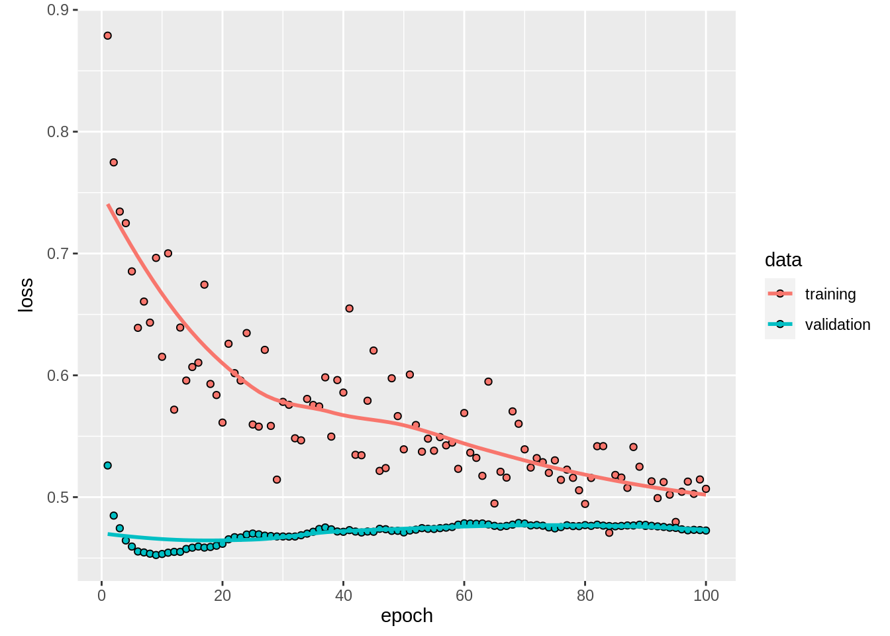
Better, but the validation loss still starts to increase after 40 epochs. But we can use early stopping to end the training before the val loss starts to increase again!


```r
library(keras)

model = keras_model_sequential()
model %>%
  layer_dense(units = 50L, activation = "relu", input_shape = ncol(X), kernel_regularizer = regularizer_l1_l2( 0.001, 0.001)) %>%
  layer_dense(units = 50L, activation = "relu", kernel_regularizer = regularizer_l1_l2(0.001, 0.001)) %>%
  layer_dense(units = 50L, activation = "relu", kernel_regularizer = regularizer_l1_l2(0.001, 0.001)) %>%
  layer_dense(units = ncol(Y), activation = "softmax", kernel_regularizer = regularizer_l1_l2(0.001, 0.001)) 

model %>%
  compile(loss = loss_categorical_crossentropy, keras::optimizer_adamax(lr = 0.001))
summary(model)
```

```
## Model: "sequential_7"
## ___________________________________________________________________________________________________________________________
## Layer (type)                                           Output Shape                                     Param #            
## ===========================================================================================================================
## dense_22 (Dense)                                       (None, 50)                                       1900               
## ___________________________________________________________________________________________________________________________
## dense_23 (Dense)                                       (None, 50)                                       2550               
## ___________________________________________________________________________________________________________________________
## dense_24 (Dense)                                       (None, 50)                                       2550               
## ___________________________________________________________________________________________________________________________
## dense_25 (Dense)                                       (None, 2)                                        102                
## ===========================================================================================================================
## Total params: 7,102
## Trainable params: 7,102
## Non-trainable params: 0
## ___________________________________________________________________________________________________________________________
```

```r
early = keras::callback_early_stopping(patience = 5L)

model_history =
  model %>%
    fit(x = X, y = Y, 
        epochs = 100L, batch_size = 20L, 
        shuffle = TRUE, validation_split=0.4, callbacks=c(early))
plot(model_history)
```

```
## `geom_smooth()` using formula 'y ~ x'
```

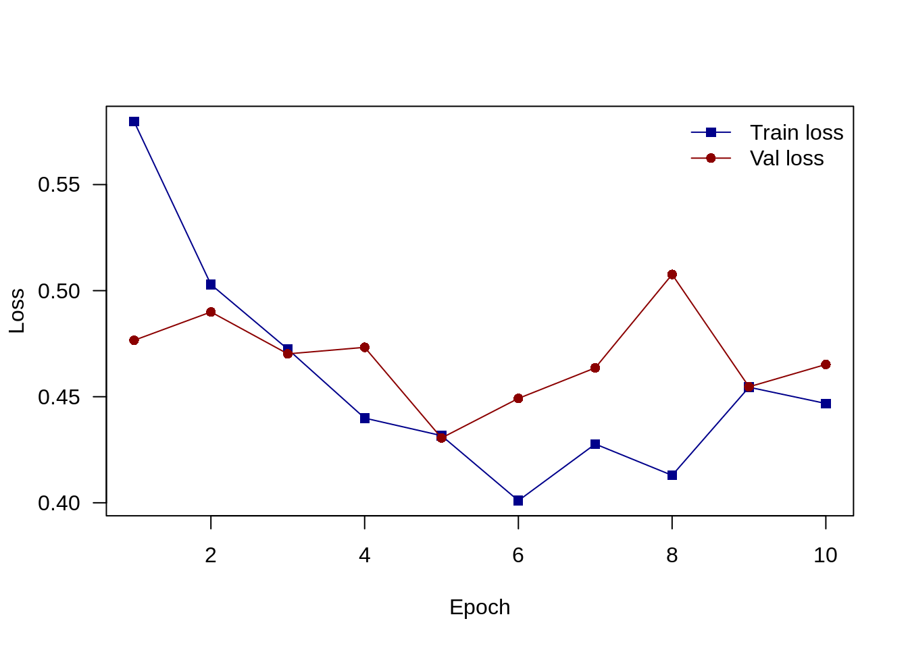
Patience is the number of epochs to wait before aborting the training. 

**Dropout - another type of regularization**

@dropout suggests a dropout rate of 50% for internal hidden layers and 20% for the input layer. One advantage of dropout is that the training is more independent of the number of epochs i.e. the val loss usually doesn't start to increase after several epochs. 


```r
model = keras_model_sequential()
model %>%
  layer_dropout(0.2) %>% 
  layer_dense(units = 50L, activation = "relu", input_shape = ncol(X)) %>%
  layer_dropout(0.5) %>% 
  layer_dense(units = 50L, activation = "relu") %>%
  layer_dropout(0.5) %>% 
  layer_dense(units = 50L, activation = "relu") %>%
  layer_dropout(0.5) %>% 
  layer_dense(units = ncol(Y), activation = "softmax") 

model %>%
  compile(loss = loss_categorical_crossentropy, keras::optimizer_adamax(lr = 0.001))

model_history =
  model %>%
    fit(x = X, y = Y, 
        epochs = 100L, batch_size = 20L, 
        shuffle = TRUE, validation_split=0.4)
plot(model_history)
```

```
## `geom_smooth()` using formula 'y ~ x'
```

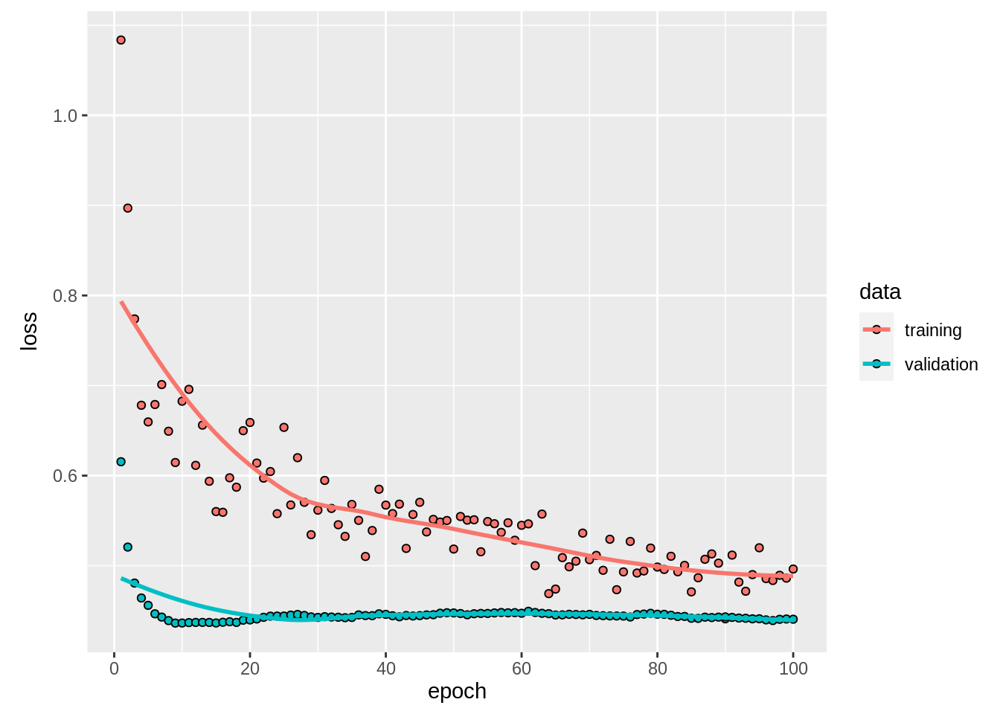
Ofc, you can still combine early stopping and dropout, which is normally a good idea since it improves training efficiency (e.g. you could start with 1000 epochs and you know training will be aborted if it doesn't improve anymore).


<details>
<summary>
**<span style="color: #CC2FAA">torch</span>**
</summary>
<p>
Dropout and early stopping with torch:

```r
model_torch = nn_sequential(
  nn_dropout(0.2),
  nn_linear(ncol(X), 50L),
  nn_relu(),
  nn_dropout(0.5),
  nn_linear(50L, 50L),
  nn_relu(), 
  nn_dropout(0.5),
  nn_linear(50L, 50L),
  nn_relu(), 
  nn_dropout(0.5),
  nn_linear(50L, 2L)
)

YT = apply(Y, 1,which.max)

dataset_nasa = dataset(
  name = "nasa",
  initialize = function(nasa) {
    self$X = nasa$X
    self$Y = nasa$Y
  },
  .getitem = function(i) {
    X = self$X[i,,drop=FALSE] %>% torch_tensor()
    Y = self$Y[i] %>% torch_tensor()
    list(X, Y)
  },
  .length = function() {
    nrow(self$X)
  })

train_dl = dataloader(dataset_nasa(list(X = X[1:400,], Y = YT[1:400])), 
                      batch_size = 32, shuffle = TRUE)
test_dl = dataloader( dataset_nasa(list(X = X[101:500,], Y = YT[101:500])), 
                      batch_size = 32)

model_torch$train()

opt = optim_adam(model_torch$parameters, 0.01)

train_losses = c()
test_losses = c()
early_epoch = 0
min_loss = Inf
patience = 5
for(epoch in 1:50) {
  
  if(early_epoch >= patience) break
  
  train_loss = c()
  test_loss = c()
  coro::loop(for (batch in train_dl) {
    opt$zero_grad()
    pred = model_torch(batch[[1]]$squeeze())
    loss = nnf_cross_entropy(pred, batch[[2]]$squeeze(),reduction = "mean")
    loss$backward()
    opt$step()
    train_loss = c(train_loss, loss$item())
  })
  
  coro::loop(for (batch in test_dl) {
    pred = model_torch(batch[[1]]$squeeze())
    loss = nnf_cross_entropy(pred, batch[[2]]$squeeze(),reduction = "mean")
    test_loss = c(test_loss, loss$item())
  })
  
  ### early stopping ###
  if(mean(test_loss) < min_loss) {
    min_loss = mean(test_loss)
    early_epoch = 0
  } else {
    early_epoch = early_epoch + 1
  }
  ###
  
  train_losses = c(train_losses, mean(train_loss))
  test_losses = c(test_losses, mean(test_loss))
  cat(sprintf("Loss at epoch %d: %3f\n", epoch, mean(train_loss)))
}
```

```
## Loss at epoch 1: 0.518420
## Loss at epoch 2: 0.455640
## Loss at epoch 3: 0.446879
## Loss at epoch 4: 0.447216
## Loss at epoch 5: 0.425368
## Loss at epoch 6: 0.425635
## Loss at epoch 7: 0.414827
## Loss at epoch 8: 0.401890
## Loss at epoch 9: 0.386621
## Loss at epoch 10: 0.391964
## Loss at epoch 11: 0.390527
## Loss at epoch 12: 0.389494
## Loss at epoch 13: 0.396623
## Loss at epoch 14: 0.396054
## Loss at epoch 15: 0.361036
## Loss at epoch 16: 0.354566
```

```r
matplot(cbind(train_losses, test_losses), type = "o", pch = c(15, 16), col = c("darkblue", "darkred"), lty = 1, xlab = "Epoch", ylab = "Loss", las = 1)
legend("topright", bty = "n", col = c("darkblue", "darkred"), lty = 1, pch = c(15, 16), legend = c("Train loss", "Val loss") )
```

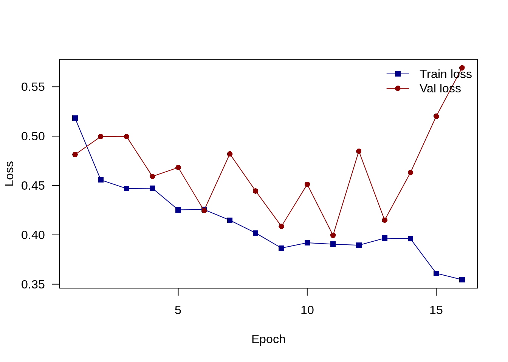
</details>
<br/>

## Case study - fitting a Convolutional Neural Networks on MNIST
We will show the use of convolutinal neural networks with the MNIST dataset.The MNIST dataset is maybe one of the most famous image datasets. It is a dataset of 60,000 handwritten digits from 0-9.

To do so, we define a few helper functions:


```r
library(keras)
rotate = function(x) t(apply(x, 2, rev))
imgPlot = function(img, title = ""){
 col=grey.colors(255)
 image(rotate(img), col = col, xlab = "", ylab = "", axes=FALSE, main = paste0("Label: ", as.character(title)))
}
```

The dataset is so famous that there is an automatic download function in keras:


```r
data = dataset_mnist()
train = data$train
test = data$test
```

Let's visualize a few digits:


```r
par(mfrow = c(1,3))
.n = sapply(1:3, function(x) imgPlot(train$x[x,,], train$y[x]))
```


Similar to the normal ML workflow, we have to scale the pixels (from 0-255) to the range of [0,1] and one hot encode the response. To scale the pixels, we will use arrays instead of matrices. Arrays are called tensors in mathematics and a 2d array/tensor is typically called a matrix.


```r
train_x = array(train$x/255, c(dim(train$x), 1))
test_x = array(test$x/255, c(dim(test$x), 1))
train_y = to_categorical(train$y, 10)
test_y = to_categorical(test$y, 10)
```

The last dimension stands for the number of channels in the image. In our case we have only one channel because the images are white-black.

Normally we would have three channels - colors are encoded by the combination of three base colors (usually red,green,blue).

To build our convolutional model, we have to specify a kernel. In our case, we will use 16 convolutional kernels (filters) of size 2x2. These are 2D kernels because our images are 2D. For movies for example, one would use a 3D kernel (the third dimension would correspond to time and not to the color channels).


```r
model = keras_model_sequential()
model %>% 
 layer_conv_2d(input_shape = c(28L, 28L,1L),filters = 16L, kernel_size = c(2L,2L), activation = "relu") %>% 
 layer_max_pooling_2d() %>% 
 layer_conv_2d(filters = 16L, kernel_size = c(3L,3L), activation = "relu") %>% 
 layer_max_pooling_2d() %>% 
 layer_flatten() %>% 
 layer_dense(100L, activation = "relu") %>% 
 layer_dense(10L, activation = "softmax")
summary(model)
```

```
## Model: "sequential_9"
## ___________________________________________________________________________________________________________________________
## Layer (type)                                           Output Shape                                     Param #            
## ===========================================================================================================================
## conv2d (Conv2D)                                        (None, 27, 27, 16)                               80                 
## ___________________________________________________________________________________________________________________________
## max_pooling2d (MaxPooling2D)                           (None, 13, 13, 16)                               0                  
## ___________________________________________________________________________________________________________________________
## conv2d_1 (Conv2D)                                      (None, 11, 11, 16)                               2320               
## ___________________________________________________________________________________________________________________________
## max_pooling2d_1 (MaxPooling2D)                         (None, 5, 5, 16)                                 0                  
## ___________________________________________________________________________________________________________________________
## flatten (Flatten)                                      (None, 400)                                      0                  
## ___________________________________________________________________________________________________________________________
## dense_30 (Dense)                                       (None, 100)                                      40100              
## ___________________________________________________________________________________________________________________________
## dense_31 (Dense)                                       (None, 10)                                       1010               
## ===========================================================================================================================
## Total params: 43,510
## Trainable params: 43,510
## Non-trainable params: 0
## ___________________________________________________________________________________________________________________________
```

We additionally used a pooling layer to downsize the resulting feature maps. After another convolutional and pooling layer we flatten the output, i.e. the following dense layer treats the previous layer as a full layer (so the dense layer is connected to all weights from the last feature maps).Having flattened the layer, we can simply use our typical output layer.


<details>
<summary>
**<span style="color: #CC2FAA">torch</span>**
</summary>
<p>
Prepare/download data:

```r
library(torch)
library(torchvision)

train_ds = mnist_dataset(
  ".",
  download = TRUE,
  train = TRUE,
  transform = transform_to_tensor
)

test_ds = mnist_dataset(
  ".",
  download = TRUE,
  train = FALSE,
  transform = transform_to_tensor
)
```

Build dataloader:

```r
train_dl = dataloader(train_ds, batch_size = 32, shuffle = TRUE)
test_dl = dataloader(test_ds, batch_size = 32)
first_batch = train_dl$.iter()
df = first_batch$.next()

df$x$size()
```

```
## [1] 32  1 28 28
```

Build CNN:
We have here to calculate the shapes of our layers on our own:

**We start with our input of shape (batch_size, 1, 28, 28)**


```r
sample = df$x
sample$size()
```

```
## [1] 32  1 28 28
```


**first conv layer has shape (input channel = 1, number of feature maps = 16, kernel size = 2)**


```r
conv1 = nn_conv2d(1, 16L, 2L, stride = 1L)
(sample %>% conv1)$size()
```

```
## [1] 32 16 27 27
```
Output: batch_size = 32,  number of feature maps = 16, dimensions of each feature map = ( 27 , 27 )
Wit a kernel size of two and stride =1 we wil lose one pixel in each dimension...
Questions: 

* what does happen if we increase the stride?
* what does happen if we increase the kernel size?

**pooling layer summarizes each feature map**


```r
(sample %>% conv1 %>% nnf_max_pool2d(kernel_size = 2L,stride = 2L))$size()
```

```
## [1] 32 16 13 13
```
kernel_size = 2L and stride = 2L halfs the pixel dimensions of our image

**fully connected layer**

Now we have to flatten our final output of the CNN model to use a normal fully connected layer, but to do so we have to calulate the number of inputs for the fully connected layer:

```r
dims = (sample %>% conv1 %>% nnf_max_pool2d(kernel_size = 2L,stride = 2L))$size()
# without the batch size ofc
final = prod(dims[-1]) 
print(final)
```

```
## [1] 2704
```

```r
fc = nn_linear(final, 10L)
(sample %>% conv1 %>% nnf_max_pool2d(kernel_size = 2L,stride = 2L) %>% torch_flatten(start_dim = 2L) %>% fc)$size()
```

```
## [1] 32 10
```

Build the network:


```r
net <- nn_module(
  "mnist",
  initialize = function() {
    self$conv1 <- nn_conv2d(1, 16L, 2L)
    self$conv2 <- nn_conv2d(16L, 16L, 3)
    self$fc1 <- nn_linear(400L, 100L)
    self$fc2 <- nn_linear(100L, 10L)
  },
  forward = function(x) {
    x %>% 
      self$conv1() %>%
      nnf_relu() %>%
      nnf_max_pool2d(2) %>%         
      self$conv2() %>%
      nnf_relu() %>%
      nnf_max_pool2d(2) %>%
      torch_flatten(start_dim = 2) %>%
      self$fc1() %>%
      nnf_relu() %>%
      self$fc2()
  }
)
```

</details>
<br/>


The rest is as usual: First we compile the model.


```r
model %>% 
 compile(
 optimizer = keras::optimizer_adamax(0.01),
 loss = loss_categorical_crossentropy
 )
summary(model)
```

```
## Model: "sequential_9"
## ___________________________________________________________________________________________________________________________
## Layer (type)                                           Output Shape                                     Param #            
## ===========================================================================================================================
## conv2d (Conv2D)                                        (None, 27, 27, 16)                               80                 
## ___________________________________________________________________________________________________________________________
## max_pooling2d (MaxPooling2D)                           (None, 13, 13, 16)                               0                  
## ___________________________________________________________________________________________________________________________
## conv2d_1 (Conv2D)                                      (None, 11, 11, 16)                               2320               
## ___________________________________________________________________________________________________________________________
## max_pooling2d_1 (MaxPooling2D)                         (None, 5, 5, 16)                                 0                  
## ___________________________________________________________________________________________________________________________
## flatten (Flatten)                                      (None, 400)                                      0                  
## ___________________________________________________________________________________________________________________________
## dense_30 (Dense)                                       (None, 100)                                      40100              
## ___________________________________________________________________________________________________________________________
## dense_31 (Dense)                                       (None, 10)                                       1010               
## ===========================================================================================================================
## Total params: 43,510
## Trainable params: 43,510
## Non-trainable params: 0
## ___________________________________________________________________________________________________________________________
```

Then, we train the model:


```r
epochs = 5L
batch_size = 32L
model %>% 
 fit(
 x = train_x, 
 y = train_y,
 epochs = epochs,
 batch_size = batch_size,
 shuffle = TRUE,
 validation_split = 0.2
)
```


<details>
<summary>
**<span style="color: #CC2FAA">torch</span>**
</summary>
<p>

Train model:

```r
model_torch = net()
opt = optim_adam(params = model_torch$parameters, lr = 0.01)

for(e in 1:3) {
  losses = c()
  coro::loop(for (batch in train_dl) {
    opt$zero_grad()
    pred = model_torch(batch[[1]])
    loss = nnf_cross_entropy(pred, batch[[2]], reduction = "mean")
    loss$backward()
    opt$step()
    losses = c(losses, loss$item())
  })
  cat(sprintf("Loss at epoch %d: %3f\n", e, mean(losses)))
}
```

```
## Loss at epoch 1: 0.250743
## Loss at epoch 2: 0.146959
## Loss at epoch 3: 0.130747
```

Evaluation:

```r
model_torch$eval()

test_losses = c()
total = 0
correct = 0

coro::loop(for (b in test_dl) {
  output = model_torch(b[[1]])
  labels = b[[2]]
  loss = nnf_cross_entropy(output, labels)
  test_losses = c(test_losses, loss$item())
  predicted = torch_max(output$data(), dim = 2)[[2]]
  total = total + labels$size(1)
  correct = correct + (predicted == labels)$sum()$item()
})

mean(test_losses)
```

```
## [1] 0.1116432
```

```r
test_accuracy <-  correct/total
test_accuracy
```

```
## [1] 0.9649
```

</details>
<br/>

## Advanced training techniques 
### Data Augmentation
Having to train a CNN using very little data is a common problem. Data augmentation helps to artificially increase the number of images.

The idea is that a CNN learns specific structures such as edges from images. Rotating, adding noise, and zooming in and out will preserve the overall key structure we are interested in, but the model will see new images and has to search once again for the key structures.

Luckily, it is very easy to use data augmentation in keras.

To show this, we will use again the MNIST dataset. We have to define a generator object (it is a specific object which infinitly draws samples from our dataset). In the generator we can turn on the data augementation. However, now we have to set the step size (steps_per_epoch) because the model does not know the first dimension of the image.


```r
data = EcoData::dataset_flower()
train = data$train
test = data$test
labels = data$labels

model = keras_model_sequential()
model %>% 
  layer_conv_2d(filter = 16L, kernel_size = c(5L, 5L), input_shape = c(80L, 80L, 3L), activation = "relu") %>% 
  layer_max_pooling_2d() %>% 
  layer_conv_2d(filter = 32L, kernel_size = c(3L, 3L), activation = "relu") %>% 
  layer_max_pooling_2d() %>% 
  layer_conv_2d(filter = 64L, kernel_size = c(3L, 3L), strides = c(2L, 2L), activation = "relu") %>% 
  layer_max_pooling_2d() %>% 
  layer_flatten() %>% 
  layer_dropout(0.5) %>% 
  layer_dense(units = 5L, activation = "softmax")

  
# Data augmentation
aug = image_data_generator(rotation_range = 90, 
                           zoom_range = c(0.3), 
                           horizontal_flip = TRUE, 
                           vertical_flip = TRUE)

# Data preparation / splitting
indices = sample.int(nrow(train), 0.1*nrow(train))
generator = flow_images_from_data(train[-indices,,,]/255, k_one_hot(labels[-indices], num_classes = 5L),generator = aug, batch_size = 25L, shuffle = TRUE)

test = train[indices,,,]/255
test_labels = k_one_hot(labels[indices], num_classes = 5L)


# Our own training loop with early stopping:
epochs = 50L
batch_size = 25L
steps = floor(dim(train)[1]/batch_size)
optim = keras::optimizer_rmsprop()
max_patience = 5L
patience = 1L
min_val_loss = Inf
val_losses = c()
epoch_losses = c()
for(e in 1:epochs) {
  epoch_loss = c()
  for(s in 1:steps) {
    batch = reticulate::iter_next(generator)
    with(tf$GradientTape() %as% tape, {
        pred = model(batch[[1]], training = TRUE)
        loss = keras::loss_categorical_crossentropy(batch[[2]], pred)
        loss = tf$reduce_mean(loss)
      })
    gradients = tape$gradient(target = loss, sources = model$trainable_variables)
    optim$apply_gradients(purrr::transpose(list(gradients, model$trainable_variables)))
    epoch_loss = c(epoch_loss, loss$numpy())
  }
  epoch_losses = c(epoch_losses, epoch_loss)
  ## test loss ##
  preds = model %>% predict(test)
  val_losses = c(val_losses, tf$reduce_mean( keras::loss_categorical_crossentropy(test_labels, preds) )$numpy())
  
  cat("Epoch: ", e, " Train Loss: ", mean(epoch_losses)," Val Loss: ", val_losses[e],  " \n")
  
  if(val_losses[e] < min_val_loss) {
    min_val_loss = val_losses[e]
    patience = 1
  } else { patience = patience+1 }
  if(patience == max_patience) break
}

preds = predict(model, data$test/255)
preds = apply(preds, 1, which.max)-1
```

So using data augmentation we can artificially increase the number of images.

<details>
<summary>
**<span style="color: #CC2FAA">torch</span>**
</summary>
<p>

In torch, we have to change the transform function (but only for the train dataloader):

```r
train_transforms <- function(img) {
  img %>%
    transform_to_tensor() %>%
    transform_random_horizontal_flip(p = 0.3) %>% 
    transform_random_resized_crop(size = c(28L, 28L)) %>%
    transform_random_vertical_flip(0.3)
}

train_ds = mnist_dataset(".", download = TRUE, train = TRUE, transform = train_transforms)
test_ds = mnist_dataset(".", download = TRUE, train = FALSE,transform = transform_to_tensor)

train_dl = dataloader(train_ds, batch_size = 100L, shuffle = TRUE)
test_dl = dataloader(test_ds, batch_size = 100L)

model_torch = net()
opt = optim_adam(params = model_torch$parameters, lr = 0.01)

for(e in 1:1) {
  losses = c()
  coro::loop(for (batch in train_dl) {
    opt$zero_grad()
    pred = model_torch(batch[[1]])
    loss = nnf_cross_entropy(pred, batch[[2]], reduction = "mean")
    loss$backward()
    opt$step()
    losses = c(losses, loss$item())
  })
  cat(sprintf("Loss at epoch %d: %3f\n", e, mean(losses)))
}
```

```
## Loss at epoch 1: 1.440276
```

```r
model_torch$eval()

test_losses = c()
total = 0
correct = 0

coro::loop(for (b in test_dl) {
  output = model_torch(b[[1]])
  labels = b[[2]]
  loss = nnf_cross_entropy(output, labels)
  test_losses = c(test_losses, loss$item())
  predicted = torch_max(output$data(), dim = 2)[[2]]
  total = total + labels$size(1)
  correct = correct + (predicted == labels)$sum()$item()
})

test_accuracy <-  correct/total
print(test_accuracy)
```

```
## [1] 0.9084
```

</details>
<br/>


### Transfer learning {#transfer}

Another approach to reduce the necessary number of images or to speed up convergence of the models is the use of transfer learning.

The main idea of transfer learning is that all the convolutional layers have mainly one task - learning to identify highly correlated neighbored features and therefore these learn structures such as edges in the image and only the top layer, the dense layer is the actual classifier of the CNN. Thus, one could think that we could only train the top layer as classifier. To do so, it will be confronted by sets of different edges/structures and has to decide the label based on these.

Again, this sounds very complicating but is again quite easy with keras:

We will do this now with the CIFAR10 data set, so we have to prepare the data:

```r
data = keras::dataset_cifar10()
train = data$train
test = data$test
image = train$x[5,,,]
image %>% 
 image_to_array() %>%
 `/`(., 255) %>%
 as.raster() %>%
 plot()
```


```r
train_x = array(train$x/255, c(dim(train$x)))
test_x = array(test$x/255, c(dim(test$x)))
train_y = to_categorical(train$y, 10)
test_y = to_categorical(test$y, 10)
```

Keras provides download functions for all famous architectures/CNN models which are already trained on the imagenet dataset (another famous dataset). These trained networks come already without their top layer, so we have to set include_top to false and change the input shape.


```r
densenet = application_densenet201(include_top = FALSE, input_shape  = c(32L, 32L, 3L))
```

Now, we will use not a sequential model but just a "keras_model" where we can specify the inputs and outputs. Thereby, the outputs are our own top layer, but the inputs are the densenet inputs, as these are already pre-trained.

```r
model = keras::keras_model(inputs = densenet$input, outputs = 
 layer_flatten(layer_dense(densenet$output, units = 10L, activation = "softmax"))
 )
```


In the next step we want to freeze all layers except for our own last layer (with freezing I mean that these are not trained: we do not want to train the complete model, we only want to train the last layer). You can check the number of trainable weights via summary(model)


```r
model %>% freeze_weights(to = length(model$layers)-1)
summary(model)
```

And then the usual training:

```r
model %>% 
 compile(loss = loss_categorical_crossentropy, optimizer = optimizer_adamax())
model %>% 
 fit(
 x = train_x, 
 y = train_y,
 epochs = 1L,
 batch_size = 32L,
 shuffle = T,
 validation_split = 0.2,
)
```

We have seen, that transfer-learning can easily be done using keras.

<details>
<summary>
**<span style="color: #CC2FAA">torch</span>**
</summary>
<p>

In torch, we have to change the transform function (but only for the train dataloader):

```r
library(torchvision)
train_ds = cifar10_dataset(".", download = TRUE, train = TRUE, transform = transform_to_tensor)
test_ds = cifar10_dataset(".", download = TRUE, train = FALSE,transform = transform_to_tensor)

train_dl = dataloader(train_ds, batch_size = 100L, shuffle = TRUE)
test_dl = dataloader(test_ds, batch_size = 100L)

model_torch = model_resnet18(pretrained = TRUE)

# we will set all model parameters to constant values:
model_torch$parameters %>% purrr::walk(function(param) param$requires_grad_(FALSE))

# let's replace the last layer (last layer is named 'fc') with our own layer:
inFeat = model_torch$fc$in_features
model_torch$fc = nn_linear(inFeat, out_features = 10L)

opt = optim_adam(params = model_torch$parameters, lr = 0.01)

for(e in 1:1) {
  losses = c()
  coro::loop(for (batch in train_dl) {
    opt$zero_grad()
    pred = model_torch(batch[[1]])
    loss = nnf_cross_entropy(pred, batch[[2]], reduction = "mean")
    loss$backward()
    opt$step()
    losses = c(losses, loss$item())
  })
  cat(sprintf("Loss at epoch %d: %3f\n", e, mean(losses)))
}
```

```
## Loss at epoch 1: 2.019492
```

```r
model_torch$eval()

test_losses = c()
total = 0
correct = 0

coro::loop(for (b in test_dl) {
  output = model_torch(b[[1]])
  labels = b[[2]]
  loss = nnf_cross_entropy(output, labels)
  test_losses = c(test_losses, loss$item())
  predicted = torch_max(output$data(), dim = 2)[[2]]
  total = total + labels$size(1)
  correct = correct + (predicted == labels)$sum()$item()
})

test_accuracy <-  correct/total
print(test_accuracy)
```

```
## [1] 0.3893
```
</details>
<br/>

**Flower dataset**

Let's do it with our flower dataset:


```r
data = EcoData::dataset_flower()
train = data$train
test = data$test
labels = data$labels
library(keras)

densenet = keras::application_densenet201(include_top = FALSE, input_shape = list(80L, 80L, 3L))

keras::freeze_weights(inception)

model = keras_model(inputs = densenet$input, 
                    outputs = densenet$output %>% 
                      layer_flatten() %>% 
                      layer_dropout(0.2) %>% 
                      layer_dense(units = 200L) %>% 
                      layer_dropout(0.2) %>% 
                      layer_dense(units = 5L, activation="softmax"))


# Data augmentation
aug = image_data_generator(rotation_range = 180,zoom_range = 0.4,width_shift_range = 0.2, height_shift_range = 0.2, vertical_flip = TRUE, horizontal_flip = TRUE,preprocessing_function = imagenet_preprocess_input)

# Data preparation / splitting
indices = sample.int(nrow(train), 0.1*nrow(train))
generator = flow_images_from_data(train[-indices,,,], k_one_hot(labels[-indices], num_classes = 5L), batch_size = 25L, shuffle = TRUE)

test = imagenet_preprocess_input(train[indices,,,])
test_labels = k_one_hot(labels[indices], num_classes = 5L)

# Our own training loop with early stopping:
epochs = 1L
batch_size = 45L
steps = floor(dim(train)[1]/batch_size)
optim = keras::optimizer_rmsprop(lr = 0.0005)
max_patience = 10L
patience = 1L
min_val_loss = Inf
val_losses = c()
epoch_losses = c()
for(e in 1:epochs) {
  epoch_loss = c()
  for(s in 1:steps) {
    batch = reticulate::iter_next(generator)
    with(tf$GradientTape() %as% tape, {
        pred = model(batch[[1]], training = TRUE)
        loss = keras::loss_categorical_crossentropy(batch[[2]], pred)
        loss = tf$reduce_mean(loss)
      })
    gradients = tape$gradient(target = loss, sources = model$trainable_variables)
    optim$apply_gradients(purrr::transpose(list(gradients, model$trainable_variables)))
    epoch_loss = c(epoch_loss, loss$numpy())
  }
  epoch_losses = c(epoch_losses, epoch_loss)
  ## test loss ##
  preds = model %>% predict(test)
  val_losses = c(val_losses, tf$reduce_mean( keras::loss_categorical_crossentropy(test_labels, preds) )$numpy())
  
  cat("Epoch: ", e, " Train Loss: ", mean(epoch_losses)," Val Loss: ", val_losses[e],  " \n")
  
  if(val_losses[e] < min_val_loss) {
    min_val_loss = val_losses[e]
    patience = 1
  } else { patience = patience+1 }
  if(patience == max_patience) break
}

preds = predict(model, imagenet_preprocess_input(data$test))
```


<!--chapter:end:03-Deep.Rmd-->

# Interpretation and causality with machine learning

## Explainable AI

The goal of explainable AI (xAI, aka interpretable machine learning) is to explain WHY a fitted ML models makes certain predictions. A typical example is to understand  how important different variables are for predictions. There incentives to do so range from a better technical understanding of the models over understanding which data is important to improve predictions to questions of fairness and discrimination (e.g. to understand if an algorithm uses skin color to make a decision).

### A practical example

In this lecture we will work with another famous dataset, the Boston housing dataset:

We will fit a random forest and use the iml pkg for xAI, see 


```r
set.seed(123)
library("iml")
library("randomForest")
data("Boston", package = "MASS")
rf = randomForest(medv ~ ., data = Boston, ntree = 50)
```

xAI packages are written generic, i.e. they can handle almost all ML models.
When we want to use them, we first have to create a Predictor object, that holds the model and the data. The iml package uses R6 classes, that means new objects can be created by calling Predictor$new(). (do not worry if you do not know what R6 classes are, just use the command)


```r
X = Boston[which(names(Boston) != "medv")]
predictor = Predictor$new(rf, data = X, y = Boston$medv)
```

### Feature Importance
Feature importance, should not be mistaken with the RF variable importance. It tells us how important the individual variables are for predictions and can be calculated for all ML models and is based on a permutation approach (have a look at the book):


```r
imp = FeatureImp$new(predictor, loss = "mae")
plot(imp)
```


### Partial dependencies

Partial dependencies are similar to allEffects plots for normal regressions, the idea is to visualize "marginal effects" of predictors (with the feature argument we specify the variable we want to visualize):


```r
eff = FeatureEffect$new(predictor, feature = "rm", method = "pdp", grid.size = 30)
plot(eff)
```


Partial dependencies can be also plotted for single observations:


```r
eff = FeatureEffect$new(predictor, feature = "rm", method = "pdp+ice", grid.size = 30)
plot(eff)
```

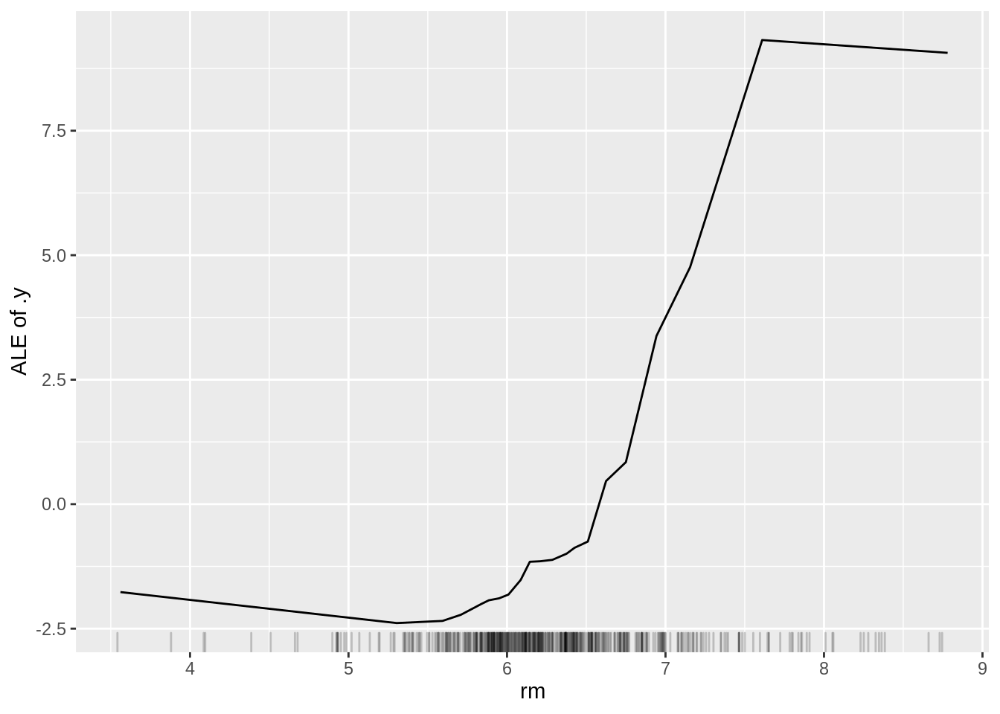

One disadvantage of partial dependencies is that they are sensitive to correlated predictors. Accumulated local effects can be used to account for correlation for predictors

### Accumulated local effects

Accumulated local effects (ALE) are basically partial dependencies plots but try to correct for correlations between predictors

```r
ale = FeatureEffect$new(predictor, feature = "rm", method = "ale")
ale$plot()
```

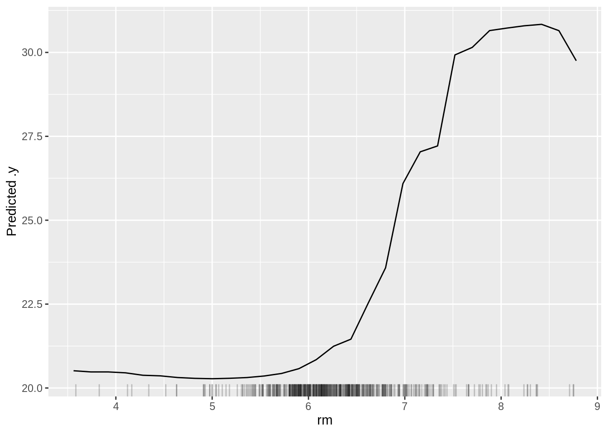

If there is no colinearity, you shouldn't see much difference between partial dependencies and ALE plots.

### Friedmans H-statistic

The H-statistic can be used to find interactions between predictors. However, again, keep in mind that the H-statistic is sensible to correlation between predictors:


```r
interact = Interaction$new(predictor, "lstat")
plot(interact)
```

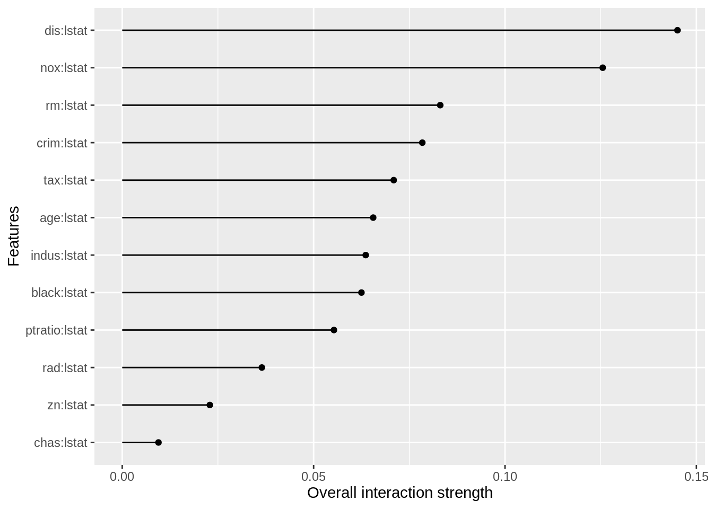

### Global explainer - Simplifying the ML model

Another idea is to simplify the ML model with another simpler model such as a decision tree. We create predictions with the ML model for a lot of different input values and then we fit on these predictions a decision tree, which we can then interpret.


```r
library(partykit)
tree = TreeSurrogate$new(predictor, maxdepth = 2)
plot(tree)
```

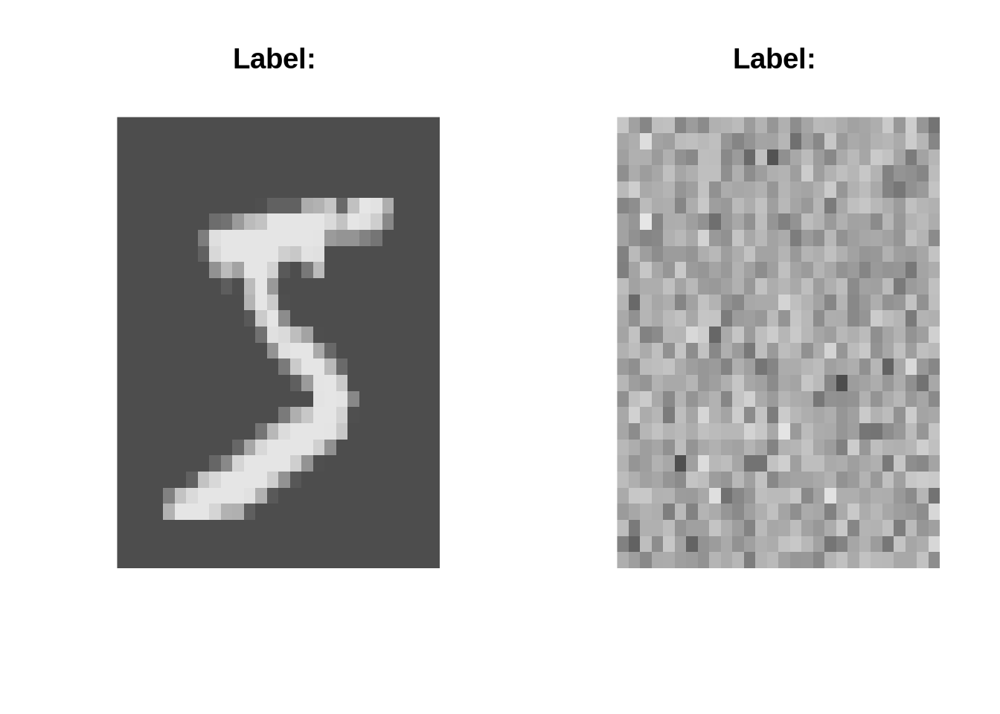

### Local explainer - LIME explaining single instances (observations)

The global approach is to simplify the entire ML-black-box model via a simpler model, which is then interpretable.

However, sometimes we are only interested in understanding how single observations/predictions are generated. The lime approach explores the feature space around one observations and based on this local spare fits then a simpler model (e.g. a linear model):


```r
library(glmnet)
lime.explain = LocalModel$new(predictor, x.interest = X[1,])
lime.explain$results
```

```
##               beta x.recoded    effect x.original feature feature.value
## rm       4.1893817     6.575 27.545185      6.575      rm      rm=6.575
## ptratio -0.5307031    15.300 -8.119758       15.3 ptratio  ptratio=15.3
## lstat   -0.4398104     4.980 -2.190256       4.98   lstat    lstat=4.98
```

```r
plot(lime.explain)
```

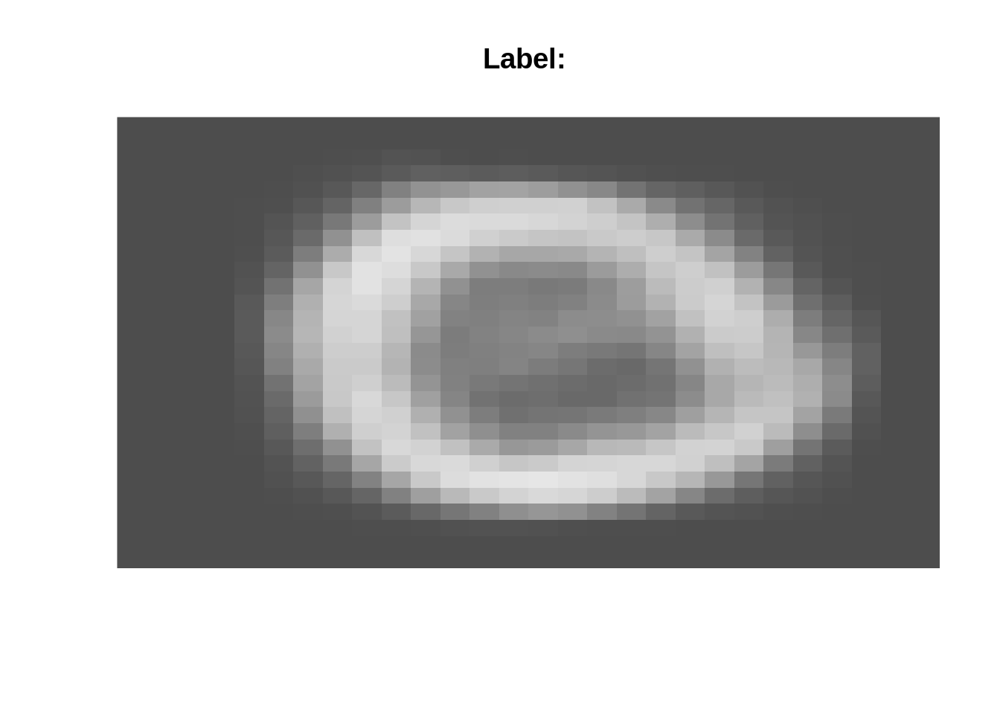


### Local explainer - Shapley

The Shapley method computes the so called Shapley value, feature contributions for single predictions, and is based on an approach from cooperative game theory. The idea is that each feature value of the instance is a "player" in a game, where the prediction is the reward. The Shapley value tells us how to fairly distribute the award among the feature.


```r
shapley = Shapley$new(predictor, x.interest = X[1,])
shapley$plot()
```

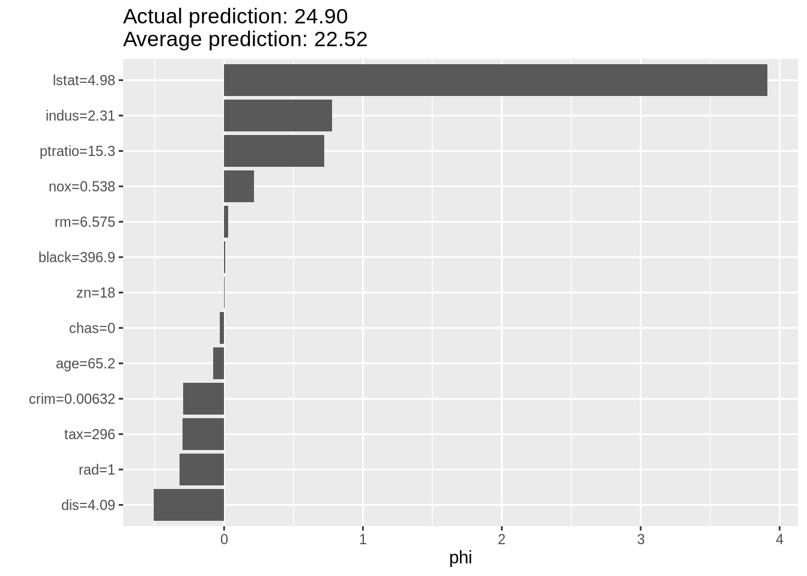

## Causal inference and machine learning

xAI aims at explaining how predictions are being made. In general, xAI != causality. xAI methods measure which variables are used by the algorithm for predictions, or how much variables improve predictions. The important point to note here: if a variable causes something, we could also expect that it helps to predict the very thing. The opposite, however, is not generally true - it is very often possible that a variable that doesn't cause something can predict something.

In statistical courses (in particular course: advanced biostatistics), we discuss the issue of causality at length. Here, we don't want to go into the details, but again, you should in general resist to interpret indicators of importance in xAI as causal effects. They tell you something about what's going on in the algorithm, not about what's going on in reality.

### Causal inference on static data

Methods for causal inference depend on whether we have dynamic or static data. The latter is the more common case. With static data, the problem is confounding - if you have several predictors that are correlated, you can get spurious correlations between a given predictor and the response.

A multiple regression, and a few other methods are able to correct for other predictors, and thus isolate the causal effect. The same is not necessarily true for ML algorithms and xAI methods. This is not a bug, but a feature - for making good predictions, it is often no problem, but rather an advantage to also use non-causal predictors.

Here an example for the variable importance indicators in the RF algorithm. The purpose of this script is to show that RF variable importance will split importance values for collinear variables evenly, even if collinearity is low enough so that variables are separable and would be correctly separated by an lm / ANOVA

We first simulate a dataset with 2 predictors that are strongly correlated, but only one of them has an effect on the response.

```r
# simulation parameters
n = 1000
col = 0.7
# create collinear predictors
x1 = runif(n)
x2 = col * x1 + (1-col) * runif(n)
# response is only influenced by x1
y = x1 + rnorm(n)
```
lm / anova correctly identify x1 as causal variable

```r
anova(lm(y ~ x1 + x2))
```

```
## Analysis of Variance Table
## 
## Response: y
##            Df Sum Sq Mean Sq  F value Pr(>F)    
## x1          1 106.30 106.300 110.1988 <2e-16 ***
## x2          1   0.23   0.228   0.2368 0.6267    
## Residuals 997 961.73   0.965                    
## ---
## Signif. codes:  0 '***' 0.001 '**' 0.01 '*' 0.05 '.' 0.1 ' ' 1
```

Fit RF and show variable importance

```r
fit <- randomForest(y ~ x1 + x2, importance=TRUE)
varImpPlot(fit)
```

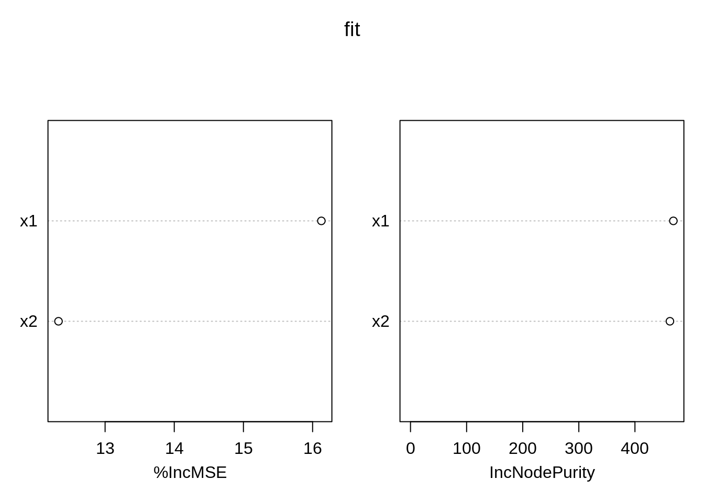
Variable importance is now split nearly evenly.

Task: understand why this is - remember:

* How the random forest works - variables are randomly hidden from the regression tree when the trees for the forest are built
* Remember that as x1 ~ x2, we can use x2 as a replacement for x1
* Remember that the variable importance measures the average contributions of the different variables in the trees of the forest

### Structural equation models

If causal relationships get more complicated, it will not be possible to adjust correctly with a simple lm. In this case, in statistics, we will usually use structural equation models (SEMs). SEMs are are designed to estimate entire causal diagrams. There are two main SEM packages in R: for anything that is non-normal, you will currently have to estimate the DAG piece-wise with CRAN package piecewiseSEM. Example for a vegetation dataset:


```r
library(piecewiseSEM)
mod = psem(
 lm(rich ~ distance + elev + abiotic + age + hetero + firesev + cover, data = keeley),
 lm(firesev ~ elev + age + cover, data = keeley),
 lm(cover ~ age + elev + hetero + abiotic, data = keeley)
)
summary(mod)
plot(mod)
```

For linear SEMs, we can estimate the entire DAG in one go. This also allows to have unobserved variables in the DAG. One of the most popular packages for this is lavaan


```r
library(lavaan)
mod <- "
 rich ~ distance + elev + abiotic + age + hetero + firesev + cover
 firesev ~ elev + age + cover
 cover ~ age + elev + abiotic
"
fit<-sem(mod,data=keeley)
summary(fit)
```


Plot options ... not so nice as before


```r
library(lavaanPlot)
lavaanPlot(model = fit)
```
Another plotting option


```r
library(semPlot)
semPaths(fit)
```


### Automatic causal discovery

But how to we get the causal graph? In statistics, it common to "guess" it and afterwards do residual checks, in the same way as we guess the structure of a regression. For more complicated problems, however, this is unsatisfying. Some groups therefore work on so-called causal discovery algorithsm, i.e. algorithms that automatically generate causal graphs from data. One of the most classic algorithms of this sort is the PC algorithm. Here an example using the pcalg package:


```r
# Bioconductor dependencies have to installed by hand, e.g. 
# BiocManager::install(c("Rgraphviz", "graph", "RBGL")
library(pcalg)
```

Loading the data


```r
data("gmG", package = "pcalg") ## loads data sets gmG and gmG8
suffStat <- list(C = cor(gmG8$x), n = nrow(gmG8$x))
varNames <- gmG8$g@nodes
```

First, the kkeleton algorithm creates a basic graph without connections


```r
skel.gmG8 <- skeleton(suffStat, indepTest = gaussCItest,
labels = varNames, alpha = 0.01)
Rgraphviz::plot(skel.gmG8)
```

What is missing here is the direction of the errors. The PC algorith now makes tests for conditional independence, which allows fixing a part (but typically not all) of the directions of the causal arrows.


```r
pc.gmG8 <- pc(suffStat, indepTest = gaussCItest,
labels = varNames, alpha = 0.01)
Rgraphviz::plot(pc.gmG8 )
```

### Causal inference on dynamic data

When working with dynamic data, we can use an additional piece of information - the effect usually preceeds the cause, which means that we can test for a time-lag between cause and effect to determine the direction of causality. This way of testing for causality is known as Granger causality, or Granger methods. Here an example:


```r
library(lmtest)
```

```
## Loading required package: zoo
```

```
## 
## Attaching package: 'zoo'
```

```
## The following objects are masked from 'package:base':
## 
##     as.Date, as.Date.numeric
```

```
## 
## Attaching package: 'lmtest'
```

```
## The following object is masked from 'package:crayon':
## 
##     reset
```

```r
## Which came first: the chicken or the egg?
data(ChickEgg)
grangertest(egg ~ chicken, order = 3, data = ChickEgg)
```

```
## Granger causality test
## 
## Model 1: egg ~ Lags(egg, 1:3) + Lags(chicken, 1:3)
## Model 2: egg ~ Lags(egg, 1:3)
##   Res.Df Df      F Pr(>F)
## 1     44                 
## 2     47 -3 0.5916 0.6238
```

```r
grangertest(chicken ~ egg, order = 3, data = ChickEgg)
```

```
## Granger causality test
## 
## Model 1: chicken ~ Lags(chicken, 1:3) + Lags(egg, 1:3)
## Model 2: chicken ~ Lags(chicken, 1:3)
##   Res.Df Df     F   Pr(>F)   
## 1     44                     
## 2     47 -3 5.405 0.002966 **
## ---
## Signif. codes:  0 '***' 0.001 '**' 0.01 '*' 0.05 '.' 0.1 ' ' 1
```

### Outlook for machine learning

As we have seen, there are already a few methods / algorithms to discover causality from large data, but the systematic transfer of these concepts to machine learning, in particular deep learning, is still at its infancy. At the moment, this field is actively researched and changes extremely fast, so we recommend to use google to see what is currently going on. Particular, in business and industry, there is a large interest in learning about causal effect from large datasets. In our opinion, a great topic for young scientists to specialize on.

<!--chapter:end:04-xAI.Rmd-->

# GANs, VAEs, and Reinforcement learning

## Generative adversarial network (GANs)
The idea of generative adversarial network (GAN) is that two neural networks contest with each other in a game. On network is creating data and is trying to "trick" the other into thinking that this data is real. A possible application is to create pictures that look like real photographs. However, the application of GANs today is much wider than just the creation of data. For example, GANs can also be used to "augment" data, i.e. to create new data and thereby improve the fitted model. 

### MNIST - GAN based on DNNs
GANs - two networks are playing against each other. The generator (similar to the decoder in AEs) creates new images from noise and tries to convince the discriminator that this is a real image.

The discriminator is getting a mix of true images (from the dataset) and of artificially generated images from the generator. 

Loss of the generator - when fakes are identified as fakes by the discriminator (simple binary_crossentropy loss, 0/1...)

Loss of the discriminator - when fakes are identified as fakes (class 1) and true images as true images (class 0), again simple binary crossentropy.

MNIST example:


```r
library(keras)
library(tensorflow)
rotate = function(x) t(apply(x, 2, rev))
imgPlot = function(img, title = ""){
 col=grey.colors(255)
 image(rotate(img), col = col, xlab = "", ylab = "", axes=FALSE, main = paste0("Label: ", as.character(title)))
}
```

We don't need the test set:


```r
data = dataset_mnist()
train = data$train
train_x = array((train$x-127.5)/127.5, c(dim(train$x)[1], 784L))
```


```r
batch_size = 32L
get_batch = function(){  # Helper function to get batches of images
 indices = sample.int(nrow(train_x), batch_size)
 return(tf$constant(train_x[indices,], "float32"))
}

dataset = tf$data$Dataset$from_tensor_slices(tf$constant(train_x, "float32"))
dataset$batch(batch_size)
```

```
## <BatchDataset shapes: (None, 784), types: tf.float32>
```


Define and test generator model:


```r
get_generator = function(){
 generator = keras_model_sequential()
 generator %>% 
 layer_dense(units = 200L ,input_shape = c(100L)) %>% 
 layer_activation_leaky_relu() %>% 
 layer_dense(units = 200L) %>% 
 layer_activation_leaky_relu() %>% 
 layer_dense(units = 784L, activation = "tanh")
 return(generator)
}
```


```r
generator = get_generator()
sample = tf$random$normal(c(1L, 100L))
imgPlot(array(generator(sample)$numpy(), c(28L, 28L)))
```

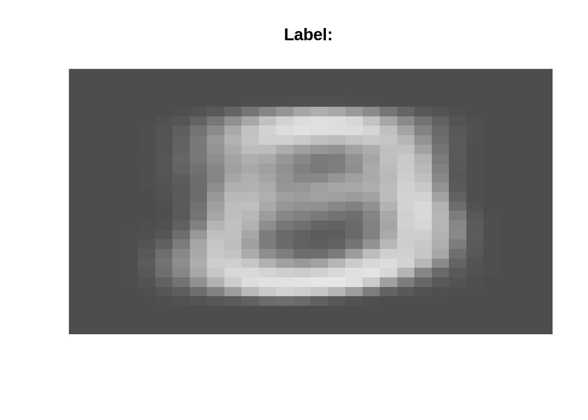

The noise of size = [100] (random vector with 100 values) is passed through the network and the output correspond to the number of pixels of one MNIST image (784)


```r
get_discriminator = function(){
 discriminator = keras_model_sequential()
 discriminator %>% 
 layer_dense(units = 200L, input_shape = c(784L)) %>% 
 layer_activation_leaky_relu() %>% 
 layer_dense(units = 100L) %>% 
 layer_activation_leaky_relu() %>% 
 layer_dense(units = 1L, activation = "sigmoid")
 return(discriminator)
}
```


```r
discriminator = get_discriminator()
discriminator(generator(tf$random$normal(c(1L, 100L))))
```

```
## tf.Tensor([[0.57696146]], shape=(1, 1), dtype=float32)
```

The normal architecture of a binary classifier (will get images as input)

Loss:


```r
ce = tf$keras$losses$BinaryCrossentropy(from_logits = TRUE)
loss_discriminator = function(real, fake){
 real_loss = ce(tf$ones_like(real), real)
 fake_loss = ce(tf$zeros_like(fake), fake)
 return(real_loss+fake_loss)
}
loss_generator = function(fake){
 return(ce(tf$ones_like(fake), fake))
}
```

Binary crossentropy as loss function.

However, we have to encode the true and predicted values for the two networks individually.

The discriminator will get two losses - one for identifying fake images as fake, and one for identifying real MNIST images as real images.

The generator will just get one loss - was it able to deceive the discriminator?

Each network will get its own optimizer (while a AE will be treated as one network, in a GAN the networks will be treated independently)


```r
gen_opt = tf$keras$optimizers$RMSprop(1e-4)
disc_opt = tf$keras$optimizers$RMSprop(1e-4)
```

We have to write here our own training loop (we cannot use the fit function). Let's define a training function:


```r
train_step = function(images){
 noise = tf$random$normal(c(32L, 100L))
 with(tf$GradientTape(persistent = TRUE) %as% tape,{
   gen_images = generator(noise)
   fake_output = discriminator(gen_images)
   real_output = discriminator(images)
   gen_loss = loss_generator(fake_output)
   disc_loss = loss_discriminator(real_output, fake_output)
 })
 gen_grads = tape$gradient(gen_loss, generator$weights)
 disc_grads = tape$gradient(disc_loss, discriminator$weights)
 rm(tape)
 gen_opt$apply_gradients(purrr::transpose(list(gen_grads, generator$weights)))
 disc_opt$apply_gradients(purrr::transpose(list(disc_grads, discriminator$weights)))
 return(c(gen_loss, disc_loss))
}
train_step = tf$`function`(reticulate::py_func(train_step))
```

In each iteration (for each batch) we will do the following (the GradientTape records computations to do automatic differenation):

1. sample noise
2. Generator creates images from the noise
3. Discriminator will make predictions for fake images and real images (response is a probability between [0,1])
4. Calculate loss for generator
5. Calculate loss for discriminator
6. Calculate gradients for weights and the loss
7. Update weights of generator
8. Update weights of discriminator
9. return losses


```r
generator = get_generator()
discriminator = get_discriminator()
epochs = 30L
steps = as.integer(nrow(train_x)/batch_size)
counter = 1
gen_loss = c()
disc_loss = c()

for(e in 1:epochs) {
  dat = reticulate::as_iterator(dataset$batch(batch_size))
  
   coro::loop(for (images in dat) {
      losses = train_step(images)
      gen_loss = c(gen_loss, tf$reduce_sum(losses[[1]])$numpy())
      disc_loss = c(disc_loss, tf$reduce_sum(losses[[2]])$numpy())
   })
   
  cat("Gen: ", mean(gen_loss), " Disc: ", mean(disc_loss), " \n")
  if(e %% 5 == 0) {
    noise = tf$random$normal(c(1L, 100L))
    imgPlot(array(generator(noise)$numpy(), c(28L, 28L)), "Gen")
  }
}


# for(i in 1:(epochs*steps)){
#  images = get_batch()
#  losses = train_step(images)
#  gen_loss = tf$reduce_sum(losses[[1]])$numpy()
#  disc_loss = tf$reduce_sum(losses[[2]])$numpy()
#  if(i %% 50*steps == 0) {
#  noise = tf$random$normal(c(1L, 100L))
#  imgPlot(array(generator(noise)$numpy(), c(28L, 28L)), "Gen")
#  }
#  if(i %% steps == 0){
#  counter = 1
#  cat("Gen: ", mean(gen_loss), " Disc: ", mean(disc_loss), " \n")
#  }
# }
```

The actual training loop:

1. Create networks
2. get batch of images
3. run train_step function
4. print losses
5. repeat step 2-4 for number of epochs


### Flower - GAN

```r
library(keras)
library(tidyverse)
data_files = list.files("flowers/", full.names = TRUE)
train = data_files[str_detect(data_files, "train")]
test = readRDS(file = "test.RDS")
train = lapply(train, readRDS)
train = abind::abind(train, along = 1L)
train = tf$concat(list(train, test), axis = 0L)$numpy()
train_x = array((train-127.5)/127.5, c(dim(train)))
get_generator = function(){
  generator = keras_model_sequential()
  generator %>% 
    layer_dense(units = 20L*20L*128L, input_shape = c(100L), use_bias = FALSE) %>% 
    layer_activation_leaky_relu() %>% 
    layer_reshape(c(20L, 20L, 128L)) %>% 
    layer_dropout(0.3) %>% 
    layer_conv_2d_transpose(filters = 256L, kernel_size = c(3L, 3L), padding = "same", strides = c(1L, 1L), use_bias = FALSE) %>% 
    layer_activation_leaky_relu() %>% 
    layer_dropout(0.3) %>% 
    layer_conv_2d_transpose(filters = 128L, kernel_size = c(5L, 5L), padding = "same", strides = c(1L, 1L), use_bias = FALSE) %>% 
    layer_activation_leaky_relu() %>% 
    layer_dropout(0.3) %>% 
    layer_conv_2d_transpose(filters = 64L, kernel_size = c(5L, 5L), padding = "same", strides = c(2L, 2L), use_bias = FALSE) %>%
    layer_activation_leaky_relu() %>% 
    layer_dropout(0.3) %>% 
    layer_conv_2d_transpose(filters =3L, kernel_size = c(5L, 5L), padding = "same", strides = c(2L, 2L), activation = "tanh", use_bias = FALSE)
  return(generator)
}
generator = get_generator()
image = generator(tf$random$normal(c(1L,100L)))$numpy()[1,,,]
image = scales::rescale(image, to = c(0, 255))
image %>% 
  image_to_array() %>%
  `/`(., 255) %>%
  as.raster() %>%
  plot()
get_discriminator = function(){
  discriminator = keras_model_sequential()
  discriminator %>% 
    layer_conv_2d(filters = 64L, kernel_size = c(5L, 5L), strides = c(2L, 2L), padding = "same", input_shape = c(80L, 80L, 3L)) %>%
    layer_activation_leaky_relu() %>% 
    layer_dropout(0.3) %>% 
    layer_conv_2d(filters = 128L, kernel_size = c(5L, 5L), strides = c(2L, 2L), padding = "same") %>% 
    layer_activation_leaky_relu() %>% 
    layer_dropout(0.3) %>% 
    layer_conv_2d(filters = 256L, kernel_size = c(3L, 3L), strides = c(2L, 2L), padding = "same") %>% 
    layer_activation_leaky_relu() %>% 
    layer_dropout(0.3) %>% 
    layer_flatten() %>% 
    layer_dense(units = 1L, activation = "sigmoid")
  return(discriminator)
}
discriminator = get_discriminator()
discriminator
discriminator(generator(tf$random$normal(c(1L, 100L))))
ce = tf$keras$losses$BinaryCrossentropy(from_logits = TRUE,label_smoothing = 0.1)
loss_discriminator = function(real, fake){
  real_loss = ce(tf$ones_like(real), real)
  fake_loss = ce(tf$zeros_like(fake), fake)
  return(real_loss+fake_loss)
}
loss_generator = function(fake){
  return(ce(tf$ones_like(fake), fake))
}
gen_opt = tf$keras$optimizers$RMSprop(1e-4)
disc_opt = tf$keras$optimizers$RMSprop(1e-4)
batch_size = 32L
get_batch = function(){
  indices = sample.int(nrow(train_x), batch_size)
  return(tf$constant(train_x[indices,,,,drop=FALSE], "float32"))
}
train_step = function(images){
  noise = tf$random$normal(c(32L, 100L))
  
  with(tf$GradientTape(persistent = TRUE) %as% tape,{
    gen_images = generator(noise)
    
    real_output = discriminator(images)
    fake_output = discriminator(gen_images)
    
    gen_loss = loss_generator(fake_output)
    disc_loss = loss_discriminator(real_output, fake_output)
    
  })
  
  gen_grads = tape$gradient(gen_loss, generator$weights)
  disc_grads = tape$gradient(disc_loss, discriminator$weights)
  rm(tape)
  
  gen_opt$apply_gradients(purrr::transpose(list(gen_grads, generator$weights)))
  disc_opt$apply_gradients(purrr::transpose(list(disc_grads, discriminator$weights)))
  
  return(c(gen_loss, disc_loss))
  
}
train_step = tf$`function`(reticulate::py_func(train_step))
epochs = 10L
steps = as.integer(nrow(train_x)/batch_size)
counter = 1
gen_loss = NULL
disc_loss = NULL
for(i in 1:(epochs*steps)){
  
  images = get_batch()
  losses = train_step(images)
  gen_loss[counter] = tf$reduce_sum(losses[[1]])$numpy()
  disc_loss[counter] = tf$reduce_sum(losses[[2]])$numpy()
  counter = counter+1
  if(i %% 10*steps == 0) {
    noise = tf$random$normal(c(1L, 100L))
    image = generator(noise)$numpy()[1,,,]
    image = scales::rescale(image, to = c(0, 255))
    image %>% 
      image_to_array() %>%
      `/`(., 255) %>%
      as.raster() %>%
      plot()
  }
  if(i %% steps == 0){
    counter = 1
    cat("Gen: ", mean(gen_loss), " Disc: ", mean(disc_loss), " \n")
  }
}


results = vector("list", 100L)
for(i in 1:100) {
  noise = tf$random$normal(c(1L, 100L))
  image = generator(noise)$numpy()[1,,,]
  image = scales::rescale(image, to = c(0, 255))
  image %>% 
    image_to_array() %>%
    `/`(., 255) %>%
    as.raster() %>%
    plot()
  results[[i]] = image
  imager::save.image(imager::as.cimg(image),quality = 1.0,file = paste0("images/flower",i, ".png"))
  imager::as.cimg(image)
}
saveRDS(abind::abind(results, along = 0L), file = "images/result.RDS")
```


## Autoencoder
An autoencoder is a type of artificial neural network used to learn efficient data codings in an unsupervised manner. The aim of an autoencoder is to learn a representation (encoding) for a set of data, typically for dimensionality reduction, by training the network to ignore signal “noise”. 
### Autoencoder - DNN MNIST
Autoencoders consist of Encoder and a Decoder Networks. 

The encoder will compress the data into 2 dimensions and the decoder will reconstruct the original data:


```r
library(keras)
library(tensorflow)
rotate = function(x) t(apply(x, 2, rev))
imgPlot = function(img, title = ""){
 col=grey.colors(255)
 image(rotate(img), col = col, xlab = "", ylab = "", axes=FALSE, main = paste0("Label: ", as.character(title)))
}
data = tf$keras$datasets$mnist$load_data()
train = data[[1]]
train_x = array(train[[1]]/255, c(dim(train[[1]])[1], 784L))
test_x = array(test[[1]]/255, c(dim(test[[1]])[1], 784L))
## Dense autoencoder
### Inputs will be compromized to two dimensions
down_size_model = keras_model_sequential()
down_size_model %>% 
 layer_dense(units = 100L, input_shape = c(784L),activation = "relu") %>% 
 layer_dense(units = 20L, activation = "relu") %>% 
 layer_dense(units = 2L, activation = "linear")
### Reconstruction of the images
up_size_model = keras_model_sequential()
up_size_model %>% 
 layer_dense(units = 20L, input_shape = c(2L), activation = "relu") %>% 
 layer_dense(units = 100L, activation = "relu") %>% 
 layer_dense(units = 784L, activation = "sigmoid")
### Combine models into one
autoencoder = tf$keras$models$Model(inputs=down_size_model$input,  outputs=up_size_model(down_size_model$output))
autoencoder$compile(loss = loss_binary_crossentropy, optimizer = optimizer_adamax(0.01))
image = autoencoder(train_x[1,,drop = FALSE])$numpy()
par(mfrow = c(1,2))
imgPlot(array(train_x[1,,drop = FALSE], c(28, 28)))
imgPlot(array(image, c(28, 28)))
```


```r
autoencoder$fit(x = tf$constant(train_x), y = tf$constant(train_x), epochs = 5L, batch_size = 32L)
```

```
## <tensorflow.python.keras.callbacks.History>
```

After training:

```r
pred_dim = down_size_model(test_x)
reconstr_pred = autoencoder(test_x)
imgPlot(array(reconstr_pred[10,]$numpy(), dim = c(28L, 28L)))
```

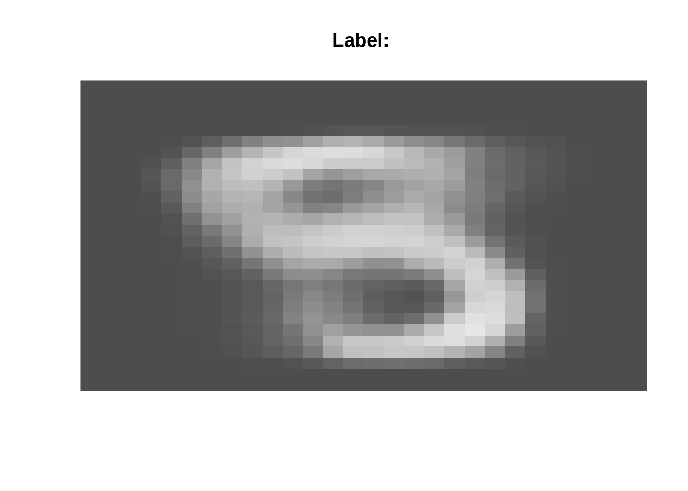

```r
par(mfrow = c(1,1))
plot(pred_dim$numpy()[,1], pred_dim$numpy()[,2], col = test[[2]]+1L)
```

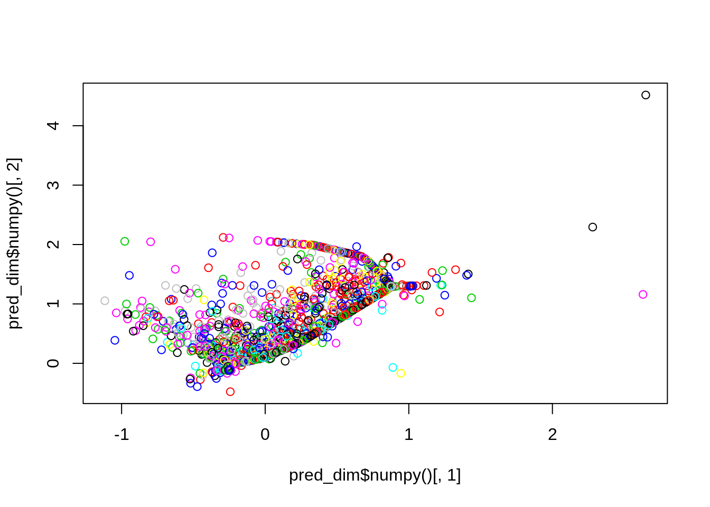

### Autoencoder - MNIST CNN
We can also use CNNs isntead of DNNs. There is also an inverse convolutional layer:


```r
data = tf$keras$datasets$mnist$load_data()
train = data[[1]]
train_x = array(train[[1]]/255, c(dim(train[[1]]), 1L))
test_x = array(data[[2]][[1/255/255, c(dim(data[[2]][[1/255), 1L))
down_size_model = keras_model_sequential()
down_size_model %>% 
 layer_conv_2d(filters = 32L, activation = "relu", kernel_size = c(2L,2L), 
                          input_shape = c(28L, 28L, 1L), strides = c(4L, 4L)) %>% 
 layer_conv_2d(filters = 16L, activation = "relu", 
                           kernel_size = c(7L,7L), strides = c(1L, 1L)) %>% 
 layer_flatten() %>% 
 layer_dense(units = 2L, activation = "linear")
up_size_model = keras_model_sequential()
up_size_model %>% 
 layer_dense(units = 8L, activation = "relu", input_shape = c(2L)) %>% 
 layer_reshape(target_shape = c(1L, 1L, 8L)) %>% 
 layer_conv_2d_transpose(filters = 16L, kernel_size = c(7,7), activation = "relu", strides = c(1L,1L)) %>% 
 layer_conv_2d_transpose(filters = 32L, activation = "relu", kernel_size = c(2,2), strides = c(4L,4L)) %>% 
 layer_conv_2d(filters = 1, kernel_size = c(1L, 1L), strides = c(1L, 1L), activation = "sigmoid")

autoencoder = tf$keras$models$Model(inputs = down_size_model$input, outputs = up_size_model(down_size_model$output))
autoencoder$compile(loss = loss_binary_crossentropy, optimizer = optimizer_rmsprop(0.001))
autoencoder$fit(x = tf$constant(train_x), y = tf$constant(train_x), epochs = 1L, batch_size = 64L)
pred_dim = down_size_model(tf$constant(test_x, "float32"))
reconstr_pred = autoencoder(tf$constant(test_x, "float32"))
imgPlot(reconstr_pred[10,,,]$numpy()[,,1])
plot(pred_dim[,1]$numpy(), pred_dim[,2]$numpy(), col = test[[2]]+1L)
## Generate new images!
new = matrix(c(10,10), 1, 2)
imgPlot(array(up_size_model(new)$numpy(), c(28L, 28L)))
```


## Varational Autoencoder
The difference to normal autoencoder is that we here try to fit latent variables which encode the images:


```r
library(tensorflow_probability)
data = tf$keras$datasets$mnist$load_data()
train = data[[1]]
train_x = array(train[[1]]/255, c(dim(train[[1]])[1], 784L))
tfp = reticulate::import("tensorflow_probability")
prior = tfp$distributions$Independent(tfp$distributions$Normal(loc=tf$zeros(shape(10L,4L)), scale=1.0),
 reinterpreted_batch_ndims=1L)
down_size_model = keras_model_sequential()
down_size_model %>% 
 layer_dense(units = 100L, input_shape = c(784L),activation = "relu") %>% 
 layer_dense(units = 20L, activation = "relu") %>% 
 layer_dense(units = 4L)
### Reconstruction of the images
up_size_model = keras_model_sequential()
up_size_model %>% 
 layer_dense(units = 20L, input_shape = c(2L), activation = "relu") %>% 
 layer_dense(units = 100L, activation = "relu") %>% 
 layer_dense(units = 784L, activation = "sigmoid")
### Combine models into one
batch_size = 32L
epochs = 10L
steps = as.integer(nrow(train_x)/32L * epochs)
prior = tfp$distributions$MultivariateNormalDiag(loc = tf$zeros(shape(batch_size, 2L), "float32"), scale_diag = tf$ones(2L, "float32"))
optimizer = tf$keras$optimizers$RMSprop(0.0001)
weights = c(down_size_model$weights, up_size_model$weights)
get_batch = function(){
 indices = sample.int(nrow(train_x), batch_size)
 return(train_x[indices,])
}
for(i in 1:steps){
 tmp_X = get_batch()
 with(tf$GradientTape() %as% tape, {
 encoded = down_size_model(tmp_X)
 
 dd = tfp$distributions$MultivariateNormalDiag(loc = encoded[,1:2], 
 scale_diag = 1.0/(0.01+ tf$math$softplus(encoded[,3:4])))
 samples = dd$sample()
 reconstructed = up_size_model(samples)
 
 KL_loss = dd$kl_divergence(prior) # constrain
 
 loss = tf$reduce_mean(tf$negative(tfp$distributions$Binomial(1L, logits = reconstructed)$log_prob(tmp_X)))+tf$reduce_mean(KL_loss)
 })
 gradients = tape$gradient(loss, weights)
 optimizer$apply_gradients(purrr::transpose(list(gradients, weights)))
 
 if(i %% as.integer(nrow(train_x)/10L) == 0) cat("Loss: ", loss$numpy(), "\n")
}
```


<!--chapter:end:05-GAN.Rmd-->

# Datasets
You can download the datasets we use in the course [here](http://rhsbio7.uni-regensburg.de:8500) (ignore browser warnings) or by installing the EcoData package:


```r
devtools::install_github(repo = "florianhartig/EcoData", subdir = "EcoData", 
dependencies = TRUE, build_vignettes = FALSE)
```


## Titanic 
The dataset is a collection of titanic passengers with information about their age, class, sex, and their survival status. The competition here is simple: train a ML model and predict the survival probability.

The titanic dataset is very well explored and serves as a stepping stone in many ML careers. For inspiration and data exploration notebooks, check out this kaggle competition: [](https://www.kaggle.com/c/titanic/data)

**Response variable:** 'survived'

A minimal working example:

1. Load dataset

```r
# load("datasets.RData")
library(EcoData)
data(titanic_ml)
titanic = titanic_ml
summary(titanic)
```

```
##      pclass         survived          name               sex           age              sibsp            parch            ticket          fare        
##  Min.   :1.000   Min.   :0.0000   Length:1309        female:466   Min.   : 0.1667   Min.   :0.0000   Min.   :0.000   CA. 2343:  11   Min.   :  0.000  
##  1st Qu.:2.000   1st Qu.:0.0000   Class :character   male  :843   1st Qu.:21.0000   1st Qu.:0.0000   1st Qu.:0.000   1601    :   8   1st Qu.:  7.896  
##  Median :3.000   Median :0.0000   Mode  :character                Median :28.0000   Median :0.0000   Median :0.000   CA 2144 :   8   Median : 14.454  
##  Mean   :2.295   Mean   :0.3853                                   Mean   :29.8811   Mean   :0.4989   Mean   :0.385   3101295 :   7   Mean   : 33.295  
##  3rd Qu.:3.000   3rd Qu.:1.0000                                   3rd Qu.:39.0000   3rd Qu.:1.0000   3rd Qu.:0.000   347077  :   7   3rd Qu.: 31.275  
##  Max.   :3.000   Max.   :1.0000                                   Max.   :80.0000   Max.   :8.0000   Max.   :9.000   347082  :   7   Max.   :512.329  
##                  NA's   :655                                      NA's   :263                                        (Other) :1261   NA's   :1        
##              cabin      embarked      boat          body                      home.dest  
##                 :1014    :  2           :823   Min.   :  1.0                       :564  
##  C23 C25 C27    :   6   C:270    13     : 39   1st Qu.: 72.0   New York, NY        : 64  
##  B57 B59 B63 B66:   5   Q:123    C      : 38   Median :155.0   London              : 14  
##  G6             :   5   S:914    15     : 37   Mean   :160.8   Montreal, PQ        : 10  
##  B96 B98        :   4            14     : 33   3rd Qu.:256.0   Cornwall / Akron, OH:  9  
##  C22 C26        :   4            4      : 31   Max.   :328.0   Paris, France       :  9  
##  (Other)        : 271            (Other):308   NA's   :1188    (Other)             :639
```

2. Impute missing values (not our response variable!)

```r
library(missRanger)
library(dplyr)
titanic_imputed = titanic %>% select(-name, -ticket, -cabin, -boat, -home.dest)
titanic_imputed = missRanger::missRanger(data = titanic_imputed %>% select(-survived))
```

```
## 
## Missing value imputation by random forests
## 
##   Variables to impute:		age, fare, body
##   Variables used to impute:	pclass, sex, age, sibsp, parch, fare, embarked, body
## iter 1:	...
## iter 2:	...
## iter 3:	...
```

```r
titanic_imputed$survived = titanic$survived
```

3. Split into training and testing

```r
train = titanic_imputed[!is.na(titanic$survived), ]
test = titanic_imputed[is.na(titanic$survived), ]
```

4. Train model

```r
model = glm(survived~., data=train, family = binomial())
```

5. Predictions

```r
preds = predict(model, data = test, type = "response")
head(preds)
```

```
##        561        321       1177       1098       1252       1170 
## 0.79350595 0.30982388 0.01400816 0.12405376 0.14107743 0.11799810
```

6. Create submission csv

```r
write.csv(data.frame(y=preds), file = "glm.csv")
```

And submit the csv on [](http://rhsbio7.uni-regensburg.de:8500)

## Plant-pollinator database
The plant-pollinator database is a collection of plant-pollinator interactions with traits for plants and pollinators. The idea is pollinators interact with plants when their traits fit (e.g. the tongue of a bee needs to match the shape of a flower).
We explored the advantage of ML algorithms over traditional statistical models in predicting species interactions in our paper. If you are interested you can have a look .

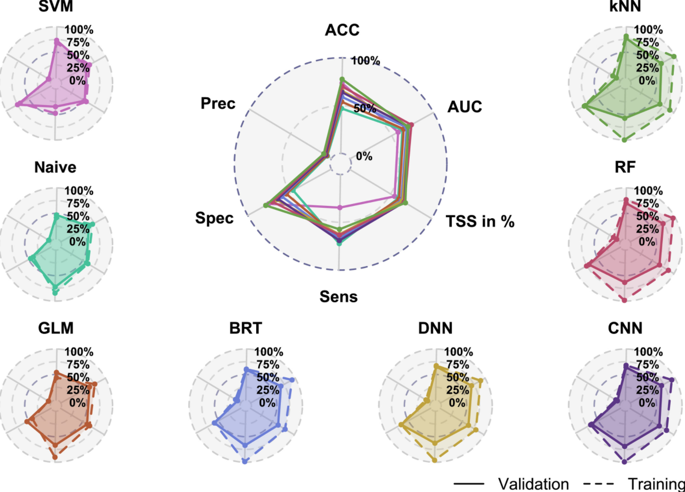


**Response variable:** 'interaction'

A minimal working example:

1. Load dataset

```r
load("datasets.RData")
# library(EcoData)
# data(plantPollinator_df)
# plant_poll = plantPollinator_df
summary(plant_poll)
```

```
##                     X                           Y             type              season             diameter        corolla             colour             nectar         
##  Vaccinium_corymbosum:  256   Andrena_wilkella   :   80   Length:20480       Length:20480       Min.   :  2.00   Length:20480       Length:20480       Length:20480      
##  Brassica_napus      :  256   Andrena_barbilabris:   80   Class :character   Class :character   1st Qu.:  5.00   Class :character   Class :character   Class :character  
##  Carum_carvi         :  256   Andrena_cineraria  :   80   Mode  :character   Mode  :character   Median : 19.00   Mode  :character   Mode  :character   Mode  :character  
##  Coriandrum_sativum  :  256   Andrena_flavipes   :   80                                         Mean   : 27.03                                                           
##  Daucus_carota       :  256   Andrena_gravida    :   80                                         3rd Qu.: 25.00                                                           
##  Malus_domestica     :  256   Andrena_haemorrhoa :   80                                         Max.   :150.00                                                           
##  (Other)             :18944   (Other)            :20000                                         NA's   :9472                                                             
##    b.system         s.pollination      inflorescence       composite            guild               tongue            body        sociality           feeding         
##  Length:20480       Length:20480       Length:20480       Length:20480       Length:20480       Min.   : 2.000   Min.   : 2.00   Length:20480       Length:20480      
##  Class :character   Class :character   Class :character   Class :character   Class :character   1st Qu.: 4.800   1st Qu.: 8.00   Class :character   Class :character  
##  Mode  :character   Mode  :character   Mode  :character   Mode  :character   Mode  :character   Median : 6.600   Median :10.50   Mode  :character   Mode  :character  
##                                                                                                 Mean   : 8.104   Mean   :10.66                                        
##                                                                                                 3rd Qu.:10.500   3rd Qu.:13.00                                        
##                                                                                                 Max.   :26.400   Max.   :25.00                                        
##                                                                                                 NA's   :17040    NA's   :6160                                         
##  interaction 
##  0   :14095  
##  1   :  595  
##  NA's: 5790  
##              
##              
##              
## 
```

2. Impute missing values (not our response variable!)
We will select only a few predictors here (you can work with all predictors ofc).

```r
library(missRanger)
library(dplyr)
plant_poll_imputed = plant_poll %>% select(diameter, corolla, tongue, body, interaction)
plant_poll_imputed = missRanger::missRanger(data = plant_poll_imputed %>% select(-interaction))
```

```
## 
## Missing value imputation by random forests
## 
##   Variables to impute:		diameter, corolla, tongue, body
##   Variables used to impute:	diameter, corolla, tongue, body
## iter 1:	....
## iter 2:	....
## iter 3:	....
## iter 4:	....
```

```r
plant_poll_imputed$interaction = plant_poll$interaction
```

3. Split into training and testing

```r
train = plant_poll_imputed[!is.na(plant_poll_imputed$interaction), ]
test = plant_poll_imputed[is.na(plant_poll_imputed$interaction), ]
```

4. Train model

```r
model = glm(interaction~., data=train, family = binomial())
```

5. Predictions

```r
preds = predict(model, data = test, type = "response")
head(preds)
```

```
##       3871       3872       3873       3874       3875       3876 
## 0.03850223 0.03726134 0.03917270 0.04460708 0.04456360 0.03910827
```

6. Create submission csv

```r
write.csv(data.frame(y=preds), file = "glm.csv")
```

## Wine
The dataset is a collection of wines of different quality. The aim is to predict the quality of the wine based on physochemical predictors. 

For inspiration and data exploration notebooks, check out this kaggle competition: [](https://www.kaggle.com/uciml/red-wine-quality-cortez-et-al-2009)
For instance, check out this very nice [notebook](https://www.kaggle.com/aditimulye/red-wine-quality-assesment-starter-pack) which removes a few problems from the data. 

**Response variable:** 'quality'

We could use theoretically a regression model for this task but we will stick with a classification model

A minimal working example:

1. Load dataset

```r
load("datasets.RData")
# library(EcoData)
# data(wine)
summary(wine)
```

```
##  fixed.acidity    volatile.acidity  citric.acid     residual.sugar     chlorides       free.sulfur.dioxide total.sulfur.dioxide    density             pH       
##  Min.   : 4.600   Min.   :0.1200   Min.   :0.0000   Min.   : 0.900   Min.   :0.01200   Min.   : 1.00       Min.   :  6.00       Min.   :0.9901   Min.   :2.740  
##  1st Qu.: 7.100   1st Qu.:0.3900   1st Qu.:0.0900   1st Qu.: 1.900   1st Qu.:0.07000   1st Qu.: 7.00       1st Qu.: 22.00       1st Qu.:0.9956   1st Qu.:3.210  
##  Median : 7.900   Median :0.5200   Median :0.2600   Median : 2.200   Median :0.07900   Median :14.00       Median : 38.00       Median :0.9968   Median :3.310  
##  Mean   : 8.335   Mean   :0.5284   Mean   :0.2705   Mean   : 2.533   Mean   :0.08747   Mean   :15.83       Mean   : 46.23       Mean   :0.9968   Mean   :3.311  
##  3rd Qu.: 9.300   3rd Qu.:0.6400   3rd Qu.:0.4200   3rd Qu.: 2.600   3rd Qu.:0.09000   3rd Qu.:21.00       3rd Qu.: 62.00       3rd Qu.:0.9979   3rd Qu.:3.400  
##  Max.   :15.900   Max.   :1.5800   Max.   :1.0000   Max.   :15.500   Max.   :0.61100   Max.   :72.00       Max.   :289.00       Max.   :1.0037   Max.   :4.010  
##  NA's   :70       NA's   :48       NA's   :41       NA's   :60       NA's   :37        NA's   :78          NA's   :78           NA's   :78       NA's   :25     
##    sulphates         alcohol         quality     
##  Min.   :0.3300   Min.   : 8.40   Min.   :3.000  
##  1st Qu.:0.5500   1st Qu.: 9.50   1st Qu.:5.000  
##  Median :0.6200   Median :10.20   Median :6.000  
##  Mean   :0.6572   Mean   :10.42   Mean   :5.596  
##  3rd Qu.:0.7300   3rd Qu.:11.10   3rd Qu.:6.000  
##  Max.   :2.0000   Max.   :14.90   Max.   :8.000  
##  NA's   :51                       NA's   :905
```

2. Impute missing values (not our response variable!)

```r
library(missRanger)
library(dplyr)
#wine_imputed = titanic %>% select(-name, -ticket, -cabin, -boat, -home.dest)
wine_imputed = missRanger::missRanger(data = wine %>% select(-quality))
```

```
## 
## Missing value imputation by random forests
## 
##   Variables to impute:		fixed.acidity, volatile.acidity, citric.acid, residual.sugar, chlorides, free.sulfur.dioxide, total.sulfur.dioxide, density, pH, sulphates
##   Variables used to impute:	fixed.acidity, volatile.acidity, citric.acid, residual.sugar, chlorides, free.sulfur.dioxide, total.sulfur.dioxide, density, pH, sulphates, alcohol
## iter 1:	..........
## iter 2:	..........
## iter 3:	..........
## iter 4:	..........
## iter 5:	..........
```

```r
wine_imputed$quality = wine$quality
```

3. Split into training and testing

```r
train = wine_imputed[!is.na(wine$quality), ]
test = wine_imputed[is.na(wine$quality), ]
```

4. Train model

```r
library(ranger)
rf = ranger(quality~., data = train, classification = TRUE)
```

5. Predictions

```r
preds = predict(rf, data = test)$predictions
head(preds)
```

```
## [1] 6 5 5 7 6 6
```

6. Create submission csv

```r
write.csv(data.frame(y=preds), file = "rf.csv")
```

## Nasa
A collection about asteroids and their characteristics from kaggle. The aim is to predict whether the asteroids are hazardous or not. 
For inspiration and data exploration notebooks, check out the kaggle competition: [](https://www.kaggle.com/shrutimehta/nasa-asteroids-classification)

**Response variable:** 'Hazardous'
1. Load dataset

```r
load("datasets.RData")
# library(EcoData)
# data(nasa)
summary(nasa)
```

```
##  Neo.Reference.ID       Name         Absolute.Magnitude Est.Dia.in.KM.min. Est.Dia.in.KM.max. Est.Dia.in.M.min.   Est.Dia.in.M.max.  Est.Dia.in.Miles.min.
##  Min.   :2000433   Min.   :2000433   Min.   :11.16      Min.   : 0.00101   Min.   : 0.00226   Min.   :    1.011   Min.   :    2.26   Min.   :0.00063      
##  1st Qu.:3102682   1st Qu.:3102683   1st Qu.:20.10      1st Qu.: 0.03346   1st Qu.: 0.07482   1st Qu.:   33.462   1st Qu.:   74.82   1st Qu.:0.02079      
##  Median :3514800   Median :3514800   Median :21.90      Median : 0.11080   Median : 0.24777   Median :  110.804   Median :  247.77   Median :0.06885      
##  Mean   :3272675   Mean   :3273113   Mean   :22.27      Mean   : 0.20523   Mean   : 0.45754   Mean   :  204.649   Mean   :  458.45   Mean   :0.12734      
##  3rd Qu.:3690987   3rd Qu.:3690385   3rd Qu.:24.50      3rd Qu.: 0.25384   3rd Qu.: 0.56760   3rd Qu.:  253.837   3rd Qu.:  567.60   3rd Qu.:0.15773      
##  Max.   :3781897   Max.   :3781897   Max.   :32.10      Max.   :15.57955   Max.   :34.83694   Max.   :15579.552   Max.   :34836.94   Max.   :9.68068      
##  NA's   :53        NA's   :57        NA's   :36         NA's   :60         NA's   :23         NA's   :29          NA's   :46         NA's   :42           
##  Est.Dia.in.Miles.max. Est.Dia.in.Feet.min. Est.Dia.in.Feet.max. Close.Approach.Date Epoch.Date.Close.Approach Relative.Velocity.km.per.sec Relative.Velocity.km.per.hr
##  Min.   : 0.00140      Min.   :    3.32     Min.   :     7.41    2016-07-22:  18     Min.   :7.889e+11         Min.   : 0.3355              Min.   :  1208             
##  1st Qu.: 0.04649      1st Qu.:  109.78     1st Qu.:   245.49    2015-01-15:  17     1st Qu.:1.016e+12         1st Qu.: 8.4497              1st Qu.: 30399             
##  Median : 0.15395      Median :  363.53     Median :   812.88    2015-02-15:  16     Median :1.203e+12         Median :12.9370              Median : 46532             
##  Mean   : 0.28486      Mean   :  670.44     Mean   :  1500.77    2007-11-08:  15     Mean   :1.180e+12         Mean   :13.9848              Mean   : 50298             
##  3rd Qu.: 0.35269      3rd Qu.:  832.80     3rd Qu.:  1862.19    2012-01-15:  15     3rd Qu.:1.356e+12         3rd Qu.:18.0774              3rd Qu.: 65068             
##  Max.   :21.64666      Max.   :51114.02     Max.   :114294.42    (Other)   :4577     Max.   :1.473e+12         Max.   :44.6337              Max.   :160681             
##  NA's   :50            NA's   :21           NA's   :46           NA's      :  29     NA's   :43                NA's   :27                   NA's   :28                 
##  Miles.per.hour    Miss.Dist..Astronomical. Miss.Dist..lunar.   Miss.Dist..kilometers. Miss.Dist..miles.  Orbiting.Body    Orbit.ID             Orbit.Determination.Date
##  Min.   :  750.5   Min.   :0.00018          Min.   :  0.06919   Min.   :   26610       Min.   :   16535   Earth:4665    Min.   :  1.00   2017-06-21 06:17:20:   9       
##  1st Qu.:18846.7   1st Qu.:0.13341          1st Qu.: 51.89874   1st Qu.:19964907       1st Qu.:12454813   NA's :  22    1st Qu.:  9.00   2017-04-06 08:57:13:   8       
##  Median :28893.7   Median :0.26497          Median :103.19415   Median :39685408       Median :24662435                 Median : 16.00   2017-04-06 09:24:24:   8       
##  Mean   :31228.0   Mean   :0.25690          Mean   : 99.91366   Mean   :38436154       Mean   :23885560                 Mean   : 28.34   2017-04-06 08:24:13:   7       
##  3rd Qu.:40436.9   3rd Qu.:0.38506          3rd Qu.:149.59244   3rd Qu.:57540318       3rd Qu.:35714721                 3rd Qu.: 31.00   2017-04-06 08:26:19:   7       
##  Max.   :99841.2   Max.   :0.49988          Max.   :194.45491   Max.   :74781600       Max.   :46467132                 Max.   :611.00   (Other)            :4622       
##  NA's   :38        NA's   :60               NA's   :30          NA's   :56             NA's   :27                       NA's   :33       NA's               :  26       
##  Orbit.Uncertainity Minimum.Orbit.Intersection Jupiter.Tisserand.Invariant Epoch.Osculation   Eccentricity     Semi.Major.Axis   Inclination       Asc.Node.Longitude
##  Min.   :0.000      Min.   :0.00000            Min.   :2.196               Min.   :2450164   Min.   :0.00752   Min.   :0.6159   Min.   : 0.01451   Min.   :  0.0019  
##  1st Qu.:0.000      1st Qu.:0.01435            1st Qu.:4.047               1st Qu.:2458000   1st Qu.:0.24086   1st Qu.:1.0012   1st Qu.: 4.93290   1st Qu.: 83.1849  
##  Median :3.000      Median :0.04653            Median :5.071               Median :2458000   Median :0.37251   Median :1.2422   Median :10.27694   Median :172.6347  
##  Mean   :3.521      Mean   :0.08191            Mean   :5.056               Mean   :2457723   Mean   :0.38267   Mean   :1.4009   Mean   :13.36159   Mean   :172.1717  
##  3rd Qu.:6.000      3rd Qu.:0.12150            3rd Qu.:6.017               3rd Qu.:2458000   3rd Qu.:0.51256   3rd Qu.:1.6782   3rd Qu.:19.47848   3rd Qu.:254.8804  
##  Max.   :9.000      Max.   :0.47789            Max.   :9.025               Max.   :2458020   Max.   :0.96026   Max.   :5.0720   Max.   :75.40667   Max.   :359.9059  
##  NA's   :49         NA's   :137                NA's   :56                  NA's   :60        NA's   :39        NA's   :53       NA's   :42         NA's   :60        
##  Orbital.Period   Perihelion.Distance Perihelion.Arg     Aphelion.Dist    Perihelion.Time    Mean.Anomaly       Mean.Motion       Equinox       Hazardous    
##  Min.   : 176.6   Min.   :0.08074     Min.   :  0.0069   Min.   :0.8038   Min.   :2450100   Min.   :  0.0032   Min.   :0.08628   J2000:4663   Min.   :0.000  
##  1st Qu.: 365.9   1st Qu.:0.63038     1st Qu.: 95.6430   1st Qu.:1.2661   1st Qu.:2457815   1st Qu.: 87.0069   1st Qu.:0.45147   NA's :  24   1st Qu.:0.000  
##  Median : 504.9   Median :0.83288     Median :189.7729   Median :1.6182   Median :2457972   Median :186.0219   Median :0.71137                Median :0.000  
##  Mean   : 635.5   Mean   :0.81316     Mean   :184.0185   Mean   :1.9864   Mean   :2457726   Mean   :181.2882   Mean   :0.73732                Mean   :0.176  
##  3rd Qu.: 793.1   3rd Qu.:0.99718     3rd Qu.:271.9535   3rd Qu.:2.4497   3rd Qu.:2458108   3rd Qu.:276.6418   3rd Qu.:0.98379                3rd Qu.:0.000  
##  Max.   :4172.2   Max.   :1.29983     Max.   :359.9931   Max.   :8.9839   Max.   :2458839   Max.   :359.9180   Max.   :2.03900                Max.   :1.000  
##  NA's   :46       NA's   :22          NA's   :48         NA's   :38       NA's   :59        NA's   :40         NA's   :48                     NA's   :4187
```

2. Impute missing values (not our response variable!)

```r
library(missRanger)
library(dplyr)
#wine_imputed = titanic %>% select(-name, -ticket, -cabin, -boat, -home.dest)
nasa_imputed = missRanger::missRanger(data = nasa %>% select(-Hazardous), maxiter = 1, num.trees=5L)
```

```
## 
## Missing value imputation by random forests
## 
##   Variables to impute:		Neo.Reference.ID, Name, Absolute.Magnitude, Est.Dia.in.KM.min., Est.Dia.in.KM.max., Est.Dia.in.M.min., Est.Dia.in.M.max., Est.Dia.in.Miles.min., Est.Dia.in.Miles.max., Est.Dia.in.Feet.min., Est.Dia.in.Feet.max., Close.Approach.Date, Epoch.Date.Close.Approach, Relative.Velocity.km.per.sec, Relative.Velocity.km.per.hr, Miles.per.hour, Miss.Dist..Astronomical., Miss.Dist..lunar., Miss.Dist..kilometers., Miss.Dist..miles., Orbiting.Body, Orbit.ID, Orbit.Determination.Date, Orbit.Uncertainity, Minimum.Orbit.Intersection, Jupiter.Tisserand.Invariant, Epoch.Osculation, Eccentricity, Semi.Major.Axis, Inclination, Asc.Node.Longitude, Orbital.Period, Perihelion.Distance, Perihelion.Arg, Aphelion.Dist, Perihelion.Time, Mean.Anomaly, Mean.Motion, Equinox
##   Variables used to impute:	Neo.Reference.ID, Name, Absolute.Magnitude, Est.Dia.in.KM.min., Est.Dia.in.KM.max., Est.Dia.in.M.min., Est.Dia.in.M.max., Est.Dia.in.Miles.min., Est.Dia.in.Miles.max., Est.Dia.in.Feet.min., Est.Dia.in.Feet.max., Close.Approach.Date, Epoch.Date.Close.Approach, Relative.Velocity.km.per.sec, Relative.Velocity.km.per.hr, Miles.per.hour, Miss.Dist..Astronomical., Miss.Dist..lunar., Miss.Dist..kilometers., Miss.Dist..miles., Orbiting.Body, Orbit.ID, Orbit.Determination.Date, Orbit.Uncertainity, Minimum.Orbit.Intersection, Jupiter.Tisserand.Invariant, Epoch.Osculation, Eccentricity, Semi.Major.Axis, Inclination, Asc.Node.Longitude, Orbital.Period, Perihelion.Distance, Perihelion.Arg, Aphelion.Dist, Perihelion.Time, Mean.Anomaly, Mean.Motion, Equinox
## iter 1:	.....
```

```
## Warning: Dropped unused factor level(s) in dependent variable: 2017-04-06 08:35:59, 2017-04-06 09:06:29, 2017-04-06 09:10:05.
```

```
## ..................................
```

```r
nasa_imputed$Hazardous = nasa$Hazardous
```

3. Split into training and testing

```r
train = nasa_imputed[!is.na(nasa$Hazardous), ]
test = nasa_imputed[is.na(nasa$Hazardous), ]
```

4. Train model

```r
library(ranger)
rf = ranger(Hazardous~., data = train, classification = TRUE, probability = TRUE)
```

5. Predictions

```r
preds = predict(rf, data = test)$predictions[,2]
head(preds)
```

```
## [1] 0.7266984 0.7744373 0.0015000 0.8139786 0.1496508 0.1784167
```

6. Create submission csv

```r
write.csv(data.frame(y=preds), file = "rf.csv")
```


## Flower
A collection of over 4000 flower images of 5 plant species. The dataset is from [kaggle](https://www.kaggle.com/alxmamaev/flowers-recognition) but we downsampled the images from $320*240$ to $80*80$ pixels. 
You can download the dataset [here](http://rhsbio7.uni-regensburg.de:8500).

**Notes:**

- check out CNN notebooks on kaggle (they are often written in python but you can still copy the CNN architectures), e.g. [this one](https://www.kaggle.com/alirazaaliqadri/flower-recognition-tensorflow-keras-sequential)
- Last year's winner have used a transfer learning approach (they achieved around 70% accuracy), check out this [notebook](https://www.kaggle.com/stpeteishii/flower-name-classify-densenet201), see also the section about transfer learning \@ref(transfer)


**Response variable:** Plant species

1. Load dataset
The dataset requires pre-processing (we have to concatenate the train and test images):

```r
library(keras)
library(stringr)
data_files = list.files("flower/", full.names = TRUE)
train = data_files[str_detect(data_files, "train")]
test = readRDS(file = "flower/test.RDS")
train = lapply(train, readRDS)
train_classes = lapply(train, function(d) dim(d)[1])
train = abind::abind(train, along = 1L)
labels_train = rep(0:4, unlist(train_classes))

flower = EcoData::dataset_flower()
train = flower$train
test = flower$test
train_classes = flower$labels
```

Let's visualize a flower:

```r
train[100,,,] %>% 
 image_to_array() %>%
 `/`(., 255) %>%
 as.raster() %>%
 plot()
```


2. Build & train model:

```r
model = keras_model_sequential()
model %>% 
  layer_conv_2d(filters = 4L, kernel_size = 2L, input_shape = list( 80L, 80L, 3L)) %>% 
  layer_max_pooling_2d() %>% 
  layer_flatten() %>% 
  layer_dense(units = 5L, activation = "softmax")

model %>% 
  compile(optimizer = keras::optimizer_adamax(0.01), loss = keras::loss_categorical_crossentropy)


### Model fitting ###
epochs = 50L
batch_size = 25L
steps = floor(dim(train)[1]/batch_size)
generator = keras::flow_images_from_data(x = train/255 , y = keras::k_one_hot(labels_train, 5L), batch_size = batch_size)

optim = optimizer_adamax(0.01)
epoch_losses = c()
for(e in 1:epochs) {
  epoch_loss = c()
  for(s in 1:steps) {
    batch = reticulate::iter_next(generator)
    with(tf$GradientTape() %as% tape, {
        pred = model(batch[[1]])
        loss = keras::loss_categorical_crossentropy(batch[[2]], pred)
        loss = tf$reduce_mean(loss)
      })
    gradients = tape$gradient(target = loss, sources = model$weights)
    optim$apply_gradients(purrr::transpose(list(gradients, model$weights)))
    epoch_loss = c(epoch_loss, loss$numpy())
  }
  epoch_losses = c(epoch_losses, epoch_loss)
  cat("Epoch: ", e, " Loss: ", mean(epoch_losses), " \n")
}
```

3. Predictions

```r
preds = model %>% predict(test/255)
preds = apply(preds, 1, which.max)-1
head(preds)
```

4. Create submission csv

```r
write.csv(data.frame(y=preds), file = "cnn.csv")
```


<!--chapter:end:06-Datasets.Rmd-->

# References {-}

<!--chapter:end:07-Refs.Rmd-->

