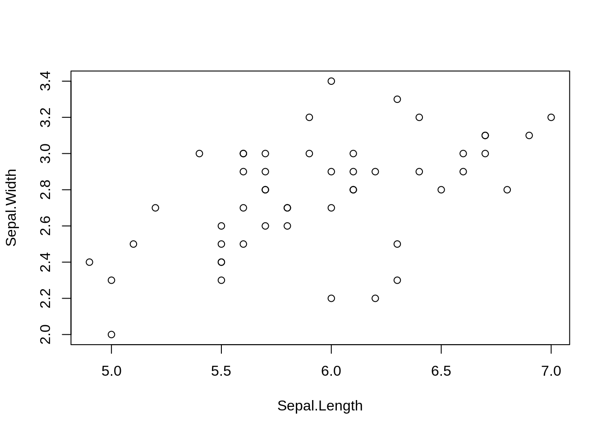
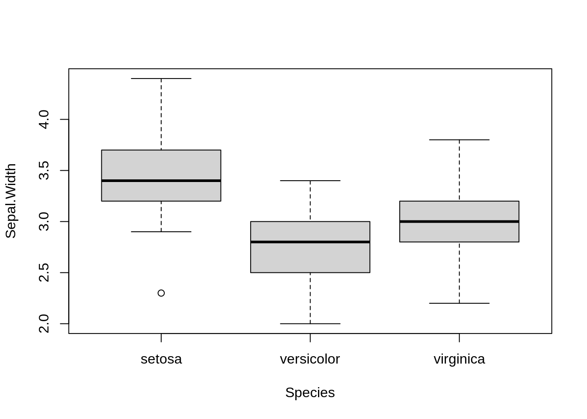
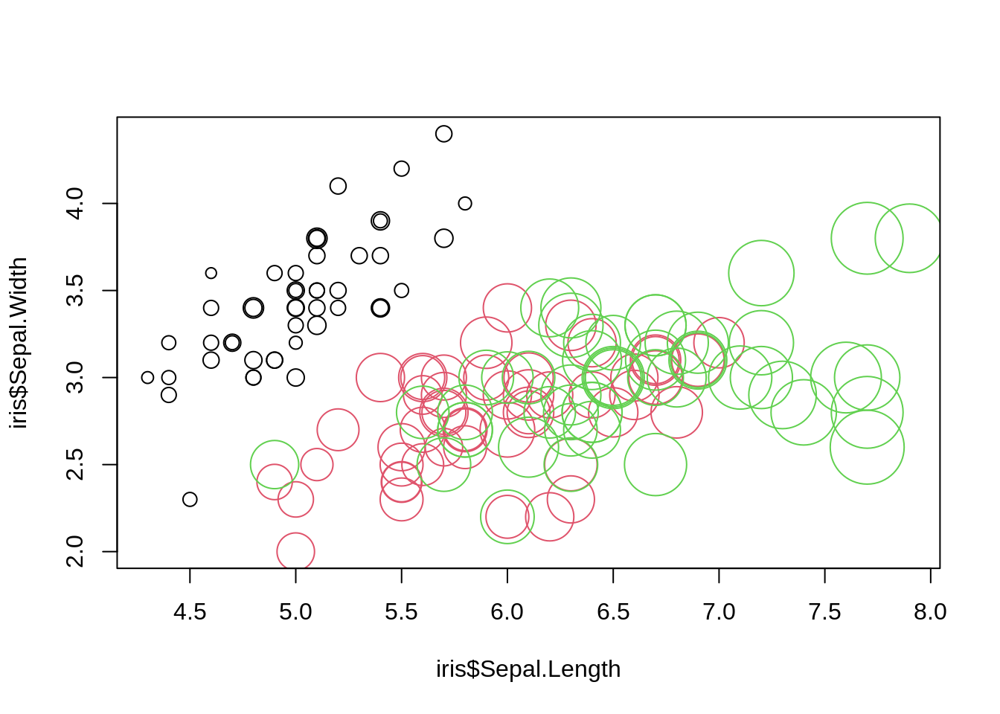

# Reminders About Basic Operations in R {#reminder}

```{=html}
<!-- Put this here (right after the first markdown headline) and only here for each document! -->
<script src="./scripts/multipleChoice.js"></script>
```

## Your R System

In this course, we work with the combination of R + RStudio.

* R is the calculation engine that performs the computations.
* RStudio is the editor that helps you sending inputs to R and collect outputs.

Make sure you have a recent version of R + RStudio installed on your computer.

If you have never used RStudio, <a href="https://videocampus.sachsen.de/video/First-steps-with-R-and-RStudio/528e5d164219f2d07e32a51736c3f7d1" target="_blank" rel="noopener">here</a> is an introductory video.


## Data types in R

The following subchapters introduce / remind you of R data types.


### Test Your Knowledge

Discuss with your partner(s) - what is the meaning / structure / properties of the following data types in R:

* Atomic types (which atomic types exist)
* list
* vector
* data.frame
* matrix
* array


### Iris Data

What is the data type of the iris data set? Explore using the following commands:


```r
iris

class(iris)
dim(iris)
str(iris)
```


### Dynamic typing

R is a dynamically typed language, which means that the type of variables is determined automatically depending on what values you supply. Try this:


```r
x = 1
class(x)
x = "dog"
class(x)
```

This also works if a data set already exists, i.e. if you assign a different value, the type will automatically be changed. Look at what happens if we assign a character value to a previously numeric column in a data.frame:


```r
iris$Sepal.Length[2] = "dog"
str(iris)
```

Note that all numeric values are changed to characters as well. You can try to force back the values to numeric by:


```r
iris$Sepal.Length = as.numeric(iris$Sepal.Length)
```

Have a look at what this does to the values in iris$Sepal.Length.

Note:
The actions above operate on a local copy of the iris data set. You don't overwrite the base data and can use it again in a new R session or reset it with "data(iris)".

## Data selection, Slicing and Subsetting

In this chapter, we will discuss data selection, slicing and subsetting.


### Subsetting and Slicing for Single Data Types

We often want to select only a subset of our data. You can generally subset from data structures using indices and TRUE/FALSE (or T/F).
Here for a vector:


```r
vector[1] # First element.
vector[1:3] # Elements 1,2,3.
vector[c(1,5,6)] # Elements 1,5,6.
vector[c(T,T,F,F,T)] # Elements 1,2,5.
```

If you use TRUE/FALSE, you must specify a truth value for every (!) position.


```r
vector = c(1,2,3,4,5)
vector[c(T,F)] # Does NOT work!
```


For a list, it's basically the same, except the following points:

* Elements in lists usually have a name, so you can also access those via "list$name".
* Lists accessed with [] return a list. If you want to select a single element, you have to access it via [[]], as in "list[[2]]".

For data.frames and other objects with im > 2, the same is true, except that you have several indices.


```r
matrix[1,2] # Element in first row, second column.
matrix[1:2,] # First two rows, all columns.
matrix[,c(T,F,T)] # All rows, 1st and 3rd column.
```

The syntax "matrix[1,]" is also called slicing, for obvious reasons. 

Data.frames are the same as matrices, except that, like with lists of vectors, you can also access columns via names as in "data.frame$column".


### Logic and Slicing

Slicing is very powerful if you combine it with logical operators, such as "&" (logical and), "|" (logical or), "==" (equal), "!=" (not equal), "<=", ">", etc. Here are a few examples:


```r
iris[iris$Species == "virginica", ]
#>     Sepal.Length Sepal.Width Petal.Length Petal.Width
#> 101          6.3         3.3          6.0         2.5
#> 102          5.8         2.7          5.1         1.9
#> 103          7.1         3.0          5.9         2.1
#> 104          6.3         2.9          5.6         1.8
#> 105          6.5         3.0          5.8         2.2
#> 106          7.6         3.0          6.6         2.1
#> 107          4.9         2.5          4.5         1.7
#> 108          7.3         2.9          6.3         1.8
#> 109          6.7         2.5          5.8         1.8
#> 110          7.2         3.6          6.1         2.5
#> 111          6.5         3.2          5.1         2.0
#> 112          6.4         2.7          5.3         1.9
#> 113          6.8         3.0          5.5         2.1
#> 114          5.7         2.5          5.0         2.0
#> 115          5.8         2.8          5.1         2.4
#> 116          6.4         3.2          5.3         2.3
#> 117          6.5         3.0          5.5         1.8
#> 118          7.7         3.8          6.7         2.2
#> 119          7.7         2.6          6.9         2.3
#> 120          6.0         2.2          5.0         1.5
#> 121          6.9         3.2          5.7         2.3
#> 122          5.6         2.8          4.9         2.0
#> 123          7.7         2.8          6.7         2.0
#> 124          6.3         2.7          4.9         1.8
#> 125          6.7         3.3          5.7         2.1
#> 126          7.2         3.2          6.0         1.8
#> 127          6.2         2.8          4.8         1.8
#> 128          6.1         3.0          4.9         1.8
#> 129          6.4         2.8          5.6         2.1
#> 130          7.2         3.0          5.8         1.6
#> 131          7.4         2.8          6.1         1.9
#> 132          7.9         3.8          6.4         2.0
#> 133          6.4         2.8          5.6         2.2
#> 134          6.3         2.8          5.1         1.5
#> 135          6.1         2.6          5.6         1.4
#> 136          7.7         3.0          6.1         2.3
#> 137          6.3         3.4          5.6         2.4
#> 138          6.4         3.1          5.5         1.8
#> 139          6.0         3.0          4.8         1.8
#> 140          6.9         3.1          5.4         2.1
#> 141          6.7         3.1          5.6         2.4
#> 142          6.9         3.1          5.1         2.3
#> 143          5.8         2.7          5.1         1.9
#> 144          6.8         3.2          5.9         2.3
#> 145          6.7         3.3          5.7         2.5
#> 146          6.7         3.0          5.2         2.3
#> 147          6.3         2.5          5.0         1.9
#> 148          6.5         3.0          5.2         2.0
#> 149          6.2         3.4          5.4         2.3
#> 150          5.9         3.0          5.1         1.8
#>       Species
#> 101 virginica
#> 102 virginica
#> 103 virginica
#> 104 virginica
#> 105 virginica
#> 106 virginica
#> 107 virginica
#> 108 virginica
#> 109 virginica
#> 110 virginica
#> 111 virginica
#> 112 virginica
#> 113 virginica
#> 114 virginica
#> 115 virginica
#> 116 virginica
#> 117 virginica
#> 118 virginica
#> 119 virginica
#> 120 virginica
#> 121 virginica
#> 122 virginica
#> 123 virginica
#> 124 virginica
#> 125 virginica
#> 126 virginica
#> 127 virginica
#> 128 virginica
#> 129 virginica
#> 130 virginica
#> 131 virginica
#> 132 virginica
#> 133 virginica
#> 134 virginica
#> 135 virginica
#> 136 virginica
#> 137 virginica
#> 138 virginica
#> 139 virginica
#> 140 virginica
#> 141 virginica
#> 142 virginica
#> 143 virginica
#> 144 virginica
#> 145 virginica
#> 146 virginica
#> 147 virginica
#> 148 virginica
#> 149 virginica
#> 150 virginica
```

Note that this is identical to the following:


```r
subset(iris, Species == "virginica") 
#>     Sepal.Length Sepal.Width Petal.Length Petal.Width
#> 101          6.3         3.3          6.0         2.5
#> 102          5.8         2.7          5.1         1.9
#> 103          7.1         3.0          5.9         2.1
#> 104          6.3         2.9          5.6         1.8
#> 105          6.5         3.0          5.8         2.2
#> 106          7.6         3.0          6.6         2.1
#> 107          4.9         2.5          4.5         1.7
#> 108          7.3         2.9          6.3         1.8
#> 109          6.7         2.5          5.8         1.8
#> 110          7.2         3.6          6.1         2.5
#> 111          6.5         3.2          5.1         2.0
#> 112          6.4         2.7          5.3         1.9
#> 113          6.8         3.0          5.5         2.1
#> 114          5.7         2.5          5.0         2.0
#> 115          5.8         2.8          5.1         2.4
#> 116          6.4         3.2          5.3         2.3
#> 117          6.5         3.0          5.5         1.8
#> 118          7.7         3.8          6.7         2.2
#> 119          7.7         2.6          6.9         2.3
#> 120          6.0         2.2          5.0         1.5
#> 121          6.9         3.2          5.7         2.3
#> 122          5.6         2.8          4.9         2.0
#> 123          7.7         2.8          6.7         2.0
#> 124          6.3         2.7          4.9         1.8
#> 125          6.7         3.3          5.7         2.1
#> 126          7.2         3.2          6.0         1.8
#> 127          6.2         2.8          4.8         1.8
#> 128          6.1         3.0          4.9         1.8
#> 129          6.4         2.8          5.6         2.1
#> 130          7.2         3.0          5.8         1.6
#> 131          7.4         2.8          6.1         1.9
#> 132          7.9         3.8          6.4         2.0
#> 133          6.4         2.8          5.6         2.2
#> 134          6.3         2.8          5.1         1.5
#> 135          6.1         2.6          5.6         1.4
#> 136          7.7         3.0          6.1         2.3
#> 137          6.3         3.4          5.6         2.4
#> 138          6.4         3.1          5.5         1.8
#> 139          6.0         3.0          4.8         1.8
#> 140          6.9         3.1          5.4         2.1
#> 141          6.7         3.1          5.6         2.4
#> 142          6.9         3.1          5.1         2.3
#> 143          5.8         2.7          5.1         1.9
#> 144          6.8         3.2          5.9         2.3
#> 145          6.7         3.3          5.7         2.5
#> 146          6.7         3.0          5.2         2.3
#> 147          6.3         2.5          5.0         1.9
#> 148          6.5         3.0          5.2         2.0
#> 149          6.2         3.4          5.4         2.3
#> 150          5.9         3.0          5.1         1.8
#>       Species
#> 101 virginica
#> 102 virginica
#> 103 virginica
#> 104 virginica
#> 105 virginica
#> 106 virginica
#> 107 virginica
#> 108 virginica
#> 109 virginica
#> 110 virginica
#> 111 virginica
#> 112 virginica
#> 113 virginica
#> 114 virginica
#> 115 virginica
#> 116 virginica
#> 117 virginica
#> 118 virginica
#> 119 virginica
#> 120 virginica
#> 121 virginica
#> 122 virginica
#> 123 virginica
#> 124 virginica
#> 125 virginica
#> 126 virginica
#> 127 virginica
#> 128 virginica
#> 129 virginica
#> 130 virginica
#> 131 virginica
#> 132 virginica
#> 133 virginica
#> 134 virginica
#> 135 virginica
#> 136 virginica
#> 137 virginica
#> 138 virginica
#> 139 virginica
#> 140 virginica
#> 141 virginica
#> 142 virginica
#> 143 virginica
#> 144 virginica
#> 145 virginica
#> 146 virginica
#> 147 virginica
#> 148 virginica
#> 149 virginica
#> 150 virginica
```

You can also combine several logical commands:


```r
iris[iris$Species == "virginica" & iris$Sepal.Length > 7, ]
#>     Sepal.Length Sepal.Width Petal.Length Petal.Width
#> 103          7.1         3.0          5.9         2.1
#> 106          7.6         3.0          6.6         2.1
#> 108          7.3         2.9          6.3         1.8
#> 110          7.2         3.6          6.1         2.5
#> 118          7.7         3.8          6.7         2.2
#> 119          7.7         2.6          6.9         2.3
#> 123          7.7         2.8          6.7         2.0
#> 126          7.2         3.2          6.0         1.8
#> 130          7.2         3.0          5.8         1.6
#> 131          7.4         2.8          6.1         1.9
#> 132          7.9         3.8          6.4         2.0
#> 136          7.7         3.0          6.1         2.3
#>       Species
#> 103 virginica
#> 106 virginica
#> 108 virginica
#> 110 virginica
#> 118 virginica
#> 119 virginica
#> 123 virginica
#> 126 virginica
#> 130 virginica
#> 131 virginica
#> 132 virginica
#> 136 virginica
```

Note that this works element-wise!


## Applying Functions and Aggregates Across a Data set

In this chapter, we discuss the most basic functions in R for calculating means, averages or apply other functions across a data set.


### Functions

Maybe this is a good time to remind you about functions. The two basic options we use in R are:

* Variables / data structures.
* Functions.

We have already used variables / data structures. Variables have a name and if you type this name in R, you get the values that are inside the respective data structure. 

Functions are algorithms that are called like:


```r
function(variable)
```

For example, you can do:


```r
summary(iris)
```

If you want to know what the summary function does, type "?summary", or put your mouse on the function and press "F1".

To be able to work properly with data, you have to know how to define your own functions. This works like the following:


```r
squareValue = function(x){
  temp = x * x 
  return(temp)
}
```

```{=html}
  <hr/>
  <strong><span style="color: #0011AA; font-size:25px;">Tasks</span></strong><br/>
  <ol>
    <li>Try what happens if you type in &quot;squareValue(2)&quot;.</li>
    <li>Write a function for multiplying 2 values. Hint - this should start with &quot;function(x1, x2)&quot;.</li>
    <li>Change the first line of the &quot;squareValue&quot; function to &quot;function(x = 3)&quot; and try out the following commands: &quot;squareValue(2)&quot;, &quot;squareValue()&quot; - What is the sense of this syntax?</li>
  </ol>
```

```{=html}
  <details>
    <summary>
      <strong><span style="color: #0011AA; font-size:25px;">Solution</span></strong>
    </summary>
    <p>
```

```{=html}
  <strong><span style="font-size:20px;">1</span></strong>
```

```r
multiply = function(x1, x2){
  return(x1 * x2)
}
```

```{=html}
  <strong><span style="font-size:20px;">2</span></strong>
```

```r
squareValue(2)
#> [1] 4
```

```{=html}
  <strong><span style="font-size:20px;">3</span></strong>
```

```r
squareValue = function(x = 3){
  temp = x * x 
  return(temp)
}

squareValue(2)
#> [1] 4

squareValue()
#> [1] 9
```

The given value (3 in the example above) is the *default value*. This value is used automatically, if no value is supplied for the respective variable.
Default values can be specified for all variables, but you should put them to the end of the function definition.
Hint: in R, it is always useful to name the parameters when using functions.

Look at the following example:


```r
testFunction = function(a = 1, b, c = 3){
  return(a * b + c)
}

testFunction()
#> Error in testFunction(): argument "b" is missing, with no default

testFunction(10)
#> Error in testFunction(10): argument "b" is missing, with no default

testFunction(10, 20)
#> [1] 203

testFunction(10, 20, 30)
#> [1] 230

testFunction(b = 10, c = 20, a = 30)
#> [1] 320
```

```{=html}
    </p>
  </details>
  <br/><hr/>
```


### The apply() Function

Now that we know functions, we can introduce functions that use functions. One of the most important is the apply function. The apply function applies a function of a data structure, typically a matrix or data.frame. 

Try the following:


```r
apply(iris[,1:4], 2, mean)
```

```{=html}
  <hr/>
  <strong><span style="color: #0011AA; font-size:25px;">Tasks</span></strong><br/>
  <ol>
    <li>Check the help of apply to understand what this does.</li>
    <li>Why is the first result of &quot;apply(iris[,1:4], 2, mean)&quot; NA? Check the help of mean to understand this.</li>
    <li>Try &quot;apply(iris[,1:4], 1, mean)&quot;. Think about what changed here.</li>
    <li>What would happen if you use &quot;iris&quot; instead of &quot;iris[,1:4]&quot;?.</li>
  </ol>
```

```{=html}
  <details>
    <summary>
      <strong><span style="color: #0011AA; font-size:25px;">Solution</span></strong>
    </summary>
    <p>
```

```{=html}
  <strong><span style="font-size:20px;">1</span></strong>
```

```r
?apply
```

```{=html}
  <strong><span style="font-size:20px;">2</span></strong>
```

Remember, what we have done above (if you run this part separately, execute the following lines again):


```r
iris$Sepal.Length[2] = "Hund"
iris$Sepal.Length = as.numeric(iris$Sepal.Length)
#> Warning: NAs introduced by coercion
```


```r
apply(iris[,1:4], 2, mean)
#> Sepal.Length  Sepal.Width Petal.Length  Petal.Width 
#>           NA     3.057333     3.758000     1.199333
```

Taking the mean of a character sequence is not possible, so the result is NA (**N**ot **A**vailable, missing value(s)).

But you can skip missing values with the option "na.rm = TRUE" of the "mean" function. To use it with the "apply" function, pass the argument(s) after.


```r
apply(iris[,1:4], 2, mean, na.rm = T)
#> Sepal.Length  Sepal.Width Petal.Length  Petal.Width 
#>     5.849664     3.057333     3.758000     1.199333
```

```{=html}
  <strong><span style="font-size:20px;">3</span></strong>
```

```r
apply(iris[,1:4], 1, mean)
#>   [1] 2.550    NA 2.350 2.350 2.550 2.850 2.425 2.525 2.225
#>  [10] 2.400 2.700 2.500 2.325 2.125 2.800 3.000 2.750 2.575
#>  [19] 2.875 2.675 2.675 2.675 2.350 2.650 2.575 2.450 2.600
#>  [28] 2.600 2.550 2.425 2.425 2.675 2.725 2.825 2.425 2.400
#>  [37] 2.625 2.500 2.225 2.550 2.525 2.100 2.275 2.675 2.800
#>  [46] 2.375 2.675 2.350 2.675 2.475 4.075 3.900 4.100 3.275
#>  [55] 3.850 3.575 3.975 2.900 3.850 3.300 2.875 3.650 3.300
#>  [64] 3.775 3.350 3.900 3.650 3.400 3.600 3.275 3.925 3.550
#>  [73] 3.800 3.700 3.725 3.850 3.950 4.100 3.725 3.200 3.200
#>  [82] 3.150 3.400 3.850 3.600 3.875 4.000 3.575 3.500 3.325
#>  [91] 3.425 3.775 3.400 2.900 3.450 3.525 3.525 3.675 2.925
#> [100] 3.475 4.525 3.875 4.525 4.150 4.375 4.825 3.400 4.575
#> [109] 4.200 4.850 4.200 4.075 4.350 3.800 4.025 4.300 4.200
#> [118] 5.100 4.875 3.675 4.525 3.825 4.800 3.925 4.450 4.550
#> [127] 3.900 3.950 4.225 4.400 4.550 5.025 4.250 3.925 3.925
#> [136] 4.775 4.425 4.200 3.900 4.375 4.450 4.350 3.875 4.550
#> [145] 4.550 4.300 3.925 4.175 4.325 3.950
```

Arrays (and thus matrices, data.frame(s), etc.) have several dimensions. For a simple $2D$ array (or matrix), the first dimension is the rows and the second dimension is the columns. The second parameter of the "apply" function specifies the dimension of which the mean should be computed. If you use $1$, you demand the row means (150), if you use $2$, you request the column means (5, resp. 4).

```{=html}
  <strong><span style="font-size:20px;">4</span></strong>
```

```r
apply(iris, 2, mean)
#> Warning in mean.default(newX[, i], ...): argument is not
#> numeric or logical: returning NA

#> Warning in mean.default(newX[, i], ...): argument is not
#> numeric or logical: returning NA

#> Warning in mean.default(newX[, i], ...): argument is not
#> numeric or logical: returning NA

#> Warning in mean.default(newX[, i], ...): argument is not
#> numeric or logical: returning NA

#> Warning in mean.default(newX[, i], ...): argument is not
#> numeric or logical: returning NA
#> Sepal.Length  Sepal.Width Petal.Length  Petal.Width 
#>           NA           NA           NA           NA 
#>      Species 
#>           NA
```

The 5th column is "Species". These values are not numeric. So the whole data.frame is taken as a data.frame full of characters.


```r
apply(iris[,1:4], 2, str)
#>  num [1:150] 5.1 NA 4.7 4.6 5 5.4 4.6 5 4.4 4.9 ...
#>  num [1:150] 3.5 3 3.2 3.1 3.6 3.9 3.4 3.4 2.9 3.1 ...
#>  num [1:150] 1.4 1.4 1.3 1.5 1.4 1.7 1.4 1.5 1.4 1.5 ...
#>  num [1:150] 0.2 0.2 0.2 0.2 0.2 0.4 0.3 0.2 0.2 0.1 ...
#> NULL
apply(iris, 2, str)
#>  chr [1:150] "5.1" NA "4.7" "4.6" "5.0" "5.4" "4.6" ...
#>  chr [1:150] "3.5" "3.0" "3.2" "3.1" "3.6" "3.9" "3.4" ...
#>  chr [1:150] "1.4" "1.4" "1.3" "1.5" "1.4" "1.7" "1.4" ...
#>  chr [1:150] "0.2" "0.2" "0.2" "0.2" "0.2" "0.4" "0.3" ...
#>  chr [1:150] "setosa" "setosa" "setosa" "setosa" ...
#> NULL
```

Remark: the "NULL" statement is the return value of apply. "str" returns nothing (but prints something out), so the returned vector (or array, list, ...) is empty, just like:


```r
c()
#> NULL
```

```{=html}
    </p>
  </details>
  <br/><hr/>
```


### The aggregate() Function

aggregate() calculates a function per grouping variable. Try out this example:


```r
aggregate(. ~ Species, data = iris, FUN = max)
```

Note that max is the function to get the maximum value, and has nothing to do with your lecturer, who should be spelled Max. 

The dot is general R syntax and usually refers to "use all columns in the data set".


## Plotting

The following two commands are identical:

* plot(iris\$Sepal.Length, iris\$Sepal.Width)
* plot(Sepal.Width ~ Sepal.Length, data = iris)

The second option is preferable, because it allows you to subset data easier.


```r
plot(Sepal.Width ~ Sepal.Length, data = iris[iris$Species == "versicolor", ])
```



The plot command will use the standard plot depending on the type of variable supplied. For example, if the x axis is a factor, a boxplot will be produced.


```r
plot(Sepal.Width ~ Species, data = iris)
```



You can change color, size, shape etc. and this is often useful for visualization.


```r
plot(iris$Sepal.Length, iris$Sepal.Width, col = iris$Species,
     cex = iris$Petal.Length)
```



More on plots in R in this short video:

<iframe width="560" height="315"
  src="https://www.youtube.com/embed/UXeJ1bNYCos"
  frameborder="0" allow="accelerometer; autoplay; clipboard-write;
  encrypted-media; gyroscope; picture-in-picture" allowfullscreen>
  </iframe>


## Additional Resources

As additional R resources for self-study, we recommend:


### Books

* The PDF <a href="https://cran.r-project.org/doc/manuals/R-intro.pdf" target="_blank" rel="noopener">An introduction to R</a>.
* <a href="http://faculty.marshall.usc.edu/gareth-james/" target="_blank" rel="noopener">An Introduction to Statistical Learning</a> - A simplified version version of a classic machine learning textbook, free PDF for download.
* <a href="https://www.statmethods.net/" target="_blank" rel="noopener">Quick R</a> - Good site as a reference with code examples for most standard tasks.
* Ebook <a href="https://rstudio-education.github.io/hopr/" target="_blank" rel="noopener">Hands on Programming with R</a>.


### Instructional videos

* YouTube - R Programming Tutorial - Learn the Basics of Statistical Computing (approx 2h, goes through most basics).

<iframe width="560" height="315"
  src="https://www.youtube.com/embed/_V8eKsto3Ug" title="YouTube video player"
  frameborder="0" allow="accelerometer; autoplay; clipboard-write;
  encrypted-media; gyroscope; picture-in-picture" allowfullscreen>
  </iframe>

* YouTube - Statistics with R, Tutorials by MarinStatsLectures - Lots of smaller videos for particular topics. 

<iframe width="560" height="315"
  src="https://www.youtube.com/embed/riONFzJdXcs?list=PLqzoL9-eJTNBDdKgJgJzaQcY6OXmsXAHU"
  frameborder="0" allow="accelerometer; autoplay; clipboard-write;
  encrypted-media; gyroscope; picture-in-picture" allowfullscreen>
  </iframe>

