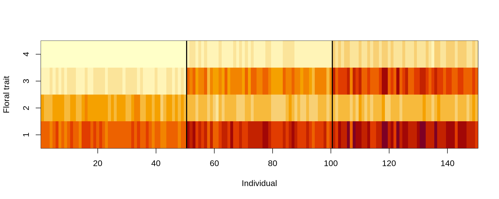
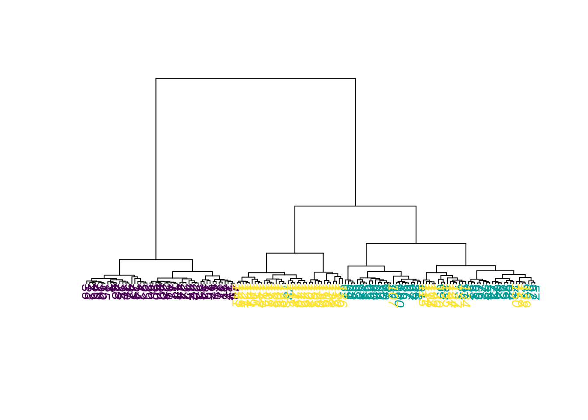
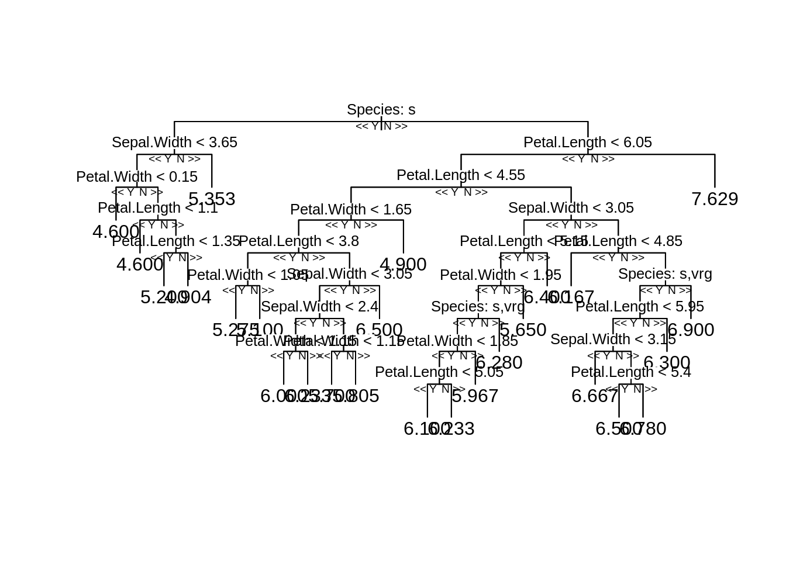
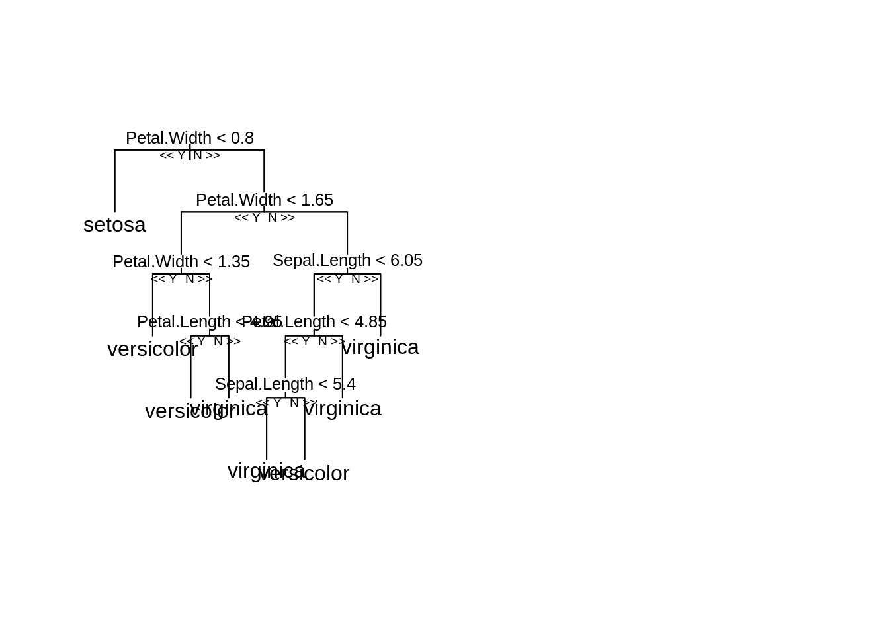
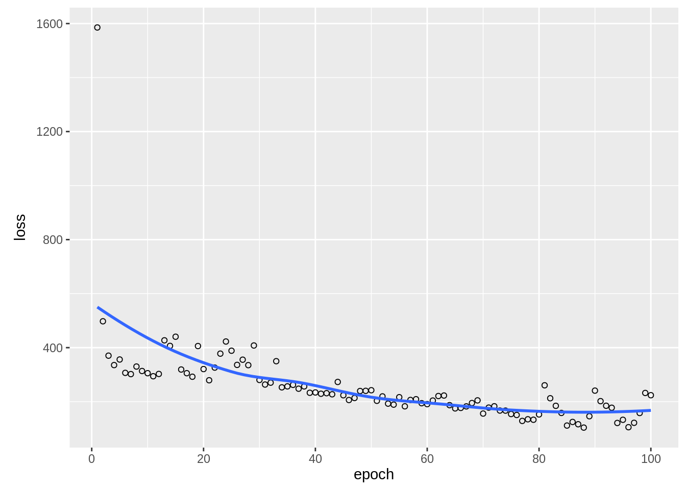

# Introduction to Machine Learning {#introduction}

```{=html}
<!-- Put this here (right after the first markdown headline) and only here for each document! -->
<script src="./scripts/multipleChoice.js"></script>
```


There are three basic machine learning tasks:

* Supervised learning
* Unsupervised learning
* Reinforcement learning

In **supervised learning**, you train algorithms using labeled data, what means that you already know the correct answer for a part of the data (the so called _training data_).

**Unsupervised learning** in contrast is a technique, where one does not need to monitor the model or apply labels. Instead, you allow the model to work on its own to discover information.

**Reinforcement learning** is a technique that emulates a game-like situation. The algorithm finds a solution by trial and error and gets either _rewards_ or _penalties_ for every action. As in games, the goal is to maximize the rewards. We will talk more about this technique on the last day of the course.

For the moment, we will focus on the first two tasks, supervised and unsupervised learning. To do so, we will begin with a small example. But before you start with the code, here is a video to prepare you for what we will do in the class:

<iframe width="560" height="315"
  src="https://www.youtube.com/embed/1AVrWvRvfxs"
  frameborder="0" allow="accelerometer; autoplay; encrypted-media;
  gyroscope; picture-in-picture" allowfullscreen>
  </iframe>


## Unsupervised Learning

In unsupervised learning, we  want to identify patterns in data without having any examples (supervision) about what the correct patterns / classes are. As an example, consider the iris data set. Here, we have 150 observations of 4 floral traits:


```r
iris = datasets::iris
colors = hcl.colors(3)
traits = as.matrix(iris[,1:4]) 
species = iris$Species
image(y = 1:4, x = 1:length(species) , z = traits, 
      ylab = "Floral trait", xlab = "Individual")
segments(50.5, 0, 50.5, 5, col = "black", lwd = 2)
segments(100.5, 0, 100.5, 5, col = "black", lwd = 2)
```

<div class="figure" style="text-align: center">

<p class="caption">(\#fig:chunk-chapter3-1-iris-plot)Trait distributions of iris dataset</p>
</div>

The observations are from 3 species and indeed those species tend to have different traits, meaning that the observations form 3 clusters. 


```r
pairs(traits, pch = as.integer(species), col = colors[as.integer(species)])
```

<div class="figure" style="text-align: center">

<p class="caption">(\#fig:chunk-chapter3-2)Scatterplots for trait-trait combinations.</p>
</div>

However, imagine we don't know what species are, what is basically the situation in which people in the antique have been. The people just noted that some plants have different flowers than others, and decided to give them different names. This kind of process is what unsupervised learning does.


### Hierarchical Clustering

A cluster refers to a collection of data points aggregated together because of certain similarities.

In hierarchical clustering, a hierarchy (tree) between data points is built.

* Agglomerative: Start with each data point in their own cluster, merge them up hierarchically.
* Divisive: Start with all data points in one cluster, and split hierarchically.

Merges / splits are done according to linkage criterion, which measures distance between (potential) clusters. Cut the tree at a certain height to get clusters. 

Here an example


```r
set.seed(123)

#Reminder: traits = as.matrix(iris[,1:4]).

d = dist(traits)
hc = hclust(d, method = "complete")

plot(hc, main="")
rect.hclust(hc, k = 3)  # Draw rectangles around the branches.
```

<div class="figure" style="text-align: center">

<p class="caption">(\#fig:chunk-chapter3-3)Results of hierarchical clustering. Red rectangle is drawn around the corresponding clusters.</p>
</div>

Same plot, but with colors for true species identity


```r
library(ape)

plot(as.phylo(hc), 
     tip.color = colors[as.integer(species)], 
     direction = "downwards")
```

<div class="figure" style="text-align: center">

<p class="caption">(\#fig:chunk-chapter3-4)Results of hierarchical clustering. Colors correspond to the three species classes.</p>
</div>

```r

hcRes3 = cutree(hc, k = 3)   #Cut a dendrogram tree into groups.
```

Calculate confusion matrix. Note we are switching labels here so that it fits to the species.


```r
tmp = hcRes3
tmp[hcRes3 == 2] = 3
tmp[hcRes3 == 3] = 2
hcRes3 = tmp
table(hcRes3, species)
```


Table: (\#tab:chunk-chapter3-5-kable)Confusion matrix for predicted and observed species classes.

| setosa| versicolor| virginica|
|------:|----------:|---------:|
|     50|          0|         0|
|      0|         27|         1|
|      0|         23|        49|


Note that results might change if you choose a different agglomeration method, distance metric or scale of your variables. Compare, e.g. to this example:


```r
hc = hclust(d, method = "ward.D2")

plot(as.phylo(hc), 
     tip.color = colors[as.integer(species)], 
     direction = "downwards")
```

<div class="figure" style="text-align: center">

<p class="caption">(\#fig:chunk-chapter3-6-a)Results of hierarchical clustering. Colors correspond to the three species classes. Different agglomeration method</p>
</div>


```r
hcRes3 = cutree(hc, k = 3)   #Cut a dendrogram tree into groups.
table(hcRes3, species)
```


Table: (\#tab:chunk-chapter3-6-kable)Confusion matrix for predicted and observed species classes.

| setosa| versicolor| virginica|
|------:|----------:|---------:|
|     50|          0|         0|
|      0|         49|        15|
|      0|          1|        35|


Which method is best? 


```r
library(dendextend)
```


```r
set.seed(123)

methods = c("ward.D", "single", "complete", "average",
             "mcquitty", "median", "centroid", "ward.D2")
out = dendlist()   # Create a dendlist object from several dendrograms.
for(method in methods){
  res = hclust(d, method = method)   
  out = dendlist(out, as.dendrogram(res))
}
names(out) = methods
print(out)
#> $ward.D
#> 'dendrogram' with 2 branches and 150 members total, at height 199.6205 
#> 
#> $single
#> 'dendrogram' with 2 branches and 150 members total, at height 1.640122 
#> 
#> $complete
#> 'dendrogram' with 2 branches and 150 members total, at height 7.085196 
#> 
#> $average
#> 'dendrogram' with 2 branches and 150 members total, at height 4.062683 
#> 
#> $mcquitty
#> 'dendrogram' with 2 branches and 150 members total, at height 4.497283 
#> 
#> $median
#> 'dendrogram' with 2 branches and 150 members total, at height 2.82744 
#> 
#> $centroid
#> 'dendrogram' with 2 branches and 150 members total, at height 2.994307 
#> 
#> $ward.D2
#> 'dendrogram' with 2 branches and 150 members total, at height 32.44761 
#> 
#> attr(,"class")
#> [1] "dendlist"

get_ordered_3_clusters = function(dend){
  # order.dendrogram function returns the order (index)
  # or the "label" attribute for the leaves.
  # cutree: Cut the tree (dendrogram) into groups of data.
  cutree(dend, k = 3)[order.dendrogram(dend)]
}
dend_3_clusters = lapply(out, get_ordered_3_clusters)

# Calculate Fowlkes-Mallows Index (determine the similarity between clusterings)
compare_clusters_to_iris = function(clus){
  FM_index(clus, rep(1:3, each = 50), assume_sorted_vectors = TRUE)
}

clusters_performance = sapply(dend_3_clusters, compare_clusters_to_iris)
dotchart(sort(clusters_performance), xlim = c(0.3, 1),
         xlab = "Fowlkes-Mallows index",
         main = "Performance of linkage methods
         in detecting the 3 species \n in our example",
         pch = 19)
```


We might conclude that ward.D2 works best here. However, as we will learn later, optimizing the method without a hold-out for testing implies that our model may be overfitting. We should check this using cross-validation. 


### K-means Clustering

Another example for an unsupervised learning algorithm is k-means clustering, one of the simplest and most popular unsupervised machine learning algorithms.

To start with the algorithm, you first have to specify the number of clusters (for our example the number of species). Each cluster has a centroid, which is the assumed or real location representing the center of the cluster (for our example this would be how an average plant of a specific species would look like). The algorithm starts by randomly putting centroids somewhere. Afterwards each data point is assigned to the respective cluster that raises the overall in-cluster sum of squares (variance) related to the distance to the centroid least of all. After the algorithm has placed all data points into a cluster the centroids get updated. By iterating this procedure until the assignment doesn't change any longer, the algorithm can find the (locally) optimal centroids and the data points belonging to this cluster.
Note that results might differ according to the initial positions of the centroids. Thus several (locally) optimal solutions might be found.

The "k" in K-means refers to the number of clusters and the ‘means’ refers to averaging the data-points to find the centroids.

A typical pipeline for using k-means clustering looks the same as for other algorithms. After having visualized the data, we fit a model, visualize the results and have a look at the performance by use of the confusion matrix. By setting a fixed seed, we can ensure that results are reproducible.


```r
set.seed(123)

#Reminder: traits = as.matrix(iris[,1:4]).

kc = kmeans(traits, 3)
print(kc)
#> K-means clustering with 3 clusters of sizes 50, 62, 38
#> 
#> Cluster means:
#>   Sepal.Length Sepal.Width Petal.Length Petal.Width
#> 1     5.006000    3.428000     1.462000    0.246000
#> 2     5.901613    2.748387     4.393548    1.433871
#> 3     6.850000    3.073684     5.742105    2.071053
#> 
#> Clustering vector:
#>   [1] 1 1 1 1 1 1 1 1 1 1 1 1 1 1 1 1 1 1 1 1 1 1 1 1 1 1 1
#>  [28] 1 1 1 1 1 1 1 1 1 1 1 1 1 1 1 1 1 1 1 1 1 1 1 2 2 3 2
#>  [55] 2 2 2 2 2 2 2 2 2 2 2 2 2 2 2 2 2 2 2 2 2 2 2 3 2 2 2
#>  [82] 2 2 2 2 2 2 2 2 2 2 2 2 2 2 2 2 2 2 2 3 2 3 3 3 3 2 3
#> [109] 3 3 3 3 3 2 2 3 3 3 3 2 3 2 3 2 3 3 2 2 3 3 3 3 3 2 3
#> [136] 3 3 3 2 3 3 3 2 3 3 3 2 3 3 2
#> 
#> Within cluster sum of squares by cluster:
#> [1] 15.15100 39.82097 23.87947
#>  (between_SS / total_SS =  88.4 %)
#> 
#> Available components:
#> 
#> [1] "cluster"      "centers"      "totss"       
#> [4] "withinss"     "tot.withinss" "betweenss"   
#> [7] "size"         "iter"         "ifault"
```

_Visualizing the results._
Color codes true species identity, symbol shows cluster result.


```r
plot(iris[c("Sepal.Length", "Sepal.Width")],
     col =  colors[as.integer(species)], pch = kc$cluster)
points(kc$centers[, c("Sepal.Length", "Sepal.Width")],
       col = colors, pch = 1:3, cex = 3)
```


We see that there are are some discrepancies. Confusion matrix:


```r
table(iris$Species, kc$cluster)
#>             
#>               1  2  3
#>   setosa     50  0  0
#>   versicolor  0 48  2
#>   virginica   0 14 36
```

If you want to animate the clustering process, you could run


```r
library(animation)

saveGIF(kmeans.ani(x = traits[,1:2], col = colors),
        interval = 1, ani.width = 800, ani.height = 800)
```

**Elbow technique** to determine the probably best suited number of clusters:


```r
set.seed(123)

getSumSq = function(k){ kmeans(traits, k, nstart = 25)$tot.withinss }

#Perform algorithm for different cluster sizes and retrieve variance.
iris.kmeans1to10 = sapply(1:10, getSumSq)
plot(1:10, iris.kmeans1to10, type = "b", pch = 19, frame = FALSE, 
     xlab = "Number of clusters K",
     ylab = "Total within-clusters sum of squares",
     col = c("black", "red", rep("black", 8)))
```


Often, one is interested in sparse models. Furthermore, higher k than necessary tends to overfitting. At the kink in the picture, the sum of squares dropped enough and k is still low enough.
But keep in mind, this is only a rule of thumb and might be wrong in some special cases.


### Density-based Clustering

Determine the affinity of a data point according to the affinity of its k nearest neighbors.
This is a very general description as there are many ways to do so.


```r
#Reminder: traits = as.matrix(iris[,1:4]).

library(dbscan)
set.seed(123)

kNNdistplot(traits, k = 4)   # Calculate and plot k-nearest-neighbor distances.
abline(h = 0.4, lty = 2)
```


```r

dc = dbscan(traits, eps = 0.4, minPts = 6)
print(dc)
#> DBSCAN clustering for 150 objects.
#> Parameters: eps = 0.4, minPts = 6
#> The clustering contains 4 cluster(s) and 32 noise points.
#> 
#>  0  1  2  3  4 
#> 32 46 36 14 22 
#> 
#> Available fields: cluster, eps, minPts
```


```r
library(factoextra)
```


```r
fviz_cluster(dc, traits, geom = "point", ggtheme = theme_light())
```


### Model-based Clustering

The last class of methods for unsupervised clustering are so-called _model-based clustering methods_. 


```r
library(mclust)
```


```r
mb = Mclust(traits)
```

Mclust automatically compares a number of candidate models (clusters, shape) according to BIC (The BIC is a criterion for classifying algorithms depending their prediction quality and their usage of parameters). We can look at the selected model via:
  

```r
mb$G # Two clusters.
#> [1] 2
mb$modelName # > Ellipsoidal, equal shape.
#> [1] "VEV"
```
  
We see that the algorithm prefers having 2 clusters. For better comparability to the other 2 methods, we will override this by setting:
    

```r
mb3 = Mclust(traits, 3)
```

Result in terms of the predicted densities for 3 clusters


```r
plot(mb3, "density")
```


Predicted clusters:


```r
plot(mb3, what=c("classification"), add = T)
```


Confusion matrix:


```r
table(iris$Species, mb3$classification)
#>             
#>               1  2  3
#>   setosa     50  0  0
#>   versicolor  0 45  5
#>   virginica   0  0 50
```


### Ordination

Ordination is used in explorative analysis and compared to clustering, similar objects are ordered together.
So there is a relationship between clustering and ordination. Here a PCA ordination on on the iris data set.


```r
pcTraits = prcomp(traits, center = TRUE, scale. = TRUE)
biplot(pcTraits, xlim = c(-0.25, 0.25), ylim = c(-0.25, 0.25))
```


You can cluster the results of this ordination, ordinate before clustering, or superimpose one on the other. 

### Exercises

```{=html}
  <hr/>
  <strong><span style="color: #0011AA; font-size:25px;">Tasks</span></strong><br/>
```

Go through the 4(5) algorithms above, and check if they are sensitive (i.e. if results change) if you scale the input features (= predictors), instead of using the raw data. Discuss in your group: Which is more appropriate for this analysis and/or in general: Scaling or not scaling?

```{=html}
  <details>
    <summary>
      <strong><span style="color: #0011AA; font-size:25px;">Solution</span></strong>
    </summary>
    <p>
```

```{=html}
  <strong><span style="font-size:20px;">Hierarchical Clustering</span></strong>
```

```r
library(dendextend)

methods = c("ward.D", "single", "complete", "average",
            "mcquitty", "median", "centroid", "ward.D2")

cluster_all_methods = function(distances){
  out = dendlist()
  for(method in methods){
    res = hclust(distances, method = method)   
    out = dendlist(out, as.dendrogram(res))
  }
  names(out) = methods
  
  return(out)
}

get_ordered_3_clusters = function(dend){
  return(cutree(dend, k = 3)[order.dendrogram(dend)])
}

compare_clusters_to_iris = function(clus){
  return(FM_index(clus, rep(1:3, each = 50), assume_sorted_vectors = TRUE))
}

do_clustering = function(traits, scale = FALSE){
  set.seed(123)
  headline = "Performance of linkage methods\nin detecting the 3 species\n"
  
  if(scale){
    traits = scale(traits)  # Do scaling on copy of traits.
    headline = paste0(headline, "Scaled")
  }else{ headline = paste0(headline, "Not scaled") }
  
  distances = dist(traits)
  out = cluster_all_methods(distances)
  dend_3_clusters = lapply(out, get_ordered_3_clusters)
  clusters_performance = sapply(dend_3_clusters, compare_clusters_to_iris)
  dotchart(sort(clusters_performance), xlim = c(0.3,1),
           xlab = "Fowlkes-Mallows index",
           main = headline,
           pch = 19)
}

traits = as.matrix(iris[,1:4])

# Do clustering on unscaled data.
do_clustering(traits, FALSE)
```


```r

# Do clustering on scaled data.
do_clustering(traits, TRUE)
```


It seems that scaling is harmful for hierarchical clustering. But this might be a deception.
**Be careful:** If you have data on different units or magnitudes, scaling is definitely useful! Otherwise variables with higher values get higher influence.

```{=html}
  <strong><span style="font-size:20px;">K-means Clustering</span></strong>
```

```r
do_clustering = function(traits, scale = FALSE){
  set.seed(123)
  
  if(scale){
    traits = scale(traits)  # Do scaling on copy of traits.
    headline = "K-means Clustering\nScaled\nSum of all tries: "
  }else{ headline = "K-means Clustering\nNot scaled\nSum of all tries: " }
  
  getSumSq = function(k){ kmeans(traits, k, nstart = 25)$tot.withinss }
  iris.kmeans1to10 = sapply(1:10, getSumSq)
  
  headline = paste0(headline, round(sum(iris.kmeans1to10), 2))
  
  plot(1:10, iris.kmeans1to10, type = "b", pch = 19, frame = FALSE,
       main = headline,
       xlab = "Number of clusters K",
       ylab = "Total within-clusters sum of squares",
       col = c("black", "red", rep("black", 8)) )
}

traits = as.matrix(iris[,1:4])

# Do clustering on unscaled data.
do_clustering(traits, FALSE)
```


```r

# Do clustering on scaled data.
do_clustering(traits, TRUE)
```


It seems that scaling is harmful for K-means clustering. But this might be a deception.
<strong>*Be careful:*</strong> If you have data on different units or magnitudes, scaling is definitely useful! Otherwise variables with higher values get higher influence.

```{=html}
  <strong><span style="font-size:20px;">Density-based Clustering</span></strong>
```

```r
library(dbscan)

correct = as.factor(iris[,5])
# Start at 1. Noise points will get 0 later.
levels(correct) = 1:length(levels(correct))
correct
#>   [1] 1 1 1 1 1 1 1 1 1 1 1 1 1 1 1 1 1 1 1 1 1 1 1 1 1 1 1
#>  [28] 1 1 1 1 1 1 1 1 1 1 1 1 1 1 1 1 1 1 1 1 1 1 1 2 2 2 2
#>  [55] 2 2 2 2 2 2 2 2 2 2 2 2 2 2 2 2 2 2 2 2 2 2 2 2 2 2 2
#>  [82] 2 2 2 2 2 2 2 2 2 2 2 2 2 2 2 2 2 2 2 3 3 3 3 3 3 3 3
#> [109] 3 3 3 3 3 3 3 3 3 3 3 3 3 3 3 3 3 3 3 3 3 3 3 3 3 3 3
#> [136] 3 3 3 3 3 3 3 3 3 3 3 3 3 3 3
#> Levels: 1 2 3

do_clustering = function(traits, scale = FALSE){
  set.seed(123)
  
  if(scale){ traits = scale(traits) } # Do scaling on copy of traits.
  
  #####
  # Play around with the parameters "eps" and "minPts" on your own!
  #####
  dc = dbscan(traits, eps = 0.41, minPts = 4)
  
  labels = as.factor(dc$cluster)
  noise = sum(dc$cluster == 0)
  levels(labels) = c("noise", 1:( length(levels(labels)) - 1))
  
  tbl = table(correct, labels)
  correct_classified = 0
  for(i in 1:length(levels(correct))){
    correct_classified = correct_classified + tbl[i, i + 1]
  }
  
  cat( if(scale){ "Scaled" }else{ "Not scaled" }, "\n\n" )
  cat("Confusion matrix:\n")
  print(tbl)
  cat("\nCorrect classified points: ", correct_classified, " / ", length(iris[,5]))
  cat("\nSum of noise points: ", noise, "\n")
}

traits = as.matrix(iris[,1:4])

# Do clustering on unscaled data.
do_clustering(traits, FALSE)
#> Not scaled 
#> 
#> Confusion matrix:
#>        labels
#> correct noise  1  2  3  4
#>       1     3 47  0  0  0
#>       2     5  0 38  3  4
#>       3    17  0  0 33  0
#> 
#> Correct classified points:  118  /  150
#> Sum of noise points:  25

# Do clustering on scaled data.
do_clustering(traits, TRUE)
#> Scaled 
#> 
#> Confusion matrix:
#>        labels
#> correct noise  1  2  3  4
#>       1     9 41  0  0  0
#>       2    14  0 36  0  0
#>       3    36  0  1  4  9
#> 
#> Correct classified points:  81  /  150
#> Sum of noise points:  59
```

It seems that scaling is harmful for density based clustering. But this might be a deception.
<strong>*Be careful:*</strong> If you have data on different units or magnitudes, scaling is definitely useful! Otherwise variables with higher values get higher influence.

```{=html}
  <strong><span style="font-size:20px;">Model-based Clustering</span></strong>
```

```r
library(mclust)

do_clustering = function(traits, scale = FALSE){
  set.seed(123)
  
  if(scale){ traits = scale(traits) } # Do scaling on copy of traits.
  
  mb3 = Mclust(traits, 3)
  
  tbl = table(iris$Species, mb3$classification)
  
  cat( if(scale){ "Scaled" }else{ "Not scaled" }, "\n\n" )
  cat("Confusion matrix:\n")
  print(tbl)
  cat("\nCorrect classified points: ", sum(diag(tbl)), " / ", length(iris[,5]))
}

traits = as.matrix(iris[,1:4])

# Do clustering on unscaled data.
do_clustering(traits, FALSE)
#> Not scaled 
#> 
#> Confusion matrix:
#>             
#>               1  2  3
#>   setosa     50  0  0
#>   versicolor  0 45  5
#>   virginica   0  0 50
#> 
#> Correct classified points:  145  /  150

# Do clustering on scaled data.
do_clustering(traits, TRUE)
#> Scaled 
#> 
#> Confusion matrix:
#>             
#>               1  2  3
#>   setosa     50  0  0
#>   versicolor  0 45  5
#>   virginica   0  0 50
#> 
#> Correct classified points:  145  /  150
```

For model based clustering, scaling does not matter.

```{=html}
  <strong><span style="font-size:20px;">Ordination</span></strong>
```

```r
traits = as.matrix(iris[,1:4])

biplot(prcomp(traits, center = TRUE, scale. = TRUE),
       main = "Use integrated scaling")
```


```r

biplot(prcomp(scale(traits), center = FALSE, scale. = FALSE),
       main = "Scale explicitly")
```


```r

biplot(prcomp(traits, center = FALSE, scale. = FALSE),
       main = "No scaling at all")
```


For PCA ordination, scaling matters.
Because we are interested in directions of maximal variance, all parameters should be scaled, or the one with the highest values might dominate all others.

```{=html}
    </p>
  </details>
  <br/><hr/>
```


## Supervised Learning: Regression and Classification

The two most prominent branches of supervised learning are regression and classification. Fundamentally, classification is about predicting a label and regression is about predicting a quantity. The following video explains that in more depth:
  
<iframe width="560" height="315"
  src="https://www.youtube.com/embed/i04Pfrb71vk"
  frameborder="0" allow="accelerometer; autoplay; encrypted-media;
  gyroscope; picture-in-picture" allowfullscreen>
  </iframe>


### Supervised Regression Using Random Forest

The random forest (RF) algorithm is possibly the most widely used machine learning algorithm and can be used for regression and classification. We will talk more about the algorithm tomorrow. 

For the moment, we want to go through a typical workflow for a supervised regression: First, we visualize the data. Next, we fit the model and lastly we visualize the results. We will again use the iris data set that we used before. The goal is now to predict Sepal.Length based on the information about the other variables (including species). 

Fitting the model:


```r
library(randomForest)
set.seed(123)
```


```r
m1 = randomForest(Sepal.Length ~ ., data = iris)   # ~.: Against all others.
# str(m1)
# m1$type
# predict(m1)
print(m1)
#> 
#> Call:
#>  randomForest(formula = Sepal.Length ~ ., data = iris) 
#>                Type of random forest: regression
#>                      Number of trees: 500
#> No. of variables tried at each split: 1
#> 
#>           Mean of squared residuals: 0.1364625
#>                     % Var explained: 79.97
```

Visualization of the results:


```r
oldpar = par(mfrow = c(1, 2))
plot(predict(m1), iris$Sepal.Length, xlab = "Predicted", ylab = "Observed")
abline(0, 1)
varImpPlot(m1)
```


```r
par(oldpar)
```

To understand the structure of a random forest in more detail, we can use a package from GitHub.


```r
reprtree:::plot.getTree(m1, iris)
```



Here, one of the regression trees is shown.


### Supervised Classification Using Random Forest

With the random forest, we can also do classification. The steps are the same as for regression tasks, but we can additionally see how well it performed by looking at the confusion matrix. Each row of this matrix contains the instances in a predicted class and each column represents the instances in the actual class. Thus the diagonals are the correctly predicted classes and the off-diagonal elements are the falsely classified elements.

Fitting the model:


```r
set.seed(123)

m1 = randomForest(Species ~ ., data = iris)
```

Visualizing one of the fitted models:
  

```r
oldpar = par(mfrow = c(1, 2))
reprtree:::plot.getTree(m1, iris)
```



Visualizing results ecologically:


```r
par(mfrow = c(1, 2))
plot(iris$Petal.Width, iris$Petal.Length, col = iris$Species, main = "Observed")
plot(iris$Petal.Width, iris$Petal.Length, col = predict(m1), main = "Predicted")
```


```r
par(oldpar)   #Reset par.
```

Confusion matrix:


```r
table(predict(m1), iris$Species)
#>             
#>              setosa versicolor virginica
#>   setosa         50          0         0
#>   versicolor      0         47         4
#>   virginica       0          3        46
```

```{=html}
  <hr/>
  <details>
    <summary>
      <strong><span style="color: #0011AA; font-size:25px;">Questions</span></strong>
    </summary>
    <p>
      <script>
        makeMultipleChoiceForm(
         'Using a random forest on the iris dataset, which parameter would be more important (remember there is a function to check this) to predict Petal.Width?',
          'radio',
          [
            {
              'answer':'Species.',
              'correct':true,
              'explanationIfSelected':'',
              'explanationIfNotSelected':'',
              'explanationGeneral':''
            },
            {
              'answer':'Sepal.Width.',
              'correct':false,
              'explanationIfSelected':'',
              'explanationIfNotSelected':'',
              'explanationGeneral':''
            },
          ],
          ''
        );
      </script>
    </p>
  </details>
  <hr/>
```


## Small Introduction Into the Underlying Mathematical Concepts of all Following Lessons - Optional {#basicMath}

If are not yet familiar with the underlying concepts of neural networks and want to know more about that, it is suggested to read / view the following videos / sites. Consider the Links and videos with descriptions in parentheses as optional bonus.

_**This might be useful to understand the further concepts in more depth.**_

* (<a href="https://en.wikipedia.org/wiki/Newton%27s_method#Description" target="_blank" rel="noopener">https://en.wikipedia.org/wiki/Newton%27s_method#Description</a> (Especially the animated graphic is interesting).)

* <a href="https://en.wikipedia.org/wiki/Gradient_descent#Description" target="_blank" rel="noopener">https://en.wikipedia.org/wiki/Gradient_descent#Description</a>

* <a href="https://mlfromscratch.com/neural-networks-explained/#/" target="_blank" rel="noopener">Neural networks (Backpropagation, etc.)</a>.

* <a href="https://mlfromscratch.com/activation-functions-explained/#/" target="_blank" rel="noopener">Activation functions in detail</a> (requires the above as prerequisite).

_**Videos about the topic**_:

* **Gradient descent explained**

<iframe width="560" height="315"
  src="https://www.youtube.com/embed/sDv4f4s2SB8"
  frameborder="0" allow="accelerometer; autoplay; clipboard-write;
  encrypted-media; gyroscope; picture-in-picture" allowfullscreen>
  </iframe>

* (Stochastic gradient descent explained)

<iframe width="560" height="315"
  src="https://www.youtube.com/embed/vMh0zPT0tLI"
  frameborder="0" allow="accelerometer; autoplay; clipboard-write;
  encrypted-media; gyroscope; picture-in-picture" allowfullscreen>
  </iframe>

* (Entropy explained)

<iframe width="560" height="315"
  src="https://www.youtube.com/embed/YtebGVx-Fxw"
  frameborder="0" allow="accelerometer; autoplay; clipboard-write;
  encrypted-media; gyroscope; picture-in-picture" allowfullscreen>
  </iframe>

* **Short explanation of entropy, cross entropy and Kullback–Leibler divergence**

<iframe width="560" height="315"
  src="https://www.youtube.com/embed/ErfnhcEV1O8"
  frameborder="0" allow="accelerometer; autoplay; clipboard-write;
  encrypted-media; gyroscope; picture-in-picture" allowfullscreen>
  </iframe>

* **Deep Learning (chapter 1)**

<iframe width="560" height="315"
  src="https://www.youtube.com/embed/aircAruvnKk"
  frameborder="0" allow="accelerometer; autoplay; clipboard-write;
  encrypted-media; gyroscope; picture-in-picture" allowfullscreen>
  </iframe>

* **How neural networks learn - Deep Learning (chapter 2)**

<iframe width="560" height="315"
  src="https://www.youtube.com/embed/IHZwWFHWa-w"
  frameborder="0" allow="accelerometer; autoplay; clipboard-write;
  encrypted-media; gyroscope; picture-in-picture" allowfullscreen>
  </iframe>

* **Backpropagation - Deep Learning (chapter 3)**

<iframe width="560" height="315"
  src="https://www.youtube.com/embed/Ilg3gGewQ5U"
  frameborder="0" allow="accelerometer; autoplay; clipboard-write;
  encrypted-media; gyroscope; picture-in-picture" allowfullscreen>
  </iframe>

* **Another video about backpropagation (extends the previous one) - Deep Learning (chapter 4)**

<iframe width="560" height="315"
  src="https://www.youtube.com/embed/tIeHLnjs5U8"
  frameborder="0" allow="accelerometer; autoplay; clipboard-write;
  encrypted-media; gyroscope; picture-in-picture" allowfullscreen>
  </iframe>

### Caveat About Learning Rates and Activation Functions

Depending on activation functions, it might occur that the network won't get updated, even with high learning rates (called *vanishing gradient*, especially for "sigmoid" functions).
Furthermore, updates might overshoot (called *exploding gradients*) or activation functions will result in many zeros (especially for "relu", *dying relu*).

In general, the first layers of a network tend to learn (much) more slowly than subsequent ones.


## Introduction to TensorFlow

One of the most commonly used frameworks for machine learning is **TensorFlow**. TensorFlow is an open source <a href="https://en.wikipedia.org/wiki/Linear_algebra" target="_blank" rel="noopener">linear algebra</a> library with focus on neural networks, published by Google in 2015. TensorFlow supports several interesting features, in particular automatic differentiation, several gradient optimizers and CPU and GPU parallelization. 

These advantages are nicely explained in the following video: 
  
<iframe width="560" height="315"
  src="https://www.youtube.com/embed/MotG3XI2qSs"
  frameborder="0" allow="accelerometer; autoplay; encrypted-media;
  gyroscope; picture-in-picture" allowfullscreen>
  </iframe>

To sum up the most important points of the video: 
  
* TensorFlow is a math library which is highly optimized for neural networks.
* If a GPU is available, computations can be easily run on the GPU but even on a CPU TensorFlow is still very fast.
* The "backend" (i.e. all the functions and all computations) are written in C++ and CUDA (CUDA is a programming language for NVIDIA GPUs).
* The interface (the part of TensorFlow we use) is written in Python and is also available in R, which means, we can write the code in R/Python but it will be executed by the (compiled) C++ backend.

All operations in TensorFlow are written in C++ and are highly optimized. But don't worry, we don’t have to use C++ to use TensorFlow because there are several bindings for other languages. TensorFlow officially supports a Python API, but meanwhile there are several community carried APIs for other languages:
  
* R
* Go
* Rust
* Swift
* JavaScript

In this course we will use TensorFlow with the <a href="https://tensorflow.rstudio.com/" target="_blank" rel="noopener">https://tensorflow.rstudio.com/</a> binding, that was developed and published 2017 by the RStudio team. First, they developed an R package (reticulate) for calling Python in R. Actually, we are using the Python TensorFlow module in R (more about this later).

TensorFlow offers different levels of API. We could implement a neural network completely by ourselves or we could use Keras which is provided as a submodule by TensorFlow. Keras is a powerful module for building and training neural networks. It allows us building and training neural networks in a few lines of codes. Since the end of 2018, Keras and TensorFlow are completly interoperable, allowing us to utilize the best of both. In this course, we will show how we can use Keras for neural networks but also how we can use the TensorFlow’s automatic differenation for using complex objective functions.


Useful links:

* <a href="https://www.tensorflow.org/api_docs/python/tf" target="_blank" rel="noopener">TensorFlow documentation</a> (This is for the Python API, but just replace the "." with "$".)
* <a href="https://tensorflow.rstudio.com/" target="_blank" rel="noopener">Rstudio TensorFlow website</a>


### TensorFlow Data Containers

TensorFlow has two data containers (structures):
  
* constant (tf$constant): Creates a constant (immutable) value in the computation graph.
* variable (tf$Variable): Creates a mutable value in the computation graph (used as parameter/weight in models).

To get started with TensorFlow, we have to load the library and check if the installation worked. 


```r
library(tensorflow)
library(keras)

# Don't worry about weird messages. TensorFlow supports additional optimizations.
exists("tf")
#> [1] TRUE

immutable = tf$constant(5.0)
#> Loaded Tensorflow version 2.9.1
mutable = tf$constant(5.0)
```

Don't worry about weird messages (they will only appear once at the start of the session).


### Basic Operations

We now can define the variables and do some math with them:


```r
a = tf$constant(5)
b = tf$constant(10)
print(a)
#> tf.Tensor(5.0, shape=(), dtype=float32)
print(b)
#> tf.Tensor(10.0, shape=(), dtype=float32)
c = tf$add(a, b)
print(c)
#> tf.Tensor(15.0, shape=(), dtype=float32)
tf$print(c) # Prints to stderr. For stdout, use k_print_tensor(..., message).
k_print_tensor(c) # Comes out of Keras!
#> tf.Tensor(15.0, shape=(), dtype=float32)
```

Normal R methods such as print() are provided by the R package "tensorflow". 

The TensorFlow library (created by the RStudio team) built R methods for all common operations:


```r
`+.tensorflow.tensor` = function(a, b){ return(tf$add(a,b)) }
# Mind the backticks.
k_print_tensor(a+b)
#> tf.Tensor(15.0, shape=(), dtype=float32)
```

Their operators also automatically transform R numbers into constant tensors when attempting to add a tensor to an R number:


```r
d = c + 5  # 5 is automatically converted to a tensor.
print(d)
#> tf.Tensor(20.0, shape=(), dtype=float32)
```

TensorFlow containers are objects, what means that they are not just simple variables of type numeric (class(5)), but they instead have so called methods. Methods are changing the state of a class (which for most of our purposes here is the values of the object).
For instance, there is a method to transform the tensor object back to an R object:


```r
class(d)
#> [1] "tensorflow.tensor"                               
#> [2] "tensorflow.python.framework.ops.EagerTensor"     
#> [3] "tensorflow.python.framework.ops._EagerTensorBase"
#> [4] "tensorflow.python.framework.ops.Tensor"          
#> [5] "tensorflow.python.types.internal.NativeObject"   
#> [6] "tensorflow.python.types.core.Tensor"             
#> [7] "python.builtin.object"
class(d$numpy())
#> [1] "numeric"
```


### TensorFlow Data Types - Good Practice With R-TensorFlow

R uses dynamic typing, what means you can assign a number, character, function or whatever to a variable and the the type is automatically inferred.
In other languages you have to state the type explicitly, e.g. in C:


```c
int a = 5;
float a = 5.0;
char a = "a";
```

While TensorFlow tries to infer the type dynamically, you must often state it explicitly.
Common important types: 

* float32 (floating point number with 32 bits, "single precision")
* float64 (floating point number with 64 bits, "double precision")
* int8 (integer with 8 bits)

The reason why TensorFlow is so explicit about types is that many GPUs (e.g. the NVIDIA GeForces) can handle only up to 32 bit numbers! (you do not need high precision in graphical modeling)

But let us see in practice what we have to do with these types and how to specifcy them:


```r
r_matrix = matrix(runif(10*10), 10, 10)
m = tf$constant(r_matrix, dtype = "float32") 
b = tf$constant(2.0, dtype = "float64")
c = m / b # Doesn't work! We try to divide float32/float64.
```

So what went wrong here? We tried to divide a float32 by a float64 number, but we can only divide numbers of the same type!


```r
r_matrix = matrix(runif(10*10), 10, 10)
m = tf$constant(r_matrix, dtype = "float64")
b = tf$constant(2.0, dtype = "float64")
c = m / b # Now it works.
```

We can also specify the type of the object by providing an object e.g. tf$float64.


```r
r_matrix = matrix(runif(10*10), 10, 10)
m = tf$constant(r_matrix, dtype = tf$float64)
```

In TensorFlow, arguments often require exact/explicit data types:
TensorFlow often expects integers as arguments. In R however an integer is normally saved as float. 
Thus, we have to use an "L" after an integer to tell the R interpreter that it should be treated as an integer:
  

```r
is.integer(5)
is.integer(5L)
matrix(t(r_matrix), 5, 20, byrow = TRUE)
tf$reshape(r_matrix, shape = c(5, 20))$numpy()
tf$reshape(r_matrix, shape = c(5L, 20L))$numpy()
```

Skipping the "L" is one of the most common errors when using R-TensorFlow!

### Exercises

```{=html}
  <hr/>
  <strong><span style="color: #0011AA; font-size:25px;">Tasks</span></strong><br/>
```

To run TensorFlow from R, note that you can access the different mathematical operations in TensorFlow via tf\$..., e.g. there is a tf\$math\$... for all common math operations or the tf\$linalg\$... for different linear algebra operations.
Tip: type tf\$ and then hit the tab key to list all available options (sometimes you have to do this directly in the console).

An example: How to get the maximum value of a vector?


```r
library(tensorflow)
library(keras)

x = 100:1
y = as.double(100:1)

max(x)  # R solution. Integer!
tf$math$reduce_max(x) # TensorFlow solution. Integer!

max(y)  # Float!
tf$math$reduce_max(y) # Float!
```

Rewrite the following expressions (a to g) in TensorFlow:


```r
x = 100:1
y = as.double(100:1)

# a)
min(x)
#> [1] 1

# b)
mean(x)
#> [1] 50.5

# c) Tip: Use Google!
which.max(x)
#> [1] 1

# d) 
which.min(x)
#> [1] 100

# e) Tip: Use Google! 
order(x)
#>   [1] 100  99  98  97  96  95  94  93  92  91  90  89  88
#>  [14]  87  86  85  84  83  82  81  80  79  78  77  76  75
#>  [27]  74  73  72  71  70  69  68  67  66  65  64  63  62
#>  [40]  61  60  59  58  57  56  55  54  53  52  51  50  49
#>  [53]  48  47  46  45  44  43  42  41  40  39  38  37  36
#>  [66]  35  34  33  32  31  30  29  28  27  26  25  24  23
#>  [79]  22  21  20  19  18  17  16  15  14  13  12  11  10
#>  [92]   9   8   7   6   5   4   3   2   1

# f) Tip: See tf$reshape.
m = matrix(y, 10, 10) # Mind: We use y here! (Float)
m_2 = abs(m %*% t(m))  # m %*% m is the normal matrix multiplication.
m_2_log = log(m_2)
print(m_2_log)
#>           [,1]     [,2]     [,3]     [,4]     [,5]     [,6]
#>  [1,] 10.55841 10.54402 10.52943 10.51461 10.49957 10.48431
#>  [2,] 10.54402 10.52969 10.51515 10.50040 10.48542 10.47022
#>  [3,] 10.52943 10.51515 10.50067 10.48598 10.47107 10.45593
#>  [4,] 10.51461 10.50040 10.48598 10.47135 10.45651 10.44144
#>  [5,] 10.49957 10.48542 10.47107 10.45651 10.44173 10.42674
#>  [6,] 10.48431 10.47022 10.45593 10.44144 10.42674 10.41181
#>  [7,] 10.46880 10.45478 10.44057 10.42614 10.41151 10.39666
#>  [8,] 10.45305 10.43910 10.42496 10.41061 10.39605 10.38127
#>  [9,] 10.43705 10.42317 10.40910 10.39482 10.38034 10.36565
#> [10,] 10.42079 10.40699 10.39299 10.37879 10.36439 10.34977
#>           [,7]     [,8]     [,9]    [,10]
#>  [1,] 10.46880 10.45305 10.43705 10.42079
#>  [2,] 10.45478 10.43910 10.42317 10.40699
#>  [3,] 10.44057 10.42496 10.40910 10.39299
#>  [4,] 10.42614 10.41061 10.39482 10.37879
#>  [5,] 10.41151 10.39605 10.38034 10.36439
#>  [6,] 10.39666 10.38127 10.36565 10.34977
#>  [7,] 10.38158 10.36628 10.35073 10.33495
#>  [8,] 10.36628 10.35105 10.33559 10.31989
#>  [9,] 10.35073 10.33559 10.32022 10.30461
#> [10,] 10.33495 10.31989 10.30461 10.28909

# g) Custom mean function i.e. rewrite the function using TensorFlow. 
mean_R = function(y){
  result = sum(y) / length(y)
  return(result)
}

mean_R(y) == mean(y)	# Test for equality.
#> [1] TRUE
```

```{=html}
  <details>
    <summary>
      <strong><span style="color: #0011AA; font-size:25px;">Solution</span></strong>
    </summary>
    <p>
```


```r
library(tensorflow)
library(keras)

x = 100:1
y = as.double(100:1)

# a)    min(x)
tf$math$reduce_min(x) # Integer!
#> tf.Tensor(1, shape=(), dtype=int32)
tf$math$reduce_min(y) # Float!
#> tf.Tensor(1.0, shape=(), dtype=float32)

# b)    mean(x)
# Check out the difference here:
mean(x)
#> [1] 50.5
mean(y)
#> [1] 50.5
tf$math$reduce_mean(x)  # Integer!
#> tf.Tensor(50, shape=(), dtype=int32)
tf$math$reduce_mean(y)  # Float!
#> tf.Tensor(50.5, shape=(), dtype=float32)

# c)    which.max(x)
tf$argmax(x)
#> tf.Tensor(0, shape=(), dtype=int64)
tf$argmax(y)
#> tf.Tensor(0, shape=(), dtype=int64)

# d)    which.min(x)
tf$argmin(x)
#> tf.Tensor(99, shape=(), dtype=int64)

# e)    order(x)
tf$argsort(x)
#> tf.Tensor(
#> [99 98 97 96 95 94 93 92 91 90 89 88 87 86 85 84 83 82 81 80 79 78 77 76
#>  75 74 73 72 71 70 69 68 67 66 65 64 63 62 61 60 59 58 57 56 55 54 53 52
#>  51 50 49 48 47 46 45 44 43 42 41 40 39 38 37 36 35 34 33 32 31 30 29 28
#>  27 26 25 24 23 22 21 20 19 18 17 16 15 14 13 12 11 10  9  8  7  6  5  4
#>   3  2  1  0], shape=(100), dtype=int32)

# f)
# m = matrix(y, 10, 10)
# m_2 = abs(m %*% m)
# m_2_log = log(m_2)

# Mind: We use y here! TensorFlow just accepts floats in the following lines!
mTF = tf$reshape(y, list(10L, 10L))
m_2TF = tf$math$abs( tf$matmul(mTF, tf$transpose(mTF)) )
m_2_logTF = tf$math$log(m_2TF)
print(m_2_logTF)
#> tf.Tensor(
#> [[11.4217415 11.311237  11.186988  11.045079  10.87965   10.68132
#>   10.433674  10.103771   9.608109   8.582045 ]
#>  [11.311237  11.200746  11.076511  10.934624  10.769221  10.570931
#>   10.323348   9.993557   9.498147   8.473241 ]
#>  [11.186988  11.076511  10.952296  10.810434  10.645067  10.446828
#>   10.199324   9.869672   9.374583   8.351139 ]
#>  [11.045079  10.934624  10.810434  10.668606  10.503284  10.305112
#>   10.057709   9.728241   9.233569   8.212026 ]
#>  [10.87965   10.769221  10.645067  10.503284  10.338025  10.139942
#>    9.892679   9.563459   9.069353   8.0503845]
#>  [10.68132   10.570931  10.446828  10.305112  10.139942   9.941987
#>    9.694924   9.366061   8.872768   7.857481 ]
#>  [10.433674  10.323348  10.199324  10.057709   9.892679   9.694924
#>    9.448175   9.119869   8.62784    7.6182513]
#>  [10.103771   9.993557   9.869672   9.728241   9.563459   9.366061
#>    9.119869   8.79255    8.302762   7.30317  ]
#>  [ 9.608109   9.498147   9.374583   9.233569   9.069353   8.872768
#>    8.62784    8.302762   7.818028   6.8405466]
#>  [ 8.582045   8.473241   8.351139   8.212026   8.0503845  7.857481
#>    7.6182513  7.30317    6.8405466  5.9532433]], shape=(10, 10), dtype=float32)

# g)    # Custom mean function
mean_TF = function(y){
  result = tf$math$reduce_sum(y)
  return( result / length(y) )  # If y is an R object.
}
mean_TF(y) == mean(y)
#> tf.Tensor(True, shape=(), dtype=bool)
```

```{=html}
    </p>
  </details>
  <br/>
```

```{=html}
  <hr/>
  <strong><span style="color: #0011AA; font-size:25px;">Task</span></strong><br/>
```

This exercise compares the speed of R to TensorFlow.
The first exercise is to rewrite the following function in TensorFlow:


```r
do_something_R = function(x = matrix(0.0, 10L, 10L)){
  mean_per_row = apply(x, 1, mean)
  result = x - mean_per_row
  return(result)
}
```

Here, we provide a skeleton for a TensorFlow function:


```r
do_something_TF = function(x = matrix(0.0, 10L, 10L)){
   ...
}
```

We can compare the speed using the Microbenchmark package:


```r
test = matrix(0.0, 100L, 100L)
microbenchmark::microbenchmark(do_something_R(test), do_something_TF(test))
```

Try different matrix sizes for the test matrix and compare the speed.

Tip: Have a look at the the tf.reduce_mean documentation and the "axis" argument.

<br/>

Compare the following with different matrix sizes:

* test = matrix(0.0, 1000L, 500L)
* testTF = tf\$constant(test)

Also try the following:


```r
microbenchmark::microbenchmark(
   tf$matmul(testTF, tf$transpose(testTF)), # TensorFlow style.
   test %*% t(test)  # R style.
)
```

```{=html}
  <details>
    <summary>
      <strong><span style="color: #0011AA; font-size:25px;">Solution</span></strong>
    </summary>
    <p>
```


```r
do_something_TF = function(x = matrix(0.0, 10L, 10L)){
  x = tf$constant(x)  # Remember, this is a local copy!
  mean_per_row = tf$reduce_mean(x, axis = 0L)
  result = x - mean_per_row
  return(result)
}
```


```r
test = matrix(0.0, 100L, 100L)
microbenchmark::microbenchmark(do_something_R(test), do_something_TF(test))
#> Unit: microseconds
#>                   expr      min        lq      mean
#>   do_something_R(test)  488.105  515.1465  578.6744
#>  do_something_TF(test) 2348.819 2455.7905 2654.4844
#>    median       uq       max neval cld
#>   557.570  589.306  2631.497   100  a 
#>  2506.715 2582.320 12534.910   100   b

test = matrix(0.0, 1000L, 500L)
microbenchmark::microbenchmark(do_something_R(test), do_something_TF(test))
#> Unit: milliseconds
#>                   expr      min       lq      mean
#>   do_something_R(test) 8.807962 9.449509 12.806207
#>  do_something_TF(test) 3.737344 4.251434  5.149071
#>     median       uq      max neval cld
#>  12.010741 15.20489 27.11427   100   b
#>   4.695778  5.19169 14.26088   100  a
```

Why is R faster (the first time)?

* a) The R functions we used (apply, mean, "-") are also implemented in C.
* b) The problem is not large enough and TensorFlow has an overhead.

<br/>


```r
test = matrix(0.0, 1000L, 500L)
testTF = tf$constant(test)

microbenchmark::microbenchmark(
  tf$matmul(testTF, tf$transpose(testTF)),  # TensorFlow style.
  test %*% t(test) # R style.
)
#> Unit: milliseconds
#>                                     expr      min        lq
#>  tf$matmul(testTF, tf$transpose(testTF)) 6.438021 16.264679
#>                         test %*% t(test) 7.808996  9.460024
#>      mean   median       uq       max neval cld
#>  17.84026 17.90731 20.25642  33.91409   100   a
#>  17.99433 12.18004 21.16537 230.14897   100   a
```

```{=html}
    </p>
  </details>
  <br/>
```

```{=html}
  <hr/>
  <strong><span style="color: #0011AA; font-size:25px;">Task</span></strong><br/>
```

Google to find out how to write the following tasks in TensorFlow:


```r
A = matrix(c(1, 2, 0, 0, 2, 0, 2, 5, 3), 3, 3)

# i)
solve(A)  # Solve equation AX = B. If just A  is given, invert it.
#>      [,1] [,2]       [,3]
#> [1,]    1  0.0 -0.6666667
#> [2,]   -1  0.5 -0.1666667
#> [3,]    0  0.0  0.3333333

# j)
diag(A) # Diagonal of A, if no matrix is given, construct diagonal matrix.
#> [1] 1 2 3

# k)
diag(diag(A)) # Diagonal matrix with entries diag(A).
#>      [,1] [,2] [,3]
#> [1,]    1    0    0
#> [2,]    0    2    0
#> [3,]    0    0    3

# l)
eigen(A)
#> eigen() decomposition
#> $values
#> [1] 3 2 1
#> 
#> $vectors
#>           [,1] [,2]       [,3]
#> [1,] 0.1400280    0  0.4472136
#> [2,] 0.9801961    1 -0.8944272
#> [3,] 0.1400280    0  0.0000000

# m)
det(A)
#> [1] 6
```

```{=html}
  <details>
    <summary>
      <strong><span style="color: #0011AA; font-size:25px;">Solution</span></strong>
    </summary>
    <p>
```


```r
library(tensorflow)
library(keras)

A = matrix(c(1., 2., 0., 0., 2., 0., 2., 5., 3.), 3, 3)
# Do not use the "L" form here!

# i)    solve(A)
tf$linalg$inv(A)
#> tf.Tensor(
#> [[ 1.          0.         -0.66666667]
#>  [-1.          0.5        -0.16666667]
#>  [ 0.          0.          0.33333333]], shape=(3, 3), dtype=float64)

# j)    diag(A)
tf$linalg$diag_part(A)
#> tf.Tensor([1. 2. 3.], shape=(3), dtype=float64)

# k)    diag(diag(A))
tf$linalg$diag(tf$linalg$diag_part(A))
#> tf.Tensor(
#> [[1. 0. 0.]
#>  [0. 2. 0.]
#>  [0. 0. 3.]], shape=(3, 3), dtype=float64)

# l)    eigen(A)
tf$linalg$eigh(A)
#> [[1]]
#> tf.Tensor([-0.56155281  3.          3.56155281], shape=(3), dtype=float64)
#> 
#> [[2]]
#> tf.Tensor(
#> [[-0.78820544  0.         -0.61541221]
#>  [ 0.61541221  0.         -0.78820544]
#>  [ 0.          1.         -0.        ]], shape=(3, 3), dtype=float64)

# m)    det(A)
tf$linalg$det(A)
#> tf.Tensor(6.0, shape=(), dtype=float64)
```

```{=html}
    </p>
  </details>
  <br/>
```

```{=html}
  <hr/>
  <strong><span style="color: #0011AA; font-size:25px;">Task</span></strong><br/>
```

TensorFlow supports automatic differentiation (analytical and not numerical!). 
Let's have a look at the function $f(x) = 5 x^2 + 3$ with derivative $f'(x) = 10x$.
So for $f'(5)$ we will get $10$.

Let's do this in TensorFlow. Define the function:


```r
f = function(x){ return(5.0 * tf$square(x) + 3.0) }
```

We want to calculate the derivative for $x = 2.0$:


```r
x = tf$constant(2.0)
```

To do automatic differentiation, we have to forward $x$ through the function within the tf\$GradientTape() environment. We have also have to tell TensorFlow which value to "watch":


```r
with(tf$GradientTape() %as% tape,
  {
    tape$watch(x)
    y = f(x)
  }
)
```

To print the gradient:


```r
(tape$gradient(y, x))
#> tf.Tensor(20.0, shape=(), dtype=float32)
```

We can also calculate the second order derivative $f''(x) = 10$:


```r
with(tf$GradientTape() %as% first,
  {
    first$watch(x)
    with(tf$GradientTape() %as% second,
      {
        second$watch(x)
        y = f(x)
        g = first$gradient(y, x)
      }
    )
  }
)

(second$gradient(g, x))
#> tf.Tensor(10.0, shape=(), dtype=float32)
```

What is happening here? Think about and discuss it.


A more advanced example: *Linear regression*

In this case we first simulate data following $\boldsymbol{y} = \boldsymbol{X} \boldsymbol{w} + \boldsymbol{\epsilon}$  ($\boldsymbol{\epsilon}$ follows a normal distribution == error).


```r
set_random_seed(321L, disable_gpu = FALSE)	# Already sets R's random seed.

x = matrix(round(runif(500, -2, 2), 3), 100, 5)
w = round(rnorm(5, 2, 1), 3)
y = x %*% w + round(rnorm(100, 0, 0.25), 4)
```

In R we would do the following to fit a linear regression model:


```r
summary(lm(y~x))
#> 
#> Call:
#> lm(formula = y ~ x)
#> 
#> Residuals:
#>      Min       1Q   Median       3Q      Max 
#> -0.67893 -0.16399  0.00968  0.15058  0.51099 
#> 
#> Coefficients:
#>             Estimate Std. Error t value Pr(>|t|)    
#> (Intercept) 0.004865   0.027447   0.177     0.86    
#> x1          2.191511   0.023243  94.287   <2e-16 ***
#> x2          2.741690   0.025328 108.249   <2e-16 ***
#> x3          1.179181   0.023644  49.872   <2e-16 ***
#> x4          0.591873   0.025154  23.530   <2e-16 ***
#> x5          2.302417   0.022575 101.991   <2e-16 ***
#> ---
#> Signif. codes:  
#> 0 '***' 0.001 '**' 0.01 '*' 0.05 '.' 0.1 ' ' 1
#> 
#> Residual standard error: 0.2645 on 94 degrees of freedom
#> Multiple R-squared:  0.9974,	Adjusted R-squared:  0.9972 
#> F-statistic:  7171 on 5 and 94 DF,  p-value: < 2.2e-16
```

Let's build our own model in TensorFlow.
Here, we use now the variable data container type (remember they are mutable and we need this type for the weights ($\boldsymbol{w}$) of the regression model). We want our model to learn these weights.

The input (predictors, independent variables or features, $\boldsymbol{X}$) and the observed (response, $\boldsymbol{y}$) are constant and will not be learned/optimized.


```r
library(tensorflow)
library(keras)
set_random_seed(321L, disable_gpu = FALSE)	# Already sets R's random seed.

x = matrix(round(runif(500, -2, 2), 3), 100, 5)
w = round(rnorm(5, 2, 1), 3)
y = x %*% w + round(rnorm(100, 0, 0.25), 4)

# Weights we want to learn.
# We know the real weights but in reality we wouldn't know them.
# So use guessed ones.
wTF = tf$Variable(matrix(rnorm(5, 0, 0.01), 5, 1))

xTF = tf$constant(x)
yTF = tf$constant(y)

# We need an optimizer which updates the weights (wTF).
optimizer = tf$keras$optimizers$Adamax(learning_rate = 0.1)

for(i in 1:100){
  with(tf$GradientTape() %as% tape,
    {
      pred = tf$matmul(xTF, wTF)
      loss = tf$sqrt(tf$reduce_mean(tf$square(yTF - pred)))
    }
  )

  if(!i%%10){ k_print_tensor(loss, message = "Loss: ") }  # Every 10 times.
  grads = tape$gradient(loss, wTF)
  optimizer$apply_gradients(purrr::transpose(list(list(grads), list(wTF))))
}

k_print_tensor(wTF, message = "Resulting weights:\n")
#> <tf.Variable 'Variable:0' shape=(5, 1) dtype=float64, numpy=
#> array([[2.19290567],
#>        [2.74534135],
#>        [1.1714656 ],
#>        [0.58811305],
#>        [2.30174942]])>
cat("Original weights: ", w, "\n")
#> Original weights:  2.217 2.719 1.165 0.593 2.303
```

Discuss the code, go through the code line by line and try to understand it.

Additional exercise:

Play around with the simulation, increase/decrease the number of weights, add an intercept (you also need an additional variable in model).

```{=html}
  <details>
    <summary>
      <strong><span style="color: #0011AA; font-size:25px;">Solution</span></strong>
    </summary>
    <p>
```


```r
library(tensorflow)
library(keras)
set_random_seed(321L, disable_gpu = FALSE)	# Already sets R's random seed.

numberOfWeights = 3
numberOfFeatures = 10000

x = matrix(round(runif(numberOfFeatures * numberOfWeights, -2, 2), 3),
           numberOfFeatures, numberOfWeights)
w = round(rnorm(numberOfWeights, 2, 1), 3)
intercept = round(rnorm(1, 3, .5), 3)
y = intercept + x %*% w + round(rnorm(numberOfFeatures, 0, 0.25), 4)

# Guessed weights and intercept.
wTF = tf$Variable(matrix(rnorm(numberOfWeights, 0, 0.01), numberOfWeights, 1))
interceptTF = tf$Variable(matrix(rnorm(1, 0, .5)), 1, 1) # Double, not float32.

xTF = tf$constant(x)
yTF = tf$constant(y)

optimizer = tf$keras$optimizers$Adamax(learning_rate = 0.05)

for(i in 1:100){
  with(tf$GradientTape(persistent = TRUE) %as% tape,
    {
      pred = tf$add(interceptTF, tf$matmul(xTF, wTF))
      loss = tf$sqrt(tf$reduce_mean(tf$square(yTF - pred)))
    }
  )

  if(!i%%10){ k_print_tensor(loss, message = "Loss: ") }  # Every 10 times.
  grads = tape$gradient(loss, wTF)
  optimizer$apply_gradients(purrr::transpose(list(list(grads), list(wTF))))
  grads = tape$gradient(loss, interceptTF)
  optimizer$apply_gradients(purrr::transpose(list(list(grads), list(interceptTF))))
}

k_print_tensor(wTF, message = "Resulting weights:\n")
#> <tf.Variable 'Variable:0' shape=(3, 1) dtype=float64, numpy=
#> array([[2.46391571],
#>        [2.45852885],
#>        [1.00566707]])>
cat("Original weights: ", w, "\n")
#> Original weights:  2.47 2.465 1.003
k_print_tensor(interceptTF, message = "Resulting intercept:\n")
#> <tf.Variable 'Variable:0' shape=(1, 1) dtype=float64, numpy=array([[4.22135068]])>
cat("Original intercept: ", intercept, "\n")
#> Original intercept:  4.09
```

```{=html}
    </p>
  </details>
  <br/><hr/>
```


## Introduction to PyTorch
  
PyTorch is another famous library for deep learning. Like TensorFlow, Torch itself is written in C++ with an API for Python. In 2020, the RStudio team released R-Torch, and while R-TensorFlow calls the Python API in the background, the R-Torch API is built directly on the C++ Torch library! 
  
Useful links:

* <a href="https://pytorch.org/docs/stable/index.html" target="_blank" rel="noopener">PyTorch documentation</a> (This is for the Python API, bust just replace the "." with "$".)
* <a href="https://torch.mlverse.org/" target="_blank" rel="noopener">R-Torch website</a>


To get started with Torch, we have to load the library and check if the installation worked. 


```r
library(torch)
```


### PyTorch Data Containers

Unlike TensorFlow, Torch doesn't have two data containers for mutable and immutable variables. All variables are initialized via the torch_tensor function:


```r
a = torch_tensor(1.)
```

To mark variables as mutable (and to track their operations for automatic differentiation) we have to set the argument 'requires_grad' to true in the torch_tensor function:


```r
mutable = torch_tensor(5, requires_grad = TRUE) # tf$Variable(...)
immutable = torch_tensor(5, requires_grad = FALSE) # tf$constant(...)
```


### Basic Operations

We now can define the variables and do some math with them:


```r
a = torch_tensor(5.)
b = torch_tensor(10.)
print(a)
#> torch_tensor
#>  5
#> [ CPUFloatType{1} ]
print(b)
#> torch_tensor
#>  10
#> [ CPUFloatType{1} ]
c = a$add(b)
print(c)
#> torch_tensor
#>  15
#> [ CPUFloatType{1} ]
```

The R-Torch package provides all common R methods (an advantage over TensorFlow).


```r
a = torch_tensor(5.)
b = torch_tensor(10.)
print(a+b)
#> torch_tensor
#>  15
#> [ CPUFloatType{1} ]
print(a/b)
#> torch_tensor
#>  0.5000
#> [ CPUFloatType{1} ]
print(a*b)
#> torch_tensor
#>  50
#> [ CPUFloatType{1} ]
```

Their operators also automatically transform R numbers into tensors when attempting to add a tensor to a R number:


```r
d = a + 5  # 5 is automatically converted to a tensor.
print(d)
#> torch_tensor
#>  10
#> [ CPUFloatType{1} ]
```

As for TensorFlow, we have to explicitly transform the tensors back to R:


```r
class(d)
#> [1] "torch_tensor" "R7"
class(as.numeric(d))
#> [1] "numeric"
```


### Torch Data Types - Good Practice With R-Torch

Similar to TensorFlow:


```r
r_matrix = matrix(runif(10*10), 10, 10)
m = torch_tensor(r_matrix, dtype = torch_float32()) 
b = torch_tensor(2.0, dtype = torch_float64())
c = m / b 
```

But here's a difference! With TensorFlow we would get an error, but with R-Torch, m is automatically casted to a double (float64). However, this is still bad practice!
  
During the course we will try to provide the corresponding PyTorch code snippets for all Keras/TensorFlow examples.

### Exercises

```{=html}
  <hr/>
  <strong><span style="color: #0011AA; font-size:25px;">Tasks</span></strong><br/>
```

Rewrite the following expressions (a to g) in torch:


```r
x = 100:1
y = as.double(100:1)

# a)
min(x)
#> [1] 1

# b)
mean(x)
#> [1] 50.5

# c) Tip: Use Google!
which.max(x)
#> [1] 1

# d) 
which.min(x)
#> [1] 100

# e) Tip: Use Google! 
order(x)
#>   [1] 100  99  98  97  96  95  94  93  92  91  90  89  88
#>  [14]  87  86  85  84  83  82  81  80  79  78  77  76  75
#>  [27]  74  73  72  71  70  69  68  67  66  65  64  63  62
#>  [40]  61  60  59  58  57  56  55  54  53  52  51  50  49
#>  [53]  48  47  46  45  44  43  42  41  40  39  38  37  36
#>  [66]  35  34  33  32  31  30  29  28  27  26  25  24  23
#>  [79]  22  21  20  19  18  17  16  15  14  13  12  11  10
#>  [92]   9   8   7   6   5   4   3   2   1

# f) Tip: See tf$reshape.
m = matrix(y, 10, 10) # Mind: We use y here! (Float)
m_2 = abs(m %*% t(m))  # m %*% m is the normal matrix multiplication.
m_2_log = log(m_2)
print(m_2_log)
#>           [,1]     [,2]     [,3]     [,4]     [,5]     [,6]
#>  [1,] 10.55841 10.54402 10.52943 10.51461 10.49957 10.48431
#>  [2,] 10.54402 10.52969 10.51515 10.50040 10.48542 10.47022
#>  [3,] 10.52943 10.51515 10.50067 10.48598 10.47107 10.45593
#>  [4,] 10.51461 10.50040 10.48598 10.47135 10.45651 10.44144
#>  [5,] 10.49957 10.48542 10.47107 10.45651 10.44173 10.42674
#>  [6,] 10.48431 10.47022 10.45593 10.44144 10.42674 10.41181
#>  [7,] 10.46880 10.45478 10.44057 10.42614 10.41151 10.39666
#>  [8,] 10.45305 10.43910 10.42496 10.41061 10.39605 10.38127
#>  [9,] 10.43705 10.42317 10.40910 10.39482 10.38034 10.36565
#> [10,] 10.42079 10.40699 10.39299 10.37879 10.36439 10.34977
#>           [,7]     [,8]     [,9]    [,10]
#>  [1,] 10.46880 10.45305 10.43705 10.42079
#>  [2,] 10.45478 10.43910 10.42317 10.40699
#>  [3,] 10.44057 10.42496 10.40910 10.39299
#>  [4,] 10.42614 10.41061 10.39482 10.37879
#>  [5,] 10.41151 10.39605 10.38034 10.36439
#>  [6,] 10.39666 10.38127 10.36565 10.34977
#>  [7,] 10.38158 10.36628 10.35073 10.33495
#>  [8,] 10.36628 10.35105 10.33559 10.31989
#>  [9,] 10.35073 10.33559 10.32022 10.30461
#> [10,] 10.33495 10.31989 10.30461 10.28909

# g) Custom mean function i.e. rewrite the function using TensorFlow. 
mean_R = function(y){
  result = sum(y) / length(y)
  return(result)
}

mean_R(y) == mean(y)	# Test for equality.
#> [1] TRUE
```

```{=html}
  <details>
    <summary>
      <strong><span style="color: #0011AA; font-size:25px;">Solution</span></strong>
    </summary>
    <p>
```


```r
library(torch)


x = 100:1
y = as.double(100:1)

# a)    min(x)
torch_min(x) # Integer!
#> torch_tensor
#> 1
#> [ CPULongType{} ]
torch_min(y) # Float!
#> torch_tensor
#> 1
#> [ CPUFloatType{} ]

# b)    mean(x)
# Check out the difference here:
mean(x)
#> [1] 50.5
mean(y)
#> [1] 50.5
torch_mean(torch_tensor(x, dtype = torch_float32()))  # Integer! Why?
#> torch_tensor
#> 50.5
#> [ CPUFloatType{} ]
torch_mean(y)  # Float!
#> torch_tensor
#> 50.5
#> [ CPUFloatType{} ]

# c)    which.max(x)
torch_argmax(x)
#> torch_tensor
#> 1
#> [ CPULongType{} ]
torch_argmax(y)
#> torch_tensor
#> 1
#> [ CPULongType{} ]

# d)    which.min(x)
torch_argmin(x)
#> torch_tensor
#> 100
#> [ CPULongType{} ]

# e)    order(x)
torch_argsort(x)
#> torch_tensor
#>  100
#>   99
#>   98
#>   97
#>   96
#>   95
#>   94
#>   93
#>   92
#>   91
#>   90
#>   89
#>   88
#>   87
#>   86
#>   85
#>   84
#>   83
#>   82
#>   81
#>   80
#>   79
#>   78
#>   77
#>   76
#>   75
#>   74
#>   73
#>   72
#>   71
#> ... [the output was truncated (use n=-1 to disable)]
#> [ CPULongType{100} ]

# f)
# m = matrix(y, 10, 10)
# m_2 = abs(m %*% m)
# m_2_log = log(m_2)

# Mind: We use y here! 
mTorch = torch_reshape(y, c(10, 10))
mTorch2 = torch_abs(torch_matmul(mTorch, torch_t(mTorch))) # hard to read!

# Better:
mTorch2 = mTorch$matmul( mTorch$t() )$abs()
mTorch2_log = mTorch$log()

print(mTorch2_log)
#> torch_tensor
#>  4.6052  4.5951  4.5850  4.5747  4.5643  4.5539  4.5433  4.5326  4.5218  4.5109
#>  4.4998  4.4886  4.4773  4.4659  4.4543  4.4427  4.4308  4.4188  4.4067  4.3944
#>  4.3820  4.3694  4.3567  4.3438  4.3307  4.3175  4.3041  4.2905  4.2767  4.2627
#>  4.2485  4.2341  4.2195  4.2047  4.1897  4.1744  4.1589  4.1431  4.1271  4.1109
#>  4.0943  4.0775  4.0604  4.0431  4.0254  4.0073  3.9890  3.9703  3.9512  3.9318
#>  3.9120  3.8918  3.8712  3.8501  3.8286  3.8067  3.7842  3.7612  3.7377  3.7136
#>  3.6889  3.6636  3.6376  3.6109  3.5835  3.5553  3.5264  3.4965  3.4657  3.4340
#>  3.4012  3.3673  3.3322  3.2958  3.2581  3.2189  3.1781  3.1355  3.0910  3.0445
#>  2.9957  2.9444  2.8904  2.8332  2.7726  2.7081  2.6391  2.5649  2.4849  2.3979
#>  2.3026  2.1972  2.0794  1.9459  1.7918  1.6094  1.3863  1.0986  0.6931  0.0000
#> [ CPUFloatType{10,10} ]

# g)    # Custom mean function
mean_Torch = function(y){
  result = torch_sum(y)
  return( result / length(y) )  # If y is an R object.
}
mean_Torch(y) == mean(y)
#> torch_tensor
#>  1
#> [ CPUBoolType{1} ]
```

```{=html}
    </p>
  </details>
  <br/>
```

```{=html}
  <hr/>
  <strong><span style="color: #0011AA; font-size:25px;">Task</span></strong><br/>
```

This exercise compares the speed of R to torch
The first exercise is to rewrite the following function in torch:


```r
do_something_R = function(x = matrix(0.0, 10L, 10L)){
  mean_per_row = apply(x, 1, mean)
  result = x - mean_per_row
  return(result)
}
```

Here, we provide a skeleton for a TensorFlow function:


```r
do_something_torch= function(x = matrix(0.0, 10L, 10L)){
   ...
}
```

We can compare the speed using the Microbenchmark package:


```r
test = matrix(0.0, 100L, 100L)
microbenchmark::microbenchmark(do_something_R(test), do_something_torch(test))
```

Try different matrix sizes for the test matrix and compare the speed.

Tip: Have a look at the the torch_mean documentation and the "dim" argument.

<br/>

Compare the following with different matrix sizes:

* test = matrix(0.0, 1000L, 500L)
* testTorch = torch_tensor(test)

Also try the following:


```r
microbenchmark::microbenchmark(
   torch_matmul(testTorch, testTorch$t()), # Torch style.
   test %*% t(test)  # R style.
)
```

```{=html}
  <details>
    <summary>
      <strong><span style="color: #0011AA; font-size:25px;">Solution</span></strong>
    </summary>
    <p>
```


```r
do_something_torch = function(x = matrix(0.0, 10L, 10L)){
  x = torch_tensor(x)  # Remember, this is a local copy!
  mean_per_row = torch_mean(x, dim = 1)
  result = x - mean_per_row
  return(result)
}
```


```r
test = matrix(0.0, 100L, 100L)
microbenchmark::microbenchmark(do_something_R(test), do_something_torch(test))
#> Unit: microseconds
#>                      expr     min       lq     mean
#>      do_something_R(test) 469.494 501.0335 533.5923
#>  do_something_torch(test) 288.284 303.1915 380.8973
#>    median       uq      max neval cld
#>  514.6685 526.7010 2597.007   100   b
#>  326.8505 377.0325 3030.417   100  a

test = matrix(0.0, 1000L, 500L)
microbenchmark::microbenchmark(do_something_R(test), do_something_torch(test))
#> Unit: milliseconds
#>                      expr      min       lq      mean
#>      do_something_R(test) 8.441663 8.629451 10.594149
#>  do_something_torch(test) 2.107049 2.322623  2.827194
#>    median       uq      max neval cld
#>  8.746467 12.70234 31.92455   100   b
#>  2.582252  2.84635 10.64425   100  a
```

Why is R faster (the first time)?

* a) The R functions we used (apply, mean, "-") are also implemented in C.
* b) The problem is not large enough and torch has an overhead.

<br/>


```r
test = matrix(0.0, 1000L, 500L)
testTorch = torch_tensor(test)

microbenchmark::microbenchmark(
   torch_matmul(testTorch, testTorch$t()), # Torch style.
   test %*% t(test)  # R style.
)
#> Unit: milliseconds
#>                                    expr      min        lq
#>  torch_matmul(testTorch, testTorch$t()) 3.857475  4.227933
#>                        test %*% t(test) 8.401205 10.052670
#>      mean    median       uq       max neval cld
#>   7.60400  4.609556 11.47081  29.26671   100  a 
#>  19.64731 16.737911 20.81175 264.60567   100   b
```

```{=html}
    </p>
  </details>
  <br/>
```

```{=html}
  <hr/>
  <strong><span style="color: #0011AA; font-size:25px;">Task</span></strong><br/>
```

Google to find out how to write the following tasks in torch:


```r
A = matrix(c(1, 2, 0, 0, 2, 0, 2, 5, 3), 3, 3)

# i)
solve(A)  # Solve equation AX = B. If just A  is given, invert it.
#>      [,1] [,2]       [,3]
#> [1,]    1  0.0 -0.6666667
#> [2,]   -1  0.5 -0.1666667
#> [3,]    0  0.0  0.3333333

# j)
diag(A) # Diagonal of A, if no matrix is given, construct diagonal matrix.
#> [1] 1 2 3

# k)
diag(diag(A)) # Diagonal matrix with entries diag(A).
#>      [,1] [,2] [,3]
#> [1,]    1    0    0
#> [2,]    0    2    0
#> [3,]    0    0    3

# l)
eigen(A)
#> eigen() decomposition
#> $values
#> [1] 3 2 1
#> 
#> $vectors
#>           [,1] [,2]       [,3]
#> [1,] 0.1400280    0  0.4472136
#> [2,] 0.9801961    1 -0.8944272
#> [3,] 0.1400280    0  0.0000000

# m)
det(A)
#> [1] 6
```

```{=html}
  <details>
    <summary>
      <strong><span style="color: #0011AA; font-size:25px;">Solution</span></strong>
    </summary>
    <p>
```


```r
library(torch)

A = matrix(c(1., 2., 0., 0., 2., 0., 2., 5., 3.), 3, 3)
# Do not use the "L" form here!

# i)    solve(A)
linalg_inv(A)
#> torch_tensor
#>  1.0000  0.0000 -0.6667
#> -1.0000  0.5000 -0.1667
#>  0.0000  0.0000  0.3333
#> [ CPUFloatType{3,3} ]

# j)    diag(A)
torch_diag(A)
#> torch_tensor
#>  1
#>  2
#>  3
#> [ CPUFloatType{3} ]

# k)    diag(diag(A))
tf$linalg$diag(tf$linalg$diag_part(A))
#> tf.Tensor(
#> [[1. 0. 0.]
#>  [0. 2. 0.]
#>  [0. 0. 3.]], shape=(3, 3), dtype=float64)
torch_diag(A)$diag()
#> torch_tensor
#>  1  0  0
#>  0  2  0
#>  0  0  3
#> [ CPUFloatType{3,3} ]

# l)    eigen(A)
linalg_eigh(A)
#> [[1]]
#> torch_tensor
#> -0.5616
#>  3.0000
#>  3.5616
#> [ CPUFloatType{3} ]
#> 
#> [[2]]
#> torch_tensor
#> -0.7882  0.0000  0.6154
#>  0.6154  0.0000  0.7882
#>  0.0000  1.0000  0.0000
#> [ CPUFloatType{3,3} ]

# m)    det(A)
linalg_det(A)
#> torch_tensor
#> 6
#> [ CPUFloatType{} ]
```

```{=html}
    </p>
  </details>
  <br/>
```

```{=html}
  <hr/>
  <strong><span style="color: #0011AA; font-size:25px;">Task</span></strong><br/>
```

Torch supports automatic differentiation (analytical and not numerical!). 
Let's have a look at the function $f(x) = 5 x^2 + 3$ with derivative $f'(x) = 10x$.
So for $f'(5)$ we will get $10$.

Let's do this in torch Define the function:


```r
f = function(x){ return(5.0 * torch_pow(x, 2.) + 3.0) }
```

We want to calculate the derivative for $x = 2.0$:


```r
x = torch_tensor(2.0, requires_grad = TRUE)
```

To do automatic differentiation, we have to forward $x$ through the function and call the \$backward() method of the result:


```r
y = f(x)
y$backward(retain_graph=TRUE )
```

To print the gradient:


```r
x$grad
#> torch_tensor
#>  20
#> [ CPUFloatType{1} ]
```

We can also calculate the second order derivative $f''(x) = 10$:


```r
x = torch_tensor(2.0, requires_grad = TRUE)
y = f(x)
grad = torch::autograd_grad(y, x, retain_graph = TRUE, create_graph = TRUE)[[1]] # first
(torch::autograd_grad(grad, x, retain_graph = TRUE, create_graph = TRUE)[[1]]) # second
#> torch_tensor
#>  10
#> [ CPUFloatType{1} ][ grad_fn = <MulBackward0> ]
```

What is happening here? Think about and discuss it.


A more advanced example: *Linear regression*

In this case we first simulate data following $\boldsymbol{y} = \boldsymbol{X} \boldsymbol{w} + \boldsymbol{\epsilon}$  ($\boldsymbol{\epsilon}$ follows a normal distribution == error).


```r
set_random_seed(321L, disable_gpu = FALSE)	# Already sets R's random seed.

x = matrix(round(runif(500, -2, 2), 3), 100, 5)
w = round(rnorm(5, 2, 1), 3)
y = x %*% w + round(rnorm(100, 0, 0.25), 4)
```

In R we would do the following to fit a linear regression model:


```r
summary(lm(y~x))
#> 
#> Call:
#> lm(formula = y ~ x)
#> 
#> Residuals:
#>      Min       1Q   Median       3Q      Max 
#> -0.67893 -0.16399  0.00968  0.15058  0.51099 
#> 
#> Coefficients:
#>             Estimate Std. Error t value Pr(>|t|)    
#> (Intercept) 0.004865   0.027447   0.177     0.86    
#> x1          2.191511   0.023243  94.287   <2e-16 ***
#> x2          2.741690   0.025328 108.249   <2e-16 ***
#> x3          1.179181   0.023644  49.872   <2e-16 ***
#> x4          0.591873   0.025154  23.530   <2e-16 ***
#> x5          2.302417   0.022575 101.991   <2e-16 ***
#> ---
#> Signif. codes:  
#> 0 '***' 0.001 '**' 0.01 '*' 0.05 '.' 0.1 ' ' 1
#> 
#> Residual standard error: 0.2645 on 94 degrees of freedom
#> Multiple R-squared:  0.9974,	Adjusted R-squared:  0.9972 
#> F-statistic:  7171 on 5 and 94 DF,  p-value: < 2.2e-16
```

Let's build our own model in TensorFlow.
Here, we use now the variable data container type (remember they are mutable and we need this type for the weights ($\boldsymbol{w}$) of the regression model). We want our model to learn these weights.

The input (predictors, independent variables or features, $\boldsymbol{X}$) and the observed (response, $\boldsymbol{y}$) are constant and will not be learned/optimized.


```r
library(torch)
torch::torch_manual_seed(42L)

x = matrix(round(runif(500, -2, 2), 3), 100, 5)
w = round(rnorm(5, 2, 1), 3)
y = x %*% w + round(rnorm(100, 0, 0.25), 4)

# Weights we want to learn.
# We know the real weights but in reality we wouldn't know them.
# So use guessed ones.
wTorch = torch_tensor(matrix(rnorm(5, 0, 0.01), 5, 1), requires_grad = TRUE)

xTorch = torch_tensor(x)
yTorch = torch_tensor(y)

# We need an optimizer which updates the weights (wTF).
optimizer = optim_adam(params = list(wTorch), lr = 0.1)

for(i in 1:100){
  pred = xTorch$matmul(wTorch)
  loss = (yTorch - pred)$pow(2.0)$mean()$sqrt()

  if(!i%%10){ print(paste0("Loss: ", as.numeric(loss)))}  # Every 10 times.
  loss$backward()
  optimizer$step() # do optimization step
  optimizer$zero_grad() # reset gradients
}
#> [1] "Loss: 4.4065318107605"
#> [1] "Loss: 2.37925982475281"
#> [1] "Loss: 0.901207089424133"
#> [1] "Loss: 0.403193950653076"
#> [1] "Loss: 0.296265482902527"
#> [1] "Loss: 0.268377900123596"
#> [1] "Loss: 0.232994794845581"
#> [1] "Loss: 0.219554618000984"
#> [1] "Loss: 0.215328559279442"
#> [1] "Loss: 0.213282063603401"
cat("Inferred weights: ", round(as.numeric(wTorch), 3), "\n")
#> Inferred weights:  0.701 3.089 1.801 1.123 3.452
cat("Original weights: ", w, "\n")
#> Original weights:  0.67 3.085 1.787 1.121 3.455
```

Discuss the code, go through the code line by line and try to understand it.

Additional exercise:

Play around with the simulation, increase/decrease the number of weights, add an intercept (you also need an additional variable in model).

```{=html}
  <details>
    <summary>
      <strong><span style="color: #0011AA; font-size:25px;">Solution</span></strong>
    </summary>
    <p>
```


```r
library(torch)
torch::torch_manual_seed(42L)

numberOfWeights = 3
numberOfFeatures = 10000

x = matrix(round(runif(numberOfFeatures * numberOfWeights, -2, 2), 3),
           numberOfFeatures, numberOfWeights)
w = round(rnorm(numberOfWeights, 2, 1), 3)
intercept = round(rnorm(1, 3, .5), 3)
y = intercept + x %*% w + round(rnorm(numberOfFeatures, 0, 0.25), 4)

# Guessed weights and intercept.
wTorch = torch_tensor(matrix(rnorm(numberOfWeights, 0, 0.01), numberOfWeights, 1), requires_grad = TRUE)
interceptTorch = torch_tensor(matrix(rnorm(1, 0, .5), 1, 1), requires_grad = TRUE) # Double, not float32.

xTorch = torch_tensor(x)
yTorch = torch_tensor(y)

# We need an optimizer which updates the weights (wTF).
optimizer = optim_adam(params = list(wTorch, interceptTorch), lr = 0.1)

for(i in 1:100){
  pred = xTorch$matmul(wTorch)$add(interceptTorch)
  loss = (yTorch - pred)$pow(2.0)$mean()$sqrt()

  if(!i%%10){ print(paste0("Loss: ", as.numeric(loss)))}  # Every 10 times.
  loss$backward()
  optimizer$step() # do optimization step
  optimizer$zero_grad() # reset gradients
}
#> [1] "Loss: 3.51533484458923"
#> [1] "Loss: 1.74870145320892"
#> [1] "Loss: 0.414169400930405"
#> [1] "Loss: 0.518697261810303"
#> [1] "Loss: 0.293963462114334"
#> [1] "Loss: 0.263338685035706"
#> [1] "Loss: 0.258341372013092"
#> [1] "Loss: 0.254723280668259"
#> [1] "Loss: 0.252453774213791"
#> [1] "Loss: 0.25116890668869"
cat("Inferred weights: ", round(as.numeric(wTorch), 3), "\n")
#> Inferred weights:  3.118 -0.349 2.107
cat("Original weights: ", w, "\n")
#> Original weights:  3.131 -0.353 2.11

cat("Inferred intercept: ", round(as.numeric(interceptTorch), 3), "\n")
#> Inferred intercept:  2.836
cat("Original intercept: ", intercept, "\n")
#> Original intercept:  2.832
```

```{=html}
    </p>
  </details>
  <br/><hr/>
```


## First Steps With the Keras Framework

We have seen that we can use TensorFlow directly out of R, and we could use this knowledge to implement a neural network in TensorFlow directly in R. However, this can be quite cumbersome. For simple problems, it is usually faster to use a higher-level API that helps us with implementing the machine learning models in TensorFlow. The most common of those is Keras.

Keras is a powerful framework for building and training neural networks with a few lines of codes. Since the end of 2018, Keras and TensorFlow are completely interoperable, allowing us to utilize the best of both. 

The objective of this lesson is to familiarize yourself with Keras. If you have installed TensorFlow, Keras can be found within TensorFlow: tf.keras. However, the RStudio team has built an R package on top of tf.keras, and it is more convenient to use this. To load the Keras package, type


```r
library(keras)
```


### Example Workflow in Keras and Torch

To show how Keras works, we will now build a small classifier to predict the three species of the iris data set. Load the necessary packages and data sets:


```r
library(keras)
library(tensorflow)
library(torch)
set_random_seed(321L, disable_gpu = FALSE)	# Already sets R's random seed.
#> Loaded Tensorflow version 2.9.1

data(iris)
head(iris)
#>   Sepal.Length Sepal.Width Petal.Length Petal.Width Species
#> 1          5.1         3.5          1.4         0.2  setosa
#> 2          4.9         3.0          1.4         0.2  setosa
#> 3          4.7         3.2          1.3         0.2  setosa
#> 4          4.6         3.1          1.5         0.2  setosa
#> 5          5.0         3.6          1.4         0.2  setosa
#> 6          5.4         3.9          1.7         0.4  setosa
```

For neural networks, it is beneficial to scale the predictors (scaling = centering and standardization, see ?scale).
We also split our data into predictors (X) and response (Y = the three species).


```r
X = scale(iris[,1:4])
Y = iris[,5]
```

Additionally, Keras/TensorFlow cannot handle factors and we have to create contrasts (one-hot encoding).
To do so, we have to specify the number of categories. This can be tricky for a beginner, because in other programming languages like Python and C++, arrays start at zero. Thus, when we would specify 3 as number of classes for our three species, we would have the classes 0,1,2,3. Keep this in mind.


```r
Y = to_categorical(as.integer(Y) - 1L, 3)
head(Y) # 3 columns, one for each level of the response.
#>      [,1] [,2] [,3]
#> [1,]    1    0    0
#> [2,]    1    0    0
#> [3,]    1    0    0
#> [4,]    1    0    0
#> [5,]    1    0    0
#> [6,]    1    0    0
```

After having prepared the data, we will now see a typical workflow to specify a model in Keras/Torch. 

**1. Initialize a sequential model in Keras:**


```r
model = keras_model_sequential()
```

A sequential Keras model is a higher order type of model within Keras and consists of one input and one output model. 

**2. Add hidden layers to the model (we will learn more about hidden layers during the next days).**

When specifying the hidden layers, we also have to specify the shape and a so called _activation function_. 
You can think of the activation function as decision for what is forwarded to the next neuron (but we will learn more about it later).
If you want to know this topic in even more depth, consider watching the videos presented in section \@ref(basicMath).

The shape of the input is the number of predictors (here 4) and the shape of the output is the number of classes (here 3).

::::: {.panelset}

::: {.panel}
[Keras]{.panel-name}


```r
model %>%
  layer_dense(units = 20L, activation = "relu", input_shape = list(4L)) %>%
  layer_dense(units = 20L) %>%
  layer_dense(units = 20L) %>%
  layer_dense(units = 3L, activation = "softmax") 
```

:::

::: {.panel}
[torch]{.panel-name}
  
The Torch syntax is very similar, we will give a list of layers to the "nn_sequential" function. Here, we have to specify the softmax activation function as an extra layer:
    

```r
model_torch = 
  nn_sequential(
    nn_linear(4L, 20L),
    nn_linear(20L, 20L),
    nn_linear(20L, 20L),
    nn_linear(20L, 3L),
    nn_softmax(2)
  )
```

:::

:::::

* softmax scales a potential multidimensional vector to the interval $(0, 1]$ for each component. The sum of all components equals 1. This might be very useful for example for handling probabilities. **Ensure ther the labels start at 0! Otherwise the softmax function does not work well!**


**3. Compile the model with a loss function (here: cross entropy) and an optimizer (here: Adamax).**
    
We will learn about other options later, so for now, do not worry about the "**learning_rate**" ("**lr**" in Torch or earlier in TensorFlow) argument, cross entropy or the optimizer.

::::: {.panelset}

::: {.panel}
[Keras]{.panel-name}


```r
model %>%
  compile(loss = loss_categorical_crossentropy,
          keras::optimizer_adamax(learning_rate = 0.001))
summary(model)
#> Model: "sequential"
#> ____________________________________________________________
#>  Layer (type)              Output Shape            Param #  
#> ============================================================
#>  dense_3 (Dense)           (None, 20)              100      
#>  dense_2 (Dense)           (None, 20)              420      
#>  dense_1 (Dense)           (None, 20)              420      
#>  dense (Dense)             (None, 3)               63       
#> ============================================================
#> Total params: 1,003
#> Trainable params: 1,003
#> Non-trainable params: 0
#> ____________________________________________________________
```


:::

::: {.panel}
[torch]{.panel-name}
  
Specify optimizer and the parameters which will be trained (in our case the parameters of the network):
    

```r
optimizer_torch = optim_adam(params = model_torch$parameters, lr = 0.001)
```

:::

:::::


**4. Fit model in 30 iterations (epochs)**
    

```r
library(tensorflow)
library(keras)
set_random_seed(321L, disable_gpu = FALSE)	# Already sets R's random seed.

model_history =
  model %>%
    fit(x = X, y = apply(Y, 2, as.integer), epochs = 30L,
        batch_size = 20L, shuffle = TRUE)
```
  
<details>
  <summary>
    **<span style="color: #CC2FAA;">Torch</span>**
  </summary>
  <p>
    
    In Torch, we jump directly to the training loop, however, here we have to write our own training loop:
    
    1. Get a batch of data.
    2. Predict on batch.
    3. Ccalculate loss between predictions and true labels.
    4. Backpropagate error.
    5. Update weights.
    6. Go to step 1 and repeat.
    

```r
library(torch)
torch_manual_seed(321L)
set.seed(123)

# Calculate number of training steps.
epochs = 30
batch_size = 20
steps = round(nrow(X)/batch_size * epochs)

X_torch = torch_tensor(X)
Y_torch = torch_tensor(apply(Y, 1, which.max)) 

# Set model into training status.
model_torch$train()

log_losses = NULL

# Training loop.
for(i in 1:steps){
  # Get batch.
  indices = sample.int(nrow(X), batch_size)
  
  # Reset backpropagation.
  optimizer_torch$zero_grad()
  
  # Predict and calculate loss.
  pred = model_torch(X_torch[indices, ])
  loss = nnf_cross_entropy(pred, Y_torch[indices])
  
  # Backpropagation and weight update.
  loss$backward()
  optimizer_torch$step()
  
  log_losses[i] = as.numeric(loss)
}
```

  </p>
</details>
<br/>

**5. Plot training history:**
 

```r
plot(model_history)
```


  
<details>
  <summary>
    **<span style="color: #CC2FAA;">Torch</span>**
  </summary>
  <p>
  

```r
plot(log_losses, xlab = "steps", ylab = "loss", las = 1)
```


  </p>
</details>
<br/>


**6. Create predictions:**


```r
predictions = predict(model, X) # Probabilities for each class.
```
  
Get probabilities:


```r
head(predictions) # Quasi-probabilities for each species.
#>           [,1]       [,2]        [,3]
#> [1,] 0.9819264 0.01476339 0.003310232
#> [2,] 0.9563531 0.03986335 0.003783490
#> [3,] 0.9830711 0.01501246 0.001916326
#> [4,] 0.9789233 0.01915258 0.001923956
#> [5,] 0.9871404 0.01057778 0.002281806
#> [6,] 0.9808626 0.01525488 0.003882431
```
  
For each plant, we want to know for which species we got the highest probability:


```r
preds = apply(predictions, 1, which.max) 
print(preds)
#>   [1] 1 1 1 1 1 1 1 1 1 1 1 1 1 1 1 1 1 1 1 1 1 1 1 1 1 1 1
#>  [28] 1 1 1 1 1 1 1 1 1 1 1 1 1 1 1 1 1 1 1 1 1 1 1 3 3 3 2
#>  [55] 3 2 3 2 2 2 2 3 2 3 2 3 3 2 2 2 3 2 2 2 2 3 3 3 3 2 2
#>  [82] 2 2 3 2 3 3 2 2 2 2 3 2 2 2 2 2 2 2 2 3 3 3 3 3 3 2 3
#> [109] 3 3 3 3 3 3 3 3 3 3 3 2 3 3 3 3 3 3 3 3 3 3 3 3 3 3 3
#> [136] 3 3 3 3 3 3 3 3 3 3 3 3 3 3 3
```
  
<details>
  <summary>
    **<span style="color: #CC2FAA;">Torch</span>**
  </summary>
  <p>


```r
model_torch$eval()
preds_torch = model_torch(torch_tensor(X))
preds_torch = apply(preds_torch, 1, which.max) 
print(preds_torch)
#>   [1] 1 1 1 1 1 1 1 1 1 1 1 1 1 1 1 1 1 1 1 1 1 1 1 1 1 1 1
#>  [28] 1 1 1 1 1 1 1 1 1 1 1 1 1 1 1 1 1 1 1 1 1 1 1 3 2 3 2
#>  [55] 2 2 3 2 2 2 2 2 2 2 2 2 2 2 2 2 3 2 2 2 2 2 2 3 2 2 2
#>  [82] 2 2 2 2 2 3 2 2 2 2 2 2 2 2 2 2 2 2 2 3 3 3 3 3 3 2 3
#> [109] 3 3 3 3 3 3 3 3 3 3 3 2 3 3 3 3 3 3 3 3 3 3 3 3 3 2 2
#> [136] 3 3 3 3 3 3 3 3 3 3 3 3 3 3 3
mean(preds_torch == as.integer(iris$Species))
#> [1] 0.9333333
```
    
  </p>
</details>
<br/>

**7. Calculate Accuracy (how often we have been correct):**


```r
mean(preds == as.integer(iris$Species))
#> [1] 0.8666667
```

**8. Plot predictions, to see if we have done a good job:**


```r
oldpar = par(mfrow = c(1, 2))
plot(iris$Sepal.Length, iris$Petal.Length, col = iris$Species,
     main = "Observed")
plot(iris$Sepal.Length, iris$Petal.Length, col = preds,
     main = "Predicted")
```


```r
par(oldpar)   # Reset par.
```

So you see, building a neural network is very easy with Keras and you can already do it on your own.

```{=html}
  <hr/>
  <details>
    <summary>
      <strong><span style="color: #0011AA; font-size:25px;">Questions</span></strong>
    </summary>
    <p>
      <script>
        makeMultipleChoiceForm(
         'Have a look at the following two textbooks on machine learning (&apos;<a href="https://www.statlearning.com/" target="_blank" rel="noopener">An Introduction to Statistical Learning</a>&apos; and &apos;<a href="https://web.stanford.edu/~hastie/ElemStatLearn/" target="_blank" rel="noopener">The Elements of Statistical Learning</a>&apos;) - Which of the following statements is true?',
          'checkbox',
          [
            {
              'answer':'Both books can be downloaded for free.',
              'correct':true,
              'explanationIfSelected':'',
              'explanationIfNotSelected':'',
              'explanationGeneral':''
            },
            {
              'answer':'The elements of Statistical Learning was published earlier than the Introduction to Statistical Learning.',
              'correct':true,
              'explanationIfSelected':'',
              'explanationIfNotSelected':'',
              'explanationGeneral':''
            },
            {
              'answer':'The book "an Introduction to Statistical Learning" also includes an online course with videos to the different topics on their website.',
              'correct':true,
              'explanationIfSelected':'',
              'explanationIfNotSelected':'',
              'explanationGeneral':''
            },
            {
              'answer':'Higher model complexity is always better for predicting.',
              'correct':false,
              'explanationIfSelected':'',
              'explanationIfNotSelected':'',
              'explanationGeneral':''
            }
          ],
          ''
        );
      </script>
      
      
      <script>
        makeMultipleChoiceForm(
          'Which of the following statements about the bias-variance trade-off is correct?',
          'checkbox',
          [
            {
              'answer':'The goal of considering the bias-variance trade-off is to get the bias of the model as small as possible.',
              'correct':false,
              'explanationIfSelected':'',
              'explanationIfNotSelected':'',
              'explanationGeneral':''
            },
            {
              'answer':'The goal of considering the bias-variance trade-off is to realize that increasing complexity typically leads to more flexibility (allowing you to reduce bias) but at the cost of uncertainty (variance) in the estimated parameters.',
              'correct':true,
              'explanationIfSelected':'',
              'explanationIfNotSelected':'',
              'explanationGeneral':''
            },
            {
             'answer':'Through the bias-variance trade-off, we see that model complexity also depends on what we want to optimize for: bias, variance (rarely), or total error of the model.',
              'correct':true,
              'explanationIfSelected':'',
              'explanationIfNotSelected':'',
              'explanationGeneral':''
            }
          ],
          ''
        );
      </script>
    </p>
  </details>
```

```{=html}
  <hr/>
  <strong><span style="color: #0011AA; font-size:25px;">Task</span></strong><br/>
```

We will now build a regression for the airquality data set with Keras. We want to predict the variable "Ozone".

0. Load and prepare the data set:


```r
library(tensorflow)
library(keras)
set_random_seed(321L, disable_gpu = FALSE)	# Already sets R's random seed.

data = airquality
```

Explore the data with summary() and plot():


```r
summary(data)
#>      Ozone           Solar.R           Wind       
#>  Min.   :  1.00   Min.   :  7.0   Min.   : 1.700  
#>  1st Qu.: 18.00   1st Qu.:115.8   1st Qu.: 7.400  
#>  Median : 31.50   Median :205.0   Median : 9.700  
#>  Mean   : 42.13   Mean   :185.9   Mean   : 9.958  
#>  3rd Qu.: 63.25   3rd Qu.:258.8   3rd Qu.:11.500  
#>  Max.   :168.00   Max.   :334.0   Max.   :20.700  
#>  NA's   :37       NA's   :7                       
#>       Temp           Month            Day      
#>  Min.   :56.00   Min.   :5.000   Min.   : 1.0  
#>  1st Qu.:72.00   1st Qu.:6.000   1st Qu.: 8.0  
#>  Median :79.00   Median :7.000   Median :16.0  
#>  Mean   :77.88   Mean   :6.993   Mean   :15.8  
#>  3rd Qu.:85.00   3rd Qu.:8.000   3rd Qu.:23.0  
#>  Max.   :97.00   Max.   :9.000   Max.   :31.0  
#> 
plot(data)
```


1. There are NAs in the data, which we have to remove because Keras cannot handle NAs.
If you don't know how to remove NAs from a data.frame, use Google (e.g. with the query: "remove-rows-with-all-or-some-nas-missing-values-in-data-frame").

2. Split the data in predictors ($\boldsymbol{X}$) and response ($\boldsymbol{y}$, Ozone) and scale the $\boldsymbol{X}$ matrix.

3. Build a sequential Keras model.

4. Add hidden layers (input and output layer are already specified, you have to add hidden layers between them):


```r
model %>%
  layer_dense(units = 20L, activation = "relu", input_shape = list(5L)) %>%
   ....
  layer_dense(units = 1L, activation = "linear")
```

* Why do we use 5L as input shape?
* Why only one output node and "linear" activation layer?

5. Compile model.


```r
model %>%
  compile(loss = loss_mean_squared_error, optimizer_adamax(learning_rate = 0.05))
```

What is the "mean_squared_error" loss?

6. Fit model:

Tip: Only matrices are accepted for $\boldsymbol{X}$ and $\boldsymbol{y}$ by Keras. R often drops a one column matrix into a vector (change it back to a matrix!)

7. Plot training history.

8. Create predictions.

9. Compare your Keras model with a linear model:


```r
fit = lm(Ozone ~ ., data = data)
pred_lm = predict(fit, data)
rmse_lm = mean(sqrt((y - pred_lm)^2))
rmse_keras = mean(sqrt((y - pred_keras)^2))
print(rmse_lm)
print(rmse_keras)
```

```{=html}
  <details>
    <summary>
      <strong><span style="color: #0011AA; font-size:25px;">Solution</span></strong>
    </summary>
    <p>
```


```r
data = airquality
```

**1. There are NAs in the data, which we have to remove because Keras cannot handle NAs.**


```r
data = data[complete.cases(data),]  # Remove NAs.
summary(data)
#>      Ozone          Solar.R           Wind      
#>  Min.   :  1.0   Min.   :  7.0   Min.   : 2.30  
#>  1st Qu.: 18.0   1st Qu.:113.5   1st Qu.: 7.40  
#>  Median : 31.0   Median :207.0   Median : 9.70  
#>  Mean   : 42.1   Mean   :184.8   Mean   : 9.94  
#>  3rd Qu.: 62.0   3rd Qu.:255.5   3rd Qu.:11.50  
#>  Max.   :168.0   Max.   :334.0   Max.   :20.70  
#>       Temp           Month            Day       
#>  Min.   :57.00   Min.   :5.000   Min.   : 1.00  
#>  1st Qu.:71.00   1st Qu.:6.000   1st Qu.: 9.00  
#>  Median :79.00   Median :7.000   Median :16.00  
#>  Mean   :77.79   Mean   :7.216   Mean   :15.95  
#>  3rd Qu.:84.50   3rd Qu.:9.000   3rd Qu.:22.50  
#>  Max.   :97.00   Max.   :9.000   Max.   :31.00
```

**2. Split the data in predictors and response and scale the matrix.**


```r
x = scale(data[,2:6])
y = data[,1]
```

**3. Build sequential Keras model.**


```r
library(tensorflow)
library(keras)
set_random_seed(321L, disable_gpu = FALSE)	# Already sets R's random seed.

model = keras_model_sequential()
```

**4. Add hidden layers (input and output layer are already specified, you have to add hidden layers between them).**


```r
model %>%
  layer_dense(units = 20L, activation = "relu", input_shape = list(5L)) %>%
  layer_dense(units = 20L) %>%
  layer_dense(units = 20L) %>%
  layer_dense(units = 1L, activation = "linear")
```

We use 5L as input shape, because we have 5 predictors. Analogously, we use 1L for our 1d response.
Because we do not want any compression, dilation or other nonlinear effects, we use the simple linear layer (equal to no activation function at all). For more about activation functions, look for example <a href="https://en.wikipedia.org/wiki/Activation_function" target="_blank" rel="noopener">here</a>. Or wait for the next days.
You may also have seen the previously shown link <a href="https://mlfromscratch.com/activation-functions-explained/#/" target="_blank" rel="noopener">about activation functions in more detail</a>.

**5. Compile model.**


```r
model %>%
  compile(loss = loss_mean_squared_error, optimizer_adamax(learning_rate = 0.05))
```

The mean_squared_error is the ordinary least squares approach in regression analysis.

**6. Fit model.**


```r
model_history =
  model %>%
  fit(x = x, y = matrix(y, ncol = 1L), epochs = 100L,
      batch_size = 20L, shuffle = TRUE)
```

**7. Plot training history.**


```r
plot(model_history)
```


```r

model %>%
  evaluate(x, y)
#>     loss 
#> 173.4729
```

**8. Create predictions.**


```r
pred_keras = predict(model, x)
```

**9. Compare Keras model with a linear model.**


```r
fit = lm(Ozone ~ ., data = data)
pred_lm = predict(fit, data)
rmse_lm = mean(sqrt((y - pred_lm)^2))

rmse_keras = mean(sqrt((y - pred_keras)^2))

print(rmse_lm)
#> [1] 14.78897
print(rmse_keras)
#> [1] 9.621961
```

**Look at this slightly more complex model and compare the loss plot and the accuracy in contrast to the former.**


```r
library(tensorflow)
library(keras)
set_random_seed(321L, disable_gpu = FALSE)	# Already sets R's random seed.

model = keras_model_sequential()

model %>%
  layer_dense(units = 20L, activation = "relu", input_shape = list(5L)) %>%
  layer_dense(units = 20L) %>%
  layer_dense(units = 30L) %>%
  layer_dense(units = 20L) %>%
  layer_dense(units = 1L, activation = "linear")

model %>%
  compile(loss = loss_mean_squared_error, optimizer_adamax(learning_rate = 0.05))

model_history =
  model %>%
  fit(x = x, y = matrix(y, ncol = 1L), epochs = 100L,
      batch_size = 20L, shuffle = TRUE)

plot(model_history)
```


```r

model %>%
  evaluate(x, y)
#>     loss 
#> 105.1682

pred_keras = predict(model, x)

fit = lm(Ozone ~ ., data = data)
pred_lm = predict(fit, data)
rmse_lm = mean(sqrt((y - pred_lm)^2))

rmse_keras = mean(sqrt((y - pred_keras)^2))

print(rmse_lm)
#> [1] 14.78897
print(rmse_keras)
#> [1] 7.798208
```

You see, the more complex model works better, because it can learn the coherences better.
But keep the overfitting problem in mind!

**Look at the little change in learning rates for the next 2 models and compare the loss plot and the accuracy in contrast to the former.**


```r
library(tensorflow)
library(keras)
set_random_seed(321L, disable_gpu = FALSE)	# Already sets R's random seed.

model = keras_model_sequential()

model %>%
  layer_dense(units = 20L, activation = "relu", input_shape = list(5L)) %>%
  layer_dense(units = 20L) %>%
  layer_dense(units = 30L) %>%
  layer_dense(units = 20L) %>%
  layer_dense(units = 1L, activation = "linear")

model %>%
  compile(loss = loss_mean_squared_error, optimizer_adamax(learning_rate = 0.1))

model_history =
  model %>%
  fit(x = x, y = matrix(y, ncol = 1L), epochs = 100L,
      batch_size = 20L, shuffle = TRUE)

plot(model_history)
```



```r

model %>%
  evaluate(x, y)
#>     loss 
#> 116.6115

pred_keras = predict(model, x)

fit = lm(Ozone ~ ., data = data)
pred_lm = predict(fit, data)
rmse_lm = mean(sqrt((y - pred_lm)^2))

rmse_keras = mean(sqrt((y - pred_keras)^2))

print(rmse_lm)
#> [1] 14.78897
print(rmse_keras)
#> [1] 8.247861
```

You can see, the higher learning rate yields a little bit worse results. The optimum is jumped over.


```r
library(tensorflow)
library(keras)
set_random_seed(321L, disable_gpu = FALSE)	# Already sets R's random seed.

model = keras_model_sequential()

model %>%
  layer_dense(units = 20L, activation = "relu", input_shape = list(5L)) %>%
  layer_dense(units = 20L) %>%
  layer_dense(units = 30L) %>%
  layer_dense(units = 20L) %>%
  layer_dense(units = 1L, activation = "linear")

model %>%
  compile(loss = loss_mean_squared_error, optimizer_adamax(learning_rate = 0.01))

model_history =
  model %>%
  fit(x = x, y = matrix(y, ncol = 1L), epochs = 100L,
      batch_size = 20L, shuffle = TRUE)

plot(model_history)
```


```r

model %>%
  evaluate(x, y)
#>     loss 
#> 238.9949

pred_keras = predict(model, x)

fit = lm(Ozone ~ ., data = data)
pred_lm = predict(fit, data)
rmse_lm = mean(sqrt((y - pred_lm)^2))

rmse_keras = mean(sqrt((y - pred_keras)^2))

print(rmse_lm)
#> [1] 14.78897
print(rmse_keras)
#> [1] 11.58784
```

You can see, that for the lower learning rate, the optimum (compared to the run with learning rate 0.05) is not yet reached (to few epochs have gone by).
But also here, mind the overfitting problem. For too many epochs, things might get worse!

```{=html}
    </p>
  </details>
  <br/>
```

```{=html}
  <hr/>
  <strong><span style="color: #0011AA; font-size:25px;">Task</span></strong><br/>
```

This task is about the airquality example, go through the code line by line and try to understand it.
Note, this is TensorFlow intermingled with Keras.


```r
library(tensorflow)
library(keras)
set_random_seed(321L, disable_gpu = FALSE)	# Already sets R's random seed.

data = airquality
data = data[complete.cases(data),]  # Remove NAs.
x = scale(data[,2:6])
y = data[,1]

layers = tf$keras$layers
model = tf$keras$models$Sequential(
  c(
    layers$InputLayer(input_shape = list(5L)),
    layers$Dense(units = 20L, activation = tf$nn$relu),
    layers$Dense(units = 20L, activation = tf$nn$relu),
    layers$Dense(units = 20L, activation = tf$nn$relu),
    layers$Dense(units = 1L, activation = NULL) # No activation == "linear".
  )
)

epochs = 200L
optimizer = tf$keras$optimizers$Adamax(0.01)

# Stochastic gradient optimization is more efficient
# in each optimization step, we use a random subset of the data.
get_batch = function(batch_size = 32L){
  indices = sample.int(nrow(x), size = batch_size)
  return(list(bX = x[indices,], bY = y[indices]))
}
get_batch() # Try out this function.
#> $bX
#>         Solar.R        Wind        Temp      Month
#> 87  -1.13877323 -0.37654514  0.44147123 -0.1467431
#> 117  0.58361881 -1.83815816  0.33653910  0.5319436
#> 129 -1.01809608  1.56290291  0.65133550  1.2106304
#> 121  0.44100036 -2.14734553  1.70065685  0.5319436
#> 91   0.74817856 -0.71384046  0.54640337 -0.1467431
#> 137 -1.76410028  0.26993754 -0.71278225  1.2106304
#> 21  -1.93963068 -0.06735777 -1.97196786 -1.5041165
#> 141 -1.73118833  0.10128988 -0.18812157  1.2106304
#> 78   0.97856221  0.10128988  0.44147123 -0.1467431
#> 15  -1.31430363  0.91642022 -2.07689999 -1.5041165
#> 38  -0.63412333 -0.06735777  0.44147123 -0.8254298
#> 49  -1.62148183 -0.20789749 -1.34237505 -0.8254298
#> 123  0.03508631 -1.02302783  1.70065685  0.5319436
#> 136  0.58361881 -1.02302783 -0.08318944  1.2106304
#> 120  0.19964606 -0.06735777  2.01545325  0.5319436
#> 114 -1.63245248  1.22560759 -0.60785011  0.5319436
#> 145 -1.87380678 -0.20789749 -0.71278225  1.2106304
#> 140  0.43002971  1.08506788 -1.13251078  1.2106304
#> 64   0.56167751 -0.20789749  0.33653910 -0.1467431
#> 118  0.33129386 -0.54519280  0.86119977  0.5319436
#> 128 -0.98518413 -0.71384046  0.96613190  1.2106304
#> 62   0.92370896 -1.64140257  0.65133550 -0.1467431
#> 125  0.13382216 -1.36032314  1.49079258  1.2106304
#> 4    1.40641756  0.43858520 -1.65717146 -1.5041165
#> 79   1.09923936 -1.02302783  0.65133550 -0.1467431
#> 82  -1.95060133 -0.85438017 -0.39798584 -0.1467431
#> 149  0.08993956 -0.85438017 -0.81771438  1.2106304
#> 17   1.34059366  0.57912491 -1.23744292 -1.5041165
#> 48   1.08826871  3.02451593 -0.60785011 -0.8254298
#> 130  0.73720791  0.26993754  0.23160696  1.2106304
#> 132  0.49585361  0.26993754 -0.29305371  1.2106304
#> 30   0.41905906 -1.19167548  0.12667483 -1.5041165
#>            Day
#> 87   1.1546835
#> 117  1.0398360
#> 129 -1.1422676
#> 121  1.4992262
#> 91   1.6140738
#> 137 -0.2234871
#> 21   0.5804458
#> 141  0.2359031
#> 78   0.1210555
#> 15  -0.1086396
#> 38  -1.0274200
#> 49   0.2359031
#> 123  1.7289213
#> 136 -0.3383347
#> 120  1.3843787
#> 114  0.6952933
#> 145  0.6952933
#> 140  0.1210555
#> 64  -1.4868103
#> 118  1.1546835
#> 128 -1.2571152
#> 62  -1.7165054
#> 125 -1.6016578
#> 4   -1.3719627
#> 79   0.2359031
#> 82   0.5804458
#> 149  1.1546835
#> 17   0.1210555
#> 48   0.1210555
#> 130 -1.0274200
#> 132 -0.7977249
#> 30   1.6140738
#> 
#> $bY
#>  [1]  20 168  32 118  64   9   1  13  35  18  29  20  85  28
#> [15]  76   9  23  18  32  73  47 135  78  18  61  16  30  34
#> [29]  37  20  21 115


steps = floor(nrow(x)/32) * epochs  # We need nrow(x)/32 steps for each epoch.
for(i in 1:steps){
  # Get data.
  batch = get_batch()

  # Transform it into tensors.
  bX = tf$constant(batch$bX)
  bY = tf$constant(matrix(batch$bY, ncol = 1L))
  
  # Automatic differentiation:
  # Record computations with respect to our model variables.
  with(tf$GradientTape() %as% tape,
    {
      pred = model(bX) # We record the operation for our model weights.
      loss = tf$reduce_mean(tf$keras$losses$mean_squared_error(bY, pred))
    }
  )
  
  # Calculate the gradients for our model$weights at the loss / backpropagation.
  gradients = tape$gradient(loss, model$weights) 

  # Update our model weights with the learning rate specified above.
  optimizer$apply_gradients(purrr::transpose(list(gradients, model$weights))) 
  if(! i%%30){
    cat("Loss: ", loss$numpy(), "\n") # Print loss every 30 steps (not epochs!).
  }
}
#> Loss:  645.1247 
#> Loss:  257.9622 
#> Loss:  257.9248 
#> Loss:  424.3474 
#> Loss:  132.1914 
#> Loss:  201.8619 
#> Loss:  225.3891 
#> Loss:  111.7508 
#> Loss:  343.3166 
#> Loss:  255.3797 
#> Loss:  245.1779 
#> Loss:  227.4517 
#> Loss:  222.4553 
#> Loss:  348.0878 
#> Loss:  365.9766 
#> Loss:  178.8896 
#> Loss:  220.2557 
#> Loss:  344.3786 
#> Loss:  238.2619 
#> Loss:  324.3969
```

Now change the code from above for the iris data set.
Tip: In tf\$keras\$losses\$... you can find various loss functions.

```{=html}
  <details>
    <summary>
      <strong><span style="color: #0011AA; font-size:25px;">Solution</span></strong>
    </summary>
    <p>
```


```r
library(tensorflow)
library(keras)
set_random_seed(321L, disable_gpu = FALSE)	# Already sets R's random seed.

x = scale(iris[,1:4])
y = iris[,5]
y = keras::to_categorical(as.integer(Y)-1L, 3)

layers = tf$keras$layers
model = tf$keras$models$Sequential(
  c(
    layers$InputLayer(input_shape = list(4L)),
    layers$Dense(units = 20L, activation = tf$nn$relu),
    layers$Dense(units = 20L, activation = tf$nn$relu),
    layers$Dense(units = 20L, activation = tf$nn$relu),
    layers$Dense(units = 3L, activation = tf$nn$softmax)
  )
)

epochs = 200L
optimizer = tf$keras$optimizers$Adamax(0.01)

# Stochastic gradient optimization is more efficient.
get_batch = function(batch_size = 32L){
  indices = sample.int(nrow(x), size = batch_size)
  return(list(bX = x[indices,], bY = y[indices,]))
}

steps = floor(nrow(x)/32) * epochs # We need nrow(x)/32 steps for each epoch.

for(i in 1:steps){
  batch = get_batch()
  bX = tf$constant(batch$bX)
  bY = tf$constant(batch$bY)
  
  # Automatic differentiation.
  with(tf$GradientTape() %as% tape,
    {
      pred = model(bX) # we record the operation for our model weights
      loss = tf$reduce_mean(tf$keras$losses$categorical_crossentropy(bY, pred))
    }
  )
  
  # Calculate the gradients for the loss at our model$weights / backpropagation.
  gradients = tape$gradient(loss, model$weights)
  
  # Update our model weights with the learning rate specified above.
  optimizer$apply_gradients(purrr::transpose(list(gradients, model$weights)))
  
  if(! i%%30){
    cat("Loss: ", loss$numpy(), "\n") # Print loss every 30 steps (not epochs!).
  }
}
#> Loss:  0.002592299 
#> Loss:  0.0004166169 
#> Loss:  0.0005878718 
#> Loss:  0.0001814893 
#> Loss:  0.0003771982 
#> Loss:  0.0006105618 
#> Loss:  0.0003895268 
#> Loss:  0.0001912034 
#> Loss:  0.0002297373 
#> Loss:  0.0001141062 
#> Loss:  0.0002618438 
#> Loss:  0.0001288175 
#> Loss:  5.752431e-05 
#> Loss:  0.000256366 
#> Loss:  0.0002148773 
#> Loss:  0.0001434388 
#> Loss:  0.0001920019 
#> Loss:  0.0001954518 
#> Loss:  7.47276e-05 
#> Loss:  2.274193e-05 
#> Loss:  0.000115741 
#> Loss:  2.059802e-05 
#> Loss:  7.065996e-05 
#> Loss:  1.295879e-05 
#> Loss:  6.738321e-05 
#> Loss:  2.543455e-05
```

Remarks:

* Mind the different input and output layer numbers.
* The loss function increases randomly, because different subsets of the data were drawn.
This is a downside of stochastic gradient descent.
* A positive thing about stochastic gradient descent is, that local valleys or hills may be left and global ones can be found instead.


```{=html}
    </p>
  </details>
  <br/><hr/>
```


