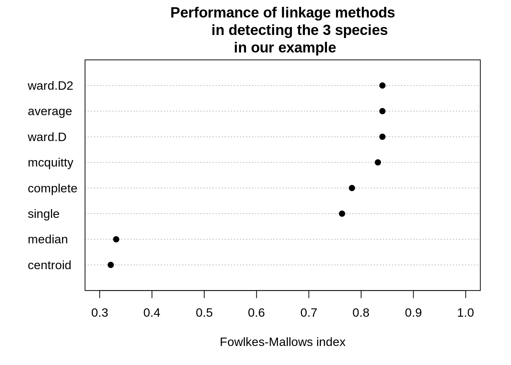
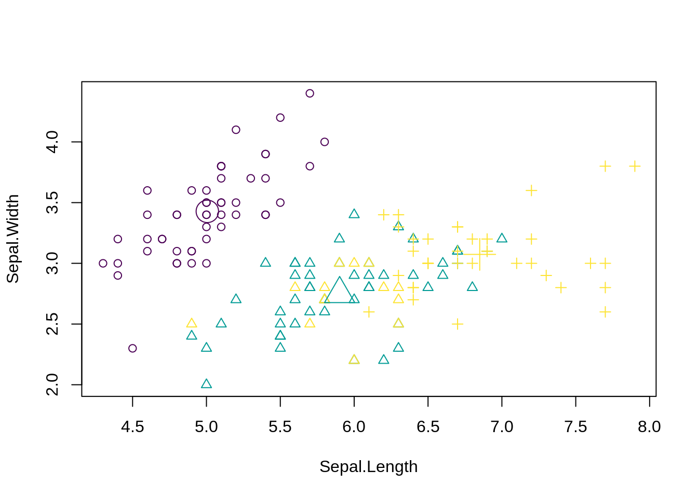
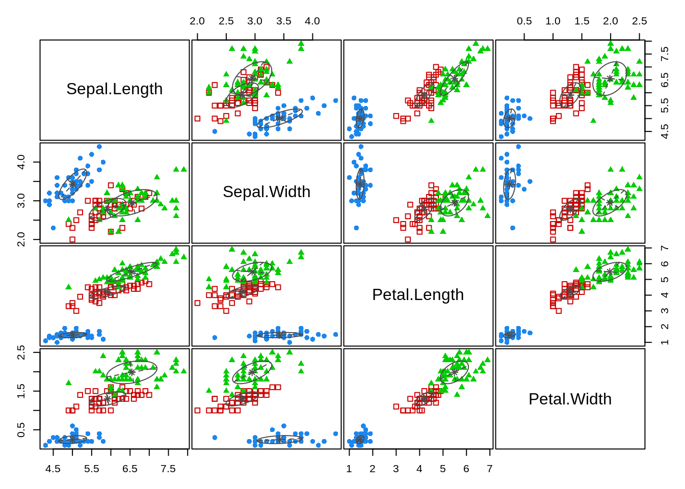
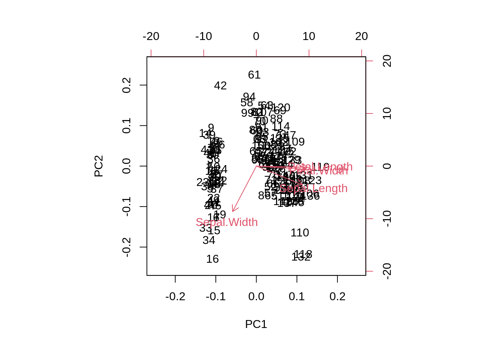
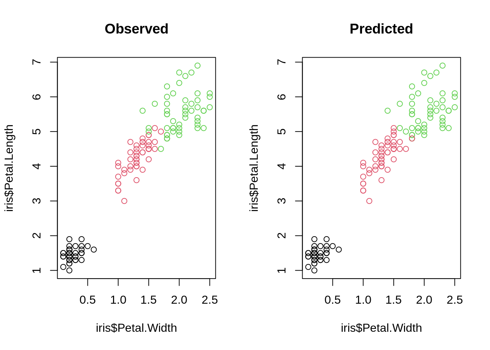

# Introduction to Machine Learning {#introduction}

```{=html}
<!-- Put this here (right after the first markdown headline) and only here for each document! -->
<script src="./scripts/multipleChoice.js"></script>
```

## Principles of Machine Learning


There are three basic machine learning tasks:

* Supervised learning
* Unsupervised learning
* Reinforcement learning

In **supervised learning**, you train algorithms using labeled data, what means that you already know the correct answer for a part of the data (the so called _training data_).

**Unsupervised learning** in contrast is a technique, where one does not need to monitor the model or apply labels. Instead, you allow the model to work on its own to discover information.

**Reinforcement learning** is a technique that emulates a game-like situation. The algorithm finds a solution by trial and error and gets either _rewards_ or _penalties_ for every action. As in games, the goal is to maximize the rewards. We will talk more about this technique on the last day of the course.

For the moment, we will focus on the first two tasks, supervised and unsupervised learning. To do so, we will begin with a small example. But before you start with the code, here is a video to prepare you for what we will do in the class:

<iframe width="560" height="315"
  src="https://www.youtube.com/embed/1AVrWvRvfxs"
  frameborder="0" allow="accelerometer; autoplay; encrypted-media;
  gyroscope; picture-in-picture" allowfullscreen>
  </iframe>


### Questions


```{=html}
  <hr/>
    <summary>
      <strong><span style="color: #0011AA; font-size:18px;">1. Question</span></strong>
    </summary>
    <p>
      <script>
        makeMultipleChoiceForm(
         'Have a look at the two textbooks on ML (Elements of statistical learning and introduction to statistical learning) in our further readings at the end of the GRIPS course - which of the following statements is true?',
          'checkbox',
          [
            {
              'answer':'Both books can be downloaded for free.',
              'correct':true,
              'explanationIfSelected':'',
              'explanationIfNotSelected':'',
              'explanationGeneral':''
            },
            {
              'answer':'The elements of statistical learning was published earlier than the introduction to statistical learning.',
              'correct':true,
              'explanationIfSelected':'',
              'explanationIfNotSelected':'',
              'explanationGeneral':''
            },
            {
              'answer':'The "an introduction to statistical learning" also includes an online course with videos to the different topics on their website.',
              'correct':true,
              'explanationIfSelected':'',
              'explanationIfNotSelected':'',
              'explanationGeneral':''
            },
            {
              'answer':'Higher model complexity is always better for predicting.',
              'correct':false,
              'explanationIfSelected':'No! Bias-variance tradeoff!',
              'explanationIfNotSelected':'',
              'explanationGeneral':''
            },
          ],
          ''
        );
      </script>
    </p>
  <hr/>
```


```{=html}
  <hr/>
    <summary>
      <strong><span style="color: #0011AA; font-size:18px;">2. Question</span></strong>
    </summary>
    <p>
      <script>
        makeMultipleChoiceForm(
         'In the lecture, it was said that, during training, ML parameters are optimised to get a good fit (loss function) to training data. Which of the following statements about loss functions is correct?',
          'checkbox',
          [
            {
              'answer':'A loss function measures the difference between the (current) ML model prediction and the data.',
              'correct':true,
              'explanationIfSelected':'',
              'explanationIfNotSelected':'',
              'explanationGeneral':''
            },
            {
              'answer':'When we specify a simple line as our ML model, all loss functions will lead to the same line.',
              'correct':false,
              'explanationIfSelected':'',
              'explanationIfNotSelected':'',
              'explanationGeneral':''
            },
            {
              'answer':'Cross-Entropy and Kullback–Leibler divergence are common loss functions.',
              'correct':true,
              'explanationIfSelected':'',
              'explanationIfNotSelected':'',
              'explanationGeneral':''
            },
            {
              'answer':'For regression, there is only one sensible loss function, and this is the mean squared error.',
              'correct':false,
              'explanationIfSelected':'',
              'explanationIfNotSelected':'',
              'explanationGeneral':''
            },
          ],
          ''
        );
      </script>
    </p>
  <hr/>
```


```{=html}
  <hr/>
    <summary>
      <strong><span style="color: #0011AA; font-size:18px;">3. Question</span></strong>
    </summary>
    <p>
      <script>
        makeMultipleChoiceForm(
         'Which of the following statements about the bias-variance trade-off is correct? (see figure above)',
          'checkbox',
          [
            {
              'answer':'The goal of considering the bias-variance trade-off is to get the bias of the model as small as possible.',
              'correct':false,
              'explanationIfSelected':'',
              'explanationIfNotSelected':'',
              'explanationGeneral':''
            },
            {
              'answer':'The goal of considering the bias-variance trade-off is to realize that increasing complexity typically leads to more flexibility (allowing you to reduce bias) but at the cost of uncertainty (variance) in the estimated parameters.',
              'correct':true,
              'explanationIfSelected':'',
              'explanationIfNotSelected':'',
              'explanationGeneral':''
            },
            {
              'answer':'Through the bias-variance trade-off, we see that model complexity also depends on what we want to optimize for: bias, variance (rarely), or total error of the model.',
              'correct':true,
              'explanationIfSelected':'',
              'explanationIfNotSelected':'',
              'explanationGeneral':''
            },
          ],
          ''
        );
      </script>
    </p>
  <hr/>
```


## Unsupervised Learning

In unsupervised learning, we  want to identify patterns in data without having any examples (supervision) about what the correct patterns / classes are. As an example, consider the iris data set. Here, we have 150 observations of 4 floral traits:


```r
iris = datasets::iris
colors = hcl.colors(3)
traits = as.matrix(iris[,1:4]) 
species = iris$Species
image(y = 1:4, x = 1:length(species) , z = traits, 
      ylab = "Floral trait", xlab = "Individual")
segments(50.5, 0, 50.5, 5, col = "black", lwd = 2)
segments(100.5, 0, 100.5, 5, col = "black", lwd = 2)
```

<div class="figure" style="text-align: center">

<p class="caption">(\#fig:chunk-chapter3-1-iris-plot)Trait distributions of iris dataset</p>
</div>

The observations are from 3 species and indeed those species tend to have different traits, meaning that the observations form 3 clusters. 


```r
pairs(traits, pch = as.integer(species), col = colors[as.integer(species)])
```

<div class="figure" style="text-align: center">

<p class="caption">(\#fig:chunk-chapter3-2)Scatterplots for trait-trait combinations.</p>
</div>

However, imagine we don't know what species are, what is basically the situation in which people in the antique have been. The people just noted that some plants have different flowers than others, and decided to give them different names. This kind of process is what unsupervised learning does.


### Hierarchical Clustering

A cluster refers to a collection of data points aggregated together because of certain similarities.

In hierarchical clustering, a hierarchy (tree) between data points is built.

* Agglomerative: Start with each data point in their own cluster, merge them up hierarchically.
* Divisive: Start with all data points in one cluster, and split hierarchically.

Merges / splits are done according to linkage criterion, which measures distance between (potential) clusters. Cut the tree at a certain height to get clusters. 

Here an example


```r
set.seed(123)

#Reminder: traits = as.matrix(iris[,1:4]).

d = dist(traits)
hc = hclust(d, method = "complete")

plot(hc, main="")
rect.hclust(hc, k = 3)  # Draw rectangles around the branches.
```

<div class="figure" style="text-align: center">

<p class="caption">(\#fig:chunk-chapter3-3)Results of hierarchical clustering. Red rectangle is drawn around the corresponding clusters.</p>
</div>

Same plot, but with colors for true species identity


```r
library(ape)

plot(as.phylo(hc), 
     tip.color = colors[as.integer(species)], 
     direction = "downwards")
```

<div class="figure" style="text-align: center">

<p class="caption">(\#fig:chunk-chapter3-4)Results of hierarchical clustering. Colors correspond to the three species classes.</p>
</div>

```r

hcRes3 = cutree(hc, k = 3)   #Cut a dendrogram tree into groups.
```

Calculate confusion matrix. Note we are switching labels here so that it fits to the species.


```r
tmp = hcRes3
tmp[hcRes3 == 2] = 3
tmp[hcRes3 == 3] = 2
hcRes3 = tmp
table(hcRes3, species)
```


Table: (\#tab:chunk-chapter3-5-kable)Confusion matrix for predicted and observed species classes.

| setosa| versicolor| virginica|
|------:|----------:|---------:|
|     50|          0|         0|
|      0|         27|         1|
|      0|         23|        49|


Note that results might change if you choose a different agglomeration method, distance metric or scale of your variables. Compare, e.g. to this example:


```r
hc = hclust(d, method = "ward.D2")

plot(as.phylo(hc), 
     tip.color = colors[as.integer(species)], 
     direction = "downwards")
```

<div class="figure" style="text-align: center">

<p class="caption">(\#fig:chunk-chapter3-6-a)Results of hierarchical clustering. Colors correspond to the three species classes. Different agglomeration method</p>
</div>


```r
hcRes3 = cutree(hc, k = 3)   #Cut a dendrogram tree into groups.
table(hcRes3, species)
```


Table: (\#tab:chunk-chapter3-6-kable)Confusion matrix for predicted and observed species classes.

| setosa| versicolor| virginica|
|------:|----------:|---------:|
|     50|          0|         0|
|      0|         49|        15|
|      0|          1|        35|


Which method is best? 


```r
library(dendextend)
```


```r
set.seed(123)

methods = c("ward.D", "single", "complete", "average",
             "mcquitty", "median", "centroid", "ward.D2")
out = dendlist()   # Create a dendlist object from several dendrograms.
for(method in methods){
  res = hclust(d, method = method)   
  out = dendlist(out, as.dendrogram(res))
}
names(out) = methods
print(out)
#> $ward.D
#> 'dendrogram' with 2 branches and 150 members total, at height 199.6205 
#> 
#> $single
#> 'dendrogram' with 2 branches and 150 members total, at height 1.640122 
#> 
#> $complete
#> 'dendrogram' with 2 branches and 150 members total, at height 7.085196 
#> 
#> $average
#> 'dendrogram' with 2 branches and 150 members total, at height 4.062683 
#> 
#> $mcquitty
#> 'dendrogram' with 2 branches and 150 members total, at height 4.497283 
#> 
#> $median
#> 'dendrogram' with 2 branches and 150 members total, at height 2.82744 
#> 
#> $centroid
#> 'dendrogram' with 2 branches and 150 members total, at height 2.994307 
#> 
#> $ward.D2
#> 'dendrogram' with 2 branches and 150 members total, at height 32.44761 
#> 
#> attr(,"class")
#> [1] "dendlist"

get_ordered_3_clusters = function(dend){
  # order.dendrogram function returns the order (index)
  # or the "label" attribute for the leaves.
  # cutree: Cut the tree (dendrogram) into groups of data.
  cutree(dend, k = 3)[order.dendrogram(dend)]
}
dend_3_clusters = lapply(out, get_ordered_3_clusters)

# Calculate Fowlkes-Mallows Index (determine the similarity between clusterings)
compare_clusters_to_iris = function(clus){
  FM_index(clus, rep(1:3, each = 50), assume_sorted_vectors = TRUE)
}

clusters_performance = sapply(dend_3_clusters, compare_clusters_to_iris)
dotchart(sort(clusters_performance), xlim = c(0.3, 1),
         xlab = "Fowlkes-Mallows index",
         main = "Performance of linkage methods
         in detecting the 3 species \n in our example",
         pch = 19)
```



We might conclude that ward.D2 works best here. However, as we will learn later, optimizing the method without a hold-out for testing implies that our model may be overfitting. We should check this using cross-validation. 


### K-means Clustering

Another example for an unsupervised learning algorithm is k-means clustering, one of the simplest and most popular unsupervised machine learning algorithms.

To start with the algorithm, you first have to specify the number of clusters (for our example the number of species). Each cluster has a centroid, which is the assumed or real location representing the center of the cluster (for our example this would be how an average plant of a specific species would look like). The algorithm starts by randomly putting centroids somewhere. Afterwards each data point is assigned to the respective cluster that raises the overall in-cluster sum of squares (variance) related to the distance to the centroid least of all. After the algorithm has placed all data points into a cluster the centroids get updated. By iterating this procedure until the assignment doesn't change any longer, the algorithm can find the (locally) optimal centroids and the data points belonging to this cluster.
Note that results might differ according to the initial positions of the centroids. Thus several (locally) optimal solutions might be found.

The "k" in K-means refers to the number of clusters and the ‘means’ refers to averaging the data-points to find the centroids.

A typical pipeline for using k-means clustering looks the same as for other algorithms. After having visualized the data, we fit a model, visualize the results and have a look at the performance by use of the confusion matrix. By setting a fixed seed, we can ensure that results are reproducible.


```r
set.seed(123)

#Reminder: traits = as.matrix(iris[,1:4]).

kc = kmeans(traits, 3)
print(kc)
#> K-means clustering with 3 clusters of sizes 50, 62, 38
#> 
#> Cluster means:
#>   Sepal.Length Sepal.Width Petal.Length Petal.Width
#> 1     5.006000    3.428000     1.462000    0.246000
#> 2     5.901613    2.748387     4.393548    1.433871
#> 3     6.850000    3.073684     5.742105    2.071053
#> 
#> Clustering vector:
#>   [1] 1 1 1 1 1 1 1 1 1 1 1 1 1 1 1 1 1 1 1 1 1 1 1 1 1 1 1 1 1 1 1 1 1 1 1 1 1 1 1 1 1 1
#>  [43] 1 1 1 1 1 1 1 1 2 2 3 2 2 2 2 2 2 2 2 2 2 2 2 2 2 2 2 2 2 2 2 2 2 2 2 3 2 2 2 2 2 2
#>  [85] 2 2 2 2 2 2 2 2 2 2 2 2 2 2 2 2 3 2 3 3 3 3 2 3 3 3 3 3 3 2 2 3 3 3 3 2 3 2 3 2 3 3
#> [127] 2 2 3 3 3 3 3 2 3 3 3 3 2 3 3 3 2 3 3 3 2 3 3 2
#> 
#> Within cluster sum of squares by cluster:
#> [1] 15.15100 39.82097 23.87947
#>  (between_SS / total_SS =  88.4 %)
#> 
#> Available components:
#> 
#> [1] "cluster"      "centers"      "totss"        "withinss"     "tot.withinss"
#> [6] "betweenss"    "size"         "iter"         "ifault"
```

_Visualizing the results._
Color codes true species identity, symbol shows cluster result.


```r
plot(iris[c("Sepal.Length", "Sepal.Width")],
     col =  colors[as.integer(species)], pch = kc$cluster)
points(kc$centers[, c("Sepal.Length", "Sepal.Width")],
       col = colors, pch = 1:3, cex = 3)
```



We see that there are are some discrepancies. Confusion matrix:


```r
table(iris$Species, kc$cluster)
#>             
#>               1  2  3
#>   setosa     50  0  0
#>   versicolor  0 48  2
#>   virginica   0 14 36
```

If you want to animate the clustering process, you could run


```r
library(animation)

saveGIF(kmeans.ani(x = traits[,1:2], col = colors),
        interval = 1, ani.width = 800, ani.height = 800)
```

**Elbow technique** to determine the probably best suited number of clusters:


```r
set.seed(123)

getSumSq = function(k){ kmeans(traits, k, nstart = 25)$tot.withinss }

#Perform algorithm for different cluster sizes and retrieve variance.
iris.kmeans1to10 = sapply(1:10, getSumSq)
plot(1:10, iris.kmeans1to10, type = "b", pch = 19, frame = FALSE, 
     xlab = "Number of clusters K",
     ylab = "Total within-clusters sum of squares",
     col = c("black", "red", rep("black", 8)))
```


Often, one is interested in sparse models. Furthermore, higher k than necessary tends to overfitting. At the kink in the picture, the sum of squares dropped enough and k is still low enough.
But keep in mind, this is only a rule of thumb and might be wrong in some special cases.


### Density-based Clustering

Determine the affinity of a data point according to the affinity of its k nearest neighbors.
This is a very general description as there are many ways to do so.


```r
#Reminder: traits = as.matrix(iris[,1:4]).

library(dbscan)
set.seed(123)

kNNdistplot(traits, k = 4)   # Calculate and plot k-nearest-neighbor distances.
abline(h = 0.4, lty = 2)
```


```r

dc = dbscan(traits, eps = 0.4, minPts = 6)
print(dc)
#> DBSCAN clustering for 150 objects.
#> Parameters: eps = 0.4, minPts = 6
#> The clustering contains 4 cluster(s) and 32 noise points.
#> 
#>  0  1  2  3  4 
#> 32 46 36 14 22 
#> 
#> Available fields: cluster, eps, minPts
```


```r
library(factoextra)
```


```r
fviz_cluster(dc, traits, geom = "point", ggtheme = theme_light())
```


### Model-based Clustering

The last class of methods for unsupervised clustering are so-called _model-based clustering methods_. 


```r
library(mclust)
#> Package 'mclust' version 5.4.10
#> Type 'citation("mclust")' for citing this R package in publications.
```


```r
mb = Mclust(traits)
```

Mclust automatically compares a number of candidate models (clusters, shape) according to BIC (The BIC is a criterion for classifying algorithms depending their prediction quality and their usage of parameters). We can look at the selected model via:
  

```r
mb$G # Two clusters.
#> [1] 2
mb$modelName # > Ellipsoidal, equal shape.
#> [1] "VEV"
```
  
We see that the algorithm prefers having 2 clusters. For better comparability to the other 2 methods, we will override this by setting:
    

```r
mb3 = Mclust(traits, 3)
```

Result in terms of the predicted densities for 3 clusters


```r
plot(mb3, "density")
```


Predicted clusters:


```r
plot(mb3, what=c("classification"), add = T)
```



Confusion matrix:


```r
table(iris$Species, mb3$classification)
```


| setosa| versicolor| virginica|
|------:|----------:|---------:|
|     50|          0|         0|
|      0|         49|        15|
|      0|          1|        35|


### Ordination

Ordination is used in explorative analysis and compared to clustering, similar objects are ordered together.
So there is a relationship between clustering and ordination. Here a PCA ordination on on the iris data set.


```r
pcTraits = prcomp(traits, center = TRUE, scale. = TRUE)
biplot(pcTraits, xlim = c(-0.25, 0.25), ylim = c(-0.25, 0.25))
```



You can cluster the results of this ordination, ordinate before clustering, or superimpose one on the other. 

### Exercise

```{=html}
  <hr/>
  <strong><span style="color: #0011AA; font-size:18px;">Tasks</span></strong><br/>
```

Go through the 4(5) algorithms above, and check if they are sensitive (i.e. if results change) if you scale the input features (= predictors), instead of using the raw data. Discuss in your group: Which is more appropriate for this analysis and/or in general: Scaling or not scaling?

```{=html}
  <details>
    <summary>
      <strong><span style="color: #0011AA; font-size:18px;">Solution</span></strong>
    </summary>
    <p>
```

```{=html}
  <strong><span style="font-size:20px;">Hierarchical Clustering</span></strong>
```
<br/>

```r
library(dendextend)

methods = c("ward.D", "single", "complete", "average",
            "mcquitty", "median", "centroid", "ward.D2")

cluster_all_methods = function(distances){
  out = dendlist()
  for(method in methods){
    res = hclust(distances, method = method)   
    out = dendlist(out, as.dendrogram(res))
  }
  names(out) = methods
  
  return(out)
}

get_ordered_3_clusters = function(dend){
  return(cutree(dend, k = 3)[order.dendrogram(dend)])
}

compare_clusters_to_iris = function(clus){
  return(FM_index(clus, rep(1:3, each = 50), assume_sorted_vectors = TRUE))
}

do_clustering = function(traits, scale = FALSE){
  set.seed(123)
  headline = "Performance of linkage methods\nin detecting the 3 species\n"
  
  if(scale){
    traits = scale(traits)  # Do scaling on copy of traits.
    headline = paste0(headline, "Scaled")
  }else{ headline = paste0(headline, "Not scaled") }
  
  distances = dist(traits)
  out = cluster_all_methods(distances)
  dend_3_clusters = lapply(out, get_ordered_3_clusters)
  clusters_performance = sapply(dend_3_clusters, compare_clusters_to_iris)
  dotchart(sort(clusters_performance), xlim = c(0.3,1),
           xlab = "Fowlkes-Mallows index",
           main = headline,
           pch = 19)
}

traits = as.matrix(iris[,1:4])

# Do clustering on unscaled data.
do_clustering(traits, FALSE)
```


```r

# Do clustering on scaled data.
do_clustering(traits, TRUE)
```


It seems that scaling is harmful for hierarchical clustering. But this might be a deception.
**Be careful:** If you have data on different units or magnitudes, scaling is definitely useful! Otherwise variables with higher values get higher influence.

```{=html}
  <strong><span style="font-size:20px;">K-means Clustering</span></strong>
```
<br/>

```r
do_clustering = function(traits, scale = FALSE){
  set.seed(123)
  
  if(scale){
    traits = scale(traits)  # Do scaling on copy of traits.
    headline = "K-means Clustering\nScaled\nSum of all tries: "
  }else{ headline = "K-means Clustering\nNot scaled\nSum of all tries: " }
  
  getSumSq = function(k){ kmeans(traits, k, nstart = 25)$tot.withinss }
  iris.kmeans1to10 = sapply(1:10, getSumSq)
  
  headline = paste0(headline, round(sum(iris.kmeans1to10), 2))
  
  plot(1:10, iris.kmeans1to10, type = "b", pch = 19, frame = FALSE,
       main = headline,
       xlab = "Number of clusters K",
       ylab = "Total within-clusters sum of squares",
       col = c("black", "red", rep("black", 8)) )
}

traits = as.matrix(iris[,1:4])

# Do clustering on unscaled data.
do_clustering(traits, FALSE)
```


```r

# Do clustering on scaled data.
do_clustering(traits, TRUE)
```


It seems that scaling is harmful for K-means clustering. But this might be a deception.
<strong>*Be careful:*</strong> If you have data on different units or magnitudes, scaling is definitely useful! Otherwise variables with higher values get higher influence.
```{=html}
  <strong><span style="font-size:20px;">Density-based Clustering</span></strong>
```
<br/>

```r
library(dbscan)

correct = as.factor(iris[,5])
# Start at 1. Noise points will get 0 later.
levels(correct) = 1:length(levels(correct))
correct
#>   [1] 1 1 1 1 1 1 1 1 1 1 1 1 1 1 1 1 1 1 1 1 1 1 1 1 1 1 1 1 1 1 1 1 1 1 1 1 1 1 1 1 1 1
#>  [43] 1 1 1 1 1 1 1 1 2 2 2 2 2 2 2 2 2 2 2 2 2 2 2 2 2 2 2 2 2 2 2 2 2 2 2 2 2 2 2 2 2 2
#>  [85] 2 2 2 2 2 2 2 2 2 2 2 2 2 2 2 2 3 3 3 3 3 3 3 3 3 3 3 3 3 3 3 3 3 3 3 3 3 3 3 3 3 3
#> [127] 3 3 3 3 3 3 3 3 3 3 3 3 3 3 3 3 3 3 3 3 3 3 3 3
#> Levels: 1 2 3

do_clustering = function(traits, scale = FALSE){
  set.seed(123)
  
  if(scale){ traits = scale(traits) } # Do scaling on copy of traits.
  
  #####
  # Play around with the parameters "eps" and "minPts" on your own!
  #####
  dc = dbscan(traits, eps = 0.41, minPts = 4)
  
  labels = as.factor(dc$cluster)
  noise = sum(dc$cluster == 0)
  levels(labels) = c("noise", 1:( length(levels(labels)) - 1))
  
  tbl = table(correct, labels)
  correct_classified = 0
  for(i in 1:length(levels(correct))){
    correct_classified = correct_classified + tbl[i, i + 1]
  }
  
  cat( if(scale){ "Scaled" }else{ "Not scaled" }, "\n\n" )
  cat("Confusion matrix:\n")
  print(tbl)
  cat("\nCorrect classified points: ", correct_classified, " / ", length(iris[,5]))
  cat("\nSum of noise points: ", noise, "\n")
}

traits = as.matrix(iris[,1:4])

# Do clustering on unscaled data.
do_clustering(traits, FALSE)
#> Not scaled 
#> 
#> Confusion matrix:
#>        labels
#> correct noise  1  2  3  4
#>       1     3 47  0  0  0
#>       2     5  0 38  3  4
#>       3    17  0  0 33  0
#> 
#> Correct classified points:  118  /  150
#> Sum of noise points:  25

# Do clustering on scaled data.
do_clustering(traits, TRUE)
#> Scaled 
#> 
#> Confusion matrix:
#>        labels
#> correct noise  1  2  3  4
#>       1     9 41  0  0  0
#>       2    14  0 36  0  0
#>       3    36  0  1  4  9
#> 
#> Correct classified points:  81  /  150
#> Sum of noise points:  59
```

It seems that scaling is harmful for density based clustering. But this might be a deception.
<strong>*Be careful:*</strong> If you have data on different units or magnitudes, scaling is definitely useful! Otherwise variables with higher values get higher influence.

```{=html}
  <strong><span style="font-size:20px;">Model-based Clustering</span></strong>
```
<br/>

```r
library(mclust)

do_clustering = function(traits, scale = FALSE){
  set.seed(123)
  
  if(scale){ traits = scale(traits) } # Do scaling on copy of traits.
  
  mb3 = Mclust(traits, 3)
  
  tbl = table(iris$Species, mb3$classification)
  
  cat( if(scale){ "Scaled" }else{ "Not scaled" }, "\n\n" )
  cat("Confusion matrix:\n")
  print(tbl)
  cat("\nCorrect classified points: ", sum(diag(tbl)), " / ", length(iris[,5]))
}

traits = as.matrix(iris[,1:4])

# Do clustering on unscaled data.
do_clustering(traits, FALSE)
#> Not scaled 
#> 
#> Confusion matrix:
#>             
#>               1  2  3
#>   setosa     50  0  0
#>   versicolor  0 45  5
#>   virginica   0  0 50
#> 
#> Correct classified points:  145  /  150

# Do clustering on scaled data.
do_clustering(traits, TRUE)
#> Scaled 
#> 
#> Confusion matrix:
#>             
#>               1  2  3
#>   setosa     50  0  0
#>   versicolor  0 45  5
#>   virginica   0  0 50
#> 
#> Correct classified points:  145  /  150
```

For model based clustering, scaling does not matter.

```{=html}
  <strong><span style="font-size:20px;">Ordination</span></strong>
```
<br/>

```r
traits = as.matrix(iris[,1:4])

biplot(prcomp(traits, center = TRUE, scale. = TRUE),
       main = "Use integrated scaling")
```


```r

biplot(prcomp(scale(traits), center = FALSE, scale. = FALSE),
       main = "Scale explicitly")
```


```r

biplot(prcomp(traits, center = FALSE, scale. = FALSE),
       main = "No scaling at all")
```


For PCA ordination, scaling matters.
Because we are interested in directions of maximal variance, all parameters should be scaled, or the one with the highest values might dominate all others.

```{=html}
    </p>
  </details>
  <br/><hr/>
```


## Supervised Learning

The two most prominent branches of supervised learning are regression and classification. Fundamentally, classification is about predicting a label and regression is about predicting a quantity. The following video explains that in more depth:
  
<iframe width="560" height="315"
  src="https://www.youtube.com/embed/i04Pfrb71vk"
  frameborder="0" allow="accelerometer; autoplay; encrypted-media;
  gyroscope; picture-in-picture" allowfullscreen>
  </iframe>


### Regression

The random forest (RF) algorithm is possibly the most widely used machine learning algorithm and can be used for regression and classification. We will talk more about the algorithm tomorrow. 

For the moment, we want to go through a typical workflow for a supervised regression: First, we visualize the data. Next, we fit the model and lastly we visualize the results. We will again use the iris data set that we used before. The goal is now to predict Sepal.Length based on the information about the other variables (including species). 

Fitting the model:


```r
library(randomForest)
set.seed(123)
```


```r
m1 = randomForest(Sepal.Length ~ ., data = iris)   # ~.: Against all others.
# str(m1)
# m1$type
# predict(m1)
print(m1)
#> 
#> Call:
#>  randomForest(formula = Sepal.Length ~ ., data = iris) 
#>                Type of random forest: regression
#>                      Number of trees: 500
#> No. of variables tried at each split: 1
#> 
#>           Mean of squared residuals: 0.1364625
#>                     % Var explained: 79.97
```

Visualization of the results:


```r
oldpar = par(mfrow = c(1, 2))
plot(predict(m1), iris$Sepal.Length, xlab = "Predicted", ylab = "Observed")
abline(0, 1)
varImpPlot(m1)
```


```r
par(oldpar)
```

To understand the structure of a random forest in more detail, we can use a package from GitHub.


```r
reprtree:::plot.getTree(m1, iris)
```


Here, one of the regression trees is shown.


### Classification

With the random forest, we can also do classification. The steps are the same as for regression tasks, but we can additionally see how well it performed by looking at the confusion matrix. Each row of this matrix contains the instances in a predicted class and each column represents the instances in the actual class. Thus the diagonals are the correctly predicted classes and the off-diagonal elements are the falsely classified elements.

Fitting the model:


```r
set.seed(123)

m1 = randomForest(Species ~ ., data = iris)
```

Visualizing one of the fitted models:
  

```r
oldpar = par(mfrow = c(1, 2))
reprtree:::plot.getTree(m1, iris)
```


Visualizing results ecologically:


```r
par(mfrow = c(1, 2))
plot(iris$Petal.Width, iris$Petal.Length, col = iris$Species, main = "Observed")
plot(iris$Petal.Width, iris$Petal.Length, col = predict(m1), main = "Predicted")
```




```r
par(oldpar)   #Reset par.
```

Confusion matrix:


```r
table(predict(m1), iris$Species)
```


|           | setosa| versicolor| virginica|
|:----------|------:|----------:|---------:|
|setosa     |     50|          0|         0|
|versicolor |      0|         47|         4|
|virginica  |      0|          3|        46|

### Questions

```{=html}
  <hr/>
    <summary>
      <strong><span style="color: #0011AA; font-size:18px;">Questions</span></strong>
    </summary>
    <p>
      <script>
        makeMultipleChoiceForm(
         'Using a random forest on the iris dataset, which parameter would be more important (remember there is a function to check this) to predict Petal.Width?',
          'radio',
          [
            {
              'answer':'Species.',
              'correct':true,
              'explanationIfSelected':'',
              'explanationIfNotSelected':'',
              'explanationGeneral':''
            },
            {
              'answer':'Sepal.Width.',
              'correct':false,
              'explanationIfSelected':'',
              'explanationIfNotSelected':'',
              'explanationGeneral':''
            },
          ],
          ''
        );
      </script>
    </p>
  <hr/>
```


