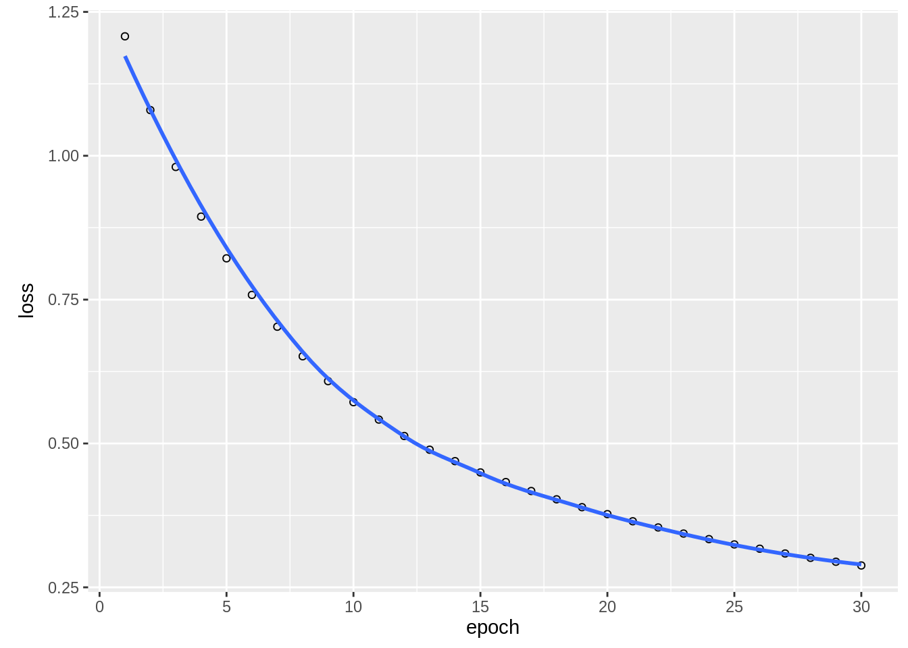
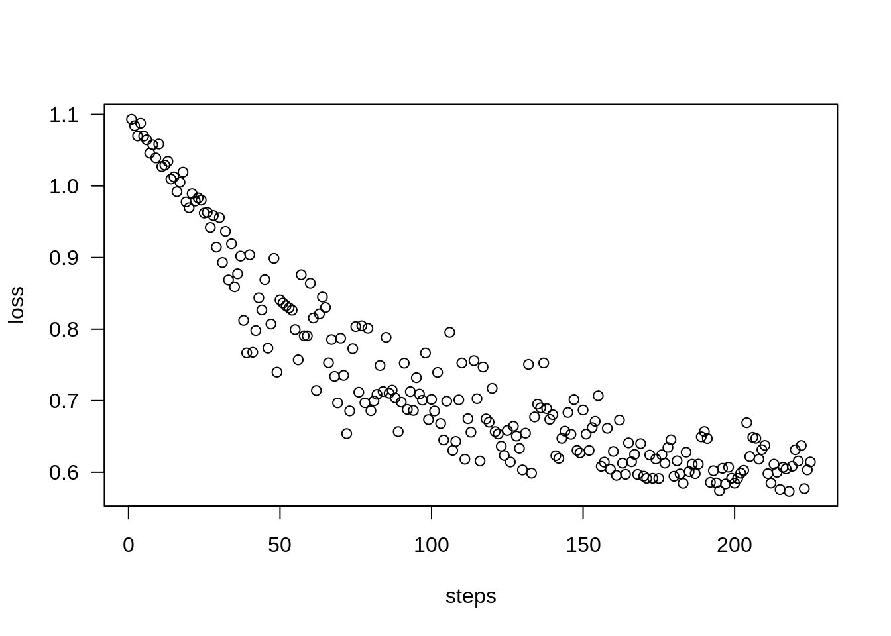
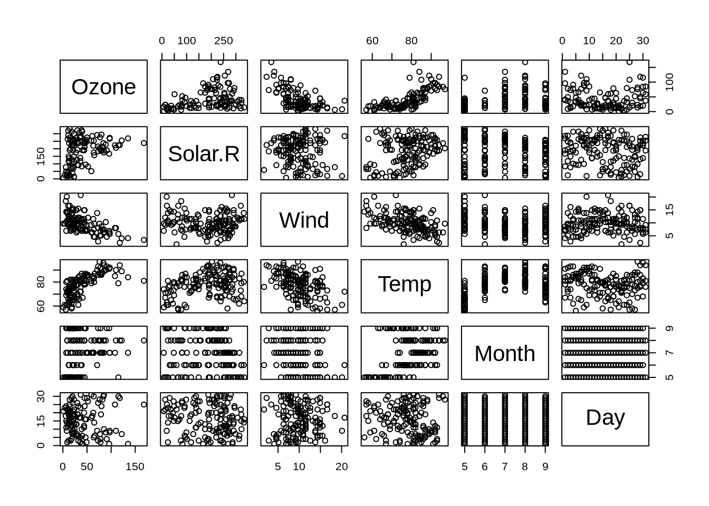
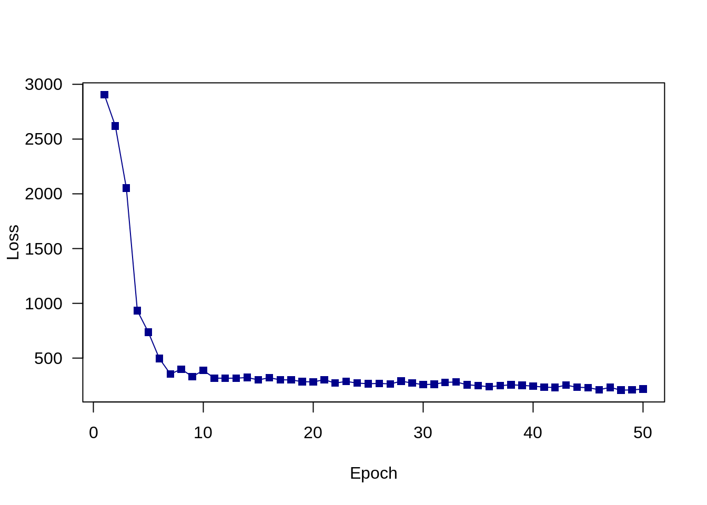

# Introduction to TensorFlow, Keras, and Torch {#tensorflowintro}

```{=html}
<!-- Put this here (right after the first markdown headline) and only here for each document! -->
<script src="./scripts/multipleChoice.js"></script>
```


## Introduction to TensorFlow

One of the most commonly used frameworks for machine learning is **TensorFlow**. TensorFlow is an open source <a href="https://en.wikipedia.org/wiki/Linear_algebra" target="_blank" rel="noopener">linear algebra</a> library with focus on neural networks, published by Google in 2015. TensorFlow supports several interesting features, in particular automatic differentiation, several gradient optimizers and CPU and GPU parallelization. 

These advantages are nicely explained in the following video: 
  
<iframe width="560" height="315"
  src="https://www.youtube.com/embed/MotG3XI2qSs"
  frameborder="0" allow="accelerometer; autoplay; encrypted-media;
  gyroscope; picture-in-picture" allowfullscreen>
  </iframe>

To sum up the most important points of the video: 
  
* TensorFlow is a math library which is highly optimized for neural networks.
* If a GPU is available, computations can be easily run on the GPU but even on a CPU TensorFlow is still very fast.
* The "backend" (i.e. all the functions and all computations) are written in C++ and CUDA (CUDA is a programming language for NVIDIA GPUs).
* The interface (the part of TensorFlow we use) is written in Python and is also available in R, which means, we can write the code in R/Python but it will be executed by the (compiled) C++ backend.

All operations in TensorFlow are written in C++ and are highly optimized. But don't worry, we don’t have to use C++ to use TensorFlow because there are several bindings for other languages. TensorFlow officially supports a Python API, but meanwhile there are several community carried APIs for other languages:
  
* R
* Go
* Rust
* Swift
* JavaScript

In this course we will use TensorFlow with the <a href="https://tensorflow.rstudio.com/" target="_blank" rel="noopener">https://tensorflow.rstudio.com/</a> binding, that was developed and published 2017 by the RStudio team. First, they developed an R package (reticulate) for calling Python in R. Actually, we are using the Python TensorFlow module in R (more about this later).

TensorFlow offers different levels of API. We could implement a neural network completely by ourselves or we could use Keras which is provided as a submodule by TensorFlow. Keras is a powerful module for building and training neural networks. It allows us building and training neural networks in a few lines of codes. Since the end of 2018, Keras and TensorFlow are completly interoperable, allowing us to utilize the best of both. In this course, we will show how we can use Keras for neural networks but also how we can use the TensorFlow’s automatic differenation for using complex objective functions.


Useful links:

* <a href="https://www.tensorflow.org/api_docs/python/tf" target="_blank" rel="noopener">TensorFlow documentation</a> (This is for the Python API, but just replace the "." with "$".)
* <a href="https://tensorflow.rstudio.com/" target="_blank" rel="noopener">Rstudio TensorFlow website</a>


### Data Containers

TensorFlow has two data containers (structures):
  
* constant (tf$constant): Creates a constant (immutable) value in the computation graph.
* variable (tf$Variable): Creates a mutable value in the computation graph (used as parameter/weight in models).

To get started with TensorFlow, we have to load the library and check if the installation worked. 


```r
library(tensorflow)
library(keras)

# Don't worry about weird messages. TensorFlow supports additional optimizations.
exists("tf")
#> [1] TRUE

immutable = tf$constant(5.0)
#> Loaded Tensorflow version 2.9.1
mutable = tf$constant(5.0)
```

Don't worry about weird messages (they will only appear once at the start of the session).


### Basic Operations

We now can define the variables and do some math with them:


```r
a = tf$constant(5)
b = tf$constant(10)
print(a)
#> tf.Tensor(5.0, shape=(), dtype=float32)
print(b)
#> tf.Tensor(10.0, shape=(), dtype=float32)
c = tf$add(a, b)
print(c)
#> tf.Tensor(15.0, shape=(), dtype=float32)
tf$print(c) # Prints to stderr. For stdout, use k_print_tensor(..., message).
k_print_tensor(c) # Comes out of Keras!
#> tf.Tensor(15.0, shape=(), dtype=float32)
```

Normal R methods such as print() are provided by the R package "tensorflow". 

The TensorFlow library (created by the RStudio team) built R methods for all common operations:


```r
`+.tensorflow.tensor` = function(a, b){ return(tf$add(a,b)) }
# Mind the backticks.
k_print_tensor(a+b)
#> tf.Tensor(15.0, shape=(), dtype=float32)
```

Their operators also automatically transform R numbers into constant tensors when attempting to add a tensor to an R number:


```r
d = c + 5  # 5 is automatically converted to a tensor.
print(d)
#> tf.Tensor(20.0, shape=(), dtype=float32)
```

TensorFlow containers are objects, what means that they are not just simple variables of type numeric (class(5)), but they instead have so called methods. Methods are changing the state of a class (which for most of our purposes here is the values of the object).
For instance, there is a method to transform the tensor object back to an R object:


```r
class(d)
#> [1] "tensorflow.tensor"                               
#> [2] "tensorflow.python.framework.ops.EagerTensor"     
#> [3] "tensorflow.python.framework.ops._EagerTensorBase"
#> [4] "tensorflow.python.framework.ops.Tensor"          
#> [5] "tensorflow.python.types.internal.NativeObject"   
#> [6] "tensorflow.python.types.core.Tensor"             
#> [7] "python.builtin.object"
class(d$numpy())
#> [1] "numeric"
```


### Data Types

R uses dynamic typing, what means you can assign a number, character, function or whatever to a variable and the the type is automatically inferred.
In other languages you have to state the type explicitly, e.g. in C:


```c
int a = 5;
float a = 5.0;
char a = "a";
```

While TensorFlow tries to infer the type dynamically, you must often state it explicitly.
Common important types: 

* float32 (floating point number with 32 bits, "single precision")
* float64 (floating point number with 64 bits, "double precision")
* int8 (integer with 8 bits)

The reason why TensorFlow is so explicit about types is that many GPUs (e.g. the NVIDIA GeForces) can handle only up to 32 bit numbers! (you do not need high precision in graphical modeling)

But let us see in practice what we have to do with these types and how to specifcy them:


```r
r_matrix = matrix(runif(10*10), 10, 10)
m = tf$constant(r_matrix, dtype = "float32") 
b = tf$constant(2.0, dtype = "float64")
c = m / b # Doesn't work! We try to divide float32/float64.
```

So what went wrong here? We tried to divide a float32 by a float64 number, but we can only divide numbers of the same type!


```r
r_matrix = matrix(runif(10*10), 10, 10)
m = tf$constant(r_matrix, dtype = "float64")
b = tf$constant(2.0, dtype = "float64")
c = m / b # Now it works.
```

We can also specify the type of the object by providing an object e.g. tf$float64.


```r
r_matrix = matrix(runif(10*10), 10, 10)
m = tf$constant(r_matrix, dtype = tf$float64)
```

In TensorFlow, arguments often require exact/explicit data types:
TensorFlow often expects integers as arguments. In R however an integer is normally saved as float. 
Thus, we have to use an "L" after an integer to tell the R interpreter that it should be treated as an integer:
  

```r
is.integer(5)
is.integer(5L)
matrix(t(r_matrix), 5, 20, byrow = TRUE)
tf$reshape(r_matrix, shape = c(5, 20))$numpy()
tf$reshape(r_matrix, shape = c(5L, 20L))$numpy()
```

Skipping the "L" is one of the most common errors when using R-TensorFlow!

### Exercises

```{=html}
  <hr/>
  <strong><span style="color: #0011AA; font-size:18px;">1. Task</span></strong><br/>
```

To run TensorFlow from R, note that you can access the different mathematical operations in TensorFlow via tf\$..., e.g. there is a tf\$math\$... for all common math operations or the tf\$linalg\$... for different linear algebra operations.
Tip: type tf\$ and then hit the tab key to list all available options (sometimes you have to do this directly in the console).

An example: How to get the maximum value of a vector?


```r
library(tensorflow)
library(keras)

x = 100:1
y = as.double(100:1)

max(x)  # R solution. Integer!
tf$math$reduce_max(x) # TensorFlow solution. Integer!

max(y)  # Float!
tf$math$reduce_max(y) # Float!
```

Rewrite the following expressions (a to g) in TensorFlow:


```r
x = 100:1
y = as.double(100:1)

# a)
min(x)
#> [1] 1

# b)
mean(x)
#> [1] 50.5

# c) Tip: Use Google!
which.max(x)
#> [1] 1

# d) 
which.min(x)
#> [1] 100

# e) Tip: Use Google! 
order(x)
#>   [1] 100  99  98  97  96  95  94  93  92  91  90  89  88  87  86  85  84  83  82  81  80
#>  [22]  79  78  77  76  75  74  73  72  71  70  69  68  67  66  65  64  63  62  61  60  59
#>  [43]  58  57  56  55  54  53  52  51  50  49  48  47  46  45  44  43  42  41  40  39  38
#>  [64]  37  36  35  34  33  32  31  30  29  28  27  26  25  24  23  22  21  20  19  18  17
#>  [85]  16  15  14  13  12  11  10   9   8   7   6   5   4   3   2   1

# f) Tip: See tf$reshape.
m = matrix(y, 10, 10) # Mind: We use y here! (Float)
m_2 = abs(m %*% t(m))  # m %*% m is the normal matrix multiplication.
m_2_log = log(m_2)
print(m_2_log)
#>           [,1]     [,2]     [,3]     [,4]     [,5]     [,6]     [,7]     [,8]     [,9]
#>  [1,] 10.55841 10.54402 10.52943 10.51461 10.49957 10.48431 10.46880 10.45305 10.43705
#>  [2,] 10.54402 10.52969 10.51515 10.50040 10.48542 10.47022 10.45478 10.43910 10.42317
#>  [3,] 10.52943 10.51515 10.50067 10.48598 10.47107 10.45593 10.44057 10.42496 10.40910
#>  [4,] 10.51461 10.50040 10.48598 10.47135 10.45651 10.44144 10.42614 10.41061 10.39482
#>  [5,] 10.49957 10.48542 10.47107 10.45651 10.44173 10.42674 10.41151 10.39605 10.38034
#>  [6,] 10.48431 10.47022 10.45593 10.44144 10.42674 10.41181 10.39666 10.38127 10.36565
#>  [7,] 10.46880 10.45478 10.44057 10.42614 10.41151 10.39666 10.38158 10.36628 10.35073
#>  [8,] 10.45305 10.43910 10.42496 10.41061 10.39605 10.38127 10.36628 10.35105 10.33559
#>  [9,] 10.43705 10.42317 10.40910 10.39482 10.38034 10.36565 10.35073 10.33559 10.32022
#> [10,] 10.42079 10.40699 10.39299 10.37879 10.36439 10.34977 10.33495 10.31989 10.30461
#>          [,10]
#>  [1,] 10.42079
#>  [2,] 10.40699
#>  [3,] 10.39299
#>  [4,] 10.37879
#>  [5,] 10.36439
#>  [6,] 10.34977
#>  [7,] 10.33495
#>  [8,] 10.31989
#>  [9,] 10.30461
#> [10,] 10.28909

# g) Custom mean function i.e. rewrite the function using TensorFlow. 
mean_R = function(y){
  result = sum(y) / length(y)
  return(result)
}

mean_R(y) == mean(y)	# Test for equality.
#> [1] TRUE
```

```{=html}
  <details>
    <summary>
      <strong><span style="color: #0011AA; font-size:18px;">Solution</span></strong>
    </summary>
    <p>
```


```{=html}
    </p>
  </details>
  <br/>
```

```{=html}
  <hr/>
  <strong><span style="color: #0011AA; font-size:18px;">2. Task</span></strong><br/>
```

This exercise compares the speed of R to TensorFlow.
The first exercise is to rewrite the following function in TensorFlow:


```r
do_something_R = function(x = matrix(0.0, 10L, 10L)){
  mean_per_row = apply(x, 1, mean)
  result = x - mean_per_row
  return(result)
}
```

Here, we provide a skeleton for a TensorFlow function:


```r
do_something_TF = function(x = matrix(0.0, 10L, 10L)){
   ...
}
```

We can compare the speed using the Microbenchmark package:


```r
test = matrix(0.0, 100L, 100L)
microbenchmark::microbenchmark(do_something_R(test), do_something_TF(test))
```

Try different matrix sizes for the test matrix and compare the speed.

Tip: Have a look at the the tf.reduce_mean documentation and the "axis" argument.

<br/>

Compare the following with different matrix sizes:

* test = matrix(0.0, 1000L, 500L)
* testTF = tf\$constant(test)

Also try the following:


```r
microbenchmark::microbenchmark(
   tf$matmul(testTF, tf$transpose(testTF)), # TensorFlow style.
   test %*% t(test)  # R style.
)
```

```{=html}
  <details>
    <summary>
      <strong><span style="color: #0011AA; font-size:18px;">Solution</span></strong>
    </summary>
    <p>
```


<!-- Why is R faster (the first time)? -->

<!-- * a) The R functions we used (apply, mean, "-") are also implemented in C. -->
<!-- * b) The problem is not large enough and TensorFlow has an overhead. -->

<br/>


```{=html}
    </p>
  </details>
  <br/>
```

```{=html}
  <hr/>
  <strong><span style="color: #0011AA; font-size:18px;">3. Task</span></strong><br/>
```

Google to find out how to write the following tasks in TensorFlow:


```r
A = matrix(c(1, 2, 0, 0, 2, 0, 2, 5, 3), 3, 3)

# i)
solve(A)  # Solve equation AX = B. If just A  is given, invert it.
#>      [,1] [,2]       [,3]
#> [1,]    1  0.0 -0.6666667
#> [2,]   -1  0.5 -0.1666667
#> [3,]    0  0.0  0.3333333

# j)
diag(A) # Diagonal of A, if no matrix is given, construct diagonal matrix.
#> [1] 1 2 3

# k)
diag(diag(A)) # Diagonal matrix with entries diag(A).
#>      [,1] [,2] [,3]
#> [1,]    1    0    0
#> [2,]    0    2    0
#> [3,]    0    0    3

# l)
eigen(A)
#> eigen() decomposition
#> $values
#> [1] 3 2 1
#> 
#> $vectors
#>           [,1] [,2]       [,3]
#> [1,] 0.1400280    0  0.4472136
#> [2,] 0.9801961    1 -0.8944272
#> [3,] 0.1400280    0  0.0000000

# m)
det(A)
#> [1] 6
```

```{=html}
  <details>
    <summary>
      <strong><span style="color: #0011AA; font-size:18px;">Solution</span></strong>
    </summary>
    <p>
```


```{=html}
    </p>
  </details>
  <br/>
```

```{=html}
  <hr/>
  <strong><span style="color: #0011AA; font-size:18px;">4. Task</span></strong><br/>
```

TensorFlow supports automatic differentiation (analytical and not numerical!). 
Let's have a look at the function $f(x) = 5 x^2 + 3$ with derivative $f'(x) = 10x$.
So for $f'(5)$ we will get $10$.

Let's do this in TensorFlow. Define the function:


```r
f = function(x){ return(5.0 * tf$square(x) + 3.0) }
```

We want to calculate the derivative for $x = 2.0$:


```r
x = tf$constant(2.0)
```

To do automatic differentiation, we have to forward $x$ through the function within the tf\$GradientTape() environment. We have also have to tell TensorFlow which value to "watch":


```r
with(tf$GradientTape() %as% tape,
  {
    tape$watch(x)
    y = f(x)
  }
)
```

To print the gradient:


```r
(tape$gradient(y, x))
#> tf.Tensor(20.0, shape=(), dtype=float32)
```

We can also calculate the second order derivative $f''(x) = 10$:


```r
with(tf$GradientTape() %as% first,
  {
    first$watch(x)
    with(tf$GradientTape() %as% second,
      {
        second$watch(x)
        y = f(x)
        g = first$gradient(y, x)
      }
    )
  }
)

(second$gradient(g, x))
#> tf.Tensor(10.0, shape=(), dtype=float32)
```

What is happening here? Think about and discuss it.


A more advanced example: *Linear regression*

In this case we first simulate data following $\boldsymbol{y} = \boldsymbol{X} \boldsymbol{w} + \boldsymbol{\epsilon}$  ($\boldsymbol{\epsilon}$ follows a normal distribution == error).


```r
set_random_seed(321L, disable_gpu = FALSE)	# Already sets R's random seed.

x = matrix(round(runif(500, -2, 2), 3), 100, 5)
w = round(rnorm(5, 2, 1), 3)
y = x %*% w + round(rnorm(100, 0, 0.25), 4)
```

In R we would do the following to fit a linear regression model:


```r
summary(lm(y~x))
#> 
#> Call:
#> lm(formula = y ~ x)
#> 
#> Residuals:
#>      Min       1Q   Median       3Q      Max 
#> -0.67893 -0.16399  0.00968  0.15058  0.51099 
#> 
#> Coefficients:
#>             Estimate Std. Error t value Pr(>|t|)    
#> (Intercept) 0.004865   0.027447   0.177     0.86    
#> x1          2.191511   0.023243  94.287   <2e-16 ***
#> x2          2.741690   0.025328 108.249   <2e-16 ***
#> x3          1.179181   0.023644  49.872   <2e-16 ***
#> x4          0.591873   0.025154  23.530   <2e-16 ***
#> x5          2.302417   0.022575 101.991   <2e-16 ***
#> ---
#> Signif. codes:  0 '***' 0.001 '**' 0.01 '*' 0.05 '.' 0.1 ' ' 1
#> 
#> Residual standard error: 0.2645 on 94 degrees of freedom
#> Multiple R-squared:  0.9974,	Adjusted R-squared:  0.9972 
#> F-statistic:  7171 on 5 and 94 DF,  p-value: < 2.2e-16
```

Let's build our own model in TensorFlow.
Here, we use now the variable data container type (remember they are mutable and we need this type for the weights ($\boldsymbol{w}$) of the regression model). We want our model to learn these weights.

The input (predictors, independent variables or features, $\boldsymbol{X}$) and the observed (response, $\boldsymbol{y}$) are constant and will not be learned/optimized.


```r
library(tensorflow)
library(keras)
set_random_seed(321L, disable_gpu = FALSE)	# Already sets R's random seed.

x = matrix(round(runif(500, -2, 2), 3), 100, 5)
w = round(rnorm(5, 2, 1), 3)
y = x %*% w + round(rnorm(100, 0, 0.25), 4)

# Weights we want to learn.
# We know the real weights but in reality we wouldn't know them.
# So use guessed ones.
wTF = tf$Variable(matrix(rnorm(5, 0, 0.01), 5, 1))

xTF = tf$constant(x)
yTF = tf$constant(y)

# We need an optimizer which updates the weights (wTF).
optimizer = tf$keras$optimizers$Adamax(learning_rate = 0.1)

for(i in 1:100){
  with(tf$GradientTape() %as% tape,
    {
      pred = tf$matmul(xTF, wTF)
      loss = tf$sqrt(tf$reduce_mean(tf$square(yTF - pred)))
    }
  )

  if(!i%%10){ k_print_tensor(loss, message = "Loss: ") }  # Every 10 times.
  grads = tape$gradient(loss, wTF)
  optimizer$apply_gradients(purrr::transpose(list(list(grads), list(wTF))))
}

k_print_tensor(wTF, message = "Resulting weights:\n")
#> <tf.Variable 'Variable:0' shape=(5, 1) dtype=float64, numpy=
#> array([[2.19290567],
#>        [2.74534135],
#>        [1.1714656 ],
#>        [0.58811305],
#>        [2.30174942]])>
cat("Original weights: ", w, "\n")
#> Original weights:  2.217 2.719 1.165 0.593 2.303
```

Discuss the code, go through the code line by line and try to understand it.

Additional exercise:

Play around with the simulation, increase/decrease the number of weights, add an intercept (you also need an additional variable in model).

```{=html}
  <details>
    <summary>
      <strong><span style="color: #0011AA; font-size:18px;">Solution</span></strong>
    </summary>
    <p>
```


```{=html}
    </p>
  </details>
  <br/><hr/>
```


## Introduction to PyTorch
  
PyTorch is another famous library for deep learning. Like TensorFlow, Torch itself is written in C++ with an API for Python. In 2020, the RStudio team released R-Torch, and while R-TensorFlow calls the Python API in the background, the R-Torch API is built directly on the C++ Torch library! 
  
Useful links:

* <a href="https://pytorch.org/docs/stable/index.html" target="_blank" rel="noopener">PyTorch documentation</a> (This is for the Python API, bust just replace the "." with "$".)
* <a href="https://torch.mlverse.org/" target="_blank" rel="noopener">R-Torch website</a>


To get started with Torch, we have to load the library and check if the installation worked. 


```r
library(torch)
```


### Data Containers

Unlike TensorFlow, Torch doesn't have two data containers for mutable and immutable variables. All variables are initialized via the torch_tensor function:


```r
a = torch_tensor(1.)
```

To mark variables as mutable (and to track their operations for automatic differentiation) we have to set the argument 'requires_grad' to true in the torch_tensor function:


```r
mutable = torch_tensor(5, requires_grad = TRUE) # tf$Variable(...)
immutable = torch_tensor(5, requires_grad = FALSE) # tf$constant(...)
```


### Basic Operations

We now can define the variables and do some math with them:


```r
a = torch_tensor(5.)
b = torch_tensor(10.)
print(a)
#> torch_tensor
#>  5
#> [ CPUFloatType{1} ]
print(b)
#> torch_tensor
#>  10
#> [ CPUFloatType{1} ]
c = a$add(b)
print(c)
#> torch_tensor
#>  15
#> [ CPUFloatType{1} ]
```

The R-Torch package provides all common R methods (an advantage over TensorFlow).


```r
a = torch_tensor(5.)
b = torch_tensor(10.)
print(a+b)
#> torch_tensor
#>  15
#> [ CPUFloatType{1} ]
print(a/b)
#> torch_tensor
#>  0.5000
#> [ CPUFloatType{1} ]
print(a*b)
#> torch_tensor
#>  50
#> [ CPUFloatType{1} ]
```

Their operators also automatically transform R numbers into tensors when attempting to add a tensor to a R number:


```r
d = a + 5  # 5 is automatically converted to a tensor.
print(d)
#> torch_tensor
#>  10
#> [ CPUFloatType{1} ]
```

As for TensorFlow, we have to explicitly transform the tensors back to R:


```r
class(d)
#> [1] "torch_tensor" "R7"
class(as.numeric(d))
#> [1] "numeric"
```


### Data Types

Similar to TensorFlow:


```r
r_matrix = matrix(runif(10*10), 10, 10)
m = torch_tensor(r_matrix, dtype = torch_float32()) 
b = torch_tensor(2.0, dtype = torch_float64())
c = m / b 
```

But here's a difference! With TensorFlow we would get an error, but with R-Torch, m is automatically casted to a double (float64). However, this is still bad practice!
  
During the course we will try to provide the corresponding PyTorch code snippets for all Keras/TensorFlow examples.

### Exercises

```{=html}
  <hr/>
  <strong><span style="color: #0011AA; font-size:18px;">1 Task</span></strong><br/>
```

Rewrite the following expressions (a to g) in torch:


```r
x = 100:1
y = as.double(100:1)

# a)
min(x)
#> [1] 1

# b)
mean(x)
#> [1] 50.5

# c) Tip: Use Google!
which.max(x)
#> [1] 1

# d) 
which.min(x)
#> [1] 100

# e) Tip: Use Google! 
order(x)
#>   [1] 100  99  98  97  96  95  94  93  92  91  90  89  88  87  86  85  84  83  82  81  80
#>  [22]  79  78  77  76  75  74  73  72  71  70  69  68  67  66  65  64  63  62  61  60  59
#>  [43]  58  57  56  55  54  53  52  51  50  49  48  47  46  45  44  43  42  41  40  39  38
#>  [64]  37  36  35  34  33  32  31  30  29  28  27  26  25  24  23  22  21  20  19  18  17
#>  [85]  16  15  14  13  12  11  10   9   8   7   6   5   4   3   2   1

# f) Tip: See tf$reshape.
m = matrix(y, 10, 10) # Mind: We use y here! (Float)
m_2 = abs(m %*% t(m))  # m %*% m is the normal matrix multiplication.
m_2_log = log(m_2)
print(m_2_log)
#>           [,1]     [,2]     [,3]     [,4]     [,5]     [,6]     [,7]     [,8]     [,9]
#>  [1,] 10.55841 10.54402 10.52943 10.51461 10.49957 10.48431 10.46880 10.45305 10.43705
#>  [2,] 10.54402 10.52969 10.51515 10.50040 10.48542 10.47022 10.45478 10.43910 10.42317
#>  [3,] 10.52943 10.51515 10.50067 10.48598 10.47107 10.45593 10.44057 10.42496 10.40910
#>  [4,] 10.51461 10.50040 10.48598 10.47135 10.45651 10.44144 10.42614 10.41061 10.39482
#>  [5,] 10.49957 10.48542 10.47107 10.45651 10.44173 10.42674 10.41151 10.39605 10.38034
#>  [6,] 10.48431 10.47022 10.45593 10.44144 10.42674 10.41181 10.39666 10.38127 10.36565
#>  [7,] 10.46880 10.45478 10.44057 10.42614 10.41151 10.39666 10.38158 10.36628 10.35073
#>  [8,] 10.45305 10.43910 10.42496 10.41061 10.39605 10.38127 10.36628 10.35105 10.33559
#>  [9,] 10.43705 10.42317 10.40910 10.39482 10.38034 10.36565 10.35073 10.33559 10.32022
#> [10,] 10.42079 10.40699 10.39299 10.37879 10.36439 10.34977 10.33495 10.31989 10.30461
#>          [,10]
#>  [1,] 10.42079
#>  [2,] 10.40699
#>  [3,] 10.39299
#>  [4,] 10.37879
#>  [5,] 10.36439
#>  [6,] 10.34977
#>  [7,] 10.33495
#>  [8,] 10.31989
#>  [9,] 10.30461
#> [10,] 10.28909

# g) Custom mean function i.e. rewrite the function using TensorFlow. 
mean_R = function(y){
  result = sum(y) / length(y)
  return(result)
}

mean_R(y) == mean(y)	# Test for equality.
#> [1] TRUE
```

```{=html}
  <details>
    <summary>
      <strong><span style="color: #0011AA; font-size:18px;">Solution</span></strong>
    </summary>
    <p>
```


```{=html}
    </p>
  </details>
  <br/>
```

```{=html}
  <hr/>
  <strong><span style="color: #0011AA; font-size:18px;">2. Task</span></strong><br/>
```

This exercise compares the speed of R to torch
The first exercise is to rewrite the following function in torch:


```r
do_something_R = function(x = matrix(0.0, 10L, 10L)){
  mean_per_row = apply(x, 1, mean)
  result = x - mean_per_row
  return(result)
}
```

Here, we provide a skeleton for a TensorFlow function:


```r
do_something_torch= function(x = matrix(0.0, 10L, 10L)){
   ...
}
```

We can compare the speed using the Microbenchmark package:


```r
test = matrix(0.0, 100L, 100L)
microbenchmark::microbenchmark(do_something_R(test), do_something_torch(test))
```

Try different matrix sizes for the test matrix and compare the speed.

Tip: Have a look at the the torch_mean documentation and the "dim" argument.

<br/>

Compare the following with different matrix sizes:

* test = matrix(0.0, 1000L, 500L)
* testTorch = torch_tensor(test)

Also try the following:


```r
microbenchmark::microbenchmark(
   torch_matmul(testTorch, testTorch$t()), # Torch style.
   test %*% t(test)  # R style.
)
```

```{=html}
  <details>
    <summary>
      <strong><span style="color: #0011AA; font-size:18px;">Solution</span></strong>
    </summary>
    <p>
```


<!-- Why is R faster (the first time)? -->

<!-- * a) The R functions we used (apply, mean, "-") are also implemented in C. -->
<!-- * b) The problem is not large enough and torch has an overhead. -->

<br/>


```{=html}
    </p>
  </details>
  <br/>
```

```{=html}
  <hr/>
  <strong><span style="color: #0011AA; font-size:18px;">3. Task</span></strong><br/>
```

Google to find out how to write the following tasks in torch:


```r
A = matrix(c(1, 2, 0, 0, 2, 0, 2, 5, 3), 3, 3)

# i)
solve(A)  # Solve equation AX = B. If just A  is given, invert it.
#>      [,1] [,2]       [,3]
#> [1,]    1  0.0 -0.6666667
#> [2,]   -1  0.5 -0.1666667
#> [3,]    0  0.0  0.3333333

# j)
diag(A) # Diagonal of A, if no matrix is given, construct diagonal matrix.
#> [1] 1 2 3

# k)
diag(diag(A)) # Diagonal matrix with entries diag(A).
#>      [,1] [,2] [,3]
#> [1,]    1    0    0
#> [2,]    0    2    0
#> [3,]    0    0    3

# l)
eigen(A)
#> eigen() decomposition
#> $values
#> [1] 3 2 1
#> 
#> $vectors
#>           [,1] [,2]       [,3]
#> [1,] 0.1400280    0  0.4472136
#> [2,] 0.9801961    1 -0.8944272
#> [3,] 0.1400280    0  0.0000000

# m)
det(A)
#> [1] 6
```

```{=html}
  <details>
    <summary>
      <strong><span style="color: #0011AA; font-size:18px;">Solution</span></strong>
    </summary>
    <p>
```


```{=html}
    </p>
  </details>
  <br/>
```

```{=html}
  <hr/>
  <strong><span style="color: #0011AA; font-size:18px;">4. Task</span></strong><br/>
```

Torch supports automatic differentiation (analytical and not numerical!). 
Let's have a look at the function $f(x) = 5 x^2 + 3$ with derivative $f'(x) = 10x$.
So for $f'(5)$ we will get $10$.

Let's do this in torch Define the function:


```r
f = function(x){ return(5.0 * torch_pow(x, 2.) + 3.0) }
```

We want to calculate the derivative for $x = 2.0$:


```r
x = torch_tensor(2.0, requires_grad = TRUE)
```

To do automatic differentiation, we have to forward $x$ through the function and call the \$backward() method of the result:


```r
y = f(x)
y$backward(retain_graph=TRUE )
```

To print the gradient:


```r
x$grad
#> torch_tensor
#>  20
#> [ CPUFloatType{1} ]
```

We can also calculate the second order derivative $f''(x) = 10$:


```r
x = torch_tensor(2.0, requires_grad = TRUE)
y = f(x)
grad = torch::autograd_grad(y, x, retain_graph = TRUE, create_graph = TRUE)[[1]] # first
(torch::autograd_grad(grad, x, retain_graph = TRUE, create_graph = TRUE)[[1]]) # second
#> torch_tensor
#>  10
#> [ CPUFloatType{1} ][ grad_fn = <MulBackward0> ]
```

What is happening here? Think about and discuss it.


A more advanced example: *Linear regression*

In this case we first simulate data following $\boldsymbol{y} = \boldsymbol{X} \boldsymbol{w} + \boldsymbol{\epsilon}$  ($\boldsymbol{\epsilon}$ follows a normal distribution == error).


```r
set_random_seed(321L, disable_gpu = FALSE)	# Already sets R's random seed.

x = matrix(round(runif(500, -2, 2), 3), 100, 5)
w = round(rnorm(5, 2, 1), 3)
y = x %*% w + round(rnorm(100, 0, 0.25), 4)
```

In R we would do the following to fit a linear regression model:


```r
summary(lm(y~x))
#> 
#> Call:
#> lm(formula = y ~ x)
#> 
#> Residuals:
#>      Min       1Q   Median       3Q      Max 
#> -0.67893 -0.16399  0.00968  0.15058  0.51099 
#> 
#> Coefficients:
#>             Estimate Std. Error t value Pr(>|t|)    
#> (Intercept) 0.004865   0.027447   0.177     0.86    
#> x1          2.191511   0.023243  94.287   <2e-16 ***
#> x2          2.741690   0.025328 108.249   <2e-16 ***
#> x3          1.179181   0.023644  49.872   <2e-16 ***
#> x4          0.591873   0.025154  23.530   <2e-16 ***
#> x5          2.302417   0.022575 101.991   <2e-16 ***
#> ---
#> Signif. codes:  0 '***' 0.001 '**' 0.01 '*' 0.05 '.' 0.1 ' ' 1
#> 
#> Residual standard error: 0.2645 on 94 degrees of freedom
#> Multiple R-squared:  0.9974,	Adjusted R-squared:  0.9972 
#> F-statistic:  7171 on 5 and 94 DF,  p-value: < 2.2e-16
```

Let's build our own model in TensorFlow.
Here, we use now the variable data container type (remember they are mutable and we need this type for the weights ($\boldsymbol{w}$) of the regression model). We want our model to learn these weights.

The input (predictors, independent variables or features, $\boldsymbol{X}$) and the observed (response, $\boldsymbol{y}$) are constant and will not be learned/optimized.


```r
library(torch)
torch::torch_manual_seed(42L)

x = matrix(round(runif(500, -2, 2), 3), 100, 5)
w = round(rnorm(5, 2, 1), 3)
y = x %*% w + round(rnorm(100, 0, 0.25), 4)

# Weights we want to learn.
# We know the real weights but in reality we wouldn't know them.
# So use guessed ones.
wTorch = torch_tensor(matrix(rnorm(5, 0, 0.01), 5, 1), requires_grad = TRUE)

xTorch = torch_tensor(x)
yTorch = torch_tensor(y)

# We need an optimizer which updates the weights (wTF).
optimizer = optim_adam(params = list(wTorch), lr = 0.1)

for(i in 1:100){
  pred = xTorch$matmul(wTorch)
  loss = (yTorch - pred)$pow(2.0)$mean()$sqrt()

  if(!i%%10){ print(paste0("Loss: ", as.numeric(loss)))}  # Every 10 times.
  loss$backward()
  optimizer$step() # do optimization step
  optimizer$zero_grad() # reset gradients
}
#> [1] "Loss: 4.4065318107605"
#> [1] "Loss: 2.37925982475281"
#> [1] "Loss: 0.901207089424133"
#> [1] "Loss: 0.403193950653076"
#> [1] "Loss: 0.296265482902527"
#> [1] "Loss: 0.268377900123596"
#> [1] "Loss: 0.232994794845581"
#> [1] "Loss: 0.219554618000984"
#> [1] "Loss: 0.215328559279442"
#> [1] "Loss: 0.213282063603401"
cat("Inferred weights: ", round(as.numeric(wTorch), 3), "\n")
#> Inferred weights:  0.701 3.089 1.801 1.123 3.452
cat("Original weights: ", w, "\n")
#> Original weights:  0.67 3.085 1.787 1.121 3.455
```

Discuss the code, go through the code line by line and try to understand it.

Additional exercise:

Play around with the simulation, increase/decrease the number of weights, add an intercept (you also need an additional variable in model).

```{=html}
  <details>
    <summary>
      <strong><span style="color: #0011AA; font-size:18px;">Solution</span></strong>
    </summary>
    <p>
```


```{=html}
    </p>
  </details>
  <br/><hr/>
```


## Keras/Torch Framework

We have seen that we can use TensorFlow directly out of R, and we could use this knowledge to implement a neural network in TensorFlow directly in R. However, this can be quite cumbersome. For simple problems, it is usually faster to use a higher-level API that helps us with implementing the machine learning models in TensorFlow. The most common of those is Keras.

Keras is a powerful framework for building and training neural networks with a few lines of codes. Since the end of 2018, Keras and TensorFlow are completely interoperable, allowing us to utilize the best of both. 

The objective of this lesson is to familiarize yourself with Keras. If you have installed TensorFlow, Keras can be found within TensorFlow: tf.keras. However, the RStudio team has built an R package on top of tf.keras, and it is more convenient to use this. To load the Keras package, type


```r
library(keras)
# or library(torch)
```


### Example workflow in Keras / Torch

To show how Keras works, we will now build a small classifier to predict the three species of the iris data set. Load the necessary packages and data sets:


```r
library(keras)
library(tensorflow)
library(torch)
set_random_seed(321L, disable_gpu = FALSE)	# Already sets R's random seed.

data(iris)
head(iris)
#>   Sepal.Length Sepal.Width Petal.Length Petal.Width Species
#> 1          5.1         3.5          1.4         0.2  setosa
#> 2          4.9         3.0          1.4         0.2  setosa
#> 3          4.7         3.2          1.3         0.2  setosa
#> 4          4.6         3.1          1.5         0.2  setosa
#> 5          5.0         3.6          1.4         0.2  setosa
#> 6          5.4         3.9          1.7         0.4  setosa
```

For neural networks, it is beneficial to scale the predictors (scaling = centering and standardization, see ?scale).
We also split our data into predictors (X) and response (Y = the three species).


```r
X = scale(iris[,1:4])
Y = iris[,5]
```

Additionally, Keras/TensorFlow cannot handle factors and we have to create contrasts (one-hot encoding).
To do so, we have to specify the number of categories. This can be tricky for a beginner, because in other programming languages like Python and C++, arrays start at zero. Thus, when we would specify 3 as number of classes for our three species, we would have the classes 0,1,2,3. Keep this in mind.


```r
Y = to_categorical(as.integer(Y) - 1L, 3)
head(Y) # 3 columns, one for each level of the response.
#>      [,1] [,2] [,3]
#> [1,]    1    0    0
#> [2,]    1    0    0
#> [3,]    1    0    0
#> [4,]    1    0    0
#> [5,]    1    0    0
#> [6,]    1    0    0
```

After having prepared the data, we will now see a typical workflow to specify a model in Keras/Torch. 

**1. Initialize a sequential model in Keras:**


::::: {.panelset}

::: {.panel}
[Keras]{.panel-name}


```r
model = keras_model_sequential()
```

:::

::: {.panel}
[Torch]{.panel-name}

Torch users can skip this step.


:::

:::::

A sequential Keras model is a higher order type of model within Keras and consists of one input and one output model. 

**2. Add hidden layers to the model (we will learn more about hidden layers during the next days).**

When specifying the hidden layers, we also have to specify the shape and a so called _activation function_. 
You can think of the activation function as decision for what is forwarded to the next neuron (but we will learn more about it later).
If you want to know this topic in even more depth, consider watching the videos presented in section \@ref(basicMath).

The shape of the input is the number of predictors (here 4) and the shape of the output is the number of classes (here 3).

::::: {.panelset}

::: {.panel}
[Keras]{.panel-name}


```r
model %>%
  layer_dense(units = 20L, activation = "relu", input_shape = list(4L)) %>%
  layer_dense(units = 20L) %>%
  layer_dense(units = 20L) %>%
  layer_dense(units = 3L, activation = "softmax") 
```

:::

::: {.panel}
[Torch]{.panel-name}
  
The Torch syntax is very similar, we will give a list of layers to the "nn_sequential" function. Here, we have to specify the softmax activation function as an extra layer:
    

```r
model_torch = 
  nn_sequential(
    nn_linear(4L, 20L),
    nn_linear(20L, 20L),
    nn_linear(20L, 20L),
    nn_linear(20L, 3L),
    nn_softmax(2)
  )
```

:::

:::::

* softmax scales a potential multidimensional vector to the interval $(0, 1]$ for each component. The sum of all components equals 1. This might be very useful for example for handling probabilities. **Ensure ther the labels start at 0! Otherwise the softmax function does not work well!**


**3. Compile the model with a loss function (here: cross entropy) and an optimizer (here: Adamax).**
    
We will learn about other options later, so for now, do not worry about the "**learning_rate**" ("**lr**" in Torch or earlier in TensorFlow) argument, cross entropy or the optimizer.

::::: {.panelset}

::: {.panel}
[Keras]{.panel-name}


```r
model %>%
  compile(loss = loss_categorical_crossentropy,
          keras::optimizer_adamax(learning_rate = 0.001))
summary(model)
#> Model: "sequential"
#> __________________________________________________________________________________________
#>  Layer (type)                           Output Shape                        Param #       
#> ==========================================================================================
#>  dense_3 (Dense)                        (None, 20)                          100           
#>  dense_2 (Dense)                        (None, 20)                          420           
#>  dense_1 (Dense)                        (None, 20)                          420           
#>  dense (Dense)                          (None, 3)                           63            
#> ==========================================================================================
#> Total params: 1,003
#> Trainable params: 1,003
#> Non-trainable params: 0
#> __________________________________________________________________________________________
```


:::

::: {.panel}
[Torch]{.panel-name}
  
Specify optimizer and the parameters which will be trained (in our case the parameters of the network):
    

```r
optimizer_torch = optim_adam(params = model_torch$parameters, lr = 0.001)
```

:::

:::::


**4. Fit model in 30 iterations (epochs)**

::::: {.panelset}

::: {.panel}
[Keras]{.panel-name}
    

```r
library(tensorflow)
library(keras)
set_random_seed(321L, disable_gpu = FALSE)	# Already sets R's random seed.

model_history =
  model %>%
    fit(x = X, y = apply(Y, 2, as.integer), epochs = 30L,
        batch_size = 20L, shuffle = TRUE)
```
  
:::

::: {.panel}
[Torch]{.panel-name}

In Torch, we jump directly to the training loop, however, here we have to write our own training loop:

1. Get a batch of data.
2. Predict on batch.
3. Ccalculate loss between predictions and true labels.
4. Backpropagate error.
5. Update weights.
6. Go to step 1 and repeat.
    

```r
library(torch)
torch_manual_seed(321L)
set.seed(123)

# Calculate number of training steps.
epochs = 30
batch_size = 20
steps = round(nrow(X)/batch_size * epochs)

X_torch = torch_tensor(X)
Y_torch = torch_tensor(apply(Y, 1, which.max)) 

# Set model into training status.
model_torch$train()

log_losses = NULL

# Training loop.
for(i in 1:steps){
  # Get batch.
  indices = sample.int(nrow(X), batch_size)
  
  # Reset backpropagation.
  optimizer_torch$zero_grad()
  
  # Predict and calculate loss.
  pred = model_torch(X_torch[indices, ])
  loss = nnf_cross_entropy(pred, Y_torch[indices])
  
  # Backpropagation and weight update.
  loss$backward()
  optimizer_torch$step()
  
  log_losses[i] = as.numeric(loss)
}
```


:::

:::::


**5. Plot training history:**

::::: {.panelset}

::: {.panel}
[Keras]{.panel-name}

 

```r
plot(model_history)
```



:::

::: {.panel}
[Torch]{.panel-name}
  

```r
plot(log_losses, xlab = "steps", ylab = "loss", las = 1)
```



:::

:::::

**6. Create predictions:**

::::: {.panelset}

::: {.panel}
[Keras]{.panel-name}


```r
predictions = predict(model, X) # Probabilities for each class.
```
  
Get probabilities:


```r
head(predictions) # Quasi-probabilities for each species.
#>           [,1]       [,2]        [,3]
#> [1,] 0.9819264 0.01476339 0.003310232
#> [2,] 0.9563531 0.03986335 0.003783490
#> [3,] 0.9830711 0.01501246 0.001916326
#> [4,] 0.9789233 0.01915258 0.001923956
#> [5,] 0.9871404 0.01057778 0.002281806
#> [6,] 0.9808626 0.01525488 0.003882431
```
  
For each plant, we want to know for which species we got the highest probability:


```r
preds = apply(predictions, 1, which.max) 
print(preds)
#>   [1] 1 1 1 1 1 1 1 1 1 1 1 1 1 1 1 1 1 1 1 1 1 1 1 1 1 1 1 1 1 1 1 1 1 1 1 1 1 1 1 1 1 1
#>  [43] 1 1 1 1 1 1 1 1 3 3 3 2 3 2 3 2 2 2 2 3 2 3 2 3 3 2 2 2 3 2 2 2 2 3 3 3 3 2 2 2 2 3
#>  [85] 2 3 3 2 2 2 2 3 2 2 2 2 2 2 2 2 3 3 3 3 3 3 2 3 3 3 3 3 3 3 3 3 3 3 3 2 3 3 3 3 3 3
#> [127] 3 3 3 3 3 3 3 3 3 3 3 3 3 3 3 3 3 3 3 3 3 3 3 3
```

:::

::: {.panel}
[Torch]{.panel-name}


```r
model_torch$eval()
preds_torch = model_torch(torch_tensor(X))
preds_torch = apply(preds_torch, 1, which.max) 
print(preds_torch)
#>   [1] 1 1 1 1 1 1 1 1 1 1 1 1 1 1 1 1 1 1 1 1 1 1 1 1 1 1 1 1 1 1 1 1 1 1 1 1 1 1 1 1 1 1
#>  [43] 1 1 1 1 1 1 1 1 2 2 2 2 2 2 2 2 2 2 2 2 2 2 2 2 2 2 2 2 3 2 2 2 2 2 2 2 2 2 2 2 2 3
#>  [85] 2 2 2 2 2 2 2 2 2 2 2 2 2 2 2 2 3 3 3 3 3 3 3 3 3 3 3 3 3 3 3 3 3 3 3 3 3 3 3 3 3 3
#> [127] 3 3 3 3 3 3 3 2 3 3 3 3 3 3 3 3 3 3 3 3 3 3 3 3
```
    
:::

:::::

**7. Calculate Accuracy (how often we have been correct):**

::::: {.panelset}

::: {.panel}
[Keras]{.panel-name}


```r
mean(preds == as.integer(iris$Species))
#> [1] 0.8666667
```

:::

::: {.panel}
[Torch]{.panel-name}


```r
mean(preds_torch == as.integer(iris$Species))
#> [1] 0.98
```

:::

:::::


**8. Plot predictions, to see if we have done a good job:**


```r
oldpar = par(mfrow = c(1, 2))
plot(iris$Sepal.Length, iris$Petal.Length, col = iris$Species,
     main = "Observed")
plot(iris$Sepal.Length, iris$Petal.Length, col = preds,
     main = "Predicted")
```


```r
par(oldpar)   # Reset par.
```

So you see, building a neural network is very easy with Keras or Torch and you can already do it on your own.

### Questions

```{=html}
  <hr/>
  <details>
    <summary>
      <strong><span style="color: #0011AA; font-size:18px;">Questions</span></strong>
    </summary>
    <p>
      <script>
        makeMultipleChoiceForm(
         'Have a look at the following two textbooks on machine learning (&apos;<a href="https://www.statlearning.com/" target="_blank" rel="noopener">An Introduction to Statistical Learning</a>&apos; and &apos;<a href="https://web.stanford.edu/~hastie/ElemStatLearn/" target="_blank" rel="noopener">The Elements of Statistical Learning</a>&apos;) - Which of the following statements is true?',
          'checkbox',
          [
            {
              'answer':'Both books can be downloaded for free.',
              'correct':true,
              'explanationIfSelected':'',
              'explanationIfNotSelected':'',
              'explanationGeneral':''
            },
            {
              'answer':'The elements of Statistical Learning was published earlier than the Introduction to Statistical Learning.',
              'correct':true,
              'explanationIfSelected':'',
              'explanationIfNotSelected':'',
              'explanationGeneral':''
            },
            {
              'answer':'The book "an Introduction to Statistical Learning" also includes an online course with videos to the different topics on their website.',
              'correct':true,
              'explanationIfSelected':'',
              'explanationIfNotSelected':'',
              'explanationGeneral':''
            },
            {
              'answer':'Higher model complexity is always better for predicting.',
              'correct':false,
              'explanationIfSelected':'',
              'explanationIfNotSelected':'',
              'explanationGeneral':''
            }
          ],
          ''
        );
      </script>
      
      
      <script>
        makeMultipleChoiceForm(
          'Which of the following statements about the bias-variance trade-off is correct?',
          'checkbox',
          [
            {
              'answer':'The goal of considering the bias-variance trade-off is to get the bias of the model as small as possible.',
              'correct':false,
              'explanationIfSelected':'',
              'explanationIfNotSelected':'',
              'explanationGeneral':''
            },
            {
              'answer':'The goal of considering the bias-variance trade-off is to realize that increasing complexity typically leads to more flexibility (allowing you to reduce bias) but at the cost of uncertainty (variance) in the estimated parameters.',
              'correct':true,
              'explanationIfSelected':'',
              'explanationIfNotSelected':'',
              'explanationGeneral':''
            },
            {
             'answer':'Through the bias-variance trade-off, we see that model complexity also depends on what we want to optimize for: bias, variance (rarely), or total error of the model.',
              'correct':true,
              'explanationIfSelected':'',
              'explanationIfNotSelected':'',
              'explanationGeneral':''
            }
          ],
          ''
        );
      </script>
    </p>
  </details>
```

### Exercises

```{=html}
  <hr/>
  <strong><span style="color: #0011AA; font-size:18px;">1. Task</span></strong><br/>
```


We will now build a regression for the airquality data set with Keras/Torch. We want to predict the variable "Ozone". 

Tasks:
1. Complete the steps and the code chunk so that the model is successfully trained! 
2. Try different learning rates and neural network sizes (increase/decrease number of hidden layers and neurons (units) in each layer). What happes?


::::: {.panelset}

::: {.panel}
[Keras]{.panel-name}

0. Load and prepare the data set:


```r
library(tensorflow)
library(keras)
set_random_seed(321L, disable_gpu = FALSE)	# Already sets R's random seed.

data = airquality
```

Explore the data with summary() and plot():


```r
summary(data)
#>      Ozone           Solar.R           Wind             Temp           Month      
#>  Min.   :  1.00   Min.   :  7.0   Min.   : 1.700   Min.   :56.00   Min.   :5.000  
#>  1st Qu.: 18.00   1st Qu.:115.8   1st Qu.: 7.400   1st Qu.:72.00   1st Qu.:6.000  
#>  Median : 31.50   Median :205.0   Median : 9.700   Median :79.00   Median :7.000  
#>  Mean   : 42.13   Mean   :185.9   Mean   : 9.958   Mean   :77.88   Mean   :6.993  
#>  3rd Qu.: 63.25   3rd Qu.:258.8   3rd Qu.:11.500   3rd Qu.:85.00   3rd Qu.:8.000  
#>  Max.   :168.00   Max.   :334.0   Max.   :20.700   Max.   :97.00   Max.   :9.000  
#>  NA's   :37       NA's   :7                                                       
#>       Day      
#>  Min.   : 1.0  
#>  1st Qu.: 8.0  
#>  Median :16.0  
#>  Mean   :15.8  
#>  3rd Qu.:23.0  
#>  Max.   :31.0  
#> 
plot(data)
```


1. There are NAs in the data, which we have to remove because Keras cannot handle NAs.
If you don't know how to remove NAs from a data.frame, use Google (e.g. with the query: "remove-rows-with-all-or-some-nas-missing-values-in-data-frame").

2. Split the data in predictors ($\boldsymbol{X}$) and response ($\boldsymbol{y}$, Ozone) and scale the $\boldsymbol{X}$ matrix.

3. Build a sequential Keras model.

4. Add hidden layers (input and output layer are already specified, you have to add hidden layers between them):


```r
model %>%
  layer_dense(units = 20L, activation = "relu", input_shape = list(5L)) %>%
   ....
  layer_dense(units = 1L, activation = "linear")
```

* Why do we use 5L as input shape?
* Why only one output node and "linear" activation layer?

5. Compile model.


```r
model %>%
  compile(loss = loss_mean_squared_error, optimizer_adamax(learning_rate = 0.05))
```

What is the "mean_squared_error" loss?

6. Fit model:

Tip: Only matrices are accepted for $\boldsymbol{X}$ and $\boldsymbol{y}$ by Keras. R often drops a one column matrix into a vector (change it back to a matrix!)

7. Plot training history.

8. Create predictions.

9. Compare your Keras model with a linear model:


```r
fit = lm(Ozone ~ ., data = data)
pred_lm = predict(fit, data)
rmse_lm = mean(sqrt((y - pred_lm)^2))
rmse_keras = mean(sqrt((y - pred_keras)^2))
print(rmse_lm)
print(rmse_keras)
```

:::

::: {.panel}
[Torch]{.panel-name}

0. Load and prepare the data set:


```r
library(torch)

data = airquality
```

Explore the data with summary() and plot():


```r
summary(data)
#>      Ozone           Solar.R           Wind             Temp           Month      
#>  Min.   :  1.00   Min.   :  7.0   Min.   : 1.700   Min.   :56.00   Min.   :5.000  
#>  1st Qu.: 18.00   1st Qu.:115.8   1st Qu.: 7.400   1st Qu.:72.00   1st Qu.:6.000  
#>  Median : 31.50   Median :205.0   Median : 9.700   Median :79.00   Median :7.000  
#>  Mean   : 42.13   Mean   :185.9   Mean   : 9.958   Mean   :77.88   Mean   :6.993  
#>  3rd Qu.: 63.25   3rd Qu.:258.8   3rd Qu.:11.500   3rd Qu.:85.00   3rd Qu.:8.000  
#>  Max.   :168.00   Max.   :334.0   Max.   :20.700   Max.   :97.00   Max.   :9.000  
#>  NA's   :37       NA's   :7                                                       
#>       Day      
#>  Min.   : 1.0  
#>  1st Qu.: 8.0  
#>  Median :16.0  
#>  Mean   :15.8  
#>  3rd Qu.:23.0  
#>  Max.   :31.0  
#> 
plot(data)
```



1. There are NAs in the data, which we have to remove because Keras cannot handle NAs.
If you don't know how to remove NAs from a data.frame, use Google (e.g. with the query: "remove-rows-with-all-or-some-nas-missing-values-in-data-frame").

2. Split the data in predictors ($\boldsymbol{X}$) and response ($\boldsymbol{y}$, Ozone) and scale the $\boldsymbol{X}$ matrix.

3. Pass a list of layer objects to a sequential network class of torch (input and output layer are already specified, you have to add hidden layers between them):


```r

model_torch = 
  nn_sequential(
    nn_linear(5L, 20L),
    ...
    nn_linear(20L, 1L),
  )
```

* Why do we use 5L as input shape?
* Why only one output node and no activation layer?

4. Create optimizer

We have to pass the network's parameters to the optimizer (how is this different to keras?)


```r
optimizer_torch = optim_adam(params = model_torch$parameters, lr = 0.05)
```

5. Fit model

In torch we have to write the trainings loop on our own. Complete the trainings loop:

Tips: 

- Number of training $ steps = Number of rows / batchsize * Epochs $
- Search torch::nnf_... for the correct loss function (mse...)
- Make sure that X_torch and Y_torch have the same data type! (you can set the dtype via torch_tensor(..., dtype = ...))
_ Check the dimension of Y_torch, we need a matrix!


```r
# Calculate number of training steps.
epochs = ...
batch_size = 32
steps = ...

X_torch = torch_tensor(x)
Y_torch = torch_tensor(y, ...) 

# Set model into training status.
model_torch$train()

log_losses = NULL

# Training loop.
for(i in 1:steps){
  # Get batch indices.
  indices = sample.int(nrow(x), batch_size)
  X_batch = ...
  Y_batch = ...
  
  # Reset backpropagation.
  optimizer_torch$zero_grad()
  
  # Predict and calculate loss.
  pred = model_torch(X_batch)
  loss = ...
  
  # Backpropagation and weight update.
  loss$backward()
  optimizer_torch$step()
  
  log_losses[i] = as.numeric(loss)
}
```

6. Plot training history.

7. Create predictions.

8. Compare your Torch model with a linear model:


```r
fit = lm(Ozone ~ ., data = data)
pred_lm = predict(fit, data)
rmse_lm = mean(sqrt((y - pred_lm)^2))
rmse_torch = mean(sqrt((y - pred_torch)^2))
print(rmse_lm)
print(rmse_torch)
```

:::

:::::


```{=html}
  <details>
    <summary>
      <strong><span style="color: #0011AA; font-size:18px;">Solution</span></strong>
    </summary>
    <p>
```


<!-- **1. There are NAs in the data, which we have to remove because Keras and Torch cannot handle NAs!** -->


<!-- **2. Split the data in predictors and response and scale the matrix.** -->


::::: {.panelset}

::: {.panel}
[Keras]{.panel-name}


<!-- **3. Build sequential Keras model.** -->


<!-- **4. Add hidden layers (input and output layer are already specified, you have to add hidden layers between them).** -->


<!-- We use 5L as input shape, because we have 5 predictors. Analogously, we use 1L for our 1d response. -->
<!-- Because we do not want any compression, dilation or other nonlinear effects, we use the simple linear layer (equal to no activation function at all). For more about activation functions, look for example <a href="https://en.wikipedia.org/wiki/Activation_function" target="_blank" rel="noopener">here</a>. Or wait for the next days. -->
<!-- You may also have seen the previously shown link <a href="https://mlfromscratch.com/activation-functions-explained/#/" target="_blank" rel="noopener">about activation functions in more detail</a>. -->

<!-- **5. Compile model.** -->


<!-- The mean_squared_error is the ordinary least squares approach in regression analysis. -->

<!-- **6. Fit model.** -->


<!-- **7. Plot training history.** -->


<!-- **8. Create predictions.** -->


<!-- **9. Compare Keras model with a linear model.** -->


:::

::: {.panel}
[Torch]{.panel-name}

<!-- **3. Pass a list of layer objects to a sequential network class of torch (input and output layer are already specified, you have to add hidden layers between them):** -->


<!-- We use 5L as input shape, because we have 5 predictors. Analogously, we use 1L for our 1d response. -->
<!-- Because we do not want any compression, dilation or other nonlinear effects, we use the simple linear layer (equal to no activation function at all). For more about activation functions, look for example <a href="https://en.wikipedia.org/wiki/Activation_function" target="_blank" rel="noopener">here</a>. Or wait for the next days. -->
<!-- You may also have seen the previously shown link <a href="https://mlfromscratch.com/activation-functions-explained/#/" target="_blank" rel="noopener">about activation functions in more detail</a>. -->

<!-- **4. Create optimizer** -->

<!-- We have to pass the network's parameters to the optimizer (how is this different to keras?) -->


<!-- In keras we use the compile function to pass a optimizer and a loss function to the model whereas in torch we have to pass the network's parameters to the optimizer.  -->

<!-- **5. Fit model** -->

<!-- In torch we have to write the trainings loop on our own. Complete the trainings loop: -->


<!-- **6. Plot training history.** -->


<!-- **7. Create predictions.** -->


<!-- **8. Compare your Torch model with a linear model:** -->


:::

:::::

<!-- **Look at this slightly more complex model and compare the loss plot and the accuracy in contrast to the former.** -->

::::: {.panelset}

::: {.panel}
[Keras]{.panel-name}


:::

::: {.panel}
[Torch]{.panel-name}


:::
:::::


<!-- You see, the more complex model works better, because it can learn the functional form between the features and the response better (if necessary). -->
<!-- But keep the overfitting problem in mind! -->

<!-- **Look at the little change in learning rates for the next 2 models and compare the loss plot and the accuracy in contrast to the former.** -->


::::: {.panelset}

::: {.panel}
[Keras]{.panel-name}


:::

::: {.panel}
[Torch]{.panel-name}


:::
:::::


<!-- You can see, the higher learning rate yields a little bit worse results. The optimum is jumped over. -->

::::: {.panelset}

::: {.panel}
[Keras]{.panel-name}


:::

::: {.panel}
[Torch]{.panel-name}


:::

:::::

<!-- You can see, that for the lower learning rate, the optimum (compared to the run with learning rate 0.05) is not yet reached (to few epochs have gone by). -->
<!-- But also here, mind the overfitting problem. For too many epochs, things might get worse! -->

```{=html}
    </p>
  </details>
  <br/>
```


```{=html}
  <hr/>
  <strong><span style="color: #0011AA; font-size:18px;">2. Task</span></strong><br/>
```


The next task differs for Torch and Keras users. Keras users will learn more about the inner working of training while Torch users will learn how to simplify and generalize the training loop.

::::: {.panelset}

::: {.panel}
[Keras]{.panel-name}

Similar to Torch, here we will write the training loop ourselves in the following. The training loop consists of several steps:

1. Sample batches of X and Y data
2. Open the gradientTape to create a computational graph (autodiff)
3. Make predictions and calculate loss
4. Update parameters based on the gradients at the loss (go back to 1. and repeat)


```r
library(tensorflow)
library(keras)
set_random_seed(321L, disable_gpu = FALSE)	# Already sets R's random seed.

data = airquality
data = data[complete.cases(data),]  # Remove NAs.
x = scale(data[,2:6])
y = data[,1]

layers = tf$keras$layers
model = tf$keras$models$Sequential(
  c(
    layers$InputLayer(input_shape = list(5L)),
    layers$Dense(units = 20L, activation = tf$nn$relu),
    layers$Dense(units = 20L, activation = tf$nn$relu),
    layers$Dense(units = 20L, activation = tf$nn$relu),
    layers$Dense(units = 1L, activation = NULL) # No activation == "linear".
  )
)

epochs = 200L
optimizer = tf$keras$optimizers$Adamax(0.01)

# Stochastic gradient optimization is more efficient
# in each optimization step, we use a random subset of the data.
get_batch = function(batch_size = 32L){
  indices = sample.int(nrow(x), size = batch_size)
  return(list(bX = x[indices,], bY = y[indices]))
}
get_batch() # Try out this function.
#> $bX
#>         Solar.R        Wind        Temp      Month        Day
#> 87  -1.13877323 -0.37654514  0.44147123 -0.1467431  1.1546835
#> 117  0.58361881 -1.83815816  0.33653910  0.5319436  1.0398360
#> 129 -1.01809608  1.56290291  0.65133550  1.2106304 -1.1422676
#> 121  0.44100036 -2.14734553  1.70065685  0.5319436  1.4992262
#> 91   0.74817856 -0.71384046  0.54640337 -0.1467431  1.6140738
#> 137 -1.76410028  0.26993754 -0.71278225  1.2106304 -0.2234871
#> 21  -1.93963068 -0.06735777 -1.97196786 -1.5041165  0.5804458
#> 141 -1.73118833  0.10128988 -0.18812157  1.2106304  0.2359031
#> 78   0.97856221  0.10128988  0.44147123 -0.1467431  0.1210555
#> 15  -1.31430363  0.91642022 -2.07689999 -1.5041165 -0.1086396
#> 38  -0.63412333 -0.06735777  0.44147123 -0.8254298 -1.0274200
#> 49  -1.62148183 -0.20789749 -1.34237505 -0.8254298  0.2359031
#> 123  0.03508631 -1.02302783  1.70065685  0.5319436  1.7289213
#> 136  0.58361881 -1.02302783 -0.08318944  1.2106304 -0.3383347
#> 120  0.19964606 -0.06735777  2.01545325  0.5319436  1.3843787
#> 114 -1.63245248  1.22560759 -0.60785011  0.5319436  0.6952933
#> 145 -1.87380678 -0.20789749 -0.71278225  1.2106304  0.6952933
#> 140  0.43002971  1.08506788 -1.13251078  1.2106304  0.1210555
#> 64   0.56167751 -0.20789749  0.33653910 -0.1467431 -1.4868103
#> 118  0.33129386 -0.54519280  0.86119977  0.5319436  1.1546835
#> 128 -0.98518413 -0.71384046  0.96613190  1.2106304 -1.2571152
#> 62   0.92370896 -1.64140257  0.65133550 -0.1467431 -1.7165054
#> 125  0.13382216 -1.36032314  1.49079258  1.2106304 -1.6016578
#> 4    1.40641756  0.43858520 -1.65717146 -1.5041165 -1.3719627
#> 79   1.09923936 -1.02302783  0.65133550 -0.1467431  0.2359031
#> 82  -1.95060133 -0.85438017 -0.39798584 -0.1467431  0.5804458
#> 149  0.08993956 -0.85438017 -0.81771438  1.2106304  1.1546835
#> 17   1.34059366  0.57912491 -1.23744292 -1.5041165  0.1210555
#> 48   1.08826871  3.02451593 -0.60785011 -0.8254298  0.1210555
#> 130  0.73720791  0.26993754  0.23160696  1.2106304 -1.0274200
#> 132  0.49585361  0.26993754 -0.29305371  1.2106304 -0.7977249
#> 30   0.41905906 -1.19167548  0.12667483 -1.5041165  1.6140738
#> 
#> $bY
#>  [1]  20 168  32 118  64   9   1  13  35  18  29  20  85  28  76   9  23  18  32  73  47
#> [22] 135  78  18  61  16  30  34  37  20  21 115


steps = floor(nrow(x)/32) * epochs  # We need nrow(x)/32 steps for each epoch.
for(i in 1:steps){
  # Get data.
  batch = get_batch()

  # Transform it into tensors.
  bX = tf$constant(batch$bX)
  bY = tf$constant(matrix(batch$bY, ncol = 1L))
  
  # Automatic differentiation:
  # Record computations with respect to our model variables.
  with(tf$GradientTape() %as% tape,
    {
      pred = model(bX) # We record the operation for our model weights.
      loss = tf$reduce_mean(tf$keras$losses$mean_squared_error(bY, pred))
    }
  )
  
  # Calculate the gradients for our model$weights at the loss / backpropagation.
  gradients = tape$gradient(loss, model$weights) 

  # Update our model weights with the learning rate specified above.
  optimizer$apply_gradients(purrr::transpose(list(gradients, model$weights))) 
  if(! i%%30){
    cat("Loss: ", loss$numpy(), "\n") # Print loss every 30 steps (not epochs!).
  }
}
#> Loss:  645.1247 
#> Loss:  257.9622 
#> Loss:  257.9248 
#> Loss:  424.3474 
#> Loss:  132.1914 
#> Loss:  201.8619 
#> Loss:  225.3891 
#> Loss:  111.7508 
#> Loss:  343.3166 
#> Loss:  255.3797 
#> Loss:  245.1779 
#> Loss:  227.4517 
#> Loss:  222.4553 
#> Loss:  348.0878 
#> Loss:  365.9766 
#> Loss:  178.8896 
#> Loss:  220.2557 
#> Loss:  344.3786 
#> Loss:  238.2619 
#> Loss:  324.3969
```

:::

::: {.panel}
[Torch]{.panel-name}

Keras and Torch use dataloaders to generate the data batches. Dataloaders are objects that return batches of data infinetly. Keras create the dataloader object automatically in the fit function, in Torch we have to write them ourselves:

1. Define a dataset object. This object informs the dataloader function about the inputs, outputs, length (nrow), and how to sample from it. 
2. Create an instance of the dataset object by calling it and passing the actual data to it
3. Pass the initiated dataset to the dataloader function 


```r
library(torch)

data = airquality
data = data[complete.cases(data),]  # Remove NAs.
x = scale(data[,2:6])
y = matrix(data[,1], ncol = 1L)


torch_dataset = torch::dataset(
    name = "airquality",
    initialize = function(X,Y) {
      self$X = torch::torch_tensor(as.matrix(X), dtype = torch_float32())
      self$Y = torch::torch_tensor(as.matrix(Y), dtype = torch_float32())
    },
    .getitem = function(index) {
      x = self$X[index,]
      y = self$Y[index,]
      list(x, y)
    },
    .length = function() {
      self$Y$size()[[1]]
    }
  )
dataset = torch_dataset(x,y)
dataloader = torch::dataloader(dataset, batch_size = 30L, shuffle = TRUE)
```

Our dataloader is again an object which has to be initiated. The initiated object returns a list of two elements, batch x and batch y. The initated object stops returning batches when the dataset was completly transversed (no worries, we don't have to all of this ourselves).

Our training has also changed now:


```r
model_torch = nn_sequential(
  nn_linear(5L, 50L),
  nn_relu(),
  nn_linear(50L, 50L),
  nn_relu(), 
  nn_linear(50L, 50L),
  nn_relu(), 
  nn_linear(50L, 1L)
)
epochs = 50L
opt = optim_adam(model_torch$parameters, 0.01)
train_losses = c()
for(epoch in 1:epochs){
  train_loss = c()
  coro::loop(
    for(batch in dataloader) { 
      opt$zero_grad()
      pred = model_torch(batch[[1]])
      loss = nnf_mse_loss(pred, batch[[2]])
      loss$backward()
      opt$step()
      train_loss = c(train_loss, loss$item())
    }
  )
  train_losses = c(train_losses, mean(train_loss))
  if(!epoch%%10) cat(sprintf("Loss at epoch %d: %3f\n", epoch, mean(train_loss)))
}
#> Loss at epoch 10: 387.950054
#> Loss at epoch 20: 282.698284
#> Loss at epoch 30: 257.855061
#> Loss at epoch 40: 244.420776
#> Loss at epoch 50: 217.362137

plot(train_losses, type = "o", pch = 15,
        col = "darkblue", lty = 1, xlab = "Epoch",
        ylab = "Loss", las = 1)
```



The previous sampling wasn't ideal, why?

:::

:::::


Now change the code from above for the iris data set.
Tip: In tf\$keras\$losses\$... you can find various loss functions.

```{=html}
  <details>
    <summary>
      <strong><span style="color: #0011AA; font-size:18px;">Solution</span></strong>
    </summary>
    <p>
```

::::: {.panelset}

::: {.panel}
[Keras]{.panel-name}


:::

::: {.panel}
[Torch]{.panel-name}


:::

:::::


<!-- Remarks: -->

<!-- * Mind the different input and output layer numbers. -->
<!-- * The loss function increases randomly, because different subsets of the data were drawn. -->
<!-- This is a downside of stochastic gradient descent. -->
<!-- * A positive thing about stochastic gradient descent is, that local valleys or hills may be left and global ones can be found instead. -->


```{=html}
    </p>
  </details>
  <br/><hr/>
```


## Underlying mathematical concepts - optional {#basicMath}

If are not yet familiar with the underlying concepts of neural networks and want to know more about that, it is suggested to read / view the following videos / sites. Consider the Links and videos with descriptions in parentheses as optional bonus.

_**This might be useful to understand the further concepts in more depth.**_

* (<a href="https://en.wikipedia.org/wiki/Newton%27s_method#Description" target="_blank" rel="noopener">https://en.wikipedia.org/wiki/Newton%27s_method#Description</a> (Especially the animated graphic is interesting).)

* <a href="https://en.wikipedia.org/wiki/Gradient_descent#Description" target="_blank" rel="noopener">https://en.wikipedia.org/wiki/Gradient_descent#Description</a>

* <a href="https://mlfromscratch.com/neural-networks-explained/#/" target="_blank" rel="noopener">Neural networks (Backpropagation, etc.)</a>.

* <a href="https://mlfromscratch.com/activation-functions-explained/#/" target="_blank" rel="noopener">Activation functions in detail</a> (requires the above as prerequisite).

_**Videos about the topic**_:

* **Gradient descent explained**

<iframe width="560" height="315"
  src="https://www.youtube.com/embed/sDv4f4s2SB8"
  frameborder="0" allow="accelerometer; autoplay; clipboard-write;
  encrypted-media; gyroscope; picture-in-picture" allowfullscreen>
  </iframe>

* (Stochastic gradient descent explained)

<iframe width="560" height="315"
  src="https://www.youtube.com/embed/vMh0zPT0tLI"
  frameborder="0" allow="accelerometer; autoplay; clipboard-write;
  encrypted-media; gyroscope; picture-in-picture" allowfullscreen>
  </iframe>

* (Entropy explained)

<iframe width="560" height="315"
  src="https://www.youtube.com/embed/YtebGVx-Fxw"
  frameborder="0" allow="accelerometer; autoplay; clipboard-write;
  encrypted-media; gyroscope; picture-in-picture" allowfullscreen>
  </iframe>

* **Short explanation of entropy, cross entropy and Kullback–Leibler divergence**

<iframe width="560" height="315"
  src="https://www.youtube.com/embed/ErfnhcEV1O8"
  frameborder="0" allow="accelerometer; autoplay; clipboard-write;
  encrypted-media; gyroscope; picture-in-picture" allowfullscreen>
  </iframe>

* **Deep Learning (chapter 1)**

<iframe width="560" height="315"
  src="https://www.youtube.com/embed/aircAruvnKk"
  frameborder="0" allow="accelerometer; autoplay; clipboard-write;
  encrypted-media; gyroscope; picture-in-picture" allowfullscreen>
  </iframe>

* **How neural networks learn - Deep Learning (chapter 2)**

<iframe width="560" height="315"
  src="https://www.youtube.com/embed/IHZwWFHWa-w"
  frameborder="0" allow="accelerometer; autoplay; clipboard-write;
  encrypted-media; gyroscope; picture-in-picture" allowfullscreen>
  </iframe>

* **Backpropagation - Deep Learning (chapter 3)**

<iframe width="560" height="315"
  src="https://www.youtube.com/embed/Ilg3gGewQ5U"
  frameborder="0" allow="accelerometer; autoplay; clipboard-write;
  encrypted-media; gyroscope; picture-in-picture" allowfullscreen>
  </iframe>

* **Another video about backpropagation (extends the previous one) - Deep Learning (chapter 4)**

<iframe width="560" height="315"
  src="https://www.youtube.com/embed/tIeHLnjs5U8"
  frameborder="0" allow="accelerometer; autoplay; clipboard-write;
  encrypted-media; gyroscope; picture-in-picture" allowfullscreen>
  </iframe>

### Caveats of neural network optimization

Depending on activation functions, it might occur that the network won't get updated, even with high learning rates (called *vanishing gradient*, especially for "sigmoid" functions).
Furthermore, updates might overshoot (called *exploding gradients*) or activation functions will result in many zeros (especially for "relu", *dying relu*).

In general, the first layers of a network tend to learn (much) more slowly than subsequent ones.


