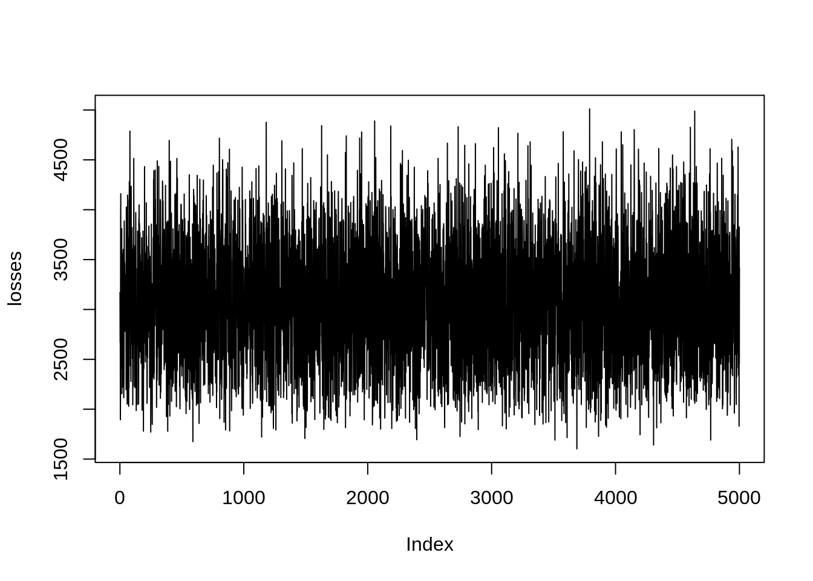
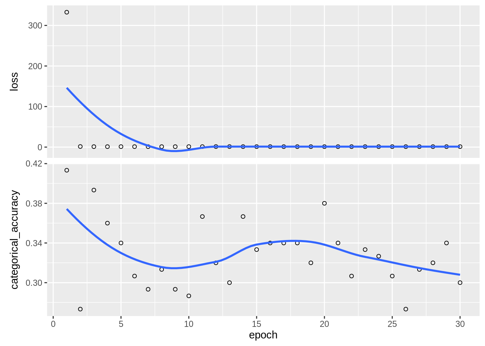
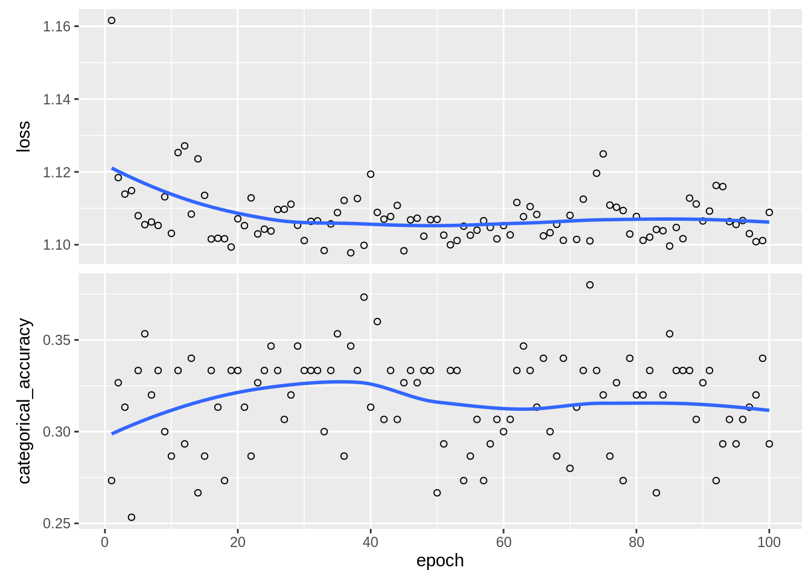
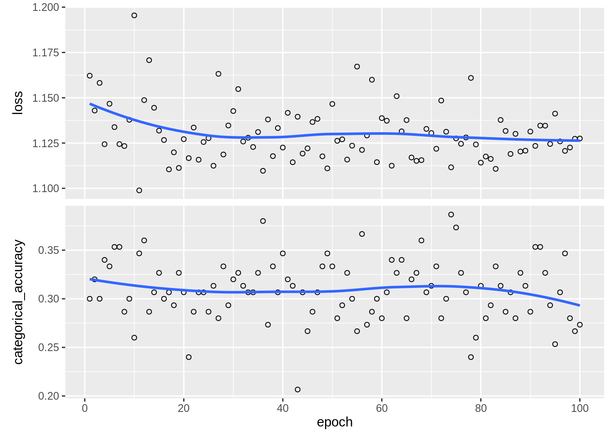
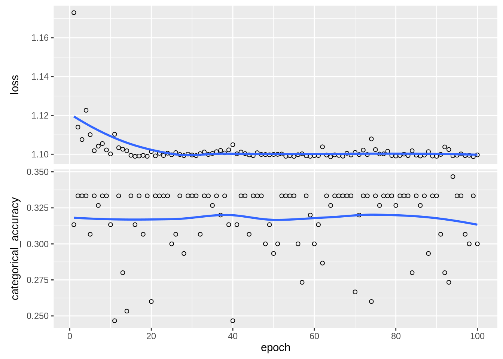
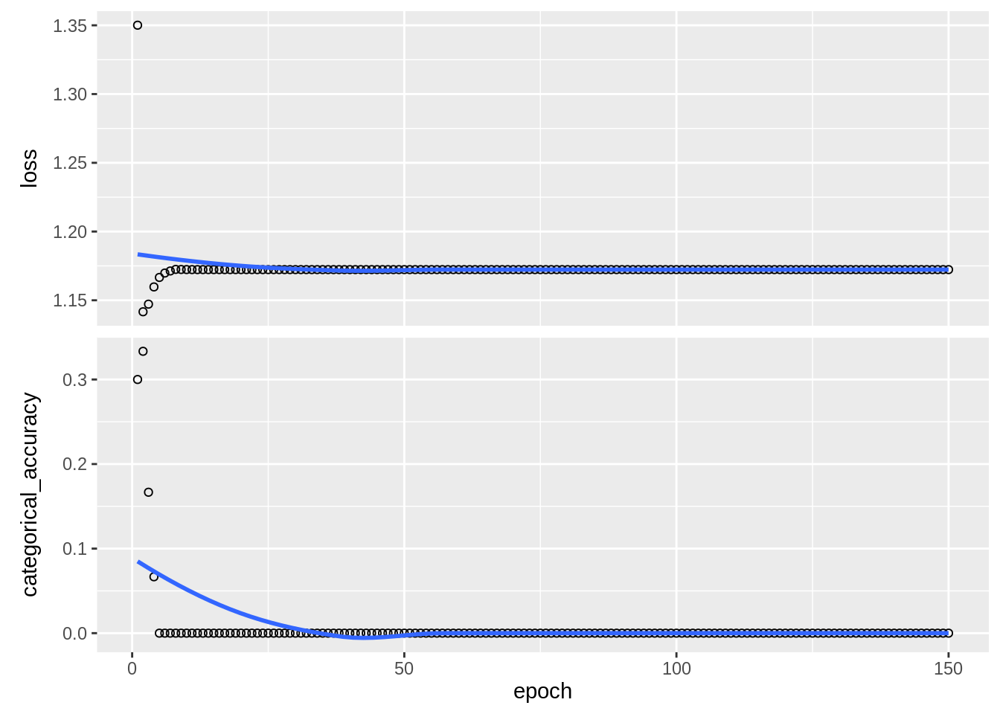
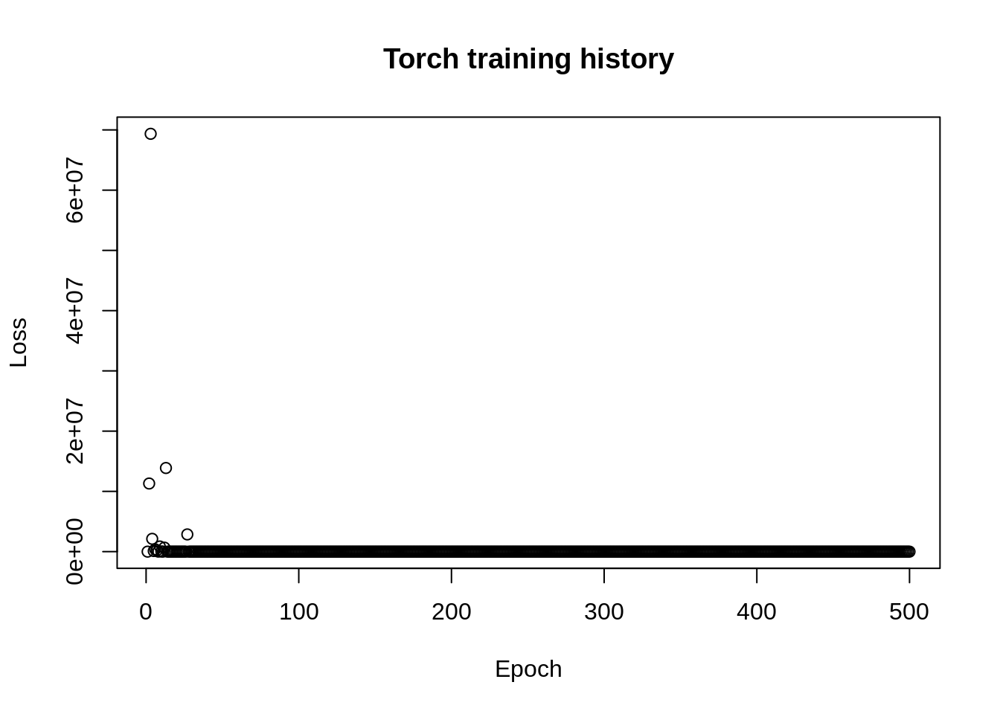
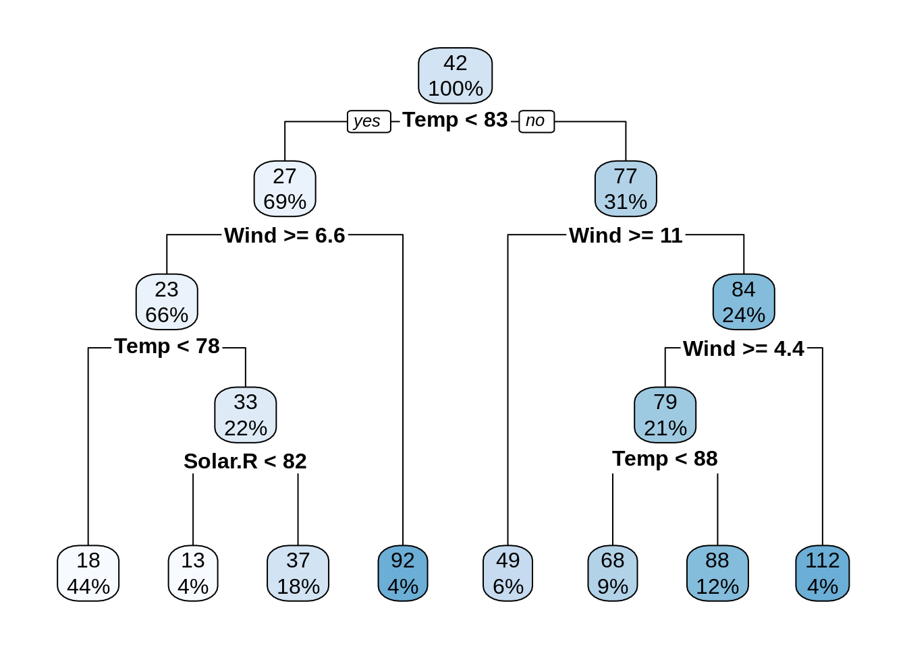
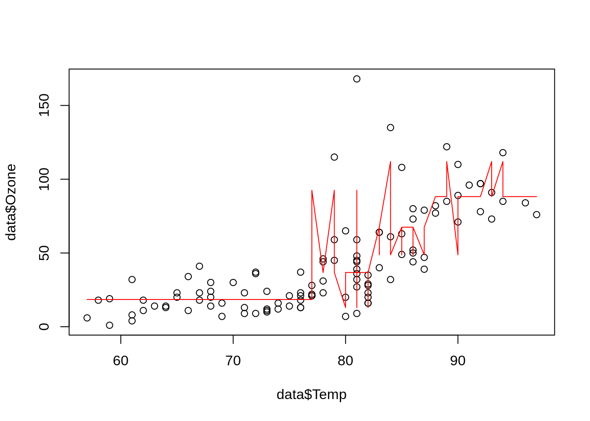

# Common Machine Learning algorithms {#fundamental}

```{=html}
<!-- Put this here (right after the first markdown headline) and only here for each document! -->
<script src="./scripts/multipleChoice.js"></script>
```


## Machine Learning Principles


### Optimization

Out of Wikipedia: "An optimization problem is the problem of finding the best solution from all feasible solutions".

Why do we need this "optimization"?

Somehow, we need to tell the algorithm what it should learn. To do so we have the so called **loss function**, which expresses what our goal is. But we also need to find the configurations where the loss function attains its minimum. This is the job of the optimizer. Thus, an optimization consists of:

* A **loss function** (e.g. we tell the algorithm in each training step how many observations were misclassified) guides the training of machine learning algorithms.

* The **optimizer**, which tries to update the weights of the machine learning algorithms in a way that the loss function is minimized.

Calculating the global optimum analytically is a non-trivial problem and thus a bunch of diverse optimization algorithms evolved.

Some optimization algorithms are inspired by biological systems e.g. ants, bees or even slimes. These optimizers are explained in the following video, have a look:

<iframe width="560" height="315" 
  src="https://www.youtube.com/embed/X-iSQQgOd1A"
  frameborder="0" allow="accelerometer; autoplay; encrypted-media;
  gyroscope; picture-in-picture" allowfullscreen>
  </iframe>

### Questions

```{=html}
  <hr/>
  	<p>
      <script>
        makeMultipleChoiceForm(
  				'In the lecture, it was said that, during training, machine learning parameters are optimised to get a good fit (loss function) to training data. Which of the following statements about loss functions is correct?',
  				'checkbox',
  				[
  					{
  						'answer':'A loss function measures the difference between the (current) machine learning model prediction and the data.',
  						'correct':true,
  						'explanationIfSelected':'',
  						'explanationIfNotSelected':'',
  						'explanationGeneral':''
  					},
  					{
  						'answer':'When we specify a simple line as our machine learning model, all loss functions will lead to the same line.',
  						'correct':false,
  						'explanationIfSelected':'',
  						'explanationIfNotSelected':'',
  						'explanationGeneral':''
  					},
  					{
  						'answer':'Cross-Entropy and Kullback–Leibler divergence are common loss functions.',
  						'correct':true,
  						'explanationIfSelected':'',
  						'explanationIfNotSelected':'',
  						'explanationGeneral':''
  					},
  					{
  						'answer':'For regression, there is only one sensible loss function, and this is the mean squared error.',
  						'correct':false,
  						'explanationIfSelected':'',
  						'explanationIfNotSelected':'',
  						'explanationGeneral':''
            }
          ],
          ''
        );
      </script>
    </p>
  <hr/>
```


#### Small Optimization Example

As an easy example for an optimization we can think of a quadratic function:


```r
func = function(x){ return(x^2) }
```

This function is so easy, we can randomly probe it and identify the optimum by plotting.


```r
set.seed(123)

a = rnorm(100)
plot(a, func(a))
```


The minimal value is at $x = 0$ (to be honest, we can calculate this analytically in this simple case).

We can also use an optimizer with the optim-function (the first argument is the starting value):


```r
set.seed(123)

opt = optim(1.0, func, method = "Brent", lower = -100, upper = 100)
print(opt$par)
#> [1] -3.552714e-15
```

opt$par will return the best values found by the optimizer, which is really close to zero :)


### Advanced Optimization Example

Optimization is also done when fitting a linear regression model. Thereby, we optimize the weights (intercept and slope). Just using lm(y~x) is too simple. We want to do this by hand to also better understand what optimization is and how it works.

As an example we take the airquality data set. First, we have to be sure to have no NAs in there. Then we split into response (Ozone) and predictors (Month, Day, Solar.R, Wind, Temp). Additionally it is beneficial for the optimizer, when the different predictors have the same support, and thus we scale them. 


```r
data = airquality[complete.cases(airquality$Ozone) & complete.cases(airquality$Solar.R),]
X = scale(data[,-1])
Y = data$Ozone
```

The model we want to optimize: $Ozone = Solar.R \cdot X1 + Wind \cdot X2 + Temp \cdot X3 + Month \cdot X4 + Day \cdot X5 + X6$

We assume that the residuals are normally distributed, and our loss function to be the mean squared error: $\mathrm{mean}(predicted~ozone - true~ozone)^{2}$

Our task is now to find the parameters $X1,\dots,X6$ for which this loss function is minimal. Therefore, we implement a function, that takes parameters and returns the loss.


```r
linear_regression = function(w){
  pred = w[1]*X[,1] + # Solar.R
         w[2]*X[,2] + # Wind
         w[3]*X[,3] + # Temp
         w[4]*X[,4] + # Month
         w[5]*X[,5] +
         w[6]         # or X * w[1:5]^T + w[6]
  # loss  = MSE, we want to find the optimal weights 
  # to minimize the sum of squared residuals.
  loss = mean((pred - Y)^2)
  return(loss)
}
```

For example we can sample some weights and see how the loss changes with this weights.


```r
set.seed(123)

linear_regression(runif(6))
#> [1] 2866.355
```

We can try to find the optimum by bruteforce (what means we will use a random set of weights and see for which the loss function is minimal):


```r
set.seed(123)

random_search = matrix(runif(6*5000, -10, 10), 5000, 6)
losses = apply(random_search, 1, linear_regression)
plot(losses, type = "l")
```



```r
random_search[which.min(losses),]
#> [1]  7.411631 -7.018960  9.376949  6.490659  5.432706  9.460573
```

In most cases, bruteforce isn't a good approach. It might work well with only a few parameters, but with increasing complexity and more parameters it will take a long time. Furthermore it is not guaranteed that it finds a stable solution on continuous data.

In R the optim function helps computing the optimum faster.


```r
opt = optim(runif(6, -1, 1), linear_regression)
opt$par
#> [1]   1.631666 -17.272902  11.645608  -7.371417   1.754860  42.577956
```

In the background, mostly some _gradient descent_ methods are used.

By comparing the weights from the optimizer to the estimated weights of the lm() function, we see that our self-written code obtains the same weights as the lm. Keep in mind, that our simple method uses random numbers thus the results might differ each run (without setting the seed).


```r
coef(lm(Y~X))
#> (Intercept)    XSolar.R       XWind       XTemp      XMonth        XDay 
#>   42.099099    4.582620  -11.806072   18.066786   -4.479175    2.384705
```


### Regularization

Regularization means adding information or structure to a system in order to solve an ill-posed optimization problem or to prevent overfitting. There are many ways of regularizing a machine learning model. The most important distinction is between _shrinkage estimators_ and estimators based on _model averaging_. 

**Shrikage estimators** are based on the idea of adding a penalty to the loss function that penalizes deviations of the model parameters from a particular value (typically 0). In this way, estimates are *"shrunk"* to the specified default value. In practice, the most important penalties are the least absolute shrinkage and selection operator; also _Lasso_ or _LASSO_, where the penalty is proportional to the sum of absolute deviations ($L1$ penalty), and the _Tikhonov regularization_ aka _Ridge regression_, where the penalty is proportional to the sum of squared distances from the reference ($L2$ penalty). Thus, the loss function that we optimize is given by

$$
loss = fit - \lambda \cdot d
$$

where fit refers to the standard loss function, $\lambda$ is the strength of the regularization, and $d$ is the chosen metric, e.g. $L1$ or$L2$:

$$
loss_{L1} = fit - \lambda \cdot \Vert weights \Vert_1
$$
$$
loss_{L2} = fit - \lambda \cdot \Vert weights \Vert_2
$$

$\lambda$ and possibly d are typically optimized under cross-validation. $L1$ and $L2$ can be also combined what is then called _elastic net_ (see @zou2005).

**Model averaging** refers to an entire set of techniques, including _boosting_, _bagging_ and other averaging techniques. The general principle is that predictions are made by combining (= averaging) several models. This is based on on the insight that it is often more efficient having many simpler models and average them, than one "super model". The reasons are complicated, and explained in more detail in @dormann2018.

A particular important application of averaging is _boosting_, where the idea is that many weak learners are combined to a model average, resulting in a strong learner. Another related method is _bootstrap aggregating_, also called _bagging_. Idea here is to _boostrap_ (use random sampling with replacement ) the data, and average the bootstrapped predictions.

To see how these techniques work in practice, let's first focus on LASSO and Ridge regularization for weights in neural networks. We can imagine that the LASSO and Ridge act similar to a rubber band on the weights that pulls them to zero if the data does not strongly push them away from zero. This leads to important weights, which are supported by the data, being estimated as different from zero, whereas unimportant model structures are reduced (shrunken) to zero.

LASSO $\left(penalty \propto \sum_{}^{} \mathrm{abs}(weights) \right)$ and Ridge $\left(penalty \propto \sum_{}^{} weights^{2} \right)$ have slightly different properties. They are best understood if we express those as the effective prior preference they create on the parameters:


As you can see, the LASSO creates a very strong preference towards exactly zero, but falls off less strongly towards the tails. This means that parameters tend to be estimated either to exactly zero, or, if not, they are more free than the Ridge. For this reason, LASSO is often more interpreted as a model selection method. 

The Ridge, on the other hand, has a certain area around zero where it is relatively indifferent about deviations from zero, thus rarely leading to exactly zero values. However, it will create a stronger shrinkage for values that deviate significantly from zero. 

We can implement the linear regression also in Keras, when we do not specify any hidden layers:

::::: {.panelset}

::: {.panel}
[Keras]{.panel-name}


```r
library(tensorflow)
library(keras)
set_random_seed(321L, disable_gpu = FALSE)	# Already sets R's random seed.
#> Loaded Tensorflow version 2.9.1

data = airquality[complete.cases(airquality),]
X = scale(data[,-1])
Y = data$Ozone
# L1/L2 on linear model.

model = keras_model_sequential()
model %>%
 layer_dense(units = 1L, activation = "linear", input_shape = list(dim(X)[2]))
summary(model)
#> Model: "sequential"
#> __________________________________________________________________________________________
#>  Layer (type)                           Output Shape                        Param #       
#> ==========================================================================================
#>  dense (Dense)                          (None, 1)                           6             
#> ==========================================================================================
#> Total params: 6
#> Trainable params: 6
#> Non-trainable params: 0
#> __________________________________________________________________________________________

model %>%
 compile(loss = loss_mean_squared_error, optimizer_adamax(learning_rate = 0.5),
         metrics = c(metric_mean_squared_error))

model_history =
 model %>%
 fit(x = X, y = Y, epochs = 100L, batch_size = 20L, shuffle = TRUE)

unconstrained = model$get_weights()
summary(lm(Y~X))
#> 
#> Call:
#> lm(formula = Y ~ X)
#> 
#> Residuals:
#>     Min      1Q  Median      3Q     Max 
#> -37.014 -12.284  -3.302   8.454  95.348 
#> 
#> Coefficients:
#>             Estimate Std. Error t value Pr(>|t|)    
#> (Intercept)   42.099      1.980  21.264  < 2e-16 ***
#> XSolar.R       4.583      2.135   2.147   0.0341 *  
#> XWind        -11.806      2.293  -5.149 1.23e-06 ***
#> XTemp         18.067      2.610   6.922 3.66e-10 ***
#> XMonth        -4.479      2.230  -2.009   0.0471 *  
#> XDay           2.385      2.000   1.192   0.2358    
#> ---
#> Signif. codes:  0 '***' 0.001 '**' 0.01 '*' 0.05 '.' 0.1 ' ' 1
#> 
#> Residual standard error: 20.86 on 105 degrees of freedom
#> Multiple R-squared:  0.6249,	Adjusted R-squared:  0.6071 
#> F-statistic: 34.99 on 5 and 105 DF,  p-value: < 2.2e-16
coef(lm(Y~X))
#> (Intercept)    XSolar.R       XWind       XTemp      XMonth        XDay 
#>   42.099099    4.582620  -11.806072   18.066786   -4.479175    2.384705
```

:::

::: {.panel}
[Torch]{.panel-name}
  

```r
library(torch)
torch_manual_seed(321L)
set.seed(123)

model_torch = nn_sequential(
  nn_linear(in_features = dim(X)[2], out_features = 1L)
)
opt = optim_adam(params = model_torch$parameters, lr = 0.5)

X_torch = torch_tensor(X)
Y_torch = torch_tensor(matrix(Y, ncol = 1L), dtype = torch_float32())
for(i in 1:500){
  indices = sample.int(nrow(X), 20L)
  opt$zero_grad()
  pred = model_torch(X_torch[indices, ])
  loss = nnf_mse_loss(pred, Y_torch[indices,,drop = FALSE])
  loss$sum()$backward()
  opt$step()
}
coef(lm(Y~X))
#> (Intercept)    XSolar.R       XWind       XTemp      XMonth        XDay 
#>   42.099099    4.582620  -11.806072   18.066786   -4.479175    2.384705
model_torch$parameters
#> $`0.weight`
#> torch_tensor
#>   4.1083 -10.1831  18.2815  -4.3478   1.2937
#> [ CPUFloatType{1,5} ][ requires_grad = TRUE ]
#> 
#> $`0.bias`
#> torch_tensor
#>  42.0958
#> [ CPUFloatType{1} ][ requires_grad = TRUE ]
```

:::

:::::

TensorFlow and thus Keras also allow use using LASSO and Ridge on the weights. 
Lets see what happens when we put an $L1$ (LASSO) regularization on the weights:

::::: {.panelset}

::: {.panel}
[Keras]{.panel-name}


```r
library(tensorflow)
library(keras)
set_random_seed(321L, disable_gpu = FALSE)	# Already sets R's random seed.

model = keras_model_sequential()
model %>% # Remind the penalty lambda that is set to 10 here.
  layer_dense(units = 1L, activation = "linear", input_shape = list(dim(X)[2]), 
              kernel_regularizer = regularizer_l1(10),
              bias_regularizer = regularizer_l1(10))
summary(model)
#> Model: "sequential_1"
#> __________________________________________________________________________________________
#>  Layer (type)                           Output Shape                        Param #       
#> ==========================================================================================
#>  dense_1 (Dense)                        (None, 1)                           6             
#> ==========================================================================================
#> Total params: 6
#> Trainable params: 6
#> Non-trainable params: 0
#> __________________________________________________________________________________________

model %>%
  compile(loss = loss_mean_squared_error, optimizer_adamax(learning_rate = 0.5),
          metrics = c(metric_mean_squared_error))

model_history =
  model %>%
  fit(x = X, y = Y, epochs = 30L, batch_size = 20L, shuffle = TRUE)

l1 = model$get_weights()
summary(lm(Y~X))
#> 
#> Call:
#> lm(formula = Y ~ X)
#> 
#> Residuals:
#>     Min      1Q  Median      3Q     Max 
#> -37.014 -12.284  -3.302   8.454  95.348 
#> 
#> Coefficients:
#>             Estimate Std. Error t value Pr(>|t|)    
#> (Intercept)   42.099      1.980  21.264  < 2e-16 ***
#> XSolar.R       4.583      2.135   2.147   0.0341 *  
#> XWind        -11.806      2.293  -5.149 1.23e-06 ***
#> XTemp         18.067      2.610   6.922 3.66e-10 ***
#> XMonth        -4.479      2.230  -2.009   0.0471 *  
#> XDay           2.385      2.000   1.192   0.2358    
#> ---
#> Signif. codes:  0 '***' 0.001 '**' 0.01 '*' 0.05 '.' 0.1 ' ' 1
#> 
#> Residual standard error: 20.86 on 105 degrees of freedom
#> Multiple R-squared:  0.6249,	Adjusted R-squared:  0.6071 
#> F-statistic: 34.99 on 5 and 105 DF,  p-value: < 2.2e-16
coef(lm(Y~X))
#> (Intercept)    XSolar.R       XWind       XTemp      XMonth        XDay 
#>   42.099099    4.582620  -11.806072   18.066786   -4.479175    2.384705
cbind(unlist(l1), unlist(unconstrained))
#>             [,1]       [,2]
#> [1,]  1.69559026   4.576884
#> [2,] -8.43734646 -11.771938
#> [3,] 12.91758442  18.096060
#> [4,]  0.01775982  -4.407187
#> [5,]  0.01594419   2.432310
#> [6,] 33.05084229  42.205029
```

One can clearly see that parameters are pulled towards zero because of the regularization.

:::

::: {.panel}
[Torch]{.panel-name}
  
In Torch, we have to specify the regularization on our own when calculating the loss.
    

```r
library(torch)
torch_manual_seed(321L)
set.seed(123)

model_torch = nn_sequential(
  nn_linear(in_features = dim(X)[2], out_features = 1L)
)
opt = optim_adam(params = model_torch$parameters, lr = 0.5)

X_torch = torch_tensor(X)
Y_torch = torch_tensor(matrix(Y, ncol = 1L), dtype = torch_float32())
for(i in 1:500){
  indices = sample.int(nrow(X), 20L)
  opt$zero_grad()
  pred = model_torch(X_torch[indices, ])
  loss = nnf_mse_loss(pred, Y_torch[indices,,drop = FALSE])
  
  # Add L1:
  for(i in 1:length(model_torch$parameters)){
    # Remind the penalty lambda that is set to 10 here.
    loss = loss + model_torch$parameters[[i]]$abs()$sum()*10.0
  }
  
  loss$sum()$backward()
  opt$step()
}
coef(lm(Y~X))
#> (Intercept)    XSolar.R       XWind       XTemp      XMonth        XDay 
#>   42.099099    4.582620  -11.806072   18.066786   -4.479175    2.384705
model_torch$parameters
#> $`0.weight`
#> torch_tensor
#>   0.7787  -6.5937  14.6648  -0.0670   0.0475
#> [ CPUFloatType{1,5} ][ requires_grad = TRUE ]
#> 
#> $`0.bias`
#> torch_tensor
#>  37.2661
#> [ CPUFloatType{1} ][ requires_grad = TRUE ]
```

:::

:::::

### Exercise {#exerexer}

```{=html}
  <hr/>
  In our linear regression model for the airquality dataset we only had to optimize 6 parameters/weights...
... in neural networks, we have to optimize thousands, up to billions of weights.
You can surlely imagine that the surface of the loss function is very complex, with many local optima. 
Finding a global optimum is almost impossible, most of the times we are only searching for good local optima.

The learning rate of the optimizers defines the step size in which the weights of the neural network are updated:

<ul>
  <li>Too high learning rates and optima might be jumped over.</li>
  <li>Too low learning rates and we might be land in local optima or it might take too long.</li>
</ul> 

Below, there is the code for the iris dataset.

Try out different learning rates, very high and very low learning rates, can you see a difference?
```

::::: {.panelset}

::: {.panel}
[Keras]{.panel-name}


```r
library(tensorflow)
library(keras)
set_random_seed(321L, disable_gpu = FALSE)	# Already sets R's random seed.
#> Loaded Tensorflow version 2.9.1

iris = datasets::iris
X = scale(iris[,1:4])
Y = iris[,5]
Y = keras::k_one_hot(as.integer(Y)-1L, 3)

model = keras_model_sequential()
model %>%
  layer_dense(units = 20L, activation = "relu", input_shape = list(4L)) %>%
  layer_dense(units = 20L, activation = "relu", ) %>%
  layer_dense(units = 20L, activation = "relu", ) %>%
  layer_dense(units = 3L, activation = "softmax")
# Softmax scales to (0, 1]; 3 output nodes for 3 response classes/labels.
# The labels MUST start at 0!

model %>%
  compile(loss = loss_categorical_crossentropy,
          optimizer_adamax(learning_rate = 0.5),
          metrics = c(metric_categorical_accuracy)
  )

model_history =
  model %>%
  fit(x = X, y = Y, epochs = 30L, batch_size = 20L, shuffle = TRUE)

model %>%
  evaluate(X, Y)
#>                 loss categorical_accuracy 
#>           0.04419739           0.98666668

plot(model_history)
```


:::

::: {.panel}
[Torch]{.panel-name}


```r
library(torch)
torch_manual_seed(321L)
set.seed(123)

iris = datasets::iris
X = scale(iris[,1:4])
Y = iris[,5]
Y = as.integer(Y)

model_torch = nn_sequential(
  nn_linear(in_features = dim(X)[2], out_features = 20L),
  nn_relu(),
  nn_linear(in_features = 20L, out_features = 20L, bias = TRUE),
  nn_relu(),
  nn_linear(in_features = 20L, out_features = 20L, bias = TRUE),
  nn_relu(),
  nn_linear(in_features = 20L, out_features = 3L, bias = TRUE)
)
opt = optim_adam(params = model_torch$parameters, lr = 0.5)

batch_size = 20L
X_torch = torch_tensor(X)
Y_torch = torch_tensor(Y, dtype = torch_long())
losses = rep(NA, 500)
for(i in 1:500){
  indices = sample.int(nrow(X), batch_size)
  opt$zero_grad()
  pred = model_torch(X_torch[indices, ])
  loss = nnf_cross_entropy(pred, Y_torch[indices])
  losses[[i]] = as.numeric(loss)
  loss$sum()$backward()
  opt$step()
}

plot(losses, main = "Torch training history", xlab = "Epoch", ylab = "Loss")
```


:::

:::::


```{=html}
  <details>
    <summary>
      <strong><span style="color: #0011AA; font-size:18px;">Solution</span></strong>
    </summary>
    <p>
```

::::: {.panelset}

::: {.panel}
[Keras]{.panel-name}


```r
keras::reset_states(model)

model %>%
  compile(loss = loss_categorical_crossentropy,
          optimizer_adamax(learning_rate = 0.005),
          metrics = c(metric_categorical_accuracy)
  )

model_history2 =
  model %>%
  fit(x = X, y = Y, epochs = 30L, batch_size = 20L, shuffle = TRUE)

model %>%
  evaluate(X, Y)
#>                 loss categorical_accuracy 
#>           0.04000897           0.98666668

plot(model_history2)
```


```r

##########  -> (very) Low learning rate: May take (very) long 
#           (and may need very many epochs) and get stuck in local optima.

keras::reset_states(model)

model %>%
  compile(loss = loss_categorical_crossentropy,
          optimizer_adamax(learning_rate = 0.00001),
          metrics = c(metric_categorical_accuracy)
  )

model_history3 =
  model %>%
  fit(x = X, y = Y, epochs = 30L, batch_size = 20L, shuffle = TRUE)

model %>%
  evaluate(X, Y)
#>                 loss categorical_accuracy 
#>            0.0399975            0.9866667

plot(model_history3)
```


```r

keras::reset_states(model)

# Try higher epoch number
model %>%
  compile(loss = loss_categorical_crossentropy,
          optimizer_adamax(learning_rate = 0.00001),
          metrics = c(metric_categorical_accuracy)
  )

model_history4 =
  model %>%
  fit(x = X, y = Y, epochs = 200L, batch_size = 20L, shuffle = TRUE)

model %>%
  evaluate(X, Y)
#>                 loss categorical_accuracy 
#>           0.03996202           0.98666668

plot(model_history4)
```


```r

##########  -> (very) High learning rate (may skip optimum).

keras::reset_states(model)

model %>%
  compile(loss = loss_categorical_crossentropy,
          optimizer_adamax(learning_rate = 3),
          metrics = c(metric_categorical_accuracy)
  )

model_history5 =
  model %>%
  fit(x = X, y = Y, epochs = 30L, batch_size = 20L, shuffle = TRUE)

model %>%
  evaluate(X, Y)
#>                 loss categorical_accuracy 
#>            1.3998153            0.9666666

plot(model_history5)
```



```r

##########  -> Higher epoch number (possibly better fitting, maybe overfitting).

keras::reset_states(model)

model %>%
  compile(loss = loss_categorical_crossentropy,
          optimizer_adamax(learning_rate = 3),
          metrics = c(metric_categorical_accuracy)
  )

model_history6 =
  model %>%
  fit(x = X, y = Y, epochs = 100L, batch_size = 20L, shuffle = TRUE)

model %>%
  evaluate(X, Y)
#>                 loss categorical_accuracy 
#>            7.6132493            0.3333333

plot(model_history6)
```


```r

##########

keras::reset_states(model)

model %>%
  compile(loss = loss_categorical_crossentropy,
          optimizer_adamax(learning_rate = 0.5),
          metrics = c(metric_categorical_accuracy)
  )

model_history7 =
  model %>%
  fit(x = X, y = Y, epochs = 100L, batch_size = 20L, shuffle = TRUE)

model %>%
  evaluate(X, Y)
#>                 loss categorical_accuracy 
#>            1.2877126            0.3333333

plot(model_history7)
```



```r

##########

keras::reset_states(model)

model %>%
  compile(loss = loss_categorical_crossentropy,
          optimizer_adamax(learning_rate = 0.00001),
          metrics = c(metric_categorical_accuracy)
  )

model_history8 =
  model %>%
  fit(x = X, y = Y, epochs = 100L, batch_size = 20L, shuffle = TRUE)

model %>%
  evaluate(X, Y)
#>                 loss categorical_accuracy 
#>            1.1118358            0.3333333

plot(model_history8)
```


```r

##########  -> Lower batch size.

keras::reset_states(model)

model %>%
  compile(loss = loss_categorical_crossentropy,
          optimizer_adamax(learning_rate = 3),
          metrics = c(metric_categorical_accuracy)
  )

model_history9 =
  model %>%
  fit(x = X, y = Y, epochs = 100L, batch_size = 5L, shuffle = TRUE)

model %>%
  evaluate(X, Y)
#>                 loss categorical_accuracy 
#>            1.2418699            0.3333333

plot(model_history9)
```


```r

##########

keras::reset_states(model)

model %>%
  compile(loss = loss_categorical_crossentropy,
          optimizer_adamax(learning_rate = 0.5),
          metrics = c(metric_categorical_accuracy)
  )

model_history10 =
  model %>%
  fit(x = X, y = Y, epochs = 100L, batch_size = 5L, shuffle = TRUE)

model %>%
  evaluate(X, Y)
#>                 loss categorical_accuracy 
#>            1.1917901            0.3333333

plot(model_history10)
```



```r

##########

keras::reset_states(model)

model %>%
  compile(loss = loss_categorical_crossentropy,
          optimizer_adamax(learning_rate = 0.00001),
          metrics = c(metric_categorical_accuracy)
  )

model_history11 =
  model %>%
  fit(x = X, y = Y, epochs = 100L, batch_size = 5L, shuffle = TRUE)

model %>%
  evaluate(X, Y)
#>                 loss categorical_accuracy 
#>            1.1628621            0.3333333

plot(model_history11)
```


```r

##########  -> Higher batch size (faster but less accurate).

keras::reset_states(model)

model %>%
  compile(loss = loss_categorical_crossentropy,
          optimizer_adamax(learning_rate = 3),
          metrics = c(metric_categorical_accuracy)
  )

model_history12 =
  model %>%
  fit(x = X, y = Y, epochs = 100L, batch_size = 50L, shuffle = TRUE)

model %>%
  evaluate(X, Y)
#>                 loss categorical_accuracy 
#>            1.1135705            0.3333333

plot(model_history12)
```


```r

##########

keras::reset_states(model)

model %>%
  compile(loss = loss_categorical_crossentropy,
          optimizer_adamax(learning_rate = 0.5),
          metrics = c(metric_categorical_accuracy)
  )

model_history13 =
  model %>%
  fit(x = X, y = Y, epochs = 100L, batch_size = 50L, shuffle = TRUE)

model %>%
  evaluate(X, Y)
#>                 loss categorical_accuracy 
#>            1.1114935            0.3333333

plot(model_history13)
```



```r

##########

keras::reset_states(model)

model %>%
  compile(loss = loss_categorical_crossentropy,
          optimizer_adamax(learning_rate = 0.00001),
          metrics = c(metric_categorical_accuracy)
  )

model_history14 =
  model %>%
  fit(x = X, y = Y, epochs = 100L, batch_size = 50L, shuffle = TRUE)

model %>%
  evaluate(X, Y)
#>                 loss categorical_accuracy 
#>            1.1036538            0.3333333

plot(model_history14)
```


```r

####################
####################

keras::reset_states(model)

model %>%
  compile(loss = loss_categorical_crossentropy,
          optimizer_adamax(learning_rate = 0.05),
          metrics = c(metric_categorical_accuracy)
  )

model_history15 =
  model %>%
  fit(x = X, y = Y, epochs = 150L, batch_size = 50L, shuffle = TRUE)

plot(model_history15)
```


```r

##########  -> shuffle = FALSE (some kind of overfitting)

keras::reset_states(model)

model %>%
  compile(loss = loss_categorical_crossentropy,
          optimizer_adamax(learning_rate = 0.05),
          metrics = c(metric_categorical_accuracy)
  )

model_history16 =
  model %>%
  fit(x = X, y = Y, epochs = 150L, batch_size = 50L, shuffle = FALSE)

plot(model_history16)
```


```r

##########  -> shuffle = FALSE + lower batch size

keras::reset_states(model)

model %>%
  compile(loss = loss_categorical_crossentropy,
          optimizer_adamax(learning_rate = 0.05),
          metrics = c(metric_categorical_accuracy)
  )

model_history17 =
  model %>%
  fit(x = X, y = Y, epochs = 150L, batch_size = 5L, shuffle = FALSE)

plot(model_history17)
```



```r

##########  -> shuffle = FALSE + higher batch size
#           (Many samples are taken at once, so no "hopping" any longer.)

keras::reset_states(model)

model %>%
  compile(loss = loss_categorical_crossentropy,
          optimizer_adamax(learning_rate = 0.05),
          metrics = c(metric_categorical_accuracy)
  )

model_history18 =
  model %>%
  fit(x = X, y = Y, epochs = 150L, batch_size = 75L, shuffle = FALSE)

plot(model_history18)
```


:::

::: {.panel}
[Torch]{.panel-name}


```r

opt = optim_adam(params = model_torch$parameters, lr = 0.5)

batch_size = 20L
X_torch = torch_tensor(X)
Y_torch = torch_tensor(Y, dtype = torch_long())
losses = rep(NA, 500)
for(i in 1:500){
  indices = sample.int(nrow(X), batch_size)
  opt$zero_grad()
  pred = model_torch(X_torch[indices, ])
  loss = nnf_cross_entropy(pred, Y_torch[indices])
  losses[[i]] = as.numeric(loss)
  loss$sum()$backward()
  opt$step()
}

plot(losses, main = "Torch training history", xlab = "Epoch", ylab = "Loss")
```


```r

##########

# reset parameters

.n = lapply(model_torch$children, function(layer) { if(!is.null(layer$parameters)) layer$reset_parameters() } )
opt = optim_adam(params = model_torch$parameters, lr = 5.5)

batch_size = 20L
X_torch = torch_tensor(X)
Y_torch = torch_tensor(Y, dtype = torch_long())
losses = rep(NA, 500)
for(i in 1:500){
  indices = sample.int(nrow(X), batch_size)
  opt$zero_grad()
  pred = model_torch(X_torch[indices, ])
  loss = nnf_cross_entropy(pred, Y_torch[indices])
  losses[[i]] = as.numeric(loss)
  loss$sum()$backward()
  opt$step()
}

plot(losses, main = "Torch training history", xlab = "Epoch", ylab = "Loss")
```


```r

##########

# reset parameters

.n = lapply(model_torch$children, function(layer) { if(!is.null(layer$parameters)) layer$reset_parameters() } )
opt = optim_adam(params = model_torch$parameters, lr = 15.5)

batch_size = 20L
X_torch = torch_tensor(X)
Y_torch = torch_tensor(Y, dtype = torch_long())
losses = rep(NA, 500)
for(i in 1:500){
  indices = sample.int(nrow(X), batch_size)
  opt$zero_grad()
  pred = model_torch(X_torch[indices, ])
  loss = nnf_cross_entropy(pred, Y_torch[indices])
  losses[[i]] = as.numeric(loss)
  loss$sum()$backward()
  opt$step()
}

plot(losses, main = "Torch training history", xlab = "Epoch", ylab = "Loss")
```




:::

:::::


Play around with the parameters on your own!

```{=html}
    </p>
  </details>
  <br/><hr/>
```


## Artificial Neural Networks

::::: {.panelset}

::: {.panel}
[Keras]{.panel-name}


Now, we will come to artificial neural networks (ANNs), for which the topic of regularization is very important. We can specify the regularization in each layer via the kernel_regularization (and/or the bias_regularization) argument.


```r
library(tensorflow)
library(keras)
set_random_seed(321L, disable_gpu = FALSE)	# Already sets R's random seed.

data = airquality
summary(data)
#>      Ozone           Solar.R           Wind             Temp           Month      
#>  Min.   :  1.00   Min.   :  7.0   Min.   : 1.700   Min.   :56.00   Min.   :5.000  
#>  1st Qu.: 18.00   1st Qu.:115.8   1st Qu.: 7.400   1st Qu.:72.00   1st Qu.:6.000  
#>  Median : 31.50   Median :205.0   Median : 9.700   Median :79.00   Median :7.000  
#>  Mean   : 42.13   Mean   :185.9   Mean   : 9.958   Mean   :77.88   Mean   :6.993  
#>  3rd Qu.: 63.25   3rd Qu.:258.8   3rd Qu.:11.500   3rd Qu.:85.00   3rd Qu.:8.000  
#>  Max.   :168.00   Max.   :334.0   Max.   :20.700   Max.   :97.00   Max.   :9.000  
#>  NA's   :37       NA's   :7                                                       
#>       Day      
#>  Min.   : 1.0  
#>  1st Qu.: 8.0  
#>  Median :16.0  
#>  Mean   :15.8  
#>  3rd Qu.:23.0  
#>  Max.   :31.0  
#> 
data = data[complete.cases(data),] # Remove NAs.
summary(data)
#>      Ozone          Solar.R           Wind            Temp           Month      
#>  Min.   :  1.0   Min.   :  7.0   Min.   : 2.30   Min.   :57.00   Min.   :5.000  
#>  1st Qu.: 18.0   1st Qu.:113.5   1st Qu.: 7.40   1st Qu.:71.00   1st Qu.:6.000  
#>  Median : 31.0   Median :207.0   Median : 9.70   Median :79.00   Median :7.000  
#>  Mean   : 42.1   Mean   :184.8   Mean   : 9.94   Mean   :77.79   Mean   :7.216  
#>  3rd Qu.: 62.0   3rd Qu.:255.5   3rd Qu.:11.50   3rd Qu.:84.50   3rd Qu.:9.000  
#>  Max.   :168.0   Max.   :334.0   Max.   :20.70   Max.   :97.00   Max.   :9.000  
#>       Day       
#>  Min.   : 1.00  
#>  1st Qu.: 9.00  
#>  Median :16.00  
#>  Mean   :15.95  
#>  3rd Qu.:22.50  
#>  Max.   :31.00

X = scale(data[,2:6])
Y = data[,1]

model = keras_model_sequential()
penalty = 0.1
model %>%
  layer_dense(units = 100L, activation = "relu",
             input_shape = list(5L),
             kernel_regularizer = regularizer_l1(penalty)) %>%
  layer_dense(units = 100L, activation = "relu",
             kernel_regularizer = regularizer_l1(penalty) ) %>%
  layer_dense(units = 100L, activation = "relu",
             kernel_regularizer = regularizer_l1(penalty)) %>%
 # One output dimension with a linear activation function.
  layer_dense(units = 1L, activation = "linear",
             kernel_regularizer = regularizer_l1(penalty))

model %>%
 compile(
   loss = loss_mean_squared_error,
   keras::optimizer_adamax(learning_rate = 0.1)
  )

model_history =
 model %>%
 fit(x = X, y = matrix(Y, ncol = 1L), epochs = 100L,
     batch_size = 20L, shuffle = TRUE, validation_split = 0.2)

plot(model_history)
```


```r
weights = lapply(model$weights, function(w) w$numpy() )
fields::image.plot(weights[[1]])
```


:::

::: {.panel}
[Torch]{.panel-name}


Again, we have to do the regularization on our own in Torch:


```r
library(tensorflow)
library(keras)
set_random_seed(321L, disable_gpu = FALSE)	# Already sets R's random seed.

model_torch = nn_sequential(
  nn_linear(in_features = dim(X)[2], out_features = 100L),
  nn_relu(),
  nn_linear(100L, 100L),
  nn_relu(),
  nn_linear(100L, 100L),
  nn_relu(),
  nn_linear(100L, 1L),
)
opt = optim_adam(params = model_torch$parameters, lr = 0.1)

X_torch = torch_tensor(X)
Y_torch = torch_tensor(matrix(Y, ncol = 1L), dtype = torch_float32())
for(i in 1:500){
  indices = sample.int(nrow(X), 20L)
  opt$zero_grad()
  pred = model_torch(X_torch[indices, ])
  loss = nnf_mse_loss(pred, Y_torch[indices,,drop = FALSE])
  
  # Add L1 (only on the 'kernel weights'):
  for(i in seq(1, 8, by = 2)){
    loss = loss + model_torch$parameters[[i]]$abs()$sum()*0.1
  }
  
  loss$sum()$backward()
  opt$step()
}
```

Let's visualize the first (input) layer:


```r
fields::image.plot(as.matrix(model_torch$parameters$`0.weight`))
```


:::

:::::


Additionally to the usual $L1$ and $L2$ regularization there is another regularization: the so called **dropout-layer** (we will learn about this in more detail later).

### Exercise

```{=html}
  <strong><span style="color: #0011AA; font-size:18px;">1. Task</span></strong><br/>
```

The following code is our working example for the next exercises:


::::: {.panelset}

::: {.panel}
[Keras]{.panel-name}


```r
library(tensorflow)
library(keras)
set_random_seed(321L, disable_gpu = FALSE)	# Already sets R's random seed.

data = airquality[complete.cases(airquality),]
x = scale(data[,-1])
y = data$Ozone

model = keras_model_sequential()
model %>%
  layer_dense(units = 1L, activation = "linear", input_shape = list(dim(x)[2]), 
             kernel_regularizer = regularizer_l1(10),
             bias_regularizer = regularizer_l1(10))

model %>%
  compile(loss = loss_mean_squared_error, optimizer_adamax(learning_rate = 0.5))

model_history =
  model %>%
    fit(x = x, y = y, epochs = 60L, batch_size = 20L, shuffle = TRUE)

plot(model_history)
```


```r

l1 = model$get_weights()

linear = lm(y~x)
summary(linear)
#> 
#> Call:
#> lm(formula = y ~ x)
#> 
#> Residuals:
#>     Min      1Q  Median      3Q     Max 
#> -37.014 -12.284  -3.302   8.454  95.348 
#> 
#> Coefficients:
#>             Estimate Std. Error t value Pr(>|t|)    
#> (Intercept)   42.099      1.980  21.264  < 2e-16 ***
#> xSolar.R       4.583      2.135   2.147   0.0341 *  
#> xWind        -11.806      2.293  -5.149 1.23e-06 ***
#> xTemp         18.067      2.610   6.922 3.66e-10 ***
#> xMonth        -4.479      2.230  -2.009   0.0471 *  
#> xDay           2.385      2.000   1.192   0.2358    
#> ---
#> Signif. codes:  0 '***' 0.001 '**' 0.01 '*' 0.05 '.' 0.1 ' ' 1
#> 
#> Residual standard error: 20.86 on 105 degrees of freedom
#> Multiple R-squared:  0.6249,	Adjusted R-squared:  0.6071 
#> F-statistic: 34.99 on 5 and 105 DF,  p-value: < 2.2e-16

cat("Linear:     ", round(coef(linear), 3))
#> Linear:      42.099 4.583 -11.806 18.067 -4.479 2.385
# The last parameter is the intercept (first parameter in lm).
cat("L1:         ", round(c(unlist(l1)[length(unlist(l1))],
                            unlist(l1)[1:(length(unlist(l1)) - 1 )]), 3))
#> L1:          36.766 1.193 -8.446 13.394 -0.108 0.034
```


:::

::: {.panel}
[Torch]{.panel-name}


```r
library(torch)
torch_manual_seed(321L)
set.seed(123)

data = airquality[complete.cases(airquality),]
x = scale(data[,-1])
y = data$Ozone


model_torch = nn_sequential(
  nn_linear(in_features = dim(x)[2], out_features = 1L,  bias = TRUE)
)
opt = optim_adam(params = model_torch$parameters, lr = 0.5)

X_torch = torch_tensor(x)
Y_torch = torch_tensor(matrix(y, ncol = 1L), dtype = torch_float32())
lambda = torch_tensor(10.)
for(i in 1:500){
  indices = sample.int(nrow(x), 20L)
  opt$zero_grad()
  pred = model_torch(X_torch[indices, ])
  loss = nnf_mse_loss(pred, Y_torch[indices,,drop = FALSE])
  
  ## add L1 regularization
  
  for(i in 1:length(model_torch$parameters)) {
     # if(stringr::str_detect(names(model_torch$parameters)[[i]], "weight")) {
      loss = loss + lambda*torch_norm(model_torch$parameters[[i]], 1)
     # }
  }
  
  loss$sum()$backward()
  opt$step()
}

l1_torch = model_torch$parameters

linear = lm(y~x)
summary(linear)
#> 
#> Call:
#> lm(formula = y ~ x)
#> 
#> Residuals:
#>     Min      1Q  Median      3Q     Max 
#> -37.014 -12.284  -3.302   8.454  95.348 
#> 
#> Coefficients:
#>             Estimate Std. Error t value Pr(>|t|)    
#> (Intercept)   42.099      1.980  21.264  < 2e-16 ***
#> xSolar.R       4.583      2.135   2.147   0.0341 *  
#> xWind        -11.806      2.293  -5.149 1.23e-06 ***
#> xTemp         18.067      2.610   6.922 3.66e-10 ***
#> xMonth        -4.479      2.230  -2.009   0.0471 *  
#> xDay           2.385      2.000   1.192   0.2358    
#> ---
#> Signif. codes:  0 '***' 0.001 '**' 0.01 '*' 0.05 '.' 0.1 ' ' 1
#> 
#> Residual standard error: 20.86 on 105 degrees of freedom
#> Multiple R-squared:  0.6249,	Adjusted R-squared:  0.6071 
#> F-statistic: 34.99 on 5 and 105 DF,  p-value: < 2.2e-16

cat("Linear:     ", round(coef(linear), 3))
#> Linear:      42.099 4.583 -11.806 18.067 -4.479 2.385
cat("L1:         ", round(c(as.numeric( l1_torch$`0.bias` ),as.numeric( l1_torch$`0.weight` )), 3))
#> L1:          37.266 0.779 -6.594 14.665 -0.067 0.048
```


:::

:::::

What happens if you change the regularization from $L1$ to $L2$?

```{=html}
  <details>
    <summary>
      <strong><span style="color: #0011AA; font-size:18px;">Solution</span></strong>
    </summary>
    <p>
```

::::: {.panelset}

::: {.panel}
[Keras]{.panel-name}


```r
library(tensorflow)
library(keras)
set_random_seed(321L, disable_gpu = FALSE)	# Already sets R's random seed.

data = airquality[complete.cases(airquality),]
x = scale(data[,-1])
y = data$Ozone

model = keras_model_sequential()
model %>%
  layer_dense(units = 1L, activation = "linear", input_shape = list(dim(x)[2]), 
             kernel_regularizer = regularizer_l2(10),
             bias_regularizer = regularizer_l2(10))

model %>%
  compile(loss = loss_mean_squared_error, optimizer_adamax(learning_rate = 0.5))

model_history =
  model %>%
    fit(x = x, y = y, epochs = 60L, batch_size = 20L, shuffle = TRUE)

plot(model_history)
```


```r

l2 = model$get_weights()
```


```
#> Linear:      42.099 4.583 -11.806 18.067 -4.479 2.385
#> L1:          36.766 1.193 -8.446 13.394 -0.108 0.034
#> L2:          3.756 0.976 -1.721 1.956 0.402 -0.112
```

:::

::: {.panel}
[Torch]{.panel-name}


```r
library(torch)
torch_manual_seed(321L)
set.seed(123)

data = airquality[complete.cases(airquality),]
x = scale(data[,-1])
y = data$Ozone


model_torch = nn_sequential(
  nn_linear(in_features = dim(x)[2], out_features = 1L,  bias = TRUE)
)
opt = optim_adam(params = model_torch$parameters, lr = 0.5)

X_torch = torch_tensor(x)
Y_torch = torch_tensor(matrix(y, ncol = 1L), dtype = torch_float32())
lambda = torch_tensor(10.)
for(i in 1:500){
  indices = sample.int(nrow(x), 20L)
  opt$zero_grad()
  pred = model_torch(X_torch[indices, ])
  loss = nnf_mse_loss(pred, Y_torch[indices,,drop = FALSE])
  
  ## add L1 regularization
  
  for(i in 1:length(model_torch$parameters)) {
     # if(stringr::str_detect(names(model_torch$parameters)[[i]], "weight")) {
      loss = loss + lambda*torch_norm(model_torch$parameters[[i]], 2)
     # }
  }
  
  loss$sum()$backward()
  opt$step()
}

l2_torch = model_torch$parameters

linear = lm(y~x)
summary(linear)
#> 
#> Call:
#> lm(formula = y ~ x)
#> 
#> Residuals:
#>     Min      1Q  Median      3Q     Max 
#> -37.014 -12.284  -3.302   8.454  95.348 
#> 
#> Coefficients:
#>             Estimate Std. Error t value Pr(>|t|)    
#> (Intercept)   42.099      1.980  21.264  < 2e-16 ***
#> xSolar.R       4.583      2.135   2.147   0.0341 *  
#> xWind        -11.806      2.293  -5.149 1.23e-06 ***
#> xTemp         18.067      2.610   6.922 3.66e-10 ***
#> xMonth        -4.479      2.230  -2.009   0.0471 *  
#> xDay           2.385      2.000   1.192   0.2358    
#> ---
#> Signif. codes:  0 '***' 0.001 '**' 0.01 '*' 0.05 '.' 0.1 ' ' 1
#> 
#> Residual standard error: 20.86 on 105 degrees of freedom
#> Multiple R-squared:  0.6249,	Adjusted R-squared:  0.6071 
#> F-statistic: 34.99 on 5 and 105 DF,  p-value: < 2.2e-16

cat("Linear:     ", round(coef(linear), 3))
#> Linear:      42.099 4.583 -11.806 18.067 -4.479 2.385
cat("L1:         ", round(c(as.numeric( l1_torch$`0.bias` ),as.numeric( l1_torch$`0.weight` )), 3))
#> L1:          37.266 0.779 -6.594 14.665 -0.067 0.048
cat("L2:         ", round(c(as.numeric( l2_torch$`0.bias` ),as.numeric( l2_torch$`0.weight` )), 3))
#> L2:          37.334 4.262 -8.593 14.167 -2.081 0.365
```

:::

:::::

Weights 4 and 5 are strongly pushed towards zero with $L1$ regularization, but $L2$ regularization shrinks more in general.
*Note*: The weights are not similar to the linear model! (But often, they keep their sign.)

```{=html}
    </p>
  </details>
  <br/><hr/>
```


```{=html}
  <strong><span style="color: #0011AA; font-size:18px;">2. Task</span></strong><br/>
```

Try different regularization strengths, try to push the weights to zero. What is the strategy to push the parameters to zero?

```{=html}
  <details>
    <summary>
      <strong><span style="color: #0011AA; font-size:18px;">Solution</span></strong>
    </summary>
    <p>
```

**Now with less regularization:**

::::: {.panelset}

::: {.panel}
[Keras]{.panel-name}


```r
library(tensorflow)
library(keras)
set_random_seed(321L, disable_gpu = FALSE)	# Already sets R's random seed.

data = airquality[complete.cases(airquality),]
x = scale(data[,-1])
y = data$Ozone

model = keras_model_sequential()
model %>%
  layer_dense(units = 1L, activation = "linear", input_shape = list(dim(x)[2]), 
             kernel_regularizer = regularizer_l1(1),
             bias_regularizer = regularizer_l1(1))

model %>%
  compile(loss = loss_mean_squared_error, optimizer_adamax(learning_rate = 0.5))

model_history =
  model %>%
    fit(x = x, y = y, epochs = 60L, batch_size = 20L, shuffle = TRUE)

plot(model_history)
```


```r

l1_lesser = model$get_weights()
```

```
#> Linear:      42.099 4.583 -11.806 18.067 -4.479 2.385
#> L1:          36.766 1.193 -8.446 13.394 -0.108 0.034
#> L1, lesser:  41.087 4.164 -11.617 17.043 -3.571 1.986
```


```r
library(tensorflow)
library(keras)
set_random_seed(321L, disable_gpu = FALSE)	# Already sets R's random seed.

data = airquality[complete.cases(airquality),]
x = scale(data[,-1])
y = data$Ozone

model = keras_model_sequential()
model %>%
  layer_dense(units = 1L, activation = "linear", input_shape = list(dim(x)[2]), 
             kernel_regularizer = regularizer_l2(1),
             bias_regularizer = regularizer_l2(1))

model %>%
  compile(loss = loss_mean_squared_error, optimizer_adamax(learning_rate = 0.5))

model_history =
  model %>%
    fit(x = x, y = y, epochs = 60L, batch_size = 20L, shuffle = TRUE)

plot(model_history)
```


```r

l2_lesser = model$get_weights()
```

```
#> Linear:      42.099 4.583 -11.806 18.067 -4.479 2.385
#> L2:          3.756 0.976 -1.721 1.956 0.402 -0.112
#> L2, lesser:  20.999 3.726 -7.585 9.065 -0.065 0.669
```


:::

::: {.panel}
[Torch]{.panel-name}


```r
library(torch)
torch_manual_seed(321L)
set.seed(123)

data = airquality[complete.cases(airquality),]
x = scale(data[,-1])
y = data$Ozone


model_torch = nn_sequential(
  nn_linear(in_features = dim(x)[2], out_features = 1L,  bias = TRUE)
)
opt = optim_adam(params = model_torch$parameters, lr = 0.5)

X_torch = torch_tensor(x)
Y_torch = torch_tensor(matrix(y, ncol = 1L), dtype = torch_float32())
lambda = torch_tensor(1.)
for(i in 1:500){
  indices = sample.int(nrow(x), 20L)
  opt$zero_grad()
  pred = model_torch(X_torch[indices, ])
  loss = nnf_mse_loss(pred, Y_torch[indices,,drop = FALSE])
  
  ## add L1 regularization
  
  for(i in 1:length(model_torch$parameters)) {
     # if(stringr::str_detect(names(model_torch$parameters)[[i]], "weight")) {
      loss = loss + lambda*torch_norm(model_torch$parameters[[i]], 1)
     # }
  }
  
  loss$sum()$backward()
  opt$step()
}

l1_torch_lesser = model_torch$parameters

linear = lm(y~x)
summary(linear)
#> 
#> Call:
#> lm(formula = y ~ x)
#> 
#> Residuals:
#>     Min      1Q  Median      3Q     Max 
#> -37.014 -12.284  -3.302   8.454  95.348 
#> 
#> Coefficients:
#>             Estimate Std. Error t value Pr(>|t|)    
#> (Intercept)   42.099      1.980  21.264  < 2e-16 ***
#> xSolar.R       4.583      2.135   2.147   0.0341 *  
#> xWind        -11.806      2.293  -5.149 1.23e-06 ***
#> xTemp         18.067      2.610   6.922 3.66e-10 ***
#> xMonth        -4.479      2.230  -2.009   0.0471 *  
#> xDay           2.385      2.000   1.192   0.2358    
#> ---
#> Signif. codes:  0 '***' 0.001 '**' 0.01 '*' 0.05 '.' 0.1 ' ' 1
#> 
#> Residual standard error: 20.86 on 105 degrees of freedom
#> Multiple R-squared:  0.6249,	Adjusted R-squared:  0.6071 
#> F-statistic: 34.99 on 5 and 105 DF,  p-value: < 2.2e-16

cat("Linear:     ", round(coef(linear), 3))
#> Linear:      42.099 4.583 -11.806 18.067 -4.479 2.385
cat("L1:         ", round(c(as.numeric( l1_torch$`0.bias` ),as.numeric( l1_torch$`0.weight` )), 3))
#> L1:          37.266 0.779 -6.594 14.665 -0.067 0.048
cat("L1 lesser:         ", round(c(as.numeric( l1_torch_lesser$`0.bias` ),as.numeric( l1_torch_lesser$`0.weight` )), 3))
#> L1 lesser:          41.631 3.814 -9.777 17.704 -3.5 0.993
```


```r
library(torch)
torch_manual_seed(321L)
set.seed(123)

data = airquality[complete.cases(airquality),]
x = scale(data[,-1])
y = data$Ozone


model_torch = nn_sequential(
  nn_linear(in_features = dim(x)[2], out_features = 1L,  bias = TRUE)
)
opt = optim_adam(params = model_torch$parameters, lr = 0.5)

X_torch = torch_tensor(x)
Y_torch = torch_tensor(matrix(y, ncol = 1L), dtype = torch_float32())
lambda = torch_tensor(1.)
for(i in 1:500){
  indices = sample.int(nrow(x), 20L)
  opt$zero_grad()
  pred = model_torch(X_torch[indices, ])
  loss = nnf_mse_loss(pred, Y_torch[indices,,drop = FALSE])
  
  ## add L1 regularization
  
  for(i in 1:length(model_torch$parameters)) {
     # if(stringr::str_detect(names(model_torch$parameters)[[i]], "weight")) {
      loss = loss + lambda*torch_norm(model_torch$parameters[[i]], 2)
     # }
  }
  
  loss$sum()$backward()
  opt$step()
}

l2_torch_lesser = model_torch$parameters

linear = lm(y~x)
summary(linear)
#> 
#> Call:
#> lm(formula = y ~ x)
#> 
#> Residuals:
#>     Min      1Q  Median      3Q     Max 
#> -37.014 -12.284  -3.302   8.454  95.348 
#> 
#> Coefficients:
#>             Estimate Std. Error t value Pr(>|t|)    
#> (Intercept)   42.099      1.980  21.264  < 2e-16 ***
#> xSolar.R       4.583      2.135   2.147   0.0341 *  
#> xWind        -11.806      2.293  -5.149 1.23e-06 ***
#> xTemp         18.067      2.610   6.922 3.66e-10 ***
#> xMonth        -4.479      2.230  -2.009   0.0471 *  
#> xDay           2.385      2.000   1.192   0.2358    
#> ---
#> Signif. codes:  0 '***' 0.001 '**' 0.01 '*' 0.05 '.' 0.1 ' ' 1
#> 
#> Residual standard error: 20.86 on 105 degrees of freedom
#> Multiple R-squared:  0.6249,	Adjusted R-squared:  0.6071 
#> F-statistic: 34.99 on 5 and 105 DF,  p-value: < 2.2e-16

cat("Linear:     ", round(coef(linear), 3))
#> Linear:      42.099 4.583 -11.806 18.067 -4.479 2.385
cat("L2:         ", round(c(as.numeric( l2_torch$`0.bias` ),as.numeric( l2_torch$`0.weight` )), 3))
#> L2:          37.334 4.262 -8.593 14.167 -2.081 0.365
cat("L2 lesser:         ", round(c(as.numeric( l2_torch_lesser$`0.bias` ),as.numeric( l2_torch_lesser$`0.weight` )), 3))
#> L2 lesser:          41.624 4.172 -10.056 17.798 -4.058 1.171
```

:::

:::::


**And with more regularization:**

::::: {.panelset}

::: {.panel}
[Keras]{.panel-name}


```r
library(tensorflow)
library(keras)
set_random_seed(321L, disable_gpu = FALSE)	# Already sets R's random seed.

data = airquality[complete.cases(airquality),]
x = scale(data[,-1])
y = data$Ozone

model = keras_model_sequential()
model %>%
  layer_dense(units = 1L, activation = "linear", input_shape = list(dim(x)[2]), 
             kernel_regularizer = regularizer_l1(25),
             bias_regularizer = regularizer_l1(25))

model %>%
  compile(loss = loss_mean_squared_error, optimizer_adamax(learning_rate = 0.5))

model_history =
  model %>%
    fit(x = x, y = y, epochs = 60L, batch_size = 20L, shuffle = TRUE)

plot(model_history)
```


```r

l1_higher = model$get_weights()
```

```
#> Linear:      42.099 4.583 -11.806 18.067 -4.479 2.385
#> L1:          36.766 1.193 -8.446 13.394 -0.108 0.034
#> L1, lesser:  41.087 4.164 -11.617 17.043 -3.571 1.986
#> L1, higher:  29.367 0.112 -3.354 8.732 0.058 0.03
```


```r
library(tensorflow)
library(keras)
set_random_seed(321L, disable_gpu = FALSE)	# Already sets R's random seed.

data = airquality[complete.cases(airquality),]
x = scale(data[,-1])
y = data$Ozone

model = keras_model_sequential()
model %>%
  layer_dense(units = 1L, activation = "linear", input_shape = list(dim(x)[2]), 
             kernel_regularizer = regularizer_l2(25),
             bias_regularizer = regularizer_l2(25))

model %>%
  compile(loss = loss_mean_squared_error, optimizer_adamax(learning_rate = 0.5))

model_history =
  model %>%
    fit(x = x, y = y, epochs = 60L, batch_size = 20L, shuffle = TRUE)

plot(model_history)
```


```r

l2_higher = model$get_weights()
```


```
#> Linear:      42.099 4.583 -11.806 18.067 -4.479 2.385
#> L2:          3.756 0.976 -1.721 1.956 0.402 -0.112
#> L2, lesser:  20.999 3.726 -7.585 9.065 -0.065 0.669
#> L2, higher:  1.564 0.414 -0.797 0.83 0.165 0.048
```

:::

::: {.panel}
[Torch]{.panel-name}


```r
library(torch)
torch_manual_seed(321L)
set.seed(123)

data = airquality[complete.cases(airquality),]
x = scale(data[,-1])
y = data$Ozone


model_torch = nn_sequential(
  nn_linear(in_features = dim(x)[2], out_features = 1L,  bias = TRUE)
)
opt = optim_adam(params = model_torch$parameters, lr = 0.5)

X_torch = torch_tensor(x)
Y_torch = torch_tensor(matrix(y, ncol = 1L), dtype = torch_float32())
lambda = torch_tensor(25.)
for(i in 1:500){
  indices = sample.int(nrow(x), 20L)
  opt$zero_grad()
  pred = model_torch(X_torch[indices, ])
  loss = nnf_mse_loss(pred, Y_torch[indices,,drop = FALSE])
  
  ## add L1 regularization
  
  for(i in 1:length(model_torch$parameters)) {
     # if(stringr::str_detect(names(model_torch$parameters)[[i]], "weight")) {
      loss = loss + lambda*torch_norm(model_torch$parameters[[i]], 1)
     # }
  }
  
  loss$sum()$backward()
  opt$step()
}

l1_torch_higher = model_torch$parameters

linear = lm(y~x)
summary(linear)
#> 
#> Call:
#> lm(formula = y ~ x)
#> 
#> Residuals:
#>     Min      1Q  Median      3Q     Max 
#> -37.014 -12.284  -3.302   8.454  95.348 
#> 
#> Coefficients:
#>             Estimate Std. Error t value Pr(>|t|)    
#> (Intercept)   42.099      1.980  21.264  < 2e-16 ***
#> xSolar.R       4.583      2.135   2.147   0.0341 *  
#> xWind        -11.806      2.293  -5.149 1.23e-06 ***
#> xTemp         18.067      2.610   6.922 3.66e-10 ***
#> xMonth        -4.479      2.230  -2.009   0.0471 *  
#> xDay           2.385      2.000   1.192   0.2358    
#> ---
#> Signif. codes:  0 '***' 0.001 '**' 0.01 '*' 0.05 '.' 0.1 ' ' 1
#> 
#> Residual standard error: 20.86 on 105 degrees of freedom
#> Multiple R-squared:  0.6249,	Adjusted R-squared:  0.6071 
#> F-statistic: 34.99 on 5 and 105 DF,  p-value: < 2.2e-16

cat("Linear:     ", round(coef(linear), 3))
#> Linear:      42.099 4.583 -11.806 18.067 -4.479 2.385
cat("L1:         ", round(c(as.numeric( l1_torch$`0.bias` ),as.numeric( l1_torch$`0.weight` )), 3))
#> L1:          37.266 0.779 -6.594 14.665 -0.067 0.048
cat("L1 lesser:         ", round(c(as.numeric( l1_torch_lesser$`0.bias` ),as.numeric( l1_torch_lesser$`0.weight` )), 3))
#> L1 lesser:          41.631 3.814 -9.777 17.704 -3.5 0.993
cat("L1 higher:         ", round(c(as.numeric( l1_torch_higher$`0.bias` ),as.numeric( l1_torch_higher$`0.weight` )), 3))
#> L1 higher:          29.636 0.123 -1.257 10.496 -0.013 0.032
```


```r
library(torch)
torch_manual_seed(321L)
set.seed(123)

data = airquality[complete.cases(airquality),]
x = scale(data[,-1])
y = data$Ozone


model_torch = nn_sequential(
  nn_linear(in_features = dim(x)[2], out_features = 1L,  bias = TRUE)
)
opt = optim_adam(params = model_torch$parameters, lr = 0.5)

X_torch = torch_tensor(x)
Y_torch = torch_tensor(matrix(y, ncol = 1L), dtype = torch_float32())
lambda = torch_tensor(25.)
for(i in 1:500){
  indices = sample.int(nrow(x), 20L)
  opt$zero_grad()
  pred = model_torch(X_torch[indices, ])
  loss = nnf_mse_loss(pred, Y_torch[indices,,drop = FALSE])
  
  ## add L1 regularization
  
  for(i in 1:length(model_torch$parameters)) {
     # if(stringr::str_detect(names(model_torch$parameters)[[i]], "weight")) {
      loss = loss + lambda*torch_norm(model_torch$parameters[[i]], 2)
     # }
  }
  
  loss$sum()$backward()
  opt$step()
}

l2_torch_higher = model_torch$parameters

linear = lm(y~x)
summary(linear)
#> 
#> Call:
#> lm(formula = y ~ x)
#> 
#> Residuals:
#>     Min      1Q  Median      3Q     Max 
#> -37.014 -12.284  -3.302   8.454  95.348 
#> 
#> Coefficients:
#>             Estimate Std. Error t value Pr(>|t|)    
#> (Intercept)   42.099      1.980  21.264  < 2e-16 ***
#> xSolar.R       4.583      2.135   2.147   0.0341 *  
#> xWind        -11.806      2.293  -5.149 1.23e-06 ***
#> xTemp         18.067      2.610   6.922 3.66e-10 ***
#> xMonth        -4.479      2.230  -2.009   0.0471 *  
#> xDay           2.385      2.000   1.192   0.2358    
#> ---
#> Signif. codes:  0 '***' 0.001 '**' 0.01 '*' 0.05 '.' 0.1 ' ' 1
#> 
#> Residual standard error: 20.86 on 105 degrees of freedom
#> Multiple R-squared:  0.6249,	Adjusted R-squared:  0.6071 
#> F-statistic: 34.99 on 5 and 105 DF,  p-value: < 2.2e-16

cat("Linear:     ", round(coef(linear), 3))
#> Linear:      42.099 4.583 -11.806 18.067 -4.479 2.385
cat("L2:         ", round(c(as.numeric( l2_torch$`0.bias` ),as.numeric( l2_torch$`0.weight` )), 3))
#> L2:          37.334 4.262 -8.593 14.167 -2.081 0.365
cat("L2 lesser:         ", round(c(as.numeric( l2_torch_lesser$`0.bias` ),as.numeric( l2_torch_lesser$`0.weight` )), 3))
#> L2 lesser:          41.624 4.172 -10.056 17.798 -4.058 1.171
cat("L2 higher:         ", round(c(as.numeric( l2_torch_higher$`0.bias` ),as.numeric( l2_torch_higher$`0.weight` )), 3))
#> L2 higher:          30.026 3.192 -5.988 9.622 -0.353 -0.043
```


:::

:::::


For pushing weights towards zero, $L1$ regularization is used rather than $L2$.
Higher regularization leads to smaller parameters (maybe in combination with smaller learning rates).

Play around on your own! Ask questions if you have any.

```{=html}
    </p>
  </details>
  <br/><hr/>
```

```{=html}
  <strong><span style="color: #0011AA; font-size:18px;">3. Task</span></strong><br/>
```

Use a combination of $L1$ and a $L2$ regularization (there is a Keras function for this). How is this kind of regularization called and what is the advantage of this approach?

```{=html}
  <details>
    <summary>
      <strong><span style="color: #0011AA; font-size:18px;">Solution</span></strong>
    </summary>
    <p>
```


```r
library(tensorflow)
library(keras)
set_random_seed(321L, disable_gpu = FALSE)	# Already sets R's random seed.

data = airquality[complete.cases(airquality),]
x = scale(data[,-1])
y = data$Ozone

model = keras_model_sequential()
model %>%
  layer_dense(units = 1L, activation = "linear", input_shape = list(dim(x)[2]), 
             kernel_regularizer = regularizer_l1_l2(10),
             bias_regularizer = regularizer_l1_l2(10))

model %>%
  compile(loss = loss_mean_squared_error, optimizer_adamax(learning_rate = 0.5))

model_history =
  model %>%
    fit(x = x, y = y, epochs = 60L, batch_size = 20L, shuffle = TRUE)

plot(model_history)
```


This kind of regularization is called **Elastic net**. It is a combination of LASSO ($L1$) and Ridge. It is more flexible than $L1$ and less flexible than $L2$ and higher computational cost. Elastic net does shrinkage as well, but does not separate highly correlated parameters out that much.

```{=html}
    </p>
  </details>
  <br/><hr/>
```

```{=html}
  <strong><span style="color: #0011AA; font-size:18px;">Task</span></strong><br/>
```

In Keras you can tell the model to keep a specific percentage of the data as holdout (validation_split argument in the fit function):


```r
library(tensorflow)
library(keras)
set_random_seed(321L, disable_gpu = FALSE)	# Already sets R's random seed.

data = airquality
data = data[complete.cases(data),]
x = scale(data[,2:6])
y = data[,1]

model = keras_model_sequential()
model %>%
  layer_dense(units = 100L, activation = "relu", input_shape = list(5L)) %>%
  layer_dense(units = 100L) %>%
  layer_dense(units = 100L) %>%
  # One output dimension with a linear activation function.
  layer_dense(units = 1L, activation = "linear")

model %>%
  compile(loss = loss_mean_squared_error, optimizer_adamax(learning_rate = 0.1))

model_history =
  model %>%
    fit(x = x, y = matrix(y, ncol = 1L), epochs = 50L, batch_size = 20L,
        shuffle = TRUE, validation_split = 0.2)

plot(model_history)
```


Run the code and view the loss for the train and the validation (test) set in the viewer panel. What happens with the validation loss? Why?

```{=html}
  <details>
    <summary>
      <strong><span style="color: #0011AA; font-size:18px;">Solution</span></strong>
    </summary>
    <p>
```

The training loss keeps decreasing, but the validation loss increases after a time. This increase in validation loss is due to overfitting.

```{=html}
    </p>
  </details>
  <br/><hr/>
```

```{=html}
  <strong><span style="color: #0011AA; font-size:18px;">Task</span></strong><br/>
```

Add $L1$ / $L2$ regularization to the neural network above and try to keep the test loss close to the training loss. Try a little higher epoch number!

Explain the strategy that helps to achieve this. 

```{=html}
  <details>
    <summary>
      <strong><span style="color: #0011AA; font-size:18px;">Solution</span></strong>
    </summary>
    <p>
```

**Adding regularization (**$L1$ **and** $L2$**):**


```r
library(tensorflow)
library(keras)
set_random_seed(321L, disable_gpu = FALSE)	# Already sets R's random seed.

data = airquality
data = data[complete.cases(data),]
x = scale(data[,2:6])
y = data[,1]

model = keras_model_sequential()
model %>%
  layer_dense(units = 100L, activation = "relu", input_shape = list(5L)) %>%
  layer_dense(units = 100L, kernel_regularizer = regularizer_l1_l2(5),
              bias_regularizer = regularizer_l1(2)) %>%
  layer_dense(units = 100L, kernel_regularizer = regularizer_l1_l2(5),
              bias_regularizer = regularizer_l1(2)) %>%
  # One output dimension with a linear activation function.
  layer_dense(units = 1L, activation = "linear")

model %>%
  compile(loss = loss_mean_squared_error, optimizer_adamax(learning_rate = 0.1))

model_history =
  model %>%
    fit(x = x, y = matrix(y, ncol = 1L), epochs = 150L, batch_size = 20L,
        shuffle = TRUE, validation_split = 0.2)

plot(model_history)
```


**Adding higher regularization (**$L1$ **and** $L2$**):**


```r
library(tensorflow)
library(keras)
set_random_seed(321L, disable_gpu = FALSE)	# Already sets R's random seed.

data = airquality
data = data[complete.cases(data),]
x = scale(data[,2:6])
y = data[,1]

model = keras_model_sequential()
model %>%
  layer_dense(units = 100L, activation = "relu", input_shape = list(5L)) %>%
  layer_dense(units = 100L, kernel_regularizer = regularizer_l1_l2(15),
              bias_regularizer = regularizer_l1(2)) %>%
  layer_dense(units = 100L, kernel_regularizer = regularizer_l1_l2(15),
              bias_regularizer = regularizer_l1(2)) %>%
  # One output dimension with a linear activation function.
  layer_dense(units = 1L, activation = "linear")

model %>%
  compile(loss = loss_mean_squared_error, optimizer_adamax(learning_rate = 0.1))

model_history =
  model %>%
    fit(x = x, y = matrix(y, ncol = 1L), epochs = 150L, batch_size = 20L,
        shuffle = TRUE, validation_split = 0.2)

plot(model_history)
```


*Keep in mind: With higher regularization, both the training and the validation loss keep relatively high!*

**Adding normal regularization (**$L1$ **and** $L2$**) and use a larger learning rate:**


```r
library(tensorflow)
library(keras)
set_random_seed(321L, disable_gpu = FALSE)	# Already sets R's random seed.

data = airquality
data = data[complete.cases(data),]
x = scale(data[,2:6])
y = data[,1]

model = keras_model_sequential()
model %>%
  layer_dense(units = 100L, activation = "relu", input_shape = list(5L)) %>%
  layer_dense(units = 100L, kernel_regularizer = regularizer_l1_l2(5),
              bias_regularizer = regularizer_l1(2)) %>%
  layer_dense(units = 100L, kernel_regularizer = regularizer_l1_l2(5),
              bias_regularizer = regularizer_l1(2)) %>%
  # One output dimension with a linear activation function.
  layer_dense(units = 1L, activation = "linear")

model %>%
  compile(loss = loss_mean_squared_error, optimizer_adamax(learning_rate = 0.2))

model_history =
  model %>%
    fit(x = x, y = matrix(y, ncol = 1L), epochs = 150L, batch_size = 20L,
        shuffle = TRUE, validation_split = 0.2)

plot(model_history)
```


**Adding normal regularization (**$L1$ **and** $L2$**) and use a very low learning rate:**


```r
library(tensorflow)
library(keras)
set_random_seed(321L, disable_gpu = FALSE)	# Already sets R's random seed.

data = airquality
data = data[complete.cases(data),]
x = scale(data[,2:6])
y = data[,1]

model = keras_model_sequential()
model %>%
  layer_dense(units = 100L, activation = "relu", input_shape = list(5L)) %>%
  layer_dense(units = 100L, kernel_regularizer = regularizer_l1_l2(5),
              bias_regularizer = regularizer_l1(2)) %>%
  layer_dense(units = 100L, kernel_regularizer = regularizer_l1_l2(5),
              bias_regularizer = regularizer_l1(2)) %>%
  # One output dimension with a linear activation function.
  layer_dense(units = 1L, activation = "linear")

model %>%
  compile(loss = loss_mean_squared_error, optimizer_adamax(learning_rate = 0.001))

model_history =
  model %>%
    fit(x = x, y = matrix(y, ncol = 1L), epochs = 150L, batch_size = 20L,
        shuffle = TRUE, validation_split = 0.2)

plot(model_history)
```


Look at the constantly lower validation loss.

**Adding low regularization (**$L1$ **and** $L2$**) and use a very low learning rate:**


```r
library(tensorflow)
library(keras)
set_random_seed(321L, disable_gpu = FALSE)	# Already sets R's random seed.

data = airquality
data = data[complete.cases(data),]
x = scale(data[,2:6])
y = data[,1]

model = keras_model_sequential()
model %>%
  layer_dense(units = 100L, activation = "relu", input_shape = list(5L)) %>%
  layer_dense(units = 100L, kernel_regularizer = regularizer_l1_l2(.5),
              bias_regularizer = regularizer_l1(2)) %>%
  layer_dense(units = 100L, kernel_regularizer = regularizer_l1_l2(.5),
              bias_regularizer = regularizer_l1(2)) %>%
  # One output dimension with a linear activation function.
  layer_dense(units = 1L, activation = "linear")

model %>%
  compile(loss = loss_mean_squared_error, optimizer_adamax(learning_rate = 0.001))

model_history =
  model %>%
    fit(x = x, y = matrix(y, ncol = 1L), epochs = 150L, batch_size = 20L,
        shuffle = TRUE, validation_split = 0.2)

plot(model_history)
```


This was a good example for **early stopping**.

**Taking the example from above, but without shuffling:**


```r
library(tensorflow)
library(keras)
set_random_seed(321L, disable_gpu = FALSE)	# Already sets R's random seed.

data = airquality
data = data[complete.cases(data),]
x = scale(data[,2:6])
y = data[,1]

model = keras_model_sequential()
model %>%
  layer_dense(units = 100L, activation = "relu", input_shape = list(5L)) %>%
  layer_dense(units = 100L, kernel_regularizer = regularizer_l1_l2(.5),
              bias_regularizer = regularizer_l1(2)) %>%
  layer_dense(units = 100L, kernel_regularizer = regularizer_l1_l2(.5),
              bias_regularizer = regularizer_l1(2)) %>%
  # One output dimension with a linear activation function.
  layer_dense(units = 1L, activation = "linear")

model %>%
  compile(loss = loss_mean_squared_error, optimizer_adamax(learning_rate = 0.001))

model_history =
  model %>%
    fit(x = x, y = matrix(y, ncol = 1L), epochs = 150L, batch_size = 20L,
        shuffle = FALSE, validation_split = 0.2)

plot(model_history)
```


Play around with regularization kind ($L1$, $L2$, $L1,L2$) strength and the learning rate also on your own!

```{=html}
    </p>
  </details>
  <br/><hr/>
```


## Tree-based Machine Learning Algorithms

Famous machine learning algorithms such as _Random Forest_ and _Gradient Boosted trees_ are based on classification and regression trees.
**Hint**: Tree-based algorithms are not distance based and thus do not need scaling.


If you want to know a little bit more about the concepts described in the following - like decision, classification and regression trees as well as random forests - you might watch the following videos:

* <a href="https://www.youtube.com/watch?v=7VeUPuFGJHk" target="_blank" rel="noopener">Decision trees</a>

<iframe width="560" height="315" 
  src="https://www.youtube.com/embed/7VeUPuFGJHk"
  frameborder="0" allow="accelerometer; autoplay; encrypted-media;
  gyroscope; picture-in-picture" allowfullscreen>
  </iframe>

* <a href="https://www.youtube.com/watch?v=g9c66TUylZ4" target="_blank" rel="noopener">Regression trees</a>
<iframe width="560" height="315" 
  src="https://www.youtube.com/embed/g9c66TUylZ4"
  frameborder="0" allow="accelerometer; autoplay; encrypted-media;
  gyroscope; picture-in-picture" allowfullscreen>
  </iframe>

* <a href="https://www.youtube.com/watch?v=J4Wdy0Wc_xQ" target="_blank" rel="noopener">Random forests</a>
<iframe width="560" height="315" 
  src="https://www.youtube.com/embed/J4Wdy0Wc_xQ"
  frameborder="0" allow="accelerometer; autoplay; encrypted-media;
  gyroscope; picture-in-picture" allowfullscreen>
  </iframe>

* <a href="https://www.youtube.com/watch?v=D0efHEJsfHo" target="_blank" rel="noopener">Pruning trees</a>
<iframe width="560" height="315" 
  src="https://www.youtube.com/embed/D0efHEJsfHo"
  frameborder="0" allow="accelerometer; autoplay; encrypted-media;
  gyroscope; picture-in-picture" allowfullscreen>
  </iframe>

After watching these videos, you should know what the different hyperparameters are doing and how to prevent trees / forests from doing something you don't want.


### Classification and Regression Trees

Tree-based models in general use a series of if-then rules to generate predictions from one or more decision trees.
In this lecture, we will explore regression and classification trees by the example of the airquality data set. There is one important hyperparameter for regression trees: "minsplit".

* It controls the depth of tree (see the help of rpart for a description).
* It controls the complexity of the tree and can thus also be seen as a regularization parameter.

We first prepare and visualize the data and afterwards fit a decision tree. 


```r
library(rpart)
library(rpart.plot)

data = airquality[complete.cases(airquality),]
```

Fit and visualize one(!) regression tree:


```r
rt = rpart(Ozone~., data = data, control = rpart.control(minsplit = 10))
rpart.plot(rt)
```



Visualize the predictions:


```r
pred = predict(rt, data)
plot(data$Temp, data$Ozone)
lines(data$Temp[order(data$Temp)], pred[order(data$Temp)], col = "red")
```



The angular form of the prediction line is typical for regression trees and is a weakness of it.


### Random Forest

To overcome this weakness, a random forest uses an ensemble of regression/classification trees. Thus, the random forest is in principle nothing else than a normal regression/classification tree, but it uses the idea of the *"wisdom of the crowd"* : By asking many people (regression/classification trees) one can make a more informed decision (prediction/classification). When you want to buy a new phone for example you also wouldn't go directly into the shop, but search in the internet and ask your friends and family.  

There are two randomization steps with the random forest that are responsible for their success:

* Bootstrap samples for each tree (we will sample observations with replacement from the data set. For the phone this is like not everyone has experience about each phone).
* At each split, we will sample a subset of predictors that is then considered as potential splitting criterion (for the phone this is like that not everyone has the same decision criteria).
Annotation: While building a decision tree (random forests consist of many decision trees), one splits the data at some point according to their features. For example if you have females and males, big and small people in a crowd, you con split this crowd by gender and then by size or by size and then by gender to build a decision tree.

Applying the random forest follows the same principle as for the methods before: We visualize the data (we have already done this so often for the airquality data set, thus we skip it here), fit the algorithm and then plot the outcomes.

Fit a random forest and visualize the predictions:


```r
library(randomForest)
set.seed(123)

data = airquality[complete.cases(airquality),]

rf = randomForest(Ozone~., data = data)
pred = predict(rf, data)
plot(Ozone~Temp, data = data)
lines(data$Temp[order(data$Temp)], pred[order(data$Temp)], col = "red")
```


One advantage of random forests is that we will get an importance of variables. At each split in each tree, the improvement in the split-criterion is the importance measure attributed to the splitting variable, and is accumulated over all the trees in the forest separately for each variable. Thus the variable importance shows us how important a variable is averaged over all trees.


```r
rf$importance
#>         IncNodePurity
#> Solar.R      17969.59
#> Wind         31978.36
#> Temp         34176.71
#> Month        10753.73
#> Day          15436.47
```

There are several important hyperparameters in a random forest that we can tune to get better results:

* Similar to the minsplit parameter in regression and classification trees, the hyperparameter "nodesize" controls for complexity $\rightarrow$ Minimum size of terminal nodes in the tree. Setting this number larger causes smaller trees to be grown (and thus take less time). Note that the default values are different for classification (1) and regression (5).
* mtry: Number of features randomly sampled as candidates at each split.


### Boosted Regression Trees

Random forests fit hundreds of trees independent of each other. Here, the idea of a boosted regression tree comes in. Maybe we could learn from the errors the previous weak learners made and thus enhance the performance of the algorithm. 

A boosted regression tree (BRT) starts with a simple regression tree (weak learner) and then sequentially fits additional trees to improve the results.
There are two different strategies to do so:

* _AdaBoost_: Wrong classified observations (by the previous tree) will get a higher weight and therefore the next trees will focus on difficult/missclassified observations.
* _Gradient boosting_ (state of the art): Each sequential model will be fit on the residual errors of the previous model.

We can fit a boosted regression tree using xgboost, but before we have to transform the data into a xgb.Dmatrix.


```r
library(xgboost)
set.seed(123)

data = airquality[complete.cases(airquality),]
```


```r
data_xg = xgb.DMatrix(data = as.matrix(scale(data[,-1])), label = data$Ozone)
brt = xgboost(data_xg, nrounds = 16L)
#> [1]	train-rmse:39.724624 
#> [2]	train-rmse:30.225761 
#> [3]	train-rmse:23.134840 
#> [4]	train-rmse:17.899179 
#> [5]	train-rmse:14.097785 
#> [6]	train-rmse:11.375457 
#> [7]	train-rmse:9.391276 
#> [8]	train-rmse:7.889690 
#> [9]	train-rmse:6.646586 
#> [10]	train-rmse:5.804859 
#> [11]	train-rmse:5.128437 
#> [12]	train-rmse:4.456416 
#> [13]	train-rmse:4.069464 
#> [14]	train-rmse:3.674615 
#> [15]	train-rmse:3.424578 
#> [16]	train-rmse:3.191301
```

The parameter "nrounds" controls how many sequential trees we fit, in our example this was 16. When we predict on new data, we can limit the number of trees used to prevent overfitting (remember: each new tree tries to improve the predictions of the previous trees). 

Let us visualize the predictions for different numbers of trees:


```r
oldpar = par(mfrow = c(2, 2))
for(i in 1:4){
  pred = predict(brt, newdata = data_xg, ntreelimit = i)
  plot(data$Temp, data$Ozone, main = i)
  lines(data$Temp[order(data$Temp)], pred[order(data$Temp)], col = "red")
}
#> [09:24:50] WARNING: amalgamation/../src/c_api/c_api.cc:785: `ntree_limit` is deprecated, use `iteration_range` instead.
#> [09:24:50] WARNING: amalgamation/../src/c_api/c_api.cc:785: `ntree_limit` is deprecated, use `iteration_range` instead.
#> [09:24:50] WARNING: amalgamation/../src/c_api/c_api.cc:785: `ntree_limit` is deprecated, use `iteration_range` instead.
#> [09:24:50] WARNING: amalgamation/../src/c_api/c_api.cc:785: `ntree_limit` is deprecated, use `iteration_range` instead.
```


```r
par(oldpar)
```

There are also other ways to control for complexity of the boosted regression tree algorithm:

* max_depth: Maximum depth of each tree.
* shrinkage (each tree will get a weight and the weight will decrease with the number of trees).

When having specified the final model, we can obtain the importance of the variables like for random forests:


```r
xgboost::xgb.importance(model = brt)
#>    Feature        Gain     Cover  Frequency
#> 1:    Temp 0.570071903 0.2958229 0.24836601
#> 2:    Wind 0.348230710 0.3419576 0.24183007
#> 3: Solar.R 0.058795542 0.1571072 0.30718954
#> 4:     Day 0.019529993 0.1779925 0.16993464
#> 5:   Month 0.003371853 0.0271197 0.03267974
sqrt(mean((data$Ozone - pred)^2)) # RMSE
#> [1] 17.89918
data_xg = xgb.DMatrix(data = as.matrix(scale(data[,-1])), label = data$Ozone)
```

One important strength of xgboost is that we can directly do a cross-validation (which is independent of the boosted regression tree itself!) and specify its properties with the parameter "n-fold":


```r
set.seed(123)

brt = xgboost(data_xg, nrounds = 5L)
#> [1]	train-rmse:39.724624 
#> [2]	train-rmse:30.225761 
#> [3]	train-rmse:23.134840 
#> [4]	train-rmse:17.899179 
#> [5]	train-rmse:14.097785
brt_cv = xgboost::xgb.cv(data = data_xg, nfold = 3L,
                         nrounds = 3L, nthreads = 4L)
#> [1]	train-rmse:39.895106+2.127355	test-rmse:40.685477+5.745327 
#> [2]	train-rmse:30.367660+1.728788	test-rmse:32.255812+5.572963 
#> [3]	train-rmse:23.446237+1.366757	test-rmse:27.282435+5.746244
print(brt_cv)
#> ##### xgb.cv 3-folds
#>  iter train_rmse_mean train_rmse_std test_rmse_mean test_rmse_std
#>     1        39.89511       2.127355       40.68548      5.745327
#>     2        30.36766       1.728788       32.25581      5.572963
#>     3        23.44624       1.366757       27.28244      5.746244
```

Annotation: The original data set is randomly partitioned into $n$ equal sized subsamples. Each time, the model is trained on $n - 1$ subsets (training set) and tested on the left out set (test set) to judge the performance.

If we do three-folded cross-validation, we actually fit three different boosted regression tree models (xgboost models) on $\approx 67\%$ of the data points. Afterwards, we judge the performance on the respective holdout. This now tells us how well the model performed.

```{=html}
  <hr/>
  <strong><span style="color: #0011AA; font-size:18px;">Task</span></strong><br/>
```

We will use the following code snippet to see the influence of mincut on trees.


```r
library(tree)
set.seed(123)

data = airquality
rt = tree(Ozone~., data = data,
          control = tree.control(mincut = 1L, nobs = nrow(data)))

plot(rt)
text(rt)
pred = predict(rt, data)
plot(data$Temp, data$Ozone)
lines(data$Temp[order(data$Temp)], pred[order(data$Temp)], col = "red")
sqrt(mean((data$Ozone - pred)^2)) # RMSE
```

Try different mincut parameters and see what happens.
(Compare the root mean squared error for different mincut parameters and explain what you see.
Compare predictions for different mincut parameters and explain what happens.)
What was wrong in the snippet above?

```{=html}
  <details>
    <summary>
      <strong><span style="color: #0011AA; font-size:18px;">Solution</span></strong>
    </summary>
    <p>
```


```r
library(tree)
set.seed(123)

data = airquality[complete.cases(airquality),]

doTask = function(mincut){
  rt = tree(Ozone~., data = data,
            control = tree.control(mincut = mincut, nobs = nrow(data)))

  pred = predict(rt, data)
  plot(data$Temp, data$Ozone,
       main = paste0(
         "mincut: ", mincut,
         "\nRMSE: ", round(sqrt(mean((data$Ozone - pred)^2)), 2)
      )
  )
  lines(data$Temp[order(data$Temp)], pred[order(data$Temp)], col = "red")
}

for(i in c(1, 2, 3, 5, 10, 15, 25, 50, 54, 55, 56, 57, 75, 100)){ doTask(i) }
```


Approximately at mincut = 15, prediction is the best (mind overfitting). After mincut = 56, the prediction has no information at all and the RMSE stays constant.

Mind the complete cases of the airquality data set, that was the error.

```{=html}
    </p>
  </details>
  <br/><hr/>
```

```{=html}
  <hr/>
  <strong><span style="color: #0011AA; font-size:18px;">Task</span></strong><br/>
```

We will use the following code snippet to explore a random forest:


```r
library(randomForest)
set.seed(123)

airquality[complete.cases(airquality),]
#>     Ozone Solar.R Wind Temp Month Day
#> 1      41     190  7.4   67     5   1
#> 2      36     118  8.0   72     5   2
#> 3      12     149 12.6   74     5   3
#> 4      18     313 11.5   62     5   4
#> 7      23     299  8.6   65     5   7
#> 8      19      99 13.8   59     5   8
#> 9       8      19 20.1   61     5   9
#> 12     16     256  9.7   69     5  12
#> 13     11     290  9.2   66     5  13
#> 14     14     274 10.9   68     5  14
#> 15     18      65 13.2   58     5  15
#> 16     14     334 11.5   64     5  16
#> 17     34     307 12.0   66     5  17
#> 18      6      78 18.4   57     5  18
#> 19     30     322 11.5   68     5  19
#> 20     11      44  9.7   62     5  20
#> 21      1       8  9.7   59     5  21
#> 22     11     320 16.6   73     5  22
#> 23      4      25  9.7   61     5  23
#> 24     32      92 12.0   61     5  24
#> 28     23      13 12.0   67     5  28
#> 29     45     252 14.9   81     5  29
#> 30    115     223  5.7   79     5  30
#> 31     37     279  7.4   76     5  31
#> 38     29     127  9.7   82     6   7
#> 40     71     291 13.8   90     6   9
#> 41     39     323 11.5   87     6  10
#> 44     23     148  8.0   82     6  13
#> 47     21     191 14.9   77     6  16
#> 48     37     284 20.7   72     6  17
#> 49     20      37  9.2   65     6  18
#> 50     12     120 11.5   73     6  19
#> 51     13     137 10.3   76     6  20
#> 62    135     269  4.1   84     7   1
#> 63     49     248  9.2   85     7   2
#> 64     32     236  9.2   81     7   3
#> 66     64     175  4.6   83     7   5
#> 67     40     314 10.9   83     7   6
#> 68     77     276  5.1   88     7   7
#> 69     97     267  6.3   92     7   8
#> 70     97     272  5.7   92     7   9
#> 71     85     175  7.4   89     7  10
#> 73     10     264 14.3   73     7  12
#> 74     27     175 14.9   81     7  13
#> 76      7      48 14.3   80     7  15
#> 77     48     260  6.9   81     7  16
#> 78     35     274 10.3   82     7  17
#> 79     61     285  6.3   84     7  18
#> 80     79     187  5.1   87     7  19
#> 81     63     220 11.5   85     7  20
#> 82     16       7  6.9   74     7  21
#> 85     80     294  8.6   86     7  24
#> 86    108     223  8.0   85     7  25
#> 87     20      81  8.6   82     7  26
#> 88     52      82 12.0   86     7  27
#> 89     82     213  7.4   88     7  28
#> 90     50     275  7.4   86     7  29
#> 91     64     253  7.4   83     7  30
#> 92     59     254  9.2   81     7  31
#> 93     39      83  6.9   81     8   1
#> 94      9      24 13.8   81     8   2
#> 95     16      77  7.4   82     8   3
#> 99    122     255  4.0   89     8   7
#> 100    89     229 10.3   90     8   8
#> 101   110     207  8.0   90     8   9
#> 104    44     192 11.5   86     8  12
#> 105    28     273 11.5   82     8  13
#> 106    65     157  9.7   80     8  14
#> 108    22      71 10.3   77     8  16
#> 109    59      51  6.3   79     8  17
#> 110    23     115  7.4   76     8  18
#> 111    31     244 10.9   78     8  19
#> 112    44     190 10.3   78     8  20
#> 113    21     259 15.5   77     8  21
#> 114     9      36 14.3   72     8  22
#> 116    45     212  9.7   79     8  24
#> 117   168     238  3.4   81     8  25
#> 118    73     215  8.0   86     8  26
#> 120    76     203  9.7   97     8  28
#> 121   118     225  2.3   94     8  29
#> 122    84     237  6.3   96     8  30
#> 123    85     188  6.3   94     8  31
#> 124    96     167  6.9   91     9   1
#> 125    78     197  5.1   92     9   2
#> 126    73     183  2.8   93     9   3
#> 127    91     189  4.6   93     9   4
#> 128    47      95  7.4   87     9   5
#> 129    32      92 15.5   84     9   6
#> 130    20     252 10.9   80     9   7
#> 131    23     220 10.3   78     9   8
#> 132    21     230 10.9   75     9   9
#> 133    24     259  9.7   73     9  10
#> 134    44     236 14.9   81     9  11
#> 135    21     259 15.5   76     9  12
#> 136    28     238  6.3   77     9  13
#> 137     9      24 10.9   71     9  14
#> 138    13     112 11.5   71     9  15
#> 139    46     237  6.9   78     9  16
#> 140    18     224 13.8   67     9  17
#> 141    13      27 10.3   76     9  18
#> 142    24     238 10.3   68     9  19
#> 143    16     201  8.0   82     9  20
#> 144    13     238 12.6   64     9  21
#> 145    23      14  9.2   71     9  22
#> 146    36     139 10.3   81     9  23
#> 147     7      49 10.3   69     9  24
#> 148    14      20 16.6   63     9  25
#> 149    30     193  6.9   70     9  26
#> 151    14     191 14.3   75     9  28
#> 152    18     131  8.0   76     9  29
#> 153    20     223 11.5   68     9  30

rf = randomForest(Ozone~., data = data)

pred = predict(rf, data)
importance(rf)
#>         IncNodePurity
#> Solar.R      17969.59
#> Wind         31978.36
#> Temp         34176.71
#> Month        10753.73
#> Day          15436.47
cat("RMSE: ", sqrt(mean((data$Ozone - pred)^2)), "\n")
#> RMSE:  9.507848

plot(data$Temp, data$Ozone)
lines(data$Temp[order(data$Temp)], pred[order(data$Temp)], col = "red")
```


Try different values for the nodesize and mtry and describe how the predictions depend on these parameters.

```{=html}
  <details>
    <summary>
      <strong><span style="color: #0011AA; font-size:18px;">Solution</span></strong>
    </summary>
    <p>
```


```r
library(randomForest)
set.seed(123)

data = airquality[complete.cases(airquality),]


for(nodesize in c(1, 5, 15, 50, 100)){
  for(mtry in c(1, 3, 5)){
    rf = randomForest(Ozone~., data = data, mtry = mtry, nodesize = nodesize)
    
    pred = predict(rf, data)
    
    plot(data$Temp, data$Ozone, main = paste0(
        "mtry: ", mtry, "    nodesize: ", nodesize,
        "\nRMSE: ", round(sqrt(mean((data$Ozone - pred)^2)), 2)
      )
    )
    lines(data$Temp[order(data$Temp)], pred[order(data$Temp)], col = "red")
  }
}
```


Higher numbers for mtry smooth the prediction curve and yield less overfitting. The same holds for the nodesize.
In other words: The bigger the nodesize, the smaller the trees and the more bias/less variance.

```{=html}
    </p>
  </details>
  <br/><hr/>
```

```{=html}
  <hr/>
  <strong><span style="color: #0011AA; font-size:18px;">Task</span></strong><br/>
```


```r
library(xgboost)
library(animation)
set.seed(123)

x1 = seq(-3, 3, length.out = 100)
x2 = seq(-3, 3, length.out = 100)
x = expand.grid(x1, x2)
y = apply(x, 1, function(t) exp(-t[1]^2 - t[2]^2))


image(matrix(y, 100, 100), main = "Original image", axes = FALSE, las = 2)
axis(1, at = seq(0, 1, length.out = 10),
     labels = round(seq(-3, 3, length.out = 10), 1))
axis(2, at = seq(0, 1, length.out = 10),
     labels = round(seq(-3, 3, length.out = 10), 1), las = 2)


model = xgboost::xgboost(xgb.DMatrix(data = as.matrix(x), label = y),
                         nrounds = 500L, verbose = 0L)
pred = predict(model, newdata = xgb.DMatrix(data = as.matrix(x)),
               ntreelimit = 10L)

saveGIF(
  {
    for(i in c(1, 2, 4, 8, 12, 20, 40, 80, 200)){
      pred = predict(model, newdata = xgb.DMatrix(data = as.matrix(x)),
                     ntreelimit = i)
      image(matrix(pred, 100, 100), main = paste0("Trees: ", i),
            axes = FALSE, las = 2)
      axis(1, at = seq(0, 1, length.out = 10),
           labels = round(seq(-3, 3, length.out = 10), 1))
      axis(2, at = seq(0, 1, length.out = 10),
           labels = round(seq(-3, 3, length.out = 10), 1), las = 2)
    }
  },
  movie.name = "boosting.gif", autobrowse = FALSE
)
```


Run the above code and play with different parameters for xgboost (especially with parameters that control the complexity) and describe what you see!

Tip: have a look at the boosting.gif.

```{=html}
  <details>
    <summary>
      <strong><span style="color: #0011AA; font-size:18px;">Solution</span></strong>
    </summary>
    <p>
```


```r
library(xgboost)
library(animation)
set.seed(123)

x1 = seq(-3, 3, length.out = 100)
x2 = seq(-3, 3, length.out = 100)
x = expand.grid(x1, x2)
y = apply(x, 1, function(t) exp(-t[1]^2 - t[2]^2))

image(matrix(y, 100, 100), main = "Original image", axes = FALSE, las = 2)
axis(1, at = seq(0, 1, length.out = 10),
     labels = round(seq(-3, 3, length.out = 10), 1))
axis(2, at = seq(0, 1, length.out = 10),
     labels = round(seq(-3, 3, length.out = 10), 1), las = 2)

for(eta in c(.1, .3, .5, .7, .9)){
  for(max_depth in c(3, 6, 10, 20)){
    model = xgboost::xgboost(xgb.DMatrix(data = as.matrix(x), label = y),
                             max_depth = max_depth, eta = eta,
                             nrounds = 500, verbose = 0L)
  
    saveGIF(
      {
        for(i in c(1, 2, 4, 8, 12, 20, 40, 80, 200)){
          pred = predict(model, newdata = xgb.DMatrix(data = as.matrix(x)),
                         ntreelimit = i)
          image(matrix(pred, 100, 100),
                main = paste0("eta: ", eta,
                              "    max_depth: ", max_depth,
                              "    Trees: ", i),
                axes = FALSE, las = 2)
          axis(1, at = seq(0, 1, length.out = 10),
               labels = round(seq(-3, 3, length.out = 10), 1))
          axis(2, at = seq(0, 1, length.out = 10),
               labels = round(seq(-3, 3, length.out = 10), 1), las = 2)
        }
      },
      movie.name = paste0("boosting_", max_depth, "_", eta, ".gif"),
      autobrowse = FALSE
    )
  }
}
```

As the possibilities scale extremely, you must vary some parameters on yourself.
You may use for example the following parameters: "eta", "gamma", "max_depth", "min_child_weight", "subsample", "colsample_bytree", "num_parallel_tree", "monotone_constraints" or "interaction_constraints". Or you look into the documentation:


```r
?xgboost::xgboost
```

Just some examples:


```{=html}
    </p>
  </details>
  <br/><hr/>
```

```{=html}
  <strong><span style="color: #0011AA; font-size:18px;">Task</span></strong><br/>
```

We implemented a simple boosted regression tree using R just for fun.
Go through the code line by line and try to understand it. Ask, if you have any questions you cannot solve.

```{=html}
  <details>
    <summary>
      <strong><span style="color: #0011AA; font-size:18px;">...</span></strong>
    </summary>
    <p>
```


```r
library(tree)
set.seed(123)

depth = 1L

#### Simulate Data
x = runif(1000, -5, 5)
y = x * sin(x) * 2 + rnorm(1000, 0, cos(x) + 1.8)
data = data.frame(x = x, y = y)
plot(y~x)
```


```r

#### Helper function for single tree fit.
get_model = function(x, y){
  control = tree.control(nobs = length(x), mincut = 20L)
  model = tree(y~x, data.frame(x = x, y = y), control = control)
  pred = predict(model, data.frame(x = x, y = y))
  return(list(model = model, pred = pred))
}

#### Boost function.
get_boosting_model = function(depth){
  pred = NULL
  m_list = list()
  for(i in 1:depth){
    if(i == 1){
      m = get_model(x, y)
      pred = m$pred
    }else{
      y_res = y - pred
      m = get_model(x, y_res)
      pred = pred + m$pred
    }
    m_list[[i]] = m$model
  }
  model_list <<- m_list  # This writes outside function scope!
  return(pred)
}

### Main.
pred = get_boosting_model(10L)[order(data$x)]

length(model_list)
#> [1] 10
plot(model_list[[1]])
```


```r

plot(y~x)
lines(x = data$x[order(data$x)], get_boosting_model(1L)[order(data$x)],
      col = 'red', lwd = 2)
lines(x = data$x[order(data$x)], get_boosting_model(100L)[order(data$x)],
      col = 'green', lwd = 2)
```


```{=html}
    </p>
  </details>
  <br/><hr/>
```


## Distance-based Algorithms

In this chapter, we introduce support-vector machines (SVMs) and other distance-based methods
**Hint**: Distance-based models need scaling!


### K-Nearest-Neighbor

K-nearest-neighbor (kNN) is a simple algorithm that stores all the available cases and classifies the new data based on a similarity measure. It is mostly used to classify a data point based on how its $k$ nearest neighbors are classified.

Let us first see an example:


```r
x = scale(iris[,1:4])
y = iris[,5]
plot(x[-100,1], x[-100, 3], col = y)
points(x[100,1], x[100, 3], col = "blue", pch = 18, cex = 1.3)
```


Which class would you decide for the blue point? What are the classes of the nearest points? Well, this procedure is used by the k-nearest-neighbors classifier and thus there is actually no "real" learning in a k-nearest-neighbors classification.

For applying a k-nearest-neighbors classification, we first have to scale the data set, because we deal with distances and want the same influence of all predictors. Imagine one variable has values from -10.000 to 10.000 and another from -1 to 1. Then the influence of the first variable on the distance to the other points is much stronger than the influence of the second variable.
On the iris data set, we have to split the data into training and test set on our own. Then we will follow the usual pipeline. 


```r
data = iris
data[,1:4] = apply(data[,1:4],2, scale)
indices = sample.int(nrow(data), 0.7*nrow(data))
train = data[indices,]
test = data[-indices,]
```

Fit model and create predictions:


```r
library(kknn)
set.seed(123)

knn = kknn(Species~., train = train, test = test)
summary(knn)
#> 
#> Call:
#> kknn(formula = Species ~ ., train = train, test = test)
#> 
#> Response: "nominal"
#>           fit prob.setosa prob.versicolor prob.virginica
#> 1      setosa           1      0.00000000      0.0000000
#> 2      setosa           1      0.00000000      0.0000000
#> 3      setosa           1      0.00000000      0.0000000
#> 4      setosa           1      0.00000000      0.0000000
#> 5      setosa           1      0.00000000      0.0000000
#> 6      setosa           1      0.00000000      0.0000000
#> 7      setosa           1      0.00000000      0.0000000
#> 8      setosa           1      0.00000000      0.0000000
#> 9      setosa           1      0.00000000      0.0000000
#> 10     setosa           1      0.00000000      0.0000000
#> 11     setosa           1      0.00000000      0.0000000
#> 12     setosa           1      0.00000000      0.0000000
#> 13     setosa           1      0.00000000      0.0000000
#> 14 versicolor           0      0.86605852      0.1339415
#> 15 versicolor           0      0.74027417      0.2597258
#> 16 versicolor           0      0.91487300      0.0851270
#> 17 versicolor           0      0.98430840      0.0156916
#> 18 versicolor           0      0.91487300      0.0851270
#> 19 versicolor           0      1.00000000      0.0000000
#> 20 versicolor           0      1.00000000      0.0000000
#> 21 versicolor           0      1.00000000      0.0000000
#> 22 versicolor           0      1.00000000      0.0000000
#> 23 versicolor           0      1.00000000      0.0000000
#> 24 versicolor           0      1.00000000      0.0000000
#> 25 versicolor           0      1.00000000      0.0000000
#> 26 versicolor           0      1.00000000      0.0000000
#> 27 versicolor           0      0.86605852      0.1339415
#> 28 versicolor           0      1.00000000      0.0000000
#> 29  virginica           0      0.00000000      1.0000000
#> 30  virginica           0      0.00000000      1.0000000
#> 31  virginica           0      0.00000000      1.0000000
#> 32  virginica           0      0.00000000      1.0000000
#> 33  virginica           0      0.08512700      0.9148730
#> 34  virginica           0      0.22169561      0.7783044
#> 35  virginica           0      0.00000000      1.0000000
#> 36  virginica           0      0.23111986      0.7688801
#> 37 versicolor           0      1.00000000      0.0000000
#> 38  virginica           0      0.04881448      0.9511855
#> 39 versicolor           0      0.64309579      0.3569042
#> 40 versicolor           0      0.67748579      0.3225142
#> 41  virginica           0      0.17288113      0.8271189
#> 42  virginica           0      0.00000000      1.0000000
#> 43  virginica           0      0.00000000      1.0000000
#> 44  virginica           0      0.00000000      1.0000000
#> 45  virginica           0      0.35690421      0.6430958
table(test$Species, fitted(knn))
#>             
#>              setosa versicolor virginica
#>   setosa         13          0         0
#>   versicolor      0         15         0
#>   virginica       0          3        14
```


### Support Vector Machines (SVMs)

Support vectors machines have a different approach. They try to divide the predictor space into sectors for each class. To do so, a support-vector machine fits the parameters of a hyperplane (a $n-1$ dimensional subspace in a $n$-dimensional space) in the predictor space by optimizing the distance between the hyperplane and the nearest point from each class. 

Fitting a support-vector machine:


```r
library(e1071)

data = iris
data[,1:4] = apply(data[,1:4], 2, scale)
indices = sample.int(nrow(data), 0.7*nrow(data))
train = data[indices,]
test = data[-indices,]

sm = svm(Species~., data = train, kernel = "linear")
pred = predict(sm, newdata = test)
```


```r
oldpar = par(mfrow = c(1, 2))
plot(test$Sepal.Length, test$Petal.Length,
     col =  pred, main = "predicted")
plot(test$Sepal.Length, test$Petal.Length,
     col =  test$Species, main = "observed")
```


```r
par(oldpar)

mean(pred == test$Species) # Accuracy.
#> [1] 0.9777778
```

Support-vector machines can only work on linearly separable problems. (A problem is called linearly separable if there exists at least one line in the plane with all of the points of one class on one side of the hyperplane and all the points of the others classes on the other side).

If this is not possible, we however, can use the so called *kernel trick*, which maps the predictor space into a (higher dimensional) space in which the problem is linear separable. After having identified the boundaries in the higher-dimensional space, we can project them back into the original dimensions.


```r
x1 = seq(-3, 3, length.out = 100)
x2 = seq(-3, 3, length.out = 100)
x = expand.grid(x1, x2)
y = apply(X, 1, function(t) exp(-t[1]^2 - t[2]^2))
y = ifelse(1/(1+exp(-y)) < 0.62, 0, 1)

image(matrix(y, 100, 100))
animation::saveGIF(
  {
    for(i in c("truth", "linear", "radial", "sigmoid")){
      if(i == "truth"){
        image(matrix(y, 100,100),
        main = "Ground truth", axes = FALSE, las = 2)
      }else{
        sv = e1071::svm(x = x, y = factor(y), kernel = i)
        image(matrix(as.numeric(as.character(predict(sv, x))), 100, 100),
        main = paste0("Kernel: ", i), axes = FALSE, las = 2)
        axis(1, at = seq(0,1, length.out = 10),
        labels = round(seq(-3, 3, length.out = 10), 1))
        axis(2, at = seq(0,1, length.out = 10),
        labels = round(seq(-3, 3, length.out = 10), 1), las = 2)
      }
    }
  },
  movie.name = "svm.gif", autobrowse = FALSE
)
```


As you have seen, this does not work with every kernel. Hence, the problem is to find the actual correct kernel, which is again an optimization procedure and can thus be approximated.

```{=html}
  <hr/>
  <strong><span style="color: #0011AA; font-size:18px;">Task</span></strong><br/>
```

We will use the Sonar data set to explore support-vector machines and k-neartest-neighbor classifier.


```r
library(mlbench)
set.seed(123)

data(Sonar)
data = Sonar
indices = sample.int(nrow(Sonar), 0.5 * nrow(Sonar))
```

Split the Sonar data set from the mlbench library into training- and testset with 50% in each group. Is this a useful split?
The response variable is "class". So you are trying to classify the class.

```{=html}
  <details>
    <summary>
      <strong><span style="color: #0011AA; font-size:18px;">Solution</span></strong>
    </summary>
    <p>
```


```r
library(mlbench)
set.seed(123)

data(Sonar)
data = Sonar
#str(data)

# Do not forget scaling! This may be done implicitly by most functions.
# Here, it's done explicitly for teaching purposes.
data = cbind.data.frame(
  scale(data[,-length(data)]),
  "class" = data[,length(data)]
)

n = length(data[,1])
indicesTrain = sample.int(n, (n+1) %/% 2) # Take (at least) 50 % of the data.

train = data[indicesTrain,]
test = data[-indicesTrain,]

labelsTrain = train[,length(train)]
labelsTest = test[,length(test)]
```

Until you have strong reasons for that, 50/50 is no really good decision. You waste data/power.
Do not forget scaling!

```{=html}
    </p>
  </details>
  <br/><hr/>
```

```{=html}
  <strong><span style="color: #0011AA; font-size:18px;">Task</span></strong><br/>
```

Fit a standard k-nearest-neighbor classifier and a support vector machine with a linear kernel (check help), and report what fitted better.

```{=html}
  <details>
    <summary>
      <strong><span style="color: #0011AA; font-size:18px;">Solution</span></strong>
    </summary>
    <p>
```


```r
library(e1071)
library(kknn)

knn = kknn(class~., train = train, test = test, scale = FALSE,
           kernel = "rectangular")
predKNN = predict(knn, newdata = test)

sm = svm(class~., data = train, scale = FALSE, kernel = "linear")
predSVM = predict(sm, newdata = test)
```


```
#> K-nearest-neighbor, standard (rectangular) kernel:
#>        labelsTest
#> predKNN  M  R
#>       M 46 29
#>       R  8 21
#> Correctly classified:  67  /  104
```


```
#> Support-vector machine, linear kernel:
#>        labelsTest
#> predSVM  M  R
#>       M 41 15
#>       R 13 35
#> Correctly classified:  76  /  104
```

K-nearest neighbor fitted (slightly) better.

```{=html}
    </p>
  </details>
  <br/><hr/>
```

```{=html}
  <strong><span style="color: #0011AA; font-size:18px;">Task</span></strong><br/>
```

Calculate accuracies of both algorithms.

```{=html}
  <details>
    <summary>
      <strong><span style="color: #0011AA; font-size:18px;">Solution</span></strong>
    </summary>
    <p>
```


```r
(accKNN = mean(predKNN == labelsTest))
#> [1] 0.6442308
(accSVM = mean(predSVM == labelsTest))
#> [1] 0.7307692
```

```{=html}
    </p>
  </details>
  <br/><hr/>
```

```{=html}
  <strong><span style="color: #0011AA; font-size:18px;">Task</span></strong><br/>
```

Fit again with different kernels and compare accuracies.

```{=html}
  <details>
    <summary>
      <strong><span style="color: #0011AA; font-size:18px;">Solution</span></strong>
    </summary>
    <p>
```


```r
knn = kknn(class~., train = train, test = test, scale = FALSE,
           kernel = "optimal")
predKNN = predict(knn, newdata = test)

sm = svm(class~., data = train, scale = FALSE, kernel = "radial")
predSVM = predict(sm, newdata = test)

(accKNN = mean(predKNN == labelsTest))
#> [1] 0.75
(accSVM = mean(predSVM == labelsTest))
#> [1] 0.8076923
```

```{=html}
    </p>
  </details>
  <br/><hr/>
```

```{=html}
  <strong><span style="color: #0011AA; font-size:18px;">Task</span></strong><br/>
```

Try the fit again with a different seed for training and test set generation.

```{=html}
  <details>
    <summary>
      <strong><span style="color: #0011AA; font-size:18px;">Solution</span></strong>
    </summary>
    <p>
```


```r
set.seed(42)

data = Sonar
data = cbind.data.frame(
  scale(data[,-length(data)]),
  "class" = data[,length(data)]
)

n = length(data[,1])
indicesTrain = sample.int(n, (n+1) %/% 2)

train = data[indicesTrain,]
test = data[-indicesTrain,]

labelsTrain = train[,length(train)]
labelsTest = test[,length(test)]

#####

knn = kknn(class~., train = train, test = test, scale = FALSE,
           kernel = "rectangular")
predKNN = predict(knn, newdata = test)

sm = svm(class~., data = train, scale = FALSE, kernel = "linear")
predSVM = predict(sm, newdata = test)

(accKNN = mean(predKNN == labelsTest))
#> [1] 0.7115385
(accSVM = mean(predSVM == labelsTest))
#> [1] 0.75

#####

knn = kknn(class~., train = train, test = test, scale = FALSE,
           kernel = "optimal")
predKNN = predict(knn, newdata = test)

sm = svm(class~., data = train, scale = FALSE, kernel = "radial")
predSVM = predict(sm, newdata = test)

(accKNN = mean(predKNN == labelsTest))
#> [1] 0.8557692
(accSVM = mean(predSVM == labelsTest))
#> [1] 0.8365385
```

```{=html}
    </p>
  </details>
  <br/><hr/>
```


