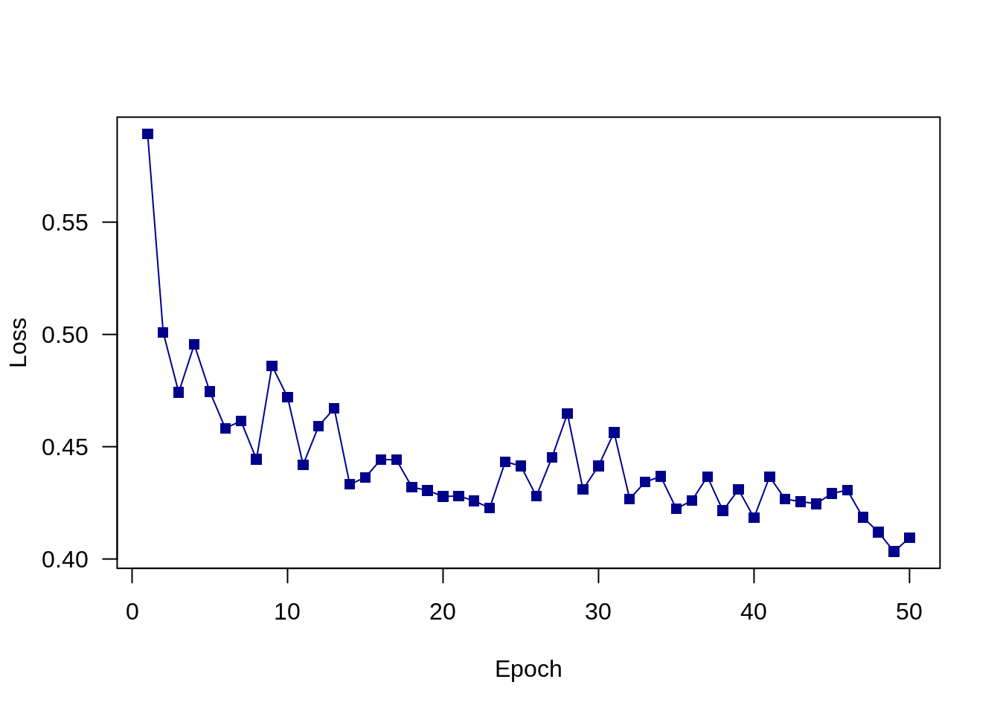
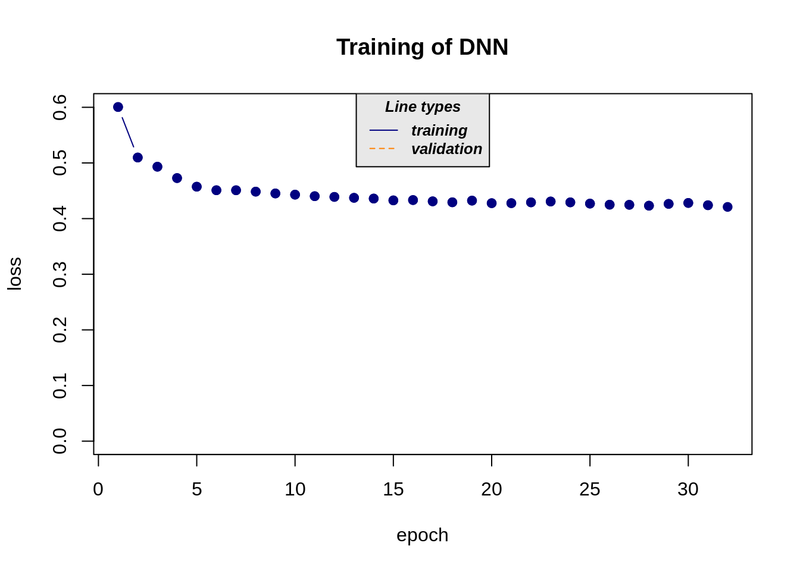

# Machine Learning workflow {#workflow}

```{=html}
<!-- Put this here (right after the first markdown headline) and only here for each document! -->
<script src="./scripts/multipleChoice.js"></script>
```


## The Standard Machine Learning Pipeline at the Eexample of the Titanic Data set

Before we specialize on any tuning, it is important to understand that machine learning always consists of a pipeline of actions. 

The typical machine learning workflow consist of:

* Data cleaning and exploration (EDA = explorative data analysis) for example with tidyverse.
* Preprocessing and feature selection.
* Splitting data set into training and test set for evaluation.
* Model fitting.
* Model evaluation.
* New predictions.

Here is an (optional) video that explains the entire pipeline from a slightly different perspective:

<iframe width="560" height="315" 
  src="https://www.youtube.com/embed/nKW8Ndu7Mjw"
  frameborder="0" allow="accelerometer; autoplay; encrypted-media;
  gyroscope; picture-in-picture" allowfullscreen>
  </iframe>

In the following example, we use tidyverse, a collection of R packages for data science / data manipulation mainly developed by Hadley Wickham. A video that explains the basics can be found here :

<iframe width="560" height="315" 
  src="https://www.youtube.com/embed/nRtp7wSEtJA"
  frameborder="0" allow="accelerometer; autoplay; encrypted-media;
  gyroscope; picture-in-picture" allowfullscreen>
  </iframe>

Another good reference is "**R for data science**" by Hadley Wickham: <a href="https://r4ds.had.co.nz/" target="_blank" rel="noopener"></a>.

For this lecture you need the Titanic data set provided by us. You can find it in GRIPS (datasets.RData in the data set and submission section) or at <a href="http://rhsbio6.uni-regensburg.de:8500" target="_blank" rel="noopener">http://rhsbio6.uni-regensburg.de:8500</a>.

We have split the data set already into training and test/prediction data sets (the test/prediction split has one column less than the train split, as the result is not known a priori).


### Data Cleaning

Load necessary libraries:


```r
library(tidyverse)
```

Load data set:


```r
library(EcoData)
data(titanic_ml)
data = titanic_ml
```

Standard summaries:


```r
str(data)
#> 'data.frame':	1309 obs. of  14 variables:
#>  $ pclass   : int  2 1 3 3 3 3 3 1 3 1 ...
#>  $ survived : int  1 1 0 0 0 0 0 1 0 1 ...
#>  $ name     : chr  "Sinkkonen, Miss. Anna" "Woolner, Mr. Hugh" "Sage, Mr. Douglas Bullen" "Palsson, Master. Paul Folke" ...
#>  $ sex      : Factor w/ 2 levels "female","male": 1 2 2 2 2 2 2 1 1 1 ...
#>  $ age      : num  30 NA NA 6 30.5 38.5 20 53 NA 42 ...
#>  $ sibsp    : int  0 0 8 3 0 0 0 0 0 0 ...
#>  $ parch    : int  0 0 2 1 0 0 0 0 0 0 ...
#>  $ ticket   : Factor w/ 929 levels "110152","110413",..: 221 123 779 542 589 873 472 823 588 834 ...
#>  $ fare     : num  13 35.5 69.55 21.07 8.05 ...
#>  $ cabin    : Factor w/ 187 levels "","A10","A11",..: 1 94 1 1 1 1 1 1 1 1 ...
#>  $ embarked : Factor w/ 4 levels "","C","Q","S": 4 4 4 4 4 4 4 2 4 2 ...
#>  $ boat     : Factor w/ 28 levels "","1","10","11",..: 3 28 1 1 1 1 1 19 1 15 ...
#>  $ body     : int  NA NA NA NA 50 32 NA NA NA NA ...
#>  $ home.dest: Factor w/ 370 levels "","?Havana, Cuba",..: 121 213 1 1 1 1 322 350 1 1 ...
summary(data)
#>      pclass         survived          name               sex           age         
#>  Min.   :1.000   Min.   :0.0000   Length:1309        female:466   Min.   : 0.1667  
#>  1st Qu.:2.000   1st Qu.:0.0000   Class :character   male  :843   1st Qu.:21.0000  
#>  Median :3.000   Median :0.0000   Mode  :character                Median :28.0000  
#>  Mean   :2.295   Mean   :0.3853                                   Mean   :29.8811  
#>  3rd Qu.:3.000   3rd Qu.:1.0000                                   3rd Qu.:39.0000  
#>  Max.   :3.000   Max.   :1.0000                                   Max.   :80.0000  
#>                  NA's   :655                                      NA's   :263      
#>      sibsp            parch            ticket          fare        
#>  Min.   :0.0000   Min.   :0.000   CA. 2343:  11   Min.   :  0.000  
#>  1st Qu.:0.0000   1st Qu.:0.000   1601    :   8   1st Qu.:  7.896  
#>  Median :0.0000   Median :0.000   CA 2144 :   8   Median : 14.454  
#>  Mean   :0.4989   Mean   :0.385   3101295 :   7   Mean   : 33.295  
#>  3rd Qu.:1.0000   3rd Qu.:0.000   347077  :   7   3rd Qu.: 31.275  
#>  Max.   :8.0000   Max.   :9.000   347082  :   7   Max.   :512.329  
#>                                   (Other) :1261   NA's   :1        
#>              cabin      embarked      boat          body                      home.dest  
#>                 :1014    :  2           :823   Min.   :  1.0                       :564  
#>  C23 C25 C27    :   6   C:270    13     : 39   1st Qu.: 72.0   New York, NY        : 64  
#>  B57 B59 B63 B66:   5   Q:123    C      : 38   Median :155.0   London              : 14  
#>  G6             :   5   S:914    15     : 37   Mean   :160.8   Montreal, PQ        : 10  
#>  B96 B98        :   4            14     : 33   3rd Qu.:256.0   Cornwall / Akron, OH:  9  
#>  C22 C26        :   4            4      : 31   Max.   :328.0   Paris, France       :  9  
#>  (Other)        : 271            (Other):308   NA's   :1188    (Other)             :639
head(data)
#>      pclass survived                         name    sex  age sibsp parch
#> 561       2        1        Sinkkonen, Miss. Anna female 30.0     0     0
#> 321       1        1            Woolner, Mr. Hugh   male   NA     0     0
#> 1177      3        0     Sage, Mr. Douglas Bullen   male   NA     8     2
#> 1098      3        0  Palsson, Master. Paul Folke   male  6.0     3     1
#> 1252      3        0   Tomlin, Mr. Ernest Portage   male 30.5     0     0
#> 1170      3        0 Saether, Mr. Simon Sivertsen   male 38.5     0     0
#>                  ticket   fare cabin embarked boat body                home.dest
#> 561              250648 13.000              S   10   NA Finland / Washington, DC
#> 321               19947 35.500   C52        S    D   NA          London, England
#> 1177           CA. 2343 69.550              S        NA                         
#> 1098             349909 21.075              S        NA                         
#> 1252             364499  8.050              S        50                         
#> 1170 SOTON/O.Q. 3101262  7.250              S        32
```

The name variable consists of 1309 unique factors (there are 1309 observations...):


```r
length(unique(data$name))
#> [1] 1307
```

However, there is a title in each name. Let's extract the titles:

1. We will extract all names and split each name after each comma ",".
2. We will split the second split of the name after a point "." and extract the titles.


```r
first_split = sapply(data$name,
                     function(x) stringr::str_split(x, pattern = ",")[[1]][2])
titles = sapply(first_split,
                function(x) strsplit(x, ".",fixed = TRUE)[[1]][1])
```

We get 18 unique titles:


```r
table(titles)
#> titles
#>          Capt           Col           Don          Dona            Dr      Jonkheer 
#>             1             4             1             1             8             1 
#>          Lady         Major        Master          Miss          Mlle           Mme 
#>             1             2            61           260             2             1 
#>            Mr           Mrs            Ms           Rev           Sir  the Countess 
#>           757           197             2             8             1             1
```

A few titles have a very low occurrence rate:


```r
titles = stringr::str_trim((titles))
titles %>%
 fct_count()
#> # A tibble: 18 × 2
#>    f                n
#>    <fct>        <int>
#>  1 Capt             1
#>  2 Col              4
#>  3 Don              1
#>  4 Dona             1
#>  5 Dr               8
#>  6 Jonkheer         1
#>  7 Lady             1
#>  8 Major            2
#>  9 Master          61
#> 10 Miss           260
#> 11 Mlle             2
#> 12 Mme              1
#> 13 Mr             757
#> 14 Mrs            197
#> 15 Ms               2
#> 16 Rev              8
#> 17 Sir              1
#> 18 the Countess     1
```

We will combine titles with low occurrences into one title, which we can easily do with the forcats package.


```r
titles2 =
  forcats::fct_collapse(titles,
                        officer = c("Capt", "Col", "Major", "Dr", "Rev"),
                        royal = c("Jonkheer", "Don", "Sir",
                                  "the Countess", "Dona", "Lady"),
                        miss = c("Miss", "Mlle"),
                        mrs = c("Mrs", "Mme", "Ms")
                        )
```

We can count titles again to see the new number of titles:


```r
titles2 %>%  
   fct_count()
#> # A tibble: 6 × 2
#>   f           n
#>   <fct>   <int>
#> 1 officer    23
#> 2 royal       6
#> 3 Master     61
#> 4 miss      262
#> 5 mrs       200
#> 6 Mr        757
```

Add new title variable to data set:


```r
data =
  data %>%
    mutate(title = titles2)
```

As a second example, we will explore and clean the numeric "age" variable.

Explore the variable:


```r
summary(data)
#>      pclass         survived          name               sex           age         
#>  Min.   :1.000   Min.   :0.0000   Length:1309        female:466   Min.   : 0.1667  
#>  1st Qu.:2.000   1st Qu.:0.0000   Class :character   male  :843   1st Qu.:21.0000  
#>  Median :3.000   Median :0.0000   Mode  :character                Median :28.0000  
#>  Mean   :2.295   Mean   :0.3853                                   Mean   :29.8811  
#>  3rd Qu.:3.000   3rd Qu.:1.0000                                   3rd Qu.:39.0000  
#>  Max.   :3.000   Max.   :1.0000                                   Max.   :80.0000  
#>                  NA's   :655                                      NA's   :263      
#>      sibsp            parch            ticket          fare        
#>  Min.   :0.0000   Min.   :0.000   CA. 2343:  11   Min.   :  0.000  
#>  1st Qu.:0.0000   1st Qu.:0.000   1601    :   8   1st Qu.:  7.896  
#>  Median :0.0000   Median :0.000   CA 2144 :   8   Median : 14.454  
#>  Mean   :0.4989   Mean   :0.385   3101295 :   7   Mean   : 33.295  
#>  3rd Qu.:1.0000   3rd Qu.:0.000   347077  :   7   3rd Qu.: 31.275  
#>  Max.   :8.0000   Max.   :9.000   347082  :   7   Max.   :512.329  
#>                                   (Other) :1261   NA's   :1        
#>              cabin      embarked      boat          body                      home.dest  
#>                 :1014    :  2           :823   Min.   :  1.0                       :564  
#>  C23 C25 C27    :   6   C:270    13     : 39   1st Qu.: 72.0   New York, NY        : 64  
#>  B57 B59 B63 B66:   5   Q:123    C      : 38   Median :155.0   London              : 14  
#>  G6             :   5   S:914    15     : 37   Mean   :160.8   Montreal, PQ        : 10  
#>  B96 B98        :   4            14     : 33   3rd Qu.:256.0   Cornwall / Akron, OH:  9  
#>  C22 C26        :   4            4      : 31   Max.   :328.0   Paris, France       :  9  
#>  (Other)        : 271            (Other):308   NA's   :1188    (Other)             :639  
#>      title    
#>  officer: 23  
#>  royal  :  6  
#>  Master : 61  
#>  miss   :262  
#>  mrs    :200  
#>  Mr     :757  
#> 
sum(is.na(data$age)) / nrow(data)
#> [1] 0.2009167
```

20% NAs!
Either we remove all observations with NAs, or we impute (fill) the missing values, e.g. with the median age. However, age itself might depend on other variables such as sex, class and title. We want to fill the NAs with the median age of these groups.
In tidyverse we can easily "group" the data, i.e. we will nest the observations (here: group_by after sex, pclass and title).
After grouping, all operations (such as our median(age....)) will be done within the specified groups.
 

```r
data =
  data %>%
    group_by(sex, pclass, title) %>%
    mutate(age2 = ifelse(is.na(age), median(age, na.rm = TRUE), age)) %>%
    mutate(fare2 = ifelse(is.na(fare), median(fare, na.rm = TRUE), fare)) %>%
    ungroup()
```
 

### Preprocessing and Feature Selection

We want to use Keras in our example, but it cannot handle factors and requires the data to be scaled.

Normally, one would do this for all predictors, but as we only show the pipeline here, we have sub-selected a bunch of predictors and do this only for them.
We first scale the numeric predictors and change the factors with only two groups/levels into integers (this can be handled by Keras).


```r
data_sub =
  data %>%
    select(survived, sex, age2, fare2, title, pclass) %>%
    mutate(age2 = scales::rescale(age2, c(0, 1)),
           fare2 = scales::rescale(fare2, c(0, 1))) %>%
    mutate(sex = as.integer(sex) - 1L,
           title = as.integer(title) - 1L, pclass = as.integer(pclass - 1L))
```

Factors with more than two levels should be **one hot encoded** (Make columns for every different factor level and write 1 in the respective column for every taken feature value and 0 else. For example: $\{red, green, green, blue, red\} \rightarrow \{(0,0,1), (0,1,0), (0,1,0), (1,0,0), (0,0,1)\}$):


```r
one_title = model.matrix(~0+as.factor(title), data = data_sub)
colnames(one_title) = levels(data$title)

one_sex = model.matrix(~0+as.factor(sex), data = data_sub)
colnames(one_sex) = levels(data$sex)

one_pclass = model.matrix(~0+as.factor(pclass), data = data_sub)
colnames(one_pclass) = paste0(1:length(unique(data$pclass)), "pclass")
```

And we have to add the dummy encoded variables to the data set:


```r
data_sub = cbind(data.frame(survived= data_sub$survived),
                 one_title, one_sex, age = data_sub$age2,
                 fare = data_sub$fare2, one_pclass)
head(data_sub)
#>   survived officer royal Master miss mrs Mr female male        age       fare 1pclass
#> 1        1       0     0      0    1   0  0      1    0 0.37369494 0.02537431       0
#> 2        1       0     0      0    0   0  1      0    1 0.51774510 0.06929139       1
#> 3        0       0     0      0    0   0  1      0    1 0.32359053 0.13575256       0
#> 4        0       0     0      1    0   0  0      0    1 0.07306851 0.04113566       0
#> 5        0       0     0      0    0   0  1      0    1 0.37995799 0.01571255       0
#> 6        0       0     0      0    0   0  1      0    1 0.48016680 0.01415106       0
#>   2pclass 3pclass
#> 1       1       0
#> 2       0       0
#> 3       0       1
#> 4       0       1
#> 5       0       1
#> 6       0       1
```


### Split Data

The splitting consists of two splits:

* An outer split (the original split, remember we got a training and test split without the response "survived").
* An inner split (we will split the training data set further into another training and test split with known response).
The inner split is important to assess the model's performance and potential overfitting.

Outer split:


```r
train = data_sub[!is.na(data_sub$survived),]
test = data_sub[is.na(data_sub$survived),]
```

Inner split:


```r
indices = sample.int(nrow(train), 0.7 * nrow(train))
sub_train = train[indices,]
sub_test = train[-indices,]
```

What is the difference between the two splits? (Tip: have a look at the variable survived.)


### Training

In the next step we will fit a Keras model on the training data of the inner split:


::::: {.panelset}

::: {.panel}
[Keras]{.panel-name}


```r
library(tensorflow)
library(keras)
set_random_seed(321L, disable_gpu = FALSE)	# Already sets R's random seed.

model = keras_model_sequential()
model %>%
  layer_dense(units = 20L, input_shape = ncol(sub_train) - 1L,
              activation = "relu") %>%
  layer_dense(units = 20L, activation = "relu") %>%
  layer_dense(units = 20L, activation = "relu") %>%
  # Output layer consists of the 1-hot encoded variable "survived" -> 2 units.
  layer_dense(units = 2L, activation = "softmax")

summary(model)
#> Model: "sequential"
#> __________________________________________________________________________________________
#>  Layer (type)                           Output Shape                        Param #       
#> ==========================================================================================
#>  dense_3 (Dense)                        (None, 20)                          280           
#>  dense_2 (Dense)                        (None, 20)                          420           
#>  dense_1 (Dense)                        (None, 20)                          420           
#>  dense (Dense)                          (None, 2)                           42            
#> ==========================================================================================
#> Total params: 1,162
#> Trainable params: 1,162
#> Non-trainable params: 0
#> __________________________________________________________________________________________

model_history =
model %>%
  compile(loss = loss_categorical_crossentropy,
          optimizer = keras::optimizer_adamax(learning_rate = 0.01))

model_history =
  model %>%
    fit(x = as.matrix(sub_train[,-1]),
        y = to_categorical(sub_train[,1], num_classes = 2L),
        epochs = 100L, batch_size = 32L,
        validation_split = 0.2,   #Again a test set used by the algorithm.
        shuffle = TRUE)

plot(model_history)
```


:::

::: {.panel}
[Torch]{.panel-name}

  

```r
library(torch)
torch_manual_seed(321L)
set.seed(123)

torch_dataset = torch::dataset(
    name = "data",
    initialize = function(X,Y) {
      self$X = torch::torch_tensor(as.matrix(X), dtype = torch_float32())
      self$Y = torch::torch_tensor(Y, dtype = torch_long())
    },
    .getitem = function(index) {
      x = self$X[index,]
      y = self$Y[index]
      list(x, y)
    },
    .length = function() {
      self$Y$size()[[1]]
    }
  )


model_torch = nn_sequential(
  nn_linear(in_features = dim(sub_train[,-1])[2], out_features = 30L),
  nn_relu(),
  nn_linear(30L, 30L),
  nn_relu(),
  nn_linear(30L, 2L)
)
opt = optim_adam(params = model_torch$parameters, lr = 0.01)

dataset = torch_dataset(as.matrix(sub_train[,-1]), sub_train[,1]+1)
dataloader = torch::dataloader(dataset, batch_size = 30L, shuffle = TRUE)

epochs = 50L
opt = optim_adam(model_torch$parameters, 0.01)
train_losses = c()
for(epoch in 1:epochs){
  train_loss = c()
  coro::loop(
    for(batch in dataloader) { 
      opt$zero_grad()
      pred = model_torch(batch[[1]])
      loss = nnf_cross_entropy(pred, batch[[2]])

      loss$backward()
      opt$step()
      train_loss = c(train_loss, loss$item())
    }
  )
  train_losses = c(train_losses, mean(train_loss))
  if(!epoch%%10) cat(sprintf("Loss at epoch %d: %3f\n", epoch, mean(train_loss)))
}
#> Loss at epoch 10: 0.479470
#> Loss at epoch 20: 0.476513
#> Loss at epoch 30: 0.464416
#> Loss at epoch 40: 0.458047
#> Loss at epoch 50: 0.443187

plot(train_losses, type = "o", pch = 15,
        col = "darkblue", lty = 1, xlab = "Epoch",
        ylab = "Loss", las = 1)
```



Note: the "nnf_cross_entropy" expects predictions on the scale of the linear predictors (the loss function itself will apply the softmax!).
    


:::

::: {.panel}
[Cito]{.panel-name}

Cito can handle factors but as we have already prepared the data for torch and tensorflow we will use also the processed data:


```r
library(cito)

model_cito = dnn(survived~., data = sub_train, loss = "binomial", hidden = rep(30, 3), activation = rep("relu", 3))
#> Loss at epoch 1: 0.628682, lr: 0.01000
```



```
#> Loss at epoch 2: 0.555334, lr: 0.01000
#> Loss at epoch 3: 0.514781, lr: 0.01000
#> Loss at epoch 4: 0.493197, lr: 0.01000
#> Loss at epoch 5: 0.486173, lr: 0.01000
#> Loss at epoch 6: 0.485266, lr: 0.01000
#> Loss at epoch 7: 0.477691, lr: 0.01000
#> Loss at epoch 8: 0.478282, lr: 0.01000
#> Loss at epoch 9: 0.470990, lr: 0.01000
#> Loss at epoch 10: 0.474267, lr: 0.01000
#> Loss at epoch 11: 0.466413, lr: 0.01000
#> Loss at epoch 12: 0.471069, lr: 0.01000
#> Loss at epoch 13: 0.467679, lr: 0.01000
#> Loss at epoch 14: 0.462538, lr: 0.01000
#> Loss at epoch 15: 0.461307, lr: 0.01000
#> Loss at epoch 16: 0.464263, lr: 0.01000
#> Loss at epoch 17: 0.458622, lr: 0.01000
#> Loss at epoch 18: 0.458754, lr: 0.01000
#> Loss at epoch 19: 0.459127, lr: 0.01000
#> Loss at epoch 20: 0.458725, lr: 0.01000
#> Loss at epoch 21: 0.456209, lr: 0.01000
#> Loss at epoch 22: 0.461059, lr: 0.01000
#> Loss at epoch 23: 0.453386, lr: 0.01000
#> Loss at epoch 24: 0.455715, lr: 0.01000
#> Loss at epoch 25: 0.456063, lr: 0.01000
#> Loss at epoch 26: 0.453903, lr: 0.01000
#> Loss at epoch 27: 0.456146, lr: 0.01000
#> Loss at epoch 28: 0.454714, lr: 0.01000
#> Loss at epoch 29: 0.452475, lr: 0.01000
#> Loss at epoch 30: 0.456571, lr: 0.01000
#> Loss at epoch 31: 0.449390, lr: 0.01000
#> Loss at epoch 32: 0.453715, lr: 0.01000
```


:::

:::::
    
    


### Evaluation

We will predict the variable "survived" for the test set of the inner split and calculate the accuracy:

::::: {.panelset}

::: {.panel}
[Keras]{.panel-name}


```r
pred =
  model %>%
    predict(x = as.matrix(sub_test[,-1]))

predicted = ifelse(pred[,2] < 0.5, 0, 1) # Ternary operator.
observed = sub_test[,1]
(accuracy = mean(predicted == observed))  # (...): Show output.
#> [1] 0.8121827
```

:::

::: {.panel}
[Torch]{.panel-name}


```r
model_torch$eval()
preds_torch = nnf_softmax(model_torch(torch_tensor(as.matrix(sub_test[,-1]))),
                          dim = 2L)
preds_torch = as.matrix(preds_torch)
preds_torch = apply(preds_torch, 1, which.max)
(accuracy = mean(preds_torch - 1 == observed))
#> [1] 0.7817259
```

Don't forget to use the link function (softmax).
    
:::

::: {.panel}
[Cito]{.panel-name}


```r

preds_cito = predict(model_cito, newdata = sub_test)
preds_cito = ifelse(preds_cito > 0.5, 1, 0)
(accuracy = mean(preds_cito == observed))
#> [1] 0.8071066
```


:::

:::::

### Predictions and Submission

When we are satisfied with the performance of our model in the inner split, we will create predictions for the test data of the outer split.
To do so, we take all observations that belong to the outer test split (use the filter function) and remove the survived (NAs) columns:


```r
submit = 
  test %>% 
      select(-survived)
```

We cannot assess the performance on the test split because the true survival ratio is unknown, however, we can now submit our predictions to the submission server at <a href="http://rhsbio7.uni-regensburg.de:8500" target="_blank" rel="noopener">http://rhsbio7.uni-regensburg.de:8500</a>.
To do so, we have to transform our survived probabilities into actual 0/1 predictions (probabilities are not allowed) and create a .csv file:


```r
pred = model %>% 
  predict(as.matrix(submit))
```

All values > 0.5 will be set to 1 and values < 0.5 to zero.
For the submission it is critical to change the predictions into a data.frame, select the second column (the probability to survive), and save it with the write.csv function:


```r
write.csv(data.frame(y = ifelse(pred[,2] < 0.5, 0, 1)), file = "Max_1.csv")
```

The file name is used as the ID on the submission server, so change it to whatever you want as long as you can identify yourself.

<strong>Annotation: The AUC is (always) higher for probabilities than for 0/1 data (depending on the implementation and definition of the AUC). We expect you to upload 0/1 data (usage scenarios, no theoretical ones)! Hint for cheaters (or if you just forget conversion): Your upload is converted to 0/1 data according to ifelse(... < 0.5, 0, 1).</strong>


### Exercises

```{=html}
  <hr/>
  <strong><span style="color: #0011AA; font-size:18px;">1. Task</span></strong><br/>
```

The tasks below follow the above section about machine learning pipelines. We will use the titanic_ml data set from the EcoData package to see a pipeline. The goal is to predict if a passenger survives or not. 

First, we should look at the data and do some feature engineering / selection. Give it a try! (Ideas can be found <a href="https://www.kaggle.com/c/titanic/notebooks?sortBy=hotness&group=everyone&pageSize=20&competitionId=3136&language=R" target="_blank" rel="noopener">here</a>.)

```{=html}
  <details>
    <summary>
      <strong><span style="color: #0011AA; font-size:18px;">Solution</span></strong>
    </summary>
    <p>
```


```r
library(tidyverse)
library(randomForest)
library(rpart)
library(EcoData)
set_random_seed(54321L, disable_gpu = FALSE)	# Already sets R's random seed.

data(titanic_ml)
data = titanic_ml
```


```r
str(data)
#> 'data.frame':	1309 obs. of  14 variables:
#>  $ pclass   : int  2 1 3 3 3 3 3 1 3 1 ...
#>  $ survived : int  1 1 0 0 0 0 0 1 0 1 ...
#>  $ name     : chr  "Sinkkonen, Miss. Anna" "Woolner, Mr. Hugh" "Sage, Mr. Douglas Bullen" "Palsson, Master. Paul Folke" ...
#>  $ sex      : Factor w/ 2 levels "female","male": 1 2 2 2 2 2 2 1 1 1 ...
#>  $ age      : num  30 NA NA 6 30.5 38.5 20 53 NA 42 ...
#>  $ sibsp    : int  0 0 8 3 0 0 0 0 0 0 ...
#>  $ parch    : int  0 0 2 1 0 0 0 0 0 0 ...
#>  $ ticket   : Factor w/ 929 levels "110152","110413",..: 221 123 779 542 589 873 472 823 588 834 ...
#>  $ fare     : num  13 35.5 69.55 21.07 8.05 ...
#>  $ cabin    : Factor w/ 187 levels "","A10","A11",..: 1 94 1 1 1 1 1 1 1 1 ...
#>  $ embarked : Factor w/ 4 levels "","C","Q","S": 4 4 4 4 4 4 4 2 4 2 ...
#>  $ boat     : Factor w/ 28 levels "","1","10","11",..: 3 28 1 1 1 1 1 19 1 15 ...
#>  $ body     : int  NA NA NA NA 50 32 NA NA NA NA ...
#>  $ home.dest: Factor w/ 370 levels "","?Havana, Cuba",..: 121 213 1 1 1 1 322 350 1 1 ...

indicesPredict = which(is.na(titanic_ml$survived))
indicesTrain = which(!is.na(titanic_ml$survived))
subset = sample(length(indicesTrain), length(indicesTrain) * 0.7, replace = F)
indicesTest = sort(indicesTrain[-subset]) # Mind order of instructions!
indicesTrain = sort(indicesTrain[subset])

# Determine labels. As they are fixed from now on, samples must not be left!
# Impute when necessary. 
labelsTrain = data$survived[indicesTrain]
labelsTest = data$survived[indicesTest]

# Parameter "body" has nearly no information).
# Parameter "name" was already processed above.
# Parameter "ticket" may include (other) information, but leave it out for now.
# Parameter "survived" is the target variable.
data = data %>% select(-body, -name, -ticket, -survived)

data$pclass = as.factor(data$pclass)  # "pclass" makes only sense as a factor.

for(i in 1:3){
  print(sum(data$cabin[data$pclass == i] == "") / sum(data$pclass == i))
  }
#> [1] 0.2074303
#> [1] 0.9169675
#> [1] 0.977433

# Most people have no cabin (21% in 1st, 92% in 2nd and 98% in 3rd class).
# Dummy code the availability of a cabin.
# This is NOT one-hot encoding! Dummy coded variables use n-1 variables!
data$cabin = (data$cabin != "") * 1

# Impute values for parameter "embarked":
  # Leave parameters with too many levels or causal inverse ones (assumed).
  tmp = data %>% select(-boat, -home.dest)
  tmp = data.frame(tmp[complete.cases(tmp),]) # Leave samples with missing values.
  
  missingIndices = which(tmp$embarked == "")
  toPredict = tmp[missingIndices, -8]
  tmp = tmp[-missingIndices,] # Leave samples that should be predicted.
  tmp$embarked = droplevels(tmp$embarked) # Remove unused levels ("").
  
  # Random forests and simple regression trees don't need scaling.
  # Use a simple regression tree instead of a random forest here,
  # we have only 2 missing values.
  # And a simple regression tree is easy to visualize.
  regressionTree = rpart(embarked ~ ., data = tmp,
                         control = rpart.control(minsplit = 10))
  rpart.plot::rpart.plot(regressionTree)
```


```r
  prediction = predict(regressionTree, toPredict)
  
  for(i in 1:nrow(prediction)){
    index = which(rownames(data) == as.integer(rownames(prediction))[i])
    data$embarked[index] = colnames(prediction)[which.max(prediction[i,])]
  }
  
  data$embarked = droplevels(data$embarked) # Remove unused levels ("").

table(data$pclass)
#> 
#>   1   2   3 
#> 323 277 709
sum(table(data$pclass))
#> [1] 1309
sum(table(data$home.dest))
#> [1] 1309
sum(is.na(data$home.dest))
#> [1] 0
# "pclass", "sex", "sibsp", "parch", "boat" and "home.dest" have no missing values.

summary(data$fare)
#>    Min. 1st Qu.  Median    Mean 3rd Qu.    Max.    NA's 
#>   0.000   7.896  14.454  33.295  31.275 512.329       1
# Parameter "fare" has 1 NA entry. Impute the mean.
data$fare[is.na(data$fare)] = mean(data$fare, na.rm = TRUE)

levels(data$home.dest)[levels(data$home.dest) == ""] = "unknown"
levels(data$boat)[levels(data$boat) == ""] = "none"

# Impute values for "age":
  tmp = data %>% select(-home.dest) # Leave parameters with too many levels.
  
  missingIndices = which(is.na(tmp$age))
  toPredict = tmp[missingIndices, -3]
  tmp = tmp[-missingIndices,] # Leave samples that should be predicted.
  
  forest = randomForest(x = tmp[,-3], y = tmp$age)
  prediction = predict(forest, toPredict)
  
  for(i in 1:length(prediction)){
    index = which(rownames(data) == as.integer(names(prediction))[i])
    data$age[index] = prediction[i]
  }

str(data)
#> 'data.frame':	1309 obs. of  10 variables:
#>  $ pclass   : Factor w/ 3 levels "1","2","3": 2 1 3 3 3 3 3 1 3 1 ...
#>  $ sex      : Factor w/ 2 levels "female","male": 1 2 2 2 2 2 2 1 1 1 ...
#>  $ age      : num  30 36.7 13.9 6 30.5 ...
#>  $ sibsp    : int  0 0 8 3 0 0 0 0 0 0 ...
#>  $ parch    : int  0 0 2 1 0 0 0 0 0 0 ...
#>  $ fare     : num  13 35.5 69.55 21.07 8.05 ...
#>  $ cabin    : num  0 1 0 0 0 0 0 0 0 0 ...
#>  $ embarked : Factor w/ 3 levels "C","Q","S": 3 3 3 3 3 3 3 1 3 1 ...
#>  $ boat     : Factor w/ 28 levels "none","1","10",..: 3 28 1 1 1 1 1 19 1 15 ...
#>  $ home.dest: Factor w/ 370 levels "unknown","?Havana, Cuba",..: 121 213 1 1 1 1 322 350 1 1 ...
data = as.data.frame(data)

# One-hot encoding of "pclass", "sex", "cabin", "embarked", "boat" and "home.dest":
for(element in c("pclass", "sex", "cabin", "embarked", "boat", "home.dest")){
  # Build integer representation:
  # This MUST start at 0, otherwise, the encoding is wrong!!
    integers = as.integer(data[[element]])
    integers = integers - min(integers)
  
  # Determine number of classes:
  num_classes = length(levels(as.factor(data[[element]])))
  
  # Encode:
  encoded = model.matrix(~0+as.factor(integers))
  
  # Copy factor names.
  colnames(encoded) = paste0(element, "_", levels(as.factor(data[[element]])))
  
  data = data %>% select(-all_of(element))  # Remove original column.
  data = cbind.data.frame(data, encoded)  # Plug in new (encoded) columns.
}

# Scale parameters (including one-hot encoded):
data = scale(as.matrix(data))

# Split into training, test and prediction set:
# Be careful! You need matrices, no data.frames!
train = as.matrix(data[indicesTrain,])
test = as.matrix(data[indicesTest,])
predict = as.matrix(data[indicesPredict,])
```

```{=html}
    </p>
  </details>
  <br/><hr/>
```

```{=html}
  <strong><span style="color: #0011AA; font-size:18px;">2. Task</span></strong><br/>
```

Build a neural network to make predictions and check performance on the hold-out data. 

```{=html}
  <details>
    <summary>
      <strong><span style="color: #0011AA; font-size:18px;">Solution</span></strong>
    </summary>
    <p>
```


::::: {.panelset}

::: {.panel}
[Keras]{.panel-name}


:::

::: {.panel}
[Torch]{.panel-name}


:::

::: {.panel}
[Cito]{.panel-name}


:::

:::::


```{=html}
    </p>
  </details>
  <br/><hr/>
```

```{=html}
  <strong><span style="color: #0011AA; font-size:18px;">3. Task</span></strong><br/>
```

Play around with model parameters, optimizer(learning_rate = ...), epochs = ..., number of hidden nodes in layers: units = ..., regularization: kernel_regularizer = ..., bias_regularizer = ... **-** Try to maximize the model's accuracy for the hold-out data.

**Hint**: There are a lot different activation functions like "linear", "softmax", "relu", "leaky_relu", "gelu", "selu", "elu", "exponential", "sigmoid", "tanh", "softplus", "softsign".
Every activation function has its own properties, requirements (!), advantages and disadvantages. Choose them wisely!

You should get an accuracy of at least 90%. Try to be better than the solution.


```{=html}
  <details>
    <summary>
      <strong><span style="color: #0011AA; font-size:18px;">Solution</span></strong>
    </summary>
    <p>
```


::::: {.panelset}

::: {.panel}
[Keras]{.panel-name}


:::

::: {.panel}
[Torch]{.panel-name}


:::

::: {.panel}
[Cito]{.panel-name}


:::

:::::


```{=html}
    </p>
  </details>
  <br/><hr/>
```

```{=html}
  <strong><span style="color: #0011AA; font-size:18px;">4. Task</span></strong><br/>
```

Now try your above solution (**the exactly same one!**) with another seed to check for overfitting (on the seed!) of your procedure.

```{=html}
  <details>
    <summary>
      <strong><span style="color: #0011AA; font-size:18px;">Solution</span></strong>
    </summary>
    <p>
```

::::: {.panelset}

::: {.panel}
[Keras]{.panel-name}


:::

::: {.panel}
[Torch]{.panel-name}


:::

::: {.panel}
[Cito]{.panel-name}


:::

:::::


```{=html}
    </p>
  </details>
  <br/><hr/>
```

```{=html}
  <strong><span style="color: #0011AA; font-size:18px;">5. Task</span></strong><br/>
```

Make predictions and submit them via our <a href="https://elearning.uni-regensburg.de/mod/page/view.php?id=1150717" target="_blank" rel="noopener">submission server</a>.

```{=html}
  <details>
    <summary>
      <strong><span style="color: #0011AA; font-size:18px;">Solution</span></strong>
    </summary>
    <p>
```


```r
prediction =
  model %>%
    predict(x = predict)

# Take label with highest probability:
prediction = (prediction[,1] < prediction[,2]) * 1

write.csv(data.frame(y = prediction), file = "submission_NN.csv")
```

```{=html}
    </p>
  </details>
  <br/><hr/>
```


## Bonus - Machine Learning Pipelines with mlr3 {#mlr}

As we have seen today, many of the machine learning algorithms are distributed over several packages but the general machine learning pipeline is very similar for all models: feature engineering, feature selection, hyperparameter tuning and cross-validation. 

The idea of the mlr3 framework is now to provide a general machine learning interface which you can use to build reproducible and automatic machine learning pipelines. The key features of mlr3 are:

* All common machine learning packages are integrated into mlr3, you can easily switch between different machine learning algorithms.
* A common 'language'/workflow to specify machine learning pipelines.
* Support for different cross-validation strategies.
* Hyperparameter tuning for all supported machine learning algorithms.
* Ensemble models.

Useful links:

* <a href="https://mlr3book.mlr-org.com/" target="_blank" rel="noopener">mlr3-book</a> (still in work)
* <a href="https://mlr3.mlr-org.com/" target="_blank" rel="noopener">mlr3 website</a>
* <a href="https://cheatsheets.mlr-org.com/mlr3.pdf" target="_blank" rel="noopener">mlr3 cheatsheet</a>


### mlr3 - The Basic Workflow

The mlr3 package actually consists of several packages for different tasks (e.g. mlr3tuning for hyperparameter tuning, mlr3pipelines for data preparation pipes). But let's start with the basic workflow:


```r
library(EcoData)
library(tidyverse)
library(mlr3)
library(mlr3learners)
library(mlr3pipelines)
library(mlr3tuning)
library(mlr3measures)
data(nasa)
str(nasa)
#> 'data.frame':	4687 obs. of  40 variables:
#>  $ Neo.Reference.ID            : int  3449084 3702322 3406893 NA 2363305 3017307 2438430 3653917 3519490 2066391 ...
#>  $ Name                        : int  NA 3702322 3406893 3082923 2363305 3017307 2438430 3653917 3519490 NA ...
#>  $ Absolute.Magnitude          : num  18.7 22.1 24.8 21.6 21.4 18.2 20 21 20.9 16.5 ...
#>  $ Est.Dia.in.KM.min.          : num  0.4837 0.1011 0.0291 0.1272 0.1395 ...
#>  $ Est.Dia.in.KM.max.          : num  1.0815 0.226 0.0652 0.2845 0.3119 ...
#>  $ Est.Dia.in.M.min.           : num  483.7 NA 29.1 127.2 139.5 ...
#>  $ Est.Dia.in.M.max.           : num  1081.5 226 65.2 284.5 311.9 ...
#>  $ Est.Dia.in.Miles.min.       : num  0.3005 0.0628 NA 0.0791 0.0867 ...
#>  $ Est.Dia.in.Miles.max.       : num  0.672 0.1404 0.0405 0.1768 0.1938 ...
#>  $ Est.Dia.in.Feet.min.        : num  1586.9 331.5 95.6 417.4 457.7 ...
#>  $ Est.Dia.in.Feet.max.        : num  3548 741 214 933 1023 ...
#>  $ Close.Approach.Date         : Factor w/ 777 levels "1995-01-01","1995-01-08",..: 511 712 472 239 273 145 428 694 87 732 ...
#>  $ Epoch.Date.Close.Approach   : num  NA 1.42e+12 1.21e+12 1.00e+12 1.03e+12 ...
#>  $ Relative.Velocity.km.per.sec: num  11.22 13.57 5.75 13.84 4.61 ...
#>  $ Relative.Velocity.km.per.hr : num  40404 48867 20718 49821 16583 ...
#>  $ Miles.per.hour              : num  25105 30364 12873 30957 10304 ...
#>  $ Miss.Dist..Astronomical.    : num  NA 0.0671 0.013 0.0583 0.0381 ...
#>  $ Miss.Dist..lunar.           : num  112.7 26.1 NA 22.7 14.8 ...
#>  $ Miss.Dist..kilometers.      : num  43348668 10030753 1949933 NA 5694558 ...
#>  $ Miss.Dist..miles.           : num  26935614 6232821 1211632 5418692 3538434 ...
#>  $ Orbiting.Body               : Factor w/ 1 level "Earth": 1 1 1 1 1 1 1 1 1 1 ...
#>  $ Orbit.ID                    : int  NA 8 12 12 91 NA 24 NA NA 212 ...
#>  $ Orbit.Determination.Date    : Factor w/ 2680 levels "2014-06-13 15:20:44",..: 69 NA 1377 1774 2275 2554 1919 731 1178 2520 ...
#>  $ Orbit.Uncertainity          : int  0 8 6 0 0 0 1 1 1 0 ...
#>  $ Minimum.Orbit.Intersection  : num  NA 0.05594 0.00553 NA 0.0281 ...
#>  $ Jupiter.Tisserand.Invariant : num  5.58 3.61 4.44 5.5 NA ...
#>  $ Epoch.Osculation            : num  2457800 2457010 NA 2458000 2458000 ...
#>  $ Eccentricity                : num  0.276 0.57 0.344 0.255 0.22 ...
#>  $ Semi.Major.Axis             : num  1.1 NA 1.52 1.11 1.24 ...
#>  $ Inclination                 : num  20.06 4.39 5.44 23.9 3.5 ...
#>  $ Asc.Node.Longitude          : num  29.85 1.42 170.68 356.18 183.34 ...
#>  $ Orbital.Period              : num  419 1040 682 427 503 ...
#>  $ Perihelion.Distance         : num  0.794 0.864 0.994 0.828 0.965 ...
#>  $ Perihelion.Arg              : num  41.8 359.3 350 268.2 179.2 ...
#>  $ Aphelion.Dist               : num  1.4 3.15 2.04 1.39 1.51 ...
#>  $ Perihelion.Time             : num  2457736 2456941 2457937 NA 2458070 ...
#>  $ Mean.Anomaly                : num  55.1 NA NA 297.4 310.5 ...
#>  $ Mean.Motion                 : num  0.859 0.346 0.528 0.843 0.716 ...
#>  $ Equinox                     : Factor w/ 1 level "J2000": 1 1 NA 1 1 1 1 1 1 1 ...
#>  $ Hazardous                   : int  0 0 0 1 1 0 0 0 1 1 ...
```

Let's drop time, name and ID variable and create a classification task:


```r
data = nasa %>% select(-Orbit.Determination.Date,
                       -Close.Approach.Date, -Name, -Neo.Reference.ID)
data$Hazardous = as.factor(data$Hazardous)

# Create a classification task.
task = TaskClassif$new(id = "nasa", backend = data,
                       target = "Hazardous", positive = "1")
```

Create a generic pipeline of data transformation (imputation $\rightarrow$ scaling $\rightarrow$ encoding of categorical variables):


```r
set.seed(123)

# Let's create the preprocessing graph.
preprocessing = po("imputeoor") %>>% po("scale") %>>% po("encode") 

# Run the task.
transformed_task = preprocessing$train(task)[[1]]

transformed_task$missings()
#>                    Hazardous           Absolute.Magnitude                Aphelion.Dist 
#>                         4187                            0                            0 
#>           Asc.Node.Longitude                 Eccentricity    Epoch.Date.Close.Approach 
#>                            0                            0                            0 
#>             Epoch.Osculation         Est.Dia.in.Feet.max.         Est.Dia.in.Feet.min. 
#>                            0                            0                            0 
#>           Est.Dia.in.KM.max.           Est.Dia.in.KM.min.            Est.Dia.in.M.max. 
#>                            0                            0                            0 
#>            Est.Dia.in.M.min.        Est.Dia.in.Miles.max.        Est.Dia.in.Miles.min. 
#>                            0                            0                            0 
#>                  Inclination  Jupiter.Tisserand.Invariant                 Mean.Anomaly 
#>                            0                            0                            0 
#>                  Mean.Motion               Miles.per.hour   Minimum.Orbit.Intersection 
#>                            0                            0                            0 
#>     Miss.Dist..Astronomical.       Miss.Dist..kilometers.            Miss.Dist..lunar. 
#>                            0                            0                            0 
#>            Miss.Dist..miles.                     Orbit.ID           Orbit.Uncertainity 
#>                            0                            0                            0 
#>               Orbital.Period               Perihelion.Arg          Perihelion.Distance 
#>                            0                            0                            0 
#>              Perihelion.Time  Relative.Velocity.km.per.hr Relative.Velocity.km.per.sec 
#>                            0                            0                            0 
#>              Semi.Major.Axis                Equinox.J2000             Equinox..MISSING 
#>                            0                            0                            0 
#>          Orbiting.Body.Earth       Orbiting.Body..MISSING 
#>                            0                            0
```

We can even visualize the preprocessing graph:


```r
preprocessing$plot()
```


Now, to test our model (random forest) 10-fold cross-validated, we will do:

* Specify the missing target rows as validation so that they will be ignored.
* Specify the cross-validation, the learner (the machine learning model we want to use), and the measurement (AUC).
* Run (benchmark) our model.


```r
set.seed(123)

transformed_task$data()
#>       Hazardous Absolute.Magnitude Aphelion.Dist Asc.Node.Longitude Eccentricity
#>    1:         0        -0.81322649   -0.38042005       -1.140837452 -0.315605975
#>    2:         0         0.02110348    0.94306517       -1.380254611  0.744287645
#>    3:         0         0.68365964    0.10199889        0.044905370 -0.068280074
#>    4:         1        -0.10159210   -0.38415066        1.606769281 -0.392030729
#>    5:         1        -0.15067034   -0.29632490        0.151458877 -0.516897963
#>   ---                                                                           
#> 4683:      <NA>        -0.32244415    0.69173184       -0.171022906  1.043608082
#> 4684:      <NA>         0.46280759   -0.24203066       -0.009803808 -0.006429588
#> 4685:      <NA>         1.51798962   -0.56422744        1.514551982 -1.045386877
#> 4686:      <NA>         0.16833819    0.14193044       -1.080452287  0.017146757
#> 4687:      <NA>        -0.05251387   -0.08643345       -0.013006704 -0.579210554
#>       Epoch.Date.Close.Approach Epoch.Osculation Est.Dia.in.Feet.max.
#>    1:                -4.7929881       0.14026773          0.271417899
#>    2:                 1.1058704      -0.26325244          0.032130074
#>    3:                 0.1591740      -7.76281014         -0.012841645
#>    4:                -0.7630231       0.24229559          0.048493723
#>    5:                -0.6305034       0.24229559          0.056169717
#>   ---                                                                
#> 4683:                 1.3635097       0.24229559          0.089353662
#> 4684:                 1.3635097       0.05711503         -0.003481174
#> 4685:                 1.3635097       0.24229559         -0.027260163
#> 4686:                 1.3635097       0.24229559          0.016872584
#> 4687:                 1.3635097       0.24229559          0.041493133
#>       Est.Dia.in.Feet.min. Est.Dia.in.KM.max. Est.Dia.in.KM.min. Est.Dia.in.M.max.
#>    1:          0.313407647        0.300713440        0.256568684       0.271095311
#>    2:         -0.029173486       -0.020055639        0.057560696       0.031844946
#>    3:         -0.093558135       -0.080340934        0.020159164      -0.013119734
#>    4:         -0.005746146        0.001880088        0.071169817       0.048206033
#>    5:          0.005243343        0.012169879        0.077553695       0.055880826
#>   ---                                                                             
#> 4683:          0.052751793        0.056653478        0.105151714       0.089059576
#> 4684:         -0.080157032       -0.067793075        0.027943967      -0.003760728
#> 4685:         -0.114200690       -0.099669182        0.008167747      -0.027535994
#> 4686:         -0.051017172       -0.040508543        0.044871533       0.016589844
#> 4687:         -0.015768679       -0.007504312        0.065347651       0.041206539
#>       Est.Dia.in.M.min. Est.Dia.in.Miles.max. Est.Dia.in.Miles.min. Inclination
#>    1:       0.291624502          2.620443e-01           0.258651038   0.5442288
#>    2:     -12.143577263          4.153888e-02           0.030928225  -0.5925952
#>    3:      -0.060269734          9.711407e-05         -10.258220292  -0.5164818
#>    4:       0.015659335          5.661810e-02           0.046501003   0.8225188
#>    5:       0.025161701          6.369158e-02           0.053806009  -0.6568722
#>   ---                                                                          
#> 4683:       0.066241198          9.427082e-02           0.085386142   0.8222493
#> 4684:      -0.048682099          8.722856e-03          -0.002961897   1.9818623
#> 4685:      -0.078118891         -1.318965e-02          -0.025591624  -0.5220442
#> 4686:      -0.023485512          2.747899e-02           0.016408144  -0.5912988
#> 4687:       0.006993074          5.016700e-02           0.039838758   0.6181969
#>       Jupiter.Tisserand.Invariant Mean.Anomaly Mean.Motion Miles.per.hour
#>    1:                   0.3840868  -1.02876096  0.31939530   -0.254130552
#>    2:                  -0.7801632  -4.55056211 -0.71151122    0.009333354
#>    3:                  -0.2872777  -4.55056211 -0.34600512   -0.866997591
#>    4:                   0.3403535   1.02239674  0.28551117    0.039031045
#>    5:                  -6.2415005   1.13265516  0.03164827   -0.995720084
#>   ---                                                                    
#> 4683:                  -0.6412806   0.01560046 -0.51852041    1.403775544
#> 4684:                   0.1346891   1.08051799  0.17477591    0.970963141
#> 4685:                   0.4810091   0.89998250  0.36895738   -1.150527134
#> 4686:                  -0.3061894   0.22720275 -0.35895074   -0.705980518
#> 4687:                  -0.2665930   0.22740438 -0.31462613   -0.239696213
#>       Minimum.Orbit.Intersection Miss.Dist..Astronomical. Miss.Dist..kilometers.
#>    1:                -5.45911858               -7.0769260             0.25122963
#>    2:                 0.07077092               -0.6830928            -1.08492125
#>    3:                -0.11099960               -0.9035573            -1.40898698
#>    4:                -5.45911858               -0.7188386            -4.48402327
#>    5:                -0.02962490               -0.8013948            -1.25881601
#>   ---                                                                           
#> 4683:                 0.30711241               -0.2728622            -0.48191427
#> 4684:                -0.05962478               -0.7879458            -1.23904708
#> 4685:                -0.10766868               -0.9303542            -1.44837625
#> 4686:                 0.08529226               -0.7077555            -1.12117355
#> 4687:                 0.50904764                0.1075071             0.07719897
#>       Miss.Dist..lunar. Miss.Dist..miles.   Orbit.ID Orbit.Uncertainity Orbital.Period
#>    1:         0.2398625        0.23810770 -9.6514722         -1.0070872     -0.3013135
#>    2:        -1.1742128       -1.18860632 -0.2412680          1.3770116      0.7811097
#>    3:        -4.7878719       -1.53463694 -0.1803606          0.7809869      0.1566040
#>    4:        -1.2298206       -1.24471124 -0.1803606         -1.0070872     -0.2866969
#>    5:        -1.3582490       -1.37428752  1.0225620         -1.0070872     -0.1552813
#>   ---                                                                                 
#> 4683:        -0.5360384       -0.54472804 -0.1194531         -0.7090748      0.3873214
#> 4684:        -1.3373272       -1.35317867 -0.3021755          1.3770116     -0.2345610
#> 4685:        -1.5588644       -1.57669598 -0.3326292          0.7809869     -0.3216884
#> 4686:        -1.2125793       -1.22731578 -0.1042262          0.7809869      0.1712806
#> 4687:         0.0556823        0.05228143 -0.2717218          0.4829746      0.1224733
#>       Perihelion.Arg Perihelion.Distance Perihelion.Time Relative.Velocity.km.per.hr
#>    1:   -1.170536399         -0.01831583      0.10526107                 -0.28167821
#>    2:    1.549452700          0.20604472     -0.28203779                 -0.00604459
#>    3:    1.470307933          0.61816146      0.20313227                 -0.92285430
#>    4:    0.769006449          0.09005898     -7.86832915                  0.02502487
#>    5:    0.006829799          0.52730977      0.26755741                 -1.05752264
#>   ---                                                                               
#> 4683:   -0.580282684         -0.65810123      0.03734532                  1.45280854
#> 4684:    0.839430173         -0.18350549      0.09156633                  1.00000402
#> 4685:   -1.168210857          0.62646993      0.27629790                 -1.21948041
#> 4686:    0.824836889          0.52899080      0.37994517                 -0.75439966
#> 4687:    0.016358127          1.22720096      0.37399573                 -0.26657713
#>       Relative.Velocity.km.per.sec Semi.Major.Axis Equinox.J2000 Equinox..MISSING
#>    1:                 -0.284140684      -0.2791037             1                0
#>    2:                 -0.008343348      -7.3370940             1                0
#>    3:                 -0.925697621       0.2204883             0                1
#>    4:                  0.022744569      -0.2617714             1                0
#>    5:                 -1.060445948      -0.1106954             1                0
#>   ---                                                                            
#> 4683:                  1.451376301       0.4468886             1                0
#> 4684:                  0.998302826      -0.2008499             1                0
#> 4685:                 -1.222499918      -0.3034586             1                0
#> 4686:                 -0.757142920       0.2353030             1                0
#> 4687:                 -0.269030636       0.1857979             1                0
#>       Orbiting.Body.Earth Orbiting.Body..MISSING
#>    1:                   1                      0
#>    2:                   1                      0
#>    3:                   1                      0
#>    4:                   1                      0
#>    5:                   1                      0
#>   ---                                           
#> 4683:                   1                      0
#> 4684:                   1                      0
#> 4685:                   1                      0
#> 4686:                   1                      0
#> 4687:                   1                      0
transformed_task$set_row_roles((1:nrow(data))[is.na(data$Hazardous)],
                               "holdout")

cv10 = mlr3::rsmp("cv", folds = 10L)
rf = lrn("classif.ranger", predict_type = "prob")
measurement =  msr("classif.auc")
```


```r
result = mlr3::resample(transformed_task,
                        rf, resampling = cv10, store_models = TRUE)

# Calculate the average AUC of the holdouts.
result$aggregate(measurement)
```

Very cool! Preprocessing + 10-fold cross-validation model evaluation in a few lines of code!

Let's create the final predictions:


```r
pred = sapply(1:10, function(i) result$learners[[i]]$predict(transformed_task,
row_ids = (1:nrow(data))[is.na(data$Hazardous)])$data$prob[, "1", drop = FALSE])
dim(pred)
predictions = apply(pred, 1, mean)
```

You could now submit the predictions <a href="http://rhsbio7.uni-regensburg.de:8500" target="_blank" rel="noopener">here</a>.

But we are still not happy with the results, let's do some hyperparameter tuning!


### mlr3 - Hyperparameter Tuning

Machine learning algorithms have a varying number of hyperparameters which can (!) have a high impact on the predictive performance. To list a few hyperparameters:

**Random Forest**

* mtry
* Minimal node size

**K-nearest-neighbors classification**

* Kernel
* Number of neighbors
* Distance metric

**Boosted Regression Tree**

* nrounds
* Maximum depth
* alpha
* booster
* eta
* gamma
* lambda

With mlr3, we can easily extend the above example to do hyperparameter tuning within nested cross-validation (the tuning has its own inner cross-validation).

Print the hyperparameter space of our random forest learner:


```r
rf$param_set
#> <ParamSet>
#>                               id    class lower upper nlevels        default    parents
#>  1:                        alpha ParamDbl  -Inf   Inf     Inf            0.5           
#>  2:       always.split.variables ParamUty    NA    NA     Inf <NoDefault[3]>           
#>  3:                class.weights ParamUty    NA    NA     Inf                          
#>  4:                      holdout ParamLgl    NA    NA       2          FALSE           
#>  5:                   importance ParamFct    NA    NA       4 <NoDefault[3]>           
#>  6:                   keep.inbag ParamLgl    NA    NA       2          FALSE           
#>  7:                    max.depth ParamInt     0   Inf     Inf                          
#>  8:                min.node.size ParamInt     1   Inf     Inf                          
#>  9:                     min.prop ParamDbl  -Inf   Inf     Inf            0.1           
#> 10:                      minprop ParamDbl  -Inf   Inf     Inf            0.1           
#> 11:                         mtry ParamInt     1   Inf     Inf <NoDefault[3]>           
#> 12:                   mtry.ratio ParamDbl     0     1     Inf <NoDefault[3]>           
#> 13:            num.random.splits ParamInt     1   Inf     Inf              1  splitrule
#> 14:                  num.threads ParamInt     1   Inf     Inf              1           
#> 15:                    num.trees ParamInt     1   Inf     Inf            500           
#> 16:                    oob.error ParamLgl    NA    NA       2           TRUE           
#> 17:        regularization.factor ParamUty    NA    NA     Inf              1           
#> 18:      regularization.usedepth ParamLgl    NA    NA       2          FALSE           
#> 19:                      replace ParamLgl    NA    NA       2           TRUE           
#> 20:    respect.unordered.factors ParamFct    NA    NA       3         ignore           
#> 21:              sample.fraction ParamDbl     0     1     Inf <NoDefault[3]>           
#> 22:                  save.memory ParamLgl    NA    NA       2          FALSE           
#> 23: scale.permutation.importance ParamLgl    NA    NA       2          FALSE importance
#> 24:                    se.method ParamFct    NA    NA       2        infjack           
#> 25:                         seed ParamInt  -Inf   Inf     Inf                          
#> 26:         split.select.weights ParamUty    NA    NA     Inf                          
#> 27:                    splitrule ParamFct    NA    NA       3           gini           
#> 28:                      verbose ParamLgl    NA    NA       2           TRUE           
#> 29:                 write.forest ParamLgl    NA    NA       2           TRUE           
#>                               id    class lower upper nlevels        default    parents
#>     value
#>  1:      
#>  2:      
#>  3:      
#>  4:      
#>  5:      
#>  6:      
#>  7:      
#>  8:      
#>  9:      
#> 10:      
#> 11:      
#> 12:      
#> 13:      
#> 14:     1
#> 15:      
#> 16:      
#> 17:      
#> 18:      
#> 19:      
#> 20:      
#> 21:      
#> 22:      
#> 23:      
#> 24:      
#> 25:      
#> 26:      
#> 27:      
#> 28:      
#> 29:      
#>     value
```


Define the hyperparameter space of the random forest:


```r
library(paradox)

rf_pars = 
    paradox::ParamSet$new(
      list(paradox::ParamInt$new("min.node.size", lower = 1, upper = 30L),
           paradox::ParamInt$new("mtry", lower = 1, upper = 30L),
           paradox::ParamLgl$new("regularization.usedepth", default = TRUE)))
print(rf_pars)
#> <ParamSet>
#>                         id    class lower upper nlevels        default value
#> 1:           min.node.size ParamInt     1    30      30 <NoDefault[3]>      
#> 2:                    mtry ParamInt     1    30      30 <NoDefault[3]>      
#> 3: regularization.usedepth ParamLgl    NA    NA       2           TRUE
```

To set up the tuning pipeline we need:

* Inner cross-validation resampling object.
* Tuning criterion (e.g. AUC).
* Tuning method (e.g. random or block search).
* Tuning terminator (When should we stop tuning? E.g. after $n$ iterations).


```r
set.seed(123)

inner3 = mlr3::rsmp("cv", folds = 3L)
measurement =  msr("classif.auc")
tuner =  mlr3tuning::tnr("random_search") 
terminator = mlr3tuning::trm("evals", n_evals = 5L)
rf = lrn("classif.ranger", predict_type = "prob")

learner_tuner = AutoTuner$new(learner = rf, 
                              measure = measurement, 
                              tuner = tuner, 
                              terminator = terminator,
                              search_space = rf_pars,
                              resampling = inner3)
print(learner_tuner)
#> <AutoTuner:classif.ranger.tuned>
#> * Model: -
#> * Search Space:
#> <ParamSet>
#>                         id    class lower upper nlevels        default value
#> 1:           min.node.size ParamInt     1    30      30 <NoDefault[3]>      
#> 2:                    mtry ParamInt     1    30      30 <NoDefault[3]>      
#> 3: regularization.usedepth ParamLgl    NA    NA       2           TRUE      
#> * Packages: mlr3, mlr3tuning, mlr3learners, ranger
#> * Predict Type: prob
#> * Feature Types: logical, integer, numeric, character, factor, ordered
#> * Properties: hotstart_backward, importance, multiclass, oob_error, twoclass,
#>   weights
```

Now we can wrap it normally into the 10-fold cross-validated setup as done previously:


```r
set.seed(123)

outer3 = mlr3::rsmp("cv", folds = 3L)
result = mlr3::resample(transformed_task, learner_tuner,
                        resampling = outer3, store_models = TRUE)

# Calculate the average AUC of the holdouts.
result$aggregate(measurement)
```

Yeah, we were able to improve the performance!

Let's create the final predictions:


```r
pred = sapply(1:3, function(i) result$learners[[i]]$predict(transformed_task,
row_ids = (1:nrow(data))[is.na(data$Hazardous)])$data$prob[, "1", drop = FALSE])
dim(pred)
predictions = apply(pred, 1, mean)
```


### mlr3 - Hyperparameter Tuning with Oversampling

Let's go one step back, maybe you have noticed that our classes are unbalanced:


```r
table(data$Hazardous)
#> 
#>   0   1 
#> 412  88
```

Many machine learning algorithms have problems with unbalanced data because if the imbalance is too strong it is cheaper for the algorithm to focus on only one class (e.g. by predicting only 0s or 1s). You need to keep in mind that machine learning algorithms are greedy and their main focus is to minimize the loss function.

There are few techniques to correct for imbalance:

* Oversampling (oversample the undersampled class).
* Undersampling (undersample the oversampled class).
* SMOTE _Synthetic Minority Over-sampling Technique_ (very briefly, we will use a k-nearest-neighbors classification to create new samples around our undersampled class).

Here, we will use oversampling which we can do by extending our random forest learner:


```r
set.seed(123)

rf_over = po("classbalancing", id = "over", adjust = "minor") %>>% rf

# However rf_over is now a "graph",
# but we can easily transform it back into a learner:
rf_over_learner = GraphLearner$new(rf_over)
print(rf_over_learner)
#> <GraphLearner:over.classif.ranger>
#> * Model: -
#> * Parameters: over.ratio=1, over.reference=all, over.adjust=minor,
#>   over.shuffle=TRUE, classif.ranger.num.threads=1
#> * Packages: mlr3, mlr3pipelines, mlr3learners, ranger
#> * Predict Type: prob
#> * Feature types: logical, integer, numeric, character, factor, ordered, POSIXct
#> * Properties: featureless, hotstart_backward, hotstart_forward, importance,
#>   loglik, missings, multiclass, oob_error, selected_features, twoclass, weights
```

The learner has now a new feature space:


```r
rf_over_learner$param_set
#> <ParamSetCollection>
#>                                              id    class lower upper nlevels
#>  1:                        classif.ranger.alpha ParamDbl  -Inf   Inf     Inf
#>  2:       classif.ranger.always.split.variables ParamUty    NA    NA     Inf
#>  3:                classif.ranger.class.weights ParamUty    NA    NA     Inf
#>  4:                      classif.ranger.holdout ParamLgl    NA    NA       2
#>  5:                   classif.ranger.importance ParamFct    NA    NA       4
#>  6:                   classif.ranger.keep.inbag ParamLgl    NA    NA       2
#>  7:                    classif.ranger.max.depth ParamInt     0   Inf     Inf
#>  8:                classif.ranger.min.node.size ParamInt     1   Inf     Inf
#>  9:                     classif.ranger.min.prop ParamDbl  -Inf   Inf     Inf
#> 10:                      classif.ranger.minprop ParamDbl  -Inf   Inf     Inf
#> 11:                         classif.ranger.mtry ParamInt     1   Inf     Inf
#> 12:                   classif.ranger.mtry.ratio ParamDbl     0     1     Inf
#> 13:            classif.ranger.num.random.splits ParamInt     1   Inf     Inf
#> 14:                  classif.ranger.num.threads ParamInt     1   Inf     Inf
#> 15:                    classif.ranger.num.trees ParamInt     1   Inf     Inf
#> 16:                    classif.ranger.oob.error ParamLgl    NA    NA       2
#> 17:        classif.ranger.regularization.factor ParamUty    NA    NA     Inf
#> 18:      classif.ranger.regularization.usedepth ParamLgl    NA    NA       2
#> 19:                      classif.ranger.replace ParamLgl    NA    NA       2
#> 20:    classif.ranger.respect.unordered.factors ParamFct    NA    NA       3
#> 21:              classif.ranger.sample.fraction ParamDbl     0     1     Inf
#> 22:                  classif.ranger.save.memory ParamLgl    NA    NA       2
#> 23: classif.ranger.scale.permutation.importance ParamLgl    NA    NA       2
#> 24:                    classif.ranger.se.method ParamFct    NA    NA       2
#> 25:                         classif.ranger.seed ParamInt  -Inf   Inf     Inf
#> 26:         classif.ranger.split.select.weights ParamUty    NA    NA     Inf
#> 27:                    classif.ranger.splitrule ParamFct    NA    NA       3
#> 28:                      classif.ranger.verbose ParamLgl    NA    NA       2
#> 29:                 classif.ranger.write.forest ParamLgl    NA    NA       2
#> 30:                                 over.adjust ParamFct    NA    NA       7
#> 31:                                  over.ratio ParamDbl     0   Inf     Inf
#> 32:                              over.reference ParamFct    NA    NA       6
#> 33:                                over.shuffle ParamLgl    NA    NA       2
#>                                              id    class lower upper nlevels
#>            default                   parents value
#>  1:            0.5                                
#>  2: <NoDefault[3]>                                
#>  3:                                               
#>  4:          FALSE                                
#>  5: <NoDefault[3]>                                
#>  6:          FALSE                                
#>  7:                                               
#>  8:                                               
#>  9:            0.1                                
#> 10:            0.1                                
#> 11: <NoDefault[3]>                                
#> 12: <NoDefault[3]>                                
#> 13:              1  classif.ranger.splitrule      
#> 14:              1                               1
#> 15:            500                                
#> 16:           TRUE                                
#> 17:              1                                
#> 18:          FALSE                                
#> 19:           TRUE                                
#> 20:         ignore                                
#> 21: <NoDefault[3]>                                
#> 22:          FALSE                                
#> 23:          FALSE classif.ranger.importance      
#> 24:        infjack                                
#> 25:                                               
#> 26:                                               
#> 27:           gini                                
#> 28:           TRUE                                
#> 29:           TRUE                                
#> 30: <NoDefault[3]>                           minor
#> 31: <NoDefault[3]>                               1
#> 32: <NoDefault[3]>                             all
#> 33: <NoDefault[3]>                            TRUE
#>            default                   parents value
```

We can also tune the oversampling rate!


```r
set.seed(123)

rf_pars_over = 
    paradox::ParamSet$new(
      list(paradox::ParamInt$new("over.ratio", lower = 1, upper = 7L),
           paradox::ParamInt$new("classif.ranger.min.node.size",
                                 lower = 1, upper = 30L),
           paradox::ParamInt$new("classif.ranger.mtry", lower = 1,
                                 upper = 30L),
           paradox::ParamLgl$new("classif.ranger.regularization.usedepth",
                                 default = TRUE)))

inner3 = mlr3::rsmp("cv", folds = 3L)
measurement =  msr("classif.auc")
tuner =  mlr3tuning::tnr("random_search") 
terminator = mlr3tuning::trm("evals", n_evals = 5L)

learner_tuner_over = AutoTuner$new(learner = rf_over_learner, 
                                   measure = measurement, 
                                   tuner = tuner, 
                                   terminator = terminator,
                                   search_space = rf_pars_over,
                                   resampling = inner3)
print(learner_tuner)
#> <AutoTuner:classif.ranger.tuned>
#> * Model: -
#> * Search Space:
#> <ParamSet>
#>                         id    class lower upper nlevels        default value
#> 1:           min.node.size ParamInt     1    30      30 <NoDefault[3]>      
#> 2:                    mtry ParamInt     1    30      30 <NoDefault[3]>      
#> 3: regularization.usedepth ParamLgl    NA    NA       2           TRUE      
#> * Packages: mlr3, mlr3tuning, mlr3learners, ranger
#> * Predict Type: prob
#> * Feature Types: logical, integer, numeric, character, factor, ordered
#> * Properties: hotstart_backward, importance, multiclass, oob_error, twoclass,
#>   weights
```


```r
set.seed(123)

outer3 = mlr3::rsmp("cv", folds = 3L)
result = mlr3::resample(transformed_task, learner_tuner_over,
                        resampling = outer3, store_models = TRUE)

# Calculate the average AUC of the holdouts.
result$aggregate(measurement)
```

5 iterations in the hyperspace is not very much...

Let's create the final predictions:


```r
pred = sapply(1:3, function(i) result$learners[[i]]$predict(transformed_task,
row_ids = (1:nrow(data))[is.na(data$Hazardous)])$data$prob[, "1", drop = FALSE])
dim(pred)
predictions = apply(pred, 1, mean)
```

```{=html}
  <hr/>
  <strong><span style="color: #0011AA; font-size:18px;">Optional bonus task</span></strong><br/>
```

After reading the above chapter about the mlr package, try to transfer it to the titanic data set (use the titanic_ml data set, this has already NAs for the values to predict).
Alternatively, you can also use other data sets from our challenge (e.g. the plant-pollinator data set, see the data set chapter \@ref(datasets)).

```{=html}
  <details>
    <summary>
      <strong><span style="color: #0011AA; font-size:18px;">Solution</span></strong>
    </summary>
    <p>
```


```r
library(EcoData)
library(tidyverse)
library(mlr3)
library(mlr3learners)
library(mlr3pipelines)
library(mlr3tuning)
library(mlr3measures)
set.seed(123)

data(titanic_ml)
str(titanic_ml)
#> 'data.frame':	1309 obs. of  14 variables:
#>  $ pclass   : int  2 1 3 3 3 3 3 1 3 1 ...
#>  $ survived : int  1 1 0 0 0 0 0 1 0 1 ...
#>  $ name     : chr  "Sinkkonen, Miss. Anna" "Woolner, Mr. Hugh" "Sage, Mr. Douglas Bullen" "Palsson, Master. Paul Folke" ...
#>  $ sex      : Factor w/ 2 levels "female","male": 1 2 2 2 2 2 2 1 1 1 ...
#>  $ age      : num  30 NA NA 6 30.5 38.5 20 53 NA 42 ...
#>  $ sibsp    : int  0 0 8 3 0 0 0 0 0 0 ...
#>  $ parch    : int  0 0 2 1 0 0 0 0 0 0 ...
#>  $ ticket   : Factor w/ 929 levels "110152","110413",..: 221 123 779 542 589 873 472 823 588 834 ...
#>  $ fare     : num  13 35.5 69.55 21.07 8.05 ...
#>  $ cabin    : Factor w/ 187 levels "","A10","A11",..: 1 94 1 1 1 1 1 1 1 1 ...
#>  $ embarked : Factor w/ 4 levels "","C","Q","S": 4 4 4 4 4 4 4 2 4 2 ...
#>  $ boat     : Factor w/ 28 levels "","1","10","11",..: 3 28 1 1 1 1 1 19 1 15 ...
#>  $ body     : int  NA NA NA NA 50 32 NA NA NA NA ...
#>  $ home.dest: Factor w/ 370 levels "","?Havana, Cuba",..: 121 213 1 1 1 1 322 350 1 1 ...

data = titanic_ml %>% select(-name, -ticket, -name, -body)
data$pclass = as.factor(data$pclass)
data$sex = as.factor(data$sex)
data$survived = as.factor(data$survived)

# Change easy things manually:
data$embarked[data$embarked == ""] = "S"  # Fill in "empty" values.
data$embarked = droplevels(as.factor(data$embarked)) # Remove unused levels ("").
data$cabin = (data$cabin != "") * 1 # Dummy code the availability of a cabin.
data$fare[is.na(data$fare)] = mean(data$fare, na.rm = TRUE)
levels(data$home.dest)[levels(data$home.dest) == ""] = "unknown"
levels(data$boat)[levels(data$boat) == ""] = "none"

# Create a classification task.
task = TaskClassif$new(id = "titanic", backend = data,
                       target = "survived", positive = "1")
task$missings()
#>  survived       age      boat     cabin  embarked      fare home.dest     parch    pclass 
#>       655       263         0         0         0         0         0         0         0 
#>       sex     sibsp 
#>         0         0

# Let's create the preprocessing graph.
preprocessing = po("imputeoor") %>>% po("scale") %>>% po("encode") 

# Run the task.
transformed_task = preprocessing$train(task)[[1]]

transformed_task$set_row_roles((1:nrow(data))[is.na(data$survived)], "holdout")

cv10 = mlr3::rsmp("cv", folds = 10L)
rf = lrn("classif.ranger", predict_type = "prob")
measurement =  msr("classif.auc")

# result = mlr3::resample(transformed_task, rf,
#                         resampling = cv10, store_models = TRUE)
# 
# # Calculate the average AUC of the holdouts.
# result$aggregate(measurement)
# 
# pred = sapply(1:10, function(i) result$learners[[i]]$predict(transformed_task,
# row_ids = (1:nrow(data))[is.na(data$survived)])$data$prob[, "1", drop = FALSE])
# 
# dim(pred)
# predictions = round(apply(pred, 1, mean))
# 
# write.csv(data.frame(y = predictions), file = "submission_RF.csv")
```

```{=html}
    </p>
  </details>
  <br/><hr/>
```

