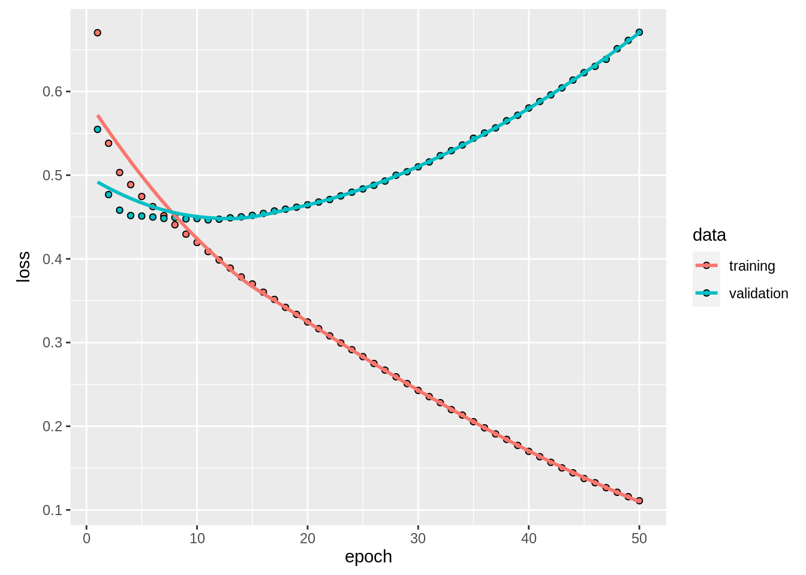
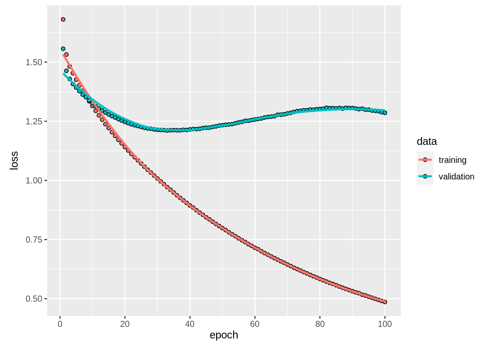
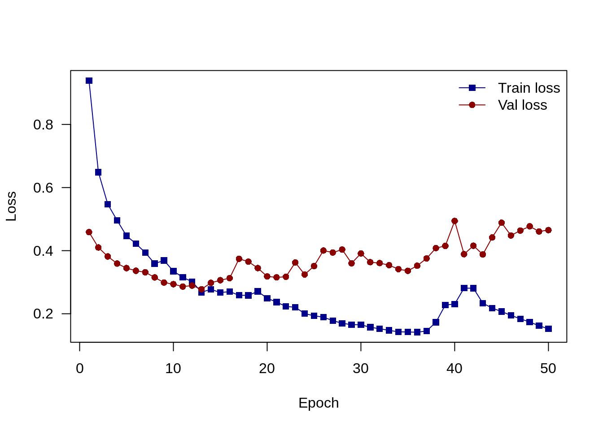
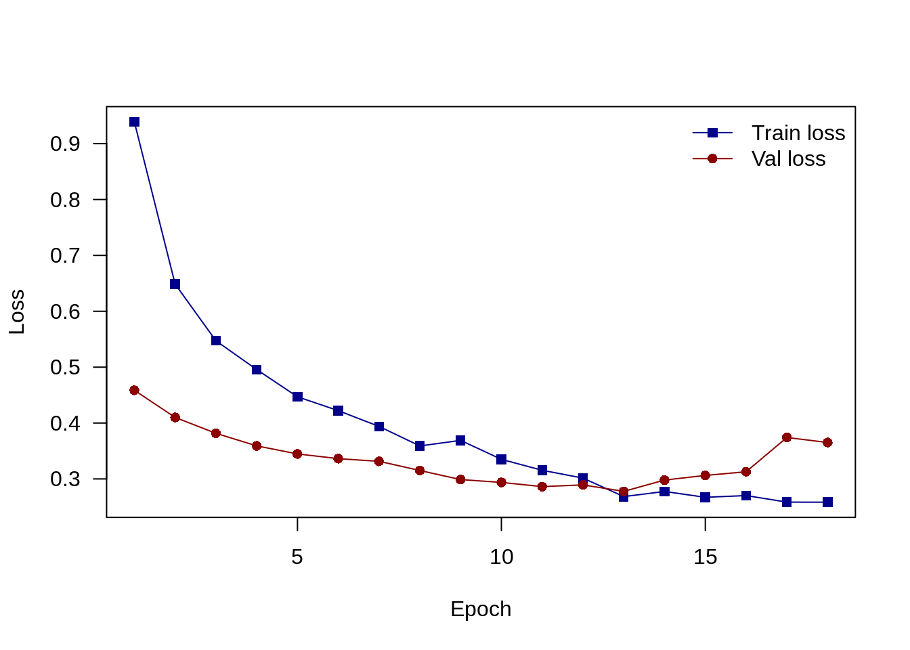
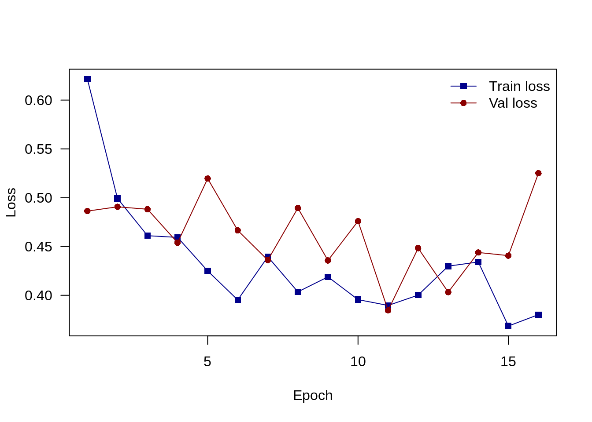
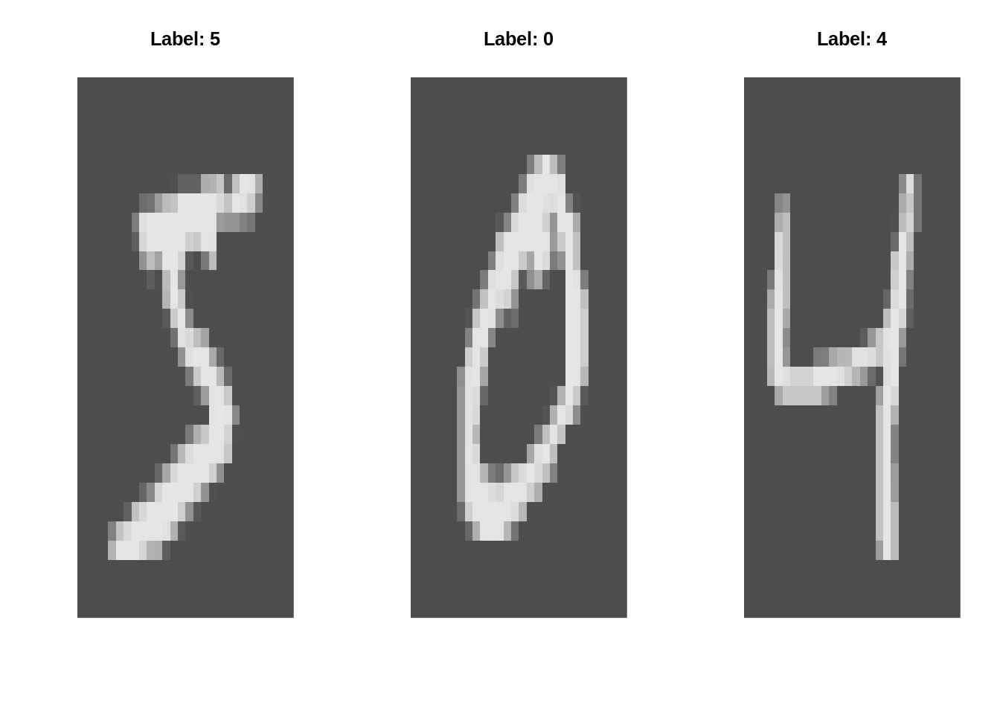
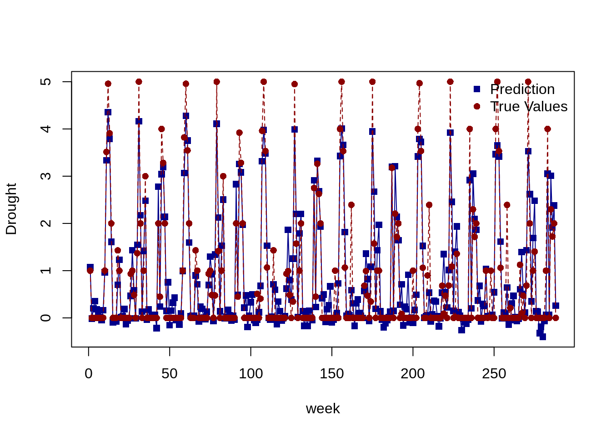

# Deep Learning Architectures{#deep}

```{=html}
<!-- Put this here (right after the first markdown headline) and only here for each document! -->
<script src="./scripts/multipleChoice.js"></script>
```


In this section, we will discuss both, different (deep) network architectures and different means to regularize and improve those deep architectures. 


## Deep Neural Networks (DNNs)

Deep neural networks are basically the same as simple artificial neural networks, only that they have more hidden layers.


### Dropout and Early Stopping in DNNs

Regularization in deep neural networks is very important because of the problem of overfitting. Standard regularization from statistics like $L1$ and $L2$ regularization are often fuzzy and require a lot of tuning. There are more stable and robust methods:

* Early stopping: Early stopping allows us to stop the training when for instance the test loss does not decrease anymore or the validation loss starts increasing.
* Dropout: The Dropout layer randomly sets input units to 0 with a frequency of a given rate at each step during training time, which helps prevent overfitting. Dropout is more robust than $L1$ and $L2$, and tuning of the dropout rate can be beneficial but a rate between $0.2-0.5$ often works quite well.

**Data preparation**

See \@ref(mlr) for explanation about the preprocessing pipeline. 


```r
library(EcoData)
library(tidyverse)
library(mlr3)
library(mlr3pipelines)
data(nasa)
str(nasa)
#> 'data.frame':	4687 obs. of  40 variables:
#>  $ Neo.Reference.ID            : int  3449084 3702322 3406893 NA 2363305 3017307 2438430 3653917 3519490 2066391 ...
#>  $ Name                        : int  NA 3702322 3406893 3082923 2363305 3017307 2438430 3653917 3519490 NA ...
#>  $ Absolute.Magnitude          : num  18.7 22.1 24.8 21.6 21.4 18.2 20 21 20.9 16.5 ...
#>  $ Est.Dia.in.KM.min.          : num  0.4837 0.1011 0.0291 0.1272 0.1395 ...
#>  $ Est.Dia.in.KM.max.          : num  1.0815 0.226 0.0652 0.2845 0.3119 ...
#>  $ Est.Dia.in.M.min.           : num  483.7 NA 29.1 127.2 139.5 ...
#>  $ Est.Dia.in.M.max.           : num  1081.5 226 65.2 284.5 311.9 ...
#>  $ Est.Dia.in.Miles.min.       : num  0.3005 0.0628 NA 0.0791 0.0867 ...
#>  $ Est.Dia.in.Miles.max.       : num  0.672 0.1404 0.0405 0.1768 0.1938 ...
#>  $ Est.Dia.in.Feet.min.        : num  1586.9 331.5 95.6 417.4 457.7 ...
#>  $ Est.Dia.in.Feet.max.        : num  3548 741 214 933 1023 ...
#>  $ Close.Approach.Date         : Factor w/ 777 levels "1995-01-01","1995-01-08",..: 511 712 472 239 273 145 428 694 87 732 ...
#>  $ Epoch.Date.Close.Approach   : num  NA 1.42e+12 1.21e+12 1.00e+12 1.03e+12 ...
#>  $ Relative.Velocity.km.per.sec: num  11.22 13.57 5.75 13.84 4.61 ...
#>  $ Relative.Velocity.km.per.hr : num  40404 48867 20718 49821 16583 ...
#>  $ Miles.per.hour              : num  25105 30364 12873 30957 10304 ...
#>  $ Miss.Dist..Astronomical.    : num  NA 0.0671 0.013 0.0583 0.0381 ...
#>  $ Miss.Dist..lunar.           : num  112.7 26.1 NA 22.7 14.8 ...
#>  $ Miss.Dist..kilometers.      : num  43348668 10030753 1949933 NA 5694558 ...
#>  $ Miss.Dist..miles.           : num  26935614 6232821 1211632 5418692 3538434 ...
#>  $ Orbiting.Body               : Factor w/ 1 level "Earth": 1 1 1 1 1 1 1 1 1 1 ...
#>  $ Orbit.ID                    : int  NA 8 12 12 91 NA 24 NA NA 212 ...
#>  $ Orbit.Determination.Date    : Factor w/ 2680 levels "2014-06-13 15:20:44",..: 69 NA 1377 1774 2275 2554 1919 731 1178 2520 ...
#>  $ Orbit.Uncertainity          : int  0 8 6 0 0 0 1 1 1 0 ...
#>  $ Minimum.Orbit.Intersection  : num  NA 0.05594 0.00553 NA 0.0281 ...
#>  $ Jupiter.Tisserand.Invariant : num  5.58 3.61 4.44 5.5 NA ...
#>  $ Epoch.Osculation            : num  2457800 2457010 NA 2458000 2458000 ...
#>  $ Eccentricity                : num  0.276 0.57 0.344 0.255 0.22 ...
#>  $ Semi.Major.Axis             : num  1.1 NA 1.52 1.11 1.24 ...
#>  $ Inclination                 : num  20.06 4.39 5.44 23.9 3.5 ...
#>  $ Asc.Node.Longitude          : num  29.85 1.42 170.68 356.18 183.34 ...
#>  $ Orbital.Period              : num  419 1040 682 427 503 ...
#>  $ Perihelion.Distance         : num  0.794 0.864 0.994 0.828 0.965 ...
#>  $ Perihelion.Arg              : num  41.8 359.3 350 268.2 179.2 ...
#>  $ Aphelion.Dist               : num  1.4 3.15 2.04 1.39 1.51 ...
#>  $ Perihelion.Time             : num  2457736 2456941 2457937 NA 2458070 ...
#>  $ Mean.Anomaly                : num  55.1 NA NA 297.4 310.5 ...
#>  $ Mean.Motion                 : num  0.859 0.346 0.528 0.843 0.716 ...
#>  $ Equinox                     : Factor w/ 1 level "J2000": 1 1 NA 1 1 1 1 1 1 1 ...
#>  $ Hazardous                   : int  0 0 0 1 1 0 0 0 1 1 ...

data = nasa %>% select(-Orbit.Determination.Date,
                       -Close.Approach.Date, -Name, -Neo.Reference.ID)
data$Hazardous = as.factor(data$Hazardous)
task = TaskClassif$new(id = "nasa", backend = data,
                       target = "Hazardous", positive = "1")
preprocessing = po("imputeoor") %>>% po("scale") %>>% po("encode") 
data = preprocessing$train(task)[[1]]$data()

train = data[!is.na(data$Hazardous),]
submit = data[is.na(data$Hazardous),]

X = scale(train %>% select(-Hazardous))
Y = train %>% select(Hazardous)
Y = model.matrix(~0+as.factor(Hazardous), data = Y)
```

**Early stopping**

::::: {.panelset}

::: {.panel}
[Keras]{.panel-name}


```r
library(tensorflow)
library(keras)
set_random_seed(321L, disable_gpu = FALSE)	# Already sets R's random seed.
#> Loaded Tensorflow version 2.9.1

model = keras_model_sequential()
model %>%
  layer_dense(units = 50L, activation = "relu", input_shape = ncol(X)) %>%
  layer_dense(units = 50L, activation = "relu") %>%
  layer_dense(units = 50L, activation = "relu") %>%
  layer_dense(units = ncol(Y), activation = "softmax") 

model %>%
  keras::compile(loss = loss_categorical_crossentropy,
                 keras::optimizer_adamax(learning_rate = 0.001))
summary(model)
#> Model: "sequential"
#> __________________________________________________________________________________________
#>  Layer (type)                           Output Shape                        Param #       
#> ==========================================================================================
#>  dense_3 (Dense)                        (None, 50)                          1900          
#>  dense_2 (Dense)                        (None, 50)                          2550          
#>  dense_1 (Dense)                        (None, 50)                          2550          
#>  dense (Dense)                          (None, 2)                           102           
#> ==========================================================================================
#> Total params: 7,102
#> Trainable params: 7,102
#> Non-trainable params: 0
#> __________________________________________________________________________________________

model_history =
  model %>%
    fit(x = X, y = Y, 
        epochs = 50L, batch_size = 20L, 
        shuffle = TRUE, validation_split = 0.4)
plot(model_history)
```




:::

::: {.panel}
[Torch]{.panel-name}


```r
library(torch)
torch_manual_seed(321L)
set.seed(123)

model_torch = nn_sequential(
  nn_linear(ncol(X), 50L),
  nn_relu(),
  nn_linear(50L, 50L),
  nn_relu(), 
  nn_linear(50L, 50L),
  nn_relu(), 
  nn_linear(50L, 2L)
)

YT = apply(Y, 1, which.max)

dataset_nasa = dataset(
  name = "nasa",
  initialize = function(nasa){
    self$X = nasa$X
    self$Y = nasa$Y
  },
  .getitem = function(i){
    X = self$X[i,,drop = FALSE] %>% torch_tensor()
    Y = self$Y[i] %>% torch_tensor()
    list(X, Y)
  },
  .length = function(){
    nrow(self$X)
  })

train_dl = dataloader(dataset_nasa(list(X = X[1:400,], Y = YT[1:400])), 
                      batch_size = 32, shuffle = TRUE)
test_dl = dataloader(dataset_nasa(list(X = X[101:500,], Y = YT[101:500])), 
                      batch_size = 32)

model_torch$train()

opt = optim_adam(model_torch$parameters, 0.01)

train_losses = c()
test_losses = c()
for(epoch in 1:50){
  train_loss = c()
  test_loss = c()
  coro::loop(
    for(batch in train_dl){
      opt$zero_grad()
      pred = model_torch(batch[[1]]$squeeze())
      loss = nnf_cross_entropy(pred, batch[[2]]$squeeze(), reduction = "mean")
      loss$backward()
      opt$step()
      train_loss = c(train_loss, loss$item())
    }
  )
  
  coro::loop(
    for(batch in test_dl){
      pred = model_torch(batch[[1]]$squeeze())
      loss = nnf_cross_entropy(pred, batch[[2]]$squeeze(), reduction = "mean")
      test_loss = c(test_loss, loss$item())
    }
  )

  train_losses = c(train_losses, mean(train_loss))
  test_losses = c(test_losses, mean(test_loss))
  if(!epoch%%10) cat(sprintf("Loss at epoch %d: %3f\n", epoch, mean(train_loss)))
}
#> Loss at epoch 10: 0.148818
#> Loss at epoch 20: 0.000151
#> Loss at epoch 30: 0.000016
#> Loss at epoch 40: 0.000006
#> Loss at epoch 50: 0.000003

matplot(cbind(train_losses, test_losses), type = "o", pch = c(15, 16),
        col = c("darkblue", "darkred"), lty = 1, xlab = "Epoch",
        ylab = "Loss", las = 1)
legend("topright", bty = "n", col = c("darkblue", "darkred"),
       lty = 1, pch = c(15, 16), legend = c("Train loss", "Val loss") )
```


:::

::: {.panel}
[Cito]{.panel-name}


```r
library(cito)
data_train = data.frame(target = apply(Y, 1, which.max)-1, X)
model_cito = dnn(
  target~., 
  data = data_train,
  loss = "binomial",
  validation = 0.4,
  hidden = rep(50L, 3L),
  activation = rep("relu", 3),
)
#> Loss at epoch 1: training: 0.546, validation: 0.466, lr: 0.01000
```


```
#> Loss at epoch 2: training: 0.375, validation: 0.477, lr: 0.01000
#> Loss at epoch 3: training: 0.332, validation: 0.530, lr: 0.01000
#> Loss at epoch 4: training: 0.267, validation: 0.637, lr: 0.01000
#> Loss at epoch 5: training: 0.215, validation: 0.778, lr: 0.01000
#> Loss at epoch 6: training: 0.154, validation: 1.074, lr: 0.01000
#> Loss at epoch 7: training: 0.115, validation: 1.300, lr: 0.01000
#> Loss at epoch 8: training: 0.074, validation: 1.353, lr: 0.01000
#> Loss at epoch 9: training: 0.071, validation: 1.844, lr: 0.01000
#> Loss at epoch 10: training: 0.162, validation: 1.740, lr: 0.01000
#> Loss at epoch 11: training: 0.392, validation: 1.154, lr: 0.01000
#> Loss at epoch 12: training: 0.137, validation: 1.002, lr: 0.01000
#> Loss at epoch 13: training: 0.073, validation: 1.219, lr: 0.01000
#> Loss at epoch 14: training: 0.035, validation: 1.313, lr: 0.01000
#> Loss at epoch 15: training: 0.017, validation: 1.391, lr: 0.01000
#> Loss at epoch 16: training: 0.008, validation: 1.512, lr: 0.01000
#> Loss at epoch 17: training: 0.003, validation: 1.645, lr: 0.01000
#> Loss at epoch 18: training: 0.001, validation: 1.730, lr: 0.01000
#> Loss at epoch 19: training: 0.001, validation: 1.782, lr: 0.01000
#> Loss at epoch 20: training: 0.001, validation: 1.832, lr: 0.01000
#> Loss at epoch 21: training: 0.000, validation: 1.931, lr: 0.01000
#> Loss at epoch 22: training: 0.000, validation: 2.006, lr: 0.01000
#> Loss at epoch 23: training: 0.000, validation: 2.061, lr: 0.01000
#> Loss at epoch 24: training: 0.000, validation: 2.091, lr: 0.01000
#> Loss at epoch 25: training: 0.000, validation: 2.109, lr: 0.01000
#> Loss at epoch 26: training: 0.000, validation: 2.120, lr: 0.01000
#> Loss at epoch 27: training: 0.000, validation: 2.130, lr: 0.01000
#> Loss at epoch 28: training: 0.000, validation: 2.138, lr: 0.01000
#> Loss at epoch 29: training: 0.000, validation: 2.147, lr: 0.01000
#> Loss at epoch 30: training: 0.000, validation: 2.154, lr: 0.01000
#> Loss at epoch 31: training: 0.000, validation: 2.162, lr: 0.01000
#> Loss at epoch 32: training: 0.000, validation: 2.168, lr: 0.01000
```

:::

:::::

The validation loss first decreases but then starts increasing again, can you explain this behavior?
$\rightarrow$ Overfitting!

Let's try an $L1+L2$ regularization:


::::: {.panelset}

::: {.panel}
[Keras]{.panel-name}


```r
library(tensorflow)
library(keras)
set_random_seed(321L, disable_gpu = FALSE)	# Already sets R's random seed.

model = keras_model_sequential()
model %>%
  layer_dense(units = 50L, activation = "relu", input_shape = ncol(X),
              kernel_regularizer = regularizer_l1_l2(0.001, 0.001)) %>%
  layer_dense(units = 50L, activation = "relu",
              kernel_regularizer = regularizer_l1_l2(0.001, 0.001)) %>%
  layer_dense(units = 50L, activation = "relu",
              kernel_regularizer = regularizer_l1_l2(0.001, 0.001)) %>%
  layer_dense(units = ncol(Y), activation = "softmax",
              kernel_regularizer = regularizer_l1_l2(0.001, 0.001)) 

model %>%
  keras::compile(loss = loss_categorical_crossentropy,
                 keras::optimizer_adamax(learning_rate = 0.001))
summary(model)
#> Model: "sequential_1"
#> __________________________________________________________________________________________
#>  Layer (type)                           Output Shape                        Param #       
#> ==========================================================================================
#>  dense_7 (Dense)                        (None, 50)                          1900          
#>  dense_6 (Dense)                        (None, 50)                          2550          
#>  dense_5 (Dense)                        (None, 50)                          2550          
#>  dense_4 (Dense)                        (None, 2)                           102           
#> ==========================================================================================
#> Total params: 7,102
#> Trainable params: 7,102
#> Non-trainable params: 0
#> __________________________________________________________________________________________

model_history =
  model %>%
    fit(x = X, y = Y, 
        epochs = 100L, batch_size = 20L, 
        shuffle = TRUE, validation_split = 0.4)
plot(model_history)
```



:::

::: {.panel}
[Torch]{.panel-name}


```r
library(torch)
torch_manual_seed(321L)
set.seed(123)

model_torch = nn_sequential(
  nn_linear(ncol(X), 50L),
  nn_relu(),
  nn_linear(50L, 50L),
  nn_relu(), 
  nn_linear(50L, 50L),
  nn_relu(), 
  nn_linear(50L, 2L)
)

YT = apply(Y, 1, which.max)

dataset_nasa = dataset(
  name = "nasa",
  initialize = function(nasa){
    self$X = nasa$X
    self$Y = nasa$Y
  },
  .getitem = function(i){
    X = self$X[i,,drop = FALSE] %>% torch_tensor()
    Y = self$Y[i] %>% torch_tensor()
    list(X, Y)
  },
  .length = function(){
    nrow(self$X)
  })

train_dl = dataloader(dataset_nasa(list(X = X[1:400,], Y = YT[1:400])), 
                      batch_size = 32, shuffle = TRUE)
test_dl = dataloader(dataset_nasa(list(X = X[101:500,], Y = YT[101:500])), 
                      batch_size = 32)

model_torch$train()

opt = optim_adam(model_torch$parameters, 0.01)

train_losses = c()
test_losses = c()
for(epoch in 1:50){
  train_loss = c()
  test_loss = c()
  coro::loop(
    for(batch in train_dl){
      opt$zero_grad()
      pred = model_torch(batch[[1]]$squeeze())
      loss = nnf_cross_entropy(pred, batch[[2]]$squeeze(), reduction = "mean")
      l1 = 0
      for(p in model_torch$parameters) l1 = l1 + torch_norm(p, 1)
      l2 = 0
      for(p in model_torch$parameters) l2 = l2 + torch_norm(p, 2)
      loss = loss + 0.001*l1 + 0.001*l2
      loss$backward()
      opt$step()
      train_loss = c(train_loss, loss$item())
    }
  )
  
  coro::loop(
    for(batch in test_dl){
      pred = model_torch(batch[[1]]$squeeze())
      loss = nnf_cross_entropy(pred, batch[[2]]$squeeze(), reduction = "mean")
      test_loss = c(test_loss, loss$item())
    }
  )

  train_losses = c(train_losses, mean(train_loss))
  test_losses = c(test_losses, mean(test_loss))
  if(!epoch%%10) cat(sprintf("Loss at epoch %d: %3f\n", epoch, mean(train_loss)))
}
#> Loss at epoch 10: 0.334997
#> Loss at epoch 20: 0.249275
#> Loss at epoch 30: 0.165154
#> Loss at epoch 40: 0.230803
#> Loss at epoch 50: 0.152237

matplot(cbind(train_losses, test_losses), type = "o", pch = c(15, 16),
        col = c("darkblue", "darkred"), lty = 1, xlab = "Epoch",
        ylab = "Loss", las = 1)
legend("topright", bty = "n", col = c("darkblue", "darkred"),
       lty = 1, pch = c(15, 16), legend = c("Train loss", "Val loss") )
```




:::

::: {.panel}
[Cito]{.panel-name}


```r
library(cito)
data_train = data.frame(target = apply(Y, 1, which.max)-1, X)
model_cito = dnn(
  target~., 
  data = data_train,
  loss = "binomial",
  validation = 0.4,
  hidden = rep(50L, 3L),
  activation = rep("relu", 3),
  lambda = 0.001,
  alpha = 0.5
)
#> Loss at epoch 1: training: 0.760, validation: 0.652, lr: 0.01000
```


```
#> Loss at epoch 2: training: 0.533, validation: 0.598, lr: 0.01000
#> Loss at epoch 3: training: 0.464, validation: 0.642, lr: 0.01000
#> Loss at epoch 4: training: 0.408, validation: 0.619, lr: 0.01000
#> Loss at epoch 5: training: 0.358, validation: 0.690, lr: 0.01000
#> Loss at epoch 6: training: 0.312, validation: 0.769, lr: 0.01000
#> Loss at epoch 7: training: 0.271, validation: 0.876, lr: 0.01000
#> Loss at epoch 8: training: 0.254, validation: 0.972, lr: 0.01000
#> Loss at epoch 9: training: 0.244, validation: 0.887, lr: 0.01000
#> Loss at epoch 10: training: 0.232, validation: 1.228, lr: 0.01000
#> Loss at epoch 11: training: 0.194, validation: 1.210, lr: 0.01000
#> Loss at epoch 12: training: 0.174, validation: 1.185, lr: 0.01000
#> Loss at epoch 13: training: 0.150, validation: 1.582, lr: 0.01000
#> Loss at epoch 14: training: 0.150, validation: 1.349, lr: 0.01000
#> Loss at epoch 15: training: 0.135, validation: 1.483, lr: 0.01000
#> Loss at epoch 16: training: 0.131, validation: 1.487, lr: 0.01000
#> Loss at epoch 17: training: 0.131, validation: 1.407, lr: 0.01000
#> Loss at epoch 18: training: 0.123, validation: 1.426, lr: 0.01000
#> Loss at epoch 19: training: 0.123, validation: 1.366, lr: 0.01000
#> Loss at epoch 20: training: 0.113, validation: 1.458, lr: 0.01000
#> Loss at epoch 21: training: 0.106, validation: 1.415, lr: 0.01000
#> Loss at epoch 22: training: 0.101, validation: 1.348, lr: 0.01000
#> Loss at epoch 23: training: 0.097, validation: 1.324, lr: 0.01000
#> Loss at epoch 24: training: 0.093, validation: 1.273, lr: 0.01000
#> Loss at epoch 25: training: 0.090, validation: 1.242, lr: 0.01000
#> Loss at epoch 26: training: 0.088, validation: 1.221, lr: 0.01000
#> Loss at epoch 27: training: 0.085, validation: 1.204, lr: 0.01000
#> Loss at epoch 28: training: 0.083, validation: 1.189, lr: 0.01000
#> Loss at epoch 29: training: 0.081, validation: 1.182, lr: 0.01000
#> Loss at epoch 30: training: 0.079, validation: 1.174, lr: 0.01000
#> Loss at epoch 31: training: 0.077, validation: 1.163, lr: 0.01000
#> Loss at epoch 32: training: 0.076, validation: 1.160, lr: 0.01000
```


:::

:::::

Better, but the validation loss still starts increasing after 40 epochs. We can use early stopping to end the training before the validation loss starts increasing again!

::::: {.panelset}

::: {.panel}
[Keras]{.panel-name}


```r
library(tensorflow)
library(keras)
set_random_seed(321L, disable_gpu = FALSE)	# Already sets R's random seed.

model = keras_model_sequential()
model %>%
  layer_dense(units = 50L, activation = "relu", input_shape = ncol(X),
              kernel_regularizer = regularizer_l1_l2( 0.001, 0.001)) %>%
  layer_dense(units = 50L, activation = "relu",
              kernel_regularizer = regularizer_l1_l2(0.001, 0.001)) %>%
  layer_dense(units = 50L, activation = "relu",
              kernel_regularizer = regularizer_l1_l2(0.001, 0.001)) %>%
  layer_dense(units = ncol(Y), activation = "softmax",
              kernel_regularizer = regularizer_l1_l2(0.001, 0.001)) 

model %>%
  keras::compile(loss = loss_categorical_crossentropy,
                 keras::optimizer_adamax(learning_rate = 0.001))
summary(model)
#> Model: "sequential_2"
#> __________________________________________________________________________________________
#>  Layer (type)                           Output Shape                        Param #       
#> ==========================================================================================
#>  dense_11 (Dense)                       (None, 50)                          1900          
#>  dense_10 (Dense)                       (None, 50)                          2550          
#>  dense_9 (Dense)                        (None, 50)                          2550          
#>  dense_8 (Dense)                        (None, 2)                           102           
#> ==========================================================================================
#> Total params: 7,102
#> Trainable params: 7,102
#> Non-trainable params: 0
#> __________________________________________________________________________________________

early = keras::callback_early_stopping(patience = 5L)

model_history =
  model %>%
    fit(x = X, y = Y, 
        epochs = 100L, batch_size = 20L, 
        shuffle = TRUE, validation_split = 0.4, callbacks = c(early))

plot(model_history)
```


:::

::: {.panel}
[Torch]{.panel-name}


```r
library(torch)
torch_manual_seed(321L)
set.seed(123)

model_torch = nn_sequential(
  nn_linear(ncol(X), 50L),
  nn_relu(),
  nn_linear(50L, 50L),
  nn_relu(), 
  nn_linear(50L, 50L),
  nn_relu(), 
  nn_linear(50L, 2L)
)

YT = apply(Y, 1, which.max)

dataset_nasa = dataset(
  name = "nasa",
  initialize = function(nasa){
    self$X = nasa$X
    self$Y = nasa$Y
  },
  .getitem = function(i){
    X = self$X[i,,drop = FALSE] %>% torch_tensor()
    Y = self$Y[i] %>% torch_tensor()
    list(X, Y)
  },
  .length = function(){
    nrow(self$X)
  })

train_dl = dataloader(dataset_nasa(list(X = X[1:400,], Y = YT[1:400])), 
                      batch_size = 32, shuffle = TRUE)
test_dl = dataloader(dataset_nasa(list(X = X[101:500,], Y = YT[101:500])), 
                      batch_size = 32)

model_torch$train()

opt = optim_adam(model_torch$parameters, 0.01)

train_losses = c()
test_losses = c()
early_epoch = 0
min_loss = Inf
patience = 5
for(epoch in 1:50){
  if(early_epoch >= patience){ break }
  train_loss = c()
  test_loss = c()
  coro::loop(
    for(batch in train_dl){
      opt$zero_grad()
      pred = model_torch(batch[[1]]$squeeze())
      loss = nnf_cross_entropy(pred, batch[[2]]$squeeze(), reduction = "mean")
      l1 = 0
      for(p in model_torch$parameters) l1 = l1 + torch_norm(p, 1)
      l2 = 0
      for(p in model_torch$parameters) l2 = l2 + torch_norm(p, 2)
      loss = loss + 0.001*l1 + 0.001*l2
      loss$backward()
      opt$step()
      train_loss = c(train_loss, loss$item())
    }
  )
  
  coro::loop(
    for(batch in test_dl){
      pred = model_torch(batch[[1]]$squeeze())
      loss = nnf_cross_entropy(pred, batch[[2]]$squeeze(), reduction = "mean")
      test_loss = c(test_loss, loss$item())
    }
  )
  
    ### Early stopping ###
  if(mean(test_loss) < min_loss){
    min_loss = mean(test_loss)
    early_epoch = 0
  } else {
    early_epoch = early_epoch + 1
  }
  ###

  train_losses = c(train_losses, mean(train_loss))
  test_losses = c(test_losses, mean(test_loss))
  if(!epoch%%5) cat(sprintf("Loss at epoch %d: %3f\n", epoch, mean(train_loss)))
}
#> Loss at epoch 5: 0.446946
#> Loss at epoch 10: 0.334997
#> Loss at epoch 15: 0.267128

matplot(cbind(train_losses, test_losses), type = "o", pch = c(15, 16),
        col = c("darkblue", "darkred"), lty = 1, xlab = "Epoch",
        ylab = "Loss", las = 1)
legend("topright", bty = "n", col = c("darkblue", "darkred"),
       lty = 1, pch = c(15, 16), legend = c("Train loss", "Val loss") )
```




:::

::: {.panel}
[Cito]{.panel-name}


```r
library(cito)
data_train = data.frame(target = apply(Y, 1, which.max)-1, X)
model_cito = dnn(
  target~., 
  data = data_train,
  loss = "binomial",
  validation = 0.4,
  hidden = rep(50L, 3L),
  activation = rep("relu", 3),
  lambda = 0.001,
  alpha = 0.5,
  early_stopping = 5.
)
#> Loss at epoch 1: training: 0.720, validation: 0.619, lr: 0.01000
```


```
#> Loss at epoch 2: training: 0.521, validation: 0.605, lr: 0.01000
#> Loss at epoch 3: training: 0.449, validation: 0.622, lr: 0.01000
#> Loss at epoch 4: training: 0.387, validation: 0.680, lr: 0.01000
#> Loss at epoch 5: training: 0.330, validation: 0.827, lr: 0.01000
#> Loss at epoch 6: training: 0.290, validation: 0.924, lr: 0.01000
```


:::

:::::


Patience is the number of epochs to wait before aborting the training. 

**Dropout - another type of regularization**

@dropout suggests a dropout rate of 50% for internal hidden layers and 20% for the input layer. One advantage of dropout is that the training is more independent of the number of epochs i.e. the validation loss usually doesn't start to increase after several epochs. 


::::: {.panelset}

::: {.panel}
[Keras]{.panel-name}


```r
library(tensorflow)
library(keras)
set_random_seed(321L, disable_gpu = FALSE)	# Already sets R's random seed.

model = keras_model_sequential()
model %>%
  layer_dropout(0.2) %>%
  layer_dense(units = 50L, activation = "relu", input_shape = ncol(X)) %>%
  layer_dropout(0.5) %>%
  layer_dense(units = 50L, activation = "relu") %>%
  layer_dropout(0.5) %>%
  layer_dense(units = 50L, activation = "relu") %>%
  layer_dropout(0.5) %>%
  layer_dense(units = ncol(Y), activation = "softmax") 

model %>%
  keras::compile(loss = loss_categorical_crossentropy,
                 keras::optimizer_adamax(learning_rate = 0.001))

model_history =
  model %>%
    fit(x = X, y = Y, 
        epochs = 100L, batch_size = 20L, 
        shuffle = TRUE, validation_split = 0.4)

plot(model_history)
```


Of course, you can still combine early stopping and dropout, which is normally a good idea since it improves training efficiency (e.g. you could start with 1000 epochs and you know training will be aborted if it doesn't improve anymore).

:::

::: {.panel}
[Torch]{.panel-name}


```r
library(torch)
torch_manual_seed(321L)
set.seed(123)

model_torch = nn_sequential(
  nn_dropout(0.2),
  nn_linear(ncol(X), 50L),
  nn_relu(),
  nn_dropout(0.5),
  nn_linear(50L, 50L),
  nn_relu(), 
  nn_dropout(0.5),
  nn_linear(50L, 50L),
  nn_relu(), 
  nn_dropout(0.5),
  nn_linear(50L, 2L)
)

YT = apply(Y, 1, which.max)

dataset_nasa = dataset(
  name = "nasa",
  initialize = function(nasa){
    self$X = nasa$X
    self$Y = nasa$Y
  },
  .getitem = function(i){
    X = self$X[i,,drop = FALSE] %>% torch_tensor()
    Y = self$Y[i] %>% torch_tensor()
    list(X, Y)
  },
  .length = function(){
    nrow(self$X)
  })

train_dl = dataloader(dataset_nasa(list(X = X[1:400,], Y = YT[1:400])), 
                      batch_size = 32, shuffle = TRUE)
test_dl = dataloader(dataset_nasa(list(X = X[101:500,], Y = YT[101:500])), 
                      batch_size = 32)

model_torch$train()

opt = optim_adam(model_torch$parameters, 0.01)

train_losses = c()
test_losses = c()
early_epoch = 0
min_loss = Inf
patience = 5
for(epoch in 1:50){
  if(early_epoch >= patience){ break }
  
  train_loss = c()
  test_loss = c()
  coro::loop(
    for(batch in train_dl){
      opt$zero_grad()
      pred = model_torch(batch[[1]]$squeeze())
      loss = nnf_cross_entropy(pred, batch[[2]]$squeeze(), reduction = "mean")
      loss$backward()
      opt$step()
      train_loss = c(train_loss, loss$item())
    }
  )
  
  coro::loop(
    for(batch in test_dl){
      pred = model_torch(batch[[1]]$squeeze())
      loss = nnf_cross_entropy(pred, batch[[2]]$squeeze(), reduction = "mean")
      test_loss = c(test_loss, loss$item())
    }
  )
  
  ### Early stopping ###
  if(mean(test_loss) < min_loss){
    min_loss = mean(test_loss)
    early_epoch = 0
  } else {
    early_epoch = early_epoch + 1
  }
  ###
  
  train_losses = c(train_losses, mean(train_loss))
  test_losses = c(test_losses, mean(test_loss))
  cat(sprintf("Loss at epoch %d: %3f\n", epoch, mean(train_loss)))
}
#> Loss at epoch 1: 0.621523
#> Loss at epoch 2: 0.499234
#> Loss at epoch 3: 0.461054
#> Loss at epoch 4: 0.459289
#> Loss at epoch 5: 0.424963
#> Loss at epoch 6: 0.395236
#> Loss at epoch 7: 0.439434
#> Loss at epoch 8: 0.403502
#> Loss at epoch 9: 0.418872
#> Loss at epoch 10: 0.395561
#> Loss at epoch 11: 0.389564
#> Loss at epoch 12: 0.400194
#> Loss at epoch 13: 0.429872
#> Loss at epoch 14: 0.434117
#> Loss at epoch 15: 0.368484
#> Loss at epoch 16: 0.380166

model_torch$eval() # to turn off dropout

matplot(cbind(train_losses, test_losses), type = "o", pch = c(15, 16),
        col = c("darkblue", "darkred"), lty = 1, xlab = "Epoch",
        ylab = "Loss", las = 1)
legend("topright", bty = "n", col = c("darkblue", "darkred"),
       lty = 1, pch = c(15, 16), legend = c("Train loss", "Val loss") )
```



:::

::: {.panel}
[Cito]{.panel-name}


```r
library(cito)
data_train = data.frame(target = apply(Y, 1, which.max)-1, X)
model_cito = dnn(
  target~., 
  data = data_train,
  loss = "binomial",
  validation = 0.4,
  hidden = rep(50L, 3L),
  activation = rep("relu", 3),
  dropout = 0.5,
  early_stopping = 5.
)
#> Loss at epoch 1: training: 0.534, validation: 0.591, lr: 0.01000
```


```
#> Loss at epoch 2: training: 0.485, validation: 0.485, lr: 0.01000
#> Loss at epoch 3: training: 0.433, validation: 0.472, lr: 0.01000
#> Loss at epoch 4: training: 0.410, validation: 0.506, lr: 0.01000
#> Loss at epoch 5: training: 0.364, validation: 0.520, lr: 0.01000
#> Loss at epoch 6: training: 0.380, validation: 0.538, lr: 0.01000
#> Loss at epoch 7: training: 0.342, validation: 0.609, lr: 0.01000
```


:::

:::::


### Exercises
```{=html}
  <hr/>
  <strong><span style="color: #0011AA; font-size:18px;">1. Task</span></strong><br/>
```

In this section, we will fit a DNN on the NASA data set from kaggle (available via EcoData, see data description via help) by using a 10-CV. You can start immediately, or get inspiration by reading section above ("Case study: dropout and early stopping in a deep neural network").

A basic network for this problem follows:

Data preparation:


```r
library(tidyverse)
library(missRanger)
library(Metrics)
library(EcoData)
set_random_seed(321L, disable_gpu = FALSE)	# Already sets R's random seed.

data("nasa")
data = nasa

data$subset = ifelse(is.na(data$Hazardous), "test", "train")

## Explore and clean data.
str(data)
#> 'data.frame':	4687 obs. of  41 variables:
#>  $ Neo.Reference.ID            : int  3449084 3702322 3406893 NA 2363305 3017307 2438430 3653917 3519490 2066391 ...
#>  $ Name                        : int  NA 3702322 3406893 3082923 2363305 3017307 2438430 3653917 3519490 NA ...
#>  $ Absolute.Magnitude          : num  18.7 22.1 24.8 21.6 21.4 18.2 20 21 20.9 16.5 ...
#>  $ Est.Dia.in.KM.min.          : num  0.4837 0.1011 0.0291 0.1272 0.1395 ...
#>  $ Est.Dia.in.KM.max.          : num  1.0815 0.226 0.0652 0.2845 0.3119 ...
#>  $ Est.Dia.in.M.min.           : num  483.7 NA 29.1 127.2 139.5 ...
#>  $ Est.Dia.in.M.max.           : num  1081.5 226 65.2 284.5 311.9 ...
#>  $ Est.Dia.in.Miles.min.       : num  0.3005 0.0628 NA 0.0791 0.0867 ...
#>  $ Est.Dia.in.Miles.max.       : num  0.672 0.1404 0.0405 0.1768 0.1938 ...
#>  $ Est.Dia.in.Feet.min.        : num  1586.9 331.5 95.6 417.4 457.7 ...
#>  $ Est.Dia.in.Feet.max.        : num  3548 741 214 933 1023 ...
#>  $ Close.Approach.Date         : Factor w/ 777 levels "1995-01-01","1995-01-08",..: 511 712 472 239 273 145 428 694 87 732 ...
#>  $ Epoch.Date.Close.Approach   : num  NA 1.42e+12 1.21e+12 1.00e+12 1.03e+12 ...
#>  $ Relative.Velocity.km.per.sec: num  11.22 13.57 5.75 13.84 4.61 ...
#>  $ Relative.Velocity.km.per.hr : num  40404 48867 20718 49821 16583 ...
#>  $ Miles.per.hour              : num  25105 30364 12873 30957 10304 ...
#>  $ Miss.Dist..Astronomical.    : num  NA 0.0671 0.013 0.0583 0.0381 ...
#>  $ Miss.Dist..lunar.           : num  112.7 26.1 NA 22.7 14.8 ...
#>  $ Miss.Dist..kilometers.      : num  43348668 10030753 1949933 NA 5694558 ...
#>  $ Miss.Dist..miles.           : num  26935614 6232821 1211632 5418692 3538434 ...
#>  $ Orbiting.Body               : Factor w/ 1 level "Earth": 1 1 1 1 1 1 1 1 1 1 ...
#>  $ Orbit.ID                    : int  NA 8 12 12 91 NA 24 NA NA 212 ...
#>  $ Orbit.Determination.Date    : Factor w/ 2680 levels "2014-06-13 15:20:44",..: 69 NA 1377 1774 2275 2554 1919 731 1178 2520 ...
#>  $ Orbit.Uncertainity          : int  0 8 6 0 0 0 1 1 1 0 ...
#>  $ Minimum.Orbit.Intersection  : num  NA 0.05594 0.00553 NA 0.0281 ...
#>  $ Jupiter.Tisserand.Invariant : num  5.58 3.61 4.44 5.5 NA ...
#>  $ Epoch.Osculation            : num  2457800 2457010 NA 2458000 2458000 ...
#>  $ Eccentricity                : num  0.276 0.57 0.344 0.255 0.22 ...
#>  $ Semi.Major.Axis             : num  1.1 NA 1.52 1.11 1.24 ...
#>  $ Inclination                 : num  20.06 4.39 5.44 23.9 3.5 ...
#>  $ Asc.Node.Longitude          : num  29.85 1.42 170.68 356.18 183.34 ...
#>  $ Orbital.Period              : num  419 1040 682 427 503 ...
#>  $ Perihelion.Distance         : num  0.794 0.864 0.994 0.828 0.965 ...
#>  $ Perihelion.Arg              : num  41.8 359.3 350 268.2 179.2 ...
#>  $ Aphelion.Dist               : num  1.4 3.15 2.04 1.39 1.51 ...
#>  $ Perihelion.Time             : num  2457736 2456941 2457937 NA 2458070 ...
#>  $ Mean.Anomaly                : num  55.1 NA NA 297.4 310.5 ...
#>  $ Mean.Motion                 : num  0.859 0.346 0.528 0.843 0.716 ...
#>  $ Equinox                     : Factor w/ 1 level "J2000": 1 1 NA 1 1 1 1 1 1 1 ...
#>  $ Hazardous                   : int  0 0 0 1 1 0 0 0 1 1 ...
#>  $ subset                      : chr  "train" "train" "train" "train" ...
summary(data)
#>  Neo.Reference.ID       Name         Absolute.Magnitude Est.Dia.in.KM.min.
#>  Min.   :2000433   Min.   :2000433   Min.   :11.16      Min.   : 0.00101  
#>  1st Qu.:3102682   1st Qu.:3102683   1st Qu.:20.10      1st Qu.: 0.03346  
#>  Median :3514800   Median :3514800   Median :21.90      Median : 0.11080  
#>  Mean   :3272675   Mean   :3273113   Mean   :22.27      Mean   : 0.20523  
#>  3rd Qu.:3690987   3rd Qu.:3690385   3rd Qu.:24.50      3rd Qu.: 0.25384  
#>  Max.   :3781897   Max.   :3781897   Max.   :32.10      Max.   :15.57955  
#>  NA's   :53        NA's   :57        NA's   :36         NA's   :60        
#>  Est.Dia.in.KM.max. Est.Dia.in.M.min.   Est.Dia.in.M.max.  Est.Dia.in.Miles.min.
#>  Min.   : 0.00226   Min.   :    1.011   Min.   :    2.26   Min.   :0.00063      
#>  1st Qu.: 0.07482   1st Qu.:   33.462   1st Qu.:   74.82   1st Qu.:0.02079      
#>  Median : 0.24777   Median :  110.804   Median :  247.77   Median :0.06885      
#>  Mean   : 0.45754   Mean   :  204.649   Mean   :  458.45   Mean   :0.12734      
#>  3rd Qu.: 0.56760   3rd Qu.:  253.837   3rd Qu.:  567.60   3rd Qu.:0.15773      
#>  Max.   :34.83694   Max.   :15579.552   Max.   :34836.94   Max.   :9.68068      
#>  NA's   :23         NA's   :29          NA's   :46         NA's   :42           
#>  Est.Dia.in.Miles.max. Est.Dia.in.Feet.min. Est.Dia.in.Feet.max. Close.Approach.Date
#>  Min.   : 0.00140      Min.   :    3.32     Min.   :     7.41    2016-07-22:  18    
#>  1st Qu.: 0.04649      1st Qu.:  109.78     1st Qu.:   245.49    2015-01-15:  17    
#>  Median : 0.15395      Median :  363.53     Median :   812.88    2015-02-15:  16    
#>  Mean   : 0.28486      Mean   :  670.44     Mean   :  1500.77    2007-11-08:  15    
#>  3rd Qu.: 0.35269      3rd Qu.:  832.80     3rd Qu.:  1862.19    2012-01-15:  15    
#>  Max.   :21.64666      Max.   :51114.02     Max.   :114294.42    (Other)   :4577    
#>  NA's   :50            NA's   :21           NA's   :46           NA's      :  29    
#>  Epoch.Date.Close.Approach Relative.Velocity.km.per.sec Relative.Velocity.km.per.hr
#>  Min.   :7.889e+11         Min.   : 0.3355              Min.   :  1208             
#>  1st Qu.:1.016e+12         1st Qu.: 8.4497              1st Qu.: 30399             
#>  Median :1.203e+12         Median :12.9370              Median : 46532             
#>  Mean   :1.180e+12         Mean   :13.9848              Mean   : 50298             
#>  3rd Qu.:1.356e+12         3rd Qu.:18.0774              3rd Qu.: 65068             
#>  Max.   :1.473e+12         Max.   :44.6337              Max.   :160681             
#>  NA's   :43                NA's   :27                   NA's   :28                 
#>  Miles.per.hour    Miss.Dist..Astronomical. Miss.Dist..lunar.   Miss.Dist..kilometers.
#>  Min.   :  750.5   Min.   :0.00018          Min.   :  0.06919   Min.   :   26610      
#>  1st Qu.:18846.7   1st Qu.:0.13341          1st Qu.: 51.89874   1st Qu.:19964907      
#>  Median :28893.7   Median :0.26497          Median :103.19415   Median :39685408      
#>  Mean   :31228.0   Mean   :0.25690          Mean   : 99.91366   Mean   :38436154      
#>  3rd Qu.:40436.9   3rd Qu.:0.38506          3rd Qu.:149.59244   3rd Qu.:57540318      
#>  Max.   :99841.2   Max.   :0.49988          Max.   :194.45491   Max.   :74781600      
#>  NA's   :38        NA's   :60               NA's   :30          NA's   :56            
#>  Miss.Dist..miles.  Orbiting.Body    Orbit.ID             Orbit.Determination.Date
#>  Min.   :   16535   Earth:4665    Min.   :  1.00   2017-06-21 06:17:20:   9       
#>  1st Qu.:12454813   NA's :  22    1st Qu.:  9.00   2017-04-06 08:57:13:   8       
#>  Median :24662435                 Median : 16.00   2017-04-06 09:24:24:   8       
#>  Mean   :23885560                 Mean   : 28.34   2017-04-06 08:24:13:   7       
#>  3rd Qu.:35714721                 3rd Qu.: 31.00   2017-04-06 08:26:19:   7       
#>  Max.   :46467132                 Max.   :611.00   (Other)            :4622       
#>  NA's   :27                       NA's   :33       NA's               :  26       
#>  Orbit.Uncertainity Minimum.Orbit.Intersection Jupiter.Tisserand.Invariant
#>  Min.   :0.000      Min.   :0.00000            Min.   :2.196              
#>  1st Qu.:0.000      1st Qu.:0.01435            1st Qu.:4.047              
#>  Median :3.000      Median :0.04653            Median :5.071              
#>  Mean   :3.521      Mean   :0.08191            Mean   :5.056              
#>  3rd Qu.:6.000      3rd Qu.:0.12150            3rd Qu.:6.017              
#>  Max.   :9.000      Max.   :0.47789            Max.   :9.025              
#>  NA's   :49         NA's   :137                NA's   :56                 
#>  Epoch.Osculation   Eccentricity     Semi.Major.Axis   Inclination      
#>  Min.   :2450164   Min.   :0.00752   Min.   :0.6159   Min.   : 0.01451  
#>  1st Qu.:2458000   1st Qu.:0.24086   1st Qu.:1.0012   1st Qu.: 4.93290  
#>  Median :2458000   Median :0.37251   Median :1.2422   Median :10.27694  
#>  Mean   :2457723   Mean   :0.38267   Mean   :1.4009   Mean   :13.36159  
#>  3rd Qu.:2458000   3rd Qu.:0.51256   3rd Qu.:1.6782   3rd Qu.:19.47848  
#>  Max.   :2458020   Max.   :0.96026   Max.   :5.0720   Max.   :75.40667  
#>  NA's   :60        NA's   :39        NA's   :53       NA's   :42        
#>  Asc.Node.Longitude Orbital.Period   Perihelion.Distance Perihelion.Arg    
#>  Min.   :  0.0019   Min.   : 176.6   Min.   :0.08074     Min.   :  0.0069  
#>  1st Qu.: 83.1849   1st Qu.: 365.9   1st Qu.:0.63038     1st Qu.: 95.6430  
#>  Median :172.6347   Median : 504.9   Median :0.83288     Median :189.7729  
#>  Mean   :172.1717   Mean   : 635.5   Mean   :0.81316     Mean   :184.0185  
#>  3rd Qu.:254.8804   3rd Qu.: 793.1   3rd Qu.:0.99718     3rd Qu.:271.9535  
#>  Max.   :359.9059   Max.   :4172.2   Max.   :1.29983     Max.   :359.9931  
#>  NA's   :60         NA's   :46       NA's   :22          NA's   :48        
#>  Aphelion.Dist    Perihelion.Time    Mean.Anomaly       Mean.Motion       Equinox    
#>  Min.   :0.8038   Min.   :2450100   Min.   :  0.0032   Min.   :0.08628   J2000:4663  
#>  1st Qu.:1.2661   1st Qu.:2457815   1st Qu.: 87.0069   1st Qu.:0.45147   NA's :  24  
#>  Median :1.6182   Median :2457972   Median :186.0219   Median :0.71137               
#>  Mean   :1.9864   Mean   :2457726   Mean   :181.2882   Mean   :0.73732               
#>  3rd Qu.:2.4497   3rd Qu.:2458108   3rd Qu.:276.6418   3rd Qu.:0.98379               
#>  Max.   :8.9839   Max.   :2458839   Max.   :359.9180   Max.   :2.03900               
#>  NA's   :38       NA's   :59        NA's   :40         NA's   :48                    
#>    Hazardous        subset         
#>  Min.   :0.000   Length:4687       
#>  1st Qu.:0.000   Class :character  
#>  Median :0.000   Mode  :character  
#>  Mean   :0.176                     
#>  3rd Qu.:0.000                     
#>  Max.   :1.000                     
#>  NA's   :4187

# Remove Equinox and other features.
data = data %>% select(-Equinox, -Orbiting.Body,
                       -Orbit.Determination.Date, -Close.Approach.Date)

# Impute missing values using a random forest.
imputed = data %>%
  select(-Hazardous) %>%
    missRanger::missRanger(maxiter = 5L, num.trees = 20L)
#> 
#> Missing value imputation by random forests
#> 
#>   Variables to impute:		Neo.Reference.ID, Name, Absolute.Magnitude, Est.Dia.in.KM.min., Est.Dia.in.KM.max., Est.Dia.in.M.min., Est.Dia.in.M.max., Est.Dia.in.Miles.min., Est.Dia.in.Miles.max., Est.Dia.in.Feet.min., Est.Dia.in.Feet.max., Epoch.Date.Close.Approach, Relative.Velocity.km.per.sec, Relative.Velocity.km.per.hr, Miles.per.hour, Miss.Dist..Astronomical., Miss.Dist..lunar., Miss.Dist..kilometers., Miss.Dist..miles., Orbit.ID, Orbit.Uncertainity, Minimum.Orbit.Intersection, Jupiter.Tisserand.Invariant, Epoch.Osculation, Eccentricity, Semi.Major.Axis, Inclination, Asc.Node.Longitude, Orbital.Period, Perihelion.Distance, Perihelion.Arg, Aphelion.Dist, Perihelion.Time, Mean.Anomaly, Mean.Motion
#>   Variables used to impute:	Neo.Reference.ID, Name, Absolute.Magnitude, Est.Dia.in.KM.min., Est.Dia.in.KM.max., Est.Dia.in.M.min., Est.Dia.in.M.max., Est.Dia.in.Miles.min., Est.Dia.in.Miles.max., Est.Dia.in.Feet.min., Est.Dia.in.Feet.max., Epoch.Date.Close.Approach, Relative.Velocity.km.per.sec, Relative.Velocity.km.per.hr, Miles.per.hour, Miss.Dist..Astronomical., Miss.Dist..lunar., Miss.Dist..kilometers., Miss.Dist..miles., Orbit.ID, Orbit.Uncertainity, Minimum.Orbit.Intersection, Jupiter.Tisserand.Invariant, Epoch.Osculation, Eccentricity, Semi.Major.Axis, Inclination, Asc.Node.Longitude, Orbital.Period, Perihelion.Distance, Perihelion.Arg, Aphelion.Dist, Perihelion.Time, Mean.Anomaly, Mean.Motion, subset
#> iter 1:	...................................
#> iter 2:	...................................
#> iter 3:	...................................
#> iter 4:	...................................

# See the usual function call:
# data_impute = data %>% select(-Hazardous)
# imputed = missRanger::missRanger(data_impute, maxiter = 5L, num.trees = 20L)

# Scale data.
data = cbind(
  data %>% select(Hazardous),
  scale(imputed %>% select(-subset)),
  data.frame("subset" = data$subset)
)

## Outer split.
train = data[data$subset == "train", ]
test = data[data$subset == "test", ]

train = train %>% select(-subset)
test = test %>% select(-subset)

## 10-fold cross-validation:
len = nrow(train)
ord = sample.int(len)
k = 10
cv_indices = lapply(0:9, function(i) sort(ord[(i*len/k + 1):((i+1)*len/k)]))

result = matrix(NA, 10L, 2L)
colnames(result) = c("train_auc", "test_auc")
```


::::: {.panelset}

::: {.panel}
[Keras]{.panel-name}


```r

for(i in 1:10) {
  indices = cv_indices[[i]]
  sub_train = train[-indices,] # Leave one "bucket" out.
  sub_test = train[indices,]
  
  # "Deep" neural networks and regularization:
  model = keras_model_sequential()
  model %>%
  layer_dense(units = 100L, activation = "relu",
             input_shape = ncol(sub_train) - 1L) %>%
  layer_dense(units = 100L, activation = "relu") %>%
  layer_dense(units = 1L, activation = "sigmoid")
  
  model %>%
  keras::compile(loss = loss_binary_crossentropy, 
                 optimizer = optimizer_adamax(0.01))
  
  model_history = 
   model %>%
     fit(
       x = as.matrix(sub_train %>% select(-Hazardous)),
       y = as.matrix(sub_train %>% select(Hazardous)),
       validation_split = 0.2,
       epochs = 35L, batch = 50L, shuffle = TRUE
      )
  
  plot(model_history)
  
  pred_train = predict(model, as.matrix(sub_train %>% select(-Hazardous)))
  pred_test = predict(model, as.matrix(sub_test %>% select(-Hazardous)))
  
  # AUC: Area under the (ROC) curve, this is a performance measure [0, 1].
  # 0.5 is worst for a binary classifier.
  # 1 perfectly classifies all samples, 0 perfectly misclassifies all samples.
  result[i, 1] = Metrics::auc(sub_train$Hazardous, pred_train)
  result[i, 2] = Metrics::auc(sub_test$Hazardous, pred_test)
}
print(result)
#>       train_auc  test_auc
#>  [1,] 0.9981234 0.9268293
#>  [2,] 0.9984570 0.9866667
#>  [3,] 0.9960277 0.9822222
#>  [4,] 0.9965881 0.9650000
#>  [5,] 0.9987838 0.9017857
#>  [6,] 0.9976351 0.8809524
#>  [7,] 0.9932803 0.9824561
#>  [8,] 0.9933126 0.9972900
#>  [9,] 0.9944652 0.9484127
#> [10,] 0.9968919 0.9642857
(colMeans(result))
#> train_auc  test_auc 
#> 0.9963565 0.9535901

# The model setup seems to be fine.

## Train and predict for outer validation split (on the complete training data):
model = keras_model_sequential()
model %>%
  layer_dense(units = 100L, activation = "relu",
              input_shape = ncol(sub_train) - 1L) %>%
  layer_dense(units = 100L, activation = "relu") %>%
  layer_dense(units = 1L, activation = "sigmoid")

model %>%
  keras::compile(loss = loss_binary_crossentropy, 
                 optimizer = optimizer_adamax(0.01))

model_history = 
  model %>%
    fit(
      x = as.matrix(train %>% select(-Hazardous)),
      y = as.matrix(train %>% select(Hazardous)),
      validation_split = 0.2,
      epochs = 35L, batch = 50L, shuffle = TRUE
    )

pred = round(predict(model, as.matrix(test[,-1])))

write.csv(data.frame(y = pred), file = "submission_DNN.csv")
```

:::

::: {.panel}
[Torch]{.panel-name}


```r

library(torch)
torch_dataset = torch::dataset(
    name = "data",
    initialize = function(X,Y) {
      self$X = torch::torch_tensor(as.matrix(X), dtype = torch_float32())
      self$Y = torch::torch_tensor(as.matrix(Y), dtype = torch_float32())
    },
    .getitem = function(index) {
      x = self$X[index,]
      y = self$Y[index,]
      list(x, y)
    },
    .length = function() {
      self$Y$size()[[1]]
    }
  )


for(i in 1:10) {
  indices = cv_indices[[i]]
  sub_train = train[-indices,] # Leave one "bucket" out.
  sub_test = train[indices,]
  
  # "Deep" neural networks and regularization:
  
  model_torch = nn_sequential(
    nn_linear(in_features = ncol(sub_train)-1, out_features = 50L,  bias = TRUE),
    nn_relu(),
    nn_linear(in_features = 50L, out_features = 50L,  bias = TRUE),
    nn_relu(),
    nn_linear(in_features = 50L, out_features = 1L,  bias = TRUE),
    nn_sigmoid()
  )
  
  opt = optim_adam(params = model_torch$parameters, lr = 0.1)
  
  indices = sample.int(nrow(sub_train), 0.8*nrow(sub_train))
  dataset = torch_dataset((as.matrix(sub_train %>% select(-Hazardous)))[indices, ],
                          (as.matrix(sub_train %>% select(Hazardous)))[indices, ,drop=FALSE])
  dataset_val = torch_dataset((as.matrix(sub_train %>% select(-Hazardous)))[-indices, ],
                              (as.matrix(sub_train %>% select(Hazardous)))[-indices, ,drop=FALSE])
  dataloader = torch::dataloader(dataset, batch_size = 30L, shuffle = TRUE)
  dataloader_val = torch::dataloader(dataset, batch_size = 30L, shuffle = TRUE)
  
  epochs = 50L
  train_losses = c()
  val_losses = c()
  lambda = torch_tensor(0.01)
  alpha = torch_tensor(0.2)
  for(epoch in 1:epochs){
    train_loss = c()
    val_loss = c()
    coro::loop(
      for(batch in dataloader) { 
        opt$zero_grad()
        pred = model_torch(batch[[1]])
        loss = nnf_binary_cross_entropy( pred , batch[[2]])
        for(p in model_torch$parameters) {
          if(length(dim(p)) > 1) loss = loss + lambda*((1-alpha)*torch_norm(p, 1L) + alpha*torch_norm(p, 2L))
        }
        loss$backward()
        opt$step()
        train_loss = c(train_loss, loss$item())
      }
    )
    ## Calculate validation loss ##
    coro::loop(
      for(batch in dataloader_val) { 
        pred = model_torch(batch[[1]])
        loss = nnf_binary_cross_entropy(pred, batch[[2]])
        val_loss = c(val_loss, loss$item())
      }
    )
    
    train_losses = c(train_losses, mean(train_loss))
    val_losses = c(val_losses, mean(val_loss))
    if(!epoch%%10) cat(sprintf("Loss at epoch %d: %3f  Val loss: %3f\n", epoch, mean(train_loss), mean(val_loss)))
  }
  
  matplot(cbind(train_losses, val_losses), type = "o", pch = c(15, 16),
          col = c("darkblue", "darkred"), lty = 1, xlab = "Epoch",
          ylab = "Loss", las = 1)
  legend("topright", bty = "n", 
         legend = c("Train loss", "Val loss"), 
         pch = c(15, 16), col = c("darkblue", "darkred"))
  
  
  pred_train = predict(model, as.matrix(sub_train %>% select(-Hazardous)))
  pred_train = model_torch(torch_tensor(as.matrix(sub_train %>% select(-Hazardous)))) %>% as.numeric
  pred_test = model_torch(torch_tensor(as.matrix(sub_test %>% select(-Hazardous)))) %>% as.numeric
  
  # AUC: Area under the (ROC) curve, this is a performance measure [0, 1].
  # 0.5 is worst for a binary classifier.
  # 1 perfectly classifies all samples, 0 perfectly misclassifies all samples.
  result[i, 1] = Metrics::auc(sub_train$Hazardous, pred_train)
  result[i, 2] = Metrics::auc(sub_test$Hazardous, pred_test)
}
#> Loss at epoch 10: 0.829017  Val loss: 0.182509
#> Loss at epoch 20: 0.701753  Val loss: 0.172302
#> Loss at epoch 30: 0.698969  Val loss: 0.157188
#> Loss at epoch 40: 0.700181  Val loss: 0.146019
#> Loss at epoch 50: 0.705486  Val loss: 0.176424
```


```
#> Loss at epoch 10: 0.763818  Val loss: 0.165957
#> Loss at epoch 20: 0.742365  Val loss: 0.169747
#> Loss at epoch 30: 0.686639  Val loss: 0.125889
#> Loss at epoch 40: 0.688209  Val loss: 0.113968
#> Loss at epoch 50: 0.700927  Val loss: 0.144689
```


```
#> Loss at epoch 10: 0.803255  Val loss: 0.179034
#> Loss at epoch 20: 0.728545  Val loss: 0.175123
#> Loss at epoch 30: 0.698292  Val loss: 0.110397
#> Loss at epoch 40: 0.690141  Val loss: 0.101464
#> Loss at epoch 50: 0.710400  Val loss: 0.165217
```


```
#> Loss at epoch 10: 0.774479  Val loss: 0.124245
#> Loss at epoch 20: 0.781940  Val loss: 0.100304
#> Loss at epoch 30: 0.736063  Val loss: 0.113301
#> Loss at epoch 40: 0.691388  Val loss: 0.081147
#> Loss at epoch 50: 0.730457  Val loss: 0.119942
```


```
#> Loss at epoch 10: 0.731244  Val loss: 0.160419
#> Loss at epoch 20: 0.714435  Val loss: 0.166416
#> Loss at epoch 30: 0.694688  Val loss: 0.132884
#> Loss at epoch 40: 0.689699  Val loss: 0.124507
#> Loss at epoch 50: 0.731581  Val loss: 0.145156
```


```
#> Loss at epoch 10: 0.809190  Val loss: 0.179954
#> Loss at epoch 20: 0.725614  Val loss: 0.119201
#> Loss at epoch 30: 0.714013  Val loss: 0.113931
#> Loss at epoch 40: 0.690072  Val loss: 0.169328
#> Loss at epoch 50: 0.677388  Val loss: 0.102784
```


```
#> Loss at epoch 10: 0.811071  Val loss: 0.219090
#> Loss at epoch 20: 0.764542  Val loss: 0.147753
#> Loss at epoch 30: 0.694446  Val loss: 0.168150
#> Loss at epoch 40: 0.710823  Val loss: 0.141908
#> Loss at epoch 50: 0.677895  Val loss: 0.128026
```


```
#> Loss at epoch 10: 0.835809  Val loss: 0.181617
#> Loss at epoch 20: 0.768913  Val loss: 0.161498
#> Loss at epoch 30: 0.698743  Val loss: 0.167851
#> Loss at epoch 40: 0.734401  Val loss: 0.189557
#> Loss at epoch 50: 0.720234  Val loss: 0.122505
```


```
#> Loss at epoch 10: 0.833461  Val loss: 0.142397
#> Loss at epoch 20: 0.703127  Val loss: 0.137720
#> Loss at epoch 30: 0.760898  Val loss: 0.162455
#> Loss at epoch 40: 0.728296  Val loss: 0.127886
#> Loss at epoch 50: 0.690591  Val loss: 0.135698
```


```
#> Loss at epoch 10: 0.747076  Val loss: 0.217834
#> Loss at epoch 20: 0.716065  Val loss: 0.165585
#> Loss at epoch 30: 0.723334  Val loss: 0.185342
#> Loss at epoch 40: 0.717497  Val loss: 0.166969
#> Loss at epoch 50: 0.750742  Val loss: 0.220579
```


```r
print(result)
#>       train_auc  test_auc
#>  [1,] 0.9734894 0.9945799
#>  [2,] 0.9789239 1.0000000
#>  [3,] 0.9741144 0.9866667
#>  [4,] 0.9821133 0.9475000
#>  [5,] 0.9843581 0.9523810
#>  [6,] 0.9879730 0.8690476
#>  [7,] 0.9793660 0.9978070
#>  [8,] 0.9854993 1.0000000
#>  [9,] 0.9762076 0.9861111
#> [10,] 0.9428716 0.9732143
(colMeans(result))
#> train_auc  test_auc 
#> 0.9764917 0.9707308

# The model setup seems to be fine.

## Train and predict for outer validation split (on the complete training data):
model_torch = nn_sequential(
  nn_linear(in_features = ncol(sub_train)-1, out_features = 50L,  bias = TRUE),
  nn_relu(),
  nn_linear(in_features = 50L, out_features = 50L,  bias = TRUE),
  nn_relu(),
  nn_linear(in_features = 50L, out_features = 1L,  bias = TRUE),
  nn_sigmoid()
)
  
opt = optim_adam(params = model_torch$parameters, lr = 0.1)
dataset = torch_dataset((as.matrix(train %>% select(-Hazardous)))[indices, ],
                        (as.matrix(train %>% select(Hazardous)))[indices, ,drop=FALSE])
dataloader = torch::dataloader(dataset, batch_size = 30L, shuffle = TRUE)

epochs = 50L
train_losses = c()
lambda = torch_tensor(0.01)
alpha = torch_tensor(0.2)
for(epoch in 1:epochs){
  train_loss = c()
  coro::loop(
    for(batch in dataloader) { 
      opt$zero_grad()
      pred = model_torch(batch[[1]])
      loss = nnf_binary_cross_entropy( pred , batch[[2]])
      for(p in model_torch$parameters) {
        if(length(dim(p)) > 1) loss = loss + lambda*((1-alpha)*torch_norm(p, 1L) + alpha*torch_norm(p, 2L))
      }
      loss$backward()
      opt$step()
      train_loss = c(train_loss, loss$item())
    }
  )
  
  train_losses = c(train_losses, mean(train_loss))
  if(!epoch%%10) cat(sprintf("Loss at epoch %d: %3f \n", epoch, mean(train_loss)))
}
#> Loss at epoch 10: 0.821883 
#> Loss at epoch 20: 0.777563 
#> Loss at epoch 30: 0.720799 
#> Loss at epoch 40: 0.713502 
#> Loss at epoch 50: 0.682197

plot(train_losses, type = "o", pch = 15,
        col = c("darkblue"), lty = 1, xlab = "Epoch",
        ylab = "Loss", las = 1)
```


```r
  


pred = round( model_torch(torch_tensor(as.matrix(test[,-1]))) %>% as.numeric )

write.csv(data.frame(y = pred), file = "submission_DNN.csv")
```


:::

::: {.panel}
[Cito]{.panel-name}


```r
library(cito)

for(i in 1:10) {
  indices = cv_indices[[i]]
  sub_train = train[-indices,] # Leave one "bucket" out.
  sub_test = train[indices,]
  
  model_cito = dnn(Hazardous~., data = sub_train,validation = 0.2, hidden = rep(100L, 2L), activation = rep("relu", 2), loss = "binomial")

  pred_train = predict(model_cito, sub_train)
  pred_test = predict(model_cito, sub_test)
  
  # AUC: Area under the (ROC) curve, this is a performance measure [0, 1].
  # 0.5 is worst for a binary classifier.
  # 1 perfectly classifies all samples, 0 perfectly misclassifies all samples.
  result[i, 1] = Metrics::auc(sub_train$Hazardous, pred_train)
  result[i, 2] = Metrics::auc(sub_test$Hazardous, pred_test)
}
#> Loss at epoch 1: training: 0.388, validation: 0.435, lr: 0.01000
```


```
#> Loss at epoch 2: training: 0.254, validation: 0.373, lr: 0.01000
#> Loss at epoch 3: training: 0.165, validation: 0.273, lr: 0.01000
#> Loss at epoch 4: training: 0.143, validation: 0.428, lr: 0.01000
#> Loss at epoch 5: training: 0.095, validation: 0.402, lr: 0.01000
#> Loss at epoch 6: training: 0.166, validation: 0.322, lr: 0.01000
#> Loss at epoch 7: training: 0.124, validation: 0.311, lr: 0.01000
#> Loss at epoch 8: training: 0.105, validation: 0.335, lr: 0.01000
#> Loss at epoch 9: training: 0.072, validation: 0.378, lr: 0.01000
#> Loss at epoch 10: training: 0.057, validation: 0.249, lr: 0.01000
#> Loss at epoch 11: training: 0.056, validation: 0.596, lr: 0.01000
#> Loss at epoch 12: training: 0.027, validation: 0.498, lr: 0.01000
#> Loss at epoch 13: training: 0.025, validation: 0.640, lr: 0.01000
#> Loss at epoch 14: training: 0.015, validation: 0.661, lr: 0.01000
#> Loss at epoch 15: training: 0.009, validation: 0.500, lr: 0.01000
#> Loss at epoch 16: training: 0.009, validation: 0.588, lr: 0.01000
#> Loss at epoch 17: training: 0.005, validation: 0.626, lr: 0.01000
#> Loss at epoch 18: training: 0.004, validation: 0.694, lr: 0.01000
#> Loss at epoch 19: training: 0.002, validation: 0.706, lr: 0.01000
#> Loss at epoch 20: training: 0.001, validation: 0.714, lr: 0.01000
#> Loss at epoch 21: training: 0.001, validation: 0.719, lr: 0.01000
#> Loss at epoch 22: training: 0.001, validation: 0.737, lr: 0.01000
#> Loss at epoch 23: training: 0.001, validation: 0.745, lr: 0.01000
#> Loss at epoch 24: training: 0.001, validation: 0.754, lr: 0.01000
#> Loss at epoch 25: training: 0.000, validation: 0.760, lr: 0.01000
#> Loss at epoch 26: training: 0.000, validation: 0.768, lr: 0.01000
#> Loss at epoch 27: training: 0.000, validation: 0.776, lr: 0.01000
#> Loss at epoch 28: training: 0.000, validation: 0.782, lr: 0.01000
#> Loss at epoch 29: training: 0.000, validation: 0.786, lr: 0.01000
#> Loss at epoch 30: training: 0.000, validation: 0.792, lr: 0.01000
#> Loss at epoch 31: training: 0.000, validation: 0.799, lr: 0.01000
#> Loss at epoch 32: training: 0.000, validation: 0.802, lr: 0.01000
#> Loss at epoch 1: training: 0.435, validation: 0.363, lr: 0.01000
```


```
#> Loss at epoch 2: training: 0.270, validation: 0.355, lr: 0.01000
#> Loss at epoch 3: training: 0.218, validation: 0.328, lr: 0.01000
#> Loss at epoch 4: training: 0.196, validation: 0.317, lr: 0.01000
#> Loss at epoch 5: training: 0.153, validation: 0.320, lr: 0.01000
#> Loss at epoch 6: training: 0.103, validation: 0.310, lr: 0.01000
#> Loss at epoch 7: training: 0.090, validation: 0.347, lr: 0.01000
#> Loss at epoch 8: training: 0.095, validation: 0.393, lr: 0.01000
#> Loss at epoch 9: training: 0.081, validation: 0.400, lr: 0.01000
#> Loss at epoch 10: training: 0.060, validation: 0.383, lr: 0.01000
#> Loss at epoch 11: training: 0.061, validation: 0.415, lr: 0.01000
#> Loss at epoch 12: training: 0.030, validation: 0.467, lr: 0.01000
#> Loss at epoch 13: training: 0.029, validation: 0.470, lr: 0.01000
#> Loss at epoch 14: training: 0.035, validation: 0.549, lr: 0.01000
#> Loss at epoch 15: training: 0.031, validation: 0.496, lr: 0.01000
#> Loss at epoch 16: training: 0.027, validation: 0.524, lr: 0.01000
#> Loss at epoch 17: training: 0.039, validation: 0.555, lr: 0.01000
#> Loss at epoch 18: training: 0.050, validation: 0.634, lr: 0.01000
#> Loss at epoch 19: training: 0.069, validation: 0.547, lr: 0.01000
#> Loss at epoch 20: training: 0.041, validation: 0.407, lr: 0.01000
#> Loss at epoch 21: training: 0.023, validation: 0.458, lr: 0.01000
#> Loss at epoch 22: training: 0.015, validation: 0.442, lr: 0.01000
#> Loss at epoch 23: training: 0.009, validation: 0.473, lr: 0.01000
#> Loss at epoch 24: training: 0.004, validation: 0.468, lr: 0.01000
#> Loss at epoch 25: training: 0.002, validation: 0.480, lr: 0.01000
#> Loss at epoch 26: training: 0.002, validation: 0.487, lr: 0.01000
#> Loss at epoch 27: training: 0.001, validation: 0.497, lr: 0.01000
#> Loss at epoch 28: training: 0.001, validation: 0.506, lr: 0.01000
#> Loss at epoch 29: training: 0.001, validation: 0.513, lr: 0.01000
#> Loss at epoch 30: training: 0.001, validation: 0.519, lr: 0.01000
#> Loss at epoch 31: training: 0.000, validation: 0.525, lr: 0.01000
#> Loss at epoch 32: training: 0.000, validation: 0.531, lr: 0.01000
#> Loss at epoch 1: training: 0.472, validation: 0.358, lr: 0.01000
```


```
#> Loss at epoch 2: training: 0.292, validation: 0.327, lr: 0.01000
#> Loss at epoch 3: training: 0.218, validation: 0.238, lr: 0.01000
#> Loss at epoch 4: training: 0.161, validation: 0.192, lr: 0.01000
#> Loss at epoch 5: training: 0.108, validation: 0.237, lr: 0.01000
#> Loss at epoch 6: training: 0.122, validation: 0.214, lr: 0.01000
#> Loss at epoch 7: training: 0.086, validation: 0.258, lr: 0.01000
#> Loss at epoch 8: training: 0.074, validation: 0.242, lr: 0.01000
#> Loss at epoch 9: training: 0.086, validation: 0.342, lr: 0.01000
#> Loss at epoch 10: training: 0.077, validation: 0.284, lr: 0.01000
#> Loss at epoch 11: training: 0.060, validation: 0.246, lr: 0.01000
#> Loss at epoch 12: training: 0.041, validation: 0.287, lr: 0.01000
#> Loss at epoch 13: training: 0.038, validation: 0.373, lr: 0.01000
#> Loss at epoch 14: training: 0.074, validation: 0.452, lr: 0.01000
#> Loss at epoch 15: training: 0.059, validation: 0.278, lr: 0.01000
#> Loss at epoch 16: training: 0.029, validation: 0.274, lr: 0.01000
#> Loss at epoch 17: training: 0.018, validation: 0.315, lr: 0.01000
#> Loss at epoch 18: training: 0.011, validation: 0.341, lr: 0.01000
#> Loss at epoch 19: training: 0.009, validation: 0.345, lr: 0.01000
#> Loss at epoch 20: training: 0.007, validation: 0.352, lr: 0.01000
#> Loss at epoch 21: training: 0.005, validation: 0.360, lr: 0.01000
#> Loss at epoch 22: training: 0.004, validation: 0.373, lr: 0.01000
#> Loss at epoch 23: training: 0.003, validation: 0.377, lr: 0.01000
#> Loss at epoch 24: training: 0.002, validation: 0.387, lr: 0.01000
#> Loss at epoch 25: training: 0.001, validation: 0.393, lr: 0.01000
#> Loss at epoch 26: training: 0.001, validation: 0.407, lr: 0.01000
#> Loss at epoch 27: training: 0.001, validation: 0.417, lr: 0.01000
#> Loss at epoch 28: training: 0.001, validation: 0.428, lr: 0.01000
#> Loss at epoch 29: training: 0.001, validation: 0.437, lr: 0.01000
#> Loss at epoch 30: training: 0.000, validation: 0.445, lr: 0.01000
#> Loss at epoch 31: training: 0.000, validation: 0.455, lr: 0.01000
#> Loss at epoch 32: training: 0.000, validation: 0.464, lr: 0.01000
#> Loss at epoch 1: training: 0.455, validation: 0.400, lr: 0.01000
```


```
#> Loss at epoch 2: training: 0.257, validation: 0.339, lr: 0.01000
#> Loss at epoch 3: training: 0.196, validation: 0.305, lr: 0.01000
#> Loss at epoch 4: training: 0.135, validation: 0.262, lr: 0.01000
#> Loss at epoch 5: training: 0.089, validation: 0.270, lr: 0.01000
#> Loss at epoch 6: training: 0.052, validation: 0.406, lr: 0.01000
#> Loss at epoch 7: training: 0.042, validation: 0.604, lr: 0.01000
#> Loss at epoch 8: training: 0.075, validation: 0.520, lr: 0.01000
#> Loss at epoch 9: training: 0.119, validation: 0.606, lr: 0.01000
#> Loss at epoch 10: training: 0.067, validation: 0.552, lr: 0.01000
#> Loss at epoch 11: training: 0.036, validation: 0.429, lr: 0.01000
#> Loss at epoch 12: training: 0.024, validation: 0.553, lr: 0.01000
#> Loss at epoch 13: training: 0.013, validation: 0.544, lr: 0.01000
#> Loss at epoch 14: training: 0.014, validation: 0.633, lr: 0.01000
#> Loss at epoch 15: training: 0.021, validation: 0.620, lr: 0.01000
#> Loss at epoch 16: training: 0.006, validation: 0.672, lr: 0.01000
#> Loss at epoch 17: training: 0.003, validation: 0.725, lr: 0.01000
#> Loss at epoch 18: training: 0.001, validation: 0.760, lr: 0.01000
#> Loss at epoch 19: training: 0.001, validation: 0.771, lr: 0.01000
#> Loss at epoch 20: training: 0.001, validation: 0.777, lr: 0.01000
#> Loss at epoch 21: training: 0.001, validation: 0.783, lr: 0.01000
#> Loss at epoch 22: training: 0.000, validation: 0.791, lr: 0.01000
#> Loss at epoch 23: training: 0.000, validation: 0.801, lr: 0.01000
#> Loss at epoch 24: training: 0.000, validation: 0.814, lr: 0.01000
#> Loss at epoch 25: training: 0.000, validation: 0.824, lr: 0.01000
#> Loss at epoch 26: training: 0.000, validation: 0.833, lr: 0.01000
#> Loss at epoch 27: training: 0.000, validation: 0.841, lr: 0.01000
#> Loss at epoch 28: training: 0.000, validation: 0.848, lr: 0.01000
#> Loss at epoch 29: training: 0.000, validation: 0.854, lr: 0.01000
#> Loss at epoch 30: training: 0.000, validation: 0.859, lr: 0.01000
#> Loss at epoch 31: training: 0.000, validation: 0.863, lr: 0.01000
#> Loss at epoch 32: training: 0.000, validation: 0.867, lr: 0.01000
#> Loss at epoch 1: training: 0.495, validation: 0.282, lr: 0.01000
```


```
#> Loss at epoch 2: training: 0.299, validation: 0.243, lr: 0.01000
#> Loss at epoch 3: training: 0.250, validation: 0.197, lr: 0.01000
#> Loss at epoch 4: training: 0.204, validation: 0.171, lr: 0.01000
#> Loss at epoch 5: training: 0.177, validation: 0.186, lr: 0.01000
#> Loss at epoch 6: training: 0.154, validation: 0.166, lr: 0.01000
#> Loss at epoch 7: training: 0.147, validation: 0.137, lr: 0.01000
#> Loss at epoch 8: training: 0.146, validation: 0.174, lr: 0.01000
#> Loss at epoch 9: training: 0.156, validation: 0.217, lr: 0.01000
#> Loss at epoch 10: training: 0.152, validation: 0.176, lr: 0.01000
#> Loss at epoch 11: training: 0.123, validation: 0.152, lr: 0.01000
#> Loss at epoch 12: training: 0.093, validation: 0.118, lr: 0.01000
#> Loss at epoch 13: training: 0.064, validation: 0.203, lr: 0.01000
#> Loss at epoch 14: training: 0.031, validation: 0.171, lr: 0.01000
#> Loss at epoch 15: training: 0.050, validation: 0.173, lr: 0.01000
#> Loss at epoch 16: training: 0.064, validation: 0.191, lr: 0.01000
#> Loss at epoch 17: training: 0.127, validation: 0.139, lr: 0.01000
#> Loss at epoch 18: training: 0.092, validation: 0.167, lr: 0.01000
#> Loss at epoch 19: training: 0.074, validation: 0.129, lr: 0.01000
#> Loss at epoch 20: training: 0.067, validation: 0.354, lr: 0.01000
#> Loss at epoch 21: training: 0.073, validation: 0.155, lr: 0.01000
#> Loss at epoch 22: training: 0.142, validation: 0.143, lr: 0.01000
#> Loss at epoch 23: training: 0.131, validation: 0.171, lr: 0.01000
#> Loss at epoch 24: training: 0.044, validation: 0.241, lr: 0.01000
#> Loss at epoch 25: training: 0.028, validation: 0.191, lr: 0.01000
#> Loss at epoch 26: training: 0.019, validation: 0.186, lr: 0.01000
#> Loss at epoch 27: training: 0.014, validation: 0.186, lr: 0.01000
#> Loss at epoch 28: training: 0.011, validation: 0.198, lr: 0.01000
#> Loss at epoch 29: training: 0.009, validation: 0.199, lr: 0.01000
#> Loss at epoch 30: training: 0.007, validation: 0.208, lr: 0.01000
#> Loss at epoch 31: training: 0.006, validation: 0.202, lr: 0.01000
#> Loss at epoch 32: training: 0.005, validation: 0.209, lr: 0.01000
#> Loss at epoch 1: training: 0.453, validation: 0.263, lr: 0.01000
```


```
#> Loss at epoch 2: training: 0.291, validation: 0.232, lr: 0.01000
#> Loss at epoch 3: training: 0.217, validation: 0.174, lr: 0.01000
#> Loss at epoch 4: training: 0.134, validation: 0.155, lr: 0.01000
#> Loss at epoch 5: training: 0.100, validation: 0.254, lr: 0.01000
#> Loss at epoch 6: training: 0.213, validation: 0.385, lr: 0.01000
#> Loss at epoch 7: training: 0.228, validation: 0.137, lr: 0.01000
#> Loss at epoch 8: training: 0.109, validation: 0.195, lr: 0.01000
#> Loss at epoch 9: training: 0.054, validation: 0.208, lr: 0.01000
#> Loss at epoch 10: training: 0.027, validation: 0.299, lr: 0.01000
#> Loss at epoch 11: training: 0.014, validation: 0.368, lr: 0.01000
#> Loss at epoch 12: training: 0.007, validation: 0.394, lr: 0.01000
#> Loss at epoch 13: training: 0.004, validation: 0.403, lr: 0.01000
#> Loss at epoch 14: training: 0.003, validation: 0.420, lr: 0.01000
#> Loss at epoch 15: training: 0.002, validation: 0.438, lr: 0.01000
#> Loss at epoch 16: training: 0.001, validation: 0.454, lr: 0.01000
#> Loss at epoch 17: training: 0.001, validation: 0.466, lr: 0.01000
#> Loss at epoch 18: training: 0.001, validation: 0.480, lr: 0.01000
#> Loss at epoch 19: training: 0.001, validation: 0.491, lr: 0.01000
#> Loss at epoch 20: training: 0.001, validation: 0.500, lr: 0.01000
#> Loss at epoch 21: training: 0.000, validation: 0.511, lr: 0.01000
#> Loss at epoch 22: training: 0.000, validation: 0.521, lr: 0.01000
#> Loss at epoch 23: training: 0.000, validation: 0.528, lr: 0.01000
#> Loss at epoch 24: training: 0.000, validation: 0.541, lr: 0.01000
#> Loss at epoch 25: training: 0.000, validation: 0.550, lr: 0.01000
#> Loss at epoch 26: training: 0.000, validation: 0.554, lr: 0.01000
#> Loss at epoch 27: training: 0.000, validation: 0.569, lr: 0.01000
#> Loss at epoch 28: training: 0.000, validation: 0.569, lr: 0.01000
#> Loss at epoch 29: training: 0.000, validation: 0.577, lr: 0.01000
#> Loss at epoch 30: training: 0.000, validation: 0.578, lr: 0.01000
#> Loss at epoch 31: training: 0.000, validation: 0.585, lr: 0.01000
#> Loss at epoch 32: training: 0.000, validation: 0.591, lr: 0.01000
#> Loss at epoch 1: training: 0.480, validation: 0.300, lr: 0.01000
```


```
#> Loss at epoch 2: training: 0.310, validation: 0.221, lr: 0.01000
#> Loss at epoch 3: training: 0.257, validation: 0.185, lr: 0.01000
#> Loss at epoch 4: training: 0.201, validation: 0.176, lr: 0.01000
#> Loss at epoch 5: training: 0.162, validation: 0.213, lr: 0.01000
#> Loss at epoch 6: training: 0.140, validation: 0.132, lr: 0.01000
#> Loss at epoch 7: training: 0.087, validation: 0.173, lr: 0.01000
#> Loss at epoch 8: training: 0.101, validation: 0.152, lr: 0.01000
#> Loss at epoch 9: training: 0.085, validation: 0.180, lr: 0.01000
#> Loss at epoch 10: training: 0.061, validation: 0.178, lr: 0.01000
#> Loss at epoch 11: training: 0.044, validation: 0.158, lr: 0.01000
#> Loss at epoch 12: training: 0.021, validation: 0.180, lr: 0.01000
#> Loss at epoch 13: training: 0.011, validation: 0.158, lr: 0.01000
#> Loss at epoch 14: training: 0.007, validation: 0.203, lr: 0.01000
#> Loss at epoch 15: training: 0.004, validation: 0.216, lr: 0.01000
#> Loss at epoch 16: training: 0.002, validation: 0.198, lr: 0.01000
#> Loss at epoch 17: training: 0.002, validation: 0.206, lr: 0.01000
#> Loss at epoch 18: training: 0.001, validation: 0.215, lr: 0.01000
#> Loss at epoch 19: training: 0.001, validation: 0.221, lr: 0.01000
#> Loss at epoch 20: training: 0.001, validation: 0.221, lr: 0.01000
#> Loss at epoch 21: training: 0.001, validation: 0.224, lr: 0.01000
#> Loss at epoch 22: training: 0.001, validation: 0.226, lr: 0.01000
#> Loss at epoch 23: training: 0.001, validation: 0.229, lr: 0.01000
#> Loss at epoch 24: training: 0.001, validation: 0.234, lr: 0.01000
#> Loss at epoch 25: training: 0.000, validation: 0.234, lr: 0.01000
#> Loss at epoch 26: training: 0.000, validation: 0.231, lr: 0.01000
#> Loss at epoch 27: training: 0.000, validation: 0.231, lr: 0.01000
#> Loss at epoch 28: training: 0.000, validation: 0.233, lr: 0.01000
#> Loss at epoch 29: training: 0.000, validation: 0.233, lr: 0.01000
#> Loss at epoch 30: training: 0.000, validation: 0.232, lr: 0.01000
#> Loss at epoch 31: training: 0.000, validation: 0.233, lr: 0.01000
#> Loss at epoch 32: training: 0.000, validation: 0.235, lr: 0.01000
#> Loss at epoch 1: training: 0.450, validation: 0.334, lr: 0.01000
```


```
#> Loss at epoch 2: training: 0.293, validation: 0.277, lr: 0.01000
#> Loss at epoch 3: training: 0.225, validation: 0.245, lr: 0.01000
#> Loss at epoch 4: training: 0.167, validation: 0.249, lr: 0.01000
#> Loss at epoch 5: training: 0.108, validation: 0.308, lr: 0.01000
#> Loss at epoch 6: training: 0.089, validation: 0.344, lr: 0.01000
#> Loss at epoch 7: training: 0.073, validation: 0.424, lr: 0.01000
#> Loss at epoch 8: training: 0.067, validation: 0.459, lr: 0.01000
#> Loss at epoch 9: training: 0.073, validation: 0.444, lr: 0.01000
#> Loss at epoch 10: training: 0.094, validation: 0.433, lr: 0.01000
#> Loss at epoch 11: training: 0.138, validation: 0.378, lr: 0.01000
#> Loss at epoch 12: training: 0.069, validation: 0.357, lr: 0.01000
#> Loss at epoch 13: training: 0.043, validation: 0.332, lr: 0.01000
#> Loss at epoch 14: training: 0.021, validation: 0.420, lr: 0.01000
#> Loss at epoch 15: training: 0.010, validation: 0.475, lr: 0.01000
#> Loss at epoch 16: training: 0.006, validation: 0.511, lr: 0.01000
#> Loss at epoch 17: training: 0.004, validation: 0.547, lr: 0.01000
#> Loss at epoch 18: training: 0.003, validation: 0.561, lr: 0.01000
#> Loss at epoch 19: training: 0.003, validation: 0.571, lr: 0.01000
#> Loss at epoch 20: training: 0.003, validation: 0.590, lr: 0.01000
#> Loss at epoch 21: training: 0.002, validation: 0.606, lr: 0.01000
#> Loss at epoch 22: training: 0.002, validation: 0.614, lr: 0.01000
#> Loss at epoch 23: training: 0.002, validation: 0.639, lr: 0.01000
#> Loss at epoch 24: training: 0.002, validation: 0.655, lr: 0.01000
#> Loss at epoch 25: training: 0.002, validation: 0.657, lr: 0.01000
#> Loss at epoch 26: training: 0.002, validation: 0.664, lr: 0.01000
#> Loss at epoch 27: training: 0.002, validation: 0.669, lr: 0.01000
#> Loss at epoch 28: training: 0.002, validation: 0.673, lr: 0.01000
#> Loss at epoch 29: training: 0.002, validation: 0.677, lr: 0.01000
#> Loss at epoch 30: training: 0.002, validation: 0.681, lr: 0.01000
#> Loss at epoch 31: training: 0.002, validation: 0.685, lr: 0.01000
#> Loss at epoch 32: training: 0.002, validation: 0.688, lr: 0.01000
#> Loss at epoch 1: training: 0.422, validation: 0.342, lr: 0.01000
```


```
#> Loss at epoch 2: training: 0.245, validation: 0.315, lr: 0.01000
#> Loss at epoch 3: training: 0.172, validation: 0.229, lr: 0.01000
#> Loss at epoch 4: training: 0.126, validation: 0.215, lr: 0.01000
#> Loss at epoch 5: training: 0.098, validation: 0.239, lr: 0.01000
#> Loss at epoch 6: training: 0.090, validation: 0.262, lr: 0.01000
#> Loss at epoch 7: training: 0.069, validation: 0.249, lr: 0.01000
#> Loss at epoch 8: training: 0.063, validation: 0.212, lr: 0.01000
#> Loss at epoch 9: training: 0.039, validation: 0.257, lr: 0.01000
#> Loss at epoch 10: training: 0.036, validation: 0.334, lr: 0.01000
#> Loss at epoch 11: training: 0.027, validation: 0.310, lr: 0.01000
#> Loss at epoch 12: training: 0.027, validation: 0.445, lr: 0.01000
#> Loss at epoch 13: training: 0.095, validation: 0.563, lr: 0.01000
#> Loss at epoch 14: training: 0.106, validation: 0.375, lr: 0.01000
#> Loss at epoch 15: training: 0.039, validation: 0.233, lr: 0.01000
#> Loss at epoch 16: training: 0.026, validation: 0.267, lr: 0.01000
#> Loss at epoch 17: training: 0.008, validation: 0.230, lr: 0.01000
#> Loss at epoch 18: training: 0.005, validation: 0.235, lr: 0.01000
#> Loss at epoch 19: training: 0.003, validation: 0.240, lr: 0.01000
#> Loss at epoch 20: training: 0.002, validation: 0.252, lr: 0.01000
#> Loss at epoch 21: training: 0.002, validation: 0.263, lr: 0.01000
#> Loss at epoch 22: training: 0.001, validation: 0.273, lr: 0.01000
#> Loss at epoch 23: training: 0.001, validation: 0.281, lr: 0.01000
#> Loss at epoch 24: training: 0.001, validation: 0.288, lr: 0.01000
#> Loss at epoch 25: training: 0.001, validation: 0.293, lr: 0.01000
#> Loss at epoch 26: training: 0.001, validation: 0.298, lr: 0.01000
#> Loss at epoch 27: training: 0.001, validation: 0.303, lr: 0.01000
#> Loss at epoch 28: training: 0.001, validation: 0.307, lr: 0.01000
#> Loss at epoch 29: training: 0.000, validation: 0.311, lr: 0.01000
#> Loss at epoch 30: training: 0.000, validation: 0.315, lr: 0.01000
#> Loss at epoch 31: training: 0.000, validation: 0.319, lr: 0.01000
#> Loss at epoch 32: training: 0.000, validation: 0.323, lr: 0.01000
#> Loss at epoch 1: training: 0.443, validation: 0.338, lr: 0.01000
```


```
#> Loss at epoch 2: training: 0.269, validation: 0.259, lr: 0.01000
#> Loss at epoch 3: training: 0.213, validation: 0.226, lr: 0.01000
#> Loss at epoch 4: training: 0.172, validation: 0.207, lr: 0.01000
#> Loss at epoch 5: training: 0.126, validation: 0.180, lr: 0.01000
#> Loss at epoch 6: training: 0.102, validation: 0.350, lr: 0.01000
#> Loss at epoch 7: training: 0.085, validation: 0.327, lr: 0.01000
#> Loss at epoch 8: training: 0.109, validation: 0.303, lr: 0.01000
#> Loss at epoch 9: training: 0.080, validation: 0.245, lr: 0.01000
#> Loss at epoch 10: training: 0.045, validation: 0.428, lr: 0.01000
#> Loss at epoch 11: training: 0.028, validation: 0.370, lr: 0.01000
#> Loss at epoch 12: training: 0.023, validation: 0.417, lr: 0.01000
#> Loss at epoch 13: training: 0.016, validation: 0.443, lr: 0.01000
#> Loss at epoch 14: training: 0.008, validation: 0.373, lr: 0.01000
#> Loss at epoch 15: training: 0.004, validation: 0.460, lr: 0.01000
#> Loss at epoch 16: training: 0.003, validation: 0.416, lr: 0.01000
#> Loss at epoch 17: training: 0.002, validation: 0.482, lr: 0.01000
#> Loss at epoch 18: training: 0.001, validation: 0.446, lr: 0.01000
#> Loss at epoch 19: training: 0.001, validation: 0.445, lr: 0.01000
#> Loss at epoch 20: training: 0.001, validation: 0.466, lr: 0.01000
#> Loss at epoch 21: training: 0.001, validation: 0.470, lr: 0.01000
#> Loss at epoch 22: training: 0.000, validation: 0.470, lr: 0.01000
#> Loss at epoch 23: training: 0.000, validation: 0.473, lr: 0.01000
#> Loss at epoch 24: training: 0.000, validation: 0.475, lr: 0.01000
#> Loss at epoch 25: training: 0.000, validation: 0.478, lr: 0.01000
#> Loss at epoch 26: training: 0.000, validation: 0.479, lr: 0.01000
#> Loss at epoch 27: training: 0.000, validation: 0.482, lr: 0.01000
#> Loss at epoch 28: training: 0.000, validation: 0.484, lr: 0.01000
#> Loss at epoch 29: training: 0.000, validation: 0.486, lr: 0.01000
#> Loss at epoch 30: training: 0.000, validation: 0.488, lr: 0.01000
#> Loss at epoch 31: training: 0.000, validation: 0.491, lr: 0.01000
#> Loss at epoch 32: training: 0.000, validation: 0.492, lr: 0.01000
print(result)
#>       train_auc  test_auc
#>  [1,] 0.9914020 0.9430894
#>  [2,] 0.9909064 0.9777778
#>  [3,] 0.9963232 0.9777778
#>  [4,] 0.9893852 0.9400000
#>  [5,] 0.9968243 0.9255952
#>  [6,] 0.9945608 0.8690476
#>  [7,] 0.9995426 0.9868421
#>  [8,] 0.9904637 0.9837398
#>  [9,] 0.9976998 0.9682540
#> [10,] 0.9942568 0.9642857
(colMeans(result))
#> train_auc  test_auc 
#> 0.9941365 0.9536409

# The model setup seems to be fine.

## Train and predict for outer validation split (on the complete training data):
model_cito = dnn(Hazardous~., data = train, hidden = rep(100L, 2L), activation = rep("relu", 2), loss = "binomial")
#> Loss at epoch 1: 0.435567, lr: 0.01000
```


```
#> Loss at epoch 2: 0.284994, lr: 0.01000
#> Loss at epoch 3: 0.200466, lr: 0.01000
#> Loss at epoch 4: 0.152101, lr: 0.01000
#> Loss at epoch 5: 0.136190, lr: 0.01000
#> Loss at epoch 6: 0.107190, lr: 0.01000
#> Loss at epoch 7: 0.080262, lr: 0.01000
#> Loss at epoch 8: 0.090661, lr: 0.01000
#> Loss at epoch 9: 0.128607, lr: 0.01000
#> Loss at epoch 10: 0.104285, lr: 0.01000
#> Loss at epoch 11: 0.065403, lr: 0.01000
#> Loss at epoch 12: 0.048835, lr: 0.01000
#> Loss at epoch 13: 0.043236, lr: 0.01000
#> Loss at epoch 14: 0.025492, lr: 0.01000
#> Loss at epoch 15: 0.015401, lr: 0.01000
#> Loss at epoch 16: 0.006055, lr: 0.01000
#> Loss at epoch 17: 0.004264, lr: 0.01000
#> Loss at epoch 18: 0.001732, lr: 0.01000
#> Loss at epoch 19: 0.001325, lr: 0.01000
#> Loss at epoch 20: 0.001001, lr: 0.01000
#> Loss at epoch 21: 0.000834, lr: 0.01000
#> Loss at epoch 22: 0.000696, lr: 0.01000
#> Loss at epoch 23: 0.000589, lr: 0.01000
#> Loss at epoch 24: 0.000506, lr: 0.01000
#> Loss at epoch 25: 0.000444, lr: 0.01000
#> Loss at epoch 26: 0.000392, lr: 0.01000
#> Loss at epoch 27: 0.000348, lr: 0.01000
#> Loss at epoch 28: 0.000311, lr: 0.01000
#> Loss at epoch 29: 0.000281, lr: 0.01000
#> Loss at epoch 30: 0.000255, lr: 0.01000
#> Loss at epoch 31: 0.000235, lr: 0.01000
#> Loss at epoch 32: 0.000215, lr: 0.01000
test$Hazardous = 1 # rows with NA wills be removed
pred = round(predict(model_cito, newdata= test))

write.csv(data.frame(y = pred), file = "submission_DNN.csv")
```


:::

:::::


Go trough the code line by line and try to understand it. Especially have a focus on the general machine learning workflow (remember the general steps), the new type of imputation and the hand coded 10-fold cross-validation (the for loop).

```{=html}
  <hr/>
  <strong><span style="color: #0011AA; font-size:18px;">2. Task</span></strong><br/>
```

Use early stopping and dropout (i.e. use these options, we explained in the book now) within the same algorithm from above and compare them.
Try to tune the network (play around with the number of layers, the width of the layers, dropout layers, early stopping and other regularization and so on) to make better predicitons (monitor the the training and validation loss).

In the end, submit predictions to the <a href="http://rhsbio7.uni-regensburg.de:8500/" target="_blank" rel="noopener">submission server</a> (if you have time you can also transfer your new knowledge to the titanic data set)!

```{=html}
  <details>
    <summary>
      <strong><span style="color: #0011AA; font-size:18px;">Solution</span></strong>
    </summary>
    <p>
```


```r
library(tensorflow)
library(keras)
library(tidyverse)
library(missRanger)
library(Metrics)
library(EcoData)
set_random_seed(321L, disable_gpu = FALSE)	# Already sets R's random seed.

data("nasa")
data = nasa

data$subset = ifelse(is.na(data$Hazardous), "test", "train")
data = data %>% select(-Equinox, -Orbiting.Body,
                       -Orbit.Determination.Date, -Close.Approach.Date)
imputed = data %>%
  select(-Hazardous) %>%
  missRanger::missRanger(maxiter = 5L, num.trees = 20L)
#> 
#> Missing value imputation by random forests
#> 
#>   Variables to impute:		Neo.Reference.ID, Name, Absolute.Magnitude, Est.Dia.in.KM.min., Est.Dia.in.KM.max., Est.Dia.in.M.min., Est.Dia.in.M.max., Est.Dia.in.Miles.min., Est.Dia.in.Miles.max., Est.Dia.in.Feet.min., Est.Dia.in.Feet.max., Epoch.Date.Close.Approach, Relative.Velocity.km.per.sec, Relative.Velocity.km.per.hr, Miles.per.hour, Miss.Dist..Astronomical., Miss.Dist..lunar., Miss.Dist..kilometers., Miss.Dist..miles., Orbit.ID, Orbit.Uncertainity, Minimum.Orbit.Intersection, Jupiter.Tisserand.Invariant, Epoch.Osculation, Eccentricity, Semi.Major.Axis, Inclination, Asc.Node.Longitude, Orbital.Period, Perihelion.Distance, Perihelion.Arg, Aphelion.Dist, Perihelion.Time, Mean.Anomaly, Mean.Motion
#>   Variables used to impute:	Neo.Reference.ID, Name, Absolute.Magnitude, Est.Dia.in.KM.min., Est.Dia.in.KM.max., Est.Dia.in.M.min., Est.Dia.in.M.max., Est.Dia.in.Miles.min., Est.Dia.in.Miles.max., Est.Dia.in.Feet.min., Est.Dia.in.Feet.max., Epoch.Date.Close.Approach, Relative.Velocity.km.per.sec, Relative.Velocity.km.per.hr, Miles.per.hour, Miss.Dist..Astronomical., Miss.Dist..lunar., Miss.Dist..kilometers., Miss.Dist..miles., Orbit.ID, Orbit.Uncertainity, Minimum.Orbit.Intersection, Jupiter.Tisserand.Invariant, Epoch.Osculation, Eccentricity, Semi.Major.Axis, Inclination, Asc.Node.Longitude, Orbital.Period, Perihelion.Distance, Perihelion.Arg, Aphelion.Dist, Perihelion.Time, Mean.Anomaly, Mean.Motion, subset
#> iter 1:	...................................
#> iter 2:	...................................
#> iter 3:	...................................
#> iter 4:	...................................

data = cbind(
  data %>% select(Hazardous),
  scale(imputed %>% select(-subset)),
  data.frame("subset" = data$subset)
)

train = data[data$subset == "train", ]
test = data[data$subset == "test", ]

train = train %>% select(-subset)
test = test %>% select(-subset)

len = nrow(train)
ord = sample.int(len)
k = 10
cv_indices = lapply(0:9, function(i) sort(ord[(i*len/k + 1):((i+1)*len/k)]))

result = matrix(NA, 10L, 2L)
colnames(result) = c("train_auc", "test_auc")

for(i in 1:10) {
  indices = cv_indices[[i]]
  sub_train = train[-indices,]
  sub_test = train[indices,]
  
  # "Deep" neural networks and regularization:
  model = keras_model_sequential()
  model %>%
  layer_dense(units = 100L, activation = "relu",
             input_shape = ncol(sub_train) - 1L) %>%
  layer_dropout(rate = 0.3) %>%
  layer_dense(units = 100L, activation = "relu") %>%
  layer_dropout(rate = 0.3) %>%
  layer_dense(units = 1L, activation = "sigmoid")
  
  early_stopping = callback_early_stopping(monitor = "val_loss", patience = 5L)
  # You need a validation split for this!
  
  model %>%
  keras::compile(loss = loss_binary_crossentropy, 
                 optimizer = optimizer_adamax(0.01))
  
  model_history = 
   model %>%
     fit(
       x = as.matrix(sub_train %>% select(-Hazardous)),
       y = as.matrix(sub_train %>% select(Hazardous)),
       callbacks = c(early_stopping),
       validation_split = 0.2,
       epochs = 35L, batch = 50L, shuffle = TRUE
      )
  
  plot(model_history)
  
  pred_train = predict(model, as.matrix(sub_train %>% select(-Hazardous)))
  pred_test = predict(model, as.matrix(sub_test %>% select(-Hazardous)))
  
  result[i, 1] = Metrics::auc(sub_train$Hazardous, pred_train)
  result[i, 2] = Metrics::auc(sub_test$Hazardous, pred_test)
}
print(result)
#>       train_auc  test_auc
#>  [1,] 0.9956669 0.9376694
#>  [2,] 0.9939923 0.9911111
#>  [3,] 0.9859492 0.9422222
#>  [4,] 0.9965536 0.9500000
#>  [5,] 0.9976351 0.9107143
#>  [6,] 0.9961486 0.8809524
#>  [7,] 0.9894807 0.9868421
#>  [8,] 0.9908902 1.0000000
#>  [9,] 0.9937105 0.9563492
#> [10,] 0.9947297 0.9642857
(colMeans(result))
#> train_auc  test_auc 
#> 0.9934757 0.9520146

# The model setup seems to be fine.

## Train and predict for outer validation split (on the complete training data):
model = keras_model_sequential()
model %>%
  layer_dense(units = 100L, activation = "relu",
              input_shape = ncol(sub_train) - 1L) %>%
  layer_dropout(rate = 0.3) %>%
  layer_dense(units = 100L, activation = "relu") %>%
  layer_dropout(rate = 0.3) %>%
  layer_dense(units = 1L, activation = "sigmoid")

early_stopping = callback_early_stopping(monitor = "val_loss", patience = 5L)
# You need a validation split for this!

model %>%
  keras::compile(loss = loss_binary_crossentropy, 
                 optimizer = optimizer_adamax(0.01))

model_history = 
  model %>%
    fit(
      x = as.matrix(train %>% select(-Hazardous)),
      y = as.matrix(train %>% select(Hazardous)),
      callbacks = c(early_stopping),
      validation_split = 0.2,
      epochs = 35L, batch = 50L, shuffle = TRUE
    )

pred = round(predict(model, as.matrix(test[,-1])))

write.csv(data.frame(y = pred), file = "submission_DNN_dropout_early.csv")
```

```{=html}
    </p>
  </details>
  <br/><hr/>
```

Better predictions:


```r
set_random_seed(321L, disable_gpu = FALSE)	# Already sets R's random seed.

result = matrix(NA, 10L, 2L)
colnames(result) = c("train_auc", "test_auc")

for(i in 1:10) {
  indices = cv_indices[[i]]
  sub_train = train[-indices,]
  sub_test = train[indices,]
  
  # "Deep" neural networks and regularization:
  model = keras_model_sequential()
  model %>%
  layer_dense(units = 100L, activation = "relu",
             input_shape = ncol(sub_train) - 1L) %>%
  layer_dropout(rate = 0.45) %>%
  layer_dense(units = 50L, activation = "gelu",
              kernel_regularizer = regularizer_l1(.00125),
              bias_regularizer = regularizer_l1_l2(.25)
              ) %>%
  layer_dropout(rate = 0.35) %>%
  layer_dense(units = 30L, activation = "relu") %>%
  layer_dropout(rate = 0.3) %>%
  layer_dense(units = 1L, activation = "sigmoid")
  
  early_stopping = callback_early_stopping(monitor = "val_loss", patience = 8L)
  # You need a validation split for this!
  
  model %>%
  keras::compile(loss = loss_binary_crossentropy, 
                 optimizer = optimizer_adamax(0.0072))
  
  model_history = 
   model %>%
     fit(
       x = as.matrix(sub_train %>% select(-Hazardous)),
       y = as.matrix(sub_train %>% select(Hazardous)), 
       callbacks = c(early_stopping),
       validation_split = 0.2,
       epochs = 50L, batch = 50L, shuffle = TRUE
      )
  
  plot(model_history)
  
  pred_train = predict(model, as.matrix(sub_train %>% select(-Hazardous)))
  pred_test = predict(model, as.matrix(sub_test %>% select(-Hazardous)))
  
  result[i, 1] = Metrics::auc(sub_train$Hazardous, pred_train)
  result[i, 2] = Metrics::auc(sub_test$Hazardous, pred_test)
}
print(result)
#>       train_auc  test_auc
#>  [1,] 0.9970657 0.9593496
#>  [2,] 0.9906438 0.9955556
#>  [3,] 0.9927448 0.9866667
#>  [4,] 0.9954508 0.9625000
#>  [5,] 0.9927365 0.9285714
#>  [6,] 0.9948311 0.8839286
#>  [7,] 0.9899733 0.9912281
#>  [8,] 0.9926644 1.0000000
#>  [9,] 0.9923088 0.9543651
#> [10,] 0.9901014 0.9791667
(colMeans(result))
#> train_auc  test_auc 
#> 0.9928520 0.9641332


model = keras_model_sequential()
  model %>%
  layer_dense(units = 100L, activation = "relu",
             input_shape = ncol(sub_train) - 1L) %>%
  layer_dropout(rate = 0.45) %>%
  layer_dense(units = 50L, activation = "gelu",
              kernel_regularizer = regularizer_l1(.00125),
              bias_regularizer = regularizer_l1_l2(.25)
              ) %>%
  layer_dropout(rate = 0.35) %>%
  layer_dense(units = 30L, activation = "relu") %>%
  layer_dropout(rate = 0.3) %>%
  layer_dense(units = 1L, activation = "sigmoid")
  
  early_stopping = callback_early_stopping(monitor = "val_loss", patience = 8L)
  # You need a validation split for this!
  
  model %>%
  keras::compile(loss = loss_binary_crossentropy, 
                 optimizer = optimizer_adamax(0.0072))
  
  model_history = 
   model %>%
     fit(
        x = as.matrix(train %>% select(-Hazardous)),
        y = as.matrix(train %>% select(Hazardous)),
        callbacks = c(early_stopping),
        validation_split = 0.2,
        epochs = 50L, batch = 50L, shuffle = TRUE
      )

pred = round(predict(model, as.matrix(test[,-1])))

write.csv(data.frame(y = pred), file = "submission_DNN_optimal.csv")
```


## Convolutional Neural Networks (CNNs)

The main purpose of convolutional neural networks is image recognition. (Sound can be understood as an image as well!)
In a convolutional neural network, we have at least one convolution layer, additional to the normal, fully connected deep neural network layers. 

Neurons in a convolution layer are connected only to a small spatially contiguous area of the input layer (_receptive field_). We use this structure (_feature map_) to scan the **entire** features / neurons (e.g. picture). Think of the feature map as a _kernel_ or _filter_ (or imagine a sliding window with weighted pixels) that is used to scan the image. As the name is already indicating, this operation is a convolution in mathematics.
The kernel weights are optimized, but we use the same weights across the entire input neurons (_shared weights_).

The resulting (hidden) convolutional layer after training is called a _feature map_. You can think of the feature map as a map that shows you where the shapes expressed by the kernel appear in the input. One kernel / feature map will not be enough, we typically have many shapes that we want to recognize. Thus, the input layer is typically connected to several feature maps, which can be aggregated and followed by a second layer of feature maps, and so on.

You get one convolution map/layer for each kernel of one convolutional layer.


### Example MNIST

We will show the use of convolutional neural networks with the MNIST data set. This data set is maybe one of the most famous image data sets. It consists of 60,000 handwritten digits from 0-9.

To do so, we define a few helper functions:


```r
library(keras)
set_random_seed(321L, disable_gpu = FALSE)	# Already sets R's random seed.

rotate = function(x){ t(apply(x, 2, rev)) }

imgPlot = function(img, title = ""){
  col = grey.colors(255)
  image(rotate(img), col = col, xlab = "", ylab = "", axes = FALSE,
     main = paste0("Label: ", as.character(title)))
}
```

The MNIST data set is so famous that there is an automatic download function in Keras:


```r
data = dataset_mnist()
train = data$train
test = data$test
```

Let's visualize a few digits:


```r
oldpar = par(mfrow = c(1, 3))
.n = sapply(1:3, function(x) imgPlot(train$x[x,,], train$y[x]))
```



```r
par(oldpar)
```

Similar to the normal machine learning workflow, we have to scale the pixels (from 0-255) to the range of $[0, 1]$ and one hot encode the response. For scaling the pixels, we will use arrays instead of matrices. Arrays are called tensors in mathematics and a 2D array/tensor is typically called a matrix.


```r
train_x = array(train$x/255, c(dim(train$x), 1))
test_x = array(test$x/255, c(dim(test$x), 1))
train_y = to_categorical(train$y, 10)
test_y = to_categorical(test$y, 10)
```

The last dimension denotes the number of channels in the image. In our case we have only one channel because the images are black and white.

Most times, we would have at least 3 color channels, for example RGB (red, green, blue) or HSV (hue, saturation, value), sometimes with several additional dimensions like transparency.

To build our convolutional model, we have to specify a kernel. In our case, we will use 16 convolutional kernels (filters) of size $2\times2$. These are 2D kernels because our images are 2D. For movies for example, one would use 3D kernels (the third dimension would correspond to time and not to the color channels).

::::: {.panelset}

::: {.panel}
[Keras]{.panel-name}


```r
model = keras_model_sequential()
model %>%
 layer_conv_2d(input_shape = c(28L, 28L, 1L), filters = 16L,
               kernel_size = c(2L, 2L), activation = "relu") %>%
 layer_max_pooling_2d() %>%
 layer_conv_2d(filters = 16L, kernel_size = c(3L, 3L), activation = "relu") %>%
 layer_max_pooling_2d() %>%
 layer_flatten() %>%
 layer_dense(100L, activation = "relu") %>%
 layer_dense(10L, activation = "softmax")
summary(model)
#> Model: "sequential_37"
#> __________________________________________________________________________________________
#>  Layer (type)                           Output Shape                        Param #       
#> ==========================================================================================
#>  conv2d_1 (Conv2D)                      (None, 27, 27, 16)                  80            
#>  max_pooling2d_1 (MaxPooling2D)         (None, 13, 13, 16)                  0             
#>  conv2d (Conv2D)                        (None, 11, 11, 16)                  2320          
#>  max_pooling2d (MaxPooling2D)           (None, 5, 5, 16)                    0             
#>  flatten (Flatten)                      (None, 400)                         0             
#>  dense_127 (Dense)                      (None, 100)                         40100         
#>  dense_126 (Dense)                      (None, 10)                          1010          
#> ==========================================================================================
#> Total params: 43,510
#> Trainable params: 43,510
#> Non-trainable params: 0
#> __________________________________________________________________________________________
```

:::

::: {.panel}
[Torch]{.panel-name}

  
    Prepare/download data:


```r
library(torch)
library(torchvision)
torch_manual_seed(321L)
set.seed(123)

train_ds = mnist_dataset(
  ".",
  download = TRUE,
  train = TRUE,
  transform = transform_to_tensor
)

test_ds = mnist_dataset(
  ".",
  download = TRUE,
  train = FALSE,
  transform = transform_to_tensor
)
```

Build dataloader:


```r
train_dl = dataloader(train_ds, batch_size = 32, shuffle = TRUE)
test_dl = dataloader(test_ds, batch_size = 32)
first_batch = train_dl$.iter()
df = first_batch$.next()

df$x$size()
#> [1] 32  1 28 28
```

Build convolutional neural network:
We have here to calculate the shapes of our layers on our own:

**We start with our input of shape (batch_size, 1, 28, 28)**


```r
sample = df$x
sample$size()
#> [1] 32  1 28 28
```

**First convolutional layer has shape (input channel = 1, number of feature maps = 16, kernel size = 2)**


```r
conv1 = nn_conv2d(1, 16L, 2L, stride = 1L)
(sample %>% conv1)$size()
#> [1] 32 16 27 27
```

Output: batch_size = 32,  number of feature maps = 16, dimensions of each feature map = $(27 , 27)$
Wit a kernel size of two and stride = 1 we will lose one pixel in each dimension...
Questions: 

* What happens if we increase the stride?
* What happens if we increase the kernel size?

**Pooling layer summarizes each feature map**


```r
(sample %>% conv1 %>% nnf_max_pool2d(kernel_size = 2L, stride = 2L))$size()
#> [1] 32 16 13 13
```

kernel_size = 2L and stride = 2L halfs the pixel dimensions of our image.

**Fully connected layer**

Now we have to flatten our final output of the convolutional neural network model to use a normal fully connected layer, but to do so we have to calculate the number of inputs for the fully connected layer:


```r
dims = (sample %>% conv1 %>%
          nnf_max_pool2d(kernel_size = 2L, stride = 2L))$size()
# Without the batch size of course.
final = prod(dims[-1]) 
print(final)
#> [1] 2704
fc = nn_linear(final, 10L)
(sample %>% conv1 %>% nnf_max_pool2d(kernel_size = 2L, stride = 2L)
  %>% torch_flatten(start_dim = 2L) %>% fc)$size()
#> [1] 32 10
```

Build the network:


```r
net = nn_module(
  "mnist",
  initialize = function(){
    self$conv1 = nn_conv2d(1, 16L, 2L)
    self$conv2 = nn_conv2d(16L, 16L, 3L)
    self$fc1 = nn_linear(400L, 100L)
    self$fc2 = nn_linear(100L, 10L)
  },
  forward = function(x){
    x %>%
      self$conv1() %>%
      nnf_relu() %>%
      nnf_max_pool2d(2) %>%
      self$conv2() %>%
      nnf_relu() %>%
      nnf_max_pool2d(2) %>%
      torch_flatten(start_dim = 2) %>%
      self$fc1() %>%
      nnf_relu() %>%
      self$fc2()
  }
)
```


:::

:::::

We additionally used a pooling layer for downsizing the resulting feature maps.
Without further specification, a $2\times2$ pooling layer is taken automatically.
Pooling layers take the input feature map and divide it into (in our case) parts of $2\times2$ size. Then the respective pooling operation is executed.
For every input map/layer, you get one (downsized) output map/layer.

As we are using the max pooling layer (there are sever other methods like the mean pooling), only the maximum value of these 4 parts is taken and forwarded further.
Example input:

```{}
1   2   |   5   8   |   3   6
6   5   |   2   4   |   8   1
------------------------------
9   4   |   3   7   |   2   5
0   3   |   2   7   |   4   9
```

We use max pooling for every field:

```{}
max(1, 2, 6, 5)   |   max(5, 8, 2, 4)   |   max(3, 6, 8, 1)
-----------------------------------------------------------
max(9, 4, 0, 3)   |   max(3, 7, 2, 7)   |   max(2, 5, 4, 9)
```

So the resulting pooled information is:

```{}
6   |   8   |   8
------------------
9   |   7   |   9
```

In this example, a $4\times6$ layer was transformed to a $2\times3$ layer and thus downsized.
This is similar to the biological process called _lateral inhibition_ where active neurons inhibit the activity of neighboring neurons.
It's a loss of information but often very useful for aggregating information and prevent overfitting.

After another convolutional and pooling layer we flatten the output. That means the following dense layer treats the previous layer as a full layer (so the dense layer is connected to all weights from the last feature maps). You can imagine that like reshaping a matrix (2D) to a simple 1D vector. Then the full vector is used.
Having flattened the layer, we can simply use our typical output layer.


::::: {.panelset}

::: {.panel}
[Keras]{.panel-name}

The rest is as usual: First we compile the model.


```r
model %>%
  keras::compile(
      optimizer = keras::optimizer_adamax(0.01),
      loss = loss_categorical_crossentropy
  )
summary(model)
#> Model: "sequential_37"
#> __________________________________________________________________________________________
#>  Layer (type)                           Output Shape                        Param #       
#> ==========================================================================================
#>  conv2d_1 (Conv2D)                      (None, 27, 27, 16)                  80            
#>  max_pooling2d_1 (MaxPooling2D)         (None, 13, 13, 16)                  0             
#>  conv2d (Conv2D)                        (None, 11, 11, 16)                  2320          
#>  max_pooling2d (MaxPooling2D)           (None, 5, 5, 16)                    0             
#>  flatten (Flatten)                      (None, 400)                         0             
#>  dense_127 (Dense)                      (None, 100)                         40100         
#>  dense_126 (Dense)                      (None, 10)                          1010          
#> ==========================================================================================
#> Total params: 43,510
#> Trainable params: 43,510
#> Non-trainable params: 0
#> __________________________________________________________________________________________
```

Then, we train the model:


```r
library(tensorflow)
library(keras)
set_random_seed(321L, disable_gpu = FALSE)	# Already sets R's random seed.

epochs = 5L
batch_size = 32L
model %>%
  fit(
    x = train_x, 
    y = train_y,
    epochs = epochs,
    batch_size = batch_size,
    shuffle = TRUE,
    validation_split = 0.2
  )
```

:::

::: {.panel}
[Torch]{.panel-name}

Train model:


```r
library(torch)
torch_manual_seed(321L)
set.seed(123)

model_torch = net()
opt = optim_adam(params = model_torch$parameters, lr = 0.01)

for(e in 1:3){
  losses = c()
  coro::loop(
    for(batch in train_dl){
      opt$zero_grad()
      pred = model_torch(batch[[1]])
      loss = nnf_cross_entropy(pred, batch[[2]], reduction = "mean")
      loss$backward()
      opt$step()
      losses = c(losses, loss$item())
    }
  )
  cat(sprintf("Loss at epoch %d: %3f\n", e, mean(losses)))
}
```

Evaluation:


```r
model_torch$eval()

test_losses = c()
total = 0
correct = 0

coro::loop(
  for(batch in test_dl){
    output = model_torch(batch[[1]])
    labels = batch[[2]]
    loss = nnf_cross_entropy(output, labels)
    test_losses = c(test_losses, loss$item())
    predicted = torch_max(output$data(), dim = 2)[[2]]
    total = total + labels$size(1)
    correct = correct + (predicted == labels)$sum()$item()
  }
)

mean(test_losses)
test_accuracy =  correct/total
test_accuracy
```

:::

:::::

### Example CIFAR

CIFAR10 is another famous dataset. It consists of ten classes with colored images (see https://www.cs.toronto.edu/~kriz/cifar.html).


```r
library(keras)
data = keras::dataset_cifar10()
train = data$train
test = data$test
image = train$x[1,,,]
image %>% 
 image_to_array() %>%
 `/`(., 255) %>%
 as.raster() %>%
 plot()
## normalize pixel to 0-1
train_x = array(train$x/255, c(dim(train$x)))
test_x = array(test$x/255, c(dim(test$x)))
train_y = to_categorical(train$y, 10)
test_y = to_categorical(test$y, 10)
model = keras_model_sequential()
model %>% 
 layer_conv_2d(input_shape = c(32L, 32L,3L),filters = 16L, kernel_size = c(2L,2L), activation = "relu") %>% 
 layer_max_pooling_2d() %>% 
 layer_dropout(0.3) %>% 
 layer_conv_2d(filters = 16L, kernel_size = c(3L,3L), activation = "relu") %>% 
 layer_max_pooling_2d() %>% 
 layer_flatten() %>% 
 layer_dense(10, activation = "softmax")
summary(model)
model %>% 
 compile(
 optimizer = optimizer_adamax(),
 loss = loss_categorical_crossentropy
 )
early = callback_early_stopping(patience = 5L)
epochs = 1L
batch_size =20L
model %>% fit(
 x = train_x, 
 y = train_y,
 epochs = epochs,
 batch_size = batch_size,
 shuffle = TRUE,
 validation_split = 0.2,
 callbacks = c(early)
)
```


### Exercise

```{=html}
  <hr/>
  <strong><span style="color: #0011AA; font-size:18px;">Task</span></strong><br/>
```

The next exercise is on the flower data set in the Ecodata package.

Follow the steps, we did above and build your own convolutional neural network.

In the end, submit your predictions to the submission server. If you have extra time, have a look at kaggle and find the flower data set challenge for specific architectures tailored for this data set.

**Tip:** Take a look at the dataset chapter. 

```{=html}
  <details>
    <summary>
      <strong><span style="color: #0011AA; font-size:18px;">Solution</span></strong>
    </summary>
    <p>
```

The following code shows different behavior in the context of data augmentation and model complexity.

The topic of overfitting can be seen cleary: Compare the simple model and its performance on the training and the test data. Then compare the more complex or even the regularized models and their performance on training and test data.

You see that the very simple models tend to overfit.


```r
  # Prepare training and test sets:

  ## Outer split -> dataset$train and dataset$test, dataset$labels are the labels for dataset$train
  dataset = EcoData::dataset_flower()

  ## Inner split:
  train = dataset$train/255
  indicesTrain = sample.int(nrow(train), 0.8 * nrow(train))
  test = train[-indicesTrain,,,]
  train = train[indicesTrain,,,]
  
  labelsTrain = dataset$labels
  labelsTest = labelsTrain[-indicesTrain]
  labelsTrain = labelsTrain[indicesTrain]
```


<!-- **Even more complex model:** -->

<!-- The following snippet offers a solution for data generation with oversampling and undersampling, because the distribution of classes is not equal in the flower data set. -->


<!-- Read in for example the following way: -->


<!-- <h2>Be careful, this exercise uses A LOT OF MEMORY!! If you have a SSD, you might want to turn pagefile / swap off. If you don't have at least 8 GB RAM, don't try to run this exercise, it won't work.</h2> -->

<!-- To avoid crashes of your system, you might want to do some memory management, like: -->

<!-- * After model training, unload the training set and load the test set. -->
<!-- * Generally remove data that is used no longer. -->
<!-- * Lazy load new images (not shown here) out of a generator (later shown in section \@ref(gan), but with manually written training loop). -->


<!-- As you can see, the network works in principle (76% accuracy for training data). Mind, that this is not a binary classification problem and we are expecting roughly 20% accuracy by chance. -->

<!-- Just a little hint: More complex networks are not always better. This won't be shown explicitly (as it is very computing-intensive). You can try for example 64 filter kernels per layer or copy one of the convolutional layers (including pooling layer) to see what happens. -->

<!-- Now, we are training without holdouts to get the most power. -->


<!-- Maybe you can find (much?) better networks, that fit already better than 84% on the training data. -->
<!-- Mind, that there are 5 classes. If your model predicts only 3 or 4 of them, is is not surprising, that the accuracy is low. -->

```{=html}
    </p>
  </details>
  <br/><hr/>
```


## Recurrent Neural Networks (RNNs)

Recurrent neural networks are used to model sequential data, i.e. a temporal sequence that exhibits temporal dynamic behavior. Here is a good introduction to the topic:

<iframe width="560" height="315" 
  src="https://www.youtube.com/embed/SEnXr6v2ifU"
  frameborder="0" allow="accelerometer; autoplay; encrypted-media;
  gyroscope; picture-in-picture" allowfullscreen>
  </iframe>


### Case Study: Predicting drought
We will use a subset of the data explained in [this github repository](https://github.com/Epistoteles/predicting-drought)

```r
utils::download.file("https://www.dropbox.com/s/bqooarazbvg1g7u/weather_soil.RDS?raw=1", destfile = "weather_soil.RDS")
data = readRDS("weather_soil.RDS")
X = data$train # Features of the last 180 days
dim(X)
#> [1] 999 180  21
# 999 batches of 180 days with 21 features each
Y = data$target
dim(Y)
#> [1] 999   6
# 999 batches of 6 week drought predictions

# let's visualize drought over 24 months:
# -> We have to take 16 batches (16*6 = 96 weaks ( = 24 months) )
plot(as.vector(Y[1:16,]), type = "l", xlab = "week", ylab = "Drought")
```


```r
library(keras)

holdout = 700:999
X_train = X[-holdout,,]
X_test = X[holdout,,]

Y_train = Y[-holdout,]
Y_test = Y[holdout,]

model = keras_model_sequential()
model %>% 
  layer_rnn(cell = layer_lstm_cell(units = 60L),input_shape = dim(X)[2:3]) %>% 
  layer_dense(units = 6L)

model %>% compile(loss = loss_mean_squared_error, optimizer = optimizer_adamax(learning_rate = 0.01))
  
model %>% fit(x = X_train, y = Y_train, epochs = 30L)

preds = 
  model %>% predict(X_test)


matplot(cbind(as.vector(preds[1:48,]),  
              as.vector(Y_test[1:48,])), 
        col = c("darkblue", "darkred"),
        type = "o", 
        pch = c(15, 16),
        xlab = "week", ylab = "Drought")
legend("topright", bty = "n", 
       col = c("darkblue", "darkred"),
      pch = c(15, 16), 
      legend = c("Prediction", "True Values"))
```




The following code snippet shows you many (technical) things you need for building more complex network structures, even with LSTM cells (the following example doesn't have any functionality, it is just an example for how to process two different inputs in different ways within one network):


::::: {.panelset}

::: {.panel}
[Keras]{.panel-name}


```r
library(tensorflow)
library(keras)
set_random_seed(321L, disable_gpu = FALSE)	# Already sets R's random seed.

tf$keras$backend$clear_session()  # Resets especially layer counter.

inputDimension1 = 50L
inputDimension2 = 10L

input1 = layer_input(shape = inputDimension1)
input2 = layer_input(shape = inputDimension2)

modelInput2 = input2 %>%
  layer_dropout(rate = 0.5) %>%
  layer_dense(units = inputDimension2, activation = "gelu")

modelMemory = input1 %>%
  layer_embedding(input_dim = inputDimension1, output_dim = 64L) %>%
  layer_lstm(units = 64L) %>%
  layer_dropout(rate = 0.5) %>%
  layer_dense(units = 2L, activation = "sigmoid")

modelDeep = input1 %>%
  layer_dropout(rate = 0.5) %>%
  layer_dense(units = 64L, activation = "relu") %>%
  layer_dropout(rate = 0.3) %>%
  layer_dense(units = 64L, activation = "relu") %>%
  layer_dense(units = 64L, activation = "relu") %>%
  layer_dense(units = 5L, activation = "sigmoid")

modelMain = layer_concatenate(c(modelMemory, modelDeep, modelInput2)) %>%
  layer_dropout(rate = 0.25) %>%
  layer_dense(units = 64L, activation = "relu") %>%
  layer_dropout(rate = 0.3) %>%
  layer_dense(units = 64L, activation = "relu") %>%
  layer_dense(units = 2L, activation = "sigmoid")

model = keras_model(
  inputs = c(input1, input2),
  outputs = c(modelMain)  # Use the whole modelMain (resp. its output) as output.
)

summary(model)
#> Model: "model"
#> __________________________________________________________________________________________
#>  Layer (type)                Output Shape        Param #    Connected to                  
#> ==========================================================================================
#>  input_1 (InputLayer)        [(None, 50)]        0          []                            
#>  dropout_3 (Dropout)         (None, 50)          0          ['input_1[0][0]']             
#>  dense_5 (Dense)             (None, 64)          3264       ['dropout_3[0][0]']           
#>  embedding (Embedding)       (None, 50, 64)      3200       ['input_1[0][0]']             
#>  dropout_2 (Dropout)         (None, 64)          0          ['dense_5[0][0]']             
#>  lstm (LSTM)                 (None, 64)          33024      ['embedding[0][0]']           
#>  dense_4 (Dense)             (None, 64)          4160       ['dropout_2[0][0]']           
#>  input_2 (InputLayer)        [(None, 10)]        0          []                            
#>  dropout_1 (Dropout)         (None, 64)          0          ['lstm[0][0]']                
#>  dense_3 (Dense)             (None, 64)          4160       ['dense_4[0][0]']             
#>  dropout (Dropout)           (None, 10)          0          ['input_2[0][0]']             
#>  dense_1 (Dense)             (None, 2)           130        ['dropout_1[0][0]']           
#>  dense_2 (Dense)             (None, 5)           325        ['dense_3[0][0]']             
#>  dense (Dense)               (None, 10)          110        ['dropout[0][0]']             
#>  concatenate (Concatenate)   (None, 17)          0          ['dense_1[0][0]',             
#>                                                              'dense_2[0][0]',             
#>                                                              'dense[0][0]']               
#>  dropout_5 (Dropout)         (None, 17)          0          ['concatenate[0][0]']         
#>  dense_8 (Dense)             (None, 64)          1152       ['dropout_5[0][0]']           
#>  dropout_4 (Dropout)         (None, 64)          0          ['dense_8[0][0]']             
#>  dense_7 (Dense)             (None, 64)          4160       ['dropout_4[0][0]']           
#>  dense_6 (Dense)             (None, 2)           130        ['dense_7[0][0]']             
#> ==========================================================================================
#> Total params: 53,815
#> Trainable params: 53,815
#> Non-trainable params: 0
#> __________________________________________________________________________________________
# model %>% plot_model()
```

:::

::: {.panel}
[Torch]{.panel-name}


```r
library(torch)

model_torch = nn_module(
  initialize = function(type, inputDimension1 = 50L, inputDimension2 = 10L) {
    self$dim1 = inputDimension1
    self$dim2 = inputDimension2
    self$modelInput2 = nn_sequential(
      nn_dropout(0.5),
      nn_linear(in_features = self$dim2, out_features = self$dim2),
      nn_selu()
    )
    self$modelMemory = nn_sequential(
      nn_embedding(self$dim1, 64),
      nn_lstm(64, 64)
    )
    self$modelMemoryOutput = nn_sequential(
      nn_dropout(0.5),
      nn_linear(64L, 2L),
      nn_sigmoid()
    )
    
    self$modelDeep = nn_sequential(
      nn_dropout(0.5),
      nn_linear(self$dim1, 64L),
      nn_relu(),
      nn_dropout(0.3),
      nn_linear(64, 64),
      nn_relu(),
      nn_linear(64, 64),
      nn_relu(),
      nn_linear(64, 5),
      nn_sigmoid()
    )
    
    self$modelMain = nn_sequential(
      nn_linear(7+self$dim2, 64),
      nn_relu(),
      nn_dropout(0.5),
      nn_linear(64, 64),
      nn_relu(),
      nn_dropout(),
      nn_linear(64, 2),
      nn_sigmoid()
    )
  },
  
  forward = function(x) {
    input1 = x[[1]]
    input2 = x[[2]]
    out2 = self$modelInput2(input2)
    out1 = self$modelMemoryOutput( self$modelMemory(input1)$view(list(dim(input1)[1], -1)) )
    out3 = self$modelDeep(input1)
    out = self$modelMain(torch_cat(list(out1, out2, out3), 2))
    return(out)
  }
  
)

(model_torch())
#> An `nn_module` containing 54,071 parameters.
#> 
#>  Modules 
#>  modelInput2: <nn_sequential> #110 parameters
#>  modelMemory: <nn_sequential> #36,480 parameters
#>  modelMemoryOutput: <nn_sequential> #130 parameters
#>  modelDeep: <nn_sequential> #11,909 parameters
#>  modelMain: <nn_sequential> #5,442 parameters
```


:::

:::::

<!-- ### Natural Language Processing (NLP) -->

<!-- Natural language processing is actually more of a task than a network structure, but in the area of deep learning for natural language processing, particular network structures are used. The following video should give you an idea about what NLP is about. -->

<!-- ```{r chunk_chapter5_2, eval=knitr::is_html_output(excludes = "epub"), results = 'asis', echo = F} -->
<!-- cat( -->
<!--   '<iframe width="560" height="315"  -->
<!--   src="https://www.youtube.com/embed/UFtXy0KRxVI" -->
<!--   frameborder="0" allow="accelerometer; autoplay; encrypted-media; -->
<!--   gyroscope; picture-in-picture" allowfullscreen> -->
<!--   </iframe>' -->
<!-- ) -->
<!-- ``` -->

<!-- See also the blog post linked with the Youtube video with accompanying code. Moreover, here is an <a href="https://nlpforhackers.io/keras-intro/" target="_blank" rel="noopener">article</a> that shows how natural language processing works with Keras, however, written in Python. As a challenge, you can take the code and implement it in R. -->


## Graph Neural Networks (GNNs)

Graph neural networks (GNN) is a young representative of the deep neural network family
but is receiving more and more attention in the last years because of their ability to process
non-Euclidean data such as graphs.

Currently there is no R package for GNNs available. However, we can use the reticulate
package to use the python packages torch (python version) and torch_geometric. 

The following example was mostly adapted from the Node Classification with Graph Neural
Networks example from the [torch_geometric documentation](https://pytorchgeometric.readthedocs.io/en/latest/notes/colabs.html).

The dataset is also provided by the torch_geometric package and consists of molecules
presented as graphs and the task is to predict whether HIV virus replication is inhibited by the molecule or not (classification, binary classification).


```r
library(reticulate)
# Load python packages torch and torch_geometric via the reticulate R package
torch = import("torch") 
torch_geometric = import("torch_geometric")
# helper functions from the torch_geometric modules
GCNConv = torch_geometric$nn$GCNConv
global_mean_pool = torch_geometric$nn$global_mean_pool
# Download the MUTAG TUDataset
dataset = torch_geometric$datasets$TUDataset(root='data/TUDataset', 
                                             name='MUTAG')
dataloader = torch_geometric$loader$DataLoader(dataset, 
                                               batch_size=64L,
                                               shuffle=TRUE)
# Create the model with a python class
# There are two classes in the response variable
GCN = PyClass(
  "GCN", 
   inherit = torch$nn$Module, 
   defs = list(
       `__init__` = function(self, hidden_channels) {
         super()$`__init__`()
         torch$manual_seed(42L)
         self$conv = GCNConv(dataset$num_node_features, hidden_channels)
         self$linear = torch$nn$Linear(hidden_channels, dataset$num_classes)
         NULL
       },
       forward = function(self, x, edge_index, batch) {
         x = self$conv(x, edge_index)
         x = x$relu()
         x = global_mean_pool(x, batch)
         
         x = torch$nn$functional$dropout(x, p = 0.5, training=self$training)
         x = self$linear(x)
         return(x)
       }
   ))
```

Training loop:

```r
# create model object
model = GCN(hidden_channels = 64L)
# get optimizer and loss function
optimizer = torch$optim$Adamax(model$parameters(), lr = 0.01)
loss_func = torch$nn$CrossEntropyLoss()
# set model into training mode (because of the dropout layer)
model$train()
# train model
for(e in 1:50) {
  iterator = reticulate::as_iterator(dataloader)
  coro::loop(for (b in iterator) { 
     pred = model(b$x, b$edge_index, b$batch)
     loss = loss_func(pred, b$y)
     loss$backward()
     optimizer$step()
     optimizer$zero_grad()
  })
  if(e %% 10 ==0) cat(paste0("Epoch: ",e," Loss: ", round(loss$item()[1], 4), "\n"))
}
## Epoch: 10 Loss: 0.6151
## Epoch: 20 Loss: 0.6163
## Epoch: 30 Loss: 0.5745
## Epoch: 40 Loss: 0.5362
## Epoch: 50 Loss: 0.5829
```

Make predictions:

```r
preds = list()
test = torch_geometric$loader$DataLoader(dataset, batch_size=64L,shuffle=FALSE)
iterator = reticulate::as_iterator(test)
model$eval()
counter = 1
coro::loop(for (b in iterator) {
  preds[[counter]] = model(b$x, b$edge_index, b$batch)
  counter <<- counter + 1
  })
head(torch$concat(preds)$sigmoid()$data$cpu()$numpy(), n = 3)
##          [,1]      [,2]
## [1,] 0.3076028 0.6427078
## [2,] 0.4121239 0.5515330
## [3,] 0.4119514 0.5516798
```

## Advanced Training Techniques 


### Data Augmentation

Having to train a convolutional neural network using very little data is a common problem. Data augmentation helps to artificially increase the number of images.

The idea is that a convolutional neural network learns specific structures such as edges from images. Rotating, adding noise, and zooming in and out will preserve the overall key structure we are interested in, but the model will see new images and has to search once again for the key structures.

Luckily, it is very easy to use data augmentation in Keras.

To show this, we will use our flower data set. We have to define a generator object (a specific object which infinitely draws samples from our data set). In the generator we can turn on the data augmentation.


::::: {.panelset}

::: {.panel}
[Keras]{.panel-name}


```r
library(tensorflow)
library(keras)
set_random_seed(321L, disable_gpu = FALSE)	# Already sets R's random seed.

data = EcoData::dataset_flower()
train = data$train/255
labels = data$labels

model = keras_model_sequential()
model %>%
  layer_conv_2d(filter = 16L, kernel_size = c(5L, 5L),
                input_shape = c(80L, 80L, 3L), activation = "relu") %>%
  layer_max_pooling_2d() %>%
  layer_conv_2d(filter = 32L, kernel_size = c(3L, 3L),
                activation = "relu") %>%
  layer_max_pooling_2d() %>%
  layer_conv_2d(filter = 64L, kernel_size = c(3L, 3L),
                strides = c(2L, 2L), activation = "relu") %>%
  layer_max_pooling_2d() %>%
  layer_flatten() %>%
  layer_dropout(0.5) %>%
  layer_dense(units = 5L, activation = "softmax")

  
# Data augmentation.
aug = image_data_generator(rotation_range = 90, 
                           zoom_range = c(0.3), 
                           horizontal_flip = TRUE, 
                           vertical_flip = TRUE)

# Data preparation / splitting.
indices = sample.int(nrow(train), 0.1 * nrow(train))
generator = flow_images_from_data(train[-indices,,,],
                                  k_one_hot(labels[-indices], num_classes = 5L),
                                  generator = aug,
                                  batch_size = 25L,
                                  shuffle = TRUE)

test = train[indices,,,]

## Training loop with early stopping:

# As we use an iterator (the generator), validation loss is not applicable.
# An available metric is the normal loss.
early = keras::callback_early_stopping(patience = 2L, monitor = "loss")

model %>%
	keras::compile(loss = loss_categorical_crossentropy,
	               optimizer = keras::optimizer_adamax(learning_rate = 0.01))

model %>%
	fit(generator, epochs = 20L, batch_size = 25L,
	    shuffle = TRUE, callbacks = c(early))

# Predictions on the training set:
pred = predict(model, data$train[-indices,,,]) %>% apply(1, which.max) - 1
Metrics::accuracy(pred, labels[-indices])
table(pred)

# Predictions on the holdout / test set:
pred = predict(model, test) %>% apply(1, which.max) - 1
Metrics::accuracy(pred, labels[indices])
table(pred)

# If you want to predict on the holdout for submission, use:
pred = predict(model, EcoData::dataset_flower()$test/255) %>%
  apply(1, which.max) - 1
table(pred)
```

Using data augmentation we can artificially increase the number of images.

:::

::: {.panel}
[Torch]{.panel-name}

In Torch, we have to change the transform function (but only for the train dataloader):


```r
library(torch)
torch_manual_seed(321L)
set.seed(123)

train_transforms = function(img){
  img %>%
    transform_to_tensor() %>%
    transform_random_horizontal_flip(p = 0.3) %>%
    transform_random_resized_crop(size = c(28L, 28L)) %>%
    transform_random_vertical_flip(0.3)
}

train_ds = mnist_dataset(".", download = TRUE, train = TRUE,
                         transform = train_transforms)
test_ds = mnist_dataset(".", download = TRUE, train = FALSE,
                        transform = transform_to_tensor)

train_dl = dataloader(train_ds, batch_size = 100L, shuffle = TRUE)
test_dl = dataloader(test_ds, batch_size = 100L)

model_torch = net()
opt = optim_adam(params = model_torch$parameters, lr = 0.01)

for(e in 1:1){
  losses = c()
  coro::loop(
    for(batch in train_dl){
      opt$zero_grad()
      pred = model_torch(batch[[1]])
      loss = nnf_cross_entropy(pred, batch[[2]], reduction = "mean")
      loss$backward()
      opt$step()
      losses = c(losses, loss$item())
    }
  )
  
  cat(sprintf("Loss at epoch %d: %3f\n", e, mean(losses)))
}

model_torch$eval()

test_losses = c()
total = 0
correct = 0

coro::loop(
  for(batch in test_dl){
    output = model_torch(batch[[1]])
    labels = batch[[2]]
    loss = nnf_cross_entropy(output, labels)
    test_losses = c(test_losses, loss$item())
    predicted = torch_max(output$data(), dim = 2)[[2]]
    total = total + labels$size(1)
    correct = correct + (predicted == labels)$sum()$item()
  }
)

test_accuracy =  correct/total
print(test_accuracy)
```

:::

:::::

### Transfer Learning {#transfer}

Another approach to reduce the necessary number of images or to speed up convergence of the models is the use of transfer learning.

The main idea of transfer learning is that all the convolutional layers have mainly one task - learning to identify highly correlated neighboring features. This knowledge is then used for new tasks.
The convolutional layers learn structures such as edges in images and only the top layer, the dense layer is the actual classifier of the convolutional neural network for a specific task.
Thus, one could think that we could only train the top layer as classifier. To do so, it will be confronted by sets of different edges/structures and has to decide the label based on these.

Again, this sounds very complicated but it is again quite easy with Keras and Torch.

::::: {.panelset}

::: {.panel}
[Keras]{.panel-name}

We will do this now with the CIFAR10 data set, so we have to prepare the data:


```r
library(tensorflow)
library(keras)
set_random_seed(321L, disable_gpu = FALSE)	# Already sets R's random seed.

data = keras::dataset_cifar10()
train = data$train
test = data$test

rm(data)

image = train$x[5,,,]
image %>%
  image_to_array() %>%
  `/`(., 255) %>%
  as.raster() %>%
  plot()
```


```r

train_x = array(train$x/255, c(dim(train$x)))
test_x = array(test$x/255, c(dim(test$x)))
train_y = to_categorical(train$y, 10)
test_y = to_categorical(test$y, 10)

rm(train, test)
```

Keras provides download functions for all famous architectures/convolutional neural network models which are already trained on the imagenet data set (another famous data set). These trained networks come already without their top layer, so we have to set include_top to false and change the input shape.


```r
densenet = application_densenet201(include_top = FALSE,
                                   input_shape  = c(32L, 32L, 3L))
```

Now, we will not use a sequential model but just a "keras_model" where we can specify the inputs and outputs. Thereby, the output is our own top layer, but the inputs are the densenet inputs, as these are already pre-trained.


```r
model = keras::keras_model(
  inputs = densenet$input,
  outputs = layer_flatten(
    layer_dense(densenet$output, units = 10L, activation = "softmax")
  )
)

# Notice that this snippet just creates one (!) new layer.
# The densenet's inputs are connected with the model's inputs.
# The densenet's outputs are connected with our own layer (with 10 nodes).
# This layer is also the output layer of the model.
```

In the next step we want to freeze all layers except for our own last layer. Freezing means that these are not trained: We do not want to train the complete model, we only want to train the last layer. You can check the number of trainable weights via summary(model).


```r
model %>% freeze_weights(to = length(model$layers) - 1)
summary(model)
#> Model: "model_1"
#> __________________________________________________________________________________________
#>  Layer (type)             Output Shape     Param #  Connected to               Trainable  
#> ==========================================================================================
#>  input_3 (InputLayer)     [(None, 32, 32,  0        []                         N          
#>                            3)]                                                            
#>  zero_padding2d (ZeroPadd  (None, 38, 38,   0       ['input_3[0][0]']          N          
#>  ing2D)                   3)                                                              
#>  conv1/conv (Conv2D)      (None, 16, 16,   9408     ['zero_padding2d[0][0]']   N          
#>                           64)                                                             
#>  conv1/bn (BatchNormaliza  (None, 16, 16,   256     ['conv1/conv[0][0]']       N          
#>  tion)                    64)                                                             
#>  conv1/relu (Activation)  (None, 16, 16,   0        ['conv1/bn[0][0]']         N          
#>                           64)                                                             
#>  zero_padding2d_1 (ZeroPa  (None, 18, 18,   0       ['conv1/relu[0][0]']       N          
#>  dding2D)                 64)                                                             
#>  pool1 (MaxPooling2D)     (None, 8, 8, 64  0        ['zero_padding2d_1[0][0]'  N          
#>                           )                         ]                                     
#>  conv2_block1_0_bn (Batch  (None, 8, 8, 64  256     ['pool1[0][0]']            N          
#>  Normalization)           )                                                               
#>  conv2_block1_0_relu (Act  (None, 8, 8, 64  0       ['conv2_block1_0_bn[0][0]  N          
#>  ivation)                 )                         ']                                    
#>  conv2_block1_1_conv (Con  (None, 8, 8, 12  8192    ['conv2_block1_0_relu[0][  N          
#>  v2D)                     8)                        0]']                                  
#>  conv2_block1_1_bn (Batch  (None, 8, 8, 12  512     ['conv2_block1_1_conv[0][  N          
#>  Normalization)           8)                        0]']                                  
#>  conv2_block1_1_relu (Act  (None, 8, 8, 12  0       ['conv2_block1_1_bn[0][0]  N          
#>  ivation)                 8)                        ']                                    
#>  conv2_block1_2_conv (Con  (None, 8, 8, 32  36864   ['conv2_block1_1_relu[0][  N          
#>  v2D)                     )                         0]']                                  
#>  conv2_block1_concat (Con  (None, 8, 8, 96  0       ['pool1[0][0]',            N          
#>  catenate)                )                          'conv2_block1_2_conv[0][             
#>                                                     0]']                                  
#>  conv2_block2_0_bn (Batch  (None, 8, 8, 96  384     ['conv2_block1_concat[0][  N          
#>  Normalization)           )                         0]']                                  
#>  conv2_block2_0_relu (Act  (None, 8, 8, 96  0       ['conv2_block2_0_bn[0][0]  N          
#>  ivation)                 )                         ']                                    
#>  conv2_block2_1_conv (Con  (None, 8, 8, 12  12288   ['conv2_block2_0_relu[0][  N          
#>  v2D)                     8)                        0]']                                  
#>  conv2_block2_1_bn (Batch  (None, 8, 8, 12  512     ['conv2_block2_1_conv[0][  N          
#>  Normalization)           8)                        0]']                                  
#>  conv2_block2_1_relu (Act  (None, 8, 8, 12  0       ['conv2_block2_1_bn[0][0]  N          
#>  ivation)                 8)                        ']                                    
#>  conv2_block2_2_conv (Con  (None, 8, 8, 32  36864   ['conv2_block2_1_relu[0][  N          
#>  v2D)                     )                         0]']                                  
#>  conv2_block2_concat (Con  (None, 8, 8, 12  0       ['conv2_block1_concat[0][  N          
#>  catenate)                8)                        0]',                                  
#>                                                      'conv2_block2_2_conv[0][             
#>                                                     0]']                                  
#>  conv2_block3_0_bn (Batch  (None, 8, 8, 12  512     ['conv2_block2_concat[0][  N          
#>  Normalization)           8)                        0]']                                  
#>  conv2_block3_0_relu (Act  (None, 8, 8, 12  0       ['conv2_block3_0_bn[0][0]  N          
#>  ivation)                 8)                        ']                                    
#>  conv2_block3_1_conv (Con  (None, 8, 8, 12  16384   ['conv2_block3_0_relu[0][  N          
#>  v2D)                     8)                        0]']                                  
#>  conv2_block3_1_bn (Batch  (None, 8, 8, 12  512     ['conv2_block3_1_conv[0][  N          
#>  Normalization)           8)                        0]']                                  
#>  conv2_block3_1_relu (Act  (None, 8, 8, 12  0       ['conv2_block3_1_bn[0][0]  N          
#>  ivation)                 8)                        ']                                    
#>  conv2_block3_2_conv (Con  (None, 8, 8, 32  36864   ['conv2_block3_1_relu[0][  N          
#>  v2D)                     )                         0]']                                  
#>  conv2_block3_concat (Con  (None, 8, 8, 16  0       ['conv2_block2_concat[0][  N          
#>  catenate)                0)                        0]',                                  
#>                                                      'conv2_block3_2_conv[0][             
#>                                                     0]']                                  
#>  conv2_block4_0_bn (Batch  (None, 8, 8, 16  640     ['conv2_block3_concat[0][  N          
#>  Normalization)           0)                        0]']                                  
#>  conv2_block4_0_relu (Act  (None, 8, 8, 16  0       ['conv2_block4_0_bn[0][0]  N          
#>  ivation)                 0)                        ']                                    
#>  conv2_block4_1_conv (Con  (None, 8, 8, 12  20480   ['conv2_block4_0_relu[0][  N          
#>  v2D)                     8)                        0]']                                  
#>  conv2_block4_1_bn (Batch  (None, 8, 8, 12  512     ['conv2_block4_1_conv[0][  N          
#>  Normalization)           8)                        0]']                                  
#>  conv2_block4_1_relu (Act  (None, 8, 8, 12  0       ['conv2_block4_1_bn[0][0]  N          
#>  ivation)                 8)                        ']                                    
#>  conv2_block4_2_conv (Con  (None, 8, 8, 32  36864   ['conv2_block4_1_relu[0][  N          
#>  v2D)                     )                         0]']                                  
#>  conv2_block4_concat (Con  (None, 8, 8, 19  0       ['conv2_block3_concat[0][  N          
#>  catenate)                2)                        0]',                                  
#>                                                      'conv2_block4_2_conv[0][             
#>                                                     0]']                                  
#>  conv2_block5_0_bn (Batch  (None, 8, 8, 19  768     ['conv2_block4_concat[0][  N          
#>  Normalization)           2)                        0]']                                  
#>  conv2_block5_0_relu (Act  (None, 8, 8, 19  0       ['conv2_block5_0_bn[0][0]  N          
#>  ivation)                 2)                        ']                                    
#>  conv2_block5_1_conv (Con  (None, 8, 8, 12  24576   ['conv2_block5_0_relu[0][  N          
#>  v2D)                     8)                        0]']                                  
#>  conv2_block5_1_bn (Batch  (None, 8, 8, 12  512     ['conv2_block5_1_conv[0][  N          
#>  Normalization)           8)                        0]']                                  
#>  conv2_block5_1_relu (Act  (None, 8, 8, 12  0       ['conv2_block5_1_bn[0][0]  N          
#>  ivation)                 8)                        ']                                    
#>  conv2_block5_2_conv (Con  (None, 8, 8, 32  36864   ['conv2_block5_1_relu[0][  N          
#>  v2D)                     )                         0]']                                  
#>  conv2_block5_concat (Con  (None, 8, 8, 22  0       ['conv2_block4_concat[0][  N          
#>  catenate)                4)                        0]',                                  
#>                                                      'conv2_block5_2_conv[0][             
#>                                                     0]']                                  
#>  conv2_block6_0_bn (Batch  (None, 8, 8, 22  896     ['conv2_block5_concat[0][  N          
#>  Normalization)           4)                        0]']                                  
#>  conv2_block6_0_relu (Act  (None, 8, 8, 22  0       ['conv2_block6_0_bn[0][0]  N          
#>  ivation)                 4)                        ']                                    
#>  conv2_block6_1_conv (Con  (None, 8, 8, 12  28672   ['conv2_block6_0_relu[0][  N          
#>  v2D)                     8)                        0]']                                  
#>  conv2_block6_1_bn (Batch  (None, 8, 8, 12  512     ['conv2_block6_1_conv[0][  N          
#>  Normalization)           8)                        0]']                                  
#>  conv2_block6_1_relu (Act  (None, 8, 8, 12  0       ['conv2_block6_1_bn[0][0]  N          
#>  ivation)                 8)                        ']                                    
#>  conv2_block6_2_conv (Con  (None, 8, 8, 32  36864   ['conv2_block6_1_relu[0][  N          
#>  v2D)                     )                         0]']                                  
#>  conv2_block6_concat (Con  (None, 8, 8, 25  0       ['conv2_block5_concat[0][  N          
#>  catenate)                6)                        0]',                                  
#>                                                      'conv2_block6_2_conv[0][             
#>                                                     0]']                                  
#>  pool2_bn (BatchNormaliza  (None, 8, 8, 25  1024    ['conv2_block6_concat[0][  N          
#>  tion)                    6)                        0]']                                  
#>  pool2_relu (Activation)  (None, 8, 8, 25  0        ['pool2_bn[0][0]']         N          
#>                           6)                                                              
#>  pool2_conv (Conv2D)      (None, 8, 8, 12  32768    ['pool2_relu[0][0]']       N          
#>                           8)                                                              
#>  pool2_pool (AveragePooli  (None, 4, 4, 12  0       ['pool2_conv[0][0]']       N          
#>  ng2D)                    8)                                                              
#>  conv3_block1_0_bn (Batch  (None, 4, 4, 12  512     ['pool2_pool[0][0]']       N          
#>  Normalization)           8)                                                              
#>  conv3_block1_0_relu (Act  (None, 4, 4, 12  0       ['conv3_block1_0_bn[0][0]  N          
#>  ivation)                 8)                        ']                                    
#>  conv3_block1_1_conv (Con  (None, 4, 4, 12  16384   ['conv3_block1_0_relu[0][  N          
#>  v2D)                     8)                        0]']                                  
#>  conv3_block1_1_bn (Batch  (None, 4, 4, 12  512     ['conv3_block1_1_conv[0][  N          
#>  Normalization)           8)                        0]']                                  
#>  conv3_block1_1_relu (Act  (None, 4, 4, 12  0       ['conv3_block1_1_bn[0][0]  N          
#>  ivation)                 8)                        ']                                    
#>  conv3_block1_2_conv (Con  (None, 4, 4, 32  36864   ['conv3_block1_1_relu[0][  N          
#>  v2D)                     )                         0]']                                  
#>  conv3_block1_concat (Con  (None, 4, 4, 16  0       ['pool2_pool[0][0]',       N          
#>  catenate)                0)                         'conv3_block1_2_conv[0][             
#>                                                     0]']                                  
#>  conv3_block2_0_bn (Batch  (None, 4, 4, 16  640     ['conv3_block1_concat[0][  N          
#>  Normalization)           0)                        0]']                                  
#>  conv3_block2_0_relu (Act  (None, 4, 4, 16  0       ['conv3_block2_0_bn[0][0]  N          
#>  ivation)                 0)                        ']                                    
#>  conv3_block2_1_conv (Con  (None, 4, 4, 12  20480   ['conv3_block2_0_relu[0][  N          
#>  v2D)                     8)                        0]']                                  
#>  conv3_block2_1_bn (Batch  (None, 4, 4, 12  512     ['conv3_block2_1_conv[0][  N          
#>  Normalization)           8)                        0]']                                  
#>  conv3_block2_1_relu (Act  (None, 4, 4, 12  0       ['conv3_block2_1_bn[0][0]  N          
#>  ivation)                 8)                        ']                                    
#>  conv3_block2_2_conv (Con  (None, 4, 4, 32  36864   ['conv3_block2_1_relu[0][  N          
#>  v2D)                     )                         0]']                                  
#>  conv3_block2_concat (Con  (None, 4, 4, 19  0       ['conv3_block1_concat[0][  N          
#>  catenate)                2)                        0]',                                  
#>                                                      'conv3_block2_2_conv[0][             
#>                                                     0]']                                  
#>  conv3_block3_0_bn (Batch  (None, 4, 4, 19  768     ['conv3_block2_concat[0][  N          
#>  Normalization)           2)                        0]']                                  
#>  conv3_block3_0_relu (Act  (None, 4, 4, 19  0       ['conv3_block3_0_bn[0][0]  N          
#>  ivation)                 2)                        ']                                    
#>  conv3_block3_1_conv (Con  (None, 4, 4, 12  24576   ['conv3_block3_0_relu[0][  N          
#>  v2D)                     8)                        0]']                                  
#>  conv3_block3_1_bn (Batch  (None, 4, 4, 12  512     ['conv3_block3_1_conv[0][  N          
#>  Normalization)           8)                        0]']                                  
#>  conv3_block3_1_relu (Act  (None, 4, 4, 12  0       ['conv3_block3_1_bn[0][0]  N          
#>  ivation)                 8)                        ']                                    
#>  conv3_block3_2_conv (Con  (None, 4, 4, 32  36864   ['conv3_block3_1_relu[0][  N          
#>  v2D)                     )                         0]']                                  
#>  conv3_block3_concat (Con  (None, 4, 4, 22  0       ['conv3_block2_concat[0][  N          
#>  catenate)                4)                        0]',                                  
#>                                                      'conv3_block3_2_conv[0][             
#>                                                     0]']                                  
#>  conv3_block4_0_bn (Batch  (None, 4, 4, 22  896     ['conv3_block3_concat[0][  N          
#>  Normalization)           4)                        0]']                                  
#>  conv3_block4_0_relu (Act  (None, 4, 4, 22  0       ['conv3_block4_0_bn[0][0]  N          
#>  ivation)                 4)                        ']                                    
#>  conv3_block4_1_conv (Con  (None, 4, 4, 12  28672   ['conv3_block4_0_relu[0][  N          
#>  v2D)                     8)                        0]']                                  
#>  conv3_block4_1_bn (Batch  (None, 4, 4, 12  512     ['conv3_block4_1_conv[0][  N          
#>  Normalization)           8)                        0]']                                  
#>  conv3_block4_1_relu (Act  (None, 4, 4, 12  0       ['conv3_block4_1_bn[0][0]  N          
#>  ivation)                 8)                        ']                                    
#>  conv3_block4_2_conv (Con  (None, 4, 4, 32  36864   ['conv3_block4_1_relu[0][  N          
#>  v2D)                     )                         0]']                                  
#>  conv3_block4_concat (Con  (None, 4, 4, 25  0       ['conv3_block3_concat[0][  N          
#>  catenate)                6)                        0]',                                  
#>                                                      'conv3_block4_2_conv[0][             
#>                                                     0]']                                  
#>  conv3_block5_0_bn (Batch  (None, 4, 4, 25  1024    ['conv3_block4_concat[0][  N          
#>  Normalization)           6)                        0]']                                  
#>  conv3_block5_0_relu (Act  (None, 4, 4, 25  0       ['conv3_block5_0_bn[0][0]  N          
#>  ivation)                 6)                        ']                                    
#>  conv3_block5_1_conv (Con  (None, 4, 4, 12  32768   ['conv3_block5_0_relu[0][  N          
#>  v2D)                     8)                        0]']                                  
#>  conv3_block5_1_bn (Batch  (None, 4, 4, 12  512     ['conv3_block5_1_conv[0][  N          
#>  Normalization)           8)                        0]']                                  
#>  conv3_block5_1_relu (Act  (None, 4, 4, 12  0       ['conv3_block5_1_bn[0][0]  N          
#>  ivation)                 8)                        ']                                    
#>  conv3_block5_2_conv (Con  (None, 4, 4, 32  36864   ['conv3_block5_1_relu[0][  N          
#>  v2D)                     )                         0]']                                  
#>  conv3_block5_concat (Con  (None, 4, 4, 28  0       ['conv3_block4_concat[0][  N          
#>  catenate)                8)                        0]',                                  
#>                                                      'conv3_block5_2_conv[0][             
#>                                                     0]']                                  
#>  conv3_block6_0_bn (Batch  (None, 4, 4, 28  1152    ['conv3_block5_concat[0][  N          
#>  Normalization)           8)                        0]']                                  
#>  conv3_block6_0_relu (Act  (None, 4, 4, 28  0       ['conv3_block6_0_bn[0][0]  N          
#>  ivation)                 8)                        ']                                    
#>  conv3_block6_1_conv (Con  (None, 4, 4, 12  36864   ['conv3_block6_0_relu[0][  N          
#>  v2D)                     8)                        0]']                                  
#>  conv3_block6_1_bn (Batch  (None, 4, 4, 12  512     ['conv3_block6_1_conv[0][  N          
#>  Normalization)           8)                        0]']                                  
#>  conv3_block6_1_relu (Act  (None, 4, 4, 12  0       ['conv3_block6_1_bn[0][0]  N          
#>  ivation)                 8)                        ']                                    
#>  conv3_block6_2_conv (Con  (None, 4, 4, 32  36864   ['conv3_block6_1_relu[0][  N          
#>  v2D)                     )                         0]']                                  
#>  conv3_block6_concat (Con  (None, 4, 4, 32  0       ['conv3_block5_concat[0][  N          
#>  catenate)                0)                        0]',                                  
#>                                                      'conv3_block6_2_conv[0][             
#>                                                     0]']                                  
#>  conv3_block7_0_bn (Batch  (None, 4, 4, 32  1280    ['conv3_block6_concat[0][  N          
#>  Normalization)           0)                        0]']                                  
#>  conv3_block7_0_relu (Act  (None, 4, 4, 32  0       ['conv3_block7_0_bn[0][0]  N          
#>  ivation)                 0)                        ']                                    
#>  conv3_block7_1_conv (Con  (None, 4, 4, 12  40960   ['conv3_block7_0_relu[0][  N          
#>  v2D)                     8)                        0]']                                  
#>  conv3_block7_1_bn (Batch  (None, 4, 4, 12  512     ['conv3_block7_1_conv[0][  N          
#>  Normalization)           8)                        0]']                                  
#>  conv3_block7_1_relu (Act  (None, 4, 4, 12  0       ['conv3_block7_1_bn[0][0]  N          
#>  ivation)                 8)                        ']                                    
#>  conv3_block7_2_conv (Con  (None, 4, 4, 32  36864   ['conv3_block7_1_relu[0][  N          
#>  v2D)                     )                         0]']                                  
#>  conv3_block7_concat (Con  (None, 4, 4, 35  0       ['conv3_block6_concat[0][  N          
#>  catenate)                2)                        0]',                                  
#>                                                      'conv3_block7_2_conv[0][             
#>                                                     0]']                                  
#>  conv3_block8_0_bn (Batch  (None, 4, 4, 35  1408    ['conv3_block7_concat[0][  N          
#>  Normalization)           2)                        0]']                                  
#>  conv3_block8_0_relu (Act  (None, 4, 4, 35  0       ['conv3_block8_0_bn[0][0]  N          
#>  ivation)                 2)                        ']                                    
#>  conv3_block8_1_conv (Con  (None, 4, 4, 12  45056   ['conv3_block8_0_relu[0][  N          
#>  v2D)                     8)                        0]']                                  
#>  conv3_block8_1_bn (Batch  (None, 4, 4, 12  512     ['conv3_block8_1_conv[0][  N          
#>  Normalization)           8)                        0]']                                  
#>  conv3_block8_1_relu (Act  (None, 4, 4, 12  0       ['conv3_block8_1_bn[0][0]  N          
#>  ivation)                 8)                        ']                                    
#>  conv3_block8_2_conv (Con  (None, 4, 4, 32  36864   ['conv3_block8_1_relu[0][  N          
#>  v2D)                     )                         0]']                                  
#>  conv3_block8_concat (Con  (None, 4, 4, 38  0       ['conv3_block7_concat[0][  N          
#>  catenate)                4)                        0]',                                  
#>                                                      'conv3_block8_2_conv[0][             
#>                                                     0]']                                  
#>  conv3_block9_0_bn (Batch  (None, 4, 4, 38  1536    ['conv3_block8_concat[0][  N          
#>  Normalization)           4)                        0]']                                  
#>  conv3_block9_0_relu (Act  (None, 4, 4, 38  0       ['conv3_block9_0_bn[0][0]  N          
#>  ivation)                 4)                        ']                                    
#>  conv3_block9_1_conv (Con  (None, 4, 4, 12  49152   ['conv3_block9_0_relu[0][  N          
#>  v2D)                     8)                        0]']                                  
#>  conv3_block9_1_bn (Batch  (None, 4, 4, 12  512     ['conv3_block9_1_conv[0][  N          
#>  Normalization)           8)                        0]']                                  
#>  conv3_block9_1_relu (Act  (None, 4, 4, 12  0       ['conv3_block9_1_bn[0][0]  N          
#>  ivation)                 8)                        ']                                    
#>  conv3_block9_2_conv (Con  (None, 4, 4, 32  36864   ['conv3_block9_1_relu[0][  N          
#>  v2D)                     )                         0]']                                  
#>  conv3_block9_concat (Con  (None, 4, 4, 41  0       ['conv3_block8_concat[0][  N          
#>  catenate)                6)                        0]',                                  
#>                                                      'conv3_block9_2_conv[0][             
#>                                                     0]']                                  
#>  conv3_block10_0_bn (Batc  (None, 4, 4, 41  1664    ['conv3_block9_concat[0][  N          
#>  hNormalization)          6)                        0]']                                  
#>  conv3_block10_0_relu (Ac  (None, 4, 4, 41  0       ['conv3_block10_0_bn[0][0  N          
#>  tivation)                6)                        ]']                                   
#>  conv3_block10_1_conv (Co  (None, 4, 4, 12  53248   ['conv3_block10_0_relu[0]  N          
#>  nv2D)                    8)                        [0]']                                 
#>  conv3_block10_1_bn (Batc  (None, 4, 4, 12  512     ['conv3_block10_1_conv[0]  N          
#>  hNormalization)          8)                        [0]']                                 
#>  conv3_block10_1_relu (Ac  (None, 4, 4, 12  0       ['conv3_block10_1_bn[0][0  N          
#>  tivation)                8)                        ]']                                   
#>  conv3_block10_2_conv (Co  (None, 4, 4, 32  36864   ['conv3_block10_1_relu[0]  N          
#>  nv2D)                    )                         [0]']                                 
#>  conv3_block10_concat (Co  (None, 4, 4, 44  0       ['conv3_block9_concat[0][  N          
#>  ncatenate)               8)                        0]',                                  
#>                                                      'conv3_block10_2_conv[0]             
#>                                                     [0]']                                 
#>  conv3_block11_0_bn (Batc  (None, 4, 4, 44  1792    ['conv3_block10_concat[0]  N          
#>  hNormalization)          8)                        [0]']                                 
#>  conv3_block11_0_relu (Ac  (None, 4, 4, 44  0       ['conv3_block11_0_bn[0][0  N          
#>  tivation)                8)                        ]']                                   
#>  conv3_block11_1_conv (Co  (None, 4, 4, 12  57344   ['conv3_block11_0_relu[0]  N          
#>  nv2D)                    8)                        [0]']                                 
#>  conv3_block11_1_bn (Batc  (None, 4, 4, 12  512     ['conv3_block11_1_conv[0]  N          
#>  hNormalization)          8)                        [0]']                                 
#>  conv3_block11_1_relu (Ac  (None, 4, 4, 12  0       ['conv3_block11_1_bn[0][0  N          
#>  tivation)                8)                        ]']                                   
#>  conv3_block11_2_conv (Co  (None, 4, 4, 32  36864   ['conv3_block11_1_relu[0]  N          
#>  nv2D)                    )                         [0]']                                 
#>  conv3_block11_concat (Co  (None, 4, 4, 48  0       ['conv3_block10_concat[0]  N          
#>  ncatenate)               0)                        [0]',                                 
#>                                                      'conv3_block11_2_conv[0]             
#>                                                     [0]']                                 
#>  conv3_block12_0_bn (Batc  (None, 4, 4, 48  1920    ['conv3_block11_concat[0]  N          
#>  hNormalization)          0)                        [0]']                                 
#>  conv3_block12_0_relu (Ac  (None, 4, 4, 48  0       ['conv3_block12_0_bn[0][0  N          
#>  tivation)                0)                        ]']                                   
#>  conv3_block12_1_conv (Co  (None, 4, 4, 12  61440   ['conv3_block12_0_relu[0]  N          
#>  nv2D)                    8)                        [0]']                                 
#>  conv3_block12_1_bn (Batc  (None, 4, 4, 12  512     ['conv3_block12_1_conv[0]  N          
#>  hNormalization)          8)                        [0]']                                 
#>  conv3_block12_1_relu (Ac  (None, 4, 4, 12  0       ['conv3_block12_1_bn[0][0  N          
#>  tivation)                8)                        ]']                                   
#>  conv3_block12_2_conv (Co  (None, 4, 4, 32  36864   ['conv3_block12_1_relu[0]  N          
#>  nv2D)                    )                         [0]']                                 
#>  conv3_block12_concat (Co  (None, 4, 4, 51  0       ['conv3_block11_concat[0]  N          
#>  ncatenate)               2)                        [0]',                                 
#>                                                      'conv3_block12_2_conv[0]             
#>                                                     [0]']                                 
#>  pool3_bn (BatchNormaliza  (None, 4, 4, 51  2048    ['conv3_block12_concat[0]  N          
#>  tion)                    2)                        [0]']                                 
#>  pool3_relu (Activation)  (None, 4, 4, 51  0        ['pool3_bn[0][0]']         N          
#>                           2)                                                              
#>  pool3_conv (Conv2D)      (None, 4, 4, 25  131072   ['pool3_relu[0][0]']       N          
#>                           6)                                                              
#>  pool3_pool (AveragePooli  (None, 2, 2, 25  0       ['pool3_conv[0][0]']       N          
#>  ng2D)                    6)                                                              
#>  conv4_block1_0_bn (Batch  (None, 2, 2, 25  1024    ['pool3_pool[0][0]']       N          
#>  Normalization)           6)                                                              
#>  conv4_block1_0_relu (Act  (None, 2, 2, 25  0       ['conv4_block1_0_bn[0][0]  N          
#>  ivation)                 6)                        ']                                    
#>  conv4_block1_1_conv (Con  (None, 2, 2, 12  32768   ['conv4_block1_0_relu[0][  N          
#>  v2D)                     8)                        0]']                                  
#>  conv4_block1_1_bn (Batch  (None, 2, 2, 12  512     ['conv4_block1_1_conv[0][  N          
#>  Normalization)           8)                        0]']                                  
#>  conv4_block1_1_relu (Act  (None, 2, 2, 12  0       ['conv4_block1_1_bn[0][0]  N          
#>  ivation)                 8)                        ']                                    
#>  conv4_block1_2_conv (Con  (None, 2, 2, 32  36864   ['conv4_block1_1_relu[0][  N          
#>  v2D)                     )                         0]']                                  
#>  conv4_block1_concat (Con  (None, 2, 2, 28  0       ['pool3_pool[0][0]',       N          
#>  catenate)                8)                         'conv4_block1_2_conv[0][             
#>                                                     0]']                                  
#>  conv4_block2_0_bn (Batch  (None, 2, 2, 28  1152    ['conv4_block1_concat[0][  N          
#>  Normalization)           8)                        0]']                                  
#>  conv4_block2_0_relu (Act  (None, 2, 2, 28  0       ['conv4_block2_0_bn[0][0]  N          
#>  ivation)                 8)                        ']                                    
#>  conv4_block2_1_conv (Con  (None, 2, 2, 12  36864   ['conv4_block2_0_relu[0][  N          
#>  v2D)                     8)                        0]']                                  
#>  conv4_block2_1_bn (Batch  (None, 2, 2, 12  512     ['conv4_block2_1_conv[0][  N          
#>  Normalization)           8)                        0]']                                  
#>  conv4_block2_1_relu (Act  (None, 2, 2, 12  0       ['conv4_block2_1_bn[0][0]  N          
#>  ivation)                 8)                        ']                                    
#>  conv4_block2_2_conv (Con  (None, 2, 2, 32  36864   ['conv4_block2_1_relu[0][  N          
#>  v2D)                     )                         0]']                                  
#>  conv4_block2_concat (Con  (None, 2, 2, 32  0       ['conv4_block1_concat[0][  N          
#>  catenate)                0)                        0]',                                  
#>                                                      'conv4_block2_2_conv[0][             
#>                                                     0]']                                  
#>  conv4_block3_0_bn (Batch  (None, 2, 2, 32  1280    ['conv4_block2_concat[0][  N          
#>  Normalization)           0)                        0]']                                  
#>  conv4_block3_0_relu (Act  (None, 2, 2, 32  0       ['conv4_block3_0_bn[0][0]  N          
#>  ivation)                 0)                        ']                                    
#>  conv4_block3_1_conv (Con  (None, 2, 2, 12  40960   ['conv4_block3_0_relu[0][  N          
#>  v2D)                     8)                        0]']                                  
#>  conv4_block3_1_bn (Batch  (None, 2, 2, 12  512     ['conv4_block3_1_conv[0][  N          
#>  Normalization)           8)                        0]']                                  
#>  conv4_block3_1_relu (Act  (None, 2, 2, 12  0       ['conv4_block3_1_bn[0][0]  N          
#>  ivation)                 8)                        ']                                    
#>  conv4_block3_2_conv (Con  (None, 2, 2, 32  36864   ['conv4_block3_1_relu[0][  N          
#>  v2D)                     )                         0]']                                  
#>  conv4_block3_concat (Con  (None, 2, 2, 35  0       ['conv4_block2_concat[0][  N          
#>  catenate)                2)                        0]',                                  
#>                                                      'conv4_block3_2_conv[0][             
#>                                                     0]']                                  
#>  conv4_block4_0_bn (Batch  (None, 2, 2, 35  1408    ['conv4_block3_concat[0][  N          
#>  Normalization)           2)                        0]']                                  
#>  conv4_block4_0_relu (Act  (None, 2, 2, 35  0       ['conv4_block4_0_bn[0][0]  N          
#>  ivation)                 2)                        ']                                    
#>  conv4_block4_1_conv (Con  (None, 2, 2, 12  45056   ['conv4_block4_0_relu[0][  N          
#>  v2D)                     8)                        0]']                                  
#>  conv4_block4_1_bn (Batch  (None, 2, 2, 12  512     ['conv4_block4_1_conv[0][  N          
#>  Normalization)           8)                        0]']                                  
#>  conv4_block4_1_relu (Act  (None, 2, 2, 12  0       ['conv4_block4_1_bn[0][0]  N          
#>  ivation)                 8)                        ']                                    
#>  conv4_block4_2_conv (Con  (None, 2, 2, 32  36864   ['conv4_block4_1_relu[0][  N          
#>  v2D)                     )                         0]']                                  
#>  conv4_block4_concat (Con  (None, 2, 2, 38  0       ['conv4_block3_concat[0][  N          
#>  catenate)                4)                        0]',                                  
#>                                                      'conv4_block4_2_conv[0][             
#>                                                     0]']                                  
#>  conv4_block5_0_bn (Batch  (None, 2, 2, 38  1536    ['conv4_block4_concat[0][  N          
#>  Normalization)           4)                        0]']                                  
#>  conv4_block5_0_relu (Act  (None, 2, 2, 38  0       ['conv4_block5_0_bn[0][0]  N          
#>  ivation)                 4)                        ']                                    
#>  conv4_block5_1_conv (Con  (None, 2, 2, 12  49152   ['conv4_block5_0_relu[0][  N          
#>  v2D)                     8)                        0]']                                  
#>  conv4_block5_1_bn (Batch  (None, 2, 2, 12  512     ['conv4_block5_1_conv[0][  N          
#>  Normalization)           8)                        0]']                                  
#>  conv4_block5_1_relu (Act  (None, 2, 2, 12  0       ['conv4_block5_1_bn[0][0]  N          
#>  ivation)                 8)                        ']                                    
#>  conv4_block5_2_conv (Con  (None, 2, 2, 32  36864   ['conv4_block5_1_relu[0][  N          
#>  v2D)                     )                         0]']                                  
#>  conv4_block5_concat (Con  (None, 2, 2, 41  0       ['conv4_block4_concat[0][  N          
#>  catenate)                6)                        0]',                                  
#>                                                      'conv4_block5_2_conv[0][             
#>                                                     0]']                                  
#>  conv4_block6_0_bn (Batch  (None, 2, 2, 41  1664    ['conv4_block5_concat[0][  N          
#>  Normalization)           6)                        0]']                                  
#>  conv4_block6_0_relu (Act  (None, 2, 2, 41  0       ['conv4_block6_0_bn[0][0]  N          
#>  ivation)                 6)                        ']                                    
#>  conv4_block6_1_conv (Con  (None, 2, 2, 12  53248   ['conv4_block6_0_relu[0][  N          
#>  v2D)                     8)                        0]']                                  
#>  conv4_block6_1_bn (Batch  (None, 2, 2, 12  512     ['conv4_block6_1_conv[0][  N          
#>  Normalization)           8)                        0]']                                  
#>  conv4_block6_1_relu (Act  (None, 2, 2, 12  0       ['conv4_block6_1_bn[0][0]  N          
#>  ivation)                 8)                        ']                                    
#>  conv4_block6_2_conv (Con  (None, 2, 2, 32  36864   ['conv4_block6_1_relu[0][  N          
#>  v2D)                     )                         0]']                                  
#>  conv4_block6_concat (Con  (None, 2, 2, 44  0       ['conv4_block5_concat[0][  N          
#>  catenate)                8)                        0]',                                  
#>                                                      'conv4_block6_2_conv[0][             
#>                                                     0]']                                  
#>  conv4_block7_0_bn (Batch  (None, 2, 2, 44  1792    ['conv4_block6_concat[0][  N          
#>  Normalization)           8)                        0]']                                  
#>  conv4_block7_0_relu (Act  (None, 2, 2, 44  0       ['conv4_block7_0_bn[0][0]  N          
#>  ivation)                 8)                        ']                                    
#>  conv4_block7_1_conv (Con  (None, 2, 2, 12  57344   ['conv4_block7_0_relu[0][  N          
#>  v2D)                     8)                        0]']                                  
#>  conv4_block7_1_bn (Batch  (None, 2, 2, 12  512     ['conv4_block7_1_conv[0][  N          
#>  Normalization)           8)                        0]']                                  
#>  conv4_block7_1_relu (Act  (None, 2, 2, 12  0       ['conv4_block7_1_bn[0][0]  N          
#>  ivation)                 8)                        ']                                    
#>  conv4_block7_2_conv (Con  (None, 2, 2, 32  36864   ['conv4_block7_1_relu[0][  N          
#>  v2D)                     )                         0]']                                  
#>  conv4_block7_concat (Con  (None, 2, 2, 48  0       ['conv4_block6_concat[0][  N          
#>  catenate)                0)                        0]',                                  
#>                                                      'conv4_block7_2_conv[0][             
#>                                                     0]']                                  
#>  conv4_block8_0_bn (Batch  (None, 2, 2, 48  1920    ['conv4_block7_concat[0][  N          
#>  Normalization)           0)                        0]']                                  
#>  conv4_block8_0_relu (Act  (None, 2, 2, 48  0       ['conv4_block8_0_bn[0][0]  N          
#>  ivation)                 0)                        ']                                    
#>  conv4_block8_1_conv (Con  (None, 2, 2, 12  61440   ['conv4_block8_0_relu[0][  N          
#>  v2D)                     8)                        0]']                                  
#>  conv4_block8_1_bn (Batch  (None, 2, 2, 12  512     ['conv4_block8_1_conv[0][  N          
#>  Normalization)           8)                        0]']                                  
#>  conv4_block8_1_relu (Act  (None, 2, 2, 12  0       ['conv4_block8_1_bn[0][0]  N          
#>  ivation)                 8)                        ']                                    
#>  conv4_block8_2_conv (Con  (None, 2, 2, 32  36864   ['conv4_block8_1_relu[0][  N          
#>  v2D)                     )                         0]']                                  
#>  conv4_block8_concat (Con  (None, 2, 2, 51  0       ['conv4_block7_concat[0][  N          
#>  catenate)                2)                        0]',                                  
#>                                                      'conv4_block8_2_conv[0][             
#>                                                     0]']                                  
#>  conv4_block9_0_bn (Batch  (None, 2, 2, 51  2048    ['conv4_block8_concat[0][  N          
#>  Normalization)           2)                        0]']                                  
#>  conv4_block9_0_relu (Act  (None, 2, 2, 51  0       ['conv4_block9_0_bn[0][0]  N          
#>  ivation)                 2)                        ']                                    
#>  conv4_block9_1_conv (Con  (None, 2, 2, 12  65536   ['conv4_block9_0_relu[0][  N          
#>  v2D)                     8)                        0]']                                  
#>  conv4_block9_1_bn (Batch  (None, 2, 2, 12  512     ['conv4_block9_1_conv[0][  N          
#>  Normalization)           8)                        0]']                                  
#>  conv4_block9_1_relu (Act  (None, 2, 2, 12  0       ['conv4_block9_1_bn[0][0]  N          
#>  ivation)                 8)                        ']                                    
#>  conv4_block9_2_conv (Con  (None, 2, 2, 32  36864   ['conv4_block9_1_relu[0][  N          
#>  v2D)                     )                         0]']                                  
#>  conv4_block9_concat (Con  (None, 2, 2, 54  0       ['conv4_block8_concat[0][  N          
#>  catenate)                4)                        0]',                                  
#>                                                      'conv4_block9_2_conv[0][             
#>                                                     0]']                                  
#>  conv4_block10_0_bn (Batc  (None, 2, 2, 54  2176    ['conv4_block9_concat[0][  N          
#>  hNormalization)          4)                        0]']                                  
#>  conv4_block10_0_relu (Ac  (None, 2, 2, 54  0       ['conv4_block10_0_bn[0][0  N          
#>  tivation)                4)                        ]']                                   
#>  conv4_block10_1_conv (Co  (None, 2, 2, 12  69632   ['conv4_block10_0_relu[0]  N          
#>  nv2D)                    8)                        [0]']                                 
#>  conv4_block10_1_bn (Batc  (None, 2, 2, 12  512     ['conv4_block10_1_conv[0]  N          
#>  hNormalization)          8)                        [0]']                                 
#>  conv4_block10_1_relu (Ac  (None, 2, 2, 12  0       ['conv4_block10_1_bn[0][0  N          
#>  tivation)                8)                        ]']                                   
#>  conv4_block10_2_conv (Co  (None, 2, 2, 32  36864   ['conv4_block10_1_relu[0]  N          
#>  nv2D)                    )                         [0]']                                 
#>  conv4_block10_concat (Co  (None, 2, 2, 57  0       ['conv4_block9_concat[0][  N          
#>  ncatenate)               6)                        0]',                                  
#>                                                      'conv4_block10_2_conv[0]             
#>                                                     [0]']                                 
#>  conv4_block11_0_bn (Batc  (None, 2, 2, 57  2304    ['conv4_block10_concat[0]  N          
#>  hNormalization)          6)                        [0]']                                 
#>  conv4_block11_0_relu (Ac  (None, 2, 2, 57  0       ['conv4_block11_0_bn[0][0  N          
#>  tivation)                6)                        ]']                                   
#>  conv4_block11_1_conv (Co  (None, 2, 2, 12  73728   ['conv4_block11_0_relu[0]  N          
#>  nv2D)                    8)                        [0]']                                 
#>  conv4_block11_1_bn (Batc  (None, 2, 2, 12  512     ['conv4_block11_1_conv[0]  N          
#>  hNormalization)          8)                        [0]']                                 
#>  conv4_block11_1_relu (Ac  (None, 2, 2, 12  0       ['conv4_block11_1_bn[0][0  N          
#>  tivation)                8)                        ]']                                   
#>  conv4_block11_2_conv (Co  (None, 2, 2, 32  36864   ['conv4_block11_1_relu[0]  N          
#>  nv2D)                    )                         [0]']                                 
#>  conv4_block11_concat (Co  (None, 2, 2, 60  0       ['conv4_block10_concat[0]  N          
#>  ncatenate)               8)                        [0]',                                 
#>                                                      'conv4_block11_2_conv[0]             
#>                                                     [0]']                                 
#>  conv4_block12_0_bn (Batc  (None, 2, 2, 60  2432    ['conv4_block11_concat[0]  N          
#>  hNormalization)          8)                        [0]']                                 
#>  conv4_block12_0_relu (Ac  (None, 2, 2, 60  0       ['conv4_block12_0_bn[0][0  N          
#>  tivation)                8)                        ]']                                   
#>  conv4_block12_1_conv (Co  (None, 2, 2, 12  77824   ['conv4_block12_0_relu[0]  N          
#>  nv2D)                    8)                        [0]']                                 
#>  conv4_block12_1_bn (Batc  (None, 2, 2, 12  512     ['conv4_block12_1_conv[0]  N          
#>  hNormalization)          8)                        [0]']                                 
#>  conv4_block12_1_relu (Ac  (None, 2, 2, 12  0       ['conv4_block12_1_bn[0][0  N          
#>  tivation)                8)                        ]']                                   
#>  conv4_block12_2_conv (Co  (None, 2, 2, 32  36864   ['conv4_block12_1_relu[0]  N          
#>  nv2D)                    )                         [0]']                                 
#>  conv4_block12_concat (Co  (None, 2, 2, 64  0       ['conv4_block11_concat[0]  N          
#>  ncatenate)               0)                        [0]',                                 
#>                                                      'conv4_block12_2_conv[0]             
#>                                                     [0]']                                 
#>  conv4_block13_0_bn (Batc  (None, 2, 2, 64  2560    ['conv4_block12_concat[0]  N          
#>  hNormalization)          0)                        [0]']                                 
#>  conv4_block13_0_relu (Ac  (None, 2, 2, 64  0       ['conv4_block13_0_bn[0][0  N          
#>  tivation)                0)                        ]']                                   
#>  conv4_block13_1_conv (Co  (None, 2, 2, 12  81920   ['conv4_block13_0_relu[0]  N          
#>  nv2D)                    8)                        [0]']                                 
#>  conv4_block13_1_bn (Batc  (None, 2, 2, 12  512     ['conv4_block13_1_conv[0]  N          
#>  hNormalization)          8)                        [0]']                                 
#>  conv4_block13_1_relu (Ac  (None, 2, 2, 12  0       ['conv4_block13_1_bn[0][0  N          
#>  tivation)                8)                        ]']                                   
#>  conv4_block13_2_conv (Co  (None, 2, 2, 32  36864   ['conv4_block13_1_relu[0]  N          
#>  nv2D)                    )                         [0]']                                 
#>  conv4_block13_concat (Co  (None, 2, 2, 67  0       ['conv4_block12_concat[0]  N          
#>  ncatenate)               2)                        [0]',                                 
#>                                                      'conv4_block13_2_conv[0]             
#>                                                     [0]']                                 
#>  conv4_block14_0_bn (Batc  (None, 2, 2, 67  2688    ['conv4_block13_concat[0]  N          
#>  hNormalization)          2)                        [0]']                                 
#>  conv4_block14_0_relu (Ac  (None, 2, 2, 67  0       ['conv4_block14_0_bn[0][0  N          
#>  tivation)                2)                        ]']                                   
#>  conv4_block14_1_conv (Co  (None, 2, 2, 12  86016   ['conv4_block14_0_relu[0]  N          
#>  nv2D)                    8)                        [0]']                                 
#>  conv4_block14_1_bn (Batc  (None, 2, 2, 12  512     ['conv4_block14_1_conv[0]  N          
#>  hNormalization)          8)                        [0]']                                 
#>  conv4_block14_1_relu (Ac  (None, 2, 2, 12  0       ['conv4_block14_1_bn[0][0  N          
#>  tivation)                8)                        ]']                                   
#>  conv4_block14_2_conv (Co  (None, 2, 2, 32  36864   ['conv4_block14_1_relu[0]  N          
#>  nv2D)                    )                         [0]']                                 
#>  conv4_block14_concat (Co  (None, 2, 2, 70  0       ['conv4_block13_concat[0]  N          
#>  ncatenate)               4)                        [0]',                                 
#>                                                      'conv4_block14_2_conv[0]             
#>                                                     [0]']                                 
#>  conv4_block15_0_bn (Batc  (None, 2, 2, 70  2816    ['conv4_block14_concat[0]  N          
#>  hNormalization)          4)                        [0]']                                 
#>  conv4_block15_0_relu (Ac  (None, 2, 2, 70  0       ['conv4_block15_0_bn[0][0  N          
#>  tivation)                4)                        ]']                                   
#>  conv4_block15_1_conv (Co  (None, 2, 2, 12  90112   ['conv4_block15_0_relu[0]  N          
#>  nv2D)                    8)                        [0]']                                 
#>  conv4_block15_1_bn (Batc  (None, 2, 2, 12  512     ['conv4_block15_1_conv[0]  N          
#>  hNormalization)          8)                        [0]']                                 
#>  conv4_block15_1_relu (Ac  (None, 2, 2, 12  0       ['conv4_block15_1_bn[0][0  N          
#>  tivation)                8)                        ]']                                   
#>  conv4_block15_2_conv (Co  (None, 2, 2, 32  36864   ['conv4_block15_1_relu[0]  N          
#>  nv2D)                    )                         [0]']                                 
#>  conv4_block15_concat (Co  (None, 2, 2, 73  0       ['conv4_block14_concat[0]  N          
#>  ncatenate)               6)                        [0]',                                 
#>                                                      'conv4_block15_2_conv[0]             
#>                                                     [0]']                                 
#>  conv4_block16_0_bn (Batc  (None, 2, 2, 73  2944    ['conv4_block15_concat[0]  N          
#>  hNormalization)          6)                        [0]']                                 
#>  conv4_block16_0_relu (Ac  (None, 2, 2, 73  0       ['conv4_block16_0_bn[0][0  N          
#>  tivation)                6)                        ]']                                   
#>  conv4_block16_1_conv (Co  (None, 2, 2, 12  94208   ['conv4_block16_0_relu[0]  N          
#>  nv2D)                    8)                        [0]']                                 
#>  conv4_block16_1_bn (Batc  (None, 2, 2, 12  512     ['conv4_block16_1_conv[0]  N          
#>  hNormalization)          8)                        [0]']                                 
#>  conv4_block16_1_relu (Ac  (None, 2, 2, 12  0       ['conv4_block16_1_bn[0][0  N          
#>  tivation)                8)                        ]']                                   
#>  conv4_block16_2_conv (Co  (None, 2, 2, 32  36864   ['conv4_block16_1_relu[0]  N          
#>  nv2D)                    )                         [0]']                                 
#>  conv4_block16_concat (Co  (None, 2, 2, 76  0       ['conv4_block15_concat[0]  N          
#>  ncatenate)               8)                        [0]',                                 
#>                                                      'conv4_block16_2_conv[0]             
#>                                                     [0]']                                 
#>  conv4_block17_0_bn (Batc  (None, 2, 2, 76  3072    ['conv4_block16_concat[0]  N          
#>  hNormalization)          8)                        [0]']                                 
#>  conv4_block17_0_relu (Ac  (None, 2, 2, 76  0       ['conv4_block17_0_bn[0][0  N          
#>  tivation)                8)                        ]']                                   
#>  conv4_block17_1_conv (Co  (None, 2, 2, 12  98304   ['conv4_block17_0_relu[0]  N          
#>  nv2D)                    8)                        [0]']                                 
#>  conv4_block17_1_bn (Batc  (None, 2, 2, 12  512     ['conv4_block17_1_conv[0]  N          
#>  hNormalization)          8)                        [0]']                                 
#>  conv4_block17_1_relu (Ac  (None, 2, 2, 12  0       ['conv4_block17_1_bn[0][0  N          
#>  tivation)                8)                        ]']                                   
#>  conv4_block17_2_conv (Co  (None, 2, 2, 32  36864   ['conv4_block17_1_relu[0]  N          
#>  nv2D)                    )                         [0]']                                 
#>  conv4_block17_concat (Co  (None, 2, 2, 80  0       ['conv4_block16_concat[0]  N          
#>  ncatenate)               0)                        [0]',                                 
#>                                                      'conv4_block17_2_conv[0]             
#>                                                     [0]']                                 
#>  conv4_block18_0_bn (Batc  (None, 2, 2, 80  3200    ['conv4_block17_concat[0]  N          
#>  hNormalization)          0)                        [0]']                                 
#>  conv4_block18_0_relu (Ac  (None, 2, 2, 80  0       ['conv4_block18_0_bn[0][0  N          
#>  tivation)                0)                        ]']                                   
#>  conv4_block18_1_conv (Co  (None, 2, 2, 12  102400  ['conv4_block18_0_relu[0]  N          
#>  nv2D)                    8)                        [0]']                                 
#>  conv4_block18_1_bn (Batc  (None, 2, 2, 12  512     ['conv4_block18_1_conv[0]  N          
#>  hNormalization)          8)                        [0]']                                 
#>  conv4_block18_1_relu (Ac  (None, 2, 2, 12  0       ['conv4_block18_1_bn[0][0  N          
#>  tivation)                8)                        ]']                                   
#>  conv4_block18_2_conv (Co  (None, 2, 2, 32  36864   ['conv4_block18_1_relu[0]  N          
#>  nv2D)                    )                         [0]']                                 
#>  conv4_block18_concat (Co  (None, 2, 2, 83  0       ['conv4_block17_concat[0]  N          
#>  ncatenate)               2)                        [0]',                                 
#>                                                      'conv4_block18_2_conv[0]             
#>                                                     [0]']                                 
#>  conv4_block19_0_bn (Batc  (None, 2, 2, 83  3328    ['conv4_block18_concat[0]  N          
#>  hNormalization)          2)                        [0]']                                 
#>  conv4_block19_0_relu (Ac  (None, 2, 2, 83  0       ['conv4_block19_0_bn[0][0  N          
#>  tivation)                2)                        ]']                                   
#>  conv4_block19_1_conv (Co  (None, 2, 2, 12  106496  ['conv4_block19_0_relu[0]  N          
#>  nv2D)                    8)                        [0]']                                 
#>  conv4_block19_1_bn (Batc  (None, 2, 2, 12  512     ['conv4_block19_1_conv[0]  N          
#>  hNormalization)          8)                        [0]']                                 
#>  conv4_block19_1_relu (Ac  (None, 2, 2, 12  0       ['conv4_block19_1_bn[0][0  N          
#>  tivation)                8)                        ]']                                   
#>  conv4_block19_2_conv (Co  (None, 2, 2, 32  36864   ['conv4_block19_1_relu[0]  N          
#>  nv2D)                    )                         [0]']                                 
#>  conv4_block19_concat (Co  (None, 2, 2, 86  0       ['conv4_block18_concat[0]  N          
#>  ncatenate)               4)                        [0]',                                 
#>                                                      'conv4_block19_2_conv[0]             
#>                                                     [0]']                                 
#>  conv4_block20_0_bn (Batc  (None, 2, 2, 86  3456    ['conv4_block19_concat[0]  N          
#>  hNormalization)          4)                        [0]']                                 
#>  conv4_block20_0_relu (Ac  (None, 2, 2, 86  0       ['conv4_block20_0_bn[0][0  N          
#>  tivation)                4)                        ]']                                   
#>  conv4_block20_1_conv (Co  (None, 2, 2, 12  110592  ['conv4_block20_0_relu[0]  N          
#>  nv2D)                    8)                        [0]']                                 
#>  conv4_block20_1_bn (Batc  (None, 2, 2, 12  512     ['conv4_block20_1_conv[0]  N          
#>  hNormalization)          8)                        [0]']                                 
#>  conv4_block20_1_relu (Ac  (None, 2, 2, 12  0       ['conv4_block20_1_bn[0][0  N          
#>  tivation)                8)                        ]']                                   
#>  conv4_block20_2_conv (Co  (None, 2, 2, 32  36864   ['conv4_block20_1_relu[0]  N          
#>  nv2D)                    )                         [0]']                                 
#>  conv4_block20_concat (Co  (None, 2, 2, 89  0       ['conv4_block19_concat[0]  N          
#>  ncatenate)               6)                        [0]',                                 
#>                                                      'conv4_block20_2_conv[0]             
#>                                                     [0]']                                 
#>  conv4_block21_0_bn (Batc  (None, 2, 2, 89  3584    ['conv4_block20_concat[0]  N          
#>  hNormalization)          6)                        [0]']                                 
#>  conv4_block21_0_relu (Ac  (None, 2, 2, 89  0       ['conv4_block21_0_bn[0][0  N          
#>  tivation)                6)                        ]']                                   
#>  conv4_block21_1_conv (Co  (None, 2, 2, 12  114688  ['conv4_block21_0_relu[0]  N          
#>  nv2D)                    8)                        [0]']                                 
#>  conv4_block21_1_bn (Batc  (None, 2, 2, 12  512     ['conv4_block21_1_conv[0]  N          
#>  hNormalization)          8)                        [0]']                                 
#>  conv4_block21_1_relu (Ac  (None, 2, 2, 12  0       ['conv4_block21_1_bn[0][0  N          
#>  tivation)                8)                        ]']                                   
#>  conv4_block21_2_conv (Co  (None, 2, 2, 32  36864   ['conv4_block21_1_relu[0]  N          
#>  nv2D)                    )                         [0]']                                 
#>  conv4_block21_concat (Co  (None, 2, 2, 92  0       ['conv4_block20_concat[0]  N          
#>  ncatenate)               8)                        [0]',                                 
#>                                                      'conv4_block21_2_conv[0]             
#>                                                     [0]']                                 
#>  conv4_block22_0_bn (Batc  (None, 2, 2, 92  3712    ['conv4_block21_concat[0]  N          
#>  hNormalization)          8)                        [0]']                                 
#>  conv4_block22_0_relu (Ac  (None, 2, 2, 92  0       ['conv4_block22_0_bn[0][0  N          
#>  tivation)                8)                        ]']                                   
#>  conv4_block22_1_conv (Co  (None, 2, 2, 12  118784  ['conv4_block22_0_relu[0]  N          
#>  nv2D)                    8)                        [0]']                                 
#>  conv4_block22_1_bn (Batc  (None, 2, 2, 12  512     ['conv4_block22_1_conv[0]  N          
#>  hNormalization)          8)                        [0]']                                 
#>  conv4_block22_1_relu (Ac  (None, 2, 2, 12  0       ['conv4_block22_1_bn[0][0  N          
#>  tivation)                8)                        ]']                                   
#>  conv4_block22_2_conv (Co  (None, 2, 2, 32  36864   ['conv4_block22_1_relu[0]  N          
#>  nv2D)                    )                         [0]']                                 
#>  conv4_block22_concat (Co  (None, 2, 2, 96  0       ['conv4_block21_concat[0]  N          
#>  ncatenate)               0)                        [0]',                                 
#>                                                      'conv4_block22_2_conv[0]             
#>                                                     [0]']                                 
#>  conv4_block23_0_bn (Batc  (None, 2, 2, 96  3840    ['conv4_block22_concat[0]  N          
#>  hNormalization)          0)                        [0]']                                 
#>  conv4_block23_0_relu (Ac  (None, 2, 2, 96  0       ['conv4_block23_0_bn[0][0  N          
#>  tivation)                0)                        ]']                                   
#>  conv4_block23_1_conv (Co  (None, 2, 2, 12  122880  ['conv4_block23_0_relu[0]  N          
#>  nv2D)                    8)                        [0]']                                 
#>  conv4_block23_1_bn (Batc  (None, 2, 2, 12  512     ['conv4_block23_1_conv[0]  N          
#>  hNormalization)          8)                        [0]']                                 
#>  conv4_block23_1_relu (Ac  (None, 2, 2, 12  0       ['conv4_block23_1_bn[0][0  N          
#>  tivation)                8)                        ]']                                   
#>  conv4_block23_2_conv (Co  (None, 2, 2, 32  36864   ['conv4_block23_1_relu[0]  N          
#>  nv2D)                    )                         [0]']                                 
#>  conv4_block23_concat (Co  (None, 2, 2, 99  0       ['conv4_block22_concat[0]  N          
#>  ncatenate)               2)                        [0]',                                 
#>                                                      'conv4_block23_2_conv[0]             
#>                                                     [0]']                                 
#>  conv4_block24_0_bn (Batc  (None, 2, 2, 99  3968    ['conv4_block23_concat[0]  N          
#>  hNormalization)          2)                        [0]']                                 
#>  conv4_block24_0_relu (Ac  (None, 2, 2, 99  0       ['conv4_block24_0_bn[0][0  N          
#>  tivation)                2)                        ]']                                   
#>  conv4_block24_1_conv (Co  (None, 2, 2, 12  126976  ['conv4_block24_0_relu[0]  N          
#>  nv2D)                    8)                        [0]']                                 
#>  conv4_block24_1_bn (Batc  (None, 2, 2, 12  512     ['conv4_block24_1_conv[0]  N          
#>  hNormalization)          8)                        [0]']                                 
#>  conv4_block24_1_relu (Ac  (None, 2, 2, 12  0       ['conv4_block24_1_bn[0][0  N          
#>  tivation)                8)                        ]']                                   
#>  conv4_block24_2_conv (Co  (None, 2, 2, 32  36864   ['conv4_block24_1_relu[0]  N          
#>  nv2D)                    )                         [0]']                                 
#>  conv4_block24_concat (Co  (None, 2, 2, 10  0       ['conv4_block23_concat[0]  N          
#>  ncatenate)               24)                       [0]',                                 
#>                                                      'conv4_block24_2_conv[0]             
#>                                                     [0]']                                 
#>  conv4_block25_0_bn (Batc  (None, 2, 2, 10  4096    ['conv4_block24_concat[0]  N          
#>  hNormalization)          24)                       [0]']                                 
#>  conv4_block25_0_relu (Ac  (None, 2, 2, 10  0       ['conv4_block25_0_bn[0][0  N          
#>  tivation)                24)                       ]']                                   
#>  conv4_block25_1_conv (Co  (None, 2, 2, 12  131072  ['conv4_block25_0_relu[0]  N          
#>  nv2D)                    8)                        [0]']                                 
#>  conv4_block25_1_bn (Batc  (None, 2, 2, 12  512     ['conv4_block25_1_conv[0]  N          
#>  hNormalization)          8)                        [0]']                                 
#>  conv4_block25_1_relu (Ac  (None, 2, 2, 12  0       ['conv4_block25_1_bn[0][0  N          
#>  tivation)                8)                        ]']                                   
#>  conv4_block25_2_conv (Co  (None, 2, 2, 32  36864   ['conv4_block25_1_relu[0]  N          
#>  nv2D)                    )                         [0]']                                 
#>  conv4_block25_concat (Co  (None, 2, 2, 10  0       ['conv4_block24_concat[0]  N          
#>  ncatenate)               56)                       [0]',                                 
#>                                                      'conv4_block25_2_conv[0]             
#>                                                     [0]']                                 
#>  conv4_block26_0_bn (Batc  (None, 2, 2, 10  4224    ['conv4_block25_concat[0]  N          
#>  hNormalization)          56)                       [0]']                                 
#>  conv4_block26_0_relu (Ac  (None, 2, 2, 10  0       ['conv4_block26_0_bn[0][0  N          
#>  tivation)                56)                       ]']                                   
#>  conv4_block26_1_conv (Co  (None, 2, 2, 12  135168  ['conv4_block26_0_relu[0]  N          
#>  nv2D)                    8)                        [0]']                                 
#>  conv4_block26_1_bn (Batc  (None, 2, 2, 12  512     ['conv4_block26_1_conv[0]  N          
#>  hNormalization)          8)                        [0]']                                 
#>  conv4_block26_1_relu (Ac  (None, 2, 2, 12  0       ['conv4_block26_1_bn[0][0  N          
#>  tivation)                8)                        ]']                                   
#>  conv4_block26_2_conv (Co  (None, 2, 2, 32  36864   ['conv4_block26_1_relu[0]  N          
#>  nv2D)                    )                         [0]']                                 
#>  conv4_block26_concat (Co  (None, 2, 2, 10  0       ['conv4_block25_concat[0]  N          
#>  ncatenate)               88)                       [0]',                                 
#>                                                      'conv4_block26_2_conv[0]             
#>                                                     [0]']                                 
#>  conv4_block27_0_bn (Batc  (None, 2, 2, 10  4352    ['conv4_block26_concat[0]  N          
#>  hNormalization)          88)                       [0]']                                 
#>  conv4_block27_0_relu (Ac  (None, 2, 2, 10  0       ['conv4_block27_0_bn[0][0  N          
#>  tivation)                88)                       ]']                                   
#>  conv4_block27_1_conv (Co  (None, 2, 2, 12  139264  ['conv4_block27_0_relu[0]  N          
#>  nv2D)                    8)                        [0]']                                 
#>  conv4_block27_1_bn (Batc  (None, 2, 2, 12  512     ['conv4_block27_1_conv[0]  N          
#>  hNormalization)          8)                        [0]']                                 
#>  conv4_block27_1_relu (Ac  (None, 2, 2, 12  0       ['conv4_block27_1_bn[0][0  N          
#>  tivation)                8)                        ]']                                   
#>  conv4_block27_2_conv (Co  (None, 2, 2, 32  36864   ['conv4_block27_1_relu[0]  N          
#>  nv2D)                    )                         [0]']                                 
#>  conv4_block27_concat (Co  (None, 2, 2, 11  0       ['conv4_block26_concat[0]  N          
#>  ncatenate)               20)                       [0]',                                 
#>                                                      'conv4_block27_2_conv[0]             
#>                                                     [0]']                                 
#>  conv4_block28_0_bn (Batc  (None, 2, 2, 11  4480    ['conv4_block27_concat[0]  N          
#>  hNormalization)          20)                       [0]']                                 
#>  conv4_block28_0_relu (Ac  (None, 2, 2, 11  0       ['conv4_block28_0_bn[0][0  N          
#>  tivation)                20)                       ]']                                   
#>  conv4_block28_1_conv (Co  (None, 2, 2, 12  143360  ['conv4_block28_0_relu[0]  N          
#>  nv2D)                    8)                        [0]']                                 
#>  conv4_block28_1_bn (Batc  (None, 2, 2, 12  512     ['conv4_block28_1_conv[0]  N          
#>  hNormalization)          8)                        [0]']                                 
#>  conv4_block28_1_relu (Ac  (None, 2, 2, 12  0       ['conv4_block28_1_bn[0][0  N          
#>  tivation)                8)                        ]']                                   
#>  conv4_block28_2_conv (Co  (None, 2, 2, 32  36864   ['conv4_block28_1_relu[0]  N          
#>  nv2D)                    )                         [0]']                                 
#>  conv4_block28_concat (Co  (None, 2, 2, 11  0       ['conv4_block27_concat[0]  N          
#>  ncatenate)               52)                       [0]',                                 
#>                                                      'conv4_block28_2_conv[0]             
#>                                                     [0]']                                 
#>  conv4_block29_0_bn (Batc  (None, 2, 2, 11  4608    ['conv4_block28_concat[0]  N          
#>  hNormalization)          52)                       [0]']                                 
#>  conv4_block29_0_relu (Ac  (None, 2, 2, 11  0       ['conv4_block29_0_bn[0][0  N          
#>  tivation)                52)                       ]']                                   
#>  conv4_block29_1_conv (Co  (None, 2, 2, 12  147456  ['conv4_block29_0_relu[0]  N          
#>  nv2D)                    8)                        [0]']                                 
#>  conv4_block29_1_bn (Batc  (None, 2, 2, 12  512     ['conv4_block29_1_conv[0]  N          
#>  hNormalization)          8)                        [0]']                                 
#>  conv4_block29_1_relu (Ac  (None, 2, 2, 12  0       ['conv4_block29_1_bn[0][0  N          
#>  tivation)                8)                        ]']                                   
#>  conv4_block29_2_conv (Co  (None, 2, 2, 32  36864   ['conv4_block29_1_relu[0]  N          
#>  nv2D)                    )                         [0]']                                 
#>  conv4_block29_concat (Co  (None, 2, 2, 11  0       ['conv4_block28_concat[0]  N          
#>  ncatenate)               84)                       [0]',                                 
#>                                                      'conv4_block29_2_conv[0]             
#>                                                     [0]']                                 
#>  conv4_block30_0_bn (Batc  (None, 2, 2, 11  4736    ['conv4_block29_concat[0]  N          
#>  hNormalization)          84)                       [0]']                                 
#>  conv4_block30_0_relu (Ac  (None, 2, 2, 11  0       ['conv4_block30_0_bn[0][0  N          
#>  tivation)                84)                       ]']                                   
#>  conv4_block30_1_conv (Co  (None, 2, 2, 12  151552  ['conv4_block30_0_relu[0]  N          
#>  nv2D)                    8)                        [0]']                                 
#>  conv4_block30_1_bn (Batc  (None, 2, 2, 12  512     ['conv4_block30_1_conv[0]  N          
#>  hNormalization)          8)                        [0]']                                 
#>  conv4_block30_1_relu (Ac  (None, 2, 2, 12  0       ['conv4_block30_1_bn[0][0  N          
#>  tivation)                8)                        ]']                                   
#>  conv4_block30_2_conv (Co  (None, 2, 2, 32  36864   ['conv4_block30_1_relu[0]  N          
#>  nv2D)                    )                         [0]']                                 
#>  conv4_block30_concat (Co  (None, 2, 2, 12  0       ['conv4_block29_concat[0]  N          
#>  ncatenate)               16)                       [0]',                                 
#>                                                      'conv4_block30_2_conv[0]             
#>                                                     [0]']                                 
#>  conv4_block31_0_bn (Batc  (None, 2, 2, 12  4864    ['conv4_block30_concat[0]  N          
#>  hNormalization)          16)                       [0]']                                 
#>  conv4_block31_0_relu (Ac  (None, 2, 2, 12  0       ['conv4_block31_0_bn[0][0  N          
#>  tivation)                16)                       ]']                                   
#>  conv4_block31_1_conv (Co  (None, 2, 2, 12  155648  ['conv4_block31_0_relu[0]  N          
#>  nv2D)                    8)                        [0]']                                 
#>  conv4_block31_1_bn (Batc  (None, 2, 2, 12  512     ['conv4_block31_1_conv[0]  N          
#>  hNormalization)          8)                        [0]']                                 
#>  conv4_block31_1_relu (Ac  (None, 2, 2, 12  0       ['conv4_block31_1_bn[0][0  N          
#>  tivation)                8)                        ]']                                   
#>  conv4_block31_2_conv (Co  (None, 2, 2, 32  36864   ['conv4_block31_1_relu[0]  N          
#>  nv2D)                    )                         [0]']                                 
#>  conv4_block31_concat (Co  (None, 2, 2, 12  0       ['conv4_block30_concat[0]  N          
#>  ncatenate)               48)                       [0]',                                 
#>                                                      'conv4_block31_2_conv[0]             
#>                                                     [0]']                                 
#>  conv4_block32_0_bn (Batc  (None, 2, 2, 12  4992    ['conv4_block31_concat[0]  N          
#>  hNormalization)          48)                       [0]']                                 
#>  conv4_block32_0_relu (Ac  (None, 2, 2, 12  0       ['conv4_block32_0_bn[0][0  N          
#>  tivation)                48)                       ]']                                   
#>  conv4_block32_1_conv (Co  (None, 2, 2, 12  159744  ['conv4_block32_0_relu[0]  N          
#>  nv2D)                    8)                        [0]']                                 
#>  conv4_block32_1_bn (Batc  (None, 2, 2, 12  512     ['conv4_block32_1_conv[0]  N          
#>  hNormalization)          8)                        [0]']                                 
#>  conv4_block32_1_relu (Ac  (None, 2, 2, 12  0       ['conv4_block32_1_bn[0][0  N          
#>  tivation)                8)                        ]']                                   
#>  conv4_block32_2_conv (Co  (None, 2, 2, 32  36864   ['conv4_block32_1_relu[0]  N          
#>  nv2D)                    )                         [0]']                                 
#>  conv4_block32_concat (Co  (None, 2, 2, 12  0       ['conv4_block31_concat[0]  N          
#>  ncatenate)               80)                       [0]',                                 
#>                                                      'conv4_block32_2_conv[0]             
#>                                                     [0]']                                 
#>  conv4_block33_0_bn (Batc  (None, 2, 2, 12  5120    ['conv4_block32_concat[0]  N          
#>  hNormalization)          80)                       [0]']                                 
#>  conv4_block33_0_relu (Ac  (None, 2, 2, 12  0       ['conv4_block33_0_bn[0][0  N          
#>  tivation)                80)                       ]']                                   
#>  conv4_block33_1_conv (Co  (None, 2, 2, 12  163840  ['conv4_block33_0_relu[0]  N          
#>  nv2D)                    8)                        [0]']                                 
#>  conv4_block33_1_bn (Batc  (None, 2, 2, 12  512     ['conv4_block33_1_conv[0]  N          
#>  hNormalization)          8)                        [0]']                                 
#>  conv4_block33_1_relu (Ac  (None, 2, 2, 12  0       ['conv4_block33_1_bn[0][0  N          
#>  tivation)                8)                        ]']                                   
#>  conv4_block33_2_conv (Co  (None, 2, 2, 32  36864   ['conv4_block33_1_relu[0]  N          
#>  nv2D)                    )                         [0]']                                 
#>  conv4_block33_concat (Co  (None, 2, 2, 13  0       ['conv4_block32_concat[0]  N          
#>  ncatenate)               12)                       [0]',                                 
#>                                                      'conv4_block33_2_conv[0]             
#>                                                     [0]']                                 
#>  conv4_block34_0_bn (Batc  (None, 2, 2, 13  5248    ['conv4_block33_concat[0]  N          
#>  hNormalization)          12)                       [0]']                                 
#>  conv4_block34_0_relu (Ac  (None, 2, 2, 13  0       ['conv4_block34_0_bn[0][0  N          
#>  tivation)                12)                       ]']                                   
#>  conv4_block34_1_conv (Co  (None, 2, 2, 12  167936  ['conv4_block34_0_relu[0]  N          
#>  nv2D)                    8)                        [0]']                                 
#>  conv4_block34_1_bn (Batc  (None, 2, 2, 12  512     ['conv4_block34_1_conv[0]  N          
#>  hNormalization)          8)                        [0]']                                 
#>  conv4_block34_1_relu (Ac  (None, 2, 2, 12  0       ['conv4_block34_1_bn[0][0  N          
#>  tivation)                8)                        ]']                                   
#>  conv4_block34_2_conv (Co  (None, 2, 2, 32  36864   ['conv4_block34_1_relu[0]  N          
#>  nv2D)                    )                         [0]']                                 
#>  conv4_block34_concat (Co  (None, 2, 2, 13  0       ['conv4_block33_concat[0]  N          
#>  ncatenate)               44)                       [0]',                                 
#>                                                      'conv4_block34_2_conv[0]             
#>                                                     [0]']                                 
#>  conv4_block35_0_bn (Batc  (None, 2, 2, 13  5376    ['conv4_block34_concat[0]  N          
#>  hNormalization)          44)                       [0]']                                 
#>  conv4_block35_0_relu (Ac  (None, 2, 2, 13  0       ['conv4_block35_0_bn[0][0  N          
#>  tivation)                44)                       ]']                                   
#>  conv4_block35_1_conv (Co  (None, 2, 2, 12  172032  ['conv4_block35_0_relu[0]  N          
#>  nv2D)                    8)                        [0]']                                 
#>  conv4_block35_1_bn (Batc  (None, 2, 2, 12  512     ['conv4_block35_1_conv[0]  N          
#>  hNormalization)          8)                        [0]']                                 
#>  conv4_block35_1_relu (Ac  (None, 2, 2, 12  0       ['conv4_block35_1_bn[0][0  N          
#>  tivation)                8)                        ]']                                   
#>  conv4_block35_2_conv (Co  (None, 2, 2, 32  36864   ['conv4_block35_1_relu[0]  N          
#>  nv2D)                    )                         [0]']                                 
#>  conv4_block35_concat (Co  (None, 2, 2, 13  0       ['conv4_block34_concat[0]  N          
#>  ncatenate)               76)                       [0]',                                 
#>                                                      'conv4_block35_2_conv[0]             
#>                                                     [0]']                                 
#>  conv4_block36_0_bn (Batc  (None, 2, 2, 13  5504    ['conv4_block35_concat[0]  N          
#>  hNormalization)          76)                       [0]']                                 
#>  conv4_block36_0_relu (Ac  (None, 2, 2, 13  0       ['conv4_block36_0_bn[0][0  N          
#>  tivation)                76)                       ]']                                   
#>  conv4_block36_1_conv (Co  (None, 2, 2, 12  176128  ['conv4_block36_0_relu[0]  N          
#>  nv2D)                    8)                        [0]']                                 
#>  conv4_block36_1_bn (Batc  (None, 2, 2, 12  512     ['conv4_block36_1_conv[0]  N          
#>  hNormalization)          8)                        [0]']                                 
#>  conv4_block36_1_relu (Ac  (None, 2, 2, 12  0       ['conv4_block36_1_bn[0][0  N          
#>  tivation)                8)                        ]']                                   
#>  conv4_block36_2_conv (Co  (None, 2, 2, 32  36864   ['conv4_block36_1_relu[0]  N          
#>  nv2D)                    )                         [0]']                                 
#>  conv4_block36_concat (Co  (None, 2, 2, 14  0       ['conv4_block35_concat[0]  N          
#>  ncatenate)               08)                       [0]',                                 
#>                                                      'conv4_block36_2_conv[0]             
#>                                                     [0]']                                 
#>  conv4_block37_0_bn (Batc  (None, 2, 2, 14  5632    ['conv4_block36_concat[0]  N          
#>  hNormalization)          08)                       [0]']                                 
#>  conv4_block37_0_relu (Ac  (None, 2, 2, 14  0       ['conv4_block37_0_bn[0][0  N          
#>  tivation)                08)                       ]']                                   
#>  conv4_block37_1_conv (Co  (None, 2, 2, 12  180224  ['conv4_block37_0_relu[0]  N          
#>  nv2D)                    8)                        [0]']                                 
#>  conv4_block37_1_bn (Batc  (None, 2, 2, 12  512     ['conv4_block37_1_conv[0]  N          
#>  hNormalization)          8)                        [0]']                                 
#>  conv4_block37_1_relu (Ac  (None, 2, 2, 12  0       ['conv4_block37_1_bn[0][0  N          
#>  tivation)                8)                        ]']                                   
#>  conv4_block37_2_conv (Co  (None, 2, 2, 32  36864   ['conv4_block37_1_relu[0]  N          
#>  nv2D)                    )                         [0]']                                 
#>  conv4_block37_concat (Co  (None, 2, 2, 14  0       ['conv4_block36_concat[0]  N          
#>  ncatenate)               40)                       [0]',                                 
#>                                                      'conv4_block37_2_conv[0]             
#>                                                     [0]']                                 
#>  conv4_block38_0_bn (Batc  (None, 2, 2, 14  5760    ['conv4_block37_concat[0]  N          
#>  hNormalization)          40)                       [0]']                                 
#>  conv4_block38_0_relu (Ac  (None, 2, 2, 14  0       ['conv4_block38_0_bn[0][0  N          
#>  tivation)                40)                       ]']                                   
#>  conv4_block38_1_conv (Co  (None, 2, 2, 12  184320  ['conv4_block38_0_relu[0]  N          
#>  nv2D)                    8)                        [0]']                                 
#>  conv4_block38_1_bn (Batc  (None, 2, 2, 12  512     ['conv4_block38_1_conv[0]  N          
#>  hNormalization)          8)                        [0]']                                 
#>  conv4_block38_1_relu (Ac  (None, 2, 2, 12  0       ['conv4_block38_1_bn[0][0  N          
#>  tivation)                8)                        ]']                                   
#>  conv4_block38_2_conv (Co  (None, 2, 2, 32  36864   ['conv4_block38_1_relu[0]  N          
#>  nv2D)                    )                         [0]']                                 
#>  conv4_block38_concat (Co  (None, 2, 2, 14  0       ['conv4_block37_concat[0]  N          
#>  ncatenate)               72)                       [0]',                                 
#>                                                      'conv4_block38_2_conv[0]             
#>                                                     [0]']                                 
#>  conv4_block39_0_bn (Batc  (None, 2, 2, 14  5888    ['conv4_block38_concat[0]  N          
#>  hNormalization)          72)                       [0]']                                 
#>  conv4_block39_0_relu (Ac  (None, 2, 2, 14  0       ['conv4_block39_0_bn[0][0  N          
#>  tivation)                72)                       ]']                                   
#>  conv4_block39_1_conv (Co  (None, 2, 2, 12  188416  ['conv4_block39_0_relu[0]  N          
#>  nv2D)                    8)                        [0]']                                 
#>  conv4_block39_1_bn (Batc  (None, 2, 2, 12  512     ['conv4_block39_1_conv[0]  N          
#>  hNormalization)          8)                        [0]']                                 
#>  conv4_block39_1_relu (Ac  (None, 2, 2, 12  0       ['conv4_block39_1_bn[0][0  N          
#>  tivation)                8)                        ]']                                   
#>  conv4_block39_2_conv (Co  (None, 2, 2, 32  36864   ['conv4_block39_1_relu[0]  N          
#>  nv2D)                    )                         [0]']                                 
#>  conv4_block39_concat (Co  (None, 2, 2, 15  0       ['conv4_block38_concat[0]  N          
#>  ncatenate)               04)                       [0]',                                 
#>                                                      'conv4_block39_2_conv[0]             
#>                                                     [0]']                                 
#>  conv4_block40_0_bn (Batc  (None, 2, 2, 15  6016    ['conv4_block39_concat[0]  N          
#>  hNormalization)          04)                       [0]']                                 
#>  conv4_block40_0_relu (Ac  (None, 2, 2, 15  0       ['conv4_block40_0_bn[0][0  N          
#>  tivation)                04)                       ]']                                   
#>  conv4_block40_1_conv (Co  (None, 2, 2, 12  192512  ['conv4_block40_0_relu[0]  N          
#>  nv2D)                    8)                        [0]']                                 
#>  conv4_block40_1_bn (Batc  (None, 2, 2, 12  512     ['conv4_block40_1_conv[0]  N          
#>  hNormalization)          8)                        [0]']                                 
#>  conv4_block40_1_relu (Ac  (None, 2, 2, 12  0       ['conv4_block40_1_bn[0][0  N          
#>  tivation)                8)                        ]']                                   
#>  conv4_block40_2_conv (Co  (None, 2, 2, 32  36864   ['conv4_block40_1_relu[0]  N          
#>  nv2D)                    )                         [0]']                                 
#>  conv4_block40_concat (Co  (None, 2, 2, 15  0       ['conv4_block39_concat[0]  N          
#>  ncatenate)               36)                       [0]',                                 
#>                                                      'conv4_block40_2_conv[0]             
#>                                                     [0]']                                 
#>  conv4_block41_0_bn (Batc  (None, 2, 2, 15  6144    ['conv4_block40_concat[0]  N          
#>  hNormalization)          36)                       [0]']                                 
#>  conv4_block41_0_relu (Ac  (None, 2, 2, 15  0       ['conv4_block41_0_bn[0][0  N          
#>  tivation)                36)                       ]']                                   
#>  conv4_block41_1_conv (Co  (None, 2, 2, 12  196608  ['conv4_block41_0_relu[0]  N          
#>  nv2D)                    8)                        [0]']                                 
#>  conv4_block41_1_bn (Batc  (None, 2, 2, 12  512     ['conv4_block41_1_conv[0]  N          
#>  hNormalization)          8)                        [0]']                                 
#>  conv4_block41_1_relu (Ac  (None, 2, 2, 12  0       ['conv4_block41_1_bn[0][0  N          
#>  tivation)                8)                        ]']                                   
#>  conv4_block41_2_conv (Co  (None, 2, 2, 32  36864   ['conv4_block41_1_relu[0]  N          
#>  nv2D)                    )                         [0]']                                 
#>  conv4_block41_concat (Co  (None, 2, 2, 15  0       ['conv4_block40_concat[0]  N          
#>  ncatenate)               68)                       [0]',                                 
#>                                                      'conv4_block41_2_conv[0]             
#>                                                     [0]']                                 
#>  conv4_block42_0_bn (Batc  (None, 2, 2, 15  6272    ['conv4_block41_concat[0]  N          
#>  hNormalization)          68)                       [0]']                                 
#>  conv4_block42_0_relu (Ac  (None, 2, 2, 15  0       ['conv4_block42_0_bn[0][0  N          
#>  tivation)                68)                       ]']                                   
#>  conv4_block42_1_conv (Co  (None, 2, 2, 12  200704  ['conv4_block42_0_relu[0]  N          
#>  nv2D)                    8)                        [0]']                                 
#>  conv4_block42_1_bn (Batc  (None, 2, 2, 12  512     ['conv4_block42_1_conv[0]  N          
#>  hNormalization)          8)                        [0]']                                 
#>  conv4_block42_1_relu (Ac  (None, 2, 2, 12  0       ['conv4_block42_1_bn[0][0  N          
#>  tivation)                8)                        ]']                                   
#>  conv4_block42_2_conv (Co  (None, 2, 2, 32  36864   ['conv4_block42_1_relu[0]  N          
#>  nv2D)                    )                         [0]']                                 
#>  conv4_block42_concat (Co  (None, 2, 2, 16  0       ['conv4_block41_concat[0]  N          
#>  ncatenate)               00)                       [0]',                                 
#>                                                      'conv4_block42_2_conv[0]             
#>                                                     [0]']                                 
#>  conv4_block43_0_bn (Batc  (None, 2, 2, 16  6400    ['conv4_block42_concat[0]  N          
#>  hNormalization)          00)                       [0]']                                 
#>  conv4_block43_0_relu (Ac  (None, 2, 2, 16  0       ['conv4_block43_0_bn[0][0  N          
#>  tivation)                00)                       ]']                                   
#>  conv4_block43_1_conv (Co  (None, 2, 2, 12  204800  ['conv4_block43_0_relu[0]  N          
#>  nv2D)                    8)                        [0]']                                 
#>  conv4_block43_1_bn (Batc  (None, 2, 2, 12  512     ['conv4_block43_1_conv[0]  N          
#>  hNormalization)          8)                        [0]']                                 
#>  conv4_block43_1_relu (Ac  (None, 2, 2, 12  0       ['conv4_block43_1_bn[0][0  N          
#>  tivation)                8)                        ]']                                   
#>  conv4_block43_2_conv (Co  (None, 2, 2, 32  36864   ['conv4_block43_1_relu[0]  N          
#>  nv2D)                    )                         [0]']                                 
#>  conv4_block43_concat (Co  (None, 2, 2, 16  0       ['conv4_block42_concat[0]  N          
#>  ncatenate)               32)                       [0]',                                 
#>                                                      'conv4_block43_2_conv[0]             
#>                                                     [0]']                                 
#>  conv4_block44_0_bn (Batc  (None, 2, 2, 16  6528    ['conv4_block43_concat[0]  N          
#>  hNormalization)          32)                       [0]']                                 
#>  conv4_block44_0_relu (Ac  (None, 2, 2, 16  0       ['conv4_block44_0_bn[0][0  N          
#>  tivation)                32)                       ]']                                   
#>  conv4_block44_1_conv (Co  (None, 2, 2, 12  208896  ['conv4_block44_0_relu[0]  N          
#>  nv2D)                    8)                        [0]']                                 
#>  conv4_block44_1_bn (Batc  (None, 2, 2, 12  512     ['conv4_block44_1_conv[0]  N          
#>  hNormalization)          8)                        [0]']                                 
#>  conv4_block44_1_relu (Ac  (None, 2, 2, 12  0       ['conv4_block44_1_bn[0][0  N          
#>  tivation)                8)                        ]']                                   
#>  conv4_block44_2_conv (Co  (None, 2, 2, 32  36864   ['conv4_block44_1_relu[0]  N          
#>  nv2D)                    )                         [0]']                                 
#>  conv4_block44_concat (Co  (None, 2, 2, 16  0       ['conv4_block43_concat[0]  N          
#>  ncatenate)               64)                       [0]',                                 
#>                                                      'conv4_block44_2_conv[0]             
#>                                                     [0]']                                 
#>  conv4_block45_0_bn (Batc  (None, 2, 2, 16  6656    ['conv4_block44_concat[0]  N          
#>  hNormalization)          64)                       [0]']                                 
#>  conv4_block45_0_relu (Ac  (None, 2, 2, 16  0       ['conv4_block45_0_bn[0][0  N          
#>  tivation)                64)                       ]']                                   
#>  conv4_block45_1_conv (Co  (None, 2, 2, 12  212992  ['conv4_block45_0_relu[0]  N          
#>  nv2D)                    8)                        [0]']                                 
#>  conv4_block45_1_bn (Batc  (None, 2, 2, 12  512     ['conv4_block45_1_conv[0]  N          
#>  hNormalization)          8)                        [0]']                                 
#>  conv4_block45_1_relu (Ac  (None, 2, 2, 12  0       ['conv4_block45_1_bn[0][0  N          
#>  tivation)                8)                        ]']                                   
#>  conv4_block45_2_conv (Co  (None, 2, 2, 32  36864   ['conv4_block45_1_relu[0]  N          
#>  nv2D)                    )                         [0]']                                 
#>  conv4_block45_concat (Co  (None, 2, 2, 16  0       ['conv4_block44_concat[0]  N          
#>  ncatenate)               96)                       [0]',                                 
#>                                                      'conv4_block45_2_conv[0]             
#>                                                     [0]']                                 
#>  conv4_block46_0_bn (Batc  (None, 2, 2, 16  6784    ['conv4_block45_concat[0]  N          
#>  hNormalization)          96)                       [0]']                                 
#>  conv4_block46_0_relu (Ac  (None, 2, 2, 16  0       ['conv4_block46_0_bn[0][0  N          
#>  tivation)                96)                       ]']                                   
#>  conv4_block46_1_conv (Co  (None, 2, 2, 12  217088  ['conv4_block46_0_relu[0]  N          
#>  nv2D)                    8)                        [0]']                                 
#>  conv4_block46_1_bn (Batc  (None, 2, 2, 12  512     ['conv4_block46_1_conv[0]  N          
#>  hNormalization)          8)                        [0]']                                 
#>  conv4_block46_1_relu (Ac  (None, 2, 2, 12  0       ['conv4_block46_1_bn[0][0  N          
#>  tivation)                8)                        ]']                                   
#>  conv4_block46_2_conv (Co  (None, 2, 2, 32  36864   ['conv4_block46_1_relu[0]  N          
#>  nv2D)                    )                         [0]']                                 
#>  conv4_block46_concat (Co  (None, 2, 2, 17  0       ['conv4_block45_concat[0]  N          
#>  ncatenate)               28)                       [0]',                                 
#>                                                      'conv4_block46_2_conv[0]             
#>                                                     [0]']                                 
#>  conv4_block47_0_bn (Batc  (None, 2, 2, 17  6912    ['conv4_block46_concat[0]  N          
#>  hNormalization)          28)                       [0]']                                 
#>  conv4_block47_0_relu (Ac  (None, 2, 2, 17  0       ['conv4_block47_0_bn[0][0  N          
#>  tivation)                28)                       ]']                                   
#>  conv4_block47_1_conv (Co  (None, 2, 2, 12  221184  ['conv4_block47_0_relu[0]  N          
#>  nv2D)                    8)                        [0]']                                 
#>  conv4_block47_1_bn (Batc  (None, 2, 2, 12  512     ['conv4_block47_1_conv[0]  N          
#>  hNormalization)          8)                        [0]']                                 
#>  conv4_block47_1_relu (Ac  (None, 2, 2, 12  0       ['conv4_block47_1_bn[0][0  N          
#>  tivation)                8)                        ]']                                   
#>  conv4_block47_2_conv (Co  (None, 2, 2, 32  36864   ['conv4_block47_1_relu[0]  N          
#>  nv2D)                    )                         [0]']                                 
#>  conv4_block47_concat (Co  (None, 2, 2, 17  0       ['conv4_block46_concat[0]  N          
#>  ncatenate)               60)                       [0]',                                 
#>                                                      'conv4_block47_2_conv[0]             
#>                                                     [0]']                                 
#>  conv4_block48_0_bn (Batc  (None, 2, 2, 17  7040    ['conv4_block47_concat[0]  N          
#>  hNormalization)          60)                       [0]']                                 
#>  conv4_block48_0_relu (Ac  (None, 2, 2, 17  0       ['conv4_block48_0_bn[0][0  N          
#>  tivation)                60)                       ]']                                   
#>  conv4_block48_1_conv (Co  (None, 2, 2, 12  225280  ['conv4_block48_0_relu[0]  N          
#>  nv2D)                    8)                        [0]']                                 
#>  conv4_block48_1_bn (Batc  (None, 2, 2, 12  512     ['conv4_block48_1_conv[0]  N          
#>  hNormalization)          8)                        [0]']                                 
#>  conv4_block48_1_relu (Ac  (None, 2, 2, 12  0       ['conv4_block48_1_bn[0][0  N          
#>  tivation)                8)                        ]']                                   
#>  conv4_block48_2_conv (Co  (None, 2, 2, 32  36864   ['conv4_block48_1_relu[0]  N          
#>  nv2D)                    )                         [0]']                                 
#>  conv4_block48_concat (Co  (None, 2, 2, 17  0       ['conv4_block47_concat[0]  N          
#>  ncatenate)               92)                       [0]',                                 
#>                                                      'conv4_block48_2_conv[0]             
#>                                                     [0]']                                 
#>  pool4_bn (BatchNormaliza  (None, 2, 2, 17  7168    ['conv4_block48_concat[0]  N          
#>  tion)                    92)                       [0]']                                 
#>  pool4_relu (Activation)  (None, 2, 2, 17  0        ['pool4_bn[0][0]']         N          
#>                           92)                                                             
#>  pool4_conv (Conv2D)      (None, 2, 2, 89  1605632  ['pool4_relu[0][0]']       N          
#>                           6)                                                              
#>  pool4_pool (AveragePooli  (None, 1, 1, 89  0       ['pool4_conv[0][0]']       N          
#>  ng2D)                    6)                                                              
#>  conv5_block1_0_bn (Batch  (None, 1, 1, 89  3584    ['pool4_pool[0][0]']       N          
#>  Normalization)           6)                                                              
#>  conv5_block1_0_relu (Act  (None, 1, 1, 89  0       ['conv5_block1_0_bn[0][0]  N          
#>  ivation)                 6)                        ']                                    
#>  conv5_block1_1_conv (Con  (None, 1, 1, 12  114688  ['conv5_block1_0_relu[0][  N          
#>  v2D)                     8)                        0]']                                  
#>  conv5_block1_1_bn (Batch  (None, 1, 1, 12  512     ['conv5_block1_1_conv[0][  N          
#>  Normalization)           8)                        0]']                                  
#>  conv5_block1_1_relu (Act  (None, 1, 1, 12  0       ['conv5_block1_1_bn[0][0]  N          
#>  ivation)                 8)                        ']                                    
#>  conv5_block1_2_conv (Con  (None, 1, 1, 32  36864   ['conv5_block1_1_relu[0][  N          
#>  v2D)                     )                         0]']                                  
#>  conv5_block1_concat (Con  (None, 1, 1, 92  0       ['pool4_pool[0][0]',       N          
#>  catenate)                8)                         'conv5_block1_2_conv[0][             
#>                                                     0]']                                  
#>  conv5_block2_0_bn (Batch  (None, 1, 1, 92  3712    ['conv5_block1_concat[0][  N          
#>  Normalization)           8)                        0]']                                  
#>  conv5_block2_0_relu (Act  (None, 1, 1, 92  0       ['conv5_block2_0_bn[0][0]  N          
#>  ivation)                 8)                        ']                                    
#>  conv5_block2_1_conv (Con  (None, 1, 1, 12  118784  ['conv5_block2_0_relu[0][  N          
#>  v2D)                     8)                        0]']                                  
#>  conv5_block2_1_bn (Batch  (None, 1, 1, 12  512     ['conv5_block2_1_conv[0][  N          
#>  Normalization)           8)                        0]']                                  
#>  conv5_block2_1_relu (Act  (None, 1, 1, 12  0       ['conv5_block2_1_bn[0][0]  N          
#>  ivation)                 8)                        ']                                    
#>  conv5_block2_2_conv (Con  (None, 1, 1, 32  36864   ['conv5_block2_1_relu[0][  N          
#>  v2D)                     )                         0]']                                  
#>  conv5_block2_concat (Con  (None, 1, 1, 96  0       ['conv5_block1_concat[0][  N          
#>  catenate)                0)                        0]',                                  
#>                                                      'conv5_block2_2_conv[0][             
#>                                                     0]']                                  
#>  conv5_block3_0_bn (Batch  (None, 1, 1, 96  3840    ['conv5_block2_concat[0][  N          
#>  Normalization)           0)                        0]']                                  
#>  conv5_block3_0_relu (Act  (None, 1, 1, 96  0       ['conv5_block3_0_bn[0][0]  N          
#>  ivation)                 0)                        ']                                    
#>  conv5_block3_1_conv (Con  (None, 1, 1, 12  122880  ['conv5_block3_0_relu[0][  N          
#>  v2D)                     8)                        0]']                                  
#>  conv5_block3_1_bn (Batch  (None, 1, 1, 12  512     ['conv5_block3_1_conv[0][  N          
#>  Normalization)           8)                        0]']                                  
#>  conv5_block3_1_relu (Act  (None, 1, 1, 12  0       ['conv5_block3_1_bn[0][0]  N          
#>  ivation)                 8)                        ']                                    
#>  conv5_block3_2_conv (Con  (None, 1, 1, 32  36864   ['conv5_block3_1_relu[0][  N          
#>  v2D)                     )                         0]']                                  
#>  conv5_block3_concat (Con  (None, 1, 1, 99  0       ['conv5_block2_concat[0][  N          
#>  catenate)                2)                        0]',                                  
#>                                                      'conv5_block3_2_conv[0][             
#>                                                     0]']                                  
#>  conv5_block4_0_bn (Batch  (None, 1, 1, 99  3968    ['conv5_block3_concat[0][  N          
#>  Normalization)           2)                        0]']                                  
#>  conv5_block4_0_relu (Act  (None, 1, 1, 99  0       ['conv5_block4_0_bn[0][0]  N          
#>  ivation)                 2)                        ']                                    
#>  conv5_block4_1_conv (Con  (None, 1, 1, 12  126976  ['conv5_block4_0_relu[0][  N          
#>  v2D)                     8)                        0]']                                  
#>  conv5_block4_1_bn (Batch  (None, 1, 1, 12  512     ['conv5_block4_1_conv[0][  N          
#>  Normalization)           8)                        0]']                                  
#>  conv5_block4_1_relu (Act  (None, 1, 1, 12  0       ['conv5_block4_1_bn[0][0]  N          
#>  ivation)                 8)                        ']                                    
#>  conv5_block4_2_conv (Con  (None, 1, 1, 32  36864   ['conv5_block4_1_relu[0][  N          
#>  v2D)                     )                         0]']                                  
#>  conv5_block4_concat (Con  (None, 1, 1, 10  0       ['conv5_block3_concat[0][  N          
#>  catenate)                24)                       0]',                                  
#>                                                      'conv5_block4_2_conv[0][             
#>                                                     0]']                                  
#>  conv5_block5_0_bn (Batch  (None, 1, 1, 10  4096    ['conv5_block4_concat[0][  N          
#>  Normalization)           24)                       0]']                                  
#>  conv5_block5_0_relu (Act  (None, 1, 1, 10  0       ['conv5_block5_0_bn[0][0]  N          
#>  ivation)                 24)                       ']                                    
#>  conv5_block5_1_conv (Con  (None, 1, 1, 12  131072  ['conv5_block5_0_relu[0][  N          
#>  v2D)                     8)                        0]']                                  
#>  conv5_block5_1_bn (Batch  (None, 1, 1, 12  512     ['conv5_block5_1_conv[0][  N          
#>  Normalization)           8)                        0]']                                  
#>  conv5_block5_1_relu (Act  (None, 1, 1, 12  0       ['conv5_block5_1_bn[0][0]  N          
#>  ivation)                 8)                        ']                                    
#>  conv5_block5_2_conv (Con  (None, 1, 1, 32  36864   ['conv5_block5_1_relu[0][  N          
#>  v2D)                     )                         0]']                                  
#>  conv5_block5_concat (Con  (None, 1, 1, 10  0       ['conv5_block4_concat[0][  N          
#>  catenate)                56)                       0]',                                  
#>                                                      'conv5_block5_2_conv[0][             
#>                                                     0]']                                  
#>  conv5_block6_0_bn (Batch  (None, 1, 1, 10  4224    ['conv5_block5_concat[0][  N          
#>  Normalization)           56)                       0]']                                  
#>  conv5_block6_0_relu (Act  (None, 1, 1, 10  0       ['conv5_block6_0_bn[0][0]  N          
#>  ivation)                 56)                       ']                                    
#>  conv5_block6_1_conv (Con  (None, 1, 1, 12  135168  ['conv5_block6_0_relu[0][  N          
#>  v2D)                     8)                        0]']                                  
#>  conv5_block6_1_bn (Batch  (None, 1, 1, 12  512     ['conv5_block6_1_conv[0][  N          
#>  Normalization)           8)                        0]']                                  
#>  conv5_block6_1_relu (Act  (None, 1, 1, 12  0       ['conv5_block6_1_bn[0][0]  N          
#>  ivation)                 8)                        ']                                    
#>  conv5_block6_2_conv (Con  (None, 1, 1, 32  36864   ['conv5_block6_1_relu[0][  N          
#>  v2D)                     )                         0]']                                  
#>  conv5_block6_concat (Con  (None, 1, 1, 10  0       ['conv5_block5_concat[0][  N          
#>  catenate)                88)                       0]',                                  
#>                                                      'conv5_block6_2_conv[0][             
#>                                                     0]']                                  
#>  conv5_block7_0_bn (Batch  (None, 1, 1, 10  4352    ['conv5_block6_concat[0][  N          
#>  Normalization)           88)                       0]']                                  
#>  conv5_block7_0_relu (Act  (None, 1, 1, 10  0       ['conv5_block7_0_bn[0][0]  N          
#>  ivation)                 88)                       ']                                    
#>  conv5_block7_1_conv (Con  (None, 1, 1, 12  139264  ['conv5_block7_0_relu[0][  N          
#>  v2D)                     8)                        0]']                                  
#>  conv5_block7_1_bn (Batch  (None, 1, 1, 12  512     ['conv5_block7_1_conv[0][  N          
#>  Normalization)           8)                        0]']                                  
#>  conv5_block7_1_relu (Act  (None, 1, 1, 12  0       ['conv5_block7_1_bn[0][0]  N          
#>  ivation)                 8)                        ']                                    
#>  conv5_block7_2_conv (Con  (None, 1, 1, 32  36864   ['conv5_block7_1_relu[0][  N          
#>  v2D)                     )                         0]']                                  
#>  conv5_block7_concat (Con  (None, 1, 1, 11  0       ['conv5_block6_concat[0][  N          
#>  catenate)                20)                       0]',                                  
#>                                                      'conv5_block7_2_conv[0][             
#>                                                     0]']                                  
#>  conv5_block8_0_bn (Batch  (None, 1, 1, 11  4480    ['conv5_block7_concat[0][  N          
#>  Normalization)           20)                       0]']                                  
#>  conv5_block8_0_relu (Act  (None, 1, 1, 11  0       ['conv5_block8_0_bn[0][0]  N          
#>  ivation)                 20)                       ']                                    
#>  conv5_block8_1_conv (Con  (None, 1, 1, 12  143360  ['conv5_block8_0_relu[0][  N          
#>  v2D)                     8)                        0]']                                  
#>  conv5_block8_1_bn (Batch  (None, 1, 1, 12  512     ['conv5_block8_1_conv[0][  N          
#>  Normalization)           8)                        0]']                                  
#>  conv5_block8_1_relu (Act  (None, 1, 1, 12  0       ['conv5_block8_1_bn[0][0]  N          
#>  ivation)                 8)                        ']                                    
#>  conv5_block8_2_conv (Con  (None, 1, 1, 32  36864   ['conv5_block8_1_relu[0][  N          
#>  v2D)                     )                         0]']                                  
#>  conv5_block8_concat (Con  (None, 1, 1, 11  0       ['conv5_block7_concat[0][  N          
#>  catenate)                52)                       0]',                                  
#>                                                      'conv5_block8_2_conv[0][             
#>                                                     0]']                                  
#>  conv5_block9_0_bn (Batch  (None, 1, 1, 11  4608    ['conv5_block8_concat[0][  N          
#>  Normalization)           52)                       0]']                                  
#>  conv5_block9_0_relu (Act  (None, 1, 1, 11  0       ['conv5_block9_0_bn[0][0]  N          
#>  ivation)                 52)                       ']                                    
#>  conv5_block9_1_conv (Con  (None, 1, 1, 12  147456  ['conv5_block9_0_relu[0][  N          
#>  v2D)                     8)                        0]']                                  
#>  conv5_block9_1_bn (Batch  (None, 1, 1, 12  512     ['conv5_block9_1_conv[0][  N          
#>  Normalization)           8)                        0]']                                  
#>  conv5_block9_1_relu (Act  (None, 1, 1, 12  0       ['conv5_block9_1_bn[0][0]  N          
#>  ivation)                 8)                        ']                                    
#>  conv5_block9_2_conv (Con  (None, 1, 1, 32  36864   ['conv5_block9_1_relu[0][  N          
#>  v2D)                     )                         0]']                                  
#>  conv5_block9_concat (Con  (None, 1, 1, 11  0       ['conv5_block8_concat[0][  N          
#>  catenate)                84)                       0]',                                  
#>                                                      'conv5_block9_2_conv[0][             
#>                                                     0]']                                  
#>  conv5_block10_0_bn (Batc  (None, 1, 1, 11  4736    ['conv5_block9_concat[0][  N          
#>  hNormalization)          84)                       0]']                                  
#>  conv5_block10_0_relu (Ac  (None, 1, 1, 11  0       ['conv5_block10_0_bn[0][0  N          
#>  tivation)                84)                       ]']                                   
#>  conv5_block10_1_conv (Co  (None, 1, 1, 12  151552  ['conv5_block10_0_relu[0]  N          
#>  nv2D)                    8)                        [0]']                                 
#>  conv5_block10_1_bn (Batc  (None, 1, 1, 12  512     ['conv5_block10_1_conv[0]  N          
#>  hNormalization)          8)                        [0]']                                 
#>  conv5_block10_1_relu (Ac  (None, 1, 1, 12  0       ['conv5_block10_1_bn[0][0  N          
#>  tivation)                8)                        ]']                                   
#>  conv5_block10_2_conv (Co  (None, 1, 1, 32  36864   ['conv5_block10_1_relu[0]  N          
#>  nv2D)                    )                         [0]']                                 
#>  conv5_block10_concat (Co  (None, 1, 1, 12  0       ['conv5_block9_concat[0][  N          
#>  ncatenate)               16)                       0]',                                  
#>                                                      'conv5_block10_2_conv[0]             
#>                                                     [0]']                                 
#>  conv5_block11_0_bn (Batc  (None, 1, 1, 12  4864    ['conv5_block10_concat[0]  N          
#>  hNormalization)          16)                       [0]']                                 
#>  conv5_block11_0_relu (Ac  (None, 1, 1, 12  0       ['conv5_block11_0_bn[0][0  N          
#>  tivation)                16)                       ]']                                   
#>  conv5_block11_1_conv (Co  (None, 1, 1, 12  155648  ['conv5_block11_0_relu[0]  N          
#>  nv2D)                    8)                        [0]']                                 
#>  conv5_block11_1_bn (Batc  (None, 1, 1, 12  512     ['conv5_block11_1_conv[0]  N          
#>  hNormalization)          8)                        [0]']                                 
#>  conv5_block11_1_relu (Ac  (None, 1, 1, 12  0       ['conv5_block11_1_bn[0][0  N          
#>  tivation)                8)                        ]']                                   
#>  conv5_block11_2_conv (Co  (None, 1, 1, 32  36864   ['conv5_block11_1_relu[0]  N          
#>  nv2D)                    )                         [0]']                                 
#>  conv5_block11_concat (Co  (None, 1, 1, 12  0       ['conv5_block10_concat[0]  N          
#>  ncatenate)               48)                       [0]',                                 
#>                                                      'conv5_block11_2_conv[0]             
#>                                                     [0]']                                 
#>  conv5_block12_0_bn (Batc  (None, 1, 1, 12  4992    ['conv5_block11_concat[0]  N          
#>  hNormalization)          48)                       [0]']                                 
#>  conv5_block12_0_relu (Ac  (None, 1, 1, 12  0       ['conv5_block12_0_bn[0][0  N          
#>  tivation)                48)                       ]']                                   
#>  conv5_block12_1_conv (Co  (None, 1, 1, 12  159744  ['conv5_block12_0_relu[0]  N          
#>  nv2D)                    8)                        [0]']                                 
#>  conv5_block12_1_bn (Batc  (None, 1, 1, 12  512     ['conv5_block12_1_conv[0]  N          
#>  hNormalization)          8)                        [0]']                                 
#>  conv5_block12_1_relu (Ac  (None, 1, 1, 12  0       ['conv5_block12_1_bn[0][0  N          
#>  tivation)                8)                        ]']                                   
#>  conv5_block12_2_conv (Co  (None, 1, 1, 32  36864   ['conv5_block12_1_relu[0]  N          
#>  nv2D)                    )                         [0]']                                 
#>  conv5_block12_concat (Co  (None, 1, 1, 12  0       ['conv5_block11_concat[0]  N          
#>  ncatenate)               80)                       [0]',                                 
#>                                                      'conv5_block12_2_conv[0]             
#>                                                     [0]']                                 
#>  conv5_block13_0_bn (Batc  (None, 1, 1, 12  5120    ['conv5_block12_concat[0]  N          
#>  hNormalization)          80)                       [0]']                                 
#>  conv5_block13_0_relu (Ac  (None, 1, 1, 12  0       ['conv5_block13_0_bn[0][0  N          
#>  tivation)                80)                       ]']                                   
#>  conv5_block13_1_conv (Co  (None, 1, 1, 12  163840  ['conv5_block13_0_relu[0]  N          
#>  nv2D)                    8)                        [0]']                                 
#>  conv5_block13_1_bn (Batc  (None, 1, 1, 12  512     ['conv5_block13_1_conv[0]  N          
#>  hNormalization)          8)                        [0]']                                 
#>  conv5_block13_1_relu (Ac  (None, 1, 1, 12  0       ['conv5_block13_1_bn[0][0  N          
#>  tivation)                8)                        ]']                                   
#>  conv5_block13_2_conv (Co  (None, 1, 1, 32  36864   ['conv5_block13_1_relu[0]  N          
#>  nv2D)                    )                         [0]']                                 
#>  conv5_block13_concat (Co  (None, 1, 1, 13  0       ['conv5_block12_concat[0]  N          
#>  ncatenate)               12)                       [0]',                                 
#>                                                      'conv5_block13_2_conv[0]             
#>                                                     [0]']                                 
#>  conv5_block14_0_bn (Batc  (None, 1, 1, 13  5248    ['conv5_block13_concat[0]  N          
#>  hNormalization)          12)                       [0]']                                 
#>  conv5_block14_0_relu (Ac  (None, 1, 1, 13  0       ['conv5_block14_0_bn[0][0  N          
#>  tivation)                12)                       ]']                                   
#>  conv5_block14_1_conv (Co  (None, 1, 1, 12  167936  ['conv5_block14_0_relu[0]  N          
#>  nv2D)                    8)                        [0]']                                 
#>  conv5_block14_1_bn (Batc  (None, 1, 1, 12  512     ['conv5_block14_1_conv[0]  N          
#>  hNormalization)          8)                        [0]']                                 
#>  conv5_block14_1_relu (Ac  (None, 1, 1, 12  0       ['conv5_block14_1_bn[0][0  N          
#>  tivation)                8)                        ]']                                   
#>  conv5_block14_2_conv (Co  (None, 1, 1, 32  36864   ['conv5_block14_1_relu[0]  N          
#>  nv2D)                    )                         [0]']                                 
#>  conv5_block14_concat (Co  (None, 1, 1, 13  0       ['conv5_block13_concat[0]  N          
#>  ncatenate)               44)                       [0]',                                 
#>                                                      'conv5_block14_2_conv[0]             
#>                                                     [0]']                                 
#>  conv5_block15_0_bn (Batc  (None, 1, 1, 13  5376    ['conv5_block14_concat[0]  N          
#>  hNormalization)          44)                       [0]']                                 
#>  conv5_block15_0_relu (Ac  (None, 1, 1, 13  0       ['conv5_block15_0_bn[0][0  N          
#>  tivation)                44)                       ]']                                   
#>  conv5_block15_1_conv (Co  (None, 1, 1, 12  172032  ['conv5_block15_0_relu[0]  N          
#>  nv2D)                    8)                        [0]']                                 
#>  conv5_block15_1_bn (Batc  (None, 1, 1, 12  512     ['conv5_block15_1_conv[0]  N          
#>  hNormalization)          8)                        [0]']                                 
#>  conv5_block15_1_relu (Ac  (None, 1, 1, 12  0       ['conv5_block15_1_bn[0][0  N          
#>  tivation)                8)                        ]']                                   
#>  conv5_block15_2_conv (Co  (None, 1, 1, 32  36864   ['conv5_block15_1_relu[0]  N          
#>  nv2D)                    )                         [0]']                                 
#>  conv5_block15_concat (Co  (None, 1, 1, 13  0       ['conv5_block14_concat[0]  N          
#>  ncatenate)               76)                       [0]',                                 
#>                                                      'conv5_block15_2_conv[0]             
#>                                                     [0]']                                 
#>  conv5_block16_0_bn (Batc  (None, 1, 1, 13  5504    ['conv5_block15_concat[0]  N          
#>  hNormalization)          76)                       [0]']                                 
#>  conv5_block16_0_relu (Ac  (None, 1, 1, 13  0       ['conv5_block16_0_bn[0][0  N          
#>  tivation)                76)                       ]']                                   
#>  conv5_block16_1_conv (Co  (None, 1, 1, 12  176128  ['conv5_block16_0_relu[0]  N          
#>  nv2D)                    8)                        [0]']                                 
#>  conv5_block16_1_bn (Batc  (None, 1, 1, 12  512     ['conv5_block16_1_conv[0]  N          
#>  hNormalization)          8)                        [0]']                                 
#>  conv5_block16_1_relu (Ac  (None, 1, 1, 12  0       ['conv5_block16_1_bn[0][0  N          
#>  tivation)                8)                        ]']                                   
#>  conv5_block16_2_conv (Co  (None, 1, 1, 32  36864   ['conv5_block16_1_relu[0]  N          
#>  nv2D)                    )                         [0]']                                 
#>  conv5_block16_concat (Co  (None, 1, 1, 14  0       ['conv5_block15_concat[0]  N          
#>  ncatenate)               08)                       [0]',                                 
#>                                                      'conv5_block16_2_conv[0]             
#>                                                     [0]']                                 
#>  conv5_block17_0_bn (Batc  (None, 1, 1, 14  5632    ['conv5_block16_concat[0]  N          
#>  hNormalization)          08)                       [0]']                                 
#>  conv5_block17_0_relu (Ac  (None, 1, 1, 14  0       ['conv5_block17_0_bn[0][0  N          
#>  tivation)                08)                       ]']                                   
#>  conv5_block17_1_conv (Co  (None, 1, 1, 12  180224  ['conv5_block17_0_relu[0]  N          
#>  nv2D)                    8)                        [0]']                                 
#>  conv5_block17_1_bn (Batc  (None, 1, 1, 12  512     ['conv5_block17_1_conv[0]  N          
#>  hNormalization)          8)                        [0]']                                 
#>  conv5_block17_1_relu (Ac  (None, 1, 1, 12  0       ['conv5_block17_1_bn[0][0  N          
#>  tivation)                8)                        ]']                                   
#>  conv5_block17_2_conv (Co  (None, 1, 1, 32  36864   ['conv5_block17_1_relu[0]  N          
#>  nv2D)                    )                         [0]']                                 
#>  conv5_block17_concat (Co  (None, 1, 1, 14  0       ['conv5_block16_concat[0]  N          
#>  ncatenate)               40)                       [0]',                                 
#>                                                      'conv5_block17_2_conv[0]             
#>                                                     [0]']                                 
#>  conv5_block18_0_bn (Batc  (None, 1, 1, 14  5760    ['conv5_block17_concat[0]  N          
#>  hNormalization)          40)                       [0]']                                 
#>  conv5_block18_0_relu (Ac  (None, 1, 1, 14  0       ['conv5_block18_0_bn[0][0  N          
#>  tivation)                40)                       ]']                                   
#>  conv5_block18_1_conv (Co  (None, 1, 1, 12  184320  ['conv5_block18_0_relu[0]  N          
#>  nv2D)                    8)                        [0]']                                 
#>  conv5_block18_1_bn (Batc  (None, 1, 1, 12  512     ['conv5_block18_1_conv[0]  N          
#>  hNormalization)          8)                        [0]']                                 
#>  conv5_block18_1_relu (Ac  (None, 1, 1, 12  0       ['conv5_block18_1_bn[0][0  N          
#>  tivation)                8)                        ]']                                   
#>  conv5_block18_2_conv (Co  (None, 1, 1, 32  36864   ['conv5_block18_1_relu[0]  N          
#>  nv2D)                    )                         [0]']                                 
#>  conv5_block18_concat (Co  (None, 1, 1, 14  0       ['conv5_block17_concat[0]  N          
#>  ncatenate)               72)                       [0]',                                 
#>                                                      'conv5_block18_2_conv[0]             
#>                                                     [0]']                                 
#>  conv5_block19_0_bn (Batc  (None, 1, 1, 14  5888    ['conv5_block18_concat[0]  N          
#>  hNormalization)          72)                       [0]']                                 
#>  conv5_block19_0_relu (Ac  (None, 1, 1, 14  0       ['conv5_block19_0_bn[0][0  N          
#>  tivation)                72)                       ]']                                   
#>  conv5_block19_1_conv (Co  (None, 1, 1, 12  188416  ['conv5_block19_0_relu[0]  N          
#>  nv2D)                    8)                        [0]']                                 
#>  conv5_block19_1_bn (Batc  (None, 1, 1, 12  512     ['conv5_block19_1_conv[0]  N          
#>  hNormalization)          8)                        [0]']                                 
#>  conv5_block19_1_relu (Ac  (None, 1, 1, 12  0       ['conv5_block19_1_bn[0][0  N          
#>  tivation)                8)                        ]']                                   
#>  conv5_block19_2_conv (Co  (None, 1, 1, 32  36864   ['conv5_block19_1_relu[0]  N          
#>  nv2D)                    )                         [0]']                                 
#>  conv5_block19_concat (Co  (None, 1, 1, 15  0       ['conv5_block18_concat[0]  N          
#>  ncatenate)               04)                       [0]',                                 
#>                                                      'conv5_block19_2_conv[0]             
#>                                                     [0]']                                 
#>  conv5_block20_0_bn (Batc  (None, 1, 1, 15  6016    ['conv5_block19_concat[0]  N          
#>  hNormalization)          04)                       [0]']                                 
#>  conv5_block20_0_relu (Ac  (None, 1, 1, 15  0       ['conv5_block20_0_bn[0][0  N          
#>  tivation)                04)                       ]']                                   
#>  conv5_block20_1_conv (Co  (None, 1, 1, 12  192512  ['conv5_block20_0_relu[0]  N          
#>  nv2D)                    8)                        [0]']                                 
#>  conv5_block20_1_bn (Batc  (None, 1, 1, 12  512     ['conv5_block20_1_conv[0]  N          
#>  hNormalization)          8)                        [0]']                                 
#>  conv5_block20_1_relu (Ac  (None, 1, 1, 12  0       ['conv5_block20_1_bn[0][0  N          
#>  tivation)                8)                        ]']                                   
#>  conv5_block20_2_conv (Co  (None, 1, 1, 32  36864   ['conv5_block20_1_relu[0]  N          
#>  nv2D)                    )                         [0]']                                 
#>  conv5_block20_concat (Co  (None, 1, 1, 15  0       ['conv5_block19_concat[0]  N          
#>  ncatenate)               36)                       [0]',                                 
#>                                                      'conv5_block20_2_conv[0]             
#>                                                     [0]']                                 
#>  conv5_block21_0_bn (Batc  (None, 1, 1, 15  6144    ['conv5_block20_concat[0]  N          
#>  hNormalization)          36)                       [0]']                                 
#>  conv5_block21_0_relu (Ac  (None, 1, 1, 15  0       ['conv5_block21_0_bn[0][0  N          
#>  tivation)                36)                       ]']                                   
#>  conv5_block21_1_conv (Co  (None, 1, 1, 12  196608  ['conv5_block21_0_relu[0]  N          
#>  nv2D)                    8)                        [0]']                                 
#>  conv5_block21_1_bn (Batc  (None, 1, 1, 12  512     ['conv5_block21_1_conv[0]  N          
#>  hNormalization)          8)                        [0]']                                 
#>  conv5_block21_1_relu (Ac  (None, 1, 1, 12  0       ['conv5_block21_1_bn[0][0  N          
#>  tivation)                8)                        ]']                                   
#>  conv5_block21_2_conv (Co  (None, 1, 1, 32  36864   ['conv5_block21_1_relu[0]  N          
#>  nv2D)                    )                         [0]']                                 
#>  conv5_block21_concat (Co  (None, 1, 1, 15  0       ['conv5_block20_concat[0]  N          
#>  ncatenate)               68)                       [0]',                                 
#>                                                      'conv5_block21_2_conv[0]             
#>                                                     [0]']                                 
#>  conv5_block22_0_bn (Batc  (None, 1, 1, 15  6272    ['conv5_block21_concat[0]  N          
#>  hNormalization)          68)                       [0]']                                 
#>  conv5_block22_0_relu (Ac  (None, 1, 1, 15  0       ['conv5_block22_0_bn[0][0  N          
#>  tivation)                68)                       ]']                                   
#>  conv5_block22_1_conv (Co  (None, 1, 1, 12  200704  ['conv5_block22_0_relu[0]  N          
#>  nv2D)                    8)                        [0]']                                 
#>  conv5_block22_1_bn (Batc  (None, 1, 1, 12  512     ['conv5_block22_1_conv[0]  N          
#>  hNormalization)          8)                        [0]']                                 
#>  conv5_block22_1_relu (Ac  (None, 1, 1, 12  0       ['conv5_block22_1_bn[0][0  N          
#>  tivation)                8)                        ]']                                   
#>  conv5_block22_2_conv (Co  (None, 1, 1, 32  36864   ['conv5_block22_1_relu[0]  N          
#>  nv2D)                    )                         [0]']                                 
#>  conv5_block22_concat (Co  (None, 1, 1, 16  0       ['conv5_block21_concat[0]  N          
#>  ncatenate)               00)                       [0]',                                 
#>                                                      'conv5_block22_2_conv[0]             
#>                                                     [0]']                                 
#>  conv5_block23_0_bn (Batc  (None, 1, 1, 16  6400    ['conv5_block22_concat[0]  N          
#>  hNormalization)          00)                       [0]']                                 
#>  conv5_block23_0_relu (Ac  (None, 1, 1, 16  0       ['conv5_block23_0_bn[0][0  N          
#>  tivation)                00)                       ]']                                   
#>  conv5_block23_1_conv (Co  (None, 1, 1, 12  204800  ['conv5_block23_0_relu[0]  N          
#>  nv2D)                    8)                        [0]']                                 
#>  conv5_block23_1_bn (Batc  (None, 1, 1, 12  512     ['conv5_block23_1_conv[0]  N          
#>  hNormalization)          8)                        [0]']                                 
#>  conv5_block23_1_relu (Ac  (None, 1, 1, 12  0       ['conv5_block23_1_bn[0][0  N          
#>  tivation)                8)                        ]']                                   
#>  conv5_block23_2_conv (Co  (None, 1, 1, 32  36864   ['conv5_block23_1_relu[0]  N          
#>  nv2D)                    )                         [0]']                                 
#>  conv5_block23_concat (Co  (None, 1, 1, 16  0       ['conv5_block22_concat[0]  N          
#>  ncatenate)               32)                       [0]',                                 
#>                                                      'conv5_block23_2_conv[0]             
#>                                                     [0]']                                 
#>  conv5_block24_0_bn (Batc  (None, 1, 1, 16  6528    ['conv5_block23_concat[0]  N          
#>  hNormalization)          32)                       [0]']                                 
#>  conv5_block24_0_relu (Ac  (None, 1, 1, 16  0       ['conv5_block24_0_bn[0][0  N          
#>  tivation)                32)                       ]']                                   
#>  conv5_block24_1_conv (Co  (None, 1, 1, 12  208896  ['conv5_block24_0_relu[0]  N          
#>  nv2D)                    8)                        [0]']                                 
#>  conv5_block24_1_bn (Batc  (None, 1, 1, 12  512     ['conv5_block24_1_conv[0]  N          
#>  hNormalization)          8)                        [0]']                                 
#>  conv5_block24_1_relu (Ac  (None, 1, 1, 12  0       ['conv5_block24_1_bn[0][0  N          
#>  tivation)                8)                        ]']                                   
#>  conv5_block24_2_conv (Co  (None, 1, 1, 32  36864   ['conv5_block24_1_relu[0]  N          
#>  nv2D)                    )                         [0]']                                 
#>  conv5_block24_concat (Co  (None, 1, 1, 16  0       ['conv5_block23_concat[0]  N          
#>  ncatenate)               64)                       [0]',                                 
#>                                                      'conv5_block24_2_conv[0]             
#>                                                     [0]']                                 
#>  conv5_block25_0_bn (Batc  (None, 1, 1, 16  6656    ['conv5_block24_concat[0]  N          
#>  hNormalization)          64)                       [0]']                                 
#>  conv5_block25_0_relu (Ac  (None, 1, 1, 16  0       ['conv5_block25_0_bn[0][0  N          
#>  tivation)                64)                       ]']                                   
#>  conv5_block25_1_conv (Co  (None, 1, 1, 12  212992  ['conv5_block25_0_relu[0]  N          
#>  nv2D)                    8)                        [0]']                                 
#>  conv5_block25_1_bn (Batc  (None, 1, 1, 12  512     ['conv5_block25_1_conv[0]  N          
#>  hNormalization)          8)                        [0]']                                 
#>  conv5_block25_1_relu (Ac  (None, 1, 1, 12  0       ['conv5_block25_1_bn[0][0  N          
#>  tivation)                8)                        ]']                                   
#>  conv5_block25_2_conv (Co  (None, 1, 1, 32  36864   ['conv5_block25_1_relu[0]  N          
#>  nv2D)                    )                         [0]']                                 
#>  conv5_block25_concat (Co  (None, 1, 1, 16  0       ['conv5_block24_concat[0]  N          
#>  ncatenate)               96)                       [0]',                                 
#>                                                      'conv5_block25_2_conv[0]             
#>                                                     [0]']                                 
#>  conv5_block26_0_bn (Batc  (None, 1, 1, 16  6784    ['conv5_block25_concat[0]  N          
#>  hNormalization)          96)                       [0]']                                 
#>  conv5_block26_0_relu (Ac  (None, 1, 1, 16  0       ['conv5_block26_0_bn[0][0  N          
#>  tivation)                96)                       ]']                                   
#>  conv5_block26_1_conv (Co  (None, 1, 1, 12  217088  ['conv5_block26_0_relu[0]  N          
#>  nv2D)                    8)                        [0]']                                 
#>  conv5_block26_1_bn (Batc  (None, 1, 1, 12  512     ['conv5_block26_1_conv[0]  N          
#>  hNormalization)          8)                        [0]']                                 
#>  conv5_block26_1_relu (Ac  (None, 1, 1, 12  0       ['conv5_block26_1_bn[0][0  N          
#>  tivation)                8)                        ]']                                   
#>  conv5_block26_2_conv (Co  (None, 1, 1, 32  36864   ['conv5_block26_1_relu[0]  N          
#>  nv2D)                    )                         [0]']                                 
#>  conv5_block26_concat (Co  (None, 1, 1, 17  0       ['conv5_block25_concat[0]  N          
#>  ncatenate)               28)                       [0]',                                 
#>                                                      'conv5_block26_2_conv[0]             
#>                                                     [0]']                                 
#>  conv5_block27_0_bn (Batc  (None, 1, 1, 17  6912    ['conv5_block26_concat[0]  N          
#>  hNormalization)          28)                       [0]']                                 
#>  conv5_block27_0_relu (Ac  (None, 1, 1, 17  0       ['conv5_block27_0_bn[0][0  N          
#>  tivation)                28)                       ]']                                   
#>  conv5_block27_1_conv (Co  (None, 1, 1, 12  221184  ['conv5_block27_0_relu[0]  N          
#>  nv2D)                    8)                        [0]']                                 
#>  conv5_block27_1_bn (Batc  (None, 1, 1, 12  512     ['conv5_block27_1_conv[0]  N          
#>  hNormalization)          8)                        [0]']                                 
#>  conv5_block27_1_relu (Ac  (None, 1, 1, 12  0       ['conv5_block27_1_bn[0][0  N          
#>  tivation)                8)                        ]']                                   
#>  conv5_block27_2_conv (Co  (None, 1, 1, 32  36864   ['conv5_block27_1_relu[0]  N          
#>  nv2D)                    )                         [0]']                                 
#>  conv5_block27_concat (Co  (None, 1, 1, 17  0       ['conv5_block26_concat[0]  N          
#>  ncatenate)               60)                       [0]',                                 
#>                                                      'conv5_block27_2_conv[0]             
#>                                                     [0]']                                 
#>  conv5_block28_0_bn (Batc  (None, 1, 1, 17  7040    ['conv5_block27_concat[0]  N          
#>  hNormalization)          60)                       [0]']                                 
#>  conv5_block28_0_relu (Ac  (None, 1, 1, 17  0       ['conv5_block28_0_bn[0][0  N          
#>  tivation)                60)                       ]']                                   
#>  conv5_block28_1_conv (Co  (None, 1, 1, 12  225280  ['conv5_block28_0_relu[0]  N          
#>  nv2D)                    8)                        [0]']                                 
#>  conv5_block28_1_bn (Batc  (None, 1, 1, 12  512     ['conv5_block28_1_conv[0]  N          
#>  hNormalization)          8)                        [0]']                                 
#>  conv5_block28_1_relu (Ac  (None, 1, 1, 12  0       ['conv5_block28_1_bn[0][0  N          
#>  tivation)                8)                        ]']                                   
#>  conv5_block28_2_conv (Co  (None, 1, 1, 32  36864   ['conv5_block28_1_relu[0]  N          
#>  nv2D)                    )                         [0]']                                 
#>  conv5_block28_concat (Co  (None, 1, 1, 17  0       ['conv5_block27_concat[0]  N          
#>  ncatenate)               92)                       [0]',                                 
#>                                                      'conv5_block28_2_conv[0]             
#>                                                     [0]']                                 
#>  conv5_block29_0_bn (Batc  (None, 1, 1, 17  7168    ['conv5_block28_concat[0]  N          
#>  hNormalization)          92)                       [0]']                                 
#>  conv5_block29_0_relu (Ac  (None, 1, 1, 17  0       ['conv5_block29_0_bn[0][0  N          
#>  tivation)                92)                       ]']                                   
#>  conv5_block29_1_conv (Co  (None, 1, 1, 12  229376  ['conv5_block29_0_relu[0]  N          
#>  nv2D)                    8)                        [0]']                                 
#>  conv5_block29_1_bn (Batc  (None, 1, 1, 12  512     ['conv5_block29_1_conv[0]  N          
#>  hNormalization)          8)                        [0]']                                 
#>  conv5_block29_1_relu (Ac  (None, 1, 1, 12  0       ['conv5_block29_1_bn[0][0  N          
#>  tivation)                8)                        ]']                                   
#>  conv5_block29_2_conv (Co  (None, 1, 1, 32  36864   ['conv5_block29_1_relu[0]  N          
#>  nv2D)                    )                         [0]']                                 
#>  conv5_block29_concat (Co  (None, 1, 1, 18  0       ['conv5_block28_concat[0]  N          
#>  ncatenate)               24)                       [0]',                                 
#>                                                      'conv5_block29_2_conv[0]             
#>                                                     [0]']                                 
#>  conv5_block30_0_bn (Batc  (None, 1, 1, 18  7296    ['conv5_block29_concat[0]  N          
#>  hNormalization)          24)                       [0]']                                 
#>  conv5_block30_0_relu (Ac  (None, 1, 1, 18  0       ['conv5_block30_0_bn[0][0  N          
#>  tivation)                24)                       ]']                                   
#>  conv5_block30_1_conv (Co  (None, 1, 1, 12  233472  ['conv5_block30_0_relu[0]  N          
#>  nv2D)                    8)                        [0]']                                 
#>  conv5_block30_1_bn (Batc  (None, 1, 1, 12  512     ['conv5_block30_1_conv[0]  N          
#>  hNormalization)          8)                        [0]']                                 
#>  conv5_block30_1_relu (Ac  (None, 1, 1, 12  0       ['conv5_block30_1_bn[0][0  N          
#>  tivation)                8)                        ]']                                   
#>  conv5_block30_2_conv (Co  (None, 1, 1, 32  36864   ['conv5_block30_1_relu[0]  N          
#>  nv2D)                    )                         [0]']                                 
#>  conv5_block30_concat (Co  (None, 1, 1, 18  0       ['conv5_block29_concat[0]  N          
#>  ncatenate)               56)                       [0]',                                 
#>                                                      'conv5_block30_2_conv[0]             
#>                                                     [0]']                                 
#>  conv5_block31_0_bn (Batc  (None, 1, 1, 18  7424    ['conv5_block30_concat[0]  N          
#>  hNormalization)          56)                       [0]']                                 
#>  conv5_block31_0_relu (Ac  (None, 1, 1, 18  0       ['conv5_block31_0_bn[0][0  N          
#>  tivation)                56)                       ]']                                   
#>  conv5_block31_1_conv (Co  (None, 1, 1, 12  237568  ['conv5_block31_0_relu[0]  N          
#>  nv2D)                    8)                        [0]']                                 
#>  conv5_block31_1_bn (Batc  (None, 1, 1, 12  512     ['conv5_block31_1_conv[0]  N          
#>  hNormalization)          8)                        [0]']                                 
#>  conv5_block31_1_relu (Ac  (None, 1, 1, 12  0       ['conv5_block31_1_bn[0][0  N          
#>  tivation)                8)                        ]']                                   
#>  conv5_block31_2_conv (Co  (None, 1, 1, 32  36864   ['conv5_block31_1_relu[0]  N          
#>  nv2D)                    )                         [0]']                                 
#>  conv5_block31_concat (Co  (None, 1, 1, 18  0       ['conv5_block30_concat[0]  N          
#>  ncatenate)               88)                       [0]',                                 
#>                                                      'conv5_block31_2_conv[0]             
#>                                                     [0]']                                 
#>  conv5_block32_0_bn (Batc  (None, 1, 1, 18  7552    ['conv5_block31_concat[0]  N          
#>  hNormalization)          88)                       [0]']                                 
#>  conv5_block32_0_relu (Ac  (None, 1, 1, 18  0       ['conv5_block32_0_bn[0][0  N          
#>  tivation)                88)                       ]']                                   
#>  conv5_block32_1_conv (Co  (None, 1, 1, 12  241664  ['conv5_block32_0_relu[0]  N          
#>  nv2D)                    8)                        [0]']                                 
#>  conv5_block32_1_bn (Batc  (None, 1, 1, 12  512     ['conv5_block32_1_conv[0]  N          
#>  hNormalization)          8)                        [0]']                                 
#>  conv5_block32_1_relu (Ac  (None, 1, 1, 12  0       ['conv5_block32_1_bn[0][0  N          
#>  tivation)                8)                        ]']                                   
#>  conv5_block32_2_conv (Co  (None, 1, 1, 32  36864   ['conv5_block32_1_relu[0]  N          
#>  nv2D)                    )                         [0]']                                 
#>  conv5_block32_concat (Co  (None, 1, 1, 19  0       ['conv5_block31_concat[0]  N          
#>  ncatenate)               20)                       [0]',                                 
#>                                                      'conv5_block32_2_conv[0]             
#>                                                     [0]']                                 
#>  bn (BatchNormalization)  (None, 1, 1, 19  7680     ['conv5_block32_concat[0]  N          
#>                           20)                       [0]']                                 
#>  relu (Activation)        (None, 1, 1, 19  0        ['bn[0][0]']               N          
#>                           20)                                                             
#>  dense_9 (Dense)          (None, 1, 1, 10  19210    ['relu[0][0]']             N          
#>                           )                                                               
#>  flatten (Flatten)        (None, 10)       0        ['dense_9[0][0]']          Y          
#> ==========================================================================================
#> Total params: 18,341,194
#> Trainable params: 0
#> Non-trainable params: 18,341,194
#> __________________________________________________________________________________________
```

And then the usual training:


```r
library(tensorflow)
library(keras)
set_random_seed(321L, disable_gpu = FALSE)	# Already sets R's random seed.

model %>%
  keras::compile(loss = loss_categorical_crossentropy, 
                 optimizer = optimizer_adamax())

model %>%
  fit(
    x = train_x, 
    y = train_y,
    epochs = 1L,
    batch_size = 32L,
    shuffle = TRUE,
    validation_split = 0.2
  )
```

We have seen, that transfer learning can easily be done using Keras.

:::

::: {.panel}
[Torch]{.panel-name}


```r
library(torchvision)
library(torch)
torch_manual_seed(321L)
set.seed(123)

train_ds = cifar10_dataset(".", download = TRUE, train = TRUE,
                           transform = transform_to_tensor)
test_ds = cifar10_dataset(".", download = TRUE, train = FALSE,
                          transform = transform_to_tensor)

train_dl = dataloader(train_ds, batch_size = 100L, shuffle = TRUE)
test_dl = dataloader(test_ds, batch_size = 100L)

model_torch = model_resnet18(pretrained = TRUE)

# We will set all model parameters to constant values:
model_torch$parameters %>%
  purrr::walk(function(param) param$requires_grad_(FALSE))

# Let's replace the last layer (last layer is named 'fc') with our own layer:
inFeat = model_torch$fc$in_features
model_torch$fc = nn_linear(inFeat, out_features = 10L)

opt = optim_adam(params = model_torch$parameters, lr = 0.01)

for(e in 1:1){
  losses = c()
  coro::loop(
    for(batch in train_dl){
      opt$zero_grad()
      pred = model_torch(batch[[1]])
      loss = nnf_cross_entropy(pred, batch[[2]], reduction = "mean")
      loss$backward()
      opt$step()
      losses = c(losses, loss$item())
    }
  )
  
  cat(sprintf("Loss at epoch %d: %3f\n", e, mean(losses)))
}

model_torch$eval()

test_losses = c()
total = 0
correct = 0

coro::loop(
  for(batch in test_dl){
    output = model_torch(batch[[1]])
    labels = batch[[2]]
    loss = nnf_cross_entropy(output, labels)
    test_losses = c(test_losses, loss$item())
    predicted = torch_max(output$data(), dim = 2)[[2]]
    total = total + labels$size(1)
    correct = correct + (predicted == labels)$sum()$item()
  }
)

test_accuracy =  correct/total
print(test_accuracy)
```

:::

:::::


**Flower data set**

Let's do that with our flower data set:


```r
library(keras)
library(tensorflow)
set_random_seed(321L, disable_gpu = FALSE)	# Already sets R's random seed.

data = EcoData::dataset_flower()
train = data$train
test = data$test
labels = data$labels

densenet = keras::application_densenet201(include_top = FALSE,
                                          input_shape = list(80L, 80L, 3L))

keras::freeze_weights(densenet)

model = keras_model(inputs = densenet$input, 
                    outputs = densenet$output %>%
                      layer_flatten() %>%
                      layer_dropout(0.2) %>%
                      layer_dense(units = 200L) %>%
                      layer_dropout(0.2) %>%
                      layer_dense(units = 5L, activation = "softmax"))

# Data augmentation.
aug = image_data_generator(rotation_range = 180, zoom_range = 0.4,
                           width_shift_range = 0.2, height_shift_range = 0.2,
                           vertical_flip = TRUE, horizontal_flip = TRUE,
                           preprocessing_function = imagenet_preprocess_input)

# Data preparation / splitting.
indices = sample.int(nrow(train), 0.1 * nrow(train))
generator = flow_images_from_data(train[-indices,,,]/255,
                                  k_one_hot(labels[-indices], num_classes = 5L), 
                                  batch_size = 25L, shuffle = TRUE,
                                  generator = aug)

test = imagenet_preprocess_input(train[indices,,,])
test_labels = k_one_hot(labels[indices], num_classes = 5L)

## Training loop with early stopping:

# As we use an iterator (the generator), validation loss is not applicable.
# An available metric is the normal loss.
early = keras::callback_early_stopping(patience = 2L, monitor = "loss")

model %>%
	keras::compile(loss = loss_categorical_crossentropy,
	               optimizer = keras::optimizer_rmsprop(learning_rate = 0.0005))

model %>%
	fit(generator, epochs = 8L, batch_size = 45L,
	    shuffle = TRUE, callbacks = c(early))

pred = predict(model, imagenet_preprocess_input(data$test))
pred = apply(pred, 1, which.max) - 1
```


<!-- ### Batch Size and Learning Rate -->

<!-- In this chapter, the influence of batch size and learning rate is explored using the MNIST data set. -->
<!-- If you are more interested in this topic (you should be), read this  -->
<!-- <a href="https://medium.com/mini-distill/effect-of-batch-size-on-training-dynamics-21c14f7a716e" target="_blank" rel="noopener">article</a>. -->


<!-- #### Batch Size -->

<!-- Different batch sizes may massively influence the outcome of a training step. Finding a suitable batch size is a task itself. -->

<!-- As a general rule of thumb: -->

<!-- * The lower the batch size, the longer the calculations take, the less (!) memory is needed and the more accurate the training -->
<!-- * The higher the batch size, the wider the training steps (like with a higher learning rate). -->
<!-- * Changing batch sizes and learning rates is always possible and this might "heal" previous mistakes. Maybe you have to "push" the system out of its local neighborhood. -->
<!-- * It also depends on the respective problem. -->

<!-- ```{r chunk_chapter5_34, eval=TRUE} -->
<!-- library(tensorflow) -->
<!-- library(keras) -->
<!-- set_random_seed(321L, disable_gpu = FALSE)	# Already sets R's random seed. -->

<!-- data = dataset_mnist() -->
<!-- train = data$train -->
<!-- test = data$test -->

<!-- train_x = array(train$x/255, c(dim(train$x), 1)) -->
<!-- test_x = array(test$x/255, c(dim(test$x), 1)) -->
<!-- train_y = to_categorical(train$y, 10) -->

<!-- model = keras_model_sequential() -->
<!-- model %>% -->
<!--   layer_conv_2d(input_shape = c(28L, 28L, 1L), filters = 16L, -->
<!--                kernel_size = c(2L, 2L), activation = "relu") %>% -->
<!--   layer_max_pooling_2d() %>% -->
<!--   layer_conv_2d(filters = 16L, kernel_size = c(3L, 3L), activation = "relu") %>% -->
<!--   layer_max_pooling_2d() %>% -->
<!--   layer_flatten() %>% -->
<!--   layer_dense(100L, activation = "relu") %>% -->
<!--   layer_dense(10L, activation = "softmax") -->

<!-- model %>% -->
<!--   keras::compile( -->
<!--       optimizer = keras::optimizer_adamax(learning_rate = 0.01), -->
<!--       loss = loss_categorical_crossentropy -->
<!--   ) -->

<!-- epochs = 5L -->
<!-- batch_size = 32L -->
<!-- model %>% -->
<!--   fit( -->
<!--     x = train_x,  -->
<!--     y = train_y, -->
<!--     epochs = epochs, -->
<!--     batch_size = batch_size, -->
<!--     shuffle = TRUE, -->
<!--     validation_split = 0.2 -->
<!--   ) -->

<!-- pred = model %>% predict(test_x) %>% apply(1, which.max) - 1 -->
<!-- Metrics::accuracy(pred, test$y) # 0.9884 -->
<!-- ``` -->

<!-- **Higher batch size:** -->

<!-- ```{r chunk_chapter5_35, eval=TRUE} -->
<!-- library(tensorflow) -->
<!-- library(keras) -->
<!-- set_random_seed(321L, disable_gpu = FALSE)	# Already sets R's random seed. -->

<!-- data = dataset_mnist() -->
<!-- train = data$train -->
<!-- test = data$test -->

<!-- train_x = array(train$x/255, c(dim(train$x), 1)) -->
<!-- test_x = array(test$x/255, c(dim(test$x), 1)) -->
<!-- train_y = to_categorical(train$y, 10) -->

<!-- model = keras_model_sequential() -->
<!-- model %>% -->
<!--   layer_conv_2d(input_shape = c(28L, 28L, 1L), filters = 16L, -->
<!--                kernel_size = c(2L, 2L), activation = "relu") %>% -->
<!--   layer_max_pooling_2d() %>% -->
<!--   layer_conv_2d(filters = 16L, kernel_size = c(3L, 3L), activation = "relu") %>% -->
<!--   layer_max_pooling_2d() %>% -->
<!--   layer_flatten() %>% -->
<!--   layer_dense(100L, activation = "relu") %>% -->
<!--   layer_dense(10L, activation = "softmax") -->

<!-- model %>% -->
<!--   keras::compile( -->
<!--     optimizer = keras::optimizer_adamax(learning_rate = 0.01), -->
<!--     loss = loss_categorical_crossentropy -->
<!--   ) -->

<!-- epochs = 5L -->
<!-- batch_size = 100L -->
<!-- model %>% -->
<!--   fit( -->
<!--     x = train_x,  -->
<!--     y = train_y, -->
<!--     epochs = epochs, -->
<!--     batch_size = batch_size, -->
<!--     shuffle = TRUE, -->
<!--     validation_split = 0.2 -->
<!--   ) -->

<!-- pred = model %>% predict(test_x) %>% apply(1, which.max) - 1 -->
<!-- Metrics::accuracy(pred, test$y) # 0.9864 -->
<!-- ``` -->

<!-- **Lower batch size:** -->

<!-- ```{r chunk_chapter5_36, eval=TRUE} -->
<!-- library(tensorflow) -->
<!-- library(keras) -->
<!-- set_random_seed(321L, disable_gpu = FALSE)	# Already sets R's random seed. -->

<!-- data = dataset_mnist() -->
<!-- train = data$train -->
<!-- test = data$test -->

<!-- train_x = array(train$x/255, c(dim(train$x), 1)) -->
<!-- test_x = array(test$x/255, c(dim(test$x), 1)) -->
<!-- train_y = to_categorical(train$y, 10) -->

<!-- model = keras_model_sequential() -->
<!-- model %>% -->
<!--   layer_conv_2d(input_shape = c(28L, 28L, 1L), filters = 16L, -->
<!--                kernel_size = c(2L, 2L), activation = "relu") %>% -->
<!--   layer_max_pooling_2d() %>% -->
<!--   layer_conv_2d(filters = 16L, kernel_size = c(3L, 3L), activation = "relu") %>% -->
<!--   layer_max_pooling_2d() %>% -->
<!--   layer_flatten() %>% -->
<!--   layer_dense(100L, activation = "relu") %>% -->
<!--   layer_dense(10L, activation = "softmax") -->

<!-- model %>% -->
<!--   keras::compile( -->
<!--     optimizer = keras::optimizer_adamax(learning_rate = 0.01), -->
<!--     loss = loss_categorical_crossentropy -->
<!--   ) -->

<!-- epochs = 1L -->
<!-- batch_size = 10L -->
<!-- model %>% -->
<!--   fit( -->
<!--     x = train_x,  -->
<!--     y = train_y, -->
<!--     epochs = epochs, -->
<!--     batch_size = batch_size, -->
<!--     shuffle = TRUE, -->
<!--     validation_split = 0.2 -->
<!--   ) -->

<!-- pred = model %>% predict(test_x) %>% apply(1, which.max) - 1 -->
<!-- Metrics::accuracy(pred, test$y) # 0.9869 -->
<!-- ``` -->

<!-- **Lowest (1) batch size:** -->

<!-- ```{r chunk_chapter5_37, eval=TRUE} -->
<!-- library(tensorflow) -->
<!-- library(keras) -->
<!-- set_random_seed(321L, disable_gpu = FALSE)	# Already sets R's random seed. -->

<!-- data = dataset_mnist() -->
<!-- train = data$train -->
<!-- test = data$test -->

<!-- train_x = array(train$x/255, c(dim(train$x), 1)) -->
<!-- test_x = array(test$x/255, c(dim(test$x), 1)) -->
<!-- train_y = to_categorical(train$y, 10) -->

<!-- model = keras_model_sequential() -->
<!-- model %>% -->
<!--   layer_conv_2d(input_shape = c(28L, 28L, 1L), filters = 16L, -->
<!--                kernel_size = c(2L, 2L), activation = "relu") %>% -->
<!--   layer_max_pooling_2d() %>% -->
<!--   layer_conv_2d(filters = 16L, kernel_size = c(3L, 3L), activation = "relu") %>% -->
<!--   layer_max_pooling_2d() %>% -->
<!--   layer_flatten() %>% -->
<!--   layer_dense(100L, activation = "relu") %>% -->
<!--   layer_dense(10L, activation = "softmax") -->

<!-- model %>% -->
<!--   keras::compile( -->
<!--     optimizer = keras::optimizer_adamax(learning_rate = 0.01), -->
<!--     loss = loss_categorical_crossentropy -->
<!--   ) -->

<!-- epochs = 1L -->
<!-- batch_size = 1L -->
<!-- model %>% -->
<!--   fit( -->
<!--     x = train_x,  -->
<!--     y = train_y, -->
<!--     epochs = epochs, -->
<!--     batch_size = batch_size, -->
<!--     shuffle = TRUE, -->
<!--     validation_split = 0.2 -->
<!--   ) -->

<!-- pred = model %>% predict(test_x) %>% apply(1, which.max) - 1 -->
<!-- Metrics::accuracy(pred, test$y) # 0.982 -->
<!-- ``` -->

<!-- **Highest (complete) batch size:** -->

<!-- This might not run, because too much memory is needed. -->

<!-- ```{r chunk_chapter5_38, eval=FALSE, purl=FALSE} -->
<!-- library(tensorflow) -->
<!-- library(keras) -->
<!-- set_random_seed(321L, disable_gpu = FALSE)	# Already sets R's random seed. -->

<!-- data = dataset_mnist() -->
<!-- train = data$train -->
<!-- test = data$test -->

<!-- train_x = array(train$x/255, c(dim(train$x), 1)) -->
<!-- test_x = array(test$x/255, c(dim(test$x), 1)) -->
<!-- train_y = to_categorical(train$y, 10) -->

<!-- model = keras_model_sequential() -->
<!-- model %>% -->
<!--   layer_conv_2d(input_shape = c(28L, 28L, 1L), filters = 16L, -->
<!--                kernel_size = c(2L, 2L), activation = "relu") %>% -->
<!--   layer_max_pooling_2d() %>% -->
<!--   layer_conv_2d(filters = 16L, kernel_size = c(3L, 3L), activation = "relu") %>% -->
<!--   layer_max_pooling_2d() %>% -->
<!--   layer_flatten() %>% -->
<!--   layer_dense(100L, activation = "relu") %>% -->
<!--   layer_dense(10L, activation = "softmax") -->

<!-- model %>% -->
<!--   keras::compile( -->
<!--     optimizer = keras::optimizer_adamax(learning_rate = 0.01), -->
<!--     loss = loss_categorical_crossentropy -->
<!--   ) -->

<!-- epochs = 1L -->
<!-- batch_size = nrow(test_x) -->
<!-- model %>% -->
<!--   fit( -->
<!--     x = train_x,  -->
<!--     y = train_y, -->
<!--     epochs = epochs, -->
<!--     batch_size = batch_size, -->
<!--     shuffle = TRUE, -->
<!--     validation_split = 0.2 -->
<!--   ) -->

<!-- pred = model %>% predict(test_x) %>% apply(1, which.max) - 1 -->
<!-- Metrics::accuracy(pred, test$y) # ??? -->
<!-- ``` -->


<!-- #### Learning Rate -->

<!-- Choosing a high learning rate at the beginning may yield acceptable results relatively fast. It would take much more time to get there with a small learning rate. But keeping the learning rate this high may result in jumping over the desired optimal values. So decreasing the learning rate with time might help. -->

<!-- TensorFlow / Keras can manage a changing learning rate. This may also be a periodic function or an increase one. You are not limited to a decreasing learning rate. Defining own learning rates is a bit more complicated than just using the inbuilt Keras functions. If you need a self-made learning rate, you can find some recipe <a href="http://thecooldata.com/2018/12/changing-learning-rate-during-training-on-each-batch-iteration-using-callbacks-in-r-keras/" target="_blank" rel="noopener">here</a>. -->

<!-- **An example of the inbuilt functions for managing learning rates in Keras:** -->

<!-- The function declaration of the adamax optimizer is as follows: -->

<!-- ```{r chunk_chapter5_39, eval=FALSE, purl=FALSE} -->
<!-- optimizer_adamax( -->
<!--   learning_rate = 0.002, -->
<!--   beta_1 = 0.9, -->
<!--   beta_2 = 0.999, -->
<!--   epsilon = NULL, -->
<!--   decay = 0, -->
<!--   clipnorm = NULL, -->
<!--   clipvalue = NULL, -->
<!--   ... -->
<!-- ) -->
<!-- # learning_rate:  float >= 0. Learning rate. -->
<!-- # beta_1:         The exponential decay rate for the 1st moment estimates. -->
<!--                   # float, 0 < beta < 1. Generally close to 1. -->
<!-- # beta_2: 	      The exponential decay rate for the 2nd moment estimates. -->
<!--                   # float, 0 < beta < 1. Generally close to 1. -->
<!-- # epsilon:        float >= 0. Fuzz factor. If NULL, defaults to k_epsilon(). -->
<!-- # decay:	        float >= 0. Learning rate decay over each update. -->
<!-- # clipnorm:       Gradients will be clipped when their L2 norm exceeds this value. -->
<!-- # clipvalue:      Gradients will be clipped when their absolute value exceeds this value. -->
<!-- ``` -->

<!-- You can easily specify a decay this way. Mind interval boundaries and suitable parameter values! -->

<!-- ```{r chunk_chapter5_40, eval=TRUE} -->
<!-- library(tensorflow) -->
<!-- library(keras) -->
<!-- set_random_seed(321L, disable_gpu = FALSE)	# Already sets R's random seed. -->

<!-- data = dataset_mnist() -->
<!-- train = data$train -->
<!-- test = data$test -->

<!-- train_x = array(train$x/255, c(dim(train$x), 1)) -->
<!-- test_x = array(test$x/255, c(dim(test$x), 1)) -->
<!-- train_y = to_categorical(train$y, 10) -->

<!-- model = keras_model_sequential() -->
<!-- model %>% -->
<!--   layer_conv_2d(input_shape = c(28L, 28L, 1L), filters = 16L, -->
<!--                kernel_size = c(2L, 2L), activation = "relu") %>% -->
<!--   layer_max_pooling_2d() %>% -->
<!--   layer_conv_2d(filters = 16L, kernel_size = c(3L, 3L), activation = "relu") %>% -->
<!--   layer_max_pooling_2d() %>% -->
<!--   layer_flatten() %>% -->
<!--   layer_dense(100L, activation = "relu") %>% -->
<!--   layer_dense(10L, activation = "softmax") -->

<!-- model %>% -->
<!--   keras::compile( -->
<!--     optimizer = keras::optimizer_adamax(learning_rate = 0.02, decay = 0.002), -->
<!--     loss = loss_categorical_crossentropy -->
<!--   ) -->

<!-- epochs = 1L -->
<!-- batch_size = 32L -->
<!-- model %>% -->
<!--   fit( -->
<!--     x = train_x,  -->
<!--     y = train_y, -->
<!--     epochs = epochs, -->
<!--     batch_size = batch_size, -->
<!--     shuffle = TRUE, -->
<!--     validation_split = 0.2 -->
<!--   ) -->

<!-- pred = model %>% predict(test_x) %>% apply(1, which.max) - 1 -->
<!-- Metrics::accuracy(pred, test$y) # 0.9882 -->
<!-- ``` -->

<!-- Except for the decay in learning rate, this example is identical to the first one concerning the batch size (0.9884). -->


<!-- #### Conclusion -->

<!-- There is a (very) complex interplay of batch size, learning rate and optimization algorithm. This topic is to deep for this course. -->

<!-- Most times, doing a longer training or increasing the batch size rather than decreasing the learning rate is recommended. -->
<!-- But this is a matter of further research and also personal attitude. Of course, it also depends on the respective problem. -->


<!-- ### Caveat About Learning Rates and Activation Functions (already mentioned in the intro) -->

<!-- Depending on activation functions, it might occur that the network won't get updated, even with high learning rates (called *vanishing gradient*, especially for "sigmoid" functions). -->
<!-- Furthermore, updates might overshoot (called *exploding gradients*) or activation functions will result in many zeros (especially for "relu", *dying relu*). -->

