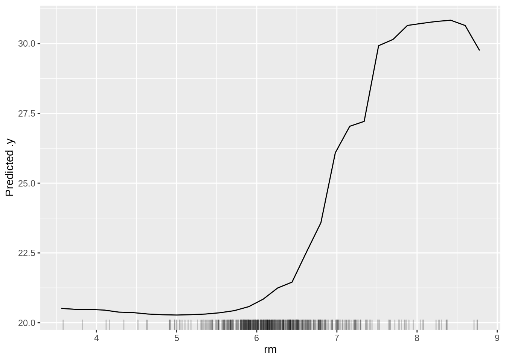
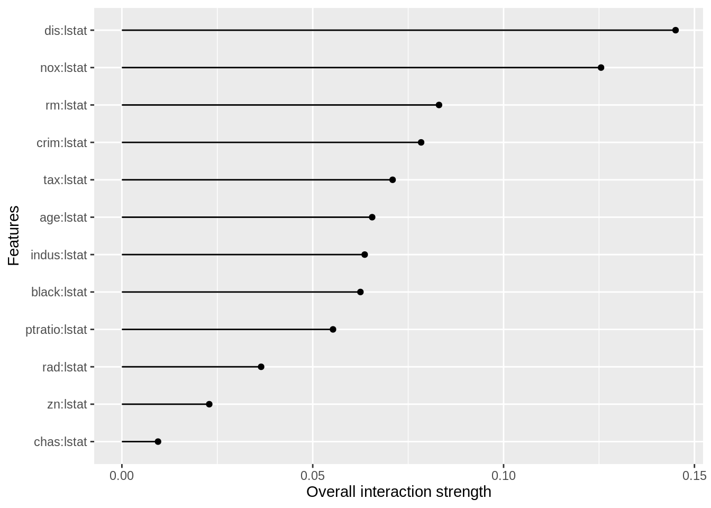
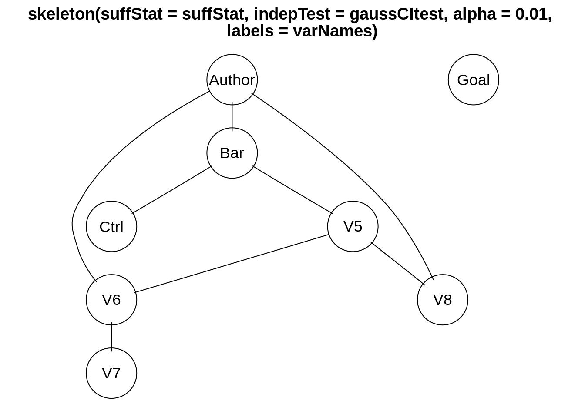
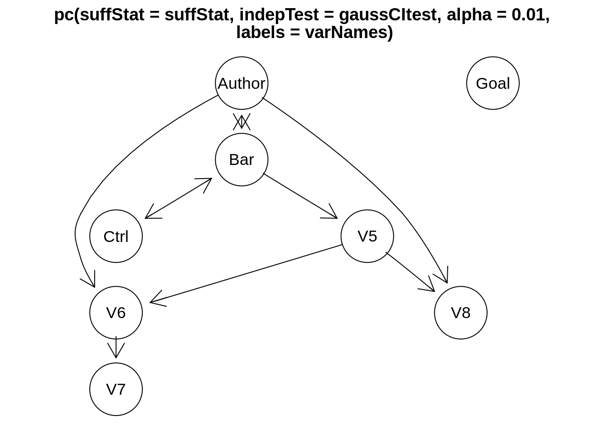

# Interpretation and Causality With Machine Learning {#interpretation}

```{=html}
<!-- Put this here (right after the first markdown headline) and only here for each document! -->
<script src="./scripts/multipleChoice.js"></script>
```


## Explainable AI

The goal of explainable AI (xAI, aka interpretable machine learning) is to explain **why** a fitted machine learning model makes certain predictions. A typical example is to understand how important different variables are for predictions. The incentives for doing so range from a better technical understanding of the models over understanding which data is important for improving predictions to questions of fairness and discrimination (e.g. to understand if an algorithm uses skin color to make a decision).


### A Practical Example

In this lecture we will work with another famous data set, the _Boston housing_ data set:

We will fit a random forest and use the iml package for xAI, see <a href="https://christophm.github.io/interpretable-ml-book/" target="_blank" rel="noopener">https://christophm.github.io/interpretable-ml-book/</a>.


```r
library(iml)
library(randomForest)
#> randomForest 4.7-1.1
#> Type rfNews() to see new features/changes/bug fixes.
set.seed(123)

data("Boston", package = "MASS")
rf = randomForest(medv ~ ., data = Boston, ntree = 50)
```

xAI packages are written generic, i.e. they can handle almost all machine learning models.
When we want to use them, we first have to create a predictor object, that holds the model and the data. The iml package uses R6 classes, that means new objects can be created by calling Predictor$new(). (Do not worry if you do not know what R6 classes are, just use the command.)


```r
X = Boston[which(names(Boston) != "medv")]
predictor = Predictor$new(rf, data = X, y = Boston$medv)
# "Predictor" is an object generator.
```


### Feature Importance

Feature importance should not be mistaken with the random forest variable importance though they are related. It tells us how important the individual variables are for predictions, can be calculated for all machine learning models and is based on a permutation approach (have a look at the book):


```r
imp = FeatureImp$new(predictor, loss = "mae")
plot(imp)
```


### Partial Dependencies

Partial dependencies are similar to allEffects plots for normal regressions. The idea is to visualize "marginal effects" of predictors (with the "feature" argument we specify the variable we want to visualize):


```r
eff = FeatureEffect$new(predictor, feature = "rm", method = "pdp",
                        grid.size = 30)
plot(eff)
```



Partial dependencies can also be plotted for single observations:


```r
eff = FeatureEffect$new(predictor, feature = "rm", method = "pdp+ice",
                        grid.size = 30)
plot(eff)
```


One disadvantage of partial dependencies is that they are sensitive to correlated predictors. Accumulated local effects can be used for accounting for correlation of predictors.


### Accumulated Local Effects

Accumulated local effects (ALE) are basically partial dependencies plots but try to correct for correlations between predictors.


```r
ale = FeatureEffect$new(predictor, feature = "rm", method = "ale")
ale$plot()
```


If there is no collinearity, you shouldn't see much difference between partial dependencies and ALE plots.


### Friedman's H-statistic

The H-statistic can be used to find interactions between predictors. However, again, keep in mind that the H-statistic is sensible to correlation between predictors:


```r
interact = Interaction$new(predictor, "lstat")
plot(interact)
```




### Global Explainer - Simplifying the Machine Learning Model

Another idea is simplifying the machine learning model with another simpler model such as a decision tree. We create predictions with the machine learning model for a lot of different input values and then we fit a decision tree on these predictions. We can then interpret the easier model.


```r
library(partykit)

tree = TreeSurrogate$new(predictor, maxdepth = 2)
plot(tree$tree)
```


### Local Explainer - LIME Explaining Single Instances (observations)

The global approach is to simplify the entire machine learning-black-box model via a simpler model, which is then interpretable.

However, sometimes we are only interested in understanding how single predictions are generated. The LIME (Local interpretable model-agnostic explanations) approach explores the feature space around one observation and based on this locally fits a simpler model (e.g. a linear model):


```r
lime.explain = LocalModel$new(predictor, x.interest = X[1,])
lime.explain$results
#>               beta x.recoded    effect x.original feature feature.value
#> rm       4.1893817     6.575 27.545185      6.575      rm      rm=6.575
#> ptratio -0.5307031    15.300 -8.119758       15.3 ptratio  ptratio=15.3
#> lstat   -0.4398104     4.980 -2.190256       4.98   lstat    lstat=4.98
plot(lime.explain)
```


### Local Explainer - Shapley

The Shapley method computes the so called Shapley value, feature contributions for single predictions, and is based on an approach from cooperative game theory. The idea is that each feature value of the instance is a "player" in a game, where the prediction is the reward. The Shapley value tells us how to fairly distribute the reward among the features.


```r
shapley = Shapley$new(predictor, x.interest = X[1,])
shapley$plot()
```


## Causal Inference and Machine Learning

xAI aims at explaining how predictions are being made. In general, xAI != causality. xAI methods measure which variables are used for predictions by the algorithm, or how far variables improve predictions. The important point to note here: If a variable causes something, we could also expect that it helps predicting the very thing. The opposite, however, is not generally true - very often it is possible that a variable that doesn't cause anything can predict something.

In statistics courses (in particular our course: Advanced Biostatistics), we discuss the issue of causality at full length. Here, we don't want to go into the details, but again, you should in general resist to interpret indicators of importance in xAI as causal effects. They tell you something about what's going on in the algorithm, not about what's going on in reality.


### Causal Inference on Static Data {#causalInference}

Methods for causal inference depend on whether we have dynamic or static data. The latter is the more common case. With static data, the problem is confounding. If you have several correlated predictors, you can get spurious correlations between a given predictor and the response, although there is no causal effect in general.

Multiple regression and few other methods are able to correct for other predictors and thus isolate the causal effect. The same is not necessarily true for machine learning algorithms and xAI methods. This is not a bug, but a feature - for making good predictions, it is often no problem, but rather an advantage to also use non-causal predictors.

Here an example for the indicators of variable importance in the random forest algorithm. The purpose of this script is to show that random forest variable importance will split importance values for collinear variables evenly, even if collinearity is low enough so that variables are separable and would be correctly separated by an lm / ANOVA.

We first simulate a data set with 2 predictors that are strongly correlated, but only one of them has an effect on the response.


```r
set.seed(123)

# Simulation parameters.
n = 1000
col = 0.7

# Create collinear predictors.
x1 = runif(n)
x2 = col * x1 + (1-col) * runif(n)

# Response is only influenced by x1.
y = x1 + rnorm(n)
```

lm / anova correctly identify $x1$ as causal variable.


```r
summary(lm(y ~ x1 + x2))
#> 
#> Call:
#> lm(formula = y ~ x1 + x2)
#> 
#> Residuals:
#>     Min      1Q  Median      3Q     Max 
#> -3.0709 -0.6939  0.0102  0.6976  3.3373 
#> 
#> Coefficients:
#>             Estimate Std. Error t value Pr(>|t|)    
#> (Intercept)  0.02837    0.08705   0.326 0.744536    
#> x1           1.07383    0.27819   3.860 0.000121 ***
#> x2          -0.04547    0.37370  -0.122 0.903186    
#> ---
#> Signif. codes:  0 '***' 0.001 '**' 0.01 '*' 0.05 '.' 0.1 ' ' 1
#> 
#> Residual standard error: 1.011 on 997 degrees of freedom
#> Multiple R-squared:  0.08104,	Adjusted R-squared:  0.0792 
#> F-statistic: 43.96 on 2 and 997 DF,  p-value: < 2.2e-16
```

Fit random forest and show variable importance:


```r
set.seed(123)

fit = randomForest(y ~ x1 + x2, importance = TRUE)
varImpPlot(fit)
```


Variable importance is now split nearly evenly.

Task: understand why this is - remember:

* How the random forest works - variables are randomly hidden from the regression tree when the trees for the forest are built.
* Remember that as $x1 \propto x2$, we can use $x2$ as a replacement for $x1$.
* Remember that the variable importance measures the average contributions of the different variables in the trees of the forest.


### Structural Equation Models

If causal relationships get more complicated, it will not be possible to adjust correctly with a simple lm. In this case, in statistics, we will usually use structural equation models (SEMs). Structural equation models are designed to estimate entire causal diagrams. There are two main SEM packages in R: For anything that is non-normal, you will currently have to estimate the directed acyclic graph (that depicts causal relations) piece-wise with CRAN package piecewiseSEM. Example for a vegetation data set:


```r
library(piecewiseSEM)

mod = psem(
 lm(rich ~ distance + elev + abiotic + age + hetero + firesev + cover,
    data = keeley),
 lm(firesev ~ elev + age + cover, data = keeley),
 lm(cover ~ age + elev + hetero + abiotic, data = keeley)
)
summary(mod)
plot(mod)
```

For linear structural equation models, we can estimate the entire directed acyclic graph at once. This also allows having unobserved variables in the directed acyclic graph. One of the most popular packages for this is lavaan.


```r
library(lavaan)

mod = "
 rich ~ distance + elev + abiotic + age + hetero + firesev + cover
 firesev ~ elev + age + cover
 cover ~ age + elev + abiotic
"
fit = sem(mod, data = keeley)
summary(fit)
#> lavaan 0.6-12 ended normally after 1 iterations
#> 
#>   Estimator                                         ML
#>   Optimization method                           NLMINB
#>   Number of model parameters                        16
#> 
#>   Number of observations                            90
#> 
#> Model Test User Model:
#>                                                       
#>   Test statistic                                10.437
#>   Degrees of freedom                                 5
#>   P-value (Chi-square)                           0.064
#> 
#> Parameter Estimates:
#> 
#>   Standard errors                             Standard
#>   Information                                 Expected
#>   Information saturated (h1) model          Structured
#> 
#> Regressions:
#>                    Estimate   Std.Err  z-value  P(>|z|)
#>   rich ~                                               
#>     distance           0.616    0.177    3.485    0.000
#>     elev              -0.009    0.006   -1.644    0.100
#>     abiotic            0.488    0.156    3.134    0.002
#>     age                0.024    0.105    0.229    0.819
#>     hetero            44.414    9.831    4.517    0.000
#>     firesev           -1.018    0.759   -1.341    0.180
#>     cover             12.400    3.841    3.228    0.001
#>   firesev ~                                            
#>     elev              -0.001    0.001   -0.951    0.342
#>     age                0.047    0.013    3.757    0.000
#>     cover             -1.521    0.509   -2.991    0.003
#>   cover ~                                              
#>     age               -0.009    0.002   -3.875    0.000
#>     elev               0.000    0.000    2.520    0.012
#>     abiotic           -0.000    0.004   -0.115    0.909
#> 
#> Variances:
#>                    Estimate   Std.Err  z-value  P(>|z|)
#>    .rich              97.844   14.586    6.708    0.000
#>    .firesev            1.887    0.281    6.708    0.000
#>    .cover              0.081    0.012    6.708    0.000
```

The default plot options are not so nice as before.


```r
library(lavaanPlot)

lavaanPlot(model = fit)
```

```{=html}
<div id="htmlwidget-c178c715e4eb61ca4c30" style="width:100%;height:480px;" class="grViz html-widget"></div>
<script type="application/json" data-for="htmlwidget-c178c715e4eb61ca4c30">{"x":{"diagram":" digraph plot { \n graph [ overlap = true, fontsize = 10 ] \n node [ shape = box ] \n node [shape = box] \n distance; elev; abiotic; age; hetero; firesev; cover; rich \n node [shape = oval] \n  \n \n edge [ color = black ] \n distance->rich elev->rich abiotic->rich age->rich hetero->rich firesev->rich cover->rich elev->firesev age->firesev cover->firesev age->cover elev->cover abiotic->cover  \n}","config":{"engine":"dot","options":null}},"evals":[],"jsHooks":[]}</script>
```

Another plotting option is using semPlot.


```r
library(semPlot)

semPaths(fit)
```


### Automatic Causal Discovery

But how to get the causal graph? In statistics, it is common to "guess" it and afterwards do residual checks, in the same way as we guess the structure of a regression. For more complicated problems, however, this is unsatisfying. Some groups therefore work on so-called causal discovery algorithms, i.e. algorithms that automatically generate causal graphs from data. One of the most classic algorithms of this sort is the _PC algorithm_. Here an example using the pcalg package:


```r
library(pcalg)
```

Loading the data:


```r
data("gmG", package = "pcalg") # Loads data sets gmG and gmG8.
suffStat = list(C = cor(gmG8$x), n = nrow(gmG8$x))
varNames = gmG8$g@nodes
```

First, the skeleton algorithm creates a basic graph without connections (a skeleton of the graph).


```r
skel.gmG8 = skeleton(suffStat, indepTest = gaussCItest,
labels = varNames, alpha = 0.01)
Rgraphviz::plot(skel.gmG8)
#> Warning in !is.null(main) && nchar(main) > 0: 'length(x) = 2 > 1' in coercion to
#> 'logical(1)'
```



What is missing here is the direction of the errors. The PC algorithm now makes tests for conditional independence, which allows fixing a part (but typically not all) of the directions of the causal arrows.


```r
pc.gmG8 = pc(suffStat, indepTest = gaussCItest,
labels = varNames, alpha = 0.01)
Rgraphviz::plot(pc.gmG8 )
#> Warning in !is.null(main) && nchar(main) > 0: 'length(x) = 2 > 1' in coercion to
#> 'logical(1)'
```




### Causal Inference on Dynamic Data

When working with dynamic data, we can use an additional piece of information - the cause usually precedes the effect, which means that we can test for a time-lag between cause and effect to determine the direction of causality. This way of testing for causality is known as _Granger causality_, or Granger methods. Here an example:


```r
library(lmtest)

## What came first: the chicken or the egg?
data(ChickEgg)
grangertest(egg ~ chicken, order = 3, data = ChickEgg)
#> Granger causality test
#> 
#> Model 1: egg ~ Lags(egg, 1:3) + Lags(chicken, 1:3)
#> Model 2: egg ~ Lags(egg, 1:3)
#>   Res.Df Df      F Pr(>F)
#> 1     44                 
#> 2     47 -3 0.5916 0.6238
grangertest(chicken ~ egg, order = 3, data = ChickEgg)
#> Granger causality test
#> 
#> Model 1: chicken ~ Lags(chicken, 1:3) + Lags(egg, 1:3)
#> Model 2: chicken ~ Lags(chicken, 1:3)
#>   Res.Df Df     F   Pr(>F)   
#> 1     44                     
#> 2     47 -3 5.405 0.002966 **
#> ---
#> Signif. codes:  0 '***' 0.001 '**' 0.01 '*' 0.05 '.' 0.1 ' ' 1
```


### Outlook for Machine Learning

As we have seen, there are already a few methods / algorithms for discovering causality from large data sets, but the systematic transfer of these concepts to machine learning, in particular deep learning, is still at its infancy. At the moment, this field is actively researched and changes extremely fast, so we recommend using Google to see what is currently going on. Particular in business and industry, there is a large interest in learning about causal effect from large data sets. In our opinion, a great topic for young scientists to specialize on.

### Exercises

```{=html}
  <hr/>
  <strong><span style="color: #0011AA; font-size:18px;">1. Task</span></strong><br/>
```

Use one of the non-image based data sets (preferably Wine, which is also described in the data sets section \@ref(datasets) but wasn't used yet, but you can also use Nasa or Titanic) and fit a random forest. Explore / interpret the fitted model using iml (see also the book: <a href="https://christophm.github.io/interpretable-ml-book/" target="_blank" rel="noopener">https://christophm.github.io/interpretable-ml-book/</a>).

```{=html}
  <details>
    <summary>
      <strong><span style="color: #0011AA; font-size:18px;">Solution</span></strong>
    </summary>
    <p>
```


```r
library(randomForest)
library("iml")
set.seed(1234)

data = as.data.frame(EcoData::wine)
submission = data[which(is.na(data$quality)), -which(colnames(data) == "quality")]
data = data[complete.cases(data), ] # Removes sumbmission data as well.

# Remark: Features don't need to be scaled for regression trees.

rf = randomForest(quality ~ ., data = data)
pred = round(predict(rf, data))
table(pred, data$quality)
#>     
#> pred   3   4   5   6   7   8
#>    4   2   4   0   0   0   0
#>    5   0   6 133   0   0   0
#>    6   0   0   3 113  10   0
#>    7   0   0   0   0  25   3
(accuracy = mean(pred == data$quality)) # Fits pretty well (on the training data...)
#> [1] 0.9197324

# For submission:
#write.csv(round(predict(rf, submission)), file = "wine_RF.csv")

# Standard depiction of importance:
rf$importance
#>                      IncNodePurity
#> fixed.acidity            12.279077
#> volatile.acidity         21.997368
#> citric.acid              13.751476
#> residual.sugar           10.787817
#> chlorides                11.587301
#> free.sulfur.dioxide       9.966824
#> total.sulfur.dioxide     13.977669
#> density                  17.068801
#> pH                       10.302109
#> sulphates                20.273156
#> alcohol                  37.316264

# IML:
predictor = Predictor$new(
    rf, data = data[,which(names(data) != "quality")], y = data$quality)

# Mind: This is stochastical!
importance = FeatureImp$new(predictor, loss = "mae")

plot(importance)
```


```r

# Comparison between standard importance and IML importance:
importanceRf = rownames(rf$importance)[order(rf$importance, decreasing = TRUE)]
importanceIML = importance$results[1]
comparison = cbind(importanceIML, importanceRf)
colnames(comparison) = c("IML", "RF")
as.matrix(comparison)
#>       IML                    RF                    
#>  [1,] "alcohol"              "alcohol"             
#>  [2,] "sulphates"            "volatile.acidity"    
#>  [3,] "volatile.acidity"     "sulphates"           
#>  [4,] "density"              "density"             
#>  [5,] "citric.acid"          "total.sulfur.dioxide"
#>  [6,] "total.sulfur.dioxide" "citric.acid"         
#>  [7,] "fixed.acidity"        "fixed.acidity"       
#>  [8,] "chlorides"            "chlorides"           
#>  [9,] "pH"                   "residual.sugar"      
#> [10,] "free.sulfur.dioxide"  "pH"                  
#> [11,] "residual.sugar"       "free.sulfur.dioxide"
```

Mind that feature importance, and the random forest's variable importance are related but not equal!
Variable importance is a measure for determining importance while creating the forest (i.e. for fitting). Feature importance is a measure for how important a variable is for prediction.

Maybe you want to see other explanation methods as well. Surely you can use the other techniques of this section on your own.

```{=html}
    </p>
  </details>
  <br/><hr/>
```

```{=html}
  <hr/>
  <strong><span style="color: #0011AA; font-size:18px;">2. Task</span></strong><br/>
```

As we show in section \@ref(causalInference) of this chapter, a random forest will split variable importance across collinear predictors, while a linear regression model (lm()) can identify which predictor is causally affecting the response (at least in theory, if all confounders are controlled). What about a boosted regression tree or an artificial neural network? Take the random forest example and add a boosted regression tree (easier, you can use for example https://rdrr.io/cran/xgboost/man/xgb.importance.html) or an artificial neural network, and have a look if those are better than the random forest at identifying causal predictors. 

```{=html}
  <details>
    <summary>
      <strong><span style="color: #0011AA; font-size:18px;">Solution</span></strong>
    </summary>
    <p>
```


```r
library(xgboost)
set.seed(1234)

data = as.data.frame(EcoData::wine)
submission = data[which(is.na(data$quality)), -which(colnames(data) == "quality")]
data = data[complete.cases(data), ] # Removes sumbmission data as well.

data_xg = xgb.DMatrix(
  data = as.matrix(data[,which(names(data) != "quality")]),
  label = data$quality
)
brt = xgboost(data_xg, nrounds = 24)
#> [1]	train-rmse:3.656523 
#> [2]	train-rmse:2.609494 
#> [3]	train-rmse:1.884807 
#> [4]	train-rmse:1.384918 
#> [5]	train-rmse:1.037362 
#> [6]	train-rmse:0.800110 
#> [7]	train-rmse:0.629324 
#> [8]	train-rmse:0.508917 
#> [9]	train-rmse:0.426155 
#> [10]	train-rmse:0.369580 
#> [11]	train-rmse:0.313017 
#> [12]	train-rmse:0.274227 
#> [13]	train-rmse:0.236959 
#> [14]	train-rmse:0.207364 
#> [15]	train-rmse:0.195811 
#> [16]	train-rmse:0.182500 
#> [17]	train-rmse:0.173310 
#> [18]	train-rmse:0.154747 
#> [19]	train-rmse:0.144045 
#> [20]	train-rmse:0.139083 
#> [21]	train-rmse:0.129605 
#> [22]	train-rmse:0.118541 
#> [23]	train-rmse:0.110689 
#> [24]	train-rmse:0.097798

pred = round(predict(brt, newdata = data_xg)) # Only integers are allowed.
table(pred, data$quality)
#>     
#> pred   3   4   5   6   7   8
#>    3   2   0   0   0   0   0
#>    4   0  10   0   0   0   0
#>    5   0   0 136   0   0   0
#>    6   0   0   0 113   1   0
#>    7   0   0   0   0  34   0
#>    8   0   0   0   0   0   3
(accuracy = mean(pred == data$quality)) # Fits very well (on the training data...)
#> [1] 0.9966555

# For submission:
#write.csv(round(predict(rf, submission)), file = "wine_RF.csv")

# Look at variable importance:
xgboost::xgb.importance(model = brt)
#>                  Feature       Gain      Cover  Frequency
#>  1:              alcohol 0.28363726 0.13667721 0.07073509
#>  2:            sulphates 0.11331763 0.07015405 0.06657420
#>  3:        fixed.acidity 0.09844523 0.11359510 0.19278779
#>  4:     volatile.acidity 0.09582794 0.07098397 0.12760055
#>  5: total.sulfur.dioxide 0.09207986 0.09147259 0.07212205
#>  6:              density 0.07374576 0.14910006 0.08321775
#>  7:            chlorides 0.06025521 0.07972405 0.08876560
#>  8:       residual.sugar 0.05307944 0.07202137 0.08044383
#>  9:  free.sulfur.dioxide 0.04602742 0.04743503 0.06518724
#> 10:                   pH 0.04477577 0.12562892 0.07489598
#> 11:          citric.acid 0.03880847 0.04320764 0.07766990
```

Every method yields slightly different results, but the main ingredient is alcohol (and sulphates).

```{=html}
    </p>
  </details>
  <br/>
```

```{=html}
  <hr/>
  <strong><span style="color: #0011AA; font-size:18px;">3. Task</span></strong><br/>
```

If you're done with the previous tasks and have still time and appetite, improve the submissions for our competition, in particular for the Wine data set. Possible ideas:

* Use MLR framework (section \@ref(mlr)).

* Try Transfer learning (section \@ref(transfer)). This was the winner of last years challenge.

* Search on kaggle for more ideas / try to copy the ideas. This was the winner two years ago.

A little example for the (unbalanced!) Wine data set

```{=html}
  <details>
    <summary>
      <strong><span style="color: #0011AA; font-size:18px;">Solution</span></strong>
    </summary>
    <p>
```


```r
library(tensorflow)
library(keras)
set_random_seed(123L, disable_gpu = FALSE)	# Already sets R's random seed.

readin = function(percentageTest = 0.2, aggregate = 0){
    # Parameter "aggregate" packs the classes with very low abundances into one.
    # If "aggregate" equals to NA, NaN, Null, 0 or FALSE, no aggregation is performed.
    # Else, the given number is the boundary.
    # Every class with less elements than the boundary is aggregated into one.
    
    # WARNING: These classes cannot be distinguished from then on!
    # Using the predictions for submission needs further processing!
    
    # Just for random selection of features, independent of the amount of function calls.
    set.seed(12345)
    
    train = as.data.frame(EcoData::wine)
    indicesTrain = which(!is.na(train$quality))
    labelsTrain = train$quality[indicesTrain]
    labelsTrain = labelsTrain - min(labelsTrain)  # Start at 0 (for softmax).
    train = train[, -which(colnames(train) == "quality")]
    
    if(!is.na(aggregate) & aggregate){
        indices = names(table(labelsTrain)[
            table(labelsTrain) < aggregate & table(labelsTrain) > 0
        ])
        if(length(indices)){
            labelsTrain[labelsTrain %in% indices] = -1
            labelsTrain = as.factor(labelsTrain)
            levels(labelsTrain) = 1:length(levels(labelsTrain)) - 1
            labelsTrain = as.integer(labelsTrain)
        }
    }
    
    # Impute missing values (before any splitting, to get the highest power):
    train = missRanger::missRanger(
        data = train,
        maxiter = 10L,
        seed = 123,
        num.trees = 200L
    )
    
    # Separate submission data (mind scaling!):
    submission = scale(train[-indicesTrain,])
    train = scale(train[indicesTrain,])
    
    # Very asymmetric training data:
    cat(paste0("Size of training set: ", length(labelsTrain), "\n"))
    print(table(labelsTrain))
    
    if(percentageTest == 0){
      return(list(
        "labelsTrain" = labelsTrain,
        "labelsTest" = list(),
        "train" = train,
        "test" = list(),
        "submission" = submission
      ))
    }
    
    # Split into training and test set:
    len = nrow(train)
    indicesTest = sample(x = 1:len, size = percentageTest * len, replace = FALSE)
    test = as.data.frame(train[indicesTest,])
    labelsTest = labelsTrain[indicesTest]
    train = as.data.frame(train[-indicesTest,])
    labelsTrain = labelsTrain[-indicesTest]
    
    return(list(
        "labelsTrain" = labelsTrain,
        "labelsTest" = labelsTest,
        "train" = train,
        "test" = test,
        "submission" = submission
    ))
}

retVal = readin(aggregate = 0)
#> 
#> Missing value imputation by random forests
#> 
#>   Variables to impute:		fixed.acidity, volatile.acidity, citric.acid, residual.sugar, chlorides, free.sulfur.dioxide, total.sulfur.dioxide, density, pH, sulphates
#>   Variables used to impute:	fixed.acidity, volatile.acidity, citric.acid, residual.sugar, chlorides, free.sulfur.dioxide, total.sulfur.dioxide, density, pH, sulphates, alcohol
#> iter 1:	..........
#> iter 2:	..........
#> iter 3:	..........
#> Size of training set: 694
#> labelsTrain
#>   0   1   2   3   4   5 
#>   7  25 309 261  84   8
labelsTrain = retVal[["labelsTrain"]]
labelsTest = retVal[["labelsTest"]]
train = retVal[["train"]]
test = retVal[["test"]]
submission = retVal[["submission"]]
rm(retVal)

classNumber = length(table(labelsTrain))

model = keras_model_sequential()
model %>%
    layer_dense(units = 200L, activation = "leaky_relu",
    kernel_regularizer = regularizer_l2(0.00035),
    input_shape = ncol(train)) %>%
    layer_dropout(0.45) %>%
    layer_dense(units = 100L, activation = "relu",
    bias_regularizer = regularizer_l1_l2(0.5)) %>%
    layer_dropout(0.2) %>%
    layer_dense(units = 100L, activation = "leaky_relu",
    kernel_regularizer = regularizer_l2(0.00035),
    bias_regularizer = regularizer_l1_l2(0.1)) %>%
    layer_dropout(0.25) %>%
    layer_dense(units = 50L, activation = "gelu") %>%
    layer_dense(units = 25L, activation = "elu") %>%
    layer_dropout(0.35) %>%
    # We need probabilities. So we use the softmax function.
    # Remember, the labels MUST start at 0!
    layer_dense(units = classNumber, activation = "softmax")

model %>%
    keras::compile(loss = loss_binary_crossentropy,
                   optimizer = optimizer_adamax(learning_rate = 0.015))

model_history = 
    model %>% # Mind the matrix property (no data.frame)!
        fit(x = as.matrix(train), y = k_one_hot(labelsTrain, classNumber),
            epochs = 80L, batch = 12L, shuffle = TRUE)

plot(model_history)
```


```r

# Accuracy on training set (!)
pred = predict(model, as.matrix(train)) %>% apply(1, which.max) - 1
Metrics::accuracy(pred, labelsTrain)
#> [1] 0.7733813
table(pred, labelsTrain)
#>     labelsTrain
#> pred   0   1   2   3   4   5
#>    0   1   0   0   0   0   0
#>    1   0   1   0   0   0   0
#>    2   6  14 212  33   2   0
#>    3   0   8  25 179  25   3
#>    4   0   0   1   5  37   4

# Accuracy on test set
pred = predict(model, as.matrix(test)) %>% apply(1, which.max) - 1
Metrics::accuracy(pred, labelsTest)
#> [1] 0.6594203
table(pred, labelsTest)
#>     labelsTest
#> pred  1  2  3  4  5
#>    1  0  1  0  0  0
#>    2  2 53 13  2  0
#>    3  0 16 31 11  0
#>    4  0  1  0  7  1
```

Recognize overfitting of your model selection strategy by changing the seed few times (while keeping the model constant) and increase the percentage of test data.
Furthermore, consider fitting a random forest for good quality as well.

For the final predictions, we use the whole data set without holdouts:


```r
library(tensorflow)
library(keras)
set_random_seed(321L, disable_gpu = FALSE)	# Already sets R's random seed.

retVal = readin(percentageTest = 0, aggregate = 0)
#> 
#> Missing value imputation by random forests
#> 
#>   Variables to impute:		fixed.acidity, volatile.acidity, citric.acid, residual.sugar, chlorides, free.sulfur.dioxide, total.sulfur.dioxide, density, pH, sulphates
#>   Variables used to impute:	fixed.acidity, volatile.acidity, citric.acid, residual.sugar, chlorides, free.sulfur.dioxide, total.sulfur.dioxide, density, pH, sulphates, alcohol
#> iter 1:	..........
#> iter 2:	..........
#> iter 3:	..........
#> Size of training set: 694
#> labelsTrain
#>   0   1   2   3   4   5 
#>   7  25 309 261  84   8
labelsTrain = retVal[["labelsTrain"]]
labelsTest = retVal[["labelsTest"]]
train = retVal[["train"]]
test = retVal[["test"]]
submission = retVal[["submission"]]
rm(retVal)

classNumber = length(table(labelsTrain))

model = keras_model_sequential()
model %>%
    layer_dense(units = 200L, activation = "leaky_relu",
    kernel_regularizer = regularizer_l2(0.00035),
    input_shape = ncol(train)) %>%
    layer_dropout(0.45) %>%
    layer_dense(units = 100L, activation = "relu",
    bias_regularizer = regularizer_l1_l2(0.5)) %>%
    layer_dropout(0.2) %>%
    layer_dense(units = 100L, activation = "leaky_relu",
    kernel_regularizer = regularizer_l2(0.00035),
    bias_regularizer = regularizer_l1_l2(0.1)) %>%
    layer_dropout(0.25) %>%
    layer_dense(units = 50L, activation = "gelu") %>%
    layer_dense(units = 25L, activation = "elu") %>%
    layer_dropout(0.35) %>%
    # We need probabilities. So we use the softmax function.
    # Remember, the labels MUST start at 0!
    layer_dense(units = classNumber, activation = "softmax")

model %>%
    keras::compile(loss = loss_binary_crossentropy,
                   optimizer = optimizer_adamax(learning_rate = 0.015))

model_history = 
    model %>% # Mind the matrix property (no data.frame)!
        fit(x = as.matrix(train), y = k_one_hot(labelsTrain, classNumber),
            epochs = 80L, batch = 12L, shuffle = TRUE)

plot(model_history)
```


```r

# Accuracy on training set (!)
pred = predict(model, as.matrix(train)) %>% apply(1, which.max) - 1
Metrics::accuracy(pred, labelsTrain)
#> [1] 0.7881844
table(pred, labelsTrain)
#>     labelsTrain
#> pred   0   1   2   3   4   5
#>    1   3   7   1   0   0   0
#>    2   4  15 266  31   4   0
#>    3   0   3  36 209  15   2
#>    4   0   0   6  21  65   6

# Reverse subtraction (for start at 0) and create submission file.
write.csv(pred + min(as.data.frame(EcoData::wine)$quality, na.rm = TRUE),
          file = "wine_NN.csv")
```

```{=html}
    </p>
  </details>
  <br/>
```

