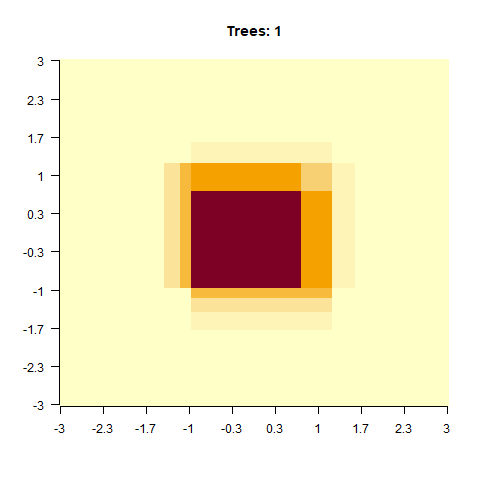

```{r setup, include=FALSE}
knitr::opts_chunk$set(echo = TRUE, cache = TRUE)
set.seed(42)
```


## LM and regularization
### LM

$$ y_i \sim b_0 + X_i * b_1 + \epsilon _i,   e_i \sim N(0, \sigma) $$
```{r, eval=FALSE}
data = EcoData::boston
lm = lm(medv~., data = data)
summary(lm)
```

```{r, eval=FALSE}
library(keras)
library(tensorflow)
try(tf$enable_eager_execution())

model = keras_model_sequential()
model %>% 
  layer_dense(units = 1L, activation = "linear", input_shape = 13L)
model %>% 
  compile(loss = loss_mean_squared_error, optimizer = optimizer_adam(lr = 0.01))
model_history = 
  model %>% 
    fit(x = as.matrix(data[,-which(colnames(data) == "medv", arr.ind = TRUE)]),
        y = matrix(data[,which(colnames(data) == "medv", arr.ind = TRUE)], ncol = 1L), 
        verbose = 0L,
        epochs = 400L)

cbind(coef(lm),c(model$weights[[2]]$numpy(), model$weights[[1]]$numpy()))

```


### GLM

Poisson: $$ log(y_i) \sim b_0 + X_i * b_1 $$
Binomial: $$ logit(y_i) \sim b_0 + X_i * b_1 $$

```{r, eval=FALSE}
X = scale(as.matrix(data[,-which(colnames(data) == "ABUND", arr.ind = TRUE)]))
data = EcoData::birdabundance
glm = glm(data$ABUND~X)
summary(glm)
```

```{r, eval=FALSE}

model = keras_model_sequential()
model %>% 
  layer_dense(units = 1L, activation = "linear", input_shape = 6L) %>% 
  layer_lambda(function(t) tf$exp(t))

model %>% 
  compile(loss = loss_poisson, optimizer = optimizer_adam(lr = 0.004))

model_history = 
  model %>% 
    fit(x = X,
        y = matrix( as.integer(data$ABUND), ncol = 1L), 
        verbose = 0L,
        epochs = 400L)

cbind(coef(glm),c(model$get_weights()[[2]], model$get_weights()[[1]]))

```


### Regularization
L1 = Lasso (Least Absolute Shrinkage and Selection Operator)
$$\lambda * \sum_{i = 1}^{p} |W_i| $$
```{r}
plot(density(LaplacesDemon::rlaplace(1e5)), main = "l1")
```


L2 = Ridge 
$$\lambda * \sum_{i = 1}^{p} W_i^2 $$
```{r}
plot(density(rnorm(rnorm(1e5,0,1))), main = "l2")
```


### Exercise 1:
```{r, eval=FALSE}
library(EcoData)
data = EcoData::boston
```
```{r, eval=FALSE}
library(tensorflow)
tf$enable_eager_execution()
```


```{r, eval=FALSE}
W = tf$Variable(
  tf$constant(
    matrix(rnorm(13,0.0, sd = 0.5), nrow = 13L, ncol = 1L),
    dtype = "float32"
    )
  )

X = tf$constant(
  as.matrix(scale(data[,-which(colnames(data) == "medv", arr.ind = TRUE)])),
  dtype = "float32"
  )
Y = tf$constant(
  matrix(scale(data[,which(colnames(data) == "medv", arr.ind = TRUE)]), ncol = 1L),
  dtype = "float32"
)

optimizer = tf$keras$optimizers$Adamax(learning_rate = 0.05)

loss = tf$losses$mean_squared_error(Y, tf$matmul(X, W))

for(i in 1:200){
  with(tf$GradientTape() %as% tape, {
    loss = tf$losses$mean_squared_error(Y, tf$matmul(X, W))
  })
  
  if(i %% 20 == 0) cat("Loss: ", loss$numpy(), "\n")
  
  gradients = tape$gradient(loss, W)
  optimizer$apply_gradients(list(c(gradients, W)))
}
cbind(W$numpy(), coef(summary(lm(Y$numpy()~X$numpy())))[-1,1])
```

Implement l1 and l2 regularization on the weights:
(Hint: use tf$reduce_sum/mean to reduce tensors)
```{r, eval=FALSE}
W = tf$Variable(
  tf$constant(
    matrix(rnorm(13,0.0, sd = 0.5), nrow = 13L, ncol = 1L),
    dtype = "float32"
    )
  )

X = tf$constant(
  as.matrix(scale(data[,-which(colnames(data) == "medv", arr.ind = TRUE)])),
  dtype = "float32"
  )
Y = tf$constant(
  matrix(scale(data[,which(colnames(data) == "medv", arr.ind = TRUE)]), ncol = 1L),
  dtype = "float32"
)

optimizer = tf$keras$optimizers$Adamax(learning_rate = 0.05)

loss = tf$losses$mean_squared_error(Y, tf$matmul(X, W))

for(i in 1:200){
  with(tf$GradientTape() %as% tape, {
    loss = tf$losses$mean_squared_error(Y, tf$matmul(X, W)) # Add L1 / L2
  })
  
  if(i %% 20 == 0) cat("Loss: ", loss$numpy(), "\n")
  
  gradients = tape$gradient(loss, W)
  optimizer$apply_gradients(list(c(gradients, W)))
}
cbind(W$numpy(), coef(summary(lm(Y$numpy()~X$numpy())))[-1,1])
```

## Tree based methods

<!-- Before we continue, we will introduce an additional TensorFlow API. Besides Keras, which is a high level neural network API, there is the [Estimator](https://www.tensorflow.org/guide/estimators) API. The Estimator API is a more general Machine Learning API which supports not only neural networks but also other community driven algorithms such as trees. Keras models can also transformed into Estimators. -->
<!-- In this chapter we will introduce Trees which are included in the Estimator API.  -->

### CART

<!--  https://www.tensorflow.org/guide/premade_estimators -->

#### Regression
<!-- The Estimator API is useful because we can handle discrete features easier than with the Core API or keras (where we have to introduce dummy variables for our discrete features by ourselves) -->

```{r, eval=FALSE}
library(tree)
data = datasets::airquality
plot(data)

rt = tree(sqrt(Ozone)~., data = data,)
plot(rt)
text(rt)

pred = predict(rt, data)
plot(data$Temp, sqrt(data$Ozone))
lines(data$Temp[order(data$Temp)], pred[order(data$Temp)], col = "red")


```

#### Exercise 2:
Play around with the rpart.control parameters. What happens when we change the minbucket or prune the tree?
```{r, eval=FALSE}
library(rpart)
data = datasets::airquality
plot(data)

rt = tree(sqrt(Ozone)~., data = data,control = tree.control())
plot(rt)
text(rt)

pred = predict(rt, data)
plot(data$Temp, sqrt(data$Ozone))
lines(data$Temp[order(data$Temp)], pred[order(data$Temp)], col = "red")
```

#### Exercise 3:
```{r, eval=FALSE}
library(rpart)
library(tidyverse)
data = EcoData::titanic
data = data %>% 
  select(-name, -home.dest, -cabin, -ticket)
set.seed(42)
indices = sample.int(nrow(data), 0.5*nrow(data))

ct = tree(factor(survived)~., data = data[indices,])

pred = predict(ct, data[-indices,])


```


### Random Forest (RF)

```{r, eval=FALSE}
library(randomForest)

data = EcoData::titanic
data = data %>% 
  select(-name, -home.dest, -cabin, -ticket, -body) %>% 
  mutate(survived = factor(survived)) %>% 
  replace_na(list(age = mean(data$age, na.rm = TRUE), fare = mean(data$fare, na.rm = TRUE)))
  
  
set.seed(42)
indices = sample.int(nrow(data), 0.5*nrow(data))

rf = ranger(survived~., data = data[indices,])
pred = predict(rf, data[-indices,])

sum(apply(cbind(data[-indices,]$survived, pred$predictions), 1,function(pp) pp[1] == pp[2]))/nrow(data[-indices,])

```


### Boosted Regression Trees (BRT)
<!-- Nice blog: https://medium.com/tensorflow/how-to-train-boosted-trees-models-in-tensorflow-ca8466a53127 -->

#### Boosting?
Concept of boosting: Fit a bunch of weak learner that adjust the prior learner's errors.
Meta-Code:
1. Fit tree
  2. Calculate residuals
  3. Fit Tree on the residuals from Step Two
4. Repeat steps 2 - 3 until satisfied

Here we "boost" on/with our residuals, that is called gradient boosting.

We will implement our own Boosted Regression Tree now:
```{r, eval=FALSE}
library(tree)
x = runif(1000,-5,5)
y = x*sin(x)*2 + rnorm(1000,0, cos(x)+1.8)
data = data.frame(x = x, y = y)
plot(y~x)

## Gradient Boosting:

get_model = function(x,y){
  control = tree.control(nobs = length(x), mincut = 20L)
  model = tree(y~x, data.frame(x = x,y = y), control = control)
  pred = predict(model, data.frame(x = x,y = y))
  return(list(model = model, pred = pred))
}

depth = 1L
pred = NULL
model_list = list()

get_boosting_model = function(depth){
  m_list = list()
  
  for(i in 1:depth){
    if(i == 1) {
      m = get_model(x,y)
      pred = m$pred
    } else {
      y_res = y-pred
      m = get_model(x, y_res)
      pred = pred + m$pred
    }
    m_list[[i]] = m$model
  }
  model_list <<- m_list
  
  return(pred)
}

pred = get_boosting_model(10L)[order(data$x)]
length(model_list)
plot(model_list[[1]])


plot(y~x)
lines(x = data$x[order(data$x)],get_boosting_model(1L)[order(data$x)], col = 'red', lwd = 2)
lines(x = data$x[order(data$x)],get_boosting_model(100L)[order(data$x)], col = 'green', lwd = 2)

```


```{r}
library(xgboost)
library(animation)

x1 = seq(-3, 3, length.out = 100)
x2 = seq(-3, 3, length.out = 100)
X = expand.grid(x1, x2)
y = apply(X, 1, function(x) exp(-x[1]^2 - x[2]^2))
#y = apply(X, 1, function(x) x[1] * exp(-x[1]^2 - x[2]^2))


model = xgboost::xgboost(xgb.DMatrix(data = as.matrix(X), label = y), nrounds = 500L,verbose = 0L)
pred = predict(model, newdata = xgb.DMatrix(data = as.matrix(X)), ntreelimit = 10L)

saveGIF({
  for (i in c(1,2,4,8,12,20,40,80,200)) {
    pred = predict(model, newdata = xgb.DMatrix(data = as.matrix(X)), ntreelimit = i)
    image(matrix(pred, 100,100),main = paste0("Trees: ", i),axes = FALSE, las = 2)
    axis(1, at = seq(0,1, length.out = 10), labels = round(seq(-3,3, length.out = 10), 1))
    axis(2, at = seq(0,1, length.out = 10), labels = round(seq(-3,3, length.out = 10), 1), las = 2)
  }
},movie.name = "boosting.gif", autobrowse = FALSE)


```


#### Exercise 4: Use BRT on titanic 

```{r,eval=FALSE}
library(gbm)
data = EcoData::titanic
data = data %>% 
  select(-name, -home.dest, -cabin, -ticket)
set.seed(42)
indices = sample.int(nrow(data), 0.5*nrow(data))


model = gbm(survived~., data = data[indices,], distribution = "bernoulli", n.trees = 100L)
pred = predict(model, newdata = data[-indices,],n.trees = 100L, type = "response")

```


## SVM
### Linear SVM

### Kernel SVM

## Distance based
### k-Nearest-Neighbor (kNN)

### kernel kNN

## Neural Networks
### Deep Neural Networks

### Convolutional Neural Networks

### RNN?
