# Generative Modeling and Reinforcement Learning {#gan}

```{=html}
<!-- Put this here (right after the first markdown headline) and only here for each document! -->
<script src="./scripts/multipleChoice.js"></script>
```
We will explore more machine learning ideas today.

## Autoencoder

An autoencoder (AE) is a type of artificial neural network for unsupervised learning. The idea is similar to data compression: The first part of the network compresses (encodes) the data to a low dimensional space (e.g. 2-4 dimensions) and the second part of the network decompresses (reverses the encoding) and learns to reconstruct the data (think of a hourglass).

Why is this useful? The method is similar to a dimension reduction technique (e.g. PCA) but with the advantage that we don't have to make any distributional assumptions (but see PCA). For instance, we could first train an autoencoder on genomic expression data with thousands of features, compress them into 2-4 dimensions, and then use them for clustering.

### Autoencoder - Deep Neural Network MNIST

We now will write an autoencoder for the MNIST data set.

Let's start with the (usual) MNIST example:

``` r
library(keras)
library(tensorflow)
set_random_seed(321L, disable_gpu = FALSE)  # Already sets R's random seed.
#> Loaded Tensorflow version 2.9.1

data = keras::dataset_mnist()
```

We don't need the labels here, our images will be the inputs and at the same time the outputs of our final autoencoder.

``` r
rotate = function(x){ t(apply(x, 2, rev)) }

imgPlot = function(img, title = ""){
  col = grey.colors(255)
  if(title != ""){ main = paste0("Label: ", as.character(title)) }
  else{ main = "" }
  image(rotate(img), col = col, xlab = "", ylab = "", axes = FALSE, main = main)
}

train = data[[1]]
test = data[[2]]
train_x = array(train[[1]]/255, c(dim(train[[1]])[1], 784L))
test_x = array(test[[1]]/255, c(dim(test[[1]])[1], 784L))
```

Our encoder: image (784 dimensions) $\rightarrow$ 2 dimensions

``` r
down_size_model = keras_model_sequential()
down_size_model %>% 
  layer_dense(units = 100L, input_shape = c(784L), activation = "relu") %>% 
  layer_dense(units = 20L, activation = "relu") %>% 
  layer_dense(units = 2L, activation = "linear")
```

Our decoder: 2 dimensions $\rightarrow$ 784 dimensions (our image)

``` r
up_size_model = keras_model_sequential()
up_size_model %>% 
  layer_dense(units = 20L, input_shape = c(2L), activation = "relu") %>% 
  layer_dense(units = 100L, activation = "relu") %>% 
  layer_dense(units = 784L, activation = "sigmoid")
```

We can use the non-sequential model type to connect the two models. (We did the same in the transfer learning chapter.)

``` r
autoencoder = keras_model(inputs = down_size_model$input, 
                          outputs = up_size_model(down_size_model$output))
autoencoder$compile(loss = loss_binary_crossentropy,
                    optimizer = optimizer_adamax(0.01))
summary(autoencoder)
#> Model: "model"
#> __________________________________________________________________________________________
#>  Layer (type)                           Output Shape                        Param #       
#> ==========================================================================================
#>  dense_2_input (InputLayer)             [(None, 784)]                       0             
#>  dense_2 (Dense)                        (None, 100)                         78500         
#>  dense_1 (Dense)                        (None, 20)                          2020          
#>  dense (Dense)                          (None, 2)                           42            
#>  sequential_1 (Sequential)              (None, 784)                         81344         
#> ==========================================================================================
#> Total params: 161,906
#> Trainable params: 161,906
#> Non-trainable params: 0
#> __________________________________________________________________________________________
```

We will now show an example of an image before and after the unfitted autoencoder, so we see that we have to train the autoencoder.

``` r
image = autoencoder(train_x[1,,drop = FALSE])
oldpar = par(mfrow = c(1, 2))
imgPlot(array(train_x[1,,drop = FALSE], c(28, 28)), title = "Before")
imgPlot(array(image$numpy(), c(28, 28)), title = "After")
```

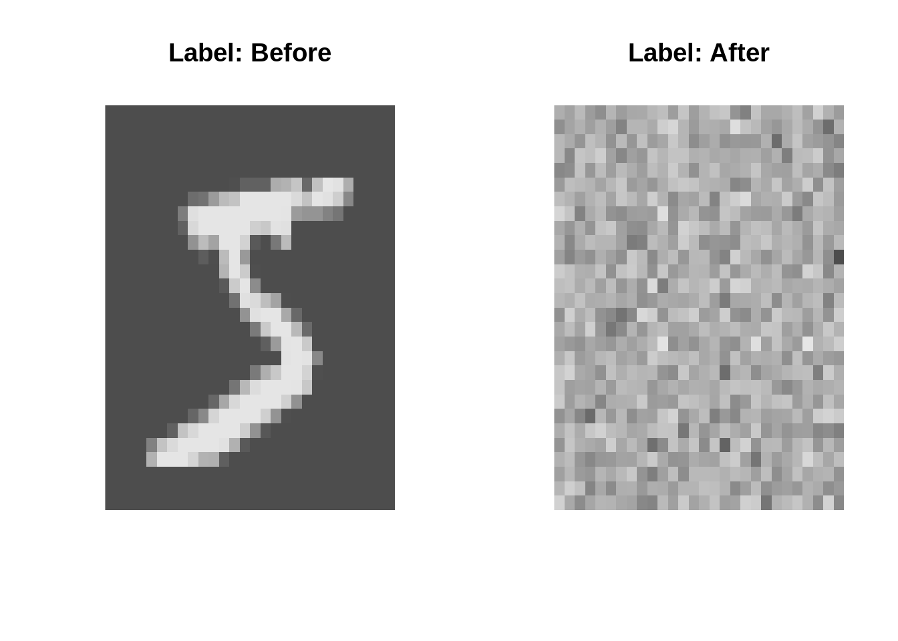

``` r
par(oldpar)
```

Fit the autoencoder (inputs == outputs!):

``` r
library(tensorflow)
library(keras)
set_random_seed(123L, disable_gpu = FALSE)  # Already sets R's random seed.

autoencoder %>% 
  fit(x = train_x, y = train_x, epochs = 5L, batch_size = 128L)
```

Visualization of the latent variables:

``` r
pred_dim = down_size_model(test_x)
reconstr_pred = up_size_model(pred_dim)
imgPlot(array(reconstr_pred[10,]$numpy(), dim = c(28L, 28L)), title = "")
```


``` r
ownColors = c("limegreen", "purple", "yellow", "grey", "orange",
              "black", "red", "navy", "sienna", "springgreen")
oldpar = par(mfrow = c(1, 1))
plot(pred_dim$numpy()[,1], pred_dim$numpy()[,2], col = ownColors[test[[2]]+1L])
```

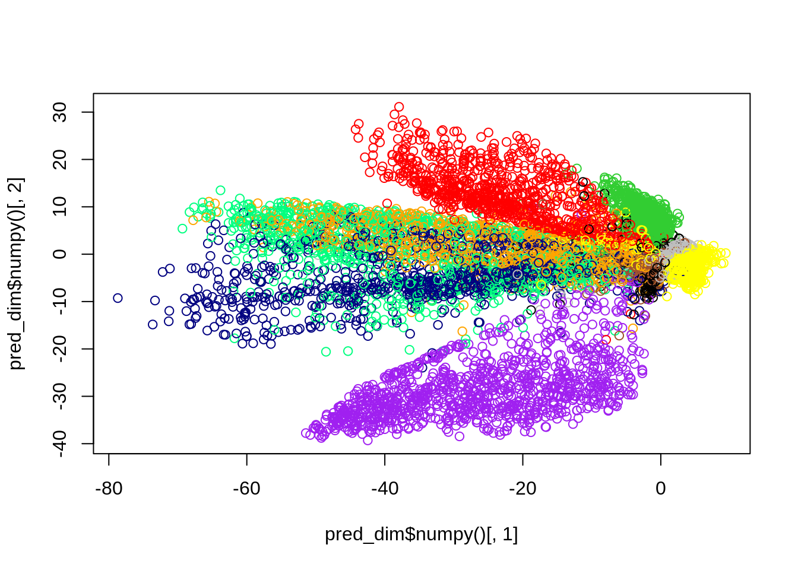

``` r
par(oldpar)
```

The picture above shows the 2-dimensional encoded values of the numbers in the MNIST data set and the number they are depicting via the respective color.

### Autoencoder - MNIST Convolutional Neural Networks

We can also use convolutional neural networks instead or on the side of deep neural networks: Prepare data:

``` r
data = tf$keras$datasets$mnist$load_data()
train = data[[1]]
train_x = array(train[[1]]/255, c(dim(train[[1]]), 1L))
test_x = array(data[[2]][[1]]/255, c(dim(data[[2]][[1]]/255), 1L))
```

Then define the downsize model:

``` r
down_size_model = keras_model_sequential()
down_size_model %>% 
  layer_conv_2d(filters = 16L, activation = "relu", kernel_size = c(3L, 3L), input_shape = c(28L, 28L, 1L), padding = "same") %>% 
  layer_max_pooling_2d(, padding = "same") %>% 
  layer_conv_2d(filters = 8L, activation = "relu", kernel_size = c(3L,3L), padding = "same") %>% 
  layer_max_pooling_2d(, padding = "same") %>% 
  layer_conv_2d(filters = 8L, activation = "relu", kernel_size = c(3L,3L), padding = "same") %>% 
  layer_max_pooling_2d(, padding = "same") %>% 
  layer_flatten() %>% 
  layer_dense(units = 2L, activation = "linear")
```

Define the upsize model:

``` r
up_size_model = keras_model_sequential()
up_size_model %>% 
  layer_dense(units = 128L, activation = "relu", input_shape = c(2L)) %>% 
  layer_reshape(target_shape = c(4L, 4L, 8L)) %>% 
  layer_conv_2d(filters = 8L, activation = "relu", kernel_size = c(3L,3L), padding = "same") %>% 
  layer_upsampling_2d() %>% 
  layer_conv_2d(filters = 8L, activation = "relu", kernel_size = c(3L,3L), padding = "same") %>% 
  layer_upsampling_2d() %>% 
  layer_conv_2d(filters = 16L, activation = "relu", kernel_size = c(3L,3L)) %>% 
  layer_upsampling_2d() %>% 
  layer_conv_2d(filters = 1, activation = "sigmoid", kernel_size = c(3L,3L), padding = "same")
```

Combine the two models and fit it:

``` r
library(tensorflow)
library(keras)
set_random_seed(321L, disable_gpu = FALSE)  # Already sets R's random seed.

autoencoder = tf$keras$models$Model(inputs = down_size_model$input,
                                    outputs = up_size_model(down_size_model$output))

autoencoder %>% compile(loss = loss_binary_crossentropy,
                    optimizer = optimizer_rmsprop(0.001))

autoencoder %>%  fit(x = tf$constant(train_x), y = tf$constant(train_x),
                      epochs = 50L, batch_size = 64L)
```

Test it:

``` r
pred_dim = down_size_model(tf$constant(test_x, "float32"))
reconstr_pred = autoencoder(tf$constant(test_x, "float32"))
imgPlot(reconstr_pred[10,,,]$numpy()[,,1])
```

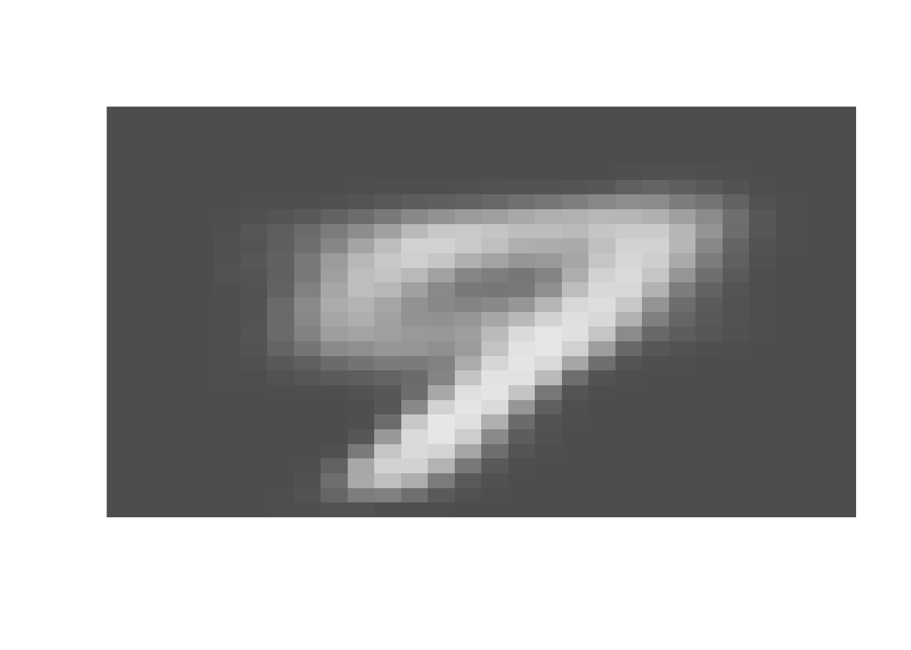

``` r

ownColors = c("limegreen", "purple", "yellow", "grey", "orange",
              "black", "red", "navy", "sienna", "springgreen")
plot(pred_dim[,1]$numpy(), pred_dim[,2]$numpy(), col = ownColors[test[[2]]+1L])
```

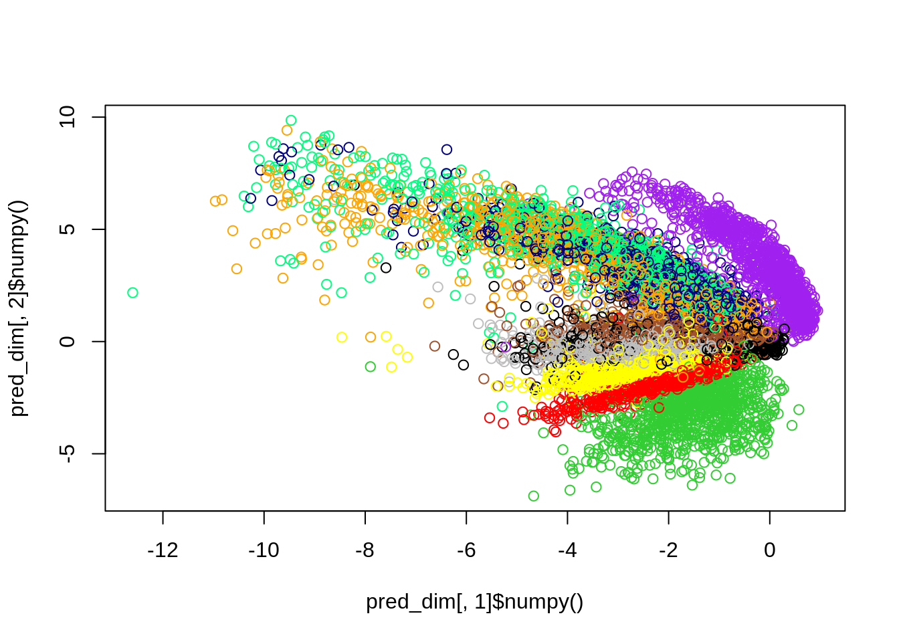

``` r

## Generate new images!
new = matrix(c(10, 10), 1, 2)
imgPlot(array(up_size_model(new)$numpy(), c(28L, 28L)))
```

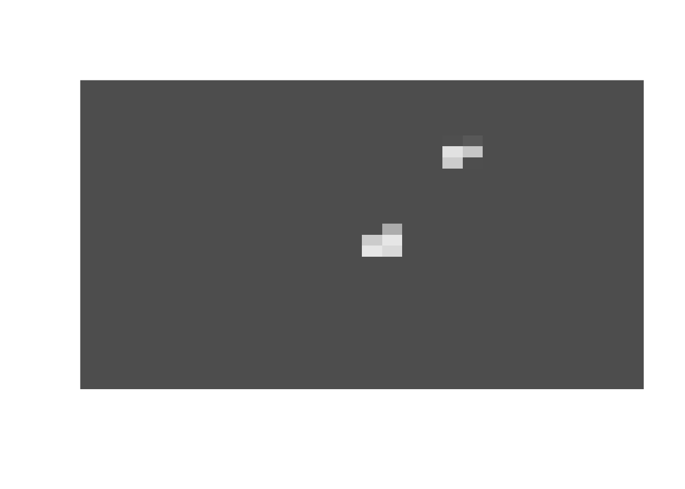

``` r

new = matrix(c(5, 5), 1, 2)
imgPlot(array(up_size_model(new)$numpy(), c(28L, 28L)))
```

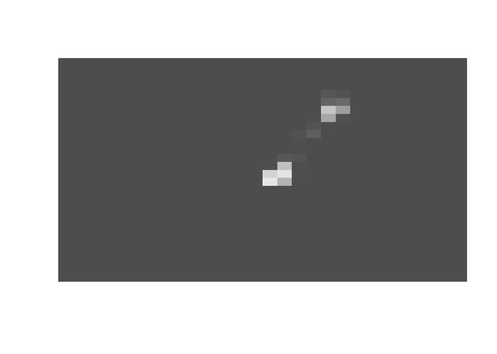

### Variational Autoencoder (VAE) {#VAE}

The difference between a variational and a normal autoencoder is that a variational autoencoder assumes a distribution for the latent variables (latent variables cannot be observed and are composed of other variables) and the parameters of this distribution are learned. Thus new objects can be generated by inserting valid (!) (with regard to the assumed distribution) "seeds" to the decoder. To achieve the property that more or less randomly chosen points in the low dimensional latent space are meaningful and yield suitable results after decoding, the latent space/training process must be regularized. In this process, the input to the VAE is encoded to a distribution in the latent space rather than a single point.

For building variational autoencoders, we will use TensorFlow probability, but first, we need to split the data again.

``` r
library(tfprobability)

data = tf$keras$datasets$mnist$load_data()
train = data[[1]]
train_x = array(train[[1]]/255, c(dim(train[[1]]), 1L))
```

We will use TensorFlow probability to define priors for our latent variables.

``` r
library(tfprobability)
set_random_seed(321L, disable_gpu = FALSE)  # Already sets R's random seed.

tfp = reticulate::import("tensorflow_probability")
```

Build the two networks:

``` r
encoded = 2L
prior = tfd_independent(tfd_normal(c(0.0, 0.0), 1.0), 1L)

up_size_model = keras_model_sequential()
up_size_model %>% 
  layer_dense(units = 128L, activation = "relu", input_shape = c(2L)) %>% 
  layer_reshape(target_shape = c(4L, 4L, 8L)) %>% 
  layer_conv_2d(filters = 8L, activation = "relu", kernel_size = c(3L,3L), padding = "same") %>% 
  layer_upsampling_2d() %>% 
  layer_conv_2d(filters = 8L, activation = "relu", kernel_size = c(3L,3L), padding = "same") %>% 
  layer_upsampling_2d() %>% 
  layer_conv_2d(filters = 16L, activation = "relu", kernel_size = c(3L,3L)) %>% 
  layer_upsampling_2d() %>% 
  layer_conv_2d(filters = 1, activation = "sigmoid", kernel_size = c(3L,3L), padding = "same")

down_size_model = keras_model_sequential()
down_size_model %>% 
  layer_conv_2d(filters = 16L, activation = "relu", kernel_size = c(3L, 3L), input_shape = c(28L, 28L, 1L), padding = "same") %>% 
  layer_max_pooling_2d(, padding = "same") %>% 
  layer_conv_2d(filters = 8L, activation = "relu", kernel_size = c(3L,3L), padding = "same") %>% 
  layer_max_pooling_2d(, padding = "same") %>% 
  layer_conv_2d(filters = 8L, activation = "relu", kernel_size = c(3L,3L), padding = "same") %>% 
  layer_max_pooling_2d(, padding = "same") %>% 
  layer_flatten() %>% 
  layer_dense(units = 4L, activation = "linear") %>% 
  layer_independent_normal(2L,
                           activity_regularizer =
                             tfp$layers$KLDivergenceRegularizer(distribution_b = prior))

VAE = keras_model(inputs = down_size_model$inputs,
                  outputs = up_size_model(down_size_model$outputs))
```

Compile and fit model:

``` r
library(tensorflow)
library(keras)
set_random_seed(321L, disable_gpu = FALSE)  # Already sets R's random seed.

loss_binary = function(true, pred){
  return(loss_binary_crossentropy(true, pred) * 28.0 * 28.0)
}
VAE %>% compile(loss = loss_binary, optimizer = optimizer_adamax())

VAE %>% fit(train_x, train_x, epochs = 50L)
```

And show that it works:

``` r
dist = down_size_model(train_x[1:2000,,,,drop = FALSE])
images = up_size_model(dist$sample()[1:5,])

ownColors = c("limegreen", "purple", "yellow", "grey", "orange",
              "black", "red", "navy", "sienna", "springgreen")
oldpar = par(mfrow = c(1, 1))
imgPlot(images[1,,,1]$numpy())
```

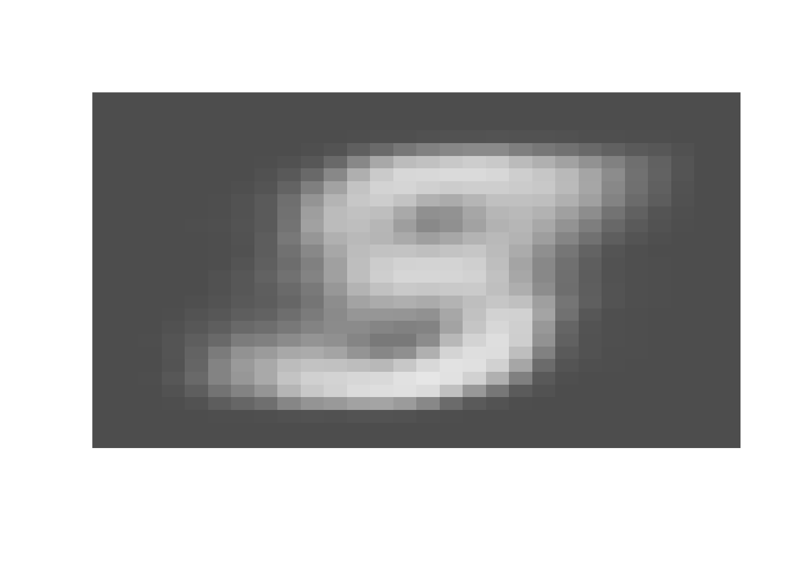

``` r
plot(dist$mean()$numpy()[,1], dist$mean()$numpy()[,2], col = ownColors[train[[2]]+1L])
```

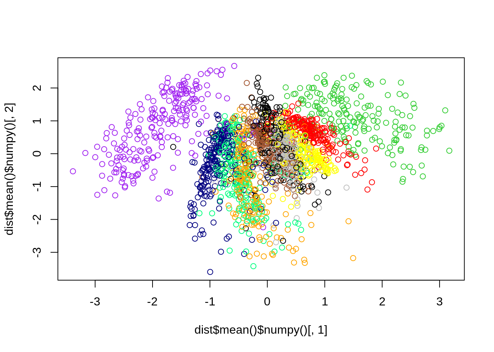

``` r
par(oldpar)
```

### Exercise

```{=html}
  <hr/>
  <strong><span style="color: #0011AA; font-size:18px;">1. Task</span></strong><br/>
```
Read section \@ref(VAE) on variational autoencoders and try to transfer the examples with MNIST to our flower data set.

```{=html}
  <details>
    <summary>
      <strong><span style="color: #0011AA; font-size:18px;">Solution</span></strong>
    </summary>
    <p>
```
Split the data:

``` r
library(keras)
library(tensorflow)
library(tfprobability)
set_random_seed(321L, disable_gpu = FALSE)  # Already sets R's random seed.

data = EcoData::dataset_flower()
test = data$test/255
train = data$train/255
rm(data)
```

Build the variational autoencoder:

``` r
encoded = 10L
prior = tfp$distributions$Independent(
  tfp$distributions$Normal(loc=tf$zeros(encoded), scale = 1.),
  reinterpreted_batch_ndims = 1L
)

down_size_model = tf$keras$models$Sequential(list(
  tf$keras$layers$InputLayer(input_shape = c(80L, 80L, 3L)),
  tf$keras$layers$Conv2D(filters = 32L, activation = tf$nn$leaky_relu,
                         kernel_size = 5L, strides = 1L),
  tf$keras$layers$Conv2D(filters = 32L, activation = tf$nn$leaky_relu,
                         kernel_size = 5L, strides = 2L),
  tf$keras$layers$Conv2D(filters = 64L, activation = tf$nn$leaky_relu,
                         kernel_size = 5L, strides = 1L),
  tf$keras$layers$Conv2D(filters = 64L, activation = tf$nn$leaky_relu,
                         kernel_size = 5L, strides = 2L),
  tf$keras$layers$Conv2D(filters = 128L, activation = tf$nn$leaky_relu,
                         kernel_size = 7L, strides = 1L),
  tf$keras$layers$Flatten(),
  tf$keras$layers$Dense(units = tfp$layers$MultivariateNormalTriL$params_size(encoded),
                        activation = NULL),
  tfp$layers$MultivariateNormalTriL(
    encoded, 
    activity_regularizer = tfp$layers$KLDivergenceRegularizer(prior, weight = 0.0002)
  )
))

up_size_model = tf$keras$models$Sequential(list(
  tf$keras$layers$InputLayer(input_shape = encoded),
  tf$keras$layers$Dense(units = 8192L, activation = "relu"),
  tf$keras$layers$Reshape(target_shape =  c(8L, 8L, 128L)),
  tf$keras$layers$Conv2DTranspose(filters = 128L, kernel_size = 7L,
                                  activation = tf$nn$leaky_relu, strides = 1L,
                                  use_bias = FALSE),
  tf$keras$layers$Conv2DTranspose(filters = 64L, kernel_size = 5L,
                                  activation = tf$nn$leaky_relu, strides = 2L,
                                  use_bias = FALSE),
  tf$keras$layers$Conv2DTranspose(filters = 64L, kernel_size = 5L,
                                  activation = tf$nn$leaky_relu, strides = 1L,
                                  use_bias = FALSE),
  tf$keras$layers$Conv2DTranspose(filters = 32L, kernel_size = 5L,
                                  activation = tf$nn$leaky_relu, strides = 2L,
                                  use_bias = FALSE),
  tf$keras$layers$Conv2DTranspose(filters = 32L, kernel_size = 5L,
                                  activation = tf$nn$leaky_relu, strides = 1L,
                                  use_bias = FALSE),
  tf$keras$layers$Conv2DTranspose(filters = 3L, kernel_size = c(4L, 4L),
                                  activation = "sigmoid", strides = c(1L, 1L),
                                  use_bias = FALSE)
))

VAE = tf$keras$models$Model(inputs = down_size_model$inputs, 
                            outputs = up_size_model(down_size_model$outputs))
summary(VAE)
#> Model: "model_3"
#> __________________________________________________________________________________________
#>  Layer (type)                           Output Shape                        Param #       
#> ==========================================================================================
#>  input_1 (InputLayer)                   [(None, 80, 80, 3)]                 0             
#>  conv2d_14 (Conv2D)                     (None, 76, 76, 32)                  2432          
#>  conv2d_15 (Conv2D)                     (None, 36, 36, 32)                  25632         
#>  conv2d_16 (Conv2D)                     (None, 32, 32, 64)                  51264         
#>  conv2d_17 (Conv2D)                     (None, 14, 14, 64)                  102464        
#>  conv2d_18 (Conv2D)                     (None, 8, 8, 128)                   401536        
#>  flatten_2 (Flatten)                    (None, 8192)                        0             
#>  dense_10 (Dense)                       (None, 65)                          532545        
#>  multivariate_normal_tri_l (Multivariat  ((None, 10),                       0             
#>  eNormalTriL)                            (None, 10))                                      
#>  sequential_7 (Sequential)              (None, 80, 80, 3)                   1278464       
#> ==========================================================================================
#> Total params: 2,394,337
#> Trainable params: 2,394,337
#> Non-trainable params: 0
#> __________________________________________________________________________________________
```

Compile and train model:

``` r
be = function(true, pred){
  return(tf$losses$binary_crossentropy(true, pred) * 80.0 * 80.0)
}

VAE$compile(loss = be,
            optimizer = tf$keras$optimizers$Adamax(learning_rate = 0.0003))
VAE$fit(x = train, y = train, epochs = 50L, shuffle = TRUE, batch_size = 20L)
#> <keras.callbacks.History object at 0x7fcefde64b90>

dist = down_size_model(train[1:10,,,])
images = up_size_model( dist$sample()[1:5,] )

oldpar = par(mfrow = c(3, 1), mar = rep(1, 4))
scales::rescale(images[1,,,]$numpy(), to = c(0, 255)) %>% 
  image_to_array() %>%
  `/`(., 255) %>%
  as.raster() %>%
  plot()

scales::rescale(images[2,,,]$numpy(), to = c(0, 255)) %>% 
  image_to_array() %>%
  `/`(., 255) %>%
  as.raster() %>%
  plot()

scales::rescale(images[3,,,]$numpy(), to = c(0, 255)) %>% 
  image_to_array() %>%
  `/`(., 255) %>%
  as.raster() %>%
  plot()
```

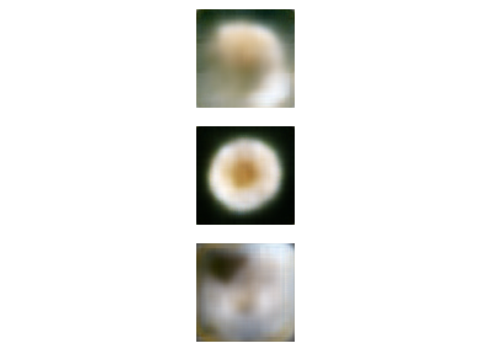

``` r
par(oldpar)
```

```{=html}
    </p>
  </details>
  <br/><hr/>
```
## Generative Adversarial Networks (GANs) {#GANS}

The idea of a generative adversarial network (GAN) is that two neural networks contest against each other in a "game". One network is creating data and is trying to "trick" the other network into deciding the generated data is real. The *generator* (similar to the decoder in autoencoders) creates new images from noise. The *discriminator* is getting a mix of true (from the data set) and artificially generated images from the generator. Thereby, the loss of the generator rises when fakes are identified as fakes by the discriminator (simple binary cross entropy loss, 0/1...). The loss of the discriminator rises when fakes are identified as real images (class 0) or real images as fakes (class 1), again with binary cross entropy.

**Binary cross entropy:** Entropy or *Shannon entropy* (named after Claude Shannon) $\mathbf{H}$ (uppercase "eta") in context of information theory is the expected value of information content or the mean/average information content of an "event" compared to all possible outcomes. Encountering an event with low probability holds more information than encountering an event with high probability.

*Binary cross entropy* is a measure to determine the similarity of two (discrete) probability distributions $A~(\mathrm{true~distribution}), B~(\mathrm{predicted~distribution})$ according to the inherent information.

It is not (!) symmetric, in general: $\textbf{H}_{A}(B) \neq \textbf{H}_{B}(A)$. The minimum value depends on the distribution of $A$ and is the entropy of $A$: $$\mathrm{min}~\textbf{H}_{A}(B) = \underset{B}{\mathrm{min}}~\textbf{H}_{A}(B) = \textbf{H}_{A}(B = A) = \textbf{H}_{A}(A) = \textbf{H}(A)$$

The setup:

-   Outcomes $y_{i} \in \{0, 1\}$ (labels).
-   Predictions $\hat{y}_{i} \in[0, 1]$ (probabilities).

The binary cross entropy or log loss of a system of outcomes/predictions is then defined as follows: $$
  \textbf{H}_{A}(B) =
  -\frac{1}{N} \sum_{i = 1}^{N} y_{i} \cdot \mathrm{log} \left( p(y_{i}) \right) + (1 -y_{i}) \cdot \mathrm{log} \left( 1-p(y_{i}) \right) =\\
  = -\frac{1}{N} \sum_{i = 1}^{N} y_{i} \cdot \mathrm{log} (\hat{y}_{i}) + (1 -y_{i}) \cdot \mathrm{log} \left( 1- \hat{y}_{i} \right)
$$ High predicted probabilities of having the label for originally labeled data (1) yield a low loss as well as predicting a low probability of having the label for originally unlabeled data (0). Mind the properties of probabilities and the logarithm.

A possible application of generative adversarial networks is to create pictures that look like real photographs e.g. <a href="https://thispersondoesnotexist.com/" target="_blank" rel="noopener">https://thispersondoesnotexist.com/</a>. Visit that site (several times)!. However, the application of generative adversarial networks today is much wider than just the creation of data. For example, generative adversarial networks can also be used to "augment" data, i.e. to create new data and thereby improve the fitted model.

### MNIST - Generative Adversarial Networks Based on Deep Neural Networks

We will now explore this on the MNIST data set.

``` r
library(keras)
library(tensorflow)
set_random_seed(321L, disable_gpu = FALSE)  # Already sets R's random seed.

rotate = function(x){ t(apply(x, 2, rev)) }
imgPlot = function(img, title = ""){
  col = grey.colors(255)
  image(rotate(img), col = col, xlab = "", ylab = "", axes = FALSE,
        main = paste0("Label: ", as.character(title)))
}
```

We don't need the test set here.

``` r
data = dataset_mnist()
train = data$train
train_x = array((train$x-127.5)/127.5, c(dim(train$x)[1], 784L))
```

We need a function to sample images for the discriminator.

``` r
batch_size = 32L
dataset = tf$data$Dataset$from_tensor_slices(tf$constant(train_x, "float32"))
dataset$batch(batch_size)
#> <BatchDataset element_spec=TensorSpec(shape=(None, 784), dtype=tf.float32, name=None)>
```

Define generator model:

``` r
get_generator = function(){
  generator = keras_model_sequential()
  generator %>% 
  layer_dense(units = 200L, input_shape = c(100L)) %>% 
  layer_activation_leaky_relu() %>% 
  layer_dense(units = 200L) %>% 
  layer_activation_leaky_relu() %>% 
  layer_dense(units = 784L, activation = "tanh")
  
  return(generator)
}
```

And we also test the generator model:

``` r
generator = get_generator()
sample = tf$random$normal(c(1L, 100L))
imgPlot(array(generator(sample)$numpy(), c(28L, 28L)))
```

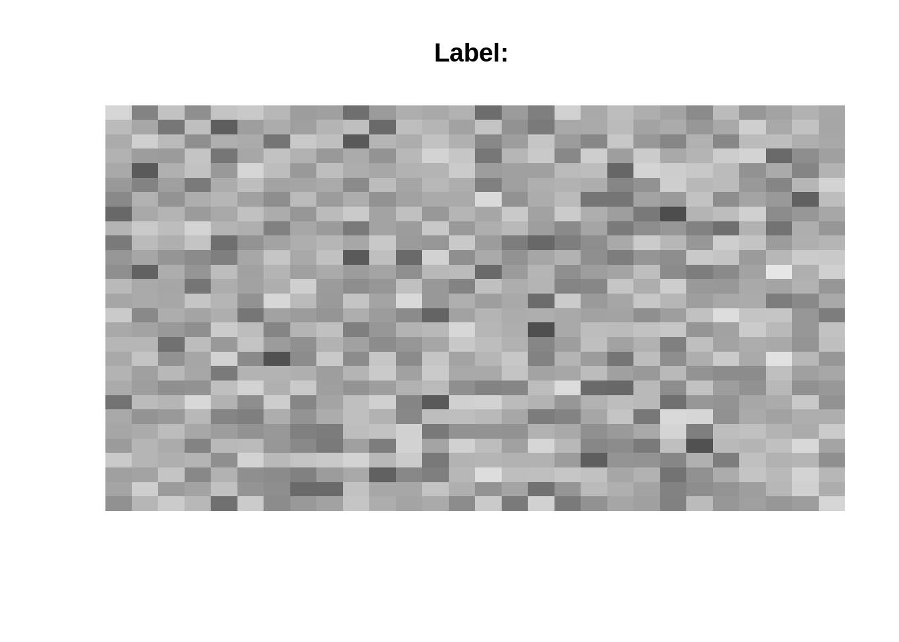

In the discriminator, noise (random vector with 100 values) is passed through the network such that the output corresponds to the number of pixels of one MNIST image (784). We therefore define the discriminator function now.

``` r
get_discriminator = function(){
  discriminator = keras_model_sequential()
  discriminator %>% 
  layer_dense(units = 200L, input_shape = c(784L)) %>% 
  layer_activation_leaky_relu() %>% 
  layer_dense(units = 100L) %>% 
  layer_activation_leaky_relu() %>% 
  layer_dense(units = 1L, activation = "sigmoid")
  
  return(discriminator)
}
```

And we also test the discriminator function.

``` r
discriminator = get_discriminator()
discriminator(generator(tf$random$normal(c(1L, 100L))))
#> tf.Tensor([[0.5089391]], shape=(1, 1), dtype=float32)
```

We also have to define the loss functions for both networks.We use the already known binary cross entropy. However, we have to encode the real and predicted values for the two networks individually.

The discriminator will get two losses - one for identifying fake images as fake, and one for identifying real MNIST images as real images.

The generator will just get one loss - was it able to deceive the discriminator?

``` r
ce = tf$keras$losses$BinaryCrossentropy(from_logits = TRUE)

loss_discriminator = function(real, fake){
  real_loss = ce(tf$ones_like(real), real)
  fake_loss = ce(tf$zeros_like(fake), fake)
  return(real_loss + fake_loss)
}

loss_generator = function(fake){
  return(ce(tf$ones_like(fake), fake))
}
```

Each network will get its own optimizer (in a GAN the networks are treated independently):

``` r
gen_opt = tf$keras$optimizers$RMSprop(1e-4)
disc_opt = tf$keras$optimizers$RMSprop(1e-4)
```

We have to write our own training loop here (we cannot use the fit function). In each iteration (for each batch) we will do the following (the GradientTape records computations to do automatic differentiation):

1.  Sample noise.
2.  Generator creates images from the noise.
3.  Discriminator makes predictions for fake images and real images (response is a probability between \[0,1\]).
4.  Calculate loss for generator.
5.  Calculate loss for discriminator.
6.  Calculate gradients for weights and the loss.
7.  Update weights of generator.
8.  Update weights of discriminator.
9.  Return losses.

``` r
generator = get_generator()
discriminator = get_discriminator()

train_step = function(images){
  noise = tf$random$normal(c(128L, 100L))
  with(tf$GradientTape(persistent = TRUE) %as% tape,
    {
      gen_images = generator(noise)
      fake_output = discriminator(gen_images)
      real_output = discriminator(images)
      gen_loss = loss_generator(fake_output)
      disc_loss = loss_discriminator(real_output, fake_output)
    }
  )
  
  gen_grads = tape$gradient(gen_loss, generator$weights)
  disc_grads = tape$gradient(disc_loss, discriminator$weights)
  rm(tape)
  gen_opt$apply_gradients(purrr::transpose(list(gen_grads, generator$weights)))
  disc_opt$apply_gradients(purrr::transpose(list(disc_grads, discriminator$weights)))
  
  return(c(gen_loss, disc_loss))
}

train_step = tf$`function`(reticulate::py_func(train_step))
```

Now we can finally train our networks in a training loop:

1.  Create networks.
2.  Get batch of images.
3.  Run train_step function.
4.  Print losses.
5.  Repeat step 2-4 for number of epochs.

``` r
library(tensorflow)
library(keras)
set_random_seed(321L, disable_gpu = FALSE)  # Already sets R's random seed.

batch_size = 128L
epochs = 20L
steps = as.integer(nrow(train_x)/batch_size)
counter = 1
gen_loss = c()
disc_loss = c()

dataset2 = dataset$prefetch(tf$data$AUTOTUNE)

for(e in 1:epochs){
  dat = reticulate::as_iterator(dataset2$batch(batch_size))
  
  coro::loop(
    for(images in dat){
      losses = train_step(images)
      gen_loss = c(gen_loss, tf$reduce_sum(losses[[1]])$numpy())
      disc_loss = c(disc_loss, tf$reduce_sum(losses[[2]])$numpy())
    }
  )
   
  if(e %% 5 == 0){ #Print output every 5 steps.
    cat("Gen: ", mean(gen_loss), " Disc: ", mean(disc_loss), " \n")
  }
  noise = tf$random$normal(c(1L, 100L))
  if(e %% 10 == 0){  #Plot image every 10 steps.
    imgPlot(array(generator(noise)$numpy(), c(28L, 28L)), "Gen")
  }
}
#> Gen:  0.8095555  Disc:  1.10533  
#> Gen:  0.8928918  Disc:  1.287504
```

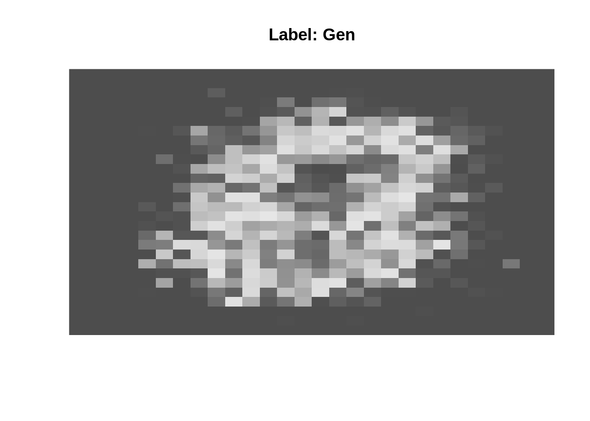

```         
#> Gen:  0.9071119  Disc:  1.314586  
#> Gen:  0.9514963  Disc:  1.31548
```

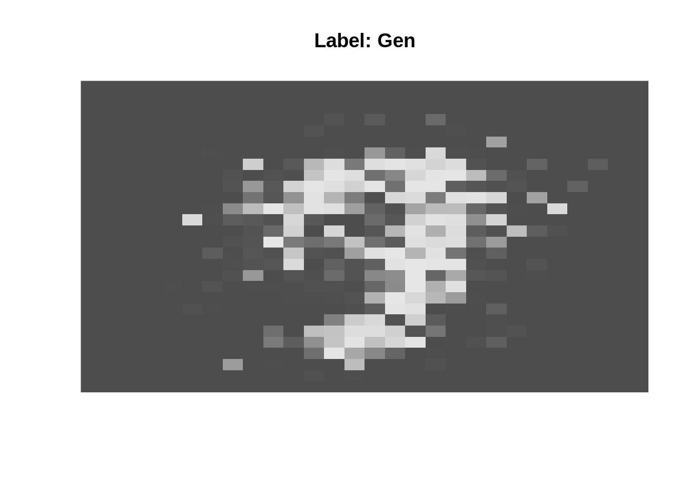

### Flower - GAN

We can now also do the same for the flower data set. We will write this completely on our own following the steps also done for the MNIST data set.

``` r
library(keras)
library(tidyverse)
#> ── Attaching packages ───────────────────────────────────────────────── tidyverse 1.3.1 ──
#> ✔ ggplot2 3.3.6     ✔ purrr   0.3.4
#> ✔ tibble  3.1.7     ✔ dplyr   1.0.9
#> ✔ tidyr   1.2.0     ✔ stringr 1.4.0
#> ✔ readr   2.1.2     ✔ forcats 0.5.1
#> ── Conflicts ──────────────────────────────────────────────────── tidyverse_conflicts() ──
#> ✖ dplyr::filter() masks stats::filter()
#> ✖ dplyr::lag()    masks stats::lag()
library(tensorflow)
library(EcoData)

data = EcoData::dataset_flower()
train = (data$train-127.5)/127.5
test = (data$test-127.5)/127.5
train_x = abind::abind(list(train, test), along = 1L)
dataset = tf$data$Dataset$from_tensor_slices(tf$constant(train_x, "float32"))
```

Define the generator model and test it:

``` r
library(tensorflow)
library(keras)
set_random_seed(321L, disable_gpu = FALSE)  # Already sets R's random seed.

get_generator = function(){
  generator = keras_model_sequential()
  generator %>% 
    layer_dense(units = 20L*20L*128L, input_shape = c(100L),
                use_bias = FALSE) %>% 
    layer_activation_leaky_relu() %>% 
    layer_reshape(c(20L, 20L, 128L)) %>% 
    layer_dropout(0.3) %>% 
    layer_conv_2d_transpose(filters = 256L, kernel_size = c(3L, 3L),
                            padding = "same", strides = c(1L, 1L),
                            use_bias = FALSE) %>% 
    layer_activation_leaky_relu() %>% 
    layer_dropout(0.3) %>% 
    layer_conv_2d_transpose(filters = 128L, kernel_size = c(5L, 5L),
                            padding = "same", strides = c(1L, 1L),
                            use_bias = FALSE) %>% 
    layer_activation_leaky_relu() %>% 
    layer_dropout(0.3) %>% 
    layer_conv_2d_transpose(filters = 64L, kernel_size = c(5L, 5L),
                            padding = "same", strides = c(2L, 2L),
                            use_bias = FALSE) %>%
    layer_activation_leaky_relu() %>% 
    layer_dropout(0.3) %>% 
    layer_conv_2d_transpose(filters = 3L, kernel_size = c(5L, 5L),
                            padding = "same", strides = c(2L, 2L),
                            activation = "tanh", use_bias = FALSE)
  return(generator)
}

generator = get_generator()
image = generator(tf$random$normal(c(1L,100L)))$numpy()[1,,,]
image = scales::rescale(image, to = c(0, 255))
image %>% 
  image_to_array() %>%
  `/`(., 255) %>%
  as.raster() %>%
  plot()
```


Define the discriminator and test it:

``` r
library(tensorflow)
library(keras)
set_random_seed(321L, disable_gpu = FALSE)  # Already sets R's random seed.

get_discriminator = function(){
  discriminator = keras_model_sequential()
  discriminator %>% 
    layer_conv_2d(filters = 64L, kernel_size = c(5L, 5L),
                  strides = c(2L, 2L), padding = "same",
                  input_shape = c(80L, 80L, 3L)) %>%
    layer_activation_leaky_relu() %>% 
    layer_dropout(0.3) %>% 
    layer_conv_2d(filters = 128L, kernel_size = c(5L, 5L),
                  strides = c(2L, 2L), padding = "same") %>% 
    layer_activation_leaky_relu() %>% 
    layer_dropout(0.3) %>% 
    layer_conv_2d(filters = 256L, kernel_size = c(3L, 3L),
                  strides = c(2L, 2L), padding = "same") %>% 
    layer_activation_leaky_relu() %>% 
    layer_dropout(0.3) %>% 
    layer_flatten() %>% 
    layer_dense(units = 1L, activation = "sigmoid")
  return(discriminator)
}

discriminator = get_discriminator()
discriminator
#> Model: "sequential_13"
#> __________________________________________________________________________________________
#>  Layer (type)                           Output Shape                        Param #       
#> ==========================================================================================
#>  conv2d_21 (Conv2D)                     (None, 40, 40, 64)                  4864          
#>  leaky_re_lu_14 (LeakyReLU)             (None, 40, 40, 64)                  0             
#>  dropout_6 (Dropout)                    (None, 40, 40, 64)                  0             
#>  conv2d_20 (Conv2D)                     (None, 20, 20, 128)                 204928        
#>  leaky_re_lu_13 (LeakyReLU)             (None, 20, 20, 128)                 0             
#>  dropout_5 (Dropout)                    (None, 20, 20, 128)                 0             
#>  conv2d_19 (Conv2D)                     (None, 10, 10, 256)                 295168        
#>  leaky_re_lu_12 (LeakyReLU)             (None, 10, 10, 256)                 0             
#>  dropout_4 (Dropout)                    (None, 10, 10, 256)                 0             
#>  flatten_3 (Flatten)                    (None, 25600)                       0             
#>  dense_25 (Dense)                       (None, 1)                           25601         
#> ==========================================================================================
#> Total params: 530,561
#> Trainable params: 530,561
#> Non-trainable params: 0
#> __________________________________________________________________________________________
discriminator(generator(tf$random$normal(c(1L, 100L))))
#> tf.Tensor([[0.49996078]], shape=(1, 1), dtype=float32)
```

Define the loss functions:

``` r
ce = tf$keras$losses$BinaryCrossentropy(from_logits = TRUE,
                                        label_smoothing = 0.1)

loss_discriminator = function(real, fake){
  real_loss = ce(tf$ones_like(real), real)
  fake_loss = ce(tf$zeros_like(fake), fake)
  return(real_loss+fake_loss)
}

loss_generator = function(fake){
  return(ce(tf$ones_like(fake), fake))
}
```

Define the optimizers and the batch function:

``` r
gen_opt = tf$keras$optimizers$RMSprop(1e-4)
disc_opt = tf$keras$optimizers$RMSprop(1e-4)
```

Define functions for the generator and discriminator:

``` r
generator = get_generator()
discriminator = get_discriminator()

train_step = function(images){
  noise = tf$random$normal(c(32L, 100L))
  
  with(tf$GradientTape(persistent = TRUE) %as% tape,
    {
      gen_images = generator(noise)
      
      real_output = discriminator(images)
      fake_output = discriminator(gen_images)
      
      gen_loss = loss_generator(fake_output)
      disc_loss = loss_discriminator(real_output, fake_output)
    }
  )
  
  gen_grads = tape$gradient(gen_loss, generator$weights)
  disc_grads = tape$gradient(disc_loss, discriminator$weights)
  rm(tape)
  
  gen_opt$apply_gradients(purrr::transpose(list(gen_grads,
                                                generator$weights)))
  disc_opt$apply_gradients(purrr::transpose(list(disc_grads,
                                                 discriminator$weights)))
  
  return(c(gen_loss, disc_loss))
}

train_step = tf$`function`(reticulate::py_func(train_step))
```

Do the training:

``` r
library(tensorflow)
library(keras)
set_random_seed(321L, disable_gpu = FALSE)  # Already sets R's random seed.

batch_size = 32L
epochs = 30L
steps = as.integer(dim(train_x)[1]/batch_size)
counter = 1
gen_loss = c()
disc_loss = c()

dataset = dataset$prefetch(tf$data$AUTOTUNE)

for(e in 1:epochs){
  dat = reticulate::as_iterator(dataset$batch(batch_size))
  
  coro::loop(
    for(images in dat){
      losses = train_step(images)
      gen_loss = c(gen_loss, tf$reduce_sum(losses[[1]])$numpy())
      disc_loss = c(disc_loss, tf$reduce_sum(losses[[2]])$numpy())
    }
  )
   
  noise = tf$random$normal(c(1L, 100L))
  image = generator(noise)$numpy()[1,,,]
  image = scales::rescale(image, to = c(0, 255))
  if(e %% 15 == 0){
    image %>% 
      image_to_array() %>%
        `/`(., 255) %>%
        as.raster() %>%
        plot()
  }
   
  if(e %% 10 == 0) cat("Gen: ", mean(gen_loss), " Disc: ", mean(disc_loss), " \n")
}
#> Gen:  1.651127  Disc:  0.8720699
```

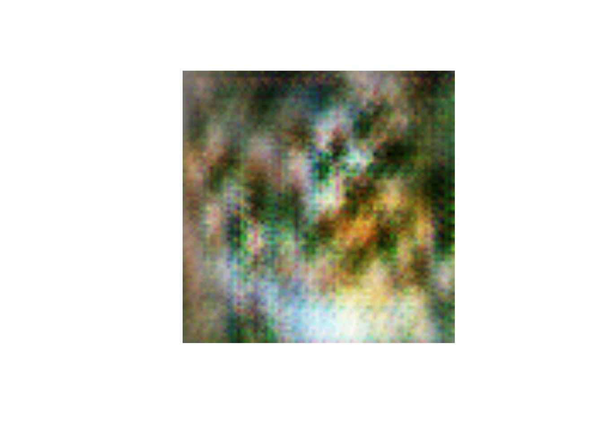

```         
#> Gen:  1.303061  Disc:  1.037192
```

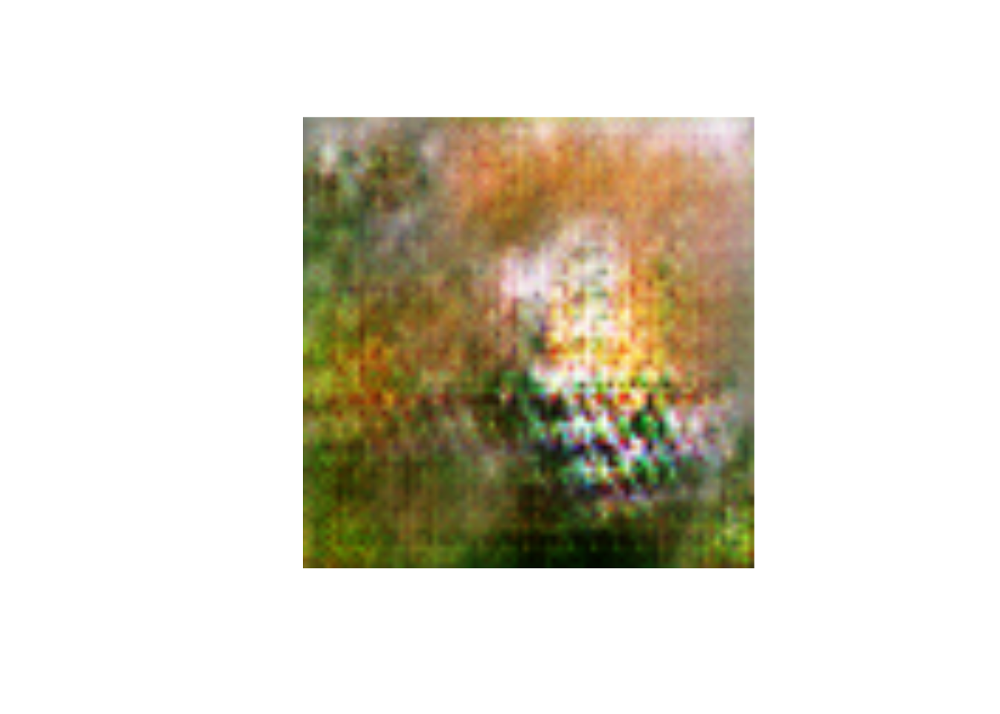

```         
#> Gen:  1.168868  Disc:  1.100166
```

``` r
library(tensorflow)
library(keras)
set_random_seed(321L, disable_gpu = FALSE)  # Already sets R's random seed.

noise = tf$random$normal(c(1L, 100L))
image = generator(noise)$numpy()[1,,,]
image = scales::rescale(image, to = c(0, 255))
image %>% 
  image_to_array() %>%
  `/`(., 255) %>%
  as.raster() %>%
  plot()
```

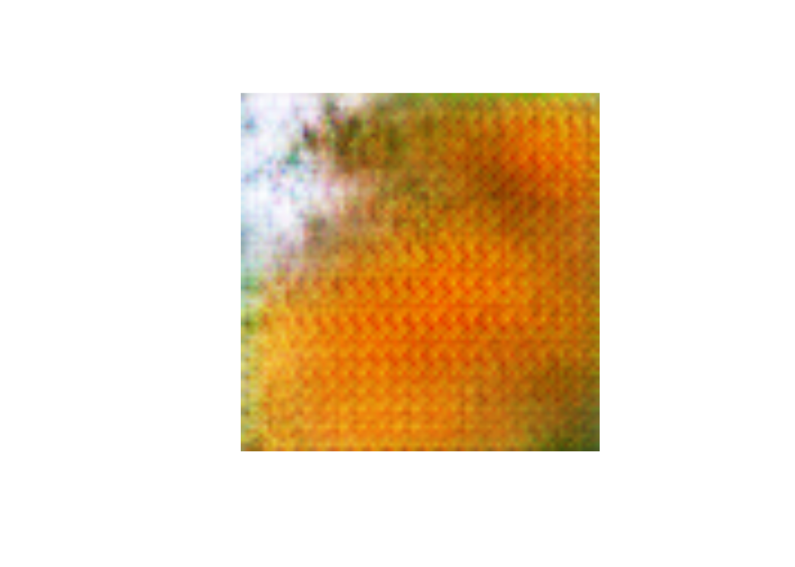

More images:


### Exercise

```{=html}
  <strong><span style="color: #0011AA; font-size:18px;">2. Task</span></strong><br/>
```
Go through the R examples on generative adversarial networks (\@ref(GANS)) and compare the flower example with the MNIST example - where are the differences - and why?

```{=html}
  <details>
    <summary>
      <strong><span style="color: #0011AA; font-size:18px;">Solution</span></strong>
    </summary>
    <p>
```
The MNIST example uses a "simple" deep neural network which is sufficient for a classification that easy. The flower example uses a much more expensive convolutional neural network to classify the images.

```{=html}
    </p>
  </details>
  <br/><hr/>
```
## Reinforcement learning

This is just a teaser, run/adapt it if you like.

Objective: Train a neural network capable of balancing a pole.

The environment is run on a local server, please install <a href="https://github.com/openai/gym-http-api" target="_blank" rel="noopener">gym</a>.

Or go through this <a href="https://colab.research.google.com/github/tensorflow/agents/blob/master/docs/tutorials/6_reinforce_tutorial.ipynb" target="_blank" rel="noopener">colab book</a>.

``` r
library(keras)
library(tensorflow)
library(gym)
set_random_seed(321L, disable_gpu = FALSE)  # Already sets R's random seed.

remote_base =´ "http://127.0.0.1:5000"
client = create_GymClient(remote_base)
env = gym::env_create(client, "CartPole-v1")
gym::env_list_all(client)
env_reset(client, env)
# action = env_action_space_sample(client, env)
step = env_step(client, env, 1)

env_reset(client, env)
goal_steps = 500
score_requirement = 60
intial_games = 1000

state_size = 4L
action_size = 2L
gamma = 0.95
epsilon = 0.95
epsilon_min = 0.01
epsilon_decay = 0.995

model = keras_model_sequential()
model %>% 
 layer_dense(input_shape = c(4L), units = 20L, activation = "relu") %>% 
 layer_dense(units = 20L, activation = "relu") %>% 
 layer_dense(2L, activation = "linear")

model %>% 
 keras::compile(loss = loss_mean_squared_error, optimizer = optimizer_adamax())

memory = matrix(0, nrow = 8000L, 11L)
counter = 1

remember = function(memory, state, action, reward, next_state, done){
  memory[counter,] = as.numeric(c(state, action, reward, next_state, done))
  counter <<- counter+1
  return(memory)
}

# memory: state 1:4, action 5, reward 6, next_state 7:10, done 11
act = function(state){
 if(runif(1) <= epsilon){ return(sample(0:1, 1)) }
 act_prob = predict(model, matrix(state, nrow = 1L))
 return(which.max(act_prob) - 1L)
}

replay = function(batch_size = 25L, memory, counter){
  indices = sample.int(counter, batch_size)
  batch = memory[indices,,drop = FALSE]
  
  for(i in 1:nrow(batch)){
    target = batch[i,6] # Reward.
    action = batch[i,5] # Action.
    state = matrix(memory[i, 1:4], nrow = 1L)
    next_state = matrix(memory[i,7:10], nrow =1L)
    if(!batch[i,11]){ # Not done.
      target = (batch[i,6] + gamma * predict(model,
                                            matrix(next_state, nrow = 1L)))[1,1]
    }
    
    target_f = predict(model, matrix(state, nrow = 1L))
    target_f[action+1L] = target
    model$fit(x = state, y = target_f, epochs = 1L, verbose = 0L)
    
    if(epsilon > epsilon_min){ epsilon <<- epsilon_decay*epsilon }
  }
}

done = 0

for(e in 1:100){
  state = unlist(env_reset(client, env))
  
  for(time in 1:500){
    action = act(state)
    response = env_step(client, env, action = action)
    done = as.integer(response$done)
    
    if(!done){ reward = response$reward }
    else{ reward = -10 }
    
    next_state = unlist(response$observation)
    memory = remember(memory, state, action, reward, next_state, done)
    
    state = next_state
    if(done){
      cat("episode", e/500, " score: ", time, " eps: ", epsilon, "\n")
      break()
    }
    
    if(counter > 32L){ replay(32L, memory, counter-1L) }
  }
}
```
