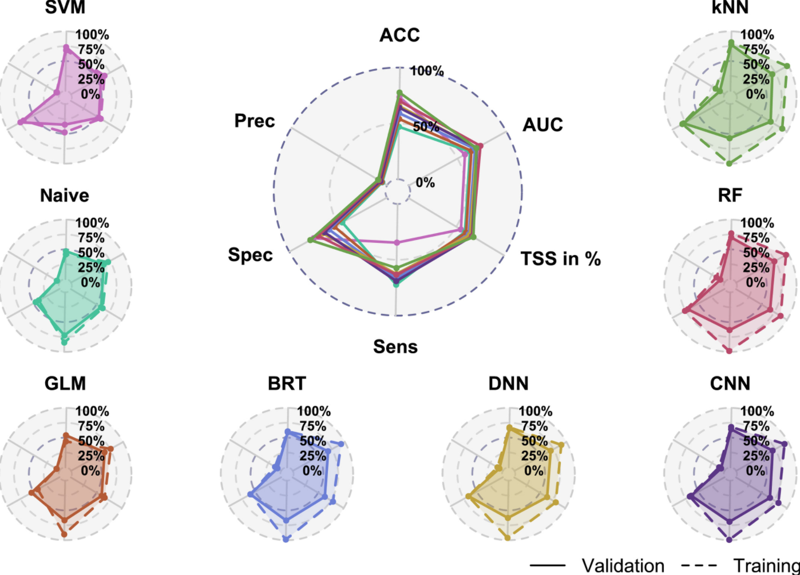

# Data sets {#datasets}

```{=html}
<!-- Put this here (right after the first markdown headline) and only here for each document! -->
<script src="./scripts/multipleChoice.js"></script>
```

You can download the data sets we use in the course <a href="http://rhsbio7.uni-regensburg.de:8500" target="_blank" rel="noopener">here</a> (ignore browser warnings) or by installing the EcoData package:


```r
devtools::install_github(repo = "florianhartig/EcoData", subdir = "EcoData",
                         dependencies = TRUE, build_vignettes = FALSE)
```


## Titanic

The data set is a collection of Titanic passengers with information about their age, class, sex, and their survival status. The competition is simple here: Train a machine learning model and predict the survival probability.

The Titanic data set is very well explored and serves as a stepping stone in many machine learning careers. For inspiration and data exploration notebooks, check out this <a href="https://www.kaggle.com/c/titanic/data" target="_blank" rel="noopener">kaggle competition</a>.

**Response variable:** "survived"

A minimal working example:

1. Load data set:


```r
library(EcoData)

data(titanic_ml)
titanic = titanic_ml
summary(titanic)
#>      pclass         survived          name               sex           age         
#>  Min.   :1.000   Min.   :0.0000   Length:1309        female:466   Min.   : 0.1667  
#>  1st Qu.:2.000   1st Qu.:0.0000   Class :character   male  :843   1st Qu.:21.0000  
#>  Median :3.000   Median :0.0000   Mode  :character                Median :28.0000  
#>  Mean   :2.295   Mean   :0.3853                                   Mean   :29.8811  
#>  3rd Qu.:3.000   3rd Qu.:1.0000                                   3rd Qu.:39.0000  
#>  Max.   :3.000   Max.   :1.0000                                   Max.   :80.0000  
#>                  NA's   :655                                      NA's   :263      
#>      sibsp            parch            ticket          fare        
#>  Min.   :0.0000   Min.   :0.000   CA. 2343:  11   Min.   :  0.000  
#>  1st Qu.:0.0000   1st Qu.:0.000   1601    :   8   1st Qu.:  7.896  
#>  Median :0.0000   Median :0.000   CA 2144 :   8   Median : 14.454  
#>  Mean   :0.4989   Mean   :0.385   3101295 :   7   Mean   : 33.295  
#>  3rd Qu.:1.0000   3rd Qu.:0.000   347077  :   7   3rd Qu.: 31.275  
#>  Max.   :8.0000   Max.   :9.000   347082  :   7   Max.   :512.329  
#>                                   (Other) :1261   NA's   :1        
#>              cabin      embarked      boat          body                      home.dest  
#>                 :1014    :  2           :823   Min.   :  1.0                       :564  
#>  C23 C25 C27    :   6   C:270    13     : 39   1st Qu.: 72.0   New York, NY        : 64  
#>  B57 B59 B63 B66:   5   Q:123    C      : 38   Median :155.0   London              : 14  
#>  G6             :   5   S:914    15     : 37   Mean   :160.8   Montreal, PQ        : 10  
#>  B96 B98        :   4            14     : 33   3rd Qu.:256.0   Cornwall / Akron, OH:  9  
#>  C22 C26        :   4            4      : 31   Max.   :328.0   Paris, France       :  9  
#>  (Other)        : 271            (Other):308   NA's   :1188    (Other)             :639
```

2. Impute missing values (not our response variable!):


```r
library(missRanger)
library(dplyr)
set.seed(123)

titanic_imputed = titanic %>% select(-name, -ticket, -cabin, -boat, -home.dest)
titanic_imputed = missRanger::missRanger(data = titanic_imputed %>%
                                           select(-survived))
#> 
#> Missing value imputation by random forests
#> 
#>   Variables to impute:		age, fare, body
#>   Variables used to impute:	pclass, sex, age, sibsp, parch, fare, embarked, body
#> iter 1:	...
#> iter 2:	...
#> iter 3:	...
#> iter 4:	...
titanic_imputed$survived = titanic$survived
```

3. Split into training and test set:


```r
train = titanic_imputed[!is.na(titanic$survived), ]
test = titanic_imputed[is.na(titanic$survived), ]
```

4. Train model:


```r
model = glm(survived~., data = train, family = binomial())
```

5. Predictions:


```r
preds = predict(model, data = test, type = "response")
head(preds)
#>        561        321       1177       1098       1252       1170 
#> 0.79511615 0.29231652 0.01461978 0.12323274 0.14130063 0.11847391
```

6. Create submission csv:


```r
write.csv(data.frame(y = preds), file = "glm.csv")
```

And submit the csv on <a href="http://rhsbio7.uni-regensburg.de:8500" target="_blank" rel="noopener">http://rhsbio7.uni-regensburg.de:8500</a>.


## Plant-pollinator Database

The plant-pollinator database is a collection of plant-pollinator interactions with traits for plants and pollinators. The idea is pollinators interact with plants when their traits fit (e.g. the tongue of a bee needs to match the shape of a flower).
We explored the advantage of machine learning algorithms over traditional statistical models in predicting species interactions in our paper. If you are interested you can have a look <a href="https://besjournals.onlinelibrary.wiley.com/doi/full/10.1111/2041-210X.13329" target="_blank" rel="noopener">here</a>.



**Response variable:** "interaction"

A minimal working example:

1. Load data set:


```r
library(EcoData)

data(plantPollinator_df)
plant_poll = plantPollinator_df
summary(plant_poll)
#>                    crop                       insect          type          
#>  Vaccinium_corymbosum:  256   Andrena_wilkella   :   80   Length:20480      
#>  Brassica_napus      :  256   Andrena_barbilabris:   80   Class :character  
#>  Carum_carvi         :  256   Andrena_cineraria  :   80   Mode  :character  
#>  Coriandrum_sativum  :  256   Andrena_flavipes   :   80                     
#>  Daucus_carota       :  256   Andrena_gravida    :   80                     
#>  Malus_domestica     :  256   Andrena_haemorrhoa :   80                     
#>  (Other)             :18944   (Other)            :20000                     
#>     season             diameter        corolla             colour         
#>  Length:20480       Min.   :  2.00   Length:20480       Length:20480      
#>  Class :character   1st Qu.:  5.00   Class :character   Class :character  
#>  Mode  :character   Median : 19.00   Mode  :character   Mode  :character  
#>                     Mean   : 27.03                                        
#>                     3rd Qu.: 25.00                                        
#>                     Max.   :150.00                                        
#>                     NA's   :9472                                          
#>     nectar            b.system         s.pollination      inflorescence     
#>  Length:20480       Length:20480       Length:20480       Length:20480      
#>  Class :character   Class :character   Class :character   Class :character  
#>  Mode  :character   Mode  :character   Mode  :character   Mode  :character  
#>                                                                             
#>                                                                             
#>                                                                             
#>                                                                             
#>   composite            guild               tongue            body      
#>  Length:20480       Length:20480       Min.   : 2.000   Min.   : 2.00  
#>  Class :character   Class :character   1st Qu.: 4.800   1st Qu.: 8.00  
#>  Mode  :character   Mode  :character   Median : 6.600   Median :10.50  
#>                                        Mean   : 8.104   Mean   :10.66  
#>                                        3rd Qu.:10.500   3rd Qu.:13.00  
#>                                        Max.   :26.400   Max.   :25.00  
#>                                        NA's   :17040    NA's   :6160   
#>   sociality           feeding          interaction 
#>  Length:20480       Length:20480       0   :14095  
#>  Class :character   Class :character   1   :  595  
#>  Mode  :character   Mode  :character   NA's: 5790  
#>                                                    
#>                                                    
#>                                                    
#> 
```

2. Impute missing values (not our response variable!)
We will select only a few predictors here (you can work with all predictors of course).


```r
library(missRanger)
library(dplyr)
set.seed(123)

plant_poll_imputed = plant_poll %>% select(diameter,
                                           corolla,
                                           tongue,
                                           body,
                                           interaction)
plant_poll_imputed = missRanger::missRanger(data = plant_poll_imputed %>%
                                              select(-interaction))
#> 
#> Missing value imputation by random forests
#> 
#>   Variables to impute:		diameter, corolla, tongue, body
#>   Variables used to impute:	diameter, corolla, tongue, body
#> iter 1:	....
#> iter 2:	....
#> iter 3:	....
#> iter 4:	....
plant_poll_imputed$interaction = plant_poll$interaction
```

3. Split into training and test set:


```r
train = plant_poll_imputed[!is.na(plant_poll_imputed$interaction), ]
test = plant_poll_imputed[is.na(plant_poll_imputed$interaction), ]
```

4. Train model:


```r
model = glm(interaction~., data = train, family = binomial())
```

5. Predictions:


```r
preds = predict(model, newdata = test, type = "response")
head(preds)
#>          1          2          3          4          5          6 
#> 0.02887581 0.04972722 0.03670465 0.03670465 0.02713261 0.03996870
```

6. Create submission csv:


```r
write.csv(data.frame(y = preds), file = "glm.csv")
```


## Wine

The data set is a collection of wines of different quality. The aim is to predict the quality of the wine based on physiochemical predictors. 

For inspiration and data exploration notebooks, check out this <a href="https://www.kaggle.com/uciml/red-wine-quality-cortez-et-al-2009" target="_blank" rel="noopener">kaggle competition</a>.
For instance, check out this very nice <a href="https://www.kaggle.com/aditimulye/red-wine-quality-assesment-starter-pack" target="_blank" rel="noopener">notebook</a> which removes a few problems from the data. 

**Response variable:** "quality"

We could theoretically use a regression model for this task but we will stick with a classification model.

A minimal working example:

1. Load data set:


```r
library(EcoData)

data(wine)
summary(wine)
#>  fixed.acidity    volatile.acidity  citric.acid     residual.sugar     chlorides      
#>  Min.   : 4.600   Min.   :0.1200   Min.   :0.0000   Min.   : 0.900   Min.   :0.01200  
#>  1st Qu.: 7.100   1st Qu.:0.3900   1st Qu.:0.0900   1st Qu.: 1.900   1st Qu.:0.07000  
#>  Median : 7.900   Median :0.5200   Median :0.2600   Median : 2.200   Median :0.07900  
#>  Mean   : 8.335   Mean   :0.5284   Mean   :0.2705   Mean   : 2.533   Mean   :0.08747  
#>  3rd Qu.: 9.300   3rd Qu.:0.6400   3rd Qu.:0.4200   3rd Qu.: 2.600   3rd Qu.:0.09000  
#>  Max.   :15.900   Max.   :1.5800   Max.   :1.0000   Max.   :15.500   Max.   :0.61100  
#>  NA's   :70       NA's   :48       NA's   :41       NA's   :60       NA's   :37       
#>  free.sulfur.dioxide total.sulfur.dioxide    density             pH       
#>  Min.   : 1.00       Min.   :  6.00       Min.   :0.9901   Min.   :2.740  
#>  1st Qu.: 7.00       1st Qu.: 22.00       1st Qu.:0.9956   1st Qu.:3.210  
#>  Median :14.00       Median : 38.00       Median :0.9968   Median :3.310  
#>  Mean   :15.83       Mean   : 46.23       Mean   :0.9968   Mean   :3.311  
#>  3rd Qu.:21.00       3rd Qu.: 62.00       3rd Qu.:0.9979   3rd Qu.:3.400  
#>  Max.   :72.00       Max.   :289.00       Max.   :1.0037   Max.   :4.010  
#>  NA's   :78          NA's   :78           NA's   :78       NA's   :25     
#>    sulphates         alcohol         quality     
#>  Min.   :0.3300   Min.   : 8.40   Min.   :3.000  
#>  1st Qu.:0.5500   1st Qu.: 9.50   1st Qu.:5.000  
#>  Median :0.6200   Median :10.20   Median :6.000  
#>  Mean   :0.6572   Mean   :10.42   Mean   :5.596  
#>  3rd Qu.:0.7300   3rd Qu.:11.10   3rd Qu.:6.000  
#>  Max.   :2.0000   Max.   :14.90   Max.   :8.000  
#>  NA's   :51                       NA's   :905
```

2. Impute missing values (not our response variable!).


```r
library(missRanger)
library(dplyr)
set.seed(123)

wine_imputed = missRanger::missRanger(data = wine %>% select(-quality))
#> 
#> Missing value imputation by random forests
#> 
#>   Variables to impute:		fixed.acidity, volatile.acidity, citric.acid, residual.sugar, chlorides, free.sulfur.dioxide, total.sulfur.dioxide, density, pH, sulphates
#>   Variables used to impute:	fixed.acidity, volatile.acidity, citric.acid, residual.sugar, chlorides, free.sulfur.dioxide, total.sulfur.dioxide, density, pH, sulphates, alcohol
#> iter 1:	..........
#> iter 2:	..........
#> iter 3:	..........
#> iter 4:	..........
#> iter 5:	..........
#> iter 6:	..........
#> iter 7:	..........
wine_imputed$quality = wine$quality
```

3. Split into training and test set:


```r
train = wine_imputed[!is.na(wine$quality), ]
test = wine_imputed[is.na(wine$quality), ]
```

4. Train model:


```r
library(ranger)
set.seed(123)

rf = ranger(quality~., data = train, classification = TRUE)
```

5. Predictions:


```r
preds = predict(rf, data = test)$predictions
head(preds)
#> [1] 6 5 5 7 6 6
```

6. Create submission csv:


```r
write.csv(data.frame(y = preds), file = "rf.csv")
```


## Nasa

A collection about asteroids and their characteristics from kaggle. The aim is to predict whether the asteroids are hazardous or not. 
For inspiration and data exploration notebooks, check out this <a href="https://www.kaggle.com/shrutimehta/nasa-asteroids-classification" target="_blank" rel="noopener">kaggle competition</a>.

**Response variable:** "Hazardous"

1. Load data set:


```r
library(EcoData)

data(nasa)
summary(nasa)
#>  Neo.Reference.ID       Name         Absolute.Magnitude Est.Dia.in.KM.min.
#>  Min.   :2000433   Min.   :2000433   Min.   :11.16      Min.   : 0.00101  
#>  1st Qu.:3102682   1st Qu.:3102683   1st Qu.:20.10      1st Qu.: 0.03346  
#>  Median :3514800   Median :3514800   Median :21.90      Median : 0.11080  
#>  Mean   :3272675   Mean   :3273113   Mean   :22.27      Mean   : 0.20523  
#>  3rd Qu.:3690987   3rd Qu.:3690385   3rd Qu.:24.50      3rd Qu.: 0.25384  
#>  Max.   :3781897   Max.   :3781897   Max.   :32.10      Max.   :15.57955  
#>  NA's   :53        NA's   :57        NA's   :36         NA's   :60        
#>  Est.Dia.in.KM.max. Est.Dia.in.M.min.   Est.Dia.in.M.max.  Est.Dia.in.Miles.min.
#>  Min.   : 0.00226   Min.   :    1.011   Min.   :    2.26   Min.   :0.00063      
#>  1st Qu.: 0.07482   1st Qu.:   33.462   1st Qu.:   74.82   1st Qu.:0.02079      
#>  Median : 0.24777   Median :  110.804   Median :  247.77   Median :0.06885      
#>  Mean   : 0.45754   Mean   :  204.649   Mean   :  458.45   Mean   :0.12734      
#>  3rd Qu.: 0.56760   3rd Qu.:  253.837   3rd Qu.:  567.60   3rd Qu.:0.15773      
#>  Max.   :34.83694   Max.   :15579.552   Max.   :34836.94   Max.   :9.68068      
#>  NA's   :23         NA's   :29          NA's   :46         NA's   :42           
#>  Est.Dia.in.Miles.max. Est.Dia.in.Feet.min. Est.Dia.in.Feet.max. Close.Approach.Date
#>  Min.   : 0.00140      Min.   :    3.32     Min.   :     7.41    2016-07-22:  18    
#>  1st Qu.: 0.04649      1st Qu.:  109.78     1st Qu.:   245.49    2015-01-15:  17    
#>  Median : 0.15395      Median :  363.53     Median :   812.88    2015-02-15:  16    
#>  Mean   : 0.28486      Mean   :  670.44     Mean   :  1500.77    2007-11-08:  15    
#>  3rd Qu.: 0.35269      3rd Qu.:  832.80     3rd Qu.:  1862.19    2012-01-15:  15    
#>  Max.   :21.64666      Max.   :51114.02     Max.   :114294.42    (Other)   :4577    
#>  NA's   :50            NA's   :21           NA's   :46           NA's      :  29    
#>  Epoch.Date.Close.Approach Relative.Velocity.km.per.sec Relative.Velocity.km.per.hr
#>  Min.   :7.889e+11         Min.   : 0.3355              Min.   :  1208             
#>  1st Qu.:1.016e+12         1st Qu.: 8.4497              1st Qu.: 30399             
#>  Median :1.203e+12         Median :12.9370              Median : 46532             
#>  Mean   :1.180e+12         Mean   :13.9848              Mean   : 50298             
#>  3rd Qu.:1.356e+12         3rd Qu.:18.0774              3rd Qu.: 65068             
#>  Max.   :1.473e+12         Max.   :44.6337              Max.   :160681             
#>  NA's   :43                NA's   :27                   NA's   :28                 
#>  Miles.per.hour    Miss.Dist..Astronomical. Miss.Dist..lunar.   Miss.Dist..kilometers.
#>  Min.   :  750.5   Min.   :0.00018          Min.   :  0.06919   Min.   :   26610      
#>  1st Qu.:18846.7   1st Qu.:0.13341          1st Qu.: 51.89874   1st Qu.:19964907      
#>  Median :28893.7   Median :0.26497          Median :103.19415   Median :39685408      
#>  Mean   :31228.0   Mean   :0.25690          Mean   : 99.91366   Mean   :38436154      
#>  3rd Qu.:40436.9   3rd Qu.:0.38506          3rd Qu.:149.59244   3rd Qu.:57540318      
#>  Max.   :99841.2   Max.   :0.49988          Max.   :194.45491   Max.   :74781600      
#>  NA's   :38        NA's   :60               NA's   :30          NA's   :56            
#>  Miss.Dist..miles.  Orbiting.Body    Orbit.ID             Orbit.Determination.Date
#>  Min.   :   16535   Earth:4665    Min.   :  1.00   2017-06-21 06:17:20:   9       
#>  1st Qu.:12454813   NA's :  22    1st Qu.:  9.00   2017-04-06 08:57:13:   8       
#>  Median :24662435                 Median : 16.00   2017-04-06 09:24:24:   8       
#>  Mean   :23885560                 Mean   : 28.34   2017-04-06 08:24:13:   7       
#>  3rd Qu.:35714721                 3rd Qu.: 31.00   2017-04-06 08:26:19:   7       
#>  Max.   :46467132                 Max.   :611.00   (Other)            :4622       
#>  NA's   :27                       NA's   :33       NA's               :  26       
#>  Orbit.Uncertainity Minimum.Orbit.Intersection Jupiter.Tisserand.Invariant
#>  Min.   :0.000      Min.   :0.00000            Min.   :2.196              
#>  1st Qu.:0.000      1st Qu.:0.01435            1st Qu.:4.047              
#>  Median :3.000      Median :0.04653            Median :5.071              
#>  Mean   :3.521      Mean   :0.08191            Mean   :5.056              
#>  3rd Qu.:6.000      3rd Qu.:0.12150            3rd Qu.:6.017              
#>  Max.   :9.000      Max.   :0.47789            Max.   :9.025              
#>  NA's   :49         NA's   :137                NA's   :56                 
#>  Epoch.Osculation   Eccentricity     Semi.Major.Axis   Inclination      
#>  Min.   :2450164   Min.   :0.00752   Min.   :0.6159   Min.   : 0.01451  
#>  1st Qu.:2458000   1st Qu.:0.24086   1st Qu.:1.0012   1st Qu.: 4.93290  
#>  Median :2458000   Median :0.37251   Median :1.2422   Median :10.27694  
#>  Mean   :2457723   Mean   :0.38267   Mean   :1.4009   Mean   :13.36159  
#>  3rd Qu.:2458000   3rd Qu.:0.51256   3rd Qu.:1.6782   3rd Qu.:19.47848  
#>  Max.   :2458020   Max.   :0.96026   Max.   :5.0720   Max.   :75.40667  
#>  NA's   :60        NA's   :39        NA's   :53       NA's   :42        
#>  Asc.Node.Longitude Orbital.Period   Perihelion.Distance Perihelion.Arg    
#>  Min.   :  0.0019   Min.   : 176.6   Min.   :0.08074     Min.   :  0.0069  
#>  1st Qu.: 83.1849   1st Qu.: 365.9   1st Qu.:0.63038     1st Qu.: 95.6430  
#>  Median :172.6347   Median : 504.9   Median :0.83288     Median :189.7729  
#>  Mean   :172.1717   Mean   : 635.5   Mean   :0.81316     Mean   :184.0185  
#>  3rd Qu.:254.8804   3rd Qu.: 793.1   3rd Qu.:0.99718     3rd Qu.:271.9535  
#>  Max.   :359.9059   Max.   :4172.2   Max.   :1.29983     Max.   :359.9931  
#>  NA's   :60         NA's   :46       NA's   :22          NA's   :48        
#>  Aphelion.Dist    Perihelion.Time    Mean.Anomaly       Mean.Motion       Equinox    
#>  Min.   :0.8038   Min.   :2450100   Min.   :  0.0032   Min.   :0.08628   J2000:4663  
#>  1st Qu.:1.2661   1st Qu.:2457815   1st Qu.: 87.0069   1st Qu.:0.45147   NA's :  24  
#>  Median :1.6182   Median :2457972   Median :186.0219   Median :0.71137               
#>  Mean   :1.9864   Mean   :2457726   Mean   :181.2882   Mean   :0.73732               
#>  3rd Qu.:2.4497   3rd Qu.:2458108   3rd Qu.:276.6418   3rd Qu.:0.98379               
#>  Max.   :8.9839   Max.   :2458839   Max.   :359.9180   Max.   :2.03900               
#>  NA's   :38       NA's   :59        NA's   :40         NA's   :48                    
#>    Hazardous    
#>  Min.   :0.000  
#>  1st Qu.:0.000  
#>  Median :0.000  
#>  Mean   :0.176  
#>  3rd Qu.:0.000  
#>  Max.   :1.000  
#>  NA's   :4187
```

2. Impute missing values (not our response variable!):


```r
library(missRanger)
library(dplyr)
set.seed(123)

nasa_imputed = missRanger::missRanger(data = nasa %>% select(-Hazardous),
                                      maxiter = 1, num.trees = 5L)
#> 
#> Missing value imputation by random forests
#> 
#>   Variables to impute:		Neo.Reference.ID, Name, Absolute.Magnitude, Est.Dia.in.KM.min., Est.Dia.in.KM.max., Est.Dia.in.M.min., Est.Dia.in.M.max., Est.Dia.in.Miles.min., Est.Dia.in.Miles.max., Est.Dia.in.Feet.min., Est.Dia.in.Feet.max., Close.Approach.Date, Epoch.Date.Close.Approach, Relative.Velocity.km.per.sec, Relative.Velocity.km.per.hr, Miles.per.hour, Miss.Dist..Astronomical., Miss.Dist..lunar., Miss.Dist..kilometers., Miss.Dist..miles., Orbiting.Body, Orbit.ID, Orbit.Determination.Date, Orbit.Uncertainity, Minimum.Orbit.Intersection, Jupiter.Tisserand.Invariant, Epoch.Osculation, Eccentricity, Semi.Major.Axis, Inclination, Asc.Node.Longitude, Orbital.Period, Perihelion.Distance, Perihelion.Arg, Aphelion.Dist, Perihelion.Time, Mean.Anomaly, Mean.Motion, Equinox
#>   Variables used to impute:	Neo.Reference.ID, Name, Absolute.Magnitude, Est.Dia.in.KM.min., Est.Dia.in.KM.max., Est.Dia.in.M.min., Est.Dia.in.M.max., Est.Dia.in.Miles.min., Est.Dia.in.Miles.max., Est.Dia.in.Feet.min., Est.Dia.in.Feet.max., Close.Approach.Date, Epoch.Date.Close.Approach, Relative.Velocity.km.per.sec, Relative.Velocity.km.per.hr, Miles.per.hour, Miss.Dist..Astronomical., Miss.Dist..lunar., Miss.Dist..kilometers., Miss.Dist..miles., Orbiting.Body, Orbit.ID, Orbit.Determination.Date, Orbit.Uncertainity, Minimum.Orbit.Intersection, Jupiter.Tisserand.Invariant, Epoch.Osculation, Eccentricity, Semi.Major.Axis, Inclination, Asc.Node.Longitude, Orbital.Period, Perihelion.Distance, Perihelion.Arg, Aphelion.Dist, Perihelion.Time, Mean.Anomaly, Mean.Motion, Equinox
#> iter 1:	.......................................
nasa_imputed$Hazardous = nasa$Hazardous
```

3. Split into training and test set:


```r
train = nasa_imputed[!is.na(nasa$Hazardous), ]
test = nasa_imputed[is.na(nasa$Hazardous), ]
```

4. Train model:


```r
library(ranger)
set.seed(123)

rf = ranger(Hazardous~., data = train, classification = TRUE,
            probability = TRUE)
```

5. Predictions:


```r
preds = predict(rf, data = test)$predictions[,2]
head(preds)
#> [1] 0.6454968 0.7883127 0.0050000 0.8353611 0.1265778 0.1251611
```

6. Create submission csv:


```r
write.csv(data.frame(y = preds), file = "rf.csv")
```


## Flower

A collection of over 4000 flower images of 5 plant species. The data set is from <a href="https://www.kaggle.com/alxmamaev/flowers-recognition" target="_blank" rel="noopener">kaggle</a> but we downsampled the images from $320*240$ to $80*80$ pixels. 
You can a) download the data set <a href="http://rhsbio7.uni-regensburg.de:8500" target="_blank" rel="noopener">here</a> or b) get it via the EcoData package.

**Notes:**

* Check out convolutional neural network notebooks on kaggle (they are often written in Python but you can still copy the architectures), e.g. <a href="https://www.kaggle.com/alirazaaliqadri/flower-recognition-tensorflow-keras-sequential" target="_blank" rel="noopener">this one</a>.
* Last year's winners have used a transfer learning approach (they achieved around 70% accuracy), check out this <a href="https://www.kaggle.com/stpeteishii/flower-name-classify-densenet201" target="_blank" rel="noopener">notebook</a>, see also the section about transfer learning \@ref(transfer).

**Response variable:** "Plant species"

1. Load data set:


```r
library(tensorflow)
library(keras)
set_random_seed(321L, disable_gpu = FALSE)	# Already sets R's random seed.

train = EcoData::dataset_flower()$train/255
test = EcoData::dataset_flower()$test/255
labels = EcoData::dataset_flower()$labels
```

Let's visualize a flower:


```r
train[100,,,] %>%
  image_to_array() %>%
  as.raster() %>%
  plot()
```


2. Build and train model:


```r
model = keras_model_sequential()
model %>% 
  layer_conv_2d(filters = 4L, kernel_size = 2L,
                input_shape = list(80L, 80L, 3L)) %>% 
  layer_max_pooling_2d() %>% 
  layer_flatten() %>% 
  layer_dense(units = 5L, activation = "softmax")

### Model fitting ###

model %>% 
  compile(loss = loss_categorical_crossentropy, 
          optimizer = optimizer_adamax(learning_rate = 0.01))

model %>% 
  fit(x = train, y = keras::k_one_hot(labels, 5L))

```

3. Predictions:


```r
# Prediction on training data:
pred = apply(model %>% predict(train), 1, which.max)
Metrics::accuracy(pred - 1L, labels)
table(pred)

# Prediction for the submission server:
pred = model %>% predict(test) %>% apply(1, which.max) - 1L
table(pred)
```

4. Create submission csv:


```r
write.csv(data.frame(y = pred), file = "cnn.csv")
```

